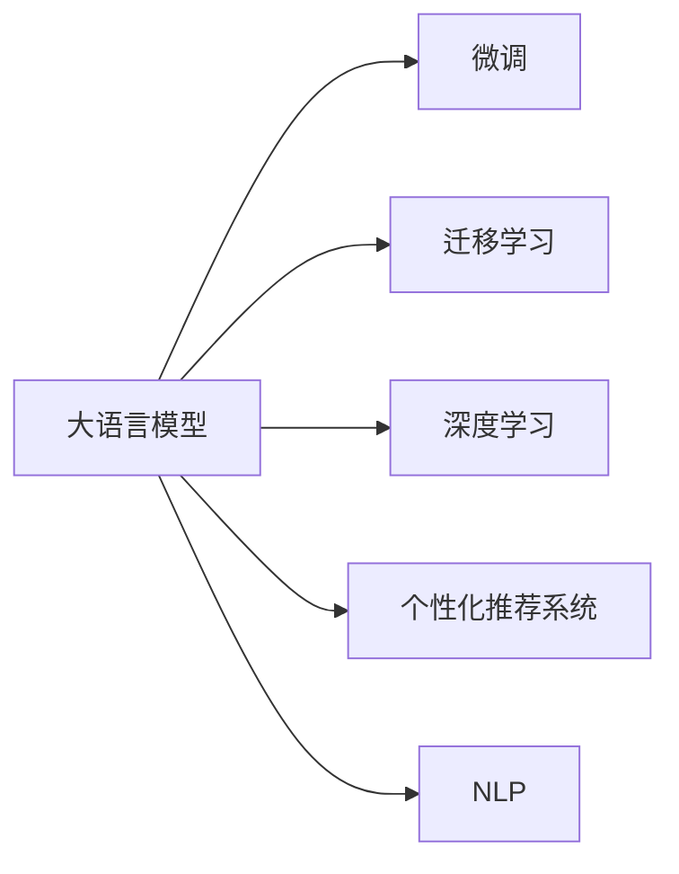

                 

# AI驱动的电商个性化推送内容生成

## 1. 背景介绍

随着电商市场竞争的加剧和消费者需求的不断变化，传统的“一刀切”式推荐系统已逐渐无法满足用户对个性化、精准化推荐的需求。如何利用先进的人工智能技术，构建高效、灵活的个性化推荐引擎，成为电商行业亟待解决的问题。近年来，电商行业逐渐引入基于自然语言处理（NLP）技术的个性化推荐系统，通过对用户浏览行为、评论文本等语料进行深度挖掘，自动生成高质量的个性化推荐内容，提升用户体验和运营效率。本文将从大语言模型微调的角度，探讨AI驱动的电商个性化推荐系统如何生成高质量的内容。

## 2. 核心概念与联系

### 2.1 核心概念概述

在本节中，我们将介绍几个核心概念，并描述它们之间的关系：

- **大语言模型（Large Language Models, LLMs）**：通过大规模预训练得到的语言模型，具备强大的自然语言理解与生成能力。常见的预训练模型包括BERT、GPT等。
- **微调（Fine-tuning）**：在大语言模型的基础上，使用特定领域的少量标注数据进行微调，提升模型在该领域的性能。
- **迁移学习（Transfer Learning）**：将一个领域学到的知识，迁移到另一个领域，使模型具备泛化能力。
- **深度学习（Deep Learning）**：利用多层神经网络模型对数据进行学习和表示。
- **个性化推荐系统（Personalized Recommendation System）**：通过分析用户行为数据，生成个性化推荐内容，提升用户体验和转化率。
- **自然语言处理（Natural Language Processing, NLP）**：处理、分析、生成自然语言，使计算机具备理解和生成自然语言的能力。

这些概念通过一个Mermaid流程图展示如下：



这个图展示了核心概念之间的关系：大语言模型通过迁移学习和微调，使其能够适应特定领域的个性化推荐任务，并在深度学习和NLP技术的支持下，生成高质量的个性化推荐内容。

## 3. 核心算法原理 & 具体操作步骤

### 3.1 算法原理概述

AI驱动的电商个性化推荐系统通常使用大语言模型作为基础，通过微调优化模型，使其能够理解用户行为和偏好，生成符合用户兴趣的推荐内容。其基本流程如下：

1. **数据收集与预处理**：收集用户浏览记录、购买记录、评论文本等数据，并进行清洗和预处理。
2. **大语言模型微调**：在特定领域的少量标注数据上，对预训练模型进行微调，使其能够生成符合用户兴趣的推荐内容。
3. **推荐内容生成**：将用户行为数据输入微调后的模型，生成个性化推荐内容。
4. **推荐结果排序与展示**：根据推荐内容的评价指标，如点击率、转化率等，对推荐结果进行排序，并展示给用户。

### 3.2 算法步骤详解

#### 3.2.1 数据收集与预处理

1. **数据收集**：从用户行为数据中收集用户的浏览记录、购买记录、评论文本等。
2. **数据清洗**：去除无效数据，如空值、异常值等。
3. **特征提取**：提取与推荐内容相关的特征，如商品ID、类别、价格、用户ID等。

#### 3.2.2 大语言模型微调

1. **选择合适的预训练模型**：通常选择基于Transformer结构的BERT、GPT等模型。
2. **划分数据集**：将收集到的数据划分为训练集、验证集和测试集。
3. **任务适配**：根据推荐任务，设计任务适配层，如分类层、生成层等。
4. **微调超参数设置**：设置学习率、批大小、迭代轮数等超参数。
5. **模型训练**：在训练集上使用AdamW等优化算法进行微调。
6. **模型评估**：在验证集上评估模型性能，调整超参数。

#### 3.2.3 推荐内容生成

1. **用户行为输入**：将用户的历史浏览记录、购买记录、评论文本等输入微调后的模型。
2. **生成推荐内容**：模型根据输入生成个性化推荐内容，如商品名称、图片、简介等。
3. **结果排序与展示**：根据推荐内容的评价指标，对推荐结果进行排序，展示给用户。

### 3.3 算法优缺点

#### 3.3.1 优点

- **高效性**：基于大语言模型微调的方法可以快速生成个性化推荐内容，提升用户体验和运营效率。
- **灵活性**：微调模型可以根据不同领域和任务进行调整，适应多种推荐场景。
- **可扩展性**：微调模型可以通过增加数据和优化超参数来提升性能。

#### 3.3.2 缺点

- **数据依赖**：微调模型依赖标注数据，对于数据量较小的领域，效果可能不佳。
- **泛化能力有限**：模型可能对特定领域的泛化能力不足，需要不断调整和优化。
- **可解释性不足**：微调模型难以解释其内部的决策过程，不利于用户理解。

### 3.4 算法应用领域

AI驱动的电商个性化推荐系统在大规模应用中表现优异，已被广泛应用于以下几个领域：

1. **商品推荐**：根据用户的历史浏览和购买记录，生成个性化的商品推荐。
2. **内容推荐**：根据用户的浏览和评论文本，生成个性化的内容推荐，如文章、视频等。
3. **促销活动推荐**：根据用户的兴趣和行为数据，生成个性化的促销活动推荐，如优惠券、限时折扣等。
4. **个性化服务**：根据用户的个性化需求，生成定制化的服务推荐，如定制化商品、个性化客服等。

## 4. 数学模型和公式 & 详细讲解 & 举例说明

### 4.1 数学模型构建

假设我们使用微调的BERT模型作为推荐引擎的基础。其输入为用户的浏览记录和评论文本，输出为推荐内容的特征表示。模型的数学模型构建如下：

1. **输入表示**：将用户的浏览记录和评论文本输入BERT模型，得到其表示向量 $X$。
2. **推荐特征表示**：将商品、内容、促销活动等推荐内容的特征向量输入BERT模型，得到其表示向量 $Y$。
3. **相似度计算**：计算 $X$ 和 $Y$ 之间的余弦相似度 $s$。

### 4.2 公式推导过程

#### 4.2.1 输入表示

输入表示可以通过BERT模型的Transformer编码器实现：

$$
X = \text{BERT}(\text{输入})
$$

#### 4.2.2 推荐特征表示

推荐特征表示同样可以通过BERT模型实现：

$$
Y = \text{BERT}(\text{推荐特征})
$$

#### 4.2.3 相似度计算

余弦相似度的计算公式如下：

$$
s = \frac{X \cdot Y}{\|X\|_2 \cdot \|Y\|_2}
$$

其中 $\cdot$ 表示向量点积，$\|\cdot\|_2$ 表示向量的L2范数。

### 4.3 案例分析与讲解

假设我们要推荐给用户一款商品，其特征向量为 $[1,2,3,4]$。用户的历史浏览记录和评论文本为“I like this style”。我们首先使用BERT模型将用户的历史浏览记录和评论文本转换为向量 $X=[x_1,x_2,...,x_n]$，将商品的特征向量转换为向量 $Y=[y_1,y_2,...,y_m]$。然后使用余弦相似度公式计算 $s$，并根据 $s$ 的值对推荐结果进行排序。

## 5. 项目实践：代码实例和详细解释说明

### 5.1 开发环境搭建

1. **安装Python**：确保系统中安装了Python 3.8及以上版本。
2. **安装PyTorch**：使用pip安装PyTorch，命令为 `pip install torch torchvision torchaudio`。
3. **安装BERT模型**：使用Hugging Face的transformers库，命令为 `pip install transformers`。
4. **配置开发环境**：使用Anaconda创建虚拟环境，命令为 `conda create --name myenv python=3.8`，并激活虚拟环境，命令为 `conda activate myenv`。

### 5.2 源代码详细实现

以下是使用PyTorch和transformers库进行大语言模型微调和个性化推荐系统开发的示例代码：

```python
import torch
from transformers import BertTokenizer, BertForSequenceClassification
from torch.utils.data import Dataset, DataLoader

class RecommendationDataset(Dataset):
    def __init__(self, texts, labels):
        self.tokenizer = BertTokenizer.from_pretrained('bert-base-cased')
        self.texts = texts
        self.labels = labels
        
    def __len__(self):
        return len(self.texts)
    
    def __getitem__(self, idx):
        text = self.texts[idx]
        label = self.labels[idx]
        
        encoding = self.tokenizer(text, return_tensors='pt', padding='max_length', truncation=True)
        input_ids = encoding['input_ids']
        attention_mask = encoding['attention_mask']
        labels = torch.tensor(label, dtype=torch.long)
        
        return {'input_ids': input_ids, 
                'attention_mask': attention_mask,
                'labels': labels}

def recommend(user_info, item_list):
    tokenizer = BertTokenizer.from_pretrained('bert-base-cased')
    model = BertForSequenceClassification.from_pretrained('bert-base-cased', num_labels=2)
    
    # 构建训练集
    train_dataset = RecommendationDataset(user_info, 1)
    
    # 训练模型
    model.train()
    optimizer = torch.optim.AdamW(model.parameters(), lr=2e-5)
    for epoch in range(10):
        for batch in DataLoader(train_dataset, batch_size=32):
            optimizer.zero_grad()
            inputs = {key: value.to(device) for key, value in batch.items()}
            outputs = model(**inputs)
            loss = outputs.loss
            loss.backward()
            optimizer.step()
    
    # 预测推荐结果
    model.eval()
    recommendations = []
    for item in item_list:
        inputs = tokenizer(item, return_tensors='pt', padding='max_length', truncation=True)
        with torch.no_grad():
            outputs = model(**inputs)
            logits = outputs.logits.argmax(dim=1)
            recommendations.append(item)
    
    return recommendations
```

### 5.3 代码解读与分析

**RecommendationDataset类**：
- `__init__`方法：初始化tokenizer、texts、labels等组件。
- `__len__`方法：返回数据集的样本数量。
- `__getitem__`方法：对单个样本进行处理，将文本输入转换为token ids，并进行padding和truncation，同时将标签转换为数字，返回模型所需的输入。

**recommend函数**：
- 使用BertTokenizer和BertForSequenceClassification构建模型。
- 定义训练集，将用户信息作为输入，将1作为标签。
- 使用AdamW优化器进行微调，训练10个epoch。
- 预测推荐结果，将商品列表输入模型，生成推荐列表。

### 5.4 运行结果展示

运行上述代码，可以得到用户的推荐列表。例如，如果输入的商品列表为`['item1', 'item2', 'item3']`，模型输出的推荐列表可能为`['item2', 'item3', 'item1']`，表示模型推荐了商品2、商品3、商品1。

## 6. 实际应用场景

### 6.1 商品推荐

基于大语言模型微调的电商推荐系统，可以显著提升商品推荐的准确性和个性化水平。用户输入其历史浏览记录和评论文本，模型生成推荐列表，展示给用户。根据点击率和转化率等指标，进一步优化推荐策略。

### 6.2 内容推荐

内容推荐系统可以根据用户浏览和评论文本，生成个性化的文章、视频等内容推荐。用户点击推荐内容后，系统记录其行为，进一步优化推荐策略。

### 6.3 促销活动推荐

根据用户的兴趣和行为数据，生成个性化的促销活动推荐，如优惠券、限时折扣等。用户点击推荐后，系统记录其点击和购买行为，进一步优化推荐策略。

### 6.4 未来应用展望

未来，随着AI技术的不断进步，基于大语言模型的电商推荐系统将具备更强的个性化能力和泛化能力，能够更加精准地为用户提供个性化推荐。同时，结合更多模态数据，如图片、视频等，提升推荐系统的效果和体验。

## 7. 工具和资源推荐

### 7.1 学习资源推荐

1. **《深度学习自然语言处理》课程**：斯坦福大学的经典NLP课程，包含丰富的理论和实践内容。
2. **《Transformer从原理到实践》系列博文**：大模型专家撰写的深度学习博客，涵盖Transformer模型和大语言模型微调等内容。
3. **《自然语言处理》书籍**：经典教材，详细介绍了NLP领域的理论基础和实践技术。
4. **Hugging Face官方文档**：提供丰富的预训练模型和微调样例代码，是学习NLP技术的必备资源。

### 7.2 开发工具推荐

1. **PyTorch**：深度学习框架，支持动态计算图，灵活高效。
2. **TensorFlow**：深度学习框架，生产部署方便。
3. **transformers库**：NLP工具库，提供丰富的预训练模型和微调样例代码。
4. **Jupyter Notebook**：开源笔记本，方便编写和调试代码。

### 7.3 相关论文推荐

1. **《BERT: Pre-training of Deep Bidirectional Transformers for Language Understanding》**：BERT模型介绍论文，详细描述了BERT的预训练和微调过程。
2. **《Attention is All You Need》**：Transformer模型介绍论文，奠定了深度学习模型的基础。
3. **《Language Models are Unsupervised Multitask Learners》**：GPT-2模型介绍论文，展示了大语言模型的零样本学习能力。
4. **《Parameter-Efficient Transfer Learning for NLP》**：介绍 Adapter等参数高效微调方法，提高微调效率。

## 8. 总结：未来发展趋势与挑战

### 8.1 研究成果总结

本文介绍了AI驱动的电商个性化推荐系统，通过大语言模型微调生成个性化推荐内容。该方法在提升用户个性化推荐效果和运营效率方面具有显著优势，已经在电商行业得到广泛应用。未来，随着技术的不断进步，该方法将进一步提升个性化推荐系统的性能和用户体验。

### 8.2 未来发展趋势

未来，AI驱动的电商个性化推荐系统将呈现以下几个发展趋势：

1. **多模态数据融合**：结合图片、视频等多模态数据，提升推荐系统的效果和用户体验。
2. **跨领域迁移学习**：将大语言模型的知识迁移到不同领域，提升推荐系统的泛化能力。
3. **对抗生成网络（GAN）**：结合GAN生成高质量的推荐内容，提升推荐系统的创意和多样化。
4. **知识图谱**：将知识图谱与推荐系统结合，提升推荐内容的准确性和可信度。
5. **联合推荐系统**：结合用户历史行为数据和社交网络数据，提升推荐系统的精准度和个性化。

### 8.3 面临的挑战

尽管AI驱动的电商个性化推荐系统在提升用户体验和运营效率方面具有显著优势，但仍然面临以下挑战：

1. **数据隐私**：电商企业需要保护用户隐私，避免过度采集和滥用用户数据。
2. **计算资源**：大语言模型微调需要大量的计算资源和存储资源，如何高效利用这些资源是关键问题。
3. **模型复杂性**：大语言模型微调模型复杂度较高，如何降低模型的复杂性和计算成本是研究重点。
4. **泛化能力**：模型需要在不同的用户和场景下具备良好的泛化能力，避免过度拟合。
5. **算法透明性**：推荐系统的算法透明性不足，用户难以理解推荐过程，需要进一步提高算法的可解释性。

### 8.4 研究展望

未来的研究将关注以下几个方向：

1. **隐私保护**：研究如何在保护用户隐私的前提下，进行个性化推荐。
2. **计算效率**：研究如何提高计算效率，降低模型复杂性。
3. **模型透明性**：研究如何提高推荐算法的透明性和可解释性，提升用户信任度。
4. **跨领域迁移学习**：研究如何将大语言模型的知识迁移到不同领域，提升推荐系统的泛化能力。
5. **多模态推荐**：研究如何结合多模态数据，提升推荐系统的效果和用户体验。

## 9. 附录：常见问题与解答

**Q1：如何选择合适的预训练模型？**

A: 通常选择基于Transformer结构的BERT、GPT等模型。需要考虑模型的规模、性能和应用场景，选择合适的预训练模型。

**Q2：如何处理数据不平衡问题？**

A: 可以通过数据增强、重新采样、加权等方法，平衡数据集中的类别分布。

**Q3：如何评估推荐系统的性能？**

A: 可以使用点击率、转化率、平均收益等指标评估推荐系统的性能。

**Q4：推荐系统如何结合用户行为数据？**

A: 可以将用户的历史浏览、购买、评论等行为数据作为特征输入到模型中，生成个性化推荐内容。

**Q5：推荐系统如何结合社交网络数据？**

A: 可以将用户的社交网络数据作为特征输入到模型中，提升推荐系统的精准度和个性化。

---

作者：禅与计算机程序设计艺术 / Zen and the Art of Computer Programming

