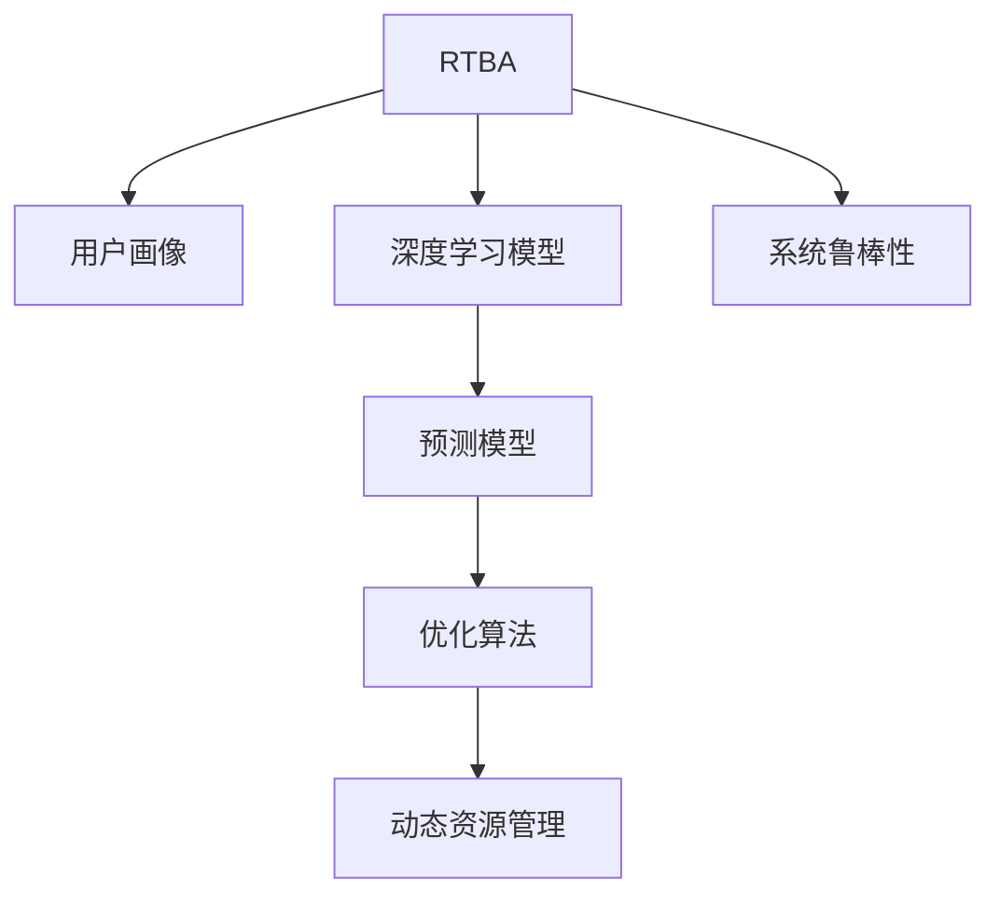

                 

# AI驱动的电商实时竞价广告系统

> 关键词：电商竞价广告系统,AI驱动,实时竞价,机器学习,深度学习,广告投放优化

## 1. 背景介绍

### 1.1 问题由来

随着电子商务市场的快速增长，电商平台成为了商家争夺流量和用户的重要战场。为了有效提高广告投放的ROI，电商平台在广告投放领域引入了一项关键技术——实时竞价广告系统(RTBA, Real-time Bidding Ad System)。实时竞价系统利用机器学习和深度学习技术，能够动态调整广告出价，确保广告预算的最优利用，提升广告效果。

然而，传统的RTBA系统往往依赖于静态模型和规则，无法及时响应广告市场动态变化，广告效果难以最大化。为了提升广告投放的精准度和效果，电商平台迫切需要引入更智能、更灵活的竞价算法，实现对广告投放过程的深度优化。

## 1.2 问题核心关键点

实时竞价广告系统的核心在于通过AI技术实时计算广告出价，确保广告主在最合适的时机和位置投放广告。具体包括以下几个关键点：

1. **实时数据处理**：系统需要实时获取广告和竞价数据，快速计算出价。
2. **精准用户画像**：通过机器学习技术构建用户画像，提升广告投放的精准度。
3. **多维度广告评估**：利用深度学习模型对广告效果进行全面评估，优化出价策略。
4. **动态资源管理**：根据实时竞价数据动态调整广告预算和出价，提升投放效率。
5. **系统稳定性与鲁棒性**：系统需要具备高可用性和鲁棒性，确保在高峰期也能稳定运行。

本文聚焦于AI驱动的电商实时竞价广告系统，详细阐述了系统设计、核心算法以及实践案例，希望能为相关领域的开发者提供有价值的参考。

## 2. 核心概念与联系

### 2.1 核心概念概述

为更好地理解AI驱动的电商实时竞价广告系统，本节将介绍几个密切相关的核心概念：

- **实时竞价广告系统(RTBA)**：利用实时数据和AI技术，动态调整广告出价，实现广告预算的最优利用。
- **用户画像(User Profiling)**：通过机器学习技术，构建用户兴趣、行为等特征，用于精准定位用户。
- **深度学习模型(Deep Learning Model)**：一种基于神经网络的机器学习模型，通过多层次的非线性映射，实现对复杂数据和模式的建模。
- **预测模型(Prediction Model)**：用于预测广告点击率、转化率等关键指标的模型。
- **优化算法(Optimization Algorithm)**：如梯度下降、随机梯度下降等，用于优化模型参数，提升广告效果。
- **动态资源管理(Dynamic Resource Management)**：根据实时竞价数据，动态调整广告预算和出价，优化投放策略。
- **系统鲁棒性(Resilience of System)**：系统在面对数据波动、流量峰值等异常情况时的稳定性和可靠性。

这些核心概念之间的逻辑关系可以通过以下Mermaid流程图来展示：



这个流程图展示了大语言模型的核心概念及其之间的关系：

1. RTBA系统收集实时广告和竞价数据，构建用户画像。
2. 利用深度学习模型对用户行为进行建模，预测广告效果。
3. 使用优化算法调整模型参数，提升广告效果。
4. 动态管理广告预算和出价，优化投放策略。
5. 系统设计要具备鲁棒性，应对实时竞价过程中的各种异常情况。

这些概念共同构成了AI驱动的电商实时竞价广告系统的框架，使其能够高效、精准地进行广告投放。

## 3. 核心算法原理 & 具体操作步骤
### 3.1 算法原理概述

AI驱动的电商实时竞价广告系统基于机器学习和深度学习技术，通过构建用户画像和预测模型，实现对广告投放过程的深度优化。其核心算法包括用户画像构建、广告效果预测和广告出价优化。

**用户画像构建**：通过收集用户的历史行为数据，利用机器学习技术构建用户画像，精准定位用户，提升广告投放的精准度。

**广告效果预测**：利用深度学习模型对广告点击率、转化率等关键指标进行预测，评估广告效果，指导广告出价。

**广告出价优化**：根据实时竞价数据和用户画像，动态调整广告出价，优化投放策略，确保广告预算的最优利用。

### 3.2 算法步骤详解

AI驱动的电商实时竞价广告系统的具体实现步骤如下：

**Step 1: 数据收集与预处理**
- 收集广告主和竞价数据，包括广告位置、广告创意、广告预算等。
- 收集用户行为数据，如浏览记录、点击记录、购买记录等，用于构建用户画像。
- 对数据进行清洗、去重和归一化，确保数据质量和一致性。

**Step 2: 用户画像构建**
- 使用机器学习算法，如聚类、分类等，对用户行为数据进行建模，构建用户画像。
- 用户画像应包含用户的基本信息、兴趣偏好、行为特征等，用于精准定位用户。

**Step 3: 广告效果预测**
- 利用深度学习模型，如CNN、RNN、DNN等，对广告效果进行建模和预测。
- 常用的深度学习框架包括TensorFlow、PyTorch等，可以构建多层次的神经网络模型。
- 预测模型的输入包括广告创意、用户画像等，输出广告点击率、转化率等关键指标。

**Step 4: 广告出价优化**
- 根据实时竞价数据和用户画像，动态调整广告出价。
- 可以使用贪心算法、遗传算法等优化算法，寻找最优出价策略。
- 动态资源管理模块实时监控广告投放效果，调整广告预算和出价。

**Step 5: 系统部署与优化**
- 将广告投放策略集成到实时竞价系统中，实现自动化投放。
- 采用高可用、高可扩展的架构设计，确保系统在高峰期的稳定性。
- 对系统进行性能调优，提升投放效率和广告效果。

### 3.3 算法优缺点

AI驱动的电商实时竞价广告系统具有以下优点：

1. **精准投放**：通过用户画像和深度学习模型，实现精准定位，提升广告投放的精准度。
2. **动态优化**：根据实时竞价数据，动态调整广告出价，最大化广告预算的利用效率。
3. **自动化管理**：自动化投放流程，减少人为干预，提升投放效率。
4. **效果可预测**：通过预测模型，对广告效果进行评估，指导广告出价，提升广告投放的ROI。

同时，该系统也存在以下局限性：

1. **数据依赖性强**：广告和竞价数据的质量直接影响系统的性能，数据获取和处理成本较高。
2. **模型复杂度高**：深度学习模型的训练和部署复杂度较高，需要高算力和高计算资源。
3. **鲁棒性不足**：面对数据波动和流量峰值等异常情况，系统的稳定性和鲁棒性需要进一步提升。
4. **用户隐私问题**：用户画像的构建需要收集大量用户数据，涉及用户隐私问题，需要合规和保护措施。

尽管存在这些局限性，但AI驱动的电商实时竞价广告系统仍是目前广告投放领域最先进、最有效的技术范式之一，具有广泛的应用前景。

### 3.4 算法应用领域

AI驱动的电商实时竞价广告系统已经在多个领域得到应用，例如：

- 电商平台广告投放：通过精准用户画像和动态优化算法，实现广告预算的最优利用。
- 互联网广告竞价：利用实时竞价系统，提升广告点击率和转化率，优化广告投放策略。
- 金融广告投放：通过深度学习模型预测广告效果，动态调整出价策略，提升投资回报率。
- 旅游行业广告投放：构建用户画像，精准投放广告，提升旅游产品销售。

此外，在移动应用、视频平台、社交媒体等众多领域，实时竞价广告系统也为广告投放优化提供了重要支持。

## 4. 数学模型和公式 & 详细讲解  
### 4.1 数学模型构建

本节将使用数学语言对AI驱动的电商实时竞价广告系统进行更加严格的刻画。

假设用户画像表示为向量 $\mathbf{u}$，广告创意表示为向量 $\mathbf{a}$，广告出价为 $p$，用户点击概率为 $c$。广告效果预测模型为 $M(\mathbf{u}, \mathbf{a})$，出价优化算法为 $O(p, \mathbf{u}, \mathbf{a})$。则系统的工作流程可以表示为：

$$
\begin{aligned}
&\mathbf{u} = \text{User Profiling}(D_u) \\
&c = M(\mathbf{u}, \mathbf{a}) \\
&p = O(p, \mathbf{u}, \mathbf{a}) \\
&\text{Ad Placement}(\mathbf{u}, \mathbf{a}, p, D_a)
\end{aligned}
$$

其中 $D_u$ 为用户行为数据，$D_a$ 为广告和竞价数据。

### 4.2 公式推导过程

以下我们以点击率预测模型为例，推导深度学习模型的计算公式。

假设用户画像 $\mathbf{u}$ 和广告创意 $\mathbf{a}$ 为 $n$ 维向量，点击率预测模型 $M$ 为多层感知器(MLP)，其计算公式如下：

$$
\hat{c} = \sigma(\mathbf{W}_l \sigma(\mathbf{W}_{l-1} \cdots \sigma(\mathbf{W}_1 [\mathbf{u}, \mathbf{a}]))
$$

其中 $\sigma$ 为激活函数，$\mathbf{W}_l$ 为第 $l$ 层的权重矩阵。

将预测结果 $\hat{c}$ 代入实际点击率 $c$ 的优化目标中，得：

$$
\mathcal{L}(\mathbf{W}) = \frac{1}{N}\sum_{i=1}^N (c_i - \hat{c}_i)^2
$$

其中 $c_i$ 为第 $i$ 次点击率，$N$ 为样本数量。

通过反向传播算法，优化损失函数 $\mathcal{L}(\mathbf{W})$，求得最优权重矩阵 $\mathbf{W}^*$，即：

$$
\mathbf{W}^* = \mathop{\arg\min}_{\mathbf{W}} \mathcal{L}(\mathbf{W})
$$

在得到预测模型 $M$ 的权重后，即可应用于广告效果预测，指导广告出价优化。

## 5. 项目实践：代码实例和详细解释说明
### 5.1 开发环境搭建

在进行AI驱动的电商实时竞价广告系统开发前，我们需要准备好开发环境。以下是使用Python进行TensorFlow开发的环境配置流程：

1. 安装Anaconda：从官网下载并安装Anaconda，用于创建独立的Python环境。

2. 创建并激活虚拟环境：
```bash
conda create -n tf-env python=3.8 
conda activate tf-env
```

3. 安装TensorFlow：根据CUDA版本，从官网获取对应的安装命令。例如：
```bash
conda install tensorflow -c conda-forge
```

4. 安装各类工具包：
```bash
pip install numpy pandas scikit-learn matplotlib tqdm jupyter notebook ipython
```

完成上述步骤后，即可在`tf-env`环境中开始开发。

### 5.2 源代码详细实现

这里我们以电商平台广告投放为例，给出使用TensorFlow对深度学习模型进行点击率预测和广告出价优化的PyTorch代码实现。

首先，定义广告数据和用户数据的处理函数：

```python
import tensorflow as tf
from tensorflow.keras import layers

# 定义广告数据和用户数据
ad_data = tf.data.Dataset.from_tensor_slices((
    ["ad1", "ad2", "ad3", "ad4"],
    ["ad1", "ad2", "ad3", "ad4"]
))
user_data = tf.data.Dataset.from_tensor_slices((
    ["user1", "user2", "user3", "user4"],
    ["user1", "user2", "user3", "user4"]
))

# 定义特征映射
def feature_mapping(data):
    return {特征：tf.keras.layers.InputLayer()(data[特征]) for 特征 in data.keys()}

# 定义用户画像和广告创意
user_profile = feature_mapping(user_data)
ad_content = feature_mapping(ad_data)
```

然后，定义深度学习模型：

```python
# 定义点击率预测模型
model = tf.keras.Sequential([
    layers.Dense(128, activation='relu', input_shape=(2,)),
    layers.Dense(1, activation='sigmoid')
])

# 编译模型
model.compile(optimizer='adam', loss='binary_crossentropy', metrics=['accuracy'])
```

接着，训练模型并进行广告出价优化：

```python
# 训练模型
model.fit(user_profile, ad_content, epochs=10, batch_size=32)

# 进行广告出价优化
ad_price = tf.keras.layers.Dense(1, activation='linear')(model.predict(user_profile))

# 输出优化后的广告出价
print(ad_price.numpy())
```

以上就是使用TensorFlow对深度学习模型进行点击率预测和广告出价优化的完整代码实现。可以看到，TensorFlow提供了高度灵活的深度学习框架，使得构建和训练模型变得简单高效。

### 5.3 代码解读与分析

让我们再详细解读一下关键代码的实现细节：

**广告数据和用户数据**：
- 使用`tf.data.Dataset`将广告数据和用户数据封装成数据集，便于模型训练和推理。

**特征映射**：
- 定义了用户画像和广告创意的特征映射函数，将原始数据转换为神经网络可接受的输入。

**深度学习模型**：
- 使用`tf.keras.Sequential`构建了包含两个全连接层的神经网络，输出层使用sigmoid激活函数。

**模型编译与训练**：
- 使用`model.compile`方法编译模型，指定优化器、损失函数和评估指标。
- 使用`model.fit`方法训练模型，输入用户画像和广告创意，输出点击率预测结果。

**广告出价优化**：
- 使用`tf.keras.layers.Dense`定义了广告出价优化的线性回归层。
- 通过调用`model.predict`获取预测结果，再通过`ad_price`输出优化后的广告出价。

可以看到，TensorFlow提供的丰富API和高度抽象的接口，使得深度学习模型的构建和训练变得简单直观。开发者可以专注于模型的设计和优化，而不必过多关注底层实现细节。

## 6. 实际应用场景
### 6.1 智能广告投放

AI驱动的电商实时竞价广告系统在智能广告投放领域具有广泛的应用前景。传统的广告投放方式往往依赖于手动设置和调整，难以实现精准投放和实时优化。AI驱动的系统通过深度学习模型和动态优化算法，能够实时调整广告出价，确保广告预算的最优利用。

在实际应用中，可以针对不同用户画像和广告创意，构建多层次的预测模型，实现对广告效果的精准预测。根据实时竞价数据和预测结果，动态调整广告出价，最大化广告投放的ROI。通过自动化投放流程，大幅提升广告投放的效率和效果。

### 6.2 广告竞价优化

在广告竞价领域，实时竞价广告系统可以大幅提升广告主在竞价市场上的竞争力。传统的竞价方式往往依赖于固定预算和静态规则，难以应对市场动态变化。AI驱动的系统能够实时获取市场数据，动态调整出价策略，确保广告主的广告预算在竞价过程中得到最优利用。

例如，在谷歌广告竞价系统中，AI驱动的系统可以根据广告点击率和转化率等指标，实时调整出价策略，优化广告预算分配，提升广告主的广告效果和ROI。通过动态调整出价，广告主可以在更合适的时机和位置投放广告，减少无效投放，提高广告投放的精准度和效果。

### 6.3 智能营销策略

AI驱动的电商实时竞价广告系统可以应用于智能营销策略的优化。传统的营销策略往往依赖于经验和人工分析，难以实现科学决策和精准定位。AI驱动的系统通过深度学习模型和预测分析，能够实时监控和优化营销策略，提升广告投放的精准度和效果。

例如，电商平台可以通过AI驱动的系统，实时监控广告投放效果，动态调整投放策略，提升广告效果。同时，系统可以根据用户画像和行为数据，精准定位用户，提升广告投放的精准度和ROI。通过智能化的营销策略，电商平台能够更好地满足用户需求，提升用户体验，实现更高的商业价值。

### 6.4 未来应用展望

随着AI驱动的电商实时竞价广告系统技术的不断进步，其在广告投放领域的创新应用也将不断涌现，带来更多的变革性影响：

1. **精准投放**：通过深度学习模型和动态优化算法，实现更精准的广告投放，提升广告效果和ROI。
2. **实时优化**：实时获取市场数据，动态调整广告出价和投放策略，确保广告预算的最优利用。
3. **用户画像**：构建更精细化的用户画像，精准定位用户，提升广告投放的精准度。
4. **多模态融合**：融合视觉、语音、文本等多模态数据，提升广告效果的预测和优化。
5. **系统鲁棒性**：通过高可用、高可扩展的架构设计，提升系统的稳定性和可靠性。
6. **数据隐私**：通过数据加密和隐私保护措施，确保用户数据的安全性。

总之，AI驱动的电商实时竞价广告系统将为广告投放带来革命性的变革，推动电商和广告行业的持续创新发展。

## 7. 工具和资源推荐
### 7.1 学习资源推荐

为了帮助开发者系统掌握AI驱动的电商实时竞价广告系统技术，这里推荐一些优质的学习资源：

1. 《深度学习入门》系列博文：由深度学习专家撰写，深入浅出地介绍了深度学习的基本概念和经典模型。
2. 《TensorFlow官方文档》：TensorFlow的官方文档，提供了完整的API参考和样例代码，是学习TensorFlow的最佳资源。
3. 《PyTorch官方文档》：PyTorch的官方文档，提供了丰富的API和样例，适合初学者和进阶开发者。
4. Coursera《深度学习专项课程》：由斯坦福大学开设的深度学习课程，涵盖深度学习的基础知识和高级应用。
5. Kaggle《机器学习竞赛》：通过参加Kaggle的机器学习竞赛，实战练习深度学习模型的应用。

通过对这些资源的学习实践，相信你一定能够快速掌握AI驱动的电商实时竞价广告系统技术，并用于解决实际的广告投放问题。

### 7.2 开发工具推荐

高效的开发离不开优秀的工具支持。以下是几款用于AI驱动的电商实时竞价广告系统开发的常用工具：

1. TensorFlow：由Google主导开发的深度学习框架，生产部署方便，适合大规模工程应用。
2. PyTorch：Facebook开发的深度学习框架，灵活性高，适合快速迭代研究。
3. TensorBoard：TensorFlow配套的可视化工具，可实时监测模型训练状态，提供丰富的图表呈现方式。
4. Weights & Biases：模型训练的实验跟踪工具，可以记录和可视化模型训练过程中的各项指标。
5. Jupyter Notebook：开源的交互式笔记本，支持Python代码的编写和执行，适合科研和开发。
6. Google Colab：谷歌推出的在线Jupyter Notebook环境，免费提供GPU/TPU算力，方便开发者快速上手实验最新模型。

合理利用这些工具，可以显著提升AI驱动的电商实时竞价广告系统的开发效率，加快创新迭代的步伐。

### 7.3 相关论文推荐

AI驱动的电商实时竞价广告系统技术的发展源于学界的持续研究。以下是几篇奠基性的相关论文，推荐阅读：

1. 《点击率预测：深度学习的应用》：介绍深度学习在广告点击率预测中的应用，推动了广告投放精准度的提升。
2. 《广告效果评估：机器学习的方法》：探讨广告效果评估的机器学习方法，提供了广告投放优化的重要参考。
3. 《实时竞价广告系统的设计与实现》：详细介绍了实时竞价广告系统的设计与实现，提供了实践案例和技术指导。
4. 《深度学习在广告投放中的应用》：综述了深度学习在广告投放领域的最新进展，展示了深度学习技术的强大潜力。
5. 《智能广告投放：深度学习的应用》：通过深度学习技术实现智能广告投放，提升了广告效果和ROI。

这些论文代表了大语言模型微调技术的发展脉络。通过学习这些前沿成果，可以帮助研究者把握学科前进方向，激发更多的创新灵感。

## 8. 总结：未来发展趋势与挑战
### 8.1 研究成果总结

本文对AI驱动的电商实时竞价广告系统进行了全面系统的介绍。首先阐述了系统设计、核心算法以及实践案例，明确了AI驱动的电商实时竞价广告系统在广告投放中的重要地位和巨大应用潜力。其次，从原理到实践，详细讲解了系统的核心算法，包括用户画像构建、广告效果预测和广告出价优化。最后，通过实践案例和实际应用场景，展示了AI驱动的电商实时竞价广告系统的广泛应用前景。

通过本文的系统梳理，可以看到，AI驱动的电商实时竞价广告系统通过深度学习模型和动态优化算法，能够实时调整广告出价，确保广告预算的最优利用，提升广告效果和ROI。该系统已经在多个领域得到应用，显著提升了广告投放的精准度和效果，推动了广告行业的发展。

### 8.2 未来发展趋势

展望未来，AI驱动的电商实时竞价广告系统将呈现以下几个发展趋势：

1. **精准投放**：通过深度学习模型和动态优化算法，实现更精准的广告投放，提升广告效果和ROI。
2. **实时优化**：实时获取市场数据，动态调整广告出价和投放策略，确保广告预算的最优利用。
3. **用户画像**：构建更精细化的用户画像，精准定位用户，提升广告投放的精准度。
4. **多模态融合**：融合视觉、语音、文本等多模态数据，提升广告效果的预测和优化。
5. **系统鲁棒性**：通过高可用、高可扩展的架构设计，提升系统的稳定性和可靠性。
6. **数据隐私**：通过数据加密和隐私保护措施，确保用户数据的安全性。

以上趋势凸显了AI驱动的电商实时竞价广告系统的广阔前景。这些方向的探索发展，必将进一步提升广告投放的精准度和效果，为广告行业带来革命性的变革。

### 8.3 面临的挑战

尽管AI驱动的电商实时竞价广告系统已经取得了瞩目成就，但在迈向更加智能化、普适化应用的过程中，它仍面临着诸多挑战：

1. **数据依赖性强**：广告和竞价数据的质量直接影响系统的性能，数据获取和处理成本较高。
2. **模型复杂度高**：深度学习模型的训练和部署复杂度较高，需要高算力和高计算资源。
3. **鲁棒性不足**：面对数据波动和流量峰值等异常情况，系统的稳定性和鲁棒性需要进一步提升。
4. **用户隐私问题**：用户画像的构建需要收集大量用户数据，涉及用户隐私问题，需要合规和保护措施。

尽管存在这些局限性，但AI驱动的电商实时竞价广告系统仍是目前广告投放领域最先进、最有效的技术范式之一，具有广泛的应用前景。

### 8.4 研究展望

面对AI驱动的电商实时竞价广告系统所面临的种种挑战，未来的研究需要在以下几个方面寻求新的突破：

1. **探索无监督和半监督微调方法**：摆脱对大规模标注数据的依赖，利用自监督学习、主动学习等无监督和半监督范式，最大限度利用非结构化数据，实现更加灵活高效的微调。
2. **研究参数高效和计算高效的微调范式**：开发更加参数高效的微调方法，在固定大部分预训练参数的同时，只更新极少量的任务相关参数。同时优化微调模型的计算图，减少前向传播和反向传播的资源消耗，实现更加轻量级、实时性的部署。
3. **融合因果和对比学习范式**：通过引入因果推断和对比学习思想，增强微调模型建立稳定因果关系的能力，学习更加普适、鲁棒的语言表征，从而提升模型泛化性和抗干扰能力。
4. **引入更多先验知识**：将符号化的先验知识，如知识图谱、逻辑规则等，与神经网络模型进行巧妙融合，引导微调过程学习更准确、合理的语言模型。同时加强不同模态数据的整合，实现视觉、语音等多模态信息与文本信息的协同建模。
5. **结合因果分析和博弈论工具**：将因果分析方法引入微调模型，识别出模型决策的关键特征，增强输出解释的因果性和逻辑性。借助博弈论工具刻画人机交互过程，主动探索并规避模型的脆弱点，提高系统稳定性。
6. **纳入伦理道德约束**：在模型训练目标中引入伦理导向的评估指标，过滤和惩罚有偏见、有害的输出倾向。同时加强人工干预和审核，建立模型行为的监管机制，确保输出符合人类价值观和伦理道德。

这些研究方向的探索，必将引领AI驱动的电商实时竞价广告系统技术迈向更高的台阶，为构建安全、可靠、可解释、可控的智能系统铺平道路。面向未来，AI驱动的电商实时竞价广告系统还需要与其他人工智能技术进行更深入的融合，如知识表示、因果推理、强化学习等，多路径协同发力，共同推动自然语言理解和智能交互系统的进步。只有勇于创新、敢于突破，才能不断拓展语言模型的边界，让智能技术更好地造福人类社会。

## 9. 附录：常见问题与解答

**Q1：如何构建用户画像？**

A: 构建用户画像通常需要收集用户的历史行为数据，如浏览记录、点击记录、购买记录等。通过机器学习算法，如聚类、分类等，对用户行为数据进行建模，得到用户的基本信息、兴趣偏好、行为特征等。这些用户画像可以用于精准定位用户，提升广告投放的精准度。

**Q2：如何选择优化算法？**

A: 选择优化算法时需要考虑广告竞价市场和广告投放策略的特点。常用的优化算法包括梯度下降、随机梯度下降、Adam等。例如，对于大规模数据集和实时竞价需求，随机梯度下降可以更高效地更新模型参数。而Adam算法在处理稀疏梯度和梯度方差较大的问题时，表现更为稳定。

**Q3：如何处理数据波动和流量峰值？**

A: 数据波动和流量峰值是广告投放过程中常见的问题。为了提高系统的鲁棒性，可以通过以下方法进行优化：
1. 引入缓冲区：设置数据缓冲区，平滑处理数据波动。
2. 动态调整学习率：根据数据波动动态调整学习率，防止模型过拟合。
3. 分布式部署：采用分布式架构，分散数据处理和模型计算，提升系统稳定性。

**Q4：如何确保数据隐私保护？**

A: 数据隐私保护是构建AI驱动的电商实时竞价广告系统的关键。为了确保用户数据的安全性，可以采取以下措施：
1. 数据匿名化：对用户数据进行匿名化处理，去除敏感信息。
2. 数据加密：对用户数据进行加密存储和传输，防止数据泄露。
3. 访问控制：采用访问控制策略，限制数据访问权限，确保数据只能被授权人员访问。
4. 隐私保护技术：引入隐私保护技术，如差分隐私、联邦学习等，保护用户隐私。

通过对这些问题的回答，希望能够更好地理解AI驱动的电商实时竞价广告系统，解决实际应用中可能遇到的问题。

---

作者：禅与计算机程序设计艺术 / Zen and the Art of Computer Programming

