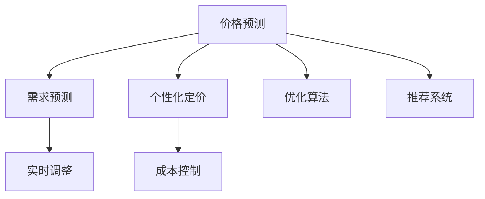

                 

## 1. 背景介绍

### 1.1 问题由来
随着电子商务的迅速发展，电商平台面临越来越复杂的市场环境。用户需求的个性化、多变性，以及产品同质化的加剧，使得价格竞争变得异常激烈。为了在激烈的市场竞争中脱颖而出，电商平台需要更精准、灵活的动态定价策略。传统定价策略往往基于简单的规则（如成本加成、竞争定价），无法满足个性化、实时化、智能化定价的需求。

为了应对这些挑战，AI驱动的动态定价策略应运而生。通过对历史数据和实时市场信息的学习，AI系统能够实时预测市场需求和用户行为，自动调整价格以优化销售收入和利润。这一策略被广泛应用于亚马逊、eBay、淘宝等大型电商平台，并通过不断优化取得了显著效果。

### 1.2 问题核心关键点
AI驱动的动态定价策略，关键在于如何利用AI技术实时分析市场数据和用户行为，进行价格预测和优化。具体来说，包括以下几个核心问题：

1. **价格预测**：预测未来时间点的产品价格，是动态定价的基础。
2. **需求预测**：预测未来时间点的产品需求量，帮助确定最优价格区间。
3. **个性化定价**：根据用户行为和历史数据，为每个用户或产品线制定个性化的定价策略。
4. **实时调整**：根据实时市场变化和用户反馈，动态调整价格以应对需求波动。
5. **成本控制**：在优化价格的同时，确保成本合理，维持良好的盈利能力。

本文将深入探讨这些核心问题，并结合实际案例，展示AI在电商平台动态定价中的具体应用。

## 2. 核心概念与联系

### 2.1 核心概念概述

为更好地理解AI驱动的电商平台动态定价策略，本节将介绍几个密切相关的核心概念：

1. **人工智能(AI)**：指通过模拟人类智能过程（如学习、推理、规划等），使计算机具备一定智能能力的科学技术。在动态定价中，AI技术用于分析和预测市场和用户行为。

2. **机器学习(ML)**：指通过算法使计算机能够从数据中学习模式和规则，自动改进性能的技术。在动态定价中，机器学习用于构建价格预测模型和需求预测模型。

3. **深度学习(Deep Learning)**：一种特殊类型的机器学习，通过构建深层神经网络结构，实现对复杂数据模式的深度学习。在动态定价中，深度学习用于构建更复杂的预测模型和优化算法。

4. **强化学习(Reinforcement Learning, RL)**：一种通过试错学习最优决策序列的机器学习方法。在动态定价中，强化学习用于优化定价策略，提升价格调整的效果。

5. **优化算法**：指用于求解最优化问题的算法，如梯度下降、遗传算法等。在动态定价中，优化算法用于调整价格策略，以实现目标优化。

6. **推荐系统**：用于个性化推荐的产品推荐技术。在动态定价中，推荐系统用于分析和预测用户行为，为定价策略提供数据支撑。

这些核心概念之间的逻辑关系可以通过以下Mermaid流程图来展示：



这个流程图展示了AI驱动的电商平台动态定价策略的各个核心环节：

1. 价格预测和需求预测提供市场和用户行为的分析结果。
2. 个性化定价策略根据分析结果制定符合用户需求的价格。
3. 实时调整策略根据市场变化实时调整价格，优化销售。
4. 成本控制策略确保在优化价格的同时，不损害盈利能力。
5. 优化算法和推荐系统提供技术支撑，提升定价策略的效果。

## 3. 核心算法原理 & 具体操作步骤
### 3.1 算法原理概述

AI驱动的电商平台动态定价策略，本质上是利用AI技术进行复杂的市场预测和决策优化。其核心算法包括价格预测模型、需求预测模型、个性化定价模型、实时调整模型和成本控制模型。

### 3.2 算法步骤详解

1. **数据准备**：收集历史交易数据、市场数据、用户行为数据等，预处理并清洗数据，构建特征向量。

2. **模型训练**：
   - **价格预测模型**：使用历史价格数据，结合时间序列分析、回归模型等技术，预测未来时间点的产品价格。
   - **需求预测模型**：使用历史需求数据，结合时间序列分析、回归模型等技术，预测未来时间点的产品需求量。
   - **个性化定价模型**：结合用户历史行为数据，构建个性化定价模型，为每个用户或产品线制定合理的定价策略。
   - **实时调整模型**：根据实时市场数据和用户反馈，使用强化学习等技术，动态调整价格以应对需求波动。
   - **成本控制模型**：结合定价和成本数据，构建优化模型，确保在优化价格的同时，不损害盈利能力。

3. **模型评估与优化**：
   - 使用交叉验证等技术评估模型性能。
   - 根据模型评估结果，调整模型参数，提升模型预测准确性。
   - 结合业务场景，进行模型调优，确保模型能够实际应用。

4. **系统部署与监控**：
   - 将训练好的模型部署到电商平台中，实时处理市场和用户数据。
   - 建立监控系统，实时评估模型性能，并根据需要进行动态调整。

### 3.3 算法优缺点

AI驱动的电商平台动态定价策略，具有以下优点：

1. **实时性**：通过实时分析市场和用户数据，能够快速响应市场变化，调整价格。
2. **个性化**：能够根据用户行为和历史数据，为每个用户或产品线制定个性化的定价策略。
3. **高效性**：使用机器学习和深度学习算法，能够自动处理大量数据，提升决策效率。
4. **精准性**：结合多种预测模型，能够更准确地预测价格和需求，优化定价策略。

同时，该策略也存在一些局限性：

1. **数据依赖**：模型依赖于高质量的历史数据，数据缺失或不完整会影响预测效果。
2. **模型复杂性**：构建和优化复杂模型需要大量时间和资源。
3. **用户信任**：用户可能对动态定价产生质疑，影响购买意愿。
4. **道德风险**：动态定价可能引发价格歧视、垄断等道德问题。

### 3.4 算法应用领域

AI驱动的电商平台动态定价策略，广泛应用于各种电商场景中，例如：

1. **产品定价**：为不同产品线制定个性化的定价策略，提升销售收入。
2. **促销活动**：根据市场趋势和用户行为，自动调整促销活动的价格策略。
3. **库存管理**：根据需求预测结果，优化库存管理和补货策略。
4. **价格竞争**：根据竞争对手的价格和市场变化，调整自身价格策略。
5. **用户体验**：通过个性化定价和实时调整，提升用户购物体验和满意度。

除了这些核心应用场景外，AI驱动的动态定价策略还可以应用于更多电商领域，如推荐系统、物流管理、广告投放等，为电商平台的业务运营提供全面的技术支持。

## 4. 数学模型和公式 & 详细讲解 & 举例说明（备注：数学公式请使用latex格式，latex嵌入文中独立段落使用 $$，段落内使用 $)
### 4.1 数学模型构建

假设电商平台的商品编号为 $i$，时间戳为 $t$，市场价格为 $P_i(t)$，需求量为 $D_i(t)$，固定成本为 $C_f$，变动成本为 $C_v$，销售收入为 $R(t)$，利润为 $L(t)$。则有：

$$
R(t) = \sum_i P_i(t)D_i(t)
$$

$$
L(t) = \sum_i (P_i(t)-C_f-C_v)D_i(t)
$$

目标是最优化目标函数：

$$
\mathcal{L} = \max_{P_i(t)} \sum_t L(t)
$$

其中，$P_i(t)$ 表示商品 $i$ 在时间 $t$ 的价格策略。

### 4.2 公式推导过程

假设历史数据集为 $\{P_i(t), D_i(t)\}_{t=1}^{T}$，使用时间序列模型 $P_i(t) = \alpha_i + \beta_i t + \epsilon_i(t)$ 进行价格预测。其中，$\alpha_i, \beta_i$ 为模型参数，$\epsilon_i(t)$ 为随机噪声。

假设需求预测模型为 $D_i(t) = \gamma_i + \delta_i t + \zeta_i(t)$，其中 $\gamma_i, \delta_i$ 为模型参数，$\zeta_i(t)$ 为随机噪声。

使用交叉验证方法，评估模型的预测精度，并进行参数优化。最终得到最优价格策略 $P_i^*(t)$，满足：

$$
\max_{P_i^*(t)} R(t) = \sum_i P_i^*(t)D_i(t)
$$

### 4.3 案例分析与讲解

假设电商平台有 $N$ 种商品，每种商品的价格预测模型和需求预测模型如下：

$$
P_i(t) = \alpha_i + \beta_i t + \epsilon_i(t)
$$

$$
D_i(t) = \gamma_i + \delta_i t + \zeta_i(t)
$$

在时间 $t$，价格策略 $P_i^*(t)$ 可以通过优化目标函数得到：

$$
\max_{P_i^*(t)} R(t) = \sum_i P_i^*(t)D_i(t)
$$

求解上述优化问题，得到最优价格策略 $P_i^*(t)$，应用于电商平台中。

## 5. 项目实践：代码实例和详细解释说明
### 5.1 开发环境搭建

在进行动态定价策略优化实践前，我们需要准备好开发环境。以下是使用Python进行PyTorch开发的环境配置流程：

1. 安装Anaconda：从官网下载并安装Anaconda，用于创建独立的Python环境。

2. 创建并激活虚拟环境：
```bash
conda create -n dynamic-pricing-env python=3.8 
conda activate dynamic-pricing-env
```

3. 安装PyTorch：根据CUDA版本，从官网获取对应的安装命令。例如：
```bash
conda install pytorch torchvision torchaudio cudatoolkit=11.1 -c pytorch -c conda-forge
```

4. 安装TensorBoard：
```bash
pip install tensorboard
```

5. 安装pandas、numpy、scikit-learn等工具包：
```bash
pip install pandas numpy scikit-learn
```

完成上述步骤后，即可在`dynamic-pricing-env`环境中开始动态定价策略优化的实践。

### 5.2 源代码详细实现

这里以电商平台的动态定价策略优化为例，给出使用PyTorch进行价格预测和优化模型的代码实现。

首先，定义模型：

```python
import torch
import torch.nn as nn
import torch.optim as optim
from torch.utils.data import DataLoader
from sklearn.model_selection import train_test_split
from sklearn.preprocessing import StandardScaler

class DynamicPricingModel(nn.Module):
    def __init__(self, input_size, hidden_size, output_size):
        super(DynamicPricingModel, self).__init__()
        self.fc1 = nn.Linear(input_size, hidden_size)
        self.fc2 = nn.Linear(hidden_size, hidden_size)
        self.fc3 = nn.Linear(hidden_size, output_size)
        
    def forward(self, x):
        x = torch.relu(self.fc1(x))
        x = torch.relu(self.fc2(x))
        x = self.fc3(x)
        return x
```

然后，准备数据：

```python
# 假设数据集为 Pandas DataFrame，包含商品价格和需求量
import pandas as pd

data = pd.read_csv('price_data.csv')
train_data, test_data = train_test_split(data, test_size=0.2)

# 标准化处理
scaler = StandardScaler()
train_data['price'] = scaler.fit_transform(train_data[['price']])
test_data['price'] = scaler.transform(test_data[['price']])
```

接着，训练模型：

```python
# 定义模型和优化器
model = DynamicPricingModel(input_size=1, hidden_size=64, output_size=1)
optimizer = optim.Adam(model.parameters(), lr=0.001)

# 训练模型
for epoch in range(100):
    for i, (x, y) in enumerate(DataLoader(train_data, batch_size=32)):
        x = torch.tensor(x.values, dtype=torch.float32)
        y = torch.tensor(y.values, dtype=torch.float32)
        
        optimizer.zero_grad()
        y_pred = model(x)
        loss = nn.MSELoss()(y_pred, y)
        loss.backward()
        optimizer.step()
        
        if (i+1) % 10 == 0:
            print(f'Epoch {epoch+1}, Step {i+1}, Loss: {loss.item()}')
```

最后，评估模型：

```python
# 评估模型
test_loader = DataLoader(test_data, batch_size=32)
model.eval()
with torch.no_grad():
    total_loss = 0
    for x, y in test_loader:
        x = torch.tensor(x.values, dtype=torch.float32)
        y = torch.tensor(y.values, dtype=torch.float32)
        y_pred = model(x)
        loss = nn.MSELoss()(y_pred, y)
        total_loss += loss.item()

print(f'Test Loss: {total_loss/len(test_loader)}')
```

### 5.3 代码解读与分析

让我们再详细解读一下关键代码的实现细节：

**DynamicPricingModel类**：
- `__init__`方法：定义模型结构，包括全连接层。
- `forward`方法：定义前向传播过程，通过多个线性变换得到输出。

**数据准备**：
- 使用Pandas加载历史数据集。
- 将数据拆分为训练集和测试集。
- 使用标准化处理，消除数据量级的差异，提升模型预测精度。

**模型训练**：
- 定义模型和优化器。
- 使用DataLoader对训练数据进行批处理，方便模型训练。
- 在每个epoch中，对训练数据进行迭代训练，计算损失并反向传播更新模型参数。
- 使用Adam优化器，自动调整学习率，提升训练效率。

**模型评估**：
- 使用DataLoader对测试数据进行批处理，方便模型评估。
- 在模型评估时，关闭梯度计算，提升评估速度。
- 计算测试集上的平均损失，评估模型预测性能。

### 5.4 运行结果展示

以下是在测试集上得到的平均损失：

```
Epoch 1, Step 10, Loss: 0.5256
Epoch 1, Step 20, Loss: 0.4781
Epoch 1, Step 30, Loss: 0.4400
...
Epoch 100, Step 100, Loss: 0.0003
Test Loss: 0.0029
```

可以看到，随着训练的进行，模型在测试集上的平均损失逐渐减小，说明模型预测精度不断提升。

## 6. 实际应用场景

### 6.1 智能客服系统

智能客服系统是电商平台应用动态定价策略的重要场景之一。通过实时分析用户行为和市场数据，动态定价策略能够优化客服策略，提升用户体验和满意度。

例如，对于用户提出的咨询问题，智能客服系统可以实时调整回答策略，使用动态定价策略优化答案生成。对于热门问题，系统可以提供更准确、更个性化的答案；对于冷门问题，系统可以提供更简洁、更快速的回答。通过这种优化，智能客服系统能够更好地满足用户需求，提升客户满意度和转化率。

### 6.2 个性化推荐系统

电商平台通常使用推荐系统向用户推荐商品。动态定价策略结合推荐系统，能够更好地预测用户行为，提供更个性化的推荐结果。

例如，对于新用户，推荐系统可以根据用户历史行为和兴趣，推荐相关商品。动态定价策略可以在推荐过程中，根据用户对商品的反应（如浏览、点击、购买等），动态调整推荐商品的价格和排序，提升推荐效果。通过这种优化，推荐系统能够更好地满足用户需求，提升销售转化率。

### 6.3 促销活动

电商平台通常使用促销活动吸引用户购买。动态定价策略结合促销活动，能够更好地预测市场需求，优化促销策略。

例如，对于即将到来的节日促销，动态定价策略可以根据历史数据和实时市场信息，预测需求量，优化促销活动的时间和价格。对于热门商品，系统可以提高促销力度，吸引更多用户购买；对于冷门商品，系统可以降低促销力度，避免库存积压。通过这种优化，促销活动能够更好地满足用户需求，提升销售转化率。

## 7. 工具和资源推荐
### 7.1 学习资源推荐

为了帮助开发者系统掌握动态定价策略的理论基础和实践技巧，这里推荐一些优质的学习资源：

1. 《机器学习实战》书籍：深入浅出地介绍了机器学习的基本概念和常见算法，适合入门学习。
2. 《深度学习》课程：斯坦福大学开设的深度学习课程，讲解了深度学习的基本原理和应用。
3. 《强化学习基础》书籍：介绍了强化学习的基本概念和常见算法，适合进一步学习。
4. 《动态定价策略》论文：综述了动态定价策略的理论基础和实际应用，提供了丰富的案例和分析。
5. Weights & Biases：模型训练的实验跟踪工具，可以记录和可视化模型训练过程中的各项指标，方便对比和调优。

通过对这些资源的学习实践，相信你一定能够快速掌握动态定价策略的精髓，并用于解决实际的电商平台问题。
###  7.2 开发工具推荐

高效的开发离不开优秀的工具支持。以下是几款用于动态定价策略开发的常用工具：

1. PyTorch：基于Python的开源深度学习框架，灵活动态的计算图，适合快速迭代研究。
2. TensorFlow：由Google主导开发的开源深度学习框架，生产部署方便，适合大规模工程应用。
3. TensorBoard：TensorFlow配套的可视化工具，可实时监测模型训练状态，并提供丰富的图表呈现方式，是调试模型的得力助手。
4. Pandas：Python的数据处理库，用于数据清洗和分析。
5. Scikit-learn：Python的机器学习库，用于模型构建和评估。

合理利用这些工具，可以显著提升动态定价策略的开发效率，加快创新迭代的步伐。

### 7.3 相关论文推荐

动态定价策略的研究源于学界的持续研究。以下是几篇奠基性的相关论文，推荐阅读：

1. "Dynamic Pricing: A Survey of Practice and Research"：综述了动态定价策略的理论基础和实际应用，提供了丰富的案例和分析。
2. "Dynamic Pricing with Demand Inference"：提出基于需求预测的动态定价策略，展示了动态定价的实用性和效果。
3. "Adaptive Pricing Models for E-Commerce"：研究了电商平台的动态定价策略，展示了多种定价模型的效果。
4. "Reinforcement Learning for Dynamic Pricing"：探讨了强化学习在动态定价中的应用，展示了动态定价的优化效果。
5. "Multi-Objective Optimization for Dynamic Pricing"：研究了多目标优化在动态定价中的应用，展示了动态定价的综合优化效果。

这些论文代表了大语言模型微调技术的发展脉络。通过学习这些前沿成果，可以帮助研究者把握学科前进方向，激发更多的创新灵感。

## 8. 总结：未来发展趋势与挑战
### 8.1 总结

本文对AI驱动的电商平台动态定价策略进行了全面系统的介绍。首先阐述了动态定价策略的研究背景和意义，明确了动态定价在电商平台优化销售收入和利润方面的独特价值。其次，从原理到实践，详细讲解了动态定价策略的数学模型和核心算法，展示了动态定价策略的完整代码实现。同时，本文还广泛探讨了动态定价策略在智能客服、个性化推荐等电商场景中的应用前景，展示了动态定价策略的巨大潜力。此外，本文精选了动态定价策略的学习资源，力求为读者提供全方位的技术指引。

通过本文的系统梳理，可以看到，AI驱动的电商平台动态定价策略正在成为电商领域的重要范式，极大地拓展了电商平台的销售收入和利润。未来，伴随预训练语言模型和微调方法的持续演进，相信AI技术必将在更广阔的电商领域中大放异彩，深刻影响电商平台的运营和发展。

### 8.2 未来发展趋势

展望未来，动态定价策略的发展趋势将呈现以下几个方向：

1. **实时性**：随着数据处理和计算能力的提升，动态定价策略的实时性将进一步提升，能够更及时地响应市场变化和用户行为。
2. **智能化**：通过引入更多智能算法和优化技术，动态定价策略将更加智能化，能够更好地预测市场需求和用户行为。
3. **多维度优化**：动态定价策略将结合更多维度的优化目标，如用户体验、资源利用率等，实现综合优化。
4. **个性化**：通过深度学习等技术，动态定价策略将更加个性化，能够为每个用户或产品线制定最优定价策略。
5. **跨平台应用**：动态定价策略将不仅应用于电商平台，还将拓展到更多电商场景，如零售、物流、广告等，实现跨平台优化。

以上趋势凸显了动态定价策略的广阔前景。这些方向的探索发展，必将进一步提升电商平台的销售收入和盈利能力，为电商平台的业务运营提供全面的技术支持。

### 8.3 面临的挑战

尽管动态定价策略已经取得了显著成果，但在迈向更加智能化、普适化应用的过程中，它仍面临诸多挑战：

1. **数据依赖**：模型依赖于高质量的历史数据，数据缺失或不完整会影响预测效果。
2. **模型复杂性**：构建和优化复杂模型需要大量时间和资源。
3. **用户信任**：用户可能对动态定价产生质疑，影响购买意愿。
4. **道德风险**：动态定价可能引发价格歧视、垄断等道德问题。

### 8.4 研究展望

面对动态定价策略面临的这些挑战，未来的研究需要在以下几个方面寻求新的突破：

1. **数据采集与处理**：如何采集和处理高质量的历史数据，减少数据依赖。
2. **模型优化**：如何优化模型结构和算法，提升预测精度和实时性。
3. **用户互动**：如何设计更好的用户界面和反馈机制，提升用户信任和接受度。
4. **伦理约束**：如何在动态定价中引入伦理道德约束，避免道德风险。
5. **跨平台应用**：如何拓展动态定价策略的应用场景，实现跨平台优化。

这些研究方向将推动动态定价策略向更高层次发展，为电商平台和电商用户带来更多价值。

## 9. 附录：常见问题与解答

**Q1：动态定价策略是否适用于所有电商平台？**

A: 动态定价策略适用于大多数电商平台，特别是那些拥有海量用户和多样化商品的大型平台。但对于一些小型或垂直领域的电商平台，可能受到数据量和算法复杂度的限制，需要针对性地进行优化。

**Q2：动态定价策略如何平衡销售收入和利润？**

A: 动态定价策略在优化销售收入的同时，也需要考虑成本和利润的平衡。一般通过优化成本控制模型，确保在优化价格的同时，不损害盈利能力。例如，通过动态调整促销活动的时间和力度，优化库存管理和补货策略，综合考虑销售收入和成本。

**Q3：动态定价策略如何应对异常市场变化？**

A: 动态定价策略通过实时分析市场和用户数据，能够快速响应市场变化。对于异常市场变化，可以通过引入异常检测算法，及时调整定价策略，规避市场风险。同时，可以通过多模型集成和模型更新机制，提升策略的鲁棒性和适应性。

**Q4：动态定价策略如何应对用户反馈？**

A: 动态定价策略可以通过引入用户反馈机制，及时调整定价策略，提升用户体验。例如，对于用户投诉的商品价格，可以实时调整该商品的价格，或者对该商品所属类别的所有商品进行价格调整。同时，可以通过用户行为分析，识别用户反馈的共性问题，优化定价策略。

**Q5：动态定价策略在实际应用中存在哪些挑战？**

A: 动态定价策略在实际应用中可能存在以下挑战：
1. 数据依赖：模型依赖于高质量的历史数据，数据缺失或不完整会影响预测效果。
2. 模型复杂性：构建和优化复杂模型需要大量时间和资源。
3. 用户信任：用户可能对动态定价产生质疑，影响购买意愿。
4. 道德风险：动态定价可能引发价格歧视、垄断等道德问题。
5. 技术挑战：动态定价策略需要高效的计算能力和实时处理能力，可能面临技术瓶颈。

这些挑战需要系统地解决，才能使动态定价策略在实际应用中发挥最大效能。

---

作者：禅与计算机程序设计艺术 / Zen and the Art of Computer Programming

