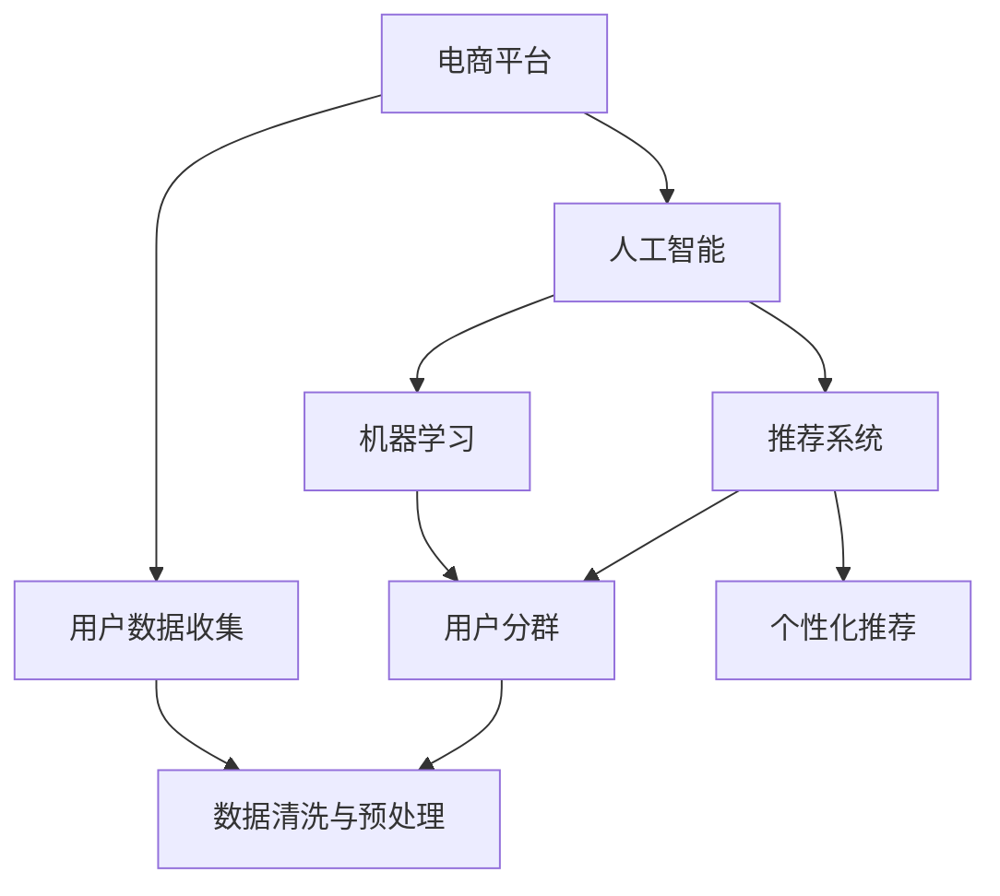

                 

# AI驱动的电商平台用户分群策略

> 关键词：用户分群,电商平台,人工智能,机器学习,客户细分,推荐系统

## 1. 背景介绍

### 1.1 问题由来
在数字化时代，电商平台已成为零售业务的主流渠道。然而，尽管众多电商平台投入大量资源进行营销和运营，却常常面临用户流失率高、购物转化率低、用户粘性不足等问题。这些问题大多源自于用户行为的分散性和异质性，难以针对性地进行个性化推荐和服务。

用户分群，即将平台上的用户根据一定的特征进行划分，将具有相同特征的用户划分为同一群体，并针对不同群体提供差异化的产品推荐和服务策略。用户分群不仅能够提升用户满意度，提高转化率，还能优化营销策略，提升运营效率。

## 2. 核心概念与联系

### 2.1 核心概念概述

为了更好地理解AI驱动的电商平台用户分群策略，本节将介绍几个密切相关的核心概念：

- **用户分群**：指将电商平台的用户根据某些特征划分为不同群体，以便进行差异化营销和服务。常见的特征包括行为、人口统计、兴趣、心理等。
- **电商平台**：以在线销售商品为主体的综合性平台，包括淘宝、京东、亚马逊等。
- **人工智能**：涵盖机器学习、深度学习、自然语言处理等技术的综合体，旨在使计算机系统具有人一样的智能能力。
- **机器学习**：通过数据驱动模型学习，让计算机系统自动改进算法，并根据输入数据进行预测和决策。
- **推荐系统**：根据用户的历史行为、兴趣、好友推荐等特征，向用户推荐个性化商品和服务的系统。

这些概念之间存在紧密的联系，并构成了AI驱动的电商平台用户分群策略的完整框架：

- 电商平台作为用户分群的实施环境，通过收集用户数据，为AI模型提供训练材料。
- 人工智能和机器学习为用户分群提供技术手段，使分群过程更加高效、精准。
- 推荐系统利用用户分群的结果，向用户提供个性化推荐，提升用户体验。

这些核心概念之间的关系可以通过以下Mermaid流程图来展示：



这个流程图展示了几者之间的关系：

1. 电商平台收集用户数据，提供给AI模型。
2. 人工智能和机器学习技术用于处理数据，实现用户分群。
3. 推荐系统根据分群结果，为不同用户群体提供个性化推荐。

## 3. 核心算法原理 & 具体操作步骤
### 3.1 算法原理概述

AI驱动的电商平台用户分群策略，本质上是一个基于用户行为数据的聚类过程。其核心思想是：通过机器学习算法，发现数据中的内在模式，将用户按照某种特定的相似性进行分组，为每个群体定制个性化的营销和服务策略。

具体而言，算法通常包括以下步骤：

1. **数据收集与预处理**：收集电商平台上的用户数据，并进行清洗和特征提取。
2. **模型训练**：选择适合的机器学习模型，如K-Means、层次聚类、协同过滤等，进行模型训练。
3. **分群优化**：对模型进行参数调优，确保分群结果尽可能地符合业务逻辑。
4. **分群验证与评估**：使用一定的指标（如熵、离散度等）对分群结果进行评估，确保分群效果。
5. **个性化推荐**：根据分群结果，为每个群体定制推荐策略，提升用户满意度。

### 3.2 算法步骤详解

以下详细介绍AI驱动的电商平台用户分群策略的具体操作步骤：

**Step 1: 数据收集与预处理**

1. **数据来源**：
   - 用户行为数据：如浏览、点击、购买、评论等行为。
   - 用户人口统计数据：如年龄、性别、地理位置、设备类型等。
   - 用户兴趣数据：如浏览历史、收藏夹、购买偏好等。
   - 用户心理数据：如情感分析、用户满意度评分等。

2. **数据清洗与特征提取**：
   - 去除缺失、重复、异常数据。
   - 数据归一化、标准化，确保数据一致性。
   - 特征选择：提取对用户行为预测和分群有重要影响的特征。

**Step 2: 模型训练**

1. **模型选择**：
   - **K-Means**：一种经典的聚类算法，适合处理数值型特征。
   - **层次聚类**：通过构建树状结构，逐步合并簇。
   - **协同过滤**：基于用户和物品的协同行为进行分群。
   - **DBSCAN**：基于密度的聚类算法，可以识别出不同密度的用户群体。

2. **参数调优**：
   - **K值选择**：通过交叉验证，选择最优的簇数。
   - **特征权重**：根据业务逻辑，调整不同特征的权重。
   - **距离度量**：选择合适的距离度量算法，如欧式距离、曼哈顿距离等。

**Step 3: 分群优化**

1. **迭代优化**：通过多次训练和调整模型参数，逐步优化分群效果。
2. **外部评估**：引入专家或用户反馈，进行分群效果的综合评估。

**Step 4: 分群验证与评估**

1. **熵值法**：计算分群结果的熵值，衡量分群效果的集中度。
2. **离散度法**：计算不同群体之间的特征差异度，确保分群的合理性。
3. **业务指标**：评估分群对电商平台的实际影响，如转化率、复购率、用户满意度等。

**Step 5: 个性化推荐**

1. **推荐算法**：根据分群结果，使用协同过滤、基于内容的推荐、混合推荐等算法进行推荐。
2. **推荐优化**：根据用户反馈和行为数据，动态调整推荐策略，提升推荐效果。

### 3.3 算法优缺点

AI驱动的电商平台用户分群策略具有以下优点：

1. **提升用户体验**：通过个性化推荐，提升用户满意度，减少流失率。
2. **优化运营效率**：根据不同群体制定差异化营销策略，提高转化率和复购率。
3. **降低成本**：减少无效营销和资源浪费，提高营销ROI。
4. **数据驱动**：通过机器学习技术，实现精准分群，避免主观判断带来的误差。

然而，该策略也存在一些缺点：

1. **数据依赖性高**：分群效果高度依赖于数据质量，数据不足或噪声数据可能导致分群不准确。
2. **模型复杂性高**：复杂的聚类模型需要大量的计算资源和时间，调试和维护成本较高。
3. **结果可解释性差**：机器学习模型的结果往往难以解释，给业务人员带来一定的理解难度。
4. **隐私问题**：用户行为数据涉及隐私问题，需确保数据安全和合规使用。

### 3.4 算法应用领域

AI驱动的电商平台用户分群策略，主要应用于以下几个领域：

1. **客户细分**：将用户分为高价值用户、潜在用户、低价值用户等不同群体，制定相应的营销策略。
2. **个性化推荐**：根据用户分群结果，定制个性化的商品推荐，提升用户购买意愿。
3. **需求预测**：通过分群分析用户需求趋势，优化库存管理和商品上架策略。
4. **价格优化**：根据不同群体进行定价策略调整，提升销售利润。
5. **客户服务**：针对不同群体，提供定制化的客户服务，提高用户满意度。

## 4. 数学模型和公式 & 详细讲解 & 举例说明

### 4.1 数学模型构建

在用户分群策略中，常用的数学模型包括聚类算法和协同过滤算法。以下以K-Means算法为例，说明其数学模型的构建。

K-Means算法的基本思想是将数据集划分为K个簇，使得簇内的数据点尽可能相似，簇间的差异尽可能大。数学模型可以表示为：

$$
\min_{C, \mu_k} \sum_{k=1}^K \sum_{x \in C_k} ||x - \mu_k||^2
$$

其中，$C$ 表示簇的划分，$\mu_k$ 表示第 $k$ 个簇的质心，$||\cdot||$ 表示欧式距离。

### 4.2 公式推导过程

假设有一个包含 $N$ 个用户的数据集 $X$，需要将其划分为 $K$ 个簇。

1. **初始化**：随机初始化 $K$ 个质心 $\mu_1, \mu_2, ..., \mu_K$。
2. **分配**：将每个用户 $x_i$ 分配到最近的质心 $c_i$。
3. **更新**：计算每个簇的新质心，更新 $\mu_k$。
4. **迭代**：重复步骤2和步骤3，直到质心不再变化或达到预设的迭代次数。

以用户行为数据为例，假设 $X = \{(x_1, y_1), (x_2, y_2), ..., (x_N, y_N)\}$，其中 $x_i$ 表示用户行为特征，$y_i$ 表示用户兴趣标签。

**初始化**：随机选择 $K$ 个用户，将其作为初始质心。

**分配**：计算每个用户到质心的欧式距离，分配到距离最近的簇中。

**更新**：计算每个簇中所有用户行为特征的均值，更新簇的质心。

**迭代**：重复步骤2和步骤3，直到质心不再变化或达到预设的迭代次数。

### 4.3 案例分析与讲解

假设有一个电商平台，需要对其用户进行分群。

**数据集**：包含1000个用户的行为数据，如浏览历史、购买记录、点击次数等。

**步骤1: 数据收集与预处理**

1. **数据来源**：收集用户的浏览记录、购买记录、点击次数等数据。
2. **数据清洗**：去除缺失数据、异常数据，进行归一化和标准化处理。
3. **特征提取**：选择对用户行为预测有重要影响的特征，如浏览次数、购买金额、点击次数等。

**步骤2: 模型训练**

1. **模型选择**：选择K-Means算法进行分群。
2. **参数调优**：通过交叉验证选择最优的簇数 $K$，调整特征权重，选择适当的距离度量算法。

**步骤3: 分群优化**

1. **迭代优化**：进行多次训练和调优，逐步优化分群效果。
2. **外部评估**：引入专家和用户反馈，进行分群效果的综合评估。

**步骤4: 分群验证与评估**

1. **熵值法**：计算分群结果的熵值，衡量分群效果的集中度。
2. **离散度法**：计算不同群体之间的特征差异度，确保分群的合理性。
3. **业务指标**：评估分群对电商平台的实际影响，如转化率、复购率、用户满意度等。

**步骤5: 个性化推荐**

1. **推荐算法**：根据分群结果，使用协同过滤、基于内容的推荐、混合推荐等算法进行推荐。
2. **推荐优化**：根据用户反馈和行为数据，动态调整推荐策略，提升推荐效果。

## 5. 项目实践：代码实例和详细解释说明

### 5.1 开发环境搭建

在进行用户分群策略的开发前，需要准备好开发环境。以下是使用Python进行Scikit-Learn和Pandas开发的环境配置流程：

1. 安装Anaconda：从官网下载并安装Anaconda，用于创建独立的Python环境。

2. 创建并激活虚拟环境：
```bash
conda create -n usersegmentation python=3.8 
conda activate usersegmentation
```

3. 安装Scikit-Learn和Pandas：
```bash
conda install scikit-learn pandas
```

4. 安装Matplotlib：
```bash
conda install matplotlib
```

5. 安装相关库：
```bash
pip install joblib seaborn
```

完成上述步骤后，即可在`usersegmentation`环境中开始用户分群策略的开发。

### 5.2 源代码详细实现

以下是一个基于Scikit-Learn的K-Means用户分群的Python代码实现：

```python
import pandas as pd
import numpy as np
from sklearn.cluster import KMeans
import matplotlib.pyplot as plt

# 加载数据
data = pd.read_csv('user_behavior_data.csv')

# 数据预处理
data.dropna(inplace=True)
data['feature_1'] = data['feature_1'] / max(data['feature_1'])
data['feature_2'] = data['feature_2'] / max(data['feature_2'])

# 特征选择
features = ['feature_1', 'feature_2']

# K-Means聚类
kmeans = KMeans(n_clusters=3, random_state=42)
clusters = kmeans.fit_predict(data[features])

# 可视化结果
plt.scatter(data['feature_1'], data['feature_2'], c=clusters)
plt.show()
```

**代码解读与分析**

1. **数据加载与预处理**：
   - 使用Pandas库加载用户行为数据，并进行数据清洗和归一化处理。
   - 选择对分群有重要影响的特征，如浏览次数、购买金额、点击次数等。

2. **K-Means聚类**：
   - 使用Scikit-Learn库的K-Means算法进行分群。
   - 设置簇数 $K=3$，进行随机初始化，并进行多次迭代，最终得到聚类结果。

3. **可视化结果**：
   - 使用Matplotlib库可视化聚类结果，直观展示不同用户群体。

### 5.3 代码解读与分析

**用户行为数据加载与预处理**

```python
# 加载数据
data = pd.read_csv('user_behavior_data.csv')

# 数据预处理
data.dropna(inplace=True)
data['feature_1'] = data['feature_1'] / max(data['feature_1'])
data['feature_2'] = data['feature_2'] / max(data['feature_2'])
```

**K-Means聚类**

```python
# 特征选择
features = ['feature_1', 'feature_2']

# K-Means聚类
kmeans = KMeans(n_clusters=3, random_state=42)
clusters = kmeans.fit_predict(data[features])
```

**可视化结果**

```python
# 可视化结果
plt.scatter(data['feature_1'], data['feature_2'], c=clusters)
plt.show()
```

## 6. 实际应用场景

### 6.1 智能客服系统

智能客服系统利用用户分群策略，可以更有效地为用户提供个性化服务。通过对用户行为数据的分析，将客户分为不同群体，如高价值客户、潜在客户、低价值客户，为每个群体制定不同的服务策略，提高客户满意度。

**具体应用**：
1. **高价值客户**：提供定制化的推荐服务，如专属优惠券、VIP服务等。
2. **潜在客户**：通过邮件、短信等渠道进行个性化营销，提升客户转化率。
3. **低价值客户**：通过邮件营销等方式，尝试转化，提高客户忠诚度。

**代码实现**：

```python
# 加载数据
data = pd.read_csv('customer_data.csv')

# 数据预处理
data.dropna(inplace=True)
data['feature_1'] = data['feature_1'] / max(data['feature_1'])
data['feature_2'] = data['feature_2'] / max(data['feature_2'])

# K-Means聚类
kmeans = KMeans(n_clusters=3, random_state=42)
clusters = kmeans.fit_predict(data[features])

# 服务策略
customer_strategy = {
    0: 'low_value',
    1: 'potential',
    2: 'high_value'
}
```

### 6.2 个性化推荐系统

个性化推荐系统利用用户分群策略，可以为不同用户群体提供更加精准的推荐服务。通过分析用户的浏览历史、购买记录等行为数据，将用户分为不同群体，并为每个群体定制个性化的推荐策略，提升用户体验和转化率。

**具体应用**：
1. **高价值客户**：推荐高价值、高相关性的商品，提升客户购买意愿。
2. **潜在客户**：推荐有潜力转化的高价值商品，提升客户转化率。
3. **低价值客户**：推荐低价、高曝光率的商品，提升客户粘性。

**代码实现**：

```python
# 加载数据
data = pd.read_csv('product_data.csv')

# 数据预处理
data.dropna(inplace=True)
data['feature_1'] = data['feature_1'] / max(data['feature_1'])
data['feature_2'] = data['feature_2'] / max(data['feature_2'])

# K-Means聚类
kmeans = KMeans(n_clusters=3, random_state=42)
clusters = kmeans.fit_predict(data[features])

# 推荐策略
recommendation_strategy = {
    0: 'low_value',
    1: 'potential',
    2: 'high_value'
}
```

### 6.3 营销活动优化

营销活动优化利用用户分群策略，可以更有效地设计针对不同用户群体的营销策略，提高营销活动的效果和ROI。通过对用户行为数据的分析，将客户分为不同群体，并为每个群体定制个性化的营销方案，提升营销活动的效果。

**具体应用**：
1. **高价值客户**：通过邮件、短信等方式，向高价值客户推荐独家优惠和定制化服务。
2. **潜在客户**：通过社交媒体等渠道进行精准投放，提升客户转化率。
3. **低价值客户**：通过常规广告和促销活动，提升客户粘性。

**代码实现**：

```python
# 加载数据
data = pd.read_csv('campaign_data.csv')

# 数据预处理
data.dropna(inplace=True)
data['feature_1'] = data['feature_1'] / max(data['feature_1'])
data['feature_2'] = data['feature_2'] / max(data['feature_2'])

# K-Means聚类
kmeans = KMeans(n_clusters=3, random_state=42)
clusters = kmeans.fit_predict(data[features])

# 营销策略
campaign_strategy = {
    0: 'low_value',
    1: 'potential',
    2: 'high_value'
}
```

## 7. 工具和资源推荐

### 7.1 学习资源推荐

为了帮助开发者系统掌握用户分群策略的理论基础和实践技巧，这里推荐一些优质的学习资源：

1. **《机器学习实战》**：本书深入浅出地介绍了机器学习的基本概念和常见算法，包括聚类、推荐系统等，适合初学者入门。
2. **Coursera《机器学习》课程**：由斯坦福大学开设的机器学习课程，由Andrew Ng主讲，系统讲解了机器学习的基本原理和应用。
3. **Kaggle竞赛**：Kaggle提供大量真实数据集和竞赛平台，可以实践机器学习算法的应用，并与其他开发者交流经验。
4. **Scikit-Learn官方文档**：Scikit-Learn的官方文档详细介绍了各类机器学习算法和实用工具，适合开发者快速上手。
5. **Pandas官方文档**：Pandas是Python中常用的数据处理库，其官方文档提供了详细的教程和示例，适合数据分析和预处理。

通过对这些资源的学习实践，相信你一定能够快速掌握用户分群策略的精髓，并用于解决实际的业务问题。

### 7.2 开发工具推荐

高效的开发离不开优秀的工具支持。以下是几款用于用户分群策略开发的常用工具：

1. **Python**：Python是数据科学和机器学习领域的主流编程语言，简单易学，生态系统完善。
2. **Scikit-Learn**：Scikit-Learn是Python中常用的机器学习库，提供了丰富的算法实现和数据处理工具。
3. **Pandas**：Pandas是Python中常用的数据处理库，提供了高效的数据结构和数据操作函数。
4. **Matplotlib**：Matplotlib是Python中常用的数据可视化库，可以生成高质量的图表和统计图。
5. **Jupyter Notebook**：Jupyter Notebook是Python中常用的交互式编程工具，支持代码块、图表、公式等元素的混合编辑。

合理利用这些工具，可以显著提升用户分群策略的开发效率，加快创新迭代的步伐。

### 7.3 相关论文推荐

用户分群策略的发展源于学界的持续研究。以下是几篇奠基性的相关论文，推荐阅读：

1. **K-Means: A Technique for Cluster Analysis**：介绍了K-Means算法的基本原理和实现方法，是聚类算法的经典之作。
2. **Latent Dirichlet Allocation**：提出了基于概率模型的主题模型，可用于用户分群和个性化推荐。
3. **Collaborative Filtering for Implicit Feedback Datasets**：探讨了协同过滤算法在推荐系统中的应用，提供了多种推荐策略的实现方法。
4. **User-Item Collaborative Filtering**：介绍了协同过滤算法的理论基础和应用场景，是推荐系统的经典之作。
5. **Adaptive Clustering Using Dynamically Reduced Neighborhoods**：提出了一种基于邻域调整的聚类算法，适用于大规模数据集的用户分群。

这些论文代表了大数据技术在用户分群和推荐系统中的应用方向，为未来的研究提供了重要的参考。

## 8. 总结：未来发展趋势与挑战

### 8.1 总结

本文对AI驱动的电商平台用户分群策略进行了全面系统的介绍。首先阐述了用户分群在电商平台中的重要性和应用背景，明确了分群策略在提升用户满意度和运营效率方面的独特价值。其次，从原理到实践，详细讲解了基于机器学习的用户分群方法，给出了代码实例和详细解释说明。同时，本文还广泛探讨了用户分群在智能客服、个性化推荐等多个行业领域的应用前景，展示了分群范式的巨大潜力。此外，本文精选了用户分群技术的各类学习资源，力求为读者提供全方位的技术指引。

通过本文的系统梳理，可以看到，AI驱动的电商平台用户分群策略在提升用户体验、优化运营效率、降低营销成本等方面具有重要意义。随着机器学习技术的不断进步，基于用户行为数据的聚类方法将更加高效、精准，为电商平台带来更多的创新应用。

### 8.2 未来发展趋势

展望未来，用户分群策略将呈现以下几个发展趋势：

1. **自动化程度提升**：随着自动化机器学习技术的发展，用户分群策略将更加高效，不再需要人工参与模型调优和参数调整。
2. **多模态融合**：将文本、图像、语音等多种数据模态结合，提升分群的全面性和准确性。
3. **实时化处理**：利用流式数据处理技术，实现用户行为数据的实时分析和分群，提升响应速度。
4. **跨领域应用**：用户分群策略将逐步应用于更多领域，如金融、医疗、教育等，为各行各业提供精准的用户服务。
5. **隐私保护**：在数据收集和处理过程中，引入隐私保护技术，确保用户数据的安全和合规使用。

以上趋势凸显了用户分群策略在人工智能技术发展中的重要作用。这些方向的探索发展，必将进一步提升分群效果，推动各行业的数字化转型升级。

### 8.3 面临的挑战

尽管用户分群策略已经取得了显著成就，但在应用推广的过程中，仍面临一些挑战：

1. **数据质量问题**：用户行为数据存在缺失、异常、噪声等问题，影响分群效果。如何提升数据质量，是用户分群策略的关键问题。
2. **模型复杂性高**：复杂的聚类模型需要大量的计算资源和时间，调试和维护成本较高。如何降低模型复杂度，提升模型可解释性，需要进一步探索。
3. **业务影响**：用户分群策略可能带来新的业务挑战，如服务策略一致性、用户隐私保护等。如何在业务上做出平衡，需要更多的实践和经验。
4. **用户隐私**：用户行为数据涉及隐私问题，需确保数据安全和合规使用。如何在分群过程中保护用户隐私，需要更多的技术手段。

正视用户分群策略面临的这些挑战，积极应对并寻求突破，将是其迈向成熟的必由之路。相信随着学界和产业界的共同努力，这些挑战终将一一被克服，用户分群策略必将在构建人机协同的智能时代中扮演越来越重要的角色。

### 8.4 研究展望

面对用户分群策略所面临的种种挑战，未来的研究需要在以下几个方面寻求新的突破：

1. **自动化模型优化**：引入自动化机器学习技术，提升分群策略的自动化程度，降低人工干预。
2. **多模态数据融合**：将文本、图像、语音等多种数据模态结合，提升分群的全面性和准确性。
3. **实时数据处理**：利用流式数据处理技术，实现用户行为数据的实时分析和分群，提升响应速度。
4. **隐私保护技术**：在数据收集和处理过程中，引入隐私保护技术，确保用户数据的安全和合规使用。
5. **模型解释性增强**：增强用户分群模型的可解释性，便于业务人员理解和使用。

这些研究方向的应用，必将使用户分群策略更加高效、精准、全面，为用户提供更好的个性化服务。面向未来，用户分群策略还需要与其他人工智能技术进行更深入的融合，如知识表示、因果推理、强化学习等，多路径协同发力，共同推动各行业的数字化转型升级。

## 9. 附录：常见问题与解答

**Q1: 用户分群策略适用于所有电商平台吗？**

A: 用户分群策略适用于大部分电商平台，尤其是用户行为数据较为规范、用户群体分布较广的电商平台。然而，对于某些特殊领域的电商平台，如B2B平台、垂直电商平台等，其用户行为数据和业务需求可能与通用平台存在较大差异，需要结合实际业务进行针对性优化。

**Q2: 用户分群策略需要高成本的数据标注吗？**

A: 用户分群策略主要依赖于用户行为数据，无需高成本的数据标注。通过机器学习算法，可以自动从海量数据中发现内在模式，进行高效分群。但是，数据的完整性和质量仍然对分群效果有重要影响，需要进行数据清洗和预处理。

**Q3: 用户分群策略对用户隐私有哪些影响？**

A: 用户分群策略涉及用户行为数据的收集和处理，可能存在隐私风险。为保护用户隐私，需采取以下措施：
1. 数据脱敏：对用户敏感信息进行脱敏处理，如模糊化处理、去标识化等。
2. 数据保护：使用加密技术、访问控制等手段，保护用户数据的安全。
3. 合规使用：遵循相关法律法规，如GDPR等，确保数据使用的合规性。

**Q4: 用户分群策略在业务上有哪些实际应用？**

A: 用户分群策略在业务上有很多实际应用，如：
1. 个性化推荐：根据用户分群结果，进行个性化商品推荐，提升用户购买意愿。
2. 智能客服：根据用户分群结果，提供个性化的客户服务，提高客户满意度。
3. 营销活动优化：根据用户分群结果，定制个性化的营销策略，提升营销效果。
4. 需求预测：根据用户分群结果，预测用户需求，优化库存管理和商品上架策略。
5. 价格优化：根据用户分群结果，制定个性化的定价策略，提升销售利润。

**Q5: 用户分群策略如何提升用户体验？**

A: 用户分群策略通过分析用户行为数据，将用户分为不同群体，并为每个群体定制个性化的服务策略。具体措施包括：
1. 个性化推荐：根据用户分群结果，进行个性化商品推荐，提升用户购买意愿。
2. 智能客服：根据用户分群结果，提供个性化的客户服务，提高客户满意度。
3. 营销活动优化：根据用户分群结果，定制个性化的营销策略，提升营销效果。

---

作者：禅与计算机程序设计艺术 / Zen and the Art of Computer Programming

