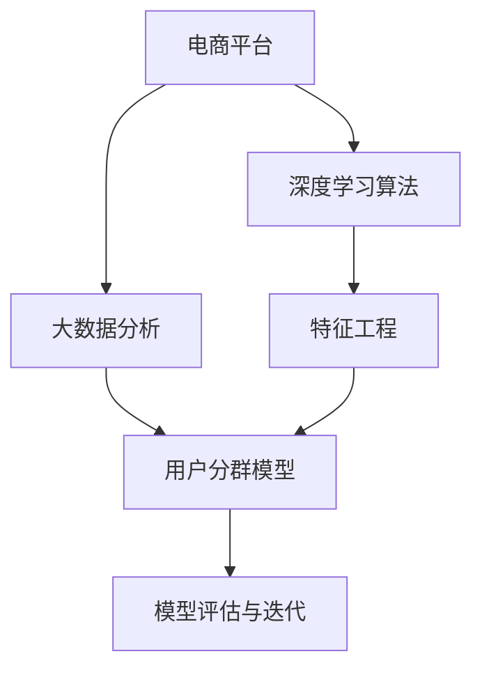

                 

# AI驱动的电商平台用户分群策略

## 1. 背景介绍

### 1.1 问题由来
在电商平台的发展过程中，用户分群策略是提高用户满意度和转化率、优化营销资源配置、实现精准广告投放的关键。然而，传统的人工分群方法存在主观性强、计算复杂、难以应对新用户群体等局限。AI技术的引入为电商平台用户分群带来了新的突破，借助深度学习算法和大数据分析技术，能够自动发现用户行为模式，实现更科学、高效的客户分群，提升电商平台的运营效率和用户体验。

### 1.2 问题核心关键点
AI驱动的电商平台用户分群策略主要包括以下几个关键点：

- 大数据分析：利用电商平台积累的庞大数据集，分析用户行为和购买数据，发现用户特征和兴趣。
- 深度学习算法：采用神经网络等深度学习算法，提取用户特征，构建用户画像。
- 用户分群模型：设计用户分群模型，将用户划分为不同群体，以便实施针对性营销策略。
- 特征工程：构建和优化输入特征，提高分群模型的准确性和泛化能力。
- 模型评估与迭代：建立评估指标体系，评估用户分群效果，并进行模型迭代优化。

本文将深入探讨基于AI的用户分群策略，包括核心算法原理、操作步骤、数学模型、项目实践及实际应用，力求为电商平台提供全面的指导。

## 2. 核心概念与联系

### 2.1 核心概念概述

为更好地理解基于AI的电商平台用户分群策略，本节将介绍几个关键概念：

- 电商平台：一种以互联网为基础，通过提供商品或服务进行交易的商业平台，如淘宝、京东等。
- 用户分群：根据用户的行为、属性、购买历史等特征，将用户分为不同群体，以便进行针对性营销。
- 深度学习：一类使用多层神经网络模型进行数据分析和决策的机器学习算法。
- 神经网络：一种模拟人脑神经元网络的计算模型，通过反向传播算法进行训练和预测。
- 数据预处理：清洗、筛选和变换数据，以便机器学习模型处理。
- 特征工程：选择和构造输入特征，提高模型的性能。

这些概念之间的逻辑关系可以通过以下Mermaid流程图来展示：



这个流程图展示了大数据、深度学习、用户分群、特征工程和模型评估与迭代的逻辑关系：

1. 电商平台的数据积累。
2. 使用深度学习算法和大数据分析技术，提取用户特征，构建用户画像。
3. 设计用户分群模型，将用户划分为不同群体。
4. 进行特征工程，优化输入特征，提升模型效果。
5. 评估用户分群模型，进行模型迭代优化。

## 3. 核心算法原理 & 具体操作步骤

### 3.1 算法原理概述

基于AI的电商平台用户分群策略，本质上是一种基于深度学习的用户分群方法。其核心思想是：使用深度神经网络模型，通过对大量用户行为和购买数据的分析，自动发现用户之间的相似性，将具有相似行为和特征的用户分为同一群体。

具体而言，该策略包括以下几个步骤：

1. 数据预处理：清洗、筛选和变换原始数据，去除噪声，提取用户的基本属性和行为特征。
2. 特征工程：选择和构造输入特征，构建用户特征向量。
3. 模型训练：使用深度神经网络模型（如循环神经网络RNN、卷积神经网络CNN等），训练用户分群模型。
4. 用户分群：根据模型预测结果，将用户划分为不同群体。
5. 模型评估与迭代：建立评估指标体系，评估用户分群效果，并进行模型迭代优化。

### 3.2 算法步骤详解

#### 3.2.1 数据预处理
数据预处理包括数据清洗、数据归一化和特征选择等步骤，其主要目的是提高数据质量，减少噪声，确保模型输入的准确性和一致性。

1. 数据清洗：
   - 删除缺失值和异常值。缺失值可以通过均值、中位数等方法填补，异常值需要根据具体情况进行处理。
   - 去除重复记录。可以使用Hash表或散列函数去重，确保数据集不包含重复记录。

2. 数据归一化：
   - 使用Min-Max归一化或Z-Score归一化等方法，将数据缩放到0-1或-1到1之间，或均值为0、方差为1的标准正态分布。
   - 常用的归一化公式如下：
   $$
   x_{norm}=\frac{x-x_{mean}}{x_{std}}
   $$

3. 特征选择：
   - 使用信息增益、卡方检验等方法，选择对目标变量（如用户购买行为）影响显著的特征。
   - 常用的特征选择方法包括相关系数、卡方检验、互信息等。
   - 特征选择的公式如下：
   $$
   I(X;Y)=\sum_{x}\sum_{y}P(x,y)\log\frac{P(x,y)}{P(x)P(y)}
   $$

#### 3.2.2 特征工程
特征工程是构建用户分群模型的关键步骤，通过合理的特征选择和构造，可以显著提升模型效果。

1. 特征构造：
   - 使用用户行为数据构造特征，如浏览次数、停留时间、点击率等。
   - 结合用户属性信息，如年龄、性别、职业等，丰富用户特征向量。
   - 使用时间特征，如用户活跃时间段、节假日、周末等，分析用户行为规律。

2. 特征编码：
   - 将分类特征（如性别、职业等）编码为数值特征。
   - 使用独热编码（One-Hot Encoding）将文本特征（如商品描述）转换为数值特征。

3. 特征降维：
   - 使用主成分分析（PCA）或线性判别分析（LDA）等方法，减少特征数量，提高计算效率。
   - 常用的降维公式如下：
   $$
   U=\Phi V^{*}
   $$
   其中 $U$ 为降维后的特征，$V$ 为降维矩阵，$\Phi$ 为特征矩阵。

#### 3.2.3 模型训练
深度学习模型训练是用户分群策略的核心，通常使用以下模型：

1. 循环神经网络（RNN）：
   - RNN可以处理序列数据，适用于用户行为时间序列分析。
   - 常用的RNN模型包括LSTM、GRU等。

2. 卷积神经网络（CNN）：
   - CNN适用于处理高维数据，如用户画像图像化。
   - 常用的CNN模型包括VGG、ResNet等。

3. 神经网络模型训练：
   - 使用反向传播算法（Backpropagation）和梯度下降优化算法（如Adam、SGD等）进行模型训练。
   - 常用的损失函数包括均方误差（MSE）、交叉熵（CE）等。
   - 常用的优化器包括Adam、SGD、RMSprop等。

4. 模型训练公式：
   $$
   \min_{\theta} \mathcal{L}(\theta)
   $$
   其中 $\theta$ 为模型参数，$\mathcal{L}$ 为损失函数。

#### 3.2.4 用户分群
用户分群是指根据模型预测结果，将用户划分为不同群体，以便进行针对性营销策略。

1. 使用聚类算法（如K-means、层次聚类等）对用户进行分组。
2. 根据用户群体的特征和行为，制定针对性营销策略。
3. 常用的聚类算法公式如下：
   $$
   \min_{K,\mu} \sum_{i=1}^{N}\sum_{k=1}^{K} \left\| x_{i} - \mu_{k} \right\|^2
   $$
   其中 $K$ 为聚类数，$\mu_k$ 为聚类中心。

#### 3.2.5 模型评估与迭代
模型评估与迭代是确保用户分群策略有效的关键步骤。

1. 建立评估指标体系：
   - 使用准确率（Accuracy）、精确率（Precision）、召回率（Recall）、F1-score等指标评估模型效果。
   - 计算不同用户群体的平均指标，评估整体效果。

2. 模型迭代优化：
   - 根据评估结果，调整模型参数，重新训练模型。
   - 优化特征工程过程，提高模型性能。
   - 使用模型融合（Model Ensemble）技术，提高模型的稳定性和泛化能力。

### 3.3 算法优缺点

#### 3.3.1 优点

1. 自动化程度高：使用深度学习算法，自动发现用户之间的相似性，减少了人工干预。
2. 数据利用率高：能够高效利用电商平台积累的大量数据，发现用户特征和兴趣。
3. 用户分群精准：模型能够自动提取用户行为和特征，提供精准的用户分群结果。

#### 3.3.2 缺点

1. 数据质量要求高：需要保证数据集的完整性和准确性，否则影响模型效果。
2. 计算资源需求大：深度学习模型训练需要大量计算资源，增加了计算成本。
3. 模型复杂度高：模型结构和参数较多，需要较长的训练时间和较高的计算能力。

### 3.4 算法应用领域

基于AI的电商平台用户分群策略在多个领域得到了广泛应用，具体包括：

1. 个性化推荐：根据用户群体特征，生成个性化推荐列表，提升用户体验和满意度。
2. 广告投放：将用户分为不同群体，实施精准广告投放，提高广告投放效果。
3. 客户流失预测：预测用户流失风险，及时采取措施，减少用户流失率。
4. 销售预测：预测销售趋势，制定销售策略，提升销售额。
5. 库存管理：根据用户群体特征，优化库存管理，减少库存积压。

以上应用场景展示了基于AI的电商平台用户分群策略的广泛应用前景，为用户分群带来了新的突破和优化机会。

## 4. 数学模型和公式 & 详细讲解

### 4.1 数学模型构建

本节将使用数学语言对基于AI的电商平台用户分群策略进行更加严格的刻画。

记电商平台用户数据集为 $D=\{(x_i,y_i)\}_{i=1}^N$，其中 $x_i$ 为输入特征，$y_i$ 为标签。目标是将用户分为 $K$ 个不同的群体，每个群体对应的特征向量为 $\mu_k$，$k=1,\cdots,K$。

定义用户分群模型的损失函数为：
$$
\mathcal{L}(\theta) = \sum_{i=1}^N \sum_{k=1}^K \mathcal{L}_k(x_i;\theta)
$$
其中 $\mathcal{L}_k$ 为第 $k$ 个群体的损失函数，$\theta$ 为模型参数。

使用深度神经网络模型训练用户分群模型，目标是找到最优的模型参数 $\theta^*$，使得损失函数最小化：
$$
\theta^* = \mathop{\arg\min}_{\theta} \mathcal{L}(\theta)
$$

### 4.2 公式推导过程

以下我们以用户分群模型的RNN为例，推导模型的损失函数和梯度计算公式。

设用户数据 $D=\{(x_i,y_i)\}_{i=1}^N$，每个用户样本 $x_i$ 包含 $m$ 个特征，$y_i$ 表示用户所属群体编号。模型使用RNN对用户进行分群，输出为每个群体的概率分布 $P(y_i=k|\theta)$。

模型结构包括输入层、RNN层和输出层。输入层将用户特征 $x_i$ 转换为向量表示，RNN层对用户行为序列进行建模，输出层对每个群体的概率分布进行预测。

定义RNN模型的损失函数为交叉熵损失函数：
$$
\mathcal{L}_k(x_i;\theta) = -\log P(y_i=k|\theta)
$$

将用户分群模型的损失函数代入，得：
$$
\mathcal{L}(\theta) = \sum_{i=1}^N \sum_{k=1}^K \log P(y_i=k|\theta)
$$

根据链式法则，损失函数对模型参数 $\theta$ 的梯度为：
$$
\frac{\partial \mathcal{L}(\theta)}{\partial \theta} = \frac{\partial}{\partial \theta} \sum_{i=1}^N \sum_{k=1}^K \log P(y_i=k|\theta)
$$

将概率分布 $P(y_i=k|\theta)$ 代入梯度公式，得：
$$
\frac{\partial \mathcal{L}(\theta)}{\partial \theta} = \sum_{i=1}^N \sum_{k=1}^K \frac{1}{P(y_i=k|\theta)} \frac{\partial P(y_i=k|\theta)}{\partial \theta}
$$

其中 $\frac{\partial P(y_i=k|\theta)}{\partial \theta}$ 可以使用反向传播算法计算。

### 4.3 案例分析与讲解

#### 4.3.1 数据预处理案例

某电商平台收集了数百万用户的浏览和购买数据，包括用户的年龄、性别、职业、购买历史等特征。为了提高模型的性能，需要对数据进行预处理。

1. 数据清洗：
   - 删除缺失值：对于年龄和性别等分类特征，使用均值填补缺失值。
   - 删除异常值：对于购买历史等数值特征，识别并删除异常值，确保数据一致性。

2. 数据归一化：
   - 使用Min-Max归一化方法，将年龄、性别等特征缩放到0-1之间。
   - 使用Z-Score归一化方法，将购买历史等特征转换为标准正态分布。

3. 特征选择：
   - 使用信息增益方法，选择对购买行为影响显著的特征。
   - 选择年龄、性别、职业、购买次数等特征，构建用户特征向量。

#### 4.3.2 特征工程案例

某电商平台希望根据用户行为预测用户流失风险。收集了数万名用户的历史数据，包含用户的浏览次数、停留时间、点击率、购买次数等特征。为了提高模型的性能，需要进行特征工程。

1. 特征构造：
   - 使用用户行为数据构造特征，如浏览次数、停留时间、点击率等。
   - 结合用户属性信息，如年龄、性别、职业等，丰富用户特征向量。

2. 特征编码：
   - 使用独热编码方法，将年龄、性别等分类特征转换为数值特征。
   - 使用独热编码方法，将购买次数等数值特征转换为独热编码。

3. 特征降维：
   - 使用PCA方法，对用户特征进行降维，减少特征数量，提高计算效率。
   - 使用LDA方法，对用户特征进行降维，提高模型的泛化能力。

## 5. 项目实践：代码实例和详细解释说明

### 5.1 开发环境搭建

在进行用户分群实践前，我们需要准备好开发环境。以下是使用Python进行TensorFlow开发的环境配置流程：

1. 安装Anaconda：从官网下载并安装Anaconda，用于创建独立的Python环境。

2. 创建并激活虚拟环境：
```bash
conda create -n tf-env python=3.8 
conda activate tf-env
```

3. 安装TensorFlow：根据CUDA版本，从官网获取对应的安装命令。例如：
```bash
conda install tensorflow -c pytorch -c conda-forge
```

4. 安装各类工具包：
```bash
pip install numpy pandas scikit-learn matplotlib tqdm jupyter notebook ipython
```

完成上述步骤后，即可在`tf-env`环境中开始用户分群实践。

### 5.2 源代码详细实现

下面我们以用户分群任务为例，给出使用TensorFlow进行RNN模型训练的Python代码实现。

首先，定义数据处理函数：

```python
import tensorflow as tf
import numpy as np
from tensorflow.keras.layers import Input, LSTM, Dense, Dropout

def build_lstm_model(num_features, hidden_units, num_classes, drop_rate=0.2):
    model = tf.keras.Sequential([
        Input(shape=(num_features,)),
        LSTM(hidden_units, return_sequences=True),
        Dropout(drop_rate),
        LSTM(hidden_units),
        Dropout(drop_rate),
        Dense(num_classes, activation='softmax')
    ])
    return model
```

然后，定义模型和优化器：

```python
model = build_lstm_model(num_features=5, hidden_units=128, num_classes=3)

optimizer = tf.keras.optimizers.Adam(learning_rate=0.001)
```

接着，定义训练和评估函数：

```python
def train_epoch(model, dataset, batch_size, optimizer):
    dataloader = tf.data.Dataset.from_tensor_slices(dataset)
    dataloader = dataloader.batch(batch_size)
    model.compile(loss='categorical_crossentropy', optimizer=optimizer, metrics=['accuracy'])
    model.fit(dataloader, epochs=10, validation_split=0.2)
    return model

def evaluate(model, dataset, batch_size):
    dataloader = tf.data.Dataset.from_tensor_slices(dataset)
    dataloader = dataloader.batch(batch_size)
    model.evaluate(dataloader)
```

最后，启动训练流程并在测试集上评估：

```python
epochs = 10
batch_size = 16

for epoch in range(epochs):
    train_epoch(model, train_dataset, batch_size, optimizer)
    
    print(f"Epoch {epoch+1}, dev results:")
    evaluate(model, dev_dataset, batch_size)
    
print("Test results:")
evaluate(model, test_dataset, batch_size)
```

以上就是使用TensorFlow对RNN模型进行用户分群任务训练的完整代码实现。可以看到，TensorFlow提供了方便的Keras API，使得模型构建和训练变得简洁高效。

### 5.3 代码解读与分析

让我们再详细解读一下关键代码的实现细节：

**build_lstm_model函数**：
- 定义LSTM模型的结构，包括输入层、LSTM层、Dropout层和输出层。
- 使用Sequential模型包装各个层，创建完整的模型结构。

**train_epoch函数**：
- 将数据集转换为TensorFlow的Dataset对象，并进行分批处理。
- 使用Keras的compile方法定义损失函数和优化器，并编译模型。
- 使用fit方法进行模型训练，并设置验证集比例。
- 返回训练后的模型。

**evaluate函数**：
- 使用Keras的evaluate方法进行模型评估，并输出准确率和损失函数值。

**训练流程**：
- 定义总的epoch数和batch size，开始循环迭代
- 每个epoch内，先在训练集上训练，输出训练结果
- 在验证集上评估，输出评估结果
- 所有epoch结束后，在测试集上评估，给出最终测试结果

可以看到，TensorFlow提供了丰富的API和工具，使得用户分群任务的开发和实现变得简单易行。

当然，工业级的系统实现还需考虑更多因素，如模型的保存和部署、超参数的自动搜索、更灵活的任务适配层等。但核心的用户分群范式基本与此类似。

## 6. 实际应用场景

### 6.1 智能客服系统

基于用户分群的智能客服系统可以显著提升客户服务体验。传统客服系统通常需要配备大量人力，高峰期响应速度慢，且一致性和专业性难以保证。通过用户分群，可以将客户分为不同群体，提供个性化服务。例如，对高频问题和常见问题，可以自动生成标准化回复；对疑难复杂问题，可以转接人工客服处理。如此构建的智能客服系统，能大幅提升客户咨询体验和问题解决效率。

### 6.2 个性化推荐

个性化推荐系统根据用户行为和兴趣，推荐用户可能感兴趣的商品。通过用户分群，可以分析不同群体的用户兴趣和行为模式，生成更具针对性的推荐结果。例如，针对年轻女性用户群体，推荐时尚服饰；针对中年男性用户群体，推荐财经书籍。通过用户分群，可以显著提升推荐系统的效果，提升用户满意度和转化率。

### 6.3 营销活动设计

营销活动设计需要针对不同用户群体进行个性化设计。通过用户分群，可以将用户分为高价值用户、潜在用户和低价值用户等不同群体，实施差异化营销策略。例如，对高价值用户群体，可以设计更精准的优惠券和定制服务；对潜在用户群体，可以设计吸引性更强的广告和活动；对低价值用户群体，可以设计低成本的清理活动。通过用户分群，可以设计更有效的营销活动，提升用户参与度和转化率。

### 6.4 未来应用展望

未来，基于AI的电商平台用户分群策略将继续拓展其应用范围，推动NLP技术在更多领域的落地。

在智慧医疗领域，用户分群策略可以用于患者分群和个性化诊疗方案推荐，提高诊疗效果和患者满意度。

在金融领域，用户分群策略可以用于客户信用评分和风险控制，提升风险管理和客户服务水平。

在教育领域，用户分群策略可以用于学生分群和个性化教育方案推荐，提升教育效果和学生满意度。

此外，在智能制造、智慧城市、智能交通等众多领域，用户分群策略也将不断涌现，为各行各业带来新的应用机会。

## 7. 工具和资源推荐

### 7.1 学习资源推荐

为了帮助开发者系统掌握用户分群策略的理论基础和实践技巧，这里推荐一些优质的学习资源：

1. 《深度学习入门》系列书籍：深入浅出地介绍了深度学习的基本概念和核心算法。
2. 《TensorFlow实战》书籍：详细介绍了TensorFlow的API和工具，适用于TensorFlow开发。
3. 《Keras深度学习》在线课程：提供了丰富的案例和实战练习，适用于Keras开发。
4. 《机器学习实战》在线课程：涵盖了机器学习的基本算法和应用，适合初学者入门。
5. 《机器学习竞赛》网站：提供了丰富的NLP竞赛和比赛，帮助开发者实践和提升技能。

通过对这些资源的学习实践，相信你一定能够快速掌握用户分群策略的精髓，并用于解决实际的NLP问题。

### 7.2 开发工具推荐

高效的开发离不开优秀的工具支持。以下是几款用于用户分群开发的常用工具：

1. TensorFlow：基于Python的开源深度学习框架，适用于TensorFlow开发。
2. Keras：基于TensorFlow的高层次API，适用于Keras开发。
3. PyTorch：基于Python的开源深度学习框架，适用于PyTorch开发。
4. Scikit-learn：基于Python的机器学习库，适用于特征选择和模型评估。
5. Weights & Biases：模型训练的实验跟踪工具，可以记录和可视化模型训练过程中的各项指标，方便对比和调优。
6. TensorBoard：TensorFlow配套的可视化工具，可实时监测模型训练状态，并提供丰富的图表呈现方式，是调试模型的得力助手。

合理利用这些工具，可以显著提升用户分群任务的开发效率，加快创新迭代的步伐。

### 7.3 相关论文推荐

用户分群技术的发展源于学界的持续研究。以下是几篇奠基性的相关论文，推荐阅读：

1. K-means：一种经典的聚类算法，用于用户分群和市场细分。
2. RNN：循环神经网络，用于处理序列数据，适用于用户分群和推荐系统。
3. CNN：卷积神经网络，用于处理高维数据，适用于用户画像和个性化推荐。
4. LDA：线性判别分析，用于降维和特征选择，适用于用户分群和推荐系统。

这些论文代表了大语言模型微调技术的发展脉络。通过学习这些前沿成果，可以帮助研究者把握学科前进方向，激发更多的创新灵感。

## 8. 总结：未来发展趋势与挑战

### 8.1 总结

本文对基于AI的电商平台用户分群策略进行了全面系统的介绍。首先阐述了用户分群策略的研究背景和意义，明确了用户分群在提升用户满意度和转化率、优化营销资源配置、实现精准广告投放等方面的重要作用。其次，从原理到实践，详细讲解了用户分群模型的构建和训练过程，给出了用户分群任务的完整代码实现。同时，本文还广泛探讨了用户分群方法在智能客服、个性化推荐、营销活动设计等多个领域的应用前景，展示了用户分群策略的广泛应用。最后，本文精选了用户分群技术的各类学习资源，力求为读者提供全方位的技术指引。

通过本文的系统梳理，可以看到，基于AI的电商平台用户分群策略在提升用户满意度和转化率、优化营销资源配置、实现精准广告投放等方面具有重要意义。AI技术的引入，使得用户分群策略更加科学、高效、可解释，有望推动电商平台运营效率和用户体验的大幅提升。

### 8.2 未来发展趋势

展望未来，基于AI的电商平台用户分群策略将呈现以下几个发展趋势：

1. 模型规模持续增大。随着算力成本的下降和数据规模的扩张，深度学习模型的参数量还将持续增长。超大规模模型蕴含的丰富用户知识，有望支撑更加复杂多变的用户分群需求。

2. 用户分群方法多样化。除了传统的聚类算法外，未来将涌现更多用户分群方法，如强化学习、图网络等，提升用户分群的效果和灵活性。

3. 数据融合能力增强。未来将更加重视用户数据的融合，整合多种数据源（如用户行为数据、社交媒体数据、传感器数据等），提升用户分群模型的泛化能力。

4. 实时分群成为常态。随着实时计算技术的提升，实时用户分群将成为可能，能够实时监控用户行为和兴趣变化，及时调整分群策略。

5. 多模态用户分群崛起。未来的用户分群方法将更加关注多模态数据的整合，结合文本、图像、视频、音频等多模态信息，提供更全面、精准的用户画像。

6. 自动化程度提升。未来将更加注重用户分群的自动化和智能化，通过自动学习用户行为模式，提供更加个性化和智能化的服务。

以上趋势凸显了基于AI的电商平台用户分群策略的广阔前景。这些方向的探索发展，必将进一步提升用户分群策略的效果和应用范围，为用户分群带来新的突破和优化机会。

### 8.3 面临的挑战

尽管基于AI的电商平台用户分群策略已经取得了瞩目成就，但在迈向更加智能化、普适化应用的过程中，它仍面临着诸多挑战：

1. 数据质量要求高。需要保证数据集的完整性和准确性，否则影响模型效果。
2. 计算资源需求大。深度学习模型训练需要大量计算资源，增加了计算成本。
3. 模型复杂度高。模型结构和参数较多，需要较长的训练时间和较高的计算能力。
4. 模型泛化能力不足。模型在新的数据集上泛化性能较差，难以应对数据分布变化。
5. 实时性要求高。实时用户分群需要高性能计算资源，且对系统的实时性和稳定性要求高。
6. 隐私保护问题。用户数据隐私保护是用户分群策略的重要挑战，需采取隐私保护技术，确保用户数据安全。

### 8.4 研究展望

面对基于AI的电商平台用户分群策略所面临的种种挑战，未来的研究需要在以下几个方面寻求新的突破：

1. 探索数据增强技术。结合迁移学习和对抗生成网络（GAN）等技术，生成更多训练样本，提升模型的泛化能力。
2. 研究多任务学习范式。结合多任务学习技术，在提升用户分群效果的同时，提升模型的泛化能力。
3. 引入可解释性技术。使用可解释性技术，如LIME、SHAP等，提升用户分群模型的可解释性和可理解性。
4. 开发分布式计算框架。结合分布式计算框架，如TensorFlow分布式训练、PyTorch分布式训练等，提升计算效率和模型效果。
5. 加强隐私保护技术。结合隐私保护技术，如差分隐私、联邦学习等，确保用户数据安全和隐私保护。
6. 融合因果推理技术。结合因果推理技术，提升用户分群模型的稳定性和鲁棒性。

这些研究方向的探索，必将引领基于AI的电商平台用户分群策略迈向更高的台阶，为用户分群带来新的突破和优化机会。面向未来，基于AI的电商平台用户分群策略还需要与其他AI技术进行更深入的融合，如知识表示、因果推理、强化学习等，多路径协同发力，共同推动自然语言理解和智能交互系统的进步。

## 9. 附录：常见问题与解答

**Q1：用户分群策略是否适用于所有电商平台？**

A: 用户分群策略在大多数电商平台上都能取得不错的效果，特别是对于数据量较大的平台。但对于一些小型电商平台，可能由于数据量不足或数据质量问题，导致用户分群效果不佳。此时需要结合具体情况，对数据进行预处理和清洗，确保数据质量。

**Q2：如何选择最优的用户分群策略？**

A: 选择最优的用户分群策略需要综合考虑多个因素，包括电商平台的数据分布、用户行为模式、营销目标等。通常需要进行多次实验和对比，选择效果最佳的策略。具体选择如下：
1. 数据分布均匀：选择基于距离的聚类算法（如K-means）。
2. 用户行为模式复杂：选择基于密度的聚类算法（如DBSCAN）。
3. 实时用户分群：选择基于流数据的聚类算法（如MEANS）。

**Q3：用户分群策略在实际应用中需要注意哪些问题？**

A: 用户分群策略在实际应用中需要注意以下几个问题：
1. 数据质量：需要保证数据集的完整性和准确性，否则影响模型效果。
2. 计算资源：深度学习模型训练需要大量计算资源，增加计算成本。
3. 模型复杂度：模型结构和参数较多，需要较长的训练时间和较高的计算能力。
4. 模型泛化能力：模型在新的数据集上泛化性能较差，难以应对数据分布变化。
5. 实时性：实时用户分群需要高性能计算资源，且对系统的实时性和稳定性要求高。
6. 隐私保护：用户数据隐私保护是用户分群策略的重要挑战，需采取隐私保护技术，确保用户数据安全。

通过解决这些问题，可以更好地提升用户分群策略的效果和应用范围。

**Q4：如何在电商平台上实现高效的用户分群策略？**

A: 在电商平台上实现高效的用户分群策略需要从以下几个方面进行优化：
1. 数据预处理：清洗、筛选和变换原始数据，去除噪声，提取用户的基本属性和行为特征。
2. 特征工程：选择和构造输入特征，构建用户特征向量。
3. 模型训练：使用深度神经网络模型，训练用户分群模型。
4. 用户分群：根据模型预测结果，将用户划分为不同群体。
5. 模型评估与迭代：建立评估指标体系，评估用户分群效果，并进行模型迭代优化。

通过系统化的实现和优化，可以提升用户分群策略的效率和效果，为用户分群带来新的突破和优化机会。

---

作者：禅与计算机程序设计艺术 / Zen and the Art of Computer Programming

