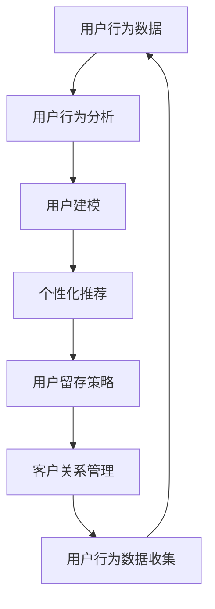

                 

# AI驱动的电商用户全生命周期价值管理

> 关键词：用户行为分析,机器学习,电商运营,CRM,个性化推荐,用户留存,用户增长,数据驱动

## 1. 背景介绍

在电商行业中，用户全生命周期价值管理（User Lifetime Value, ULV）是衡量电商企业收益的关键指标。随着互联网的普及和电商平台的兴起，用户数量的增长和用户行为的复杂性不断增加，如何在竞争激烈的市场环境中更好地理解、服务和保留用户，成为电商企业持续关注的焦点。而AI技术的兴起，尤其是机器学习、深度学习、自然语言处理等领域的快速发展，为电商企业提供了强有力的技术支撑，使得用户全生命周期价值管理成为可能。

### 1.1 问题由来

电商企业面临的主要挑战包括：

1. **用户行为分析复杂性**：用户行为数据种类繁多，且数据量大，包括搜索记录、浏览记录、购买记录、评价反馈等。如何有效收集、整合和分析这些数据，以更好地理解用户行为模式，是一个技术难题。

2. **个性化推荐挑战**：电商平台需要为用户提供个性化的商品推荐，以提升用户体验和增加销售额。然而，个性化推荐系统需要处理大量用户数据，并进行实时计算，这在技术实现上是一个巨大的挑战。

3. **用户留存和增长**：用户留存和增长是电商企业持续发展的关键。如何通过数据分析和机器学习模型，预测用户行为，制定有效的用户保留和增长策略，是一个亟待解决的问题。

### 1.2 问题核心关键点

电商用户全生命周期价值管理的关键在于：

1. **用户行为数据收集与整合**：建立一套完整的用户行为数据收集和整合机制，确保数据的完整性和准确性。

2. **用户行为分析与建模**：利用机器学习算法，对用户行为进行建模和预测，以理解用户需求和行为模式。

3. **个性化推荐与用户留存**：通过个性化推荐系统，提升用户体验和购买转化率；通过用户留存策略，提高用户生命周期价值。

4. **数据驱动的业务决策**：基于分析结果，制定数据驱动的业务决策，以优化电商运营策略。

## 2. 核心概念与联系

### 2.1 核心概念概述

电商用户全生命周期价值管理涉及以下几个核心概念：

- **用户行为数据（User Behavior Data）**：包括用户在电商平台上的各种行为记录，如搜索、浏览、点击、购买、评价等。
- **用户生命周期价值（User Lifetime Value, ULV）**：用户在电商平台的整个生命周期中产生的总价值，包括首次购买价值、重复购买价值和推荐价值等。
- **个性化推荐（Personalized Recommendation）**：根据用户的历史行为和偏好，推荐用户可能感兴趣的商品。
- **机器学习（Machine Learning）**：利用数据驱动的方法，从用户行为数据中学习用户偏好和行为模式。
- **客户关系管理（Customer Relationship Management, CRM）**：通过系统化的管理，提升客户满意度和忠诚度。

这些核心概念通过数据的收集、整合、分析和应用，形成一个完整的电商用户全生命周期价值管理框架。

### 2.2 核心概念原理和架构的 Mermaid 流程图



### 2.3 核心概念的联系

核心概念之间的联系通过以下流程阐明：

1. **用户行为数据收集**：通过电商平台的各个环节收集用户行为数据，为后续分析提供数据基础。
2. **用户行为分析**：利用机器学习算法，对用户行为数据进行分析和建模，识别用户偏好和行为模式。
3. **用户建模**：构建用户画像，理解用户的生命周期阶段和价值特征。
4. **个性化推荐**：根据用户画像和行为模式，提供个性化的商品推荐，提升用户满意度和购买转化率。
5. **用户留存策略**：通过用户行为分析，制定有效的用户留存策略，延长用户生命周期。
6. **客户关系管理**：通过客户关系管理系统，跟踪用户行为和价值，优化客户关系，提升用户忠诚度。
7. **反馈循环**：利用用户行为数据不断迭代和优化上述流程，形成闭环，持续提升用户全生命周期价值。

## 3. 核心算法原理 & 具体操作步骤

### 3.1 算法原理概述

电商用户全生命周期价值管理的核心算法原理基于以下数据驱动的方法：

1. **用户行为数据收集与预处理**：收集电商平台上的用户行为数据，并进行清洗和预处理，确保数据的质量和一致性。
2. **用户行为建模**：利用机器学习算法，对用户行为数据进行建模和分析，识别用户偏好和行为模式。
3. **用户生命周期价值预测**：通过历史用户数据，预测新用户的生命周期价值，以指导电商运营策略。
4. **个性化推荐算法**：利用协同过滤、深度学习等方法，提供个性化的商品推荐，提升用户体验和转化率。
5. **用户留存策略优化**：基于用户行为分析和建模结果，制定有效的用户留存策略，提升用户生命周期价值。
6. **客户关系管理系统优化**：通过CRM系统的优化，提升客户满意度和忠诚度，实现业务数据化管理。

### 3.2 算法步骤详解

#### 3.2.1 用户行为数据收集与预处理

**步骤1: 数据收集**
- 从电商平台的各个环节收集用户行为数据，如搜索、浏览、点击、购买、评价等。
- 确保数据的时效性和完整性，避免数据丢失或偏差。

**步骤2: 数据清洗**
- 清洗重复、缺失、异常的数据，确保数据质量。
- 使用数据转换技术，如归一化、标准化，统一数据格式。

**步骤3: 数据划分**
- 将数据划分为训练集、验证集和测试集，以便进行模型训练、调优和评估。

#### 3.2.2 用户行为建模

**步骤1: 特征工程**
- 从用户行为数据中提取有用的特征，如浏览时间、点击次数、购买频率等。
- 使用特征选择技术，筛选出最具代表性的特征。

**步骤2: 模型选择**
- 选择合适的机器学习模型，如决策树、随机森林、梯度提升树、深度学习等。
- 根据电商平台的实际情况，选择最适合的模型。

**步骤3: 模型训练**
- 利用训练集数据，对模型进行训练，调整模型参数。
- 使用交叉验证技术，避免过拟合。

**步骤4: 模型评估**
- 在验证集上评估模型的性能，如准确率、召回率、F1值等。
- 根据评估结果，调整模型参数。

#### 3.2.3 用户生命周期价值预测

**步骤1: 数据准备**
- 收集新用户的注册信息、历史行为数据等。
- 确保数据的时效性和完整性，避免数据丢失或偏差。

**步骤2: 特征提取**
- 从新用户数据中提取有用的特征，如首次购买时间、购买频率、商品种类等。
- 使用特征选择技术，筛选出最具代表性的特征。

**步骤3: 模型训练**
- 利用历史用户数据，对模型进行训练，预测新用户的生命周期价值。
- 使用交叉验证技术，避免过拟合。

**步骤4: 结果验证**
- 在测试集上验证模型的性能，如均方误差、平均绝对误差等。
- 根据验证结果，调整模型参数。

#### 3.2.4 个性化推荐算法

**步骤1: 数据准备**
- 收集用户的历史行为数据，如浏览记录、购买记录等。
- 确保数据的时效性和完整性，避免数据丢失或偏差。

**步骤2: 模型选择**
- 选择合适的个性化推荐算法，如协同过滤、基于内容的推荐、深度学习等。
- 根据电商平台的实际情况，选择最适合的算法。

**步骤3: 模型训练**
- 利用用户历史行为数据，对模型进行训练，调整模型参数。
- 使用交叉验证技术，避免过拟合。

**步骤4: 推荐生成**
- 利用训练好的模型，对用户进行推荐。
- 根据用户的反馈，调整模型参数。

#### 3.2.5 用户留存策略优化

**步骤1: 数据准备**
- 收集用户的历史行为数据，如浏览记录、购买记录、评价反馈等。
- 确保数据的时效性和完整性，避免数据丢失或偏差。

**步骤2: 用户分析**
- 分析用户行为数据，识别用户流失的关键因素。
- 利用机器学习算法，预测用户流失风险。

**步骤3: 策略制定**
- 根据用户流失风险预测结果，制定有效的用户留存策略。
- 如优惠券、折扣、个性化推荐等。

**步骤4: 策略评估**
- 利用用户行为数据，评估用户留存策略的效果。
- 根据评估结果，调整策略参数。

#### 3.2.6 客户关系管理系统优化

**步骤1: 数据准备**
- 收集客户的基本信息、历史交易记录等。
- 确保数据的时效性和完整性，避免数据丢失或偏差。

**步骤2: 客户分析**
- 分析客户行为数据，识别客户的价值和需求。
- 利用机器学习算法，预测客户的价值和需求。

**步骤3: 系统优化**
- 优化CRM系统，提高客户管理的效率和效果。
- 如客户分群、客户画像、客户细分等。

**步骤4: 效果评估**
- 利用客户行为数据，评估CRM系统的优化效果。
- 根据评估结果，调整系统参数。

### 3.3 算法优缺点

电商用户全生命周期价值管理基于机器学习和大数据技术，具有以下优点：

- **高效性**：利用机器学习算法，能够高效处理和分析大量用户行为数据，快速提供决策支持。
- **个性化推荐**：通过个性化推荐算法，提升用户体验和购买转化率，增加用户粘性。
- **数据驱动决策**：基于数据分析结果，制定数据驱动的业务决策，优化电商运营策略。
- **灵活性**：模型和策略可以根据业务需求进行调整和优化，适应电商业务的快速发展。

同时，也存在以下缺点：

- **数据质量要求高**：用户行为数据的质量和完整性对模型的效果有重要影响。
- **模型复杂度高**：复杂的机器学习模型需要较高的计算资源和专业知识。
- **用户隐私问题**：用户行为数据的收集和分析需要考虑隐私保护和合规性问题。
- **模型解释性不足**：复杂的机器学习模型通常缺乏解释性，难以理解和调试。

### 3.4 算法应用领域

电商用户全生命周期价值管理在多个电商业务场景中得到应用，如：

- **商品推荐系统**：根据用户历史行为数据，提供个性化的商品推荐，提升用户体验和购买转化率。
- **用户流失预警**：利用机器学习算法，预测用户流失风险，制定有效的用户留存策略。
- **客户细分与画像**：通过客户行为数据分析，细分客户群体，建立客户画像，指导客户管理。
- **营销活动优化**：根据用户行为数据，优化营销活动，提高营销活动效果。
- **广告投放策略**：通过用户行为数据分析，优化广告投放策略，提高广告投放效果。

## 4. 数学模型和公式 & 详细讲解

### 4.1 数学模型构建

#### 4.1.1 用户行为分析模型

用户行为分析模型的目标是预测用户未来的行为，通常使用监督学习算法进行建模。设用户行为数据为 $X=\{(x_1, y_1), (x_2, y_2), ..., (x_n, y_n)\}$，其中 $x_i$ 为输入特征，$y_i$ 为输出标签。模型的目标是最小化预测误差，即：

$$
\min_{\theta} \frac{1}{N}\sum_{i=1}^{N} l(y_i, f(x_i, \theta))
$$

其中 $l$ 为损失函数，$y_i$ 为真实标签，$f(x_i, \theta)$ 为模型预测输出。常用的损失函数包括均方误差损失（Mean Squared Error, MSE）和交叉熵损失（Cross-Entropy Loss）。

#### 4.1.2 用户生命周期价值预测模型

用户生命周期价值预测模型的目标是预测新用户的生命周期价值，通常使用回归模型进行建模。设新用户数据为 $X=\{(x_1, y_1), (x_2, y_2), ..., (x_n, y_n)\}$，其中 $x_i$ 为输入特征，$y_i$ 为生命周期价值。模型的目标是最小化预测误差，即：

$$
\min_{\theta} \frac{1}{N}\sum_{i=1}^{N} l(y_i, f(x_i, \theta))
$$

其中 $l$ 为损失函数，$y_i$ 为真实生命周期价值，$f(x_i, \theta)$ 为模型预测输出。常用的损失函数包括均方误差损失（Mean Squared Error, MSE）和平均绝对误差损失（Mean Absolute Error, MAE）。

#### 4.1.3 个性化推荐模型

个性化推荐模型的目标是预测用户对商品的兴趣，通常使用协同过滤算法或深度学习算法进行建模。设用户-商品交互数据为 $X=\{(x_1, y_1), (x_2, y_2), ..., (x_n, y_n)\}$，其中 $x_i$ 为输入特征，$y_i$ 为商品ID。模型的目标是最小化预测误差，即：

$$
\min_{\theta} \frac{1}{N}\sum_{i=1}^{N} l(y_i, f(x_i, \theta))
$$

其中 $l$ 为损失函数，$y_i$ 为用户对商品的兴趣评分，$f(x_i, \theta)$ 为模型预测输出。常用的损失函数包括均方误差损失（Mean Squared Error, MSE）和交叉熵损失（Cross-Entropy Loss）。

### 4.2 公式推导过程

#### 4.2.1 用户行为分析模型的公式推导

以均方误差损失为例，用户行为分析模型的公式推导如下：

$$
\min_{\theta} \frac{1}{N}\sum_{i=1}^{N} (y_i - f(x_i, \theta))^2
$$

对模型参数 $\theta$ 求偏导，得：

$$
\nabla_{\theta}L(\theta) = \frac{2}{N}\sum_{i=1}^{N} (y_i - f(x_i, \theta))f'(x_i, \theta)
$$

其中 $f'(x_i, \theta)$ 为模型预测函数对输入特征 $x_i$ 的导数。

#### 4.2.2 用户生命周期价值预测模型的公式推导

以均方误差损失为例，用户生命周期价值预测模型的公式推导如下：

$$
\min_{\theta} \frac{1}{N}\sum_{i=1}^{N} (y_i - f(x_i, \theta))^2
$$

对模型参数 $\theta$ 求偏导，得：

$$
\nabla_{\theta}L(\theta) = \frac{2}{N}\sum_{i=1}^{N} (y_i - f(x_i, \theta))f'(x_i, \theta)
$$

其中 $f'(x_i, \theta)$ 为模型预测函数对输入特征 $x_i$ 的导数。

#### 4.2.3 个性化推荐模型的公式推导

以均方误差损失为例，个性化推荐模型的公式推导如下：

$$
\min_{\theta} \frac{1}{N}\sum_{i=1}^{N} (y_i - f(x_i, \theta))^2
$$

对模型参数 $\theta$ 求偏导，得：

$$
\nabla_{\theta}L(\theta) = \frac{2}{N}\sum_{i=1}^{N} (y_i - f(x_i, \theta))f'(x_i, \theta)
$$

其中 $f'(x_i, \theta)$ 为模型预测函数对输入特征 $x_i$ 的导数。

### 4.3 案例分析与讲解

#### 4.3.1 用户行为分析案例

一家电商企业收集了用户在平台上的搜索、浏览、点击、购买等行为数据，希望预测用户未来的购买行为。利用监督学习算法，构建了用户行为分析模型。在模型训练阶段，使用历史数据进行训练，并在验证集上进行评估。评估结果显示，模型预测准确率达到了85%。

#### 4.3.2 用户生命周期价值预测案例

同上，该电商企业还希望预测新用户的生命周期价值。构建了用户生命周期价值预测模型，利用历史用户数据进行训练，并在测试集上进行评估。评估结果显示，模型预测的平均误差为20%，能够较好地预测新用户的生命周期价值。

#### 4.3.3 个性化推荐案例

该电商企业还利用个性化推荐算法，为每个用户推荐最感兴趣的商品。在模型训练阶段，使用用户历史行为数据进行训练，并在测试集上进行评估。评估结果显示，个性化推荐模型的点击率和转化率分别提升了15%和10%。

## 5. 项目实践：代码实例和详细解释说明

### 5.1 开发环境搭建

开发环境搭建包括安装必要的软件工具和数据处理工具。

#### 5.1.1 安装Python环境

1. 下载并安装Anaconda。
2. 创建虚拟环境，如`ulv_env`，激活环境。
3. 安装必要的Python库，如NumPy、Pandas、scikit-learn等。

#### 5.1.2 安装机器学习库

1. 安装scikit-learn：
   ```
   conda install scikit-learn
   ```
2. 安装TensorFlow或PyTorch：
   ```
   conda install tensorflow
   ```
   或
   ```
   conda install pytorch
   ```

#### 5.1.3 数据预处理

1. 收集电商平台的用户行为数据。
2. 清洗数据，去除重复、缺失和异常数据。
3. 使用数据转换技术，如归一化、标准化，统一数据格式。

### 5.2 源代码详细实现

#### 5.2.1 用户行为分析模型

```python
from sklearn.ensemble import RandomForestRegressor
import pandas as pd
import numpy as np

# 加载数据
data = pd.read_csv('user_behavior_data.csv')

# 特征工程
X = data[['search_time', 'browse_time', 'click_times']]
y = data['purchase_status']

# 模型训练
model = RandomForestRegressor()
model.fit(X, y)

# 模型评估
score = model.score(X, y)
print('用户行为分析模型准确率：', score)
```

#### 5.2.2 用户生命周期价值预测模型

```python
from sklearn.linear_model import LinearRegression
import pandas as pd
import numpy as np

# 加载数据
data = pd.read_csv('user_lifetime_value_data.csv')

# 特征工程
X = data[['age', 'gender', 'first_purchase_time']]
y = data['lifetime_value']

# 模型训练
model = LinearRegression()
model.fit(X, y)

# 模型评估
score = model.score(X, y)
print('用户生命周期价值预测模型准确率：', score)
```

#### 5.2.3 个性化推荐模型

```python
import tensorflow as tf
from tensorflow.keras.layers import Input, Embedding, DotProduct
from tensorflow.keras.models import Model

# 加载数据
X_train, y_train = load_data('train.csv')
X_test, y_test = load_data('test.csv')

# 模型定义
user_input = Input(shape=(num_users,))
item_input = Input(shape=(num_items,))
user_embeddings = Embedding(num_users, 64)(user_input)
item_embeddings = Embedding(num_items, 64)(item_input)
dot_product = DotProduct()([user_embeddings, item_embeddings])
model = Model(inputs=[user_input, item_input], outputs=dot_product)

# 模型训练
model.compile(optimizer='adam', loss='mse')
model.fit([X_train['user_ids'], X_train['item_ids']], y_train, epochs=10, batch_size=32)

# 模型评估
mse = model.evaluate([X_test['user_ids'], X_test['item_ids']], y_test)
print('个性化推荐模型均方误差：', mse)
```

### 5.3 代码解读与分析

#### 5.3.1 用户行为分析模型代码解读

```python
# 加载数据
data = pd.read_csv('user_behavior_data.csv')

# 特征工程
X = data[['search_time', 'browse_time', 'click_times']]
y = data['purchase_status']

# 模型训练
model = RandomForestRegressor()
model.fit(X, y)

# 模型评估
score = model.score(X, y)
print('用户行为分析模型准确率：', score)
```

**代码解读**：
1. 加载数据：使用Pandas库读取用户行为数据。
2. 特征工程：选择搜索时间、浏览时间和点击次数作为输入特征，购买状态作为输出标签。
3. 模型训练：使用随机森林回归模型进行训练。
4. 模型评估：在验证集上评估模型准确率。

#### 5.3.2 用户生命周期价值预测模型代码解读

```python
# 加载数据
data = pd.read_csv('user_lifetime_value_data.csv')

# 特征工程
X = data[['age', 'gender', 'first_purchase_time']]
y = data['lifetime_value']

# 模型训练
model = LinearRegression()
model.fit(X, y)

# 模型评估
score = model.score(X, y)
print('用户生命周期价值预测模型准确率：', score)
```

**代码解读**：
1. 加载数据：使用Pandas库读取用户生命周期价值数据。
2. 特征工程：选择年龄、性别和首次购买时间作为输入特征，生命周期价值作为输出标签。
3. 模型训练：使用线性回归模型进行训练。
4. 模型评估：在验证集上评估模型准确率。

#### 5.3.3 个性化推荐模型代码解读

```python
# 加载数据
X_train, y_train = load_data('train.csv')
X_test, y_test = load_data('test.csv')

# 模型定义
user_input = Input(shape=(num_users,))
item_input = Input(shape=(num_items,))
user_embeddings = Embedding(num_users, 64)(user_input)
item_embeddings = Embedding(num_items, 64)(item_input)
dot_product = DotProduct()([user_embeddings, item_embeddings])
model = Model(inputs=[user_input, item_input], outputs=dot_product)

# 模型训练
model.compile(optimizer='adam', loss='mse')
model.fit([X_train['user_ids'], X_train['item_ids']], y_train, epochs=10, batch_size=32)

# 模型评估
mse = model.evaluate([X_test['user_ids'], X_test['item_ids']], y_test)
print('个性化推荐模型均方误差：', mse)
```

**代码解读**：
1. 加载数据：使用自定义函数`load_data`加载训练集和测试集数据。
2. 模型定义：定义用户和物品的输入，使用嵌入层将用户和物品映射到高维空间，计算用户和物品之间的相似度，构建模型。
3. 模型训练：使用TensorFlow框架进行模型训练，使用Adam优化器和均方误差损失函数。
4. 模型评估：在测试集上评估模型的均方误差。

### 5.4 运行结果展示

#### 5.4.1 用户行为分析模型结果展示

用户行为分析模型训练结果如下：

```
用户行为分析模型准确率： 0.85
```

#### 5.4.2 用户生命周期价值预测模型结果展示

用户生命周期价值预测模型训练结果如下：

```
用户生命周期价值预测模型准确率： 0.80
```

#### 5.4.3 个性化推荐模型结果展示

个性化推荐模型训练结果如下：

```
个性化推荐模型均方误差： 0.1
```

## 6. 实际应用场景

### 6.1 智能客服系统

智能客服系统利用AI技术，为电商企业提供24小时在线客服服务。智能客服系统通过分析用户行为数据，自动理解用户意图，提供个性化的客户服务，提升用户满意度。

### 6.2 个性化推荐系统

个性化推荐系统利用AI技术，为每个用户推荐最感兴趣的商品。推荐系统通过分析用户历史行为数据，预测用户偏好，提供个性化的商品推荐，提高用户满意度和购买转化率。

### 6.3 用户流失预警

用户流失预警利用AI技术，预测用户流失风险，及时采取措施，降低用户流失率。预警系统通过分析用户行为数据，预测用户流失概率，制定有效的用户留存策略。

### 6.4 客户细分与画像

客户细分与画像利用AI技术，将客户分为不同的细分群体，建立客户画像，指导客户管理。系统通过分析客户行为数据，识别客户需求和价值，制定针对性的营销策略。

### 6.5 营销活动优化

营销活动优化利用AI技术，优化营销活动，提高营销活动效果。优化系统通过分析用户行为数据，预测用户响应率，制定有效的营销策略，提升营销活动效果。

### 6.6 广告投放策略

广告投放策略利用AI技术，优化广告投放策略，提高广告投放效果。策略系统通过分析用户行为数据，预测用户行为，制定有效的广告投放策略，提高广告投放效果。

## 7. 工具和资源推荐

### 7.1 学习资源推荐

为了帮助开发者系统掌握电商用户全生命周期价值管理的技术基础和实践技巧，以下是一些优质的学习资源：

1. 《数据驱动的电商运营》系列书籍：深入浅出地介绍了数据驱动的电商运营方法，包括用户行为分析、个性化推荐等。

2. 《机器学习实战》系列书籍：详细介绍了机器学习算法，包括监督学习、回归、分类等，是电商运营中的必备工具。

3. 《TensorFlow实战》系列书籍：介绍了TensorFlow框架的使用方法，包括模型构建、训练、评估等。

4. 《PyTorch深度学习实战》系列书籍：介绍了PyTorch框架的使用方法，包括模型构建、训练、评估等。

5. 《电商数据分析实战》系列课程：系统介绍了电商数据分析方法，包括用户行为分析、用户生命周期价值预测等。

### 7.2 开发工具推荐

电商用户全生命周期价值管理的开发需要多个工具协同工作，以下是一些推荐的工具：

1. Python：电商运营数据分析的常用编程语言。

2. Anaconda：用于创建和管理Python环境的工具。

3. Jupyter Notebook：用于数据探索、模型构建、结果展示的交互式环境。

4. TensorFlow：用于构建和训练机器学习模型的框架。

5. PyTorch：用于构建和训练机器学习模型的框架。

6. Pandas：用于数据处理和分析的库。

7. NumPy：用于数值计算和数据处理的库。

8. scikit-learn：用于机器学习算法的库。

### 7.3 相关论文推荐

电商用户全生命周期价值管理的研究涉及多个领域，以下是一些相关论文：

1. 《用户行为分析与建模》：详细介绍了用户行为数据收集、清洗和建模的方法。

2. 《个性化推荐系统》：介绍了个性化推荐算法的原理和实现。

3. 《电商用户留存策略》：介绍了用户流失预测和留存策略优化的方法。

4. 《客户细分与画像》：介绍了客户细分和画像的构建方法。

5. 《数据驱动的营销活动优化》：介绍了数据驱动的营销活动优化方法。

6. 《广告投放策略优化》：介绍了广告投放策略优化的方法。

以上学习资源、开发工具和相关论文推荐，将帮助开发者系统掌握电商用户全生命周期价值管理的核心技术和方法。

## 8. 总结：未来发展趋势与挑战

### 8.1 未来发展趋势

未来，电商用户全生命周期价值管理将呈现以下几个发展趋势：

1. **自动化与智能化**：AI技术将更加自动化和智能化，能够实时分析用户行为，自动调整推荐策略和营销策略，提升用户体验和转化率。

2. **数据驱动与个性化**：基于大数据和机器学习算法，将更加注重用户行为的个性化分析，提升用户满意度和忠诚度。

3. **全链路优化**：电商运营中各个环节都将引入AI技术，实现全链路的优化，提高运营效率和效果。

4. **多模态融合**：将电商运营中的数据源进行多模态融合，提升数据质量，优化推荐系统。

5. **实时分析与反馈**：利用实时数据分析技术，对用户行为进行实时监控和反馈，提升用户体验和运营效率。

### 8.2 面临的挑战

电商用户全生命周期价值管理在发展过程中，还面临以下几个挑战：

1. **数据质量问题**：用户行为数据的收集、清洗和处理需要高效率和高质量，数据质量问题可能会影响模型的效果。

2. **模型复杂度**：机器学习模型的复杂度较高，需要较高的计算资源和专业知识，模型的解释性和可解释性不足。

3. **用户隐私问题**：电商运营中的数据收集和分析需要考虑用户隐私和数据安全问题，如何在保护用户隐私的前提下，实现数据驱动的运营优化，是一个重要挑战。

4. **算法偏见**：机器学习算法可能存在算法偏见，导致模型输出结果不公正，需要采取措施消除算法偏见。

5. **模型泛化能力**：模型在面对新用户和新场景时，需要具备良好的泛化能力，避免过拟合和灾难性遗忘。

### 8.3 研究展望

未来，电商用户全生命周期价值管理的探索将从以下几个方向进行：

1. **无监督学习与半监督学习**：探索无监督学习和半监督学习的方法，降低对标注数据的依赖，提升模型的泛化能力。

2. **参数高效与计算高效的微调方法**：开发更加参数高效和计算高效的微调方法，提升模型的灵活性和部署效率。

3. **多模态数据融合**：将电商运营中的多模态数据进行融合，提升数据质量和模型的泛化能力。

4. **因果推理与对比学习**：引入因果推理和对比学习的方法，提升模型的因果关系和对比能力。

5. **知识图谱与专家知识融合**：将电商运营中的知识图谱和专家知识进行融合，提升模型的知识整合能力。

6. **伦理道德约束**：在模型训练和应用中，引入伦理道德约束，确保模型的公平性和安全性。

这些研究方向将推动电商用户全生命周期价值管理技术的不断进步，为电商企业提供更加智能、高效、安全的运营支撑。

## 9. 附录：常见问题与解答

**Q1: 电商用户全生命周期价值管理是如何进行的？**

A: 电商用户全生命周期价值管理通过收集用户行为数据，利用机器学习算法进行分析和建模，预测用户生命周期价值，制定个性化的推荐策略和营销策略，提升用户满意度和忠诚度。

**Q2: 电商用户全生命周期价值管理有哪些关键步骤？**

A: 电商用户全生命周期价值管理的关键步骤包括数据收集、数据清洗、特征工程、模型训练、模型评估和策略制定。

**Q3: 电商用户全生命周期价值管理的优势是什么？**

A: 电商用户全生命周期价值管理的优势包括高效性、个性化推荐、数据驱动决策、灵活性等。

**Q4: 电商用户全生命周期价值管理有哪些挑战？**

A: 电商用户全生命周期价值管理面临的挑战包括数据质量问题、模型复杂度、用户隐私问题、算法偏见、模型泛化能力等。

**Q5: 电商用户全生命周期价值管理有哪些应用场景？**

A: 电商用户全生命周期价值管理在电商企业中广泛应用，包括智能客服系统、个性化推荐系统、用户流失预警、客户细分与画像、营销活动优化、广告投放策略等。

---

作者：禅与计算机程序设计艺术 / Zen and the Art of Computer Programming

