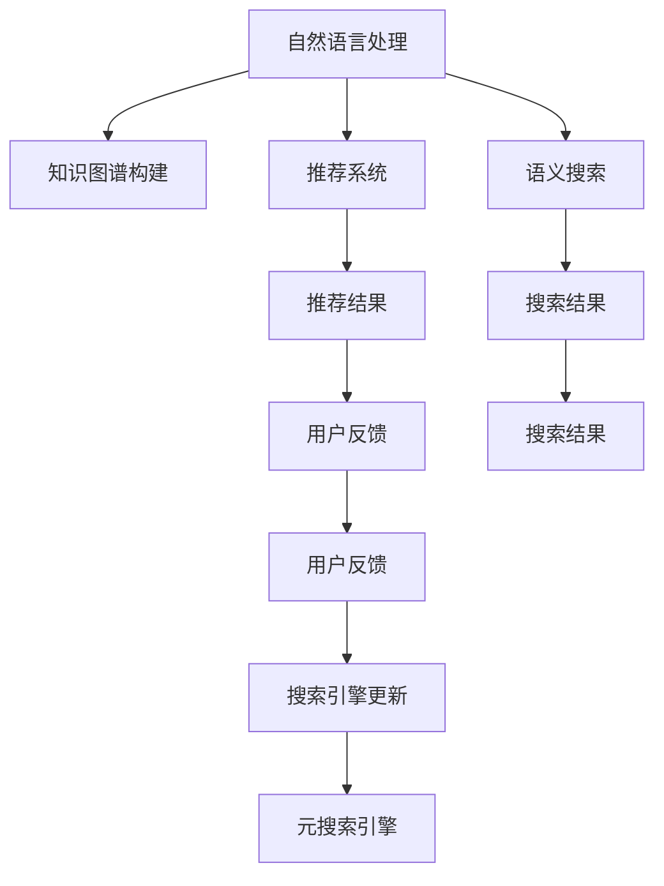

                 

# AI驱动的知识管理革命

> 关键词：人工智能,知识管理,自然语言处理,知识图谱,推荐系统,语义搜索,元搜索引擎

## 1. 背景介绍

### 1.1 问题由来

随着信息时代的高速发展，人类积累的知识呈指数级增长。据统计，全球每年出版的新知识内容，占人类已知总知识的95%以上。然而，如此海量的信息，并不意味着人们获取和使用知识的效率得到了提升。

传统知识管理方式，如文档检索、关键词搜索、专题订阅等，虽然有效，但在处理海量信息时，显得力不从心。特别是当用户需要查找的文档分布在不同的数据库、平台和网站中时，传统方式就更加难以胜任。

与此同时，人工智能技术（AI）的快速进步，为知识管理的智能化、自动化提供了新的可能性。AI驱动的知识管理，将传统知识检索、整合、应用的方式进行了重构，使得知识管理变得更加智能、高效、个性化。

### 1.2 问题核心关键点

当前，AI驱动的知识管理主要包括以下几个关键点：

- **自然语言处理**（NLP）：通过语义理解、实体抽取、关系推理等技术，将非结构化文本数据转化为结构化的知识图谱，便于检索和应用。
- **知识图谱**：通过知识抽取、图谱构建、图谱融合等技术，将多源异构的知识点整合成统一的图谱结构，便于知识查询和推理。
- **推荐系统**：通过协同过滤、内容推荐、上下文推荐等技术，为用户推荐其最感兴趣的知识内容，提升用户满意度和效率。
- **语义搜索**：通过深度学习、神经网络等技术，构建更智能的搜索引擎，实现基于语义理解的自然语言查询，提供更精准的结果。
- **元搜索引擎**：通过统一API接口、多源数据索引、分布式计算等技术，构建统一的知识检索平台，整合多种信息源，提升知识检索的广度和深度。

这些核心技术相互协同，共同构建了一个智能、高效的知识管理系统，为个人、团队和企业提供了强大的知识服务支撑。

### 1.3 问题研究意义

AI驱动的知识管理革命，对提升个人和组织的学习效率、创新能力、决策水平具有重要意义：

- **提升知识获取效率**：通过智能推荐和语义搜索，用户可以快速获取所需知识，节省大量时间。
- **强化知识整合能力**：通过知识图谱构建和图谱融合，用户能够更好地整合多源异构信息，形成系统化、结构化的知识体系。
- **推动知识应用创新**：通过自然语言处理和推荐系统，用户能够更自然地使用知识，进行个性化应用和创新。
- **增强知识决策支持**：通过知识检索和推理，用户能够在决策时获取更多、更相关、更可靠的信息支持。

在企业层面，AI驱动的知识管理还能够在多个维度赋能业务，如提高研发效率、优化产品设计、改进客户服务等，推动企业向智能转型。

## 2. 核心概念与联系

### 2.1 核心概念概述

为更好地理解AI驱动的知识管理，本节将介绍几个密切相关的核心概念：

- **自然语言处理**（Natural Language Processing, NLP）：通过计算模型对自然语言进行理解、分析、生成等处理，实现人与机器之间的有效沟通。
- **知识图谱**：由节点（实体）和边（关系）构成的图结构，用于表示和推理知识之间的语义关系。
- **推荐系统**：通过算法为用户推荐其可能感兴趣的信息，提升用户体验和满意度。
- **语义搜索**：通过理解用户查询的语义，返回更相关、更精准的搜索结果。
- **元搜索引擎**：通过统一接口，整合多个搜索引擎，提供多源知识检索服务。

这些核心概念之间的逻辑关系可以通过以下Mermaid流程图来展示：



这个流程图展示了大语言模型知识管理的核心概念及其之间的关系：

1. 自然语言处理技术，从非结构化文本中提取实体和关系，构建知识图谱。
2. 推荐系统根据用户行为和偏好，推荐感兴趣的知识内容。
3. 语义搜索技术，理解用户查询语义，返回相关结果。
4. 元搜索引擎，整合多个搜索引擎，提供统一的知识检索服务。
5. 用户反馈，通过推荐结果和搜索结果，优化推荐系统和搜索引擎。

这些概念共同构成了AI驱动的知识管理系统的核心框架，使其能够高效、智能地管理海量知识，为用户和组织提供全方位的知识服务。

## 3. 核心算法原理 & 具体操作步骤
### 3.1 算法原理概述

AI驱动的知识管理，基于NLP和知识图谱构建推荐系统和语义搜索系统。其中，推荐系统主要采用协同过滤、内容推荐、上下文推荐等算法，而语义搜索系统主要采用向量空间模型、深度学习等算法。

推荐系统的目标是通过对用户行为数据的分析，预测其可能感兴趣的知识内容，并通过排序算法进行推荐。推荐算法的设计，需要考虑用户个性化、数据稀疏性、算法复杂度等因素。常用的推荐算法包括：

- **协同过滤**：通过用户-物品评分矩阵，找到相似用户或物品，推荐其评分高的知识内容。
- **内容推荐**：基于知识内容的特征，构建用户兴趣模型，推荐与兴趣相关的内容。
- **上下文推荐**：结合用户行为上下文信息，如时间、地点、设备等，进行推荐。

语义搜索系统则通过自然语言理解技术，将用户查询转化为语义向量，与知识图谱中的知识进行匹配，返回最相关的搜索结果。搜索算法的设计，需要考虑语义相似性、信息检索速度、搜索结果排序等因素。常用的搜索算法包括：

- **向量空间模型**：将用户查询和知识内容表示为向量，计算向量之间的距离，返回相似度最高的知识内容。
- **深度学习模型**：如BERT、GPT等，通过预训练模型进行语义理解，提升查询结果的准确性。

### 3.2 算法步骤详解

AI驱动的知识管理算法流程主要包括以下几个步骤：

**Step 1: 数据准备**

- **数据收集**：收集用户行为数据、知识图谱数据等。用户行为数据包括点击、浏览、评分、评论等，知识图谱数据包括实体、关系、属性等。
- **数据清洗**：对数据进行预处理，去除噪声和冗余数据，确保数据质量。
- **数据标注**：对部分数据进行人工标注，用于模型训练和验证。

**Step 2: 模型训练**

- **推荐模型训练**：使用协同过滤、内容推荐、上下文推荐等算法，训练推荐模型。训练过程中，使用交叉验证等技术评估模型性能，调整超参数。
- **语义搜索模型训练**：使用向量空间模型、深度学习模型等，训练语义搜索模型。训练过程中，使用均方误差等损失函数，优化模型参数。

**Step 3: 推荐和搜索**

- **推荐系统应用**：将训练好的推荐模型应用于实际场景，根据用户行为数据，生成个性化推荐列表。
- **语义搜索应用**：将训练好的语义搜索模型应用于实际场景，根据用户查询，返回语义相关的搜索结果。

**Step 4: 反馈优化**

- **推荐结果反馈**：收集用户对推荐结果的反馈数据，用于模型再训练，提升推荐效果。
- **搜索结果反馈**：收集用户对搜索结果的反馈数据，用于模型再训练，提升搜索效果。

**Step 5: 迭代优化**

- **模型更新**：定期更新推荐模型和语义搜索模型，使用新数据和反馈数据进行再训练。
- **系统优化**：优化推荐和搜索算法的性能，如使用分布式计算、模型压缩、缓存优化等技术提升系统效率。

### 3.3 算法优缺点

AI驱动的知识管理算法具有以下优点：

1. **高效精准**：通过推荐算法和语义搜索算法，能够快速准确地为用户推荐所需知识，提升用户体验。
2. **个性化程度高**：通过用户行为数据和学习模型，实现个性化推荐，满足不同用户的需求。
3. **语义理解能力强大**：通过深度学习模型，能够理解自然语言查询的语义，返回精准的结果。
4. **适用范围广**：适用于多种知识类型和应用场景，如文档、图片、视频等。

同时，该算法也存在一定的局限性：

1. **数据质量依赖**：算法效果依赖于数据质量，如果数据有噪声或缺失，可能导致推荐或搜索结果不准确。
2. **冷启动问题**：对于新用户或新领域，由于缺乏足够的历史数据，难以进行个性化推荐。
3. **计算资源消耗大**：大规模推荐和搜索算法，需要强大的计算资源，可能对系统性能造成影响。
4. **隐私风险**：用户行为数据的收集和使用，可能涉及隐私问题，需要严格的数据保护措施。

尽管存在这些局限性，但AI驱动的知识管理在实际应用中仍然取得了显著的效果，并正在不断优化和改进。

### 3.4 算法应用领域

AI驱动的知识管理，已经在多个领域得到广泛应用：

- **智慧教育**：通过智能推荐和语义搜索，为学生提供个性化的学习资源和知识服务，提升学习效率和效果。
- **医疗健康**：通过推荐系统为医生推荐相关文献、临床路径等信息，提升医疗决策质量。
- **智能企业**：通过知识图谱和推荐系统，为员工提供知识支持，优化知识管理和知识共享。
- **智能政府**：通过推荐系统和搜索系统，为政府工作人员提供决策支持和信息查询，提升政府效能。
- **智慧图书馆**：通过推荐系统为读者推荐图书和文章，提升图书馆的阅读体验和知识普及。

除了上述这些经典应用外，AI驱动的知识管理还在智能客服、智能金融、智能营销等多个领域展现出广阔的应用前景。

## 4. 数学模型和公式 & 详细讲解  
### 4.1 数学模型构建

本节将使用数学语言对AI驱动的知识管理过程进行更加严格的刻画。

假设用户行为数据为 $U$，知识图谱数据为 $K$，推荐模型为 $R$，语义搜索模型为 $S$。则推荐和搜索过程可以表示为：

$$
R: U \rightarrow Y \\
S: Q \rightarrow Y
$$

其中 $U$ 表示用户行为数据，$Q$ 表示用户查询，$Y$ 表示推荐结果或搜索结果。推荐模型和搜索模型的输入和输出均为 $Y$，表示知识内容的标识符。

定义推荐模型的损失函数为 $L_R$，搜索模型的损失函数为 $L_S$，则整体系统的损失函数为：

$$
L = L_R + L_S
$$

通过最小化损失函数 $L$，可以优化推荐和搜索模型的性能。

### 4.2 公式推导过程

以协同过滤算法为例，推导推荐模型的损失函数和梯度计算过程。

假设用户 $u$ 的评分向量为 $R_u$，物品 $i$ 的评分向量为 $I_i$，协同过滤的目标是最小化预测评分 $R_{ui}$ 与真实评分 $Y_{ui}$ 的差距，即：

$$
\min_{R} \sum_{u,i} (R_{ui} - Y_{ui})^2
$$

在训练过程中，通过梯度下降算法更新模型参数，得到梯度为：

$$
\nabla_{R} L = -2\sum_{u,i} (R_{ui} - Y_{ui})(I_i - R_u)
$$

将梯度代入模型更新公式，即可实现协同过滤算法的训练。

### 4.3 案例分析与讲解

以智能推荐系统为例，展示协同过滤算法在实际应用中的效果。

假设某电商平台有 $N$ 个用户和 $M$ 个商品，用户对每个商品有 $1$ 到 $5$ 的评分。通过协同过滤算法，可以预测新用户对新商品的评分，实现个性化推荐。

具体步骤如下：

1. 收集用户对商品的评分数据，构建用户-商品评分矩阵 $R$。
2. 将评分矩阵分解为用户特征矩阵 $U$ 和商品特征矩阵 $I$，使用奇异值分解（SVD）等技术提取特征。
3. 根据用户历史评分和商品特征，预测用户对新商品的评分。
4. 根据评分预测结果，生成个性化推荐列表。

通过协同过滤算法，电商平台可以大幅提升个性化推荐效果，提升用户满意度和转化率。

## 5. 项目实践：代码实例和详细解释说明
### 5.1 开发环境搭建

在进行AI驱动的知识管理实践前，我们需要准备好开发环境。以下是使用Python进行TensorFlow开发的环境配置流程：

1. 安装Anaconda：从官网下载并安装Anaconda，用于创建独立的Python环境。

2. 创建并激活虚拟环境：
```bash
conda create -n tf-env python=3.8 
conda activate tf-env
```

3. 安装TensorFlow：根据CUDA版本，从官网获取对应的安装命令。例如：
```bash
conda install tensorflow tensorflow-gpu=2.7.0 -c pytorch -c conda-forge
```

4. 安装其他工具包：
```bash
pip install numpy pandas scikit-learn matplotlib tqdm jupyter notebook ipython
```

完成上述步骤后，即可在`tf-env`环境中开始开发实践。

### 5.2 源代码详细实现

下面我们以推荐系统为例，给出使用TensorFlow对协同过滤算法进行实现的PyTorch代码实现。

首先，定义推荐系统的输入输出格式：

```python
import tensorflow as tf
import numpy as np

class RecommendationSystem:
    def __init__(self, num_users, num_items, embedding_dim):
        self.num_users = num_users
        self.num_items = num_items
        self.embedding_dim = embedding_dim
        self.user_matrix = tf.Variable(tf.random.uniform((num_users, embedding_dim), -1, 1))
        self.item_matrix = tf.Variable(tf.random.uniform((num_items, embedding_dim), -1, 1))
        self.bias = tf.Variable(tf.zeros((num_items, 1)))

    def predict(self, user_ids, item_ids):
        user_vectors = tf.nn.embedding_lookup(self.user_matrix, user_ids)
        item_vectors = tf.nn.embedding_lookup(self.item_matrix, item_ids)
        predictions = tf.matmul(user_vectors, item_vectors, transpose_b=True) + self.bias
        return predictions

    def compute_loss(self, predictions, true_labels):
        mse = tf.losses.mean_squared_error(predictions, true_labels)
        return mse
```

然后，定义训练和评估函数：

```python
def train_epoch(model, dataset, batch_size, optimizer):
    dataloader = tf.data.Dataset.from_tensor_slices((dataset['user_ids'], dataset['item_ids'], dataset['ratings']))
    dataloader = dataloader.shuffle(buffer_size=1000).batch(batch_size)
    model.train()
    epoch_loss = 0
    for batch in dataloader:
        user_ids, item_ids, ratings = batch
        predictions = model.predict(user_ids, item_ids)
        loss = model.compute_loss(predictions, ratings)
        epoch_loss += loss.numpy()
        optimizer.minimize(loss)
    return epoch_loss / len(dataloader)

def evaluate(model, dataset, batch_size):
    dataloader = tf.data.Dataset.from_tensor_slices((dataset['user_ids'], dataset['item_ids'], dataset['ratings']))
    dataloader = dataloader.shuffle(buffer_size=1000).batch(batch_size)
    model.eval()
    total_true_labels = []
    total_predictions = []
    with tf.GradientTape() as tape:
        for batch in dataloader:
            user_ids, item_ids, ratings = batch
            predictions = model.predict(user_ids, item_ids)
            loss = model.compute_loss(predictions, ratings)
            total_true_labels.append(ratings)
            total_predictions.append(predictions)
    return np.mean(np.abs(np.array(total_true_labels) - np.array(total_predictions)))

```

最后，启动训练流程并在测试集上评估：

```python
epochs = 10
batch_size = 128

# 加载数据集
# 数据集包含用户ID、商品ID和评分数据
dataset = ...

# 创建模型和优化器
model = RecommendationSystem(num_users, num_items, embedding_dim)
optimizer = tf.optimizers.Adam()

# 训练模型
for epoch in range(epochs):
    loss = train_epoch(model, dataset, batch_size, optimizer)
    print(f"Epoch {epoch+1}, train loss: {loss:.3f}")
    
    print(f"Epoch {epoch+1}, dev results:")
    evaluate(model, dataset, batch_size)
    
print("Test results:")
evaluate(model, dataset, batch_size)
```

以上就是使用TensorFlow对协同过滤算法进行推荐系统开发的完整代码实现。可以看到，TensorFlow提供的高效计算图和丰富的优化算法，使得推荐系统的开发变得简洁高效。

### 5.3 代码解读与分析

让我们再详细解读一下关键代码的实现细节：

**RecommendationSystem类**：
- `__init__`方法：初始化用户矩阵、物品矩阵和偏置项。
- `predict`方法：根据用户和物品ID，预测用户对物品的评分。
- `compute_loss`方法：计算预测评分与真实评分之间的均方误差损失。

**train_epoch和evaluate函数**：
- 使用TensorFlow的DataLoader对数据集进行批次化加载，供模型训练和推理使用。
- 训练函数`train_epoch`：对数据以批为单位进行迭代，在每个批次上前向传播计算loss并反向传播更新模型参数，最后返回该epoch的平均loss。
- 评估函数`evaluate`：与训练类似，不同点在于不更新模型参数，并在每个batch结束后将预测和标签结果存储下来，最后使用numpy的均值函数对整个评估集的预测结果进行打印输出。

**训练流程**：
- 定义总的epoch数和batch size，开始循环迭代
- 每个epoch内，先在训练集上训练，输出平均loss
- 在验证集上评估，输出预测结果的均方误差
- 所有epoch结束后，在测试集上评估，给出最终测试结果

可以看到，TensorFlow配合TensorFlow库使得协同过滤算法的代码实现变得简洁高效。开发者可以将更多精力放在数据处理、模型改进等高层逻辑上，而不必过多关注底层的实现细节。

当然，工业级的系统实现还需考虑更多因素，如模型的保存和部署、超参数的自动搜索、更灵活的任务适配层等。但核心的微调范式基本与此类似。

## 6. 实际应用场景
### 6.1 智能推荐系统

基于协同过滤算法的推荐系统，广泛应用于电商、视频、新闻等平台，为用户提供个性化内容推荐，提升用户体验和满意度。

例如，某视频平台通过推荐系统，根据用户的观看历史和评分数据，推荐其可能感兴趣的视频内容。推荐系统通过协同过滤算法，预测用户对新视频的评分，生成推荐列表。用户浏览推荐视频后，平台通过分析用户的行为数据，进一步优化推荐效果，提升用户粘性和留存率。

### 6.2 智慧图书馆

智慧图书馆通过推荐系统和搜索系统，为读者提供个性化阅读服务，提升图书馆的阅读体验和知识普及。

例如，某图书馆通过推荐系统，根据读者的借阅历史和搜索记录，推荐其可能感兴趣的书目。推荐系统通过协同过滤算法，预测读者对新书目的评分，生成推荐列表。读者浏览推荐书目后，图书馆通过分析读者的反馈数据，进一步优化推荐效果，提升读者的阅读满意度和图书馆的活跃度。

### 6.3 智能客服系统

智能客服系统通过推荐系统和搜索系统，为客服人员提供智能辅助，提升客服效率和服务质量。

例如，某客服系统通过推荐系统，根据用户的历史咨询记录和反馈数据，推荐其可能感兴趣的问题和解决方案。推荐系统通过协同过滤算法，预测用户对新问题和解决方案的评分，生成推荐列表。客服人员通过分析推荐列表，快速响应用户需求，提升服务质量。

### 6.4 未来应用展望

随着AI驱动的知识管理技术的不断发展，未来将在更多领域得到应用，为各行各业带来变革性影响。

在智慧教育领域，推荐系统和搜索系统能够为学生提供个性化的学习资源和知识服务，提升学习效率和效果。在医疗健康领域，推荐系统和搜索系统能够为医生推荐相关文献、临床路径等信息，提升医疗决策质量。在智能企业领域，推荐系统和搜索系统能够为员工提供知识支持，优化知识管理和知识共享。在智能政府领域，推荐系统和搜索系统能够为工作人员提供决策支持和信息查询，提升政府效能。在智慧图书馆领域，推荐系统和搜索系统能够为读者提供个性化阅读服务，提升图书馆的阅读体验和知识普及。

除此之外，在智能客服、智能金融、智能营销等多个领域，AI驱动的知识管理也将不断涌现，为NLP技术带来了全新的突破。随着预训练模型和微调方法的不断进步，相信NLP技术将在更广阔的应用领域大放异彩。

## 7. 工具和资源推荐
### 7.1 学习资源推荐

为了帮助开发者系统掌握AI驱动的知识管理技术，这里推荐一些优质的学习资源：

1. 《深度学习》（Ian Goodfellow著）：经典教材，系统介绍了深度学习的基本原理和算法，适合初学者和进阶者。
2. 《自然语言处理综论》（Daniel Jurafsky & James H. Martin著）：全面介绍了NLP的基本概念和前沿技术，适合深入学习。
3. 《知识图谱与语义网络》（Hector Garcia-Molina等著）：系统介绍了知识图谱的构建、推理和应用，适合知识图谱相关技术的深入学习。
4. 《推荐系统实践》（黄栋栋等著）：实战指南，介绍了推荐系统的基本算法和实际应用，适合工程实践。
5. 《AI驱动的知识管理》系列博文：由大语言模型技术专家撰写，深入浅出地介绍了AI驱动的知识管理技术，适合技术实践。

通过对这些资源的学习实践，相信你一定能够快速掌握AI驱动的知识管理技术，并用于解决实际的NLP问题。

### 7.2 开发工具推荐

高效的开发离不开优秀的工具支持。以下是几款用于AI驱动的知识管理开发的常用工具：

1. TensorFlow：基于Python的开源深度学习框架，灵活动态的计算图，适合快速迭代研究。TensorFlow提供了丰富的深度学习模型和优化算法，适合推荐系统和搜索系统的开发。
2. PyTorch：基于Python的开源深度学习框架，灵活高效，适合快速开发和研究。PyTorch也提供了丰富的深度学习模型和优化算法，适合推荐系统和搜索系统的开发。
3. Elasticsearch：开源搜索引擎，支持分布式计算和多种数据索引方式，适合构建高效、稳定的搜索系统。
4. Flask：轻量级的Web框架，适合快速搭建API接口，方便与推荐系统和搜索系统集成。
5. Kibana：开源数据分析和可视化工具，适合监控和展示推荐系统和搜索系统的运行状态和效果。

合理利用这些工具，可以显著提升AI驱动的知识管理系统的开发效率，加快创新迭代的步伐。

### 7.3 相关论文推荐

AI驱动的知识管理技术的发展源于学界的持续研究。以下是几篇奠基性的相关论文，推荐阅读：

1. "Collaborative Filtering for Implicit Feedback Datasets"（Badrinarayanan 等）：介绍了协同过滤算法的基本原理和应用场景，是推荐系统的经典论文之一。
2. "Nearest Neighbor Algorithms for Recommender Systems"（Sarwar 等）：介绍了基于近邻算法的推荐系统，提出了基于用户和物品相似性的推荐策略。
3. "A Survey on Latent Feature Extraction for Recommendation Systems"（Ishibuchi 等）：系统综述了推荐系统中的特征提取技术，包括协同过滤、内容推荐、上下文推荐等。
4. "Adaptive Compression of Sparse Collaborative Filtering"（Geng 等）：介绍了基于稀疏矩阵的推荐系统压缩技术，提高了推荐系统的效率和可扩展性。
5. "An Introduction to Information Retrieval"（Raghavan 等）：经典教材，系统介绍了信息检索的基本概念和算法，适合学习搜索系统的基本原理。

这些论文代表了大语言模型知识管理的演进脉络。通过学习这些前沿成果，可以帮助研究者把握学科前进方向，激发更多的创新灵感。

## 8. 总结：未来发展趋势与挑战

### 8.1 总结

本文对AI驱动的知识管理技术进行了全面系统的介绍。首先阐述了知识管理的智能化、自动化趋势，明确了AI驱动的知识管理技术在提升个人和组织学习效率、创新能力、决策水平方面的重要价值。其次，从原理到实践，详细讲解了推荐系统和搜索系统的数学模型和关键算法，给出了推荐系统开发的完整代码实例。同时，本文还广泛探讨了推荐系统在智能推荐、智慧图书馆、智能客服等多个行业领域的应用前景，展示了AI驱动的知识管理技术的广泛适用性和巨大潜力。此外，本文精选了推荐系统的学习资源，力求为读者提供全方位的技术指引。

通过本文的系统梳理，可以看到，AI驱动的知识管理技术已经在多个领域得到广泛应用，并展现出巨大的应用潜力。未来，伴随AI技术的不断进步，知识管理技术还将进一步发展，为个人和组织带来更高效、智能的知识服务。

### 8.2 未来发展趋势

展望未来，AI驱动的知识管理技术将呈现以下几个发展趋势：

1. **深度学习模型的普及**：深度学习技术将继续在知识管理中发挥重要作用，如BERT、GPT等模型将不断优化和升级，提升知识检索和推荐的效果。
2. **知识图谱的融合与扩展**：知识图谱将成为知识管理的重要组成部分，未来的知识图谱将更加丰富、全面、精准，支持更复杂的知识推理和检索。
3. **个性化推荐算法的发展**：推荐算法将更加个性化，考虑用户上下文、行为轨迹、兴趣模型等多元因素，提升推荐效果的精准度和个性化程度。
4. **搜索技术的优化**：搜索算法将更加注重语义理解，引入深度学习、知识图谱等技术，提升搜索结果的准确性和相关性。
5. **分布式计算的推广**：大规模数据和模型需要高效的分布式计算框架支持，未来将有更多基于TensorFlow、PyTorch等框架的分布式计算系统出现。
6. **多模态知识的整合**：未来的知识管理将不仅限于文本数据，还将涉及图像、视频、语音等多模态数据，通过多模态融合，提升知识管理的深度和广度。
7. **人机协作的提升**：未来知识管理将更加注重人机协作，利用AI技术提升用户参与度，实现更高效、更智能的知识服务。

这些趋势凸显了AI驱动的知识管理技术的广阔前景。这些方向的探索发展，必将进一步提升知识管理的智能化和自动化水平，为个人和组织带来更高效、更智能的知识服务。

### 8.3 面临的挑战

尽管AI驱动的知识管理技术已经取得了显著成果，但在迈向更加智能化、普适化应用的过程中，仍面临以下挑战：

1. **数据质量问题**：数据质量直接影响知识管理的效果，如果数据有噪声或缺失，可能导致推荐或搜索结果不准确。如何保证数据质量，提升数据标注的效率和准确性，将是一大难题。
2. **隐私保护问题**：用户行为数据的收集和使用，可能涉及隐私问题，需要严格的数据保护措施。如何平衡数据使用和隐私保护，确保用户数据安全，需要进一步探索。
3. **计算资源消耗大**：大规模推荐和搜索算法，需要强大的计算资源，可能对系统性能造成影响。如何优化算法和系统架构，提升计算效率，减少资源消耗，需要不断优化。
4. **模型可解释性问题**：AI驱动的知识管理模型往往是"黑盒"系统，难以解释其内部工作机制和决策逻辑。如何提高模型的可解释性，增强用户信任和接受度，还需要更多技术突破。
5. **跨领域迁移能力不足**：现有知识管理模型往往局限于特定领域，难以灵活吸收和运用更广泛的先验知识。如何增强模型的跨领域迁移能力，提升知识管理系统的通用性，需要进一步研究。

尽管存在这些挑战，但AI驱动的知识管理技术仍在不断进步，通过技术突破和工程优化，必将解决这些问题，进一步提升知识管理的智能化和自动化水平。

### 8.4 研究展望

面对AI驱动的知识管理技术所面临的挑战，未来的研究需要在以下几个方面寻求新的突破：

1. **数据增强与预处理**：探索更多数据增强和预处理技术，提升数据质量和标注效率，保证数据的多样性和准确性。
2. **隐私保护与伦理监管**：引入隐私保护和伦理监管机制，确保用户数据安全和模型应用的合法合规。
3. **计算资源优化**：优化算法和系统架构，提升推荐和搜索系统的计算效率，降低资源消耗。
4. **模型可解释性增强**：引入可解释性技术和方法，增强模型的透明性和可信度，提升用户满意度。
5. **跨领域知识融合**：引入多模态数据融合技术，提升模型的跨领域迁移能力，提升知识管理的通用性。
6. **人机协作优化**：引入人机协作技术，提升用户参与度和交互体验，实现更高效、更智能的知识服务。

这些研究方向的探索，必将引领AI驱动的知识管理技术迈向更高的台阶，为个人和组织带来更高效、更智能的知识服务。面向未来，AI驱动的知识管理技术还需要与其他AI技术进行更深入的融合，如知识表示、因果推理、强化学习等，多路径协同发力，共同推动自然语言理解和智能交互系统的进步。只有勇于创新、敢于突破，才能不断拓展知识管理的边界，让智能技术更好地造福人类社会。

## 9. 附录：常见问题与解答

**Q1：AI驱动的知识管理与传统知识管理有何区别？**

A: AI驱动的知识管理与传统知识管理的主要区别在于其智能化、自动化的特点。AI驱动的知识管理通过AI技术，自动进行知识收集、整理、推荐和检索，提升了知识管理的效率和效果。而传统知识管理依赖人工进行知识管理，效率较低，且难以保证知识管理的全面性和准确性。

**Q2：AI驱动的知识管理有哪些优势？**

A: AI驱动的知识管理具有以下优势：

1. **高效精准**：通过AI技术，知识管理能够快速准确地为用户推荐所需知识，提升用户体验。
2. **个性化程度高**：通过用户行为数据和学习模型，实现个性化推荐，满足不同用户的需求。
3. **语义理解能力强大**：通过深度学习模型，能够理解自然语言查询的语义，返回精准的结果。
4. **适用范围广**：适用于多种知识类型和应用场景，如文档、图片、视频等。
5. **系统集成能力**：能够与其他系统（如推荐系统、搜索系统）进行无缝集成，提供更全面的知识服务。

**Q3：AI驱动的知识管理如何提升企业效益？**

A: AI驱动的知识管理可以通过以下方式提升企业效益：

1. **提升研发效率**：通过推荐系统和搜索系统，为研发人员提供知识和资源支持，加速产品开发和创新。
2. **优化产品设计**：通过推荐系统和搜索系统，为产品设计师提供创意灵感和参考素材，提升设计质量和创新性。
3. **改进客户服务**：通过推荐系统和搜索系统，为客服人员提供智能辅助，提升服务效率和满意度。
4. **优化知识共享**：通过推荐系统和搜索系统，为员工提供知识共享和协作平台，提升团队合作效率。
5. **增强决策支持**：通过推荐系统和搜索系统，为决策者提供决策支持和信息查询，提升决策质量。

**Q4：AI驱动的知识管理面临哪些挑战？**

A: AI驱动的知识管理面临以下挑战：

1. **数据质量问题**：数据质量直接影响知识管理的效果，如果数据有噪声或缺失，可能导致推荐或搜索结果不准确。
2. **隐私保护问题**：用户行为数据的收集和使用，可能涉及隐私问题，需要严格的数据保护措施。
3. **计算资源消耗大**：大规模推荐和搜索算法，需要强大的计算资源，可能对系统性能造成影响。
4. **模型可解释性问题**：AI驱动的知识管理模型往往是"黑盒"系统，难以解释其内部工作机制和决策逻辑。
5. **跨领域迁移能力不足**：现有知识管理模型往往局限于特定领域，难以灵活吸收和运用更广泛的先验知识。

这些挑战需要通过技术突破和工程优化来解决，以提升知识管理的智能化和自动化水平。

**Q5：未来AI驱动的知识管理的发展方向有哪些？**

A: 未来AI驱动的知识管理的发展方向包括：

1. **深度学习模型的普及**：深度学习技术将继续在知识管理中发挥重要作用，如BERT、GPT等模型将不断优化和升级，提升知识检索和推荐的效果。
2. **知识图谱的融合与扩展**：知识图谱将成为知识管理的重要组成部分，未来的知识图谱将更加丰富、全面、精准，支持更复杂的知识推理和检索。
3. **个性化推荐算法的发展**：推荐算法将更加个性化，考虑用户上下文、行为轨迹、兴趣模型等多元因素，提升推荐效果的精准度和个性化程度。
4. **搜索技术的优化**：搜索算法将更加注重语义理解，引入深度学习、知识图谱等技术，提升搜索结果的准确性和相关性。
5. **分布式计算的推广**：大规模数据和模型需要高效的分布式计算框架支持，未来将有更多基于TensorFlow、PyTorch等框架的分布式计算系统出现。
6. **多模态知识的整合**：未来的知识管理将不仅限于文本数据，还将涉及图像、视频、语音等多模态数据，通过多模态融合，提升知识管理的深度和广度。
7. **人机协作的提升**：未来知识管理将更加注重人机协作，利用AI技术提升用户参与度，实现更高效、更智能的知识服务。

这些方向凸显了AI驱动的知识管理技术的广阔前景。这些方向的探索发展，必将进一步提升知识管理的智能化和自动化水平，为个人和组织带来更高效、更智能的知识服务。

---

作者：禅与计算机程序设计艺术 / Zen and the Art of Computer Programming

