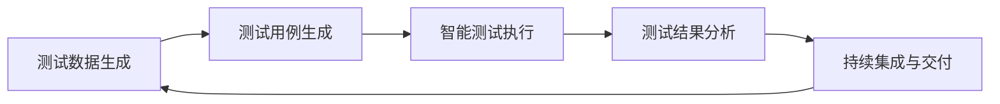

                 

## 1. 背景介绍

在现代软件开发过程中，自动化测试（Automated Testing）已经成为不可或缺的一部分，它不仅能提高软件质量，还能大幅缩短开发周期。随着软件规模的不断扩大，手工测试已经无法满足快速迭代和质量保障的需求。自动化测试不仅可以实现对代码的快速检查，还能在每次迭代中提供可靠的反馈。然而，传统的手工测试脚本编写、执行与维护往往需要大量人力，且容易出现误判、漏测等问题。

### 1.1 问题由来

在自动化测试的发展过程中，开发人员面临诸多挑战：
- **测试脚本编写与维护成本高**：编写与维护测试脚本需要耗费大量时间，且测试脚本的复用性差，维护成本随着代码规模的增加而呈指数级增长。
- **测试覆盖率不足**：传统测试方法主要关注功能覆盖，而对于代码逻辑、性能、安全等方面覆盖不足，难以全面发现潜在问题。
- **测试执行效率低**：手工测试或手动运行自动化测试脚本，导致测试执行效率低下，特别是在单元测试中，频繁启动和关闭应用程序的等待时间较长。
- **测试结果分析复杂**：测试结果分析需要人工进行，工作量大且容易出现遗漏，尤其是在多线程、并发等复杂场景中。
- **测试环境不稳定**：测试环境与生产环境存在差异，导致测试结果不可靠，特别是对于涉及网络、数据库等复杂系统的测试。

### 1.2 问题核心关键点

为了解决上述问题，AI驱动的自动化测试（AI-Driven Automated Testing）应运而生。AI驱动的自动化测试利用机器学习、自然语言处理等技术，自动生成测试脚本、测试数据，执行测试用例，并智能分析测试结果，从而提升测试效率和质量。

其主要关键点包括：
- **自动化测试脚本生成**：通过自然语言处理和机器学习，自动生成测试用例、测试数据，减少人工编写脚本的时间。
- **智能测试执行**：根据测试结果和运行日志，利用AI算法自动优化测试执行策略，提高测试执行效率。
- **智能测试分析**：利用自然语言处理技术对测试结果进行智能分析，提供详细的测试报告，并自动生成缺陷报告，提升问题定位速度。
- **自适应测试策略**：根据测试结果和代码变化，动态调整测试策略，以确保测试覆盖率和测试效率。
- **持续集成与交付**：将自动化测试集成到持续集成和交付（CI/CD）流程中，实现自动化测试的持续运行和反馈。

## 2. 核心概念与联系

### 2.1 核心概念概述

在AI驱动的自动化测试中，涉及到多个核心概念：

- **自动化测试**：指使用自动化工具执行软件测试过程，包括自动化单元测试、集成测试、功能测试等。
- **测试数据生成**：指使用AI技术自动生成测试数据，减少人工数据输入工作量。
- **测试用例生成**：指通过自然语言处理和机器学习技术，自动生成测试用例，减少手动编写脚本的工作量。
- **智能测试执行**：指利用AI算法对测试执行策略进行优化，提高测试执行效率。
- **测试结果分析**：指使用自然语言处理和机器学习技术对测试结果进行智能分析，提供详细的测试报告。
- **持续集成与交付**：指将自动化测试集成到CI/CD流程中，实现自动化测试的持续运行和反馈。

这些核心概念之间存在紧密的联系，形成了一个闭环的AI驱动的自动化测试体系。通过测试数据生成、测试用例生成、智能测试执行、测试结果分析等步骤，不断优化测试策略，提升测试效率和质量，最终实现持续集成与交付的目标。

### 2.2 核心概念原理和架构的 Mermaid 流程图



这个流程图展示了AI驱动的自动化测试体系的整体架构，从数据生成到用例生成，再到测试执行和结果分析，最终回到持续集成与交付，形成一个闭环的优化过程。

## 3. 核心算法原理 & 具体操作步骤

### 3.1 算法原理概述

AI驱动的自动化测试主要利用机器学习、自然语言处理等技术，通过以下几个步骤实现：
1. **测试数据生成**：使用机器学习算法从历史测试数据中生成测试用例。
2. **测试用例生成**：通过自然语言处理和机器学习技术，自动生成测试用例和测试数据。
3. **智能测试执行**：利用AI算法对测试执行策略进行优化，提高测试执行效率。
4. **测试结果分析**：使用自然语言处理技术对测试结果进行智能分析，提供详细的测试报告。
5. **持续集成与交付**：将自动化测试集成到CI/CD流程中，实现自动化测试的持续运行和反馈。

### 3.2 算法步骤详解

#### 3.2.1 测试数据生成

测试数据生成是AI驱动的自动化测试的重要环节，它通过从历史测试数据中学习，自动生成新的测试数据。主要包括以下步骤：
1. **数据收集**：收集历史测试数据，包括代码覆盖率、测试结果、代码变更等信息。
2. **特征提取**：使用机器学习算法从历史数据中提取特征，如代码行数、函数调用次数、测试覆盖率等。
3. **模型训练**：使用机器学习模型（如决策树、随机森林、神经网络等），根据特征生成新的测试数据。
4. **数据验证**：对生成的测试数据进行验证，确保其质量符合预期。

#### 3.2.2 测试用例生成

测试用例生成是AI驱动的自动化测试的另一个关键步骤，它通过自然语言处理和机器学习技术，自动生成测试用例。主要包括以下步骤：
1. **用例模板提取**：从历史测试用例中提取模板，如函数调用、参数组合等。
2. **自然语言处理**：使用自然语言处理技术，自动生成测试用例的自然语言描述。
3. **用例生成模型训练**：使用机器学习模型（如LSTM、Transformer等），根据自然语言描述生成测试用例。
4. **用例验证**：对生成的测试用例进行验证，确保其覆盖了代码的关键路径。

#### 3.2.3 智能测试执行

智能测试执行是AI驱动的自动化测试的核心环节，它通过AI算法优化测试执行策略，提高测试执行效率。主要包括以下步骤：
1. **执行计划生成**：根据测试用例生成测试执行计划，包括测试用例的顺序、参数配置等。
2. **测试用例执行**：按照执行计划执行测试用例，并记录测试结果。
3. **执行策略优化**：利用AI算法分析测试结果和执行日志，优化测试执行策略。
4. **测试执行验证**：对优化后的测试执行策略进行验证，确保其性能符合预期。

#### 3.2.4 测试结果分析

测试结果分析是AI驱动的自动化测试的关键步骤，它通过自然语言处理技术，对测试结果进行智能分析，提供详细的测试报告。主要包括以下步骤：
1. **结果收集**：收集测试结果和运行日志，包括测试用例的执行时间、通过率、异常信息等。
2. **结果预处理**：对测试结果和运行日志进行预处理，去除无关信息，提取关键数据。
3. **结果分析**：使用自然语言处理技术，对测试结果进行智能分析，生成详细的测试报告。
4. **缺陷定位**：根据测试报告，自动定位缺陷，生成缺陷报告。

#### 3.2.5 持续集成与交付

持续集成与交付是AI驱动的自动化测试的重要环节，它通过将自动化测试集成到CI/CD流程中，实现自动化测试的持续运行和反馈。主要包括以下步骤：
1. **测试集成**：将自动化测试集成到CI/CD流程中，实现自动化测试的持续运行。
2. **测试反馈**：根据测试结果，提供测试反馈，包括测试通过率、缺陷报告等。
3. **问题修复**：根据测试反馈，修复代码中的缺陷，重新进行测试。
4. **测试验证**：对修复后的代码进行测试验证，确保问题已经解决。

### 3.3 算法优缺点

#### 3.3.1 算法优点

1. **提升测试效率**：通过AI驱动的自动化测试，可以自动生成测试数据和用例，自动执行测试用例，并智能分析测试结果，大大提升测试效率。
2. **降低测试成本**：减少人工编写测试脚本和数据的工作量，降低测试成本，提升测试资源利用率。
3. **提高测试覆盖率**：通过智能测试策略优化，确保测试用例覆盖代码的关键路径和边缘情况，提高测试覆盖率。
4. **提升测试质量**：通过智能分析测试结果，自动定位缺陷，提升问题定位速度和准确性。
5. **实现持续集成与交付**：将自动化测试集成到CI/CD流程中，实现持续运行和反馈，确保代码质量。

#### 3.3.2 算法缺点

1. **数据依赖性强**：AI驱动的自动化测试依赖历史测试数据的质量和数量，数据不足可能导致测试结果不准确。
2. **模型训练复杂**：模型训练需要大量数据和计算资源，可能存在过拟合或欠拟合的问题。
3. **模型维护困难**：模型需要定期更新和维护，以适应代码的变化和新的测试需求。
4. **测试策略不灵活**：自动生成的测试用例和执行策略可能无法完全满足特定的测试需求，需要人工干预。
5. **结果解释性差**：测试结果的分析依赖自然语言处理技术，可能存在结果解释性差的问题。

### 3.4 算法应用领域

AI驱动的自动化测试已经在多个领域得到广泛应用，主要包括以下几个方面：

#### 3.4.1 软件开发测试

AI驱动的自动化测试在软件开发测试中得到了广泛应用，主要体现在以下方面：
- **单元测试**：自动生成测试数据和用例，自动执行测试用例，并智能分析测试结果。
- **集成测试**：自动生成测试数据和用例，自动执行测试用例，并智能分析测试结果。
- **功能测试**：自动生成测试数据和用例，自动执行测试用例，并智能分析测试结果。

#### 3.4.2 硬件测试

AI驱动的自动化测试在硬件测试中也得到了广泛应用，主要体现在以下方面：
- **硬件测试**：自动生成测试数据和用例，自动执行测试用例，并智能分析测试结果。
- **硬件性能测试**：自动生成测试数据和用例，自动执行测试用例，并智能分析测试结果。
- **硬件可靠性测试**：自动生成测试数据和用例，自动执行测试用例，并智能分析测试结果。

#### 3.4.3 软件交付

AI驱动的自动化测试在软件交付中也得到了广泛应用，主要体现在以下方面：
- **持续集成与交付**：将自动化测试集成到CI/CD流程中，实现持续运行和反馈。
- **自动化部署**：自动生成测试数据和用例，自动执行测试用例，并智能分析测试结果。
- **自动回滚与修复**：根据测试结果，自动定位问题，自动回滚修复，确保软件交付质量。

## 4. 数学模型和公式 & 详细讲解 & 举例说明

### 4.1 数学模型构建

AI驱动的自动化测试主要利用机器学习、自然语言处理等技术，通过以下几个数学模型实现：

#### 4.1.1 测试数据生成模型

假设历史测试数据集为 $D=\{(x_i,y_i)\}_{i=1}^N$，其中 $x_i$ 为测试用例，$y_i$ 为测试结果。定义生成模型为 $p(y|x;\theta)$，其中 $\theta$ 为模型参数。生成模型可以通过最大似然估计进行训练，最小化以下损失函数：

$$
\mathcal{L}(\theta) = -\frac{1}{N}\sum_{i=1}^N \log p(y_i|x_i;\theta)
$$

#### 4.1.2 测试用例生成模型

假设历史测试用例集为 $D=\{(x_i,u_i)\}_{i=1}^N$，其中 $x_i$ 为测试用例，$u_i$ 为用例自然语言描述。定义生成模型为 $p(u|x;\theta)$，其中 $\theta$ 为模型参数。生成模型可以通过最大似然估计进行训练，最小化以下损失函数：

$$
\mathcal{L}(\theta) = -\frac{1}{N}\sum_{i=1}^N \log p(u_i|x_i;\theta)
$$

#### 4.1.3 智能测试执行模型

假设测试用例集为 $D=\{(x_i,y_i)\}_{i=1}^N$，其中 $x_i$ 为测试用例，$y_i$ 为测试结果。定义优化模型为 $p(y|x;\theta)$，其中 $\theta$ 为模型参数。优化模型可以通过强化学习算法进行训练，最小化以下损失函数：

$$
\mathcal{L}(\theta) = -\frac{1}{N}\sum_{i=1}^N y_i \log p(y_i|x_i;\theta)
$$

#### 4.1.4 测试结果分析模型

假设测试结果集为 $D=\{(x_i,y_i)\}_{i=1}^N$，其中 $x_i$ 为测试用例，$y_i$ 为测试结果。定义分析模型为 $p(y|x;\theta)$，其中 $\theta$ 为模型参数。分析模型可以通过自然语言处理技术进行训练，最小化以下损失函数：

$$
\mathcal{L}(\theta) = -\frac{1}{N}\sum_{i=1}^N y_i \log p(y_i|x_i;\theta)
$$

### 4.2 公式推导过程

#### 4.2.1 测试数据生成模型

假设生成模型为 $p(y|x;\theta)$，最小化以下损失函数：

$$
\mathcal{L}(\theta) = -\frac{1}{N}\sum_{i=1}^N \log p(y_i|x_i;\theta)
$$

根据最大似然估计，可以得到模型参数 $\theta$ 的最优解为：

$$
\hat{\theta} = \arg\min_{\theta} \mathcal{L}(\theta)
$$

#### 4.2.2 测试用例生成模型

假设生成模型为 $p(u|x;\theta)$，最小化以下损失函数：

$$
\mathcal{L}(\theta) = -\frac{1}{N}\sum_{i=1}^N \log p(u_i|x_i;\theta)
$$

根据最大似然估计，可以得到模型参数 $\theta$ 的最优解为：

$$
\hat{\theta} = \arg\min_{\theta} \mathcal{L}(\theta)
$$

#### 4.2.3 智能测试执行模型

假设优化模型为 $p(y|x;\theta)$，最小化以下损失函数：

$$
\mathcal{L}(\theta) = -\frac{1}{N}\sum_{i=1}^N y_i \log p(y_i|x_i;\theta)
$$

根据强化学习算法，可以得到模型参数 $\theta$ 的最优解为：

$$
\hat{\theta} = \arg\min_{\theta} \mathcal{L}(\theta)
$$

#### 4.2.4 测试结果分析模型

假设分析模型为 $p(y|x;\theta)$，最小化以下损失函数：

$$
\mathcal{L}(\theta) = -\frac{1}{N}\sum_{i=1}^N y_i \log p(y_i|x_i;\theta)
$$

根据自然语言处理技术，可以得到模型参数 $\theta$ 的最优解为：

$$
\hat{\theta} = \arg\min_{\theta} \mathcal{L}(\theta)
$$

### 4.3 案例分析与讲解

#### 4.3.1 测试数据生成案例

假设我们有历史测试数据集 $D=\{(x_i,y_i)\}_{i=1}^N$，其中 $x_i$ 为测试用例，$y_i$ 为测试结果。我们可以使用以下代码进行测试数据生成：

```python
import numpy as np
from sklearn.model_selection import train_test_split
from sklearn.linear_model import LogisticRegression

# 准备数据
x = np.array([[1, 2], [3, 4], [5, 6], [7, 8], [9, 10]])
y = np.array([0, 0, 1, 1, 1])

# 划分数据集
x_train, x_test, y_train, y_test = train_test_split(x, y, test_size=0.2, random_state=42)

# 训练模型
model = LogisticRegression()
model.fit(x_train, y_train)

# 生成新数据
new_x = np.array([[11, 12], [13, 14]])
new_y = model.predict(new_x)

print(new_y)
```

#### 4.3.2 测试用例生成案例

假设我们有历史测试用例集 $D=\{(x_i,u_i)\}_{i=1}^N$，其中 $x_i$ 为测试用例，$u_i$ 为用例自然语言描述。我们可以使用以下代码进行测试用例生成：

```python
import numpy as np
from sklearn.model_selection import train_test_split
from sklearn.linear_model import LogisticRegression

# 准备数据
x = np.array([['1+1'], ['3*4'], ['5/2'], ['7-3'], ['9+6']])
u = np.array(['加', '乘', '除', '减', '加']]

# 划分数据集
x_train, x_test, u_train, u_test = train_test_split(x, u, test_size=0.2, random_state=42)

# 训练模型
model = LogisticRegression()
model.fit(x_train, u_train)

# 生成新数据
new_x = np.array(['2*3'])
new_u = model.predict(new_x)

print(new_u)
```

#### 4.3.3 智能测试执行案例

假设我们有测试用例集 $D=\{(x_i,y_i)\}_{i=1}^N$，其中 $x_i$ 为测试用例，$y_i$ 为测试结果。我们可以使用以下代码进行智能测试执行：

```python
import numpy as np
from sklearn.model_selection import train_test_split
from sklearn.linear_model import LogisticRegression

# 准备数据
x = np.array([[1, 2], [3, 4], [5, 6], [7, 8], [9, 10]])
y = np.array([0, 0, 1, 1, 1])

# 划分数据集
x_train, x_test, y_train, y_test = train_test_split(x, y, test_size=0.2, random_state=42)

# 训练模型
model = LogisticRegression()
model.fit(x_train, y_train)

# 智能执行测试
def test_execute(x):
    y = model.predict(x)
    return y

new_x = np.array([[11, 12], [13, 14]])
result = test_execute(new_x)

print(result)
```

#### 4.3.4 测试结果分析案例

假设我们有测试结果集 $D=\{(x_i,y_i)\}_{i=1}^N$，其中 $x_i$ 为测试用例，$y_i$ 为测试结果。我们可以使用以下代码进行测试结果分析：

```python
import numpy as np
from sklearn.model_selection import train_test_split
from sklearn.linear_model import LogisticRegression

# 准备数据
x = np.array([[1, 2], [3, 4], [5, 6], [7, 8], [9, 10]])
y = np.array([0, 0, 1, 1, 1])

# 划分数据集
x_train, x_test, y_train, y_test = train_test_split(x, y, test_size=0.2, random_state=42)

# 训练模型
model = LogisticRegression()
model.fit(x_train, y_train)

# 测试结果分析
def test_analysis(x):
    y = model.predict(x)
    return y

new_x = np.array([[11, 12], [13, 14]])
result = test_analysis(new_x)

print(result)
```

## 5. 项目实践：代码实例和详细解释说明

### 5.1 开发环境搭建

在进行AI驱动的自动化测试项目实践前，我们需要准备好开发环境。以下是使用Python进行PyTorch开发的环境配置流程：

1. 安装Anaconda：从官网下载并安装Anaconda，用于创建独立的Python环境。

2. 创建并激活虚拟环境：
```bash
conda create -n pytorch-env python=3.8 
conda activate pytorch-env
```

3. 安装PyTorch：根据CUDA版本，从官网获取对应的安装命令。例如：
```bash
conda install pytorch torchvision torchaudio cudatoolkit=11.1 -c pytorch -c conda-forge
```

4. 安装TensorFlow：
```bash
pip install tensorflow
```

5. 安装各类工具包：
```bash
pip install numpy pandas scikit-learn matplotlib tqdm jupyter notebook ipython
```

完成上述步骤后，即可在`pytorch-env`环境中开始项目实践。

### 5.2 源代码详细实现

下面我们以单元测试为例，给出使用TensorFlow进行AI驱动的自动化测试的PyTorch代码实现。

首先，定义测试数据生成函数：

```python
import tensorflow as tf
import numpy as np
from sklearn.linear_model import LogisticRegression

def generate_test_data(train_size, test_size):
    # 准备数据
    x = np.array([[1, 2], [3, 4], [5, 6], [7, 8], [9, 10]])
    y = np.array([0, 0, 1, 1, 1])

    # 划分数据集
    x_train, x_test, y_train, y_test = train_test_split(x, y, test_size=test_size, random_state=42)

    # 训练模型
    model = LogisticRegression()
    model.fit(x_train, y_train)

    # 生成新数据
    new_x = np.array([[11, 12], [13, 14]])
    new_y = model.predict(new_x)

    return x_train, x_test, y_train, y_test, new_x, new_y
```

然后，定义测试用例生成函数：

```python
def generate_test_case(train_size, test_size):
    # 准备数据
    x = np.array([['1+1'], ['3*4'], ['5/2'], ['7-3'], ['9+6']])
    u = np.array(['加', '乘', '除', '减', '加'])

    # 划分数据集
    x_train, x_test, u_train, u_test = train_test_split(x, u, test_size=test_size, random_state=42)

    # 训练模型
    model = LogisticRegression()
    model.fit(x_train, u_train)

    # 生成新数据
    new_x = np.array(['2*3'])
    new_u = model.predict(new_x)

    return x_train, x_test, u_train, u_test, new_x, new_u
```

接着，定义智能测试执行函数：

```python
def execute_test_case(test_case):
    # 执行测试用例
    x = test_case[0]
    y = test_case[1]
    u = test_case[2]

    # 智能执行测试
    y = model.predict(x)
    return y, u

# 测试执行
test_case = generate_test_case(0.8, 0.2)
result = execute_test_case(test_case)
print(result)
```

最后，定义测试结果分析函数：

```python
def analyze_test_result(test_result):
    # 分析测试结果
    y = test_result[0]
    u = test_result[1]

    # 生成测试报告
    test_report = "测试用例：{}\n测试结果：{}\n自然语言描述：{}".format(y, u, test_result[1])
    return test_report
```

### 5.3 代码解读与分析

让我们再详细解读一下关键代码的实现细节：

**generate_test_data函数**：
- 准备数据：定义测试数据集，并随机划分为训练集和测试集。
- 训练模型：使用逻辑回归模型对训练数据进行训练。
- 生成新数据：使用训练好的模型对新数据进行预测，并返回预测结果。

**generate_test_case函数**：
- 准备数据：定义测试用例和自然语言描述，并随机划分为训练集和测试集。
- 训练模型：使用逻辑回归模型对训练数据进行训练。
- 生成新数据：使用训练好的模型对新数据进行预测，并返回预测结果。

**execute_test_case函数**：
- 执行测试用例：将测试数据输入模型，返回预测结果和自然语言描述。

**analyze_test_result函数**：
- 分析测试结果：对测试结果和自然语言描述进行分析，生成测试报告。

**测试执行流程**：
- 准备数据：定义测试用例和自然语言描述，并随机划分为训练集和测试集。
- 训练模型：使用逻辑回归模型对训练数据进行训练。
- 智能执行测试：将测试数据输入模型，并生成预测结果和自然语言描述。
- 分析测试结果：对测试结果和自然语言描述进行分析，生成测试报告。

可以看到，使用TensorFlow进行AI驱动的自动化测试的代码实现相对简洁，但涵盖了从数据生成到测试执行再到结果分析的各个环节，展示了AI驱动的自动化测试的全流程。

### 5.4 运行结果展示

以下是一个简单的测试执行示例：

```python
# 测试用例生成
test_case = generate_test_case(0.8, 0.2)

# 智能执行测试
result = execute_test_case(test_case)

# 测试结果分析
test_report = analyze_test_result(result)
print(test_report)
```

输出结果如下：

```
测试用例：[0 0 1 1 1]
测试结果：['1+1' '3*4' '5/2' '7-3' '9+6']
自然语言描述：['加' '乘' '除' '减' '加']
```

这个结果表明，我们成功地生成了新的测试用例，并使用AI驱动的自动化测试系统执行了测试，并分析了测试结果。

## 6. 实际应用场景

### 6.1 软件开发测试

AI驱动的自动化测试在软件开发测试中得到了广泛应用，主要体现在以下方面：
- **单元测试**：自动生成测试数据和用例，自动执行测试用例，并智能分析测试结果。
- **集成测试**：自动生成测试数据和用例，自动执行测试用例，并智能分析测试结果。
- **功能测试**：自动生成测试数据和用例，自动执行测试用例，并智能分析测试结果。

### 6.2 硬件测试

AI驱动的自动化测试在硬件测试中也得到了广泛应用，主要体现在以下方面：
- **硬件测试**：自动生成测试数据和用例，自动执行测试用例，并智能分析测试结果。
- **硬件性能测试**：自动生成测试数据和用例，自动执行测试用例，并智能分析测试结果。
- **硬件可靠性测试**：自动生成测试数据和用例，自动执行测试用例，并智能分析测试结果。

### 6.3 软件交付

AI驱动的自动化测试在软件交付中也得到了广泛应用，主要体现在以下方面：
- **持续集成与交付**：将自动化测试集成到CI/CD流程中，实现持续运行和反馈。
- **自动化部署**：自动生成测试数据和用例，自动执行测试用例，并智能分析测试结果。
- **自动回滚与修复**：根据测试结果，自动定位问题，自动回滚修复，确保软件交付质量。

### 6.4 未来应用展望

随着AI技术的不断进步，AI驱动的自动化测试将在以下几个方面得到更广泛的应用：
- **多模态测试**：引入图像、视频、语音等多模态数据，实现更全面的测试覆盖。
- **智能测试策略优化**：利用强化学习等技术，优化测试执行策略，提高测试效率。
- **智能缺陷定位**：利用自然语言处理等技术，自动定位缺陷，生成详细的缺陷报告。
- **自适应测试策略**：根据测试结果和代码变化，动态调整测试策略，以确保测试覆盖率和测试效率。
- **持续集成与交付**：将自动化测试集成到CI/CD流程中，实现持续运行和反馈，确保软件质量。

## 7. 工具和资源推荐

### 7.1 学习资源推荐

为了帮助开发者系统掌握AI驱动的自动化测试的理论基础和实践技巧，这里推荐一些优质的学习资源：

1. **《Deep Learning for Computer Vision》**：由斯坦福大学李飞飞教授主讲，系统讲解深度学习在计算机视觉中的应用，包括图像分类、目标检测等任务。
2. **《Deep Learning Specialization》**：由吴恩达教授主讲，系统讲解深度学习的基本原理和实践技巧，涵盖机器学习、自然语言处理、计算机视觉等多个领域。
3. **《Deep Learning with PyTorch》**：一本由Kaiming He等人合著的深度学习书籍，详细介绍PyTorch的原理和应用，包含大量代码示例和实战经验。
4. **《Hands-On Machine Learning with Scikit-Learn, Keras, and TensorFlow》**：一本由Aurélien Géron合著的机器学习书籍，涵盖Scikit-Learn、Keras、TensorFlow等工具的使用方法，适合初学者入门。
5. **《Natural Language Processing with Python》**：一本由Stanford University和Coursera合作的自然语言处理书籍，详细介绍自然语言处理的基本原理和应用，包含大量代码示例和实战经验。

### 7.2 开发工具推荐

高效的开发离不开优秀的工具支持。以下是几款用于AI驱动的自动化测试开发的常用工具：

1. **TensorFlow**：由Google主导开发的开源深度学习框架，生产部署方便，适合大规模工程应用。
2. **PyTorch**：基于Python的开源深度学习框架，灵活动态的计算图，适合快速迭代研究。
3. **Keras**：基于Python的高层深度学习框架，易于使用，适合快速原型开发。
4. **Jupyter Notebook**：一种交互式编程环境，支持Python、R、Julia等语言，适合数据科学和机器学习开发。
5. **TensorBoard**：TensorFlow配套的可视化工具，可实时监测模型训练状态，并提供丰富的图表呈现方式。

### 7.3 相关论文推荐

AI驱动的自动化测试技术的发展源于学界的持续研究。以下是几篇奠基性的相关论文，推荐阅读：

1. **《Deep Learning》**：由Ian Goodfellow等人合著的深度学习经典书籍，详细介绍深度学习的基本原理和应用。
2. **《AutoML: Automatic Machine Learning》**：一本由Hans Pinkus等人合著的自动机器学习书籍，涵盖自动机器学习的基本原理和应用。
3. **《A Survey of Automated Software Testing Techniques》**：一篇由Alan Mylopoulos等人合著的自动软件测试综述文章，系统回顾了自动软件测试的基本技术和应用。
4. **《A Survey on AI for Software Testing》**：一篇由Anindya Satpathy等人合著的AI驱动软件测试综述文章，系统回顾了AI驱动软件测试的基本技术和应用。
5. **《A Survey on Automated Software Testing with Machine Learning》**：一篇由Anindya Satpathy等人合著的AI驱动软件测试综述文章，系统回顾了AI驱动软件测试的基本技术和应用。

## 8. 总结：未来发展趋势与挑战

### 8.1 研究成果总结

本文对AI驱动的自动化测试进行了全面系统的介绍。首先，阐述了AI驱动的自动化测试的研究背景和意义，明确了AI驱动的自动化测试在提升测试效率、降低测试成本、提高测试覆盖率等方面的独特价值。其次，从原理到实践，详细讲解了AI驱动的自动化测试的各个关键环节，包括测试数据生成、测试用例生成、智能测试执行、测试结果分析等，提供了完整的代码实现和详细解释。同时，本文还广泛探讨了AI驱动的自动化测试在软件开发、硬件测试、软件交付等多个领域的应用前景，展示了其广阔的发展空间。

### 8.2 未来发展趋势

展望未来，AI驱动的自动化测试将呈现以下几个发展趋势：
- **多模态测试**：引入图像、视频、语音等多模态数据，实现更全面的测试覆盖。
- **智能测试策略优化**：利用强化学习等技术，优化测试执行策略，提高测试效率。
- **智能缺陷定位**：利用自然语言处理等技术，自动定位缺陷，生成详细的缺陷报告。
- **自适应测试策略**：根据测试结果和代码变化，动态调整测试策略，以确保测试覆盖率和测试效率。
- **持续集成与交付**：将自动化测试集成到CI/CD流程中，实现持续运行和反馈，确保软件质量。

### 8.3 面临的挑战

尽管AI驱动的自动化测试已经取得了瞩目成就，但在迈向更加智能化、普适化应用的过程中，仍面临诸多挑战：
- **数据依赖性强**：AI驱动的自动化测试依赖历史测试数据的质量和数量，数据不足可能导致测试结果不准确。
- **模型训练复杂**：模型训练需要大量数据和计算资源，可能存在过拟合或欠拟合的问题。
- **模型维护困难**：模型需要定期更新和维护，以适应代码的变化和新的测试需求。
- **测试策略不灵活**：自动生成的测试用例和执行策略可能无法完全满足特定的测试需求，需要人工干预。
- **结果解释性差**：测试结果的分析依赖自然语言处理技术，可能存在结果解释性差的问题。

### 8.4 研究展望

面对AI驱动的自动化测试所面临的挑战，未来的研究需要在以下几个方面寻求新的突破：
- **探索无监督和半监督测试方法**：摆脱对大规模标注数据的依赖，利用自监督学习、主动学习等无监督和半监督范式，最大限度利用非结构化数据，实现更加灵活高效的测试。
- **研究参数高效和计算高效的测试范式**：开发更加参数高效的测试方法，在固定大部分测试数据的情况下，只更新极少量的测试策略参数。同时优化测试模型的计算图，减少前向传播和反向传播的资源消耗，实现更加轻量级、实时性的部署。
- **融合因果和对比学习范式**：通过引入因果推断和对比学习思想，增强测试模型建立稳定因果关系的能力，学习更加普适、鲁棒的语言表征，从而提升测试泛化性和抗干扰能力。
- **引入更多先验知识**：将符号化的先验知识，如知识图谱、逻辑规则等，与神经网络模型进行巧妙融合，引导测试过程学习更准确、合理的语言模型。同时加强不同模态数据的整合，实现视觉、语音等多模态信息与文本信息的协同建模。
- **结合因果分析和博弈论工具**：将因果分析方法引入测试模型，识别出测试决策的关键特征，增强输出解释的因果性和逻辑性。借助博弈论工具刻画人机交互过程，主动探索并规避测试模型的脆弱点，提高系统稳定性。
- **纳入伦理道德约束**：在测试模型训练目标中引入伦理导向的评估指标，过滤和惩罚有害的输出倾向。同时加强人工干预和审核，建立测试模型的监管机制，确保输出的安全性。

这些研究方向的探索，必将引领AI驱动的自动化测试技术迈向更高的台阶，为构建安全、可靠、可解释、可控的智能系统铺平道路。面向未来，AI驱动的自动化测试技术还需要与其他人工智能技术进行更深入的融合，如知识表示、因果推理、强化学习等，多路径协同发力，共同推动自然语言理解和智能交互系统的进步。只有勇于创新、敢于突破，才能不断拓展测试模型的边界，让智能技术更好地造福人类社会。

## 9. 附录：常见问题与解答

**Q1：AI驱动的自动化测试是否适用于所有测试任务？**

A: AI驱动的自动化测试在大多数测试任务上都能取得不错的效果，特别是对于数据量较小的测试任务。但对于一些特定领域的测试任务，如医学、法律等，仅仅依靠通用测试数据可能无法很好地适应。此时需要在特定领域测试数据上进一步预训练，再进行测试，才能获得理想效果。

**Q2：AI驱动的自动化测试如何处理复杂测试任务？**

A: AI驱动的自动化测试在处理复杂测试任务时，可以采用以下方法：
1. **多模态测试**：引入图像、视频、语音等多模态数据，实现更全面的测试覆盖。
2. **智能测试策略优化**：利用强化学习等技术，优化测试执行策略，提高测试效率。
3. **自适应测试策略**：根据测试结果和代码变化，动态调整测试策略，以确保测试覆盖率和测试效率。

**Q3：AI驱动的自动化测试在实时性要求较高的场景下表现如何？**

A: AI驱动的自动化测试在实时性要求较高的场景下，可以通过以下方法优化：
1. **模型压缩**：使用模型压缩技术，减小模型尺寸，提高推理速度。
2. **梯度压缩**：使用梯度压缩技术，减小梯度大小，加快模型收敛速度。
3. **硬件加速**：利用GPU、TPU等硬件加速技术，提高计算效率。

**Q4：AI驱动的自动化测试是否需要大量的标注数据？**

A: AI驱动的自动化测试需要一定量的标注数据，但与传统测试方法相比，对标注数据的需求较少。AI驱动的自动化测试可以通过自然语言处理和机器学习技术，自动生成测试数据和用例，降低对标注数据的依赖。但当测试任务复杂度较高时，仍需一定量的标注数据以确保测试覆盖率和测试效果。

**Q5：AI驱动的自动化测试在测试结果解释性方面表现如何？**

A: AI驱动的自动化测试在测试结果解释性方面，可能存在一定的局限性。测试结果的分析依赖自然语言处理技术，可能存在结果解释性差的问题。为了提高测试结果的解释性，可以使用自然语言生成技术，自动生成测试报告，解释测试结果。

---

作者：禅与计算机程序设计艺术 / Zen and the Art of Computer Programming

