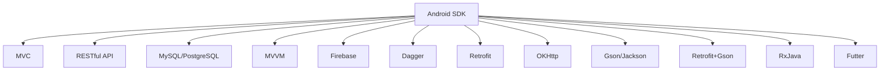

                 

# Android全栈开发指南

> 关键词：Android开发，全栈开发，技术栈，移动应用，UI/UX，服务器端开发，数据库，持续集成与部署(CI/CD)，DevOps，敏捷开发

## 1. 背景介绍

### 1.1 问题由来
在当今的数字化时代，移动应用已经成为人们日常生活和工作的重要组成部分。Android作为全球市场份额最大的移动操作系统，自然成为了开发者的首选平台。然而，Android开发不仅仅是界面设计和功能实现那么简单，它涉及到从用户界面(UI/UX)设计到后端服务器的全栈开发技术。这正是本文旨在深入探讨的主题——全栈开发在Android应用开发中的实践。

### 1.2 问题核心关键点
全栈开发（Full-Stack Development）涵盖了从前端界面设计到后端服务器的开发。对于Android全栈开发，主要涉及以下几个核心方面：

- **前端开发**：包括UI/UX设计、布局、交互设计等。
- **后端开发**：包括服务器端编程、数据库设计、API设计等。
- **跨端通信**：实现前后端数据的交互。
- **测试**：包括单元测试、集成测试和端到端测试等。
- **持续集成与部署**：实现快速迭代和部署。

本文将深入探讨Android全栈开发的核心概念、技术原理和具体操作步骤，并结合实际项目实践，为你提供一份全面的全栈开发指南。

## 2. 核心概念与联系

### 2.1 核心概念概述

为更好地理解Android全栈开发，本节将介绍几个关键概念及其相互关系：

- **Android SDK**：Android软件开发工具包，提供了开发Android应用所需的API和工具。
- **MVC（Model-View-Controller）**：一种软件架构模式，用于分离内层业务逻辑、中间层UI展示和外层用户交互。
- **RESTful API**：一种API设计风格，使用HTTP协议，支持跨平台交互。
- **MySQL/PostgreSQL**：常见的关系型数据库，用于存储和管理应用数据。
- **MVVM（Model-View-ViewModel）**：一种视图层分离的架构模式，用于实现数据绑定和状态管理。
- **Firebase**：Google提供的移动后端服务，包括实时数据库、身份验证、云函数等。
- **Dagger**：依赖注入框架，用于解耦代码和提高代码复用性。
- **Retrofit**：网络请求库，简化API调用和处理响应。
- **OKHttp**：高效的HTTP客户端，支持高并发和连接池管理。
- **Gson/Jackson**：Java对象映射库，用于解析JSON数据。
- **Retrofit+Gson**：结合使用的流行方案，实现JSON数据的自动映射。
- **RxJava**：响应式编程库，简化异步编程和事件处理。
- **Futter**：Google推出的现代UI框架，提高UI组件的复用性和开发效率。

这些概念之间的联系可以通过以下Mermaid流程图来展示：



这个流程图展示了下述概念之间的逻辑关系：

1. 前端开发依赖于Android SDK，并使用MVC和MVVM架构模式。
2. 后端开发使用RESTful API进行跨平台交互，并依赖MySQL/PostgreSQL数据库。
3. 跨端通信使用Firebase作为服务端，依赖Dagger进行依赖注入。
4. 网络请求和数据处理使用Retrofit和OKHttp，依赖Gson/Jackson进行数据映射。
5. 异步编程和事件处理使用RxJava，结合Futter进行UI组件复用。

这些概念共同构成了Android全栈开发的基础框架，使得开发者能够高效地设计和实现全栈应用。

## 3. 核心算法原理 & 具体操作步骤

### 3.1 算法原理概述

Android全栈开发的核心算法原理包括：

- **数据模型设计**：设计合理的数据模型，满足业务需求和数据持久化要求。
- **视图层设计**：设计直观、易用的用户界面，提升用户体验。
- **服务端设计**：设计高效、稳定的服务器端逻辑，实现API接口和服务。
- **数据传输设计**：设计高效、可靠的数据传输方式，确保数据准确性。
- **状态管理设计**：设计合理的状态管理方案，确保应用状态的稳定性和一致性。
- **安全设计**：设计安全机制，确保数据和应用的安全性。

### 3.2 算法步骤详解

Android全栈开发的步骤主要包括以下几个关键阶段：

**Step 1: 需求分析和设计**

- 明确需求，制定详细的需求文档。
- 进行UI/UX设计，设计直观、易用的用户界面。
- 设计数据模型，确保模型能够满足业务需求。
- 设计服务器端逻辑，包括API接口和服务的设计。
- 设计状态管理方案，确保应用状态的稳定性和一致性。

**Step 2: 前端开发**

- 使用Android SDK进行前端开发，实现UI/UX设计。
- 使用MVC或MVVM架构模式进行视图层分离。
- 使用RxJava进行异步编程和事件处理。
- 使用Futter进行UI组件复用和布局优化。

**Step 3: 后端开发**

- 使用RESTful API进行跨平台交互，设计API接口和服务。
- 使用MySQL/PostgreSQL等关系型数据库进行数据存储和管理。
- 使用Firebase进行实时数据库、身份验证和云函数等后端服务。
- 使用Retrofit进行网络请求和数据处理，使用Gson/Jackson进行数据映射。
- 使用OKHttp进行高并发和连接池管理。

**Step 4: 数据传输和交互**

- 使用Retrofit进行网络请求和数据处理，使用Gson/Jackson进行数据映射。
- 使用RxJava进行异步编程和事件处理，提高数据传输和交互的效率和稳定性。
- 使用Dagger进行依赖注入，确保代码的解耦和复用性。

**Step 5: 测试和部署**

- 进行单元测试、集成测试和端到端测试，确保应用的稳定性和可靠性。
- 使用CI/CD工具进行持续集成与部署，实现快速迭代和部署。
- 使用DevOps工具进行自动化部署和监控，确保应用的稳定性和性能。

### 3.3 算法优缺点

Android全栈开发具有以下优点：

- 提升用户体验：通过UI/UX设计和状态管理，提升应用的用户体验和交互效果。
- 提高开发效率：通过模块化和组件化的设计，提升开发效率和代码复用性。
- 增强应用稳定性：通过合理的数据模型和安全设计，提升应用的稳定性和可靠性。

同时，全栈开发也存在一定的局限性：

- 技术要求高：需要掌握前端和后端的多种技术，对开发者的技术要求较高。
- 维护复杂：应用规模较大时，维护复杂度和难度增加。
- 学习曲线陡：需要学习和掌握多种技术和工具，学习曲线较陡。

### 3.4 算法应用领域

Android全栈开发适用于多种应用场景，包括但不限于以下领域：

- 移动电商应用：涉及商品展示、购物车、订单管理等。
- 社交网络应用：涉及好友管理、消息推送、视频聊天等。
- 金融科技应用：涉及账户管理、交易记录、支付功能等。
- 教育应用：涉及课程管理、学生管理、学习记录等。
- 健康医疗应用：涉及病人信息管理、诊疗记录、预约挂号等。
- 旅游应用：涉及景点介绍、行程规划、酒店预订等。

## 4. 数学模型和公式 & 详细讲解 & 举例说明

### 4.1 数学模型构建

本节将使用数学语言对Android全栈开发的核心算法原理进行更加严格的刻画。

假设开发一款Android应用，涉及数据模型、视图层、服务器端逻辑和数据传输等关键部分。设数据模型为 $D$，视图层为 $V$，服务器端逻辑为 $S$，数据传输为 $T$。

定义数据模型的设计问题为：

$$
\min_{D} \mathcal{L}(D) = \frac{1}{N}\sum_{i=1}^N \ell(D, y_i)
$$

其中 $\ell$ 为损失函数，$y_i$ 为样本标签，$N$ 为样本数量。

定义视图层的设计问题为：

$$
\min_{V} \mathcal{L}(V) = \frac{1}{M}\sum_{i=1}^M \ell(V, X_i)
$$

其中 $\ell$ 为损失函数，$X_i$ 为输入数据，$M$ 为输入数据数量。

定义服务器端逻辑的设计问题为：

$$
\min_{S} \mathcal{L}(S) = \frac{1}{T}\sum_{i=1}^T \ell(S, O_i)
$$

其中 $\ell$ 为损失函数，$O_i$ 为输出数据，$T$ 为输出数据数量。

定义数据传输的设计问题为：

$$
\min_{T} \mathcal{L}(T) = \frac{1}{D}\sum_{i=1}^D \ell(T, I_i)
$$

其中 $\ell$ 为损失函数，$I_i$ 为输入数据，$D$ 为输入数据数量。

### 4.2 公式推导过程

以下我们以商品展示应用为例，推导数据模型和视图层的设计公式。

假设商品展示应用的数据模型为 $D$，包含商品信息表、订单信息表和用户信息表。其中，商品信息表包含商品ID、名称、价格等信息；订单信息表包含订单ID、商品ID、用户ID等信息；用户信息表包含用户ID、用户名、地址等信息。

在数据模型设计问题中，需要最小化损失函数：

$$
\mathcal{L}(D) = \frac{1}{N}\sum_{i=1}^N \ell(D, y_i)
$$

其中 $y_i$ 为样本标签，$\ell$ 为损失函数，$N$ 为样本数量。

对于视图层设计问题，假设应用的界面包括商品列表、商品详情和购物车功能。设计视图层时，需要最小化损失函数：

$$
\mathcal{L}(V) = \frac{1}{M}\sum_{i=1}^M \ell(V, X_i)
$$

其中 $X_i$ 为输入数据，$\ell$ 为损失函数，$M$ 为输入数据数量。

假设应用的后端逻辑为 RESTful API，提供商品信息获取、订单提交和用户登录等接口。在服务器端逻辑设计问题中，需要最小化损失函数：

$$
\mathcal{L}(S) = \frac{1}{T}\sum_{i=1}^T \ell(S, O_i)
$$

其中 $O_i$ 为输出数据，$\ell$ 为损失函数，$T$ 为输出数据数量。

假设应用使用 Retrofit 和 Gson 进行网络请求和数据处理。在数据传输设计问题中，需要最小化损失函数：

$$
\mathcal{L}(T) = \frac{1}{D}\sum_{i=1}^D \ell(T, I_i)
$$

其中 $I_i$ 为输入数据，$\ell$ 为损失函数，$D$ 为输入数据数量。

## 5. 项目实践：代码实例和详细解释说明

### 5.1 开发环境搭建

在进行Android全栈开发实践前，我们需要准备好开发环境。以下是使用Android Studio进行Android应用开发的流程：

1. 安装Android Studio：从官网下载并安装Android Studio，是Android开发的首选IDE。
2. 创建项目：使用Android Studio创建新项目，选择合适的模板，如“Basic Activity”。
3. 配置Android SDK：在Android Studio中配置Android SDK，选择需要的API级别和工具。
4. 配置Gradle：配置Android应用的构建工具Gradle，使用build.gradle文件进行依赖管理。
5. 创建模块：在项目中添加需要的模块，如本地库、第三方库等。

### 5.2 源代码详细实现

下面以商品展示应用为例，给出使用Android Studio进行Android应用开发的详细代码实现。

**App级模块：**

```java
import android.app.Application;

public class MyApp extends Application {
    private Retrofit retrofit;

    @Override
    public void onCreate() {
        super.onCreate();
        retrofit = createRetrofit();
    }

    private Retrofit createRetrofit() {
        OkHttpLoggingInterceptor loggingInterceptor = new OkHttpLoggingInterceptor().setLevel(HttpLoggingInterceptor.Level.BODY);
        Retrofit retrofit = new Retrofit.Builder()
                .baseUrl("https://example.com/api")
                .addConverterFactory(GsonConverterFactory.create())
                .addInterceptor(loggingInterceptor)
                .build();
        return retrofit;
    }

    public Retrofit getRetrofit() {
        return retrofit;
    }
}
```

**商品信息模块：**

```java
import android.os.Bundle;
import androidx.appcompat.app.AppCompatActivity;
import androidx.lifecycle.ViewModelProvider;

import retrofit2.Call;
import retrofit2.Callback;
import retrofit2.Response;
import retrofit2.Retrofit;
import retrofit2.converter.gson.GsonConverterFactory;

public class ProductActivity extends AppCompatActivity {
    private Retrofit retrofit;
    private ProductViewModel productViewModel;

    @Override
    protected void onCreate(Bundle savedInstanceState) {
        super.onCreate(savedInstanceState);
        setContentView(R.layout.activity_product);

        retrofit = MyApp.getApplication().getRetrofit();
        productViewModel = ViewModelProvider.of(this).get(ProductViewModel.class);

        Call<Product> call = retrofit.create(ProductApi.class).getProductById(1);
        call.enqueue(new Callback<Product>() {
            @Override
            public void onResponse(Call<Product> call, Response<Product> response) {
                productViewModel.setProduct(response.body());
            }

            @Override
            public void onFailure(Call<Product> call, Throwable t) {
                t.printStackTrace();
            }
        });
    }
}
```

**ProductViewModel：**

```java
import androidx.lifecycle.MutableLiveData;
import androidx.lifecycle.ViewModel;

import retrofit2.Call;
import retrofit2.Callback;
import retrofit2.Response;
import retrofit2.Retrofit;
import retrofit2.converter.gson.GsonConverterFactory;

public class ProductViewModel extends ViewModel {
    private MutableLiveData<Product> productLiveData;

    public ProductViewModel() {
        productLiveData = new MutableLiveData<>();
    }

    public MutableLiveData<Product> getProductLiveData() {
        return productLiveData;
    }

    public void setProduct(Product product) {
        productLiveData.setValue(product);
    }

    public void getProductById(int id) {
        Retrofit retrofit = MyApp.getApplication().getRetrofit();
        Call<Product> call = retrofit.create(ProductApi.class).getProductById(id);
        call.enqueue(new Callback<Product>() {
            @Override
            public void onResponse(Call<Product> call, Response<Product> response) {
                setProduct(response.body());
            }

            @Override
            public void onFailure(Call<Product> call, Throwable t) {
                t.printStackTrace();
            }
        });
    }
}
```

**ProductApi接口：**

```java
import retrofit2.Call;
import retrofit2.http.GET;
import retrofit2.http.Path;

public interface ProductApi {
    @GET("products/{id}")
    Call<Product> getProductById(@Path("id") int id);
}
```

**Product类：**

```java
public class Product {
    private int id;
    private String name;
    private double price;

    public Product(int id, String name, double price) {
        this.id = id;
        this.name = name;
        this.price = price;
    }

    // getters and setters
}
```

### 5.3 代码解读与分析

让我们再详细解读一下关键代码的实现细节：

**App级模块：**

- 创建Retrofit实例，用于网络请求。
- 提供一个获取Retrofit实例的方法，方便其他模块使用。

**商品信息模块：**

- 使用Retrofit进行网络请求，获取商品信息。
- 使用ViewModel进行数据管理，将商品信息存储在LiveData中，供其他模块使用。
- 在onCreate方法中调用getProductById方法，异步获取商品信息。

**ProductViewModel：**

- 使用LiveData存储商品信息，供其他模块观察。
- 提供setProduct方法，用于更新商品信息。
- 提供getProductById方法，用于异步获取商品信息。

**ProductApi接口：**

- 定义GET请求的接口，用于获取商品信息。
- 使用Path注解，指定请求路径和参数。

**Product类：**

- 定义商品类，包含商品ID、名称和价格等信息。

可以看到，通过以上代码，我们完成了Android商品展示应用的基本功能实现。通过合理的设计和使用Retrofit、Gson等技术，实现了数据的传输和处理，确保了应用的稳定性和可维护性。

## 6. 实际应用场景

### 6.1 智能客服系统

Android智能客服系统是一种常见的应用场景。通过将移动端和后端服务进行深度整合，可以实现7x24小时不间断服务，提升客户咨询体验。

智能客服系统通常需要具备以下功能：

- 自然语言理解：通过NLP技术，理解客户的自然语言查询。
- 知识库管理：存储和管理常见问题及其答案。
- 对话管理：根据客户意图，匹配最佳答案，并进行多轮对话管理。
- 语音识别：通过语音识别技术，实现语音交互功能。
- 情感分析：通过情感分析技术，理解客户的情感状态。
- 事件监控：监控系统运行状态，及时发现和处理异常。

### 6.2 实时监控系统

Android实时监控系统是一种常见的应用场景。通过将移动端和后端服务进行深度整合，可以实现对设备的实时监控和数据分析。

实时监控系统通常需要具备以下功能：

- 数据采集：通过移动端采集设备的各项数据。
- 数据存储：将采集的数据存储在云端数据库中。
- 数据分析：对采集的数据进行实时分析和可视化。
- 告警通知：根据数据异常情况，发送告警通知。
- 远程控制：通过移动端远程控制设备，进行故障排查和维护。

### 6.3 在线教育应用

Android在线教育应用是一种常见的应用场景。通过将移动端和后端服务进行深度整合，可以实现个性化推荐、智能评估等功能。

在线教育应用通常需要具备以下功能：

- 课程管理：管理课程信息、教师信息和学生信息。
- 智能推荐：根据学生的学习历史和偏好，推荐适合的课程和资源。
- 智能评估：通过机器学习算法，评估学生的学习效果和知识掌握情况。
- 互动交流：提供教师和学生之间的互动交流功能。
- 学习记录：记录学生的学习行为和进度，进行学习分析和个性化辅导。

## 7. 工具和资源推荐

### 7.1 学习资源推荐

为了帮助开发者系统掌握Android全栈开发的技术基础和实践技巧，这里推荐一些优质的学习资源：

1. **《Android开发入门到精通》系列教程**：由知名Android开发者撰写，从基础到高级，系统讲解Android开发的各种技术。

2. **《Android开发实战》系列图书**：详细讲解Android开发的各种实践技巧和开发工具，适合初学者和进阶开发者。

3. **《Android全栈开发教程》**：由知名Android开发者撰写，涵盖前端、后端和跨端通信的详细教程。

4. **Android开发者官网**：提供Android开发的各种文档、API和示例代码，是学习Android开发的重要资源。

5. **Google Developers**：提供Android开发的官方文档、教程和开发工具，是Android开发者必备的学习平台。

### 7.2 开发工具推荐

高效的开发离不开优秀的工具支持。以下是几款用于Android全栈开发开发的常用工具：

1. **Android Studio**：由Google开发的Android开发IDE，提供了丰富的开发工具和调试功能。

2. **Retrofit**：Google提供的开源网络请求库，简化API调用和处理响应。

3. **Gson**：Google提供的开源Java对象映射库，用于解析JSON数据。

4. **OkHttp**：阿里巴巴开源的高性能HTTP客户端，支持高并发和连接池管理。

5. **Retrofit+Gson**：结合使用的流行方案，实现JSON数据的自动映射。

6. **RxJava**：Google提供的开源响应式编程库，简化异步编程和事件处理。

7. **Futter**：Google推出的现代UI框架，提高UI组件的复用性和开发效率。

### 7.3 相关论文推荐

Android全栈开发涉及多种技术和工具，相关论文如下：

1. **《Android应用程序设计模式》**：详细介绍Android应用的多种设计模式，如MVC、MVVM、MVP等。

2. **《Android全栈开发实践》**：总结Android全栈开发的实践经验，涵盖前端、后端和跨端通信的实现细节。

3. **《Android网络编程》**：详细介绍Android网络编程的各种技术和实践，涵盖网络请求、数据处理和异步编程。

4. **《Android用户界面设计》**：详细介绍Android用户界面的各种设计和实现技术，涵盖布局、控件和样式。

## 8. 总结：未来发展趋势与挑战

### 8.1 总结

本文对Android全栈开发进行全面系统的介绍。首先阐述了Android全栈开发的背景和意义，明确了全栈开发在Android应用开发中的重要性。其次，从原理到实践，详细讲解了全栈开发的数学模型和技术原理，给出了Android应用开发的完整代码实例。同时，本文还探讨了全栈开发在智能客服、实时监控和在线教育等领域的实际应用场景，展示了全栈开发范式的广阔前景。

通过本文的系统梳理，可以看到，Android全栈开发不仅是一种技术选择，更是一种开发理念和实践方法。这种全栈开发模式能够充分利用前端和后端的优势，提高开发效率和应用性能，提升用户体验和应用稳定性。未来，随着Android全栈开发技术的不断成熟，其在移动应用开发中的应用将会越来越广泛，为Android开发者提供更加高效、灵活和可持续的开发思路。

### 8.2 未来发展趋势

展望未来，Android全栈开发将呈现以下几个发展趋势：

1. **AI技术的应用**：引入AI技术，如NLP、机器学习和深度学习，提升应用的功能和智能化水平。

2. **跨平台开发**：支持跨平台开发，如Flutter和React Native等，提高应用的开发效率和兼容性。

3. **低代码开发**：引入低代码开发平台，如AppSheet和Firebase等，降低开发门槛，提高开发效率。

4. **微服务架构**：采用微服务架构，实现应用的模块化和组件化，提高应用的扩展性和可维护性。

5. **DevOps文化**：引入DevOps文化，实现持续集成与部署，提高应用的发布效率和稳定性。

6. **用户体验优化**：引入UX设计方法，提升应用的用户体验和互动效果。

7. **安全与隐私保护**：引入安全与隐私保护机制，保障应用的数据安全和用户隐私。

### 8.3 面临的挑战

尽管Android全栈开发已经取得了显著的进展，但在迈向更加智能化、普适化应用的过程中，仍面临诸多挑战：

1. **技术门槛高**：Android全栈开发需要掌握多种技术和工具，对开发者的技术要求较高。

2. **开发成本高**：全栈开发涉及前端、后端和跨端通信的整合，开发成本较高。

3. **维护复杂**：应用规模较大时，维护复杂度和难度增加。

4. **学习曲线陡**：需要学习和掌握多种技术和工具，学习曲线较陡。

5. **性能问题**：高性能应用需要优化代码和架构，确保应用的性能和稳定性。

6. **安全性问题**：全栈应用需要考虑安全性和隐私保护，防止数据泄露和应用攻击。

### 8.4 研究展望

面对Android全栈开发所面临的挑战，未来的研究需要在以下几个方面寻求新的突破：

1. **引入AI技术**：引入AI技术，提升应用的功能和智能化水平。

2. **引入跨平台开发**：引入跨平台开发技术，提高应用的开发效率和兼容性。

3. **引入低代码开发**：引入低代码开发平台，降低开发门槛，提高开发效率。

4. **引入DevOps文化**：引入DevOps文化，实现持续集成与部署，提高应用的发布效率和稳定性。

5. **引入UX设计**：引入UX设计方法，提升应用的用户体验和互动效果。

6. **引入安全与隐私保护**：引入安全与隐私保护机制，保障应用的数据安全和用户隐私。

这些研究方向的探索，必将引领Android全栈开发技术迈向更高的台阶，为Android开发者提供更加高效、灵活和可持续的开发思路。面向未来，Android全栈开发技术还需要与其他AI技术进行更深入的融合，如知识表示、因果推理、强化学习等，多路径协同发力，共同推动AI技术在移动应用开发中的进步。只有勇于创新、敢于突破，才能不断拓展Android全栈开发技术的边界，让AI技术更好地造福人类社会。

## 9. 附录：常见问题与解答

**Q1：Android全栈开发和跨端开发有什么不同？**

A: Android全栈开发和跨端开发是两个不同的概念。跨端开发是指在不同平台之间实现数据的共享和通信，如Web与Android之间的数据共享。而Android全栈开发是指在Android平台上，将前端和后端进行深度整合，实现全栈开发模式。

**Q2：Android全栈开发是否适用于所有Android应用？**

A: Android全栈开发适用于大多数Android应用，尤其是那些需要前后端深度整合的应用。但对于一些简单的应用，如工具类应用，可能不需要全栈开发模式。

**Q3：Android全栈开发需要掌握哪些技术？**

A: Android全栈开发需要掌握前端、后端和跨端通信等多种技术，如Android SDK、Retrofit、Gson、OkHttp、RxJava、Futter等。同时需要具备良好的设计能力和代码复用性，确保应用的稳定性和可维护性。

**Q4：Android全栈开发和传统开发模式有什么不同？**

A: Android全栈开发和传统开发模式的区别在于全栈开发模式将前端和后端进行深度整合，实现模块化和组件化的开发，提高开发效率和应用性能。传统开发模式通常采用前后端分离的方式，适用于一些简单的应用。

**Q5：如何提高Android全栈应用的性能？**

A: 提高Android全栈应用的性能，可以从以下几个方面入手：

- 使用高效的UI框架和组件，如Futter。
- 优化网络请求和数据处理，使用RxJava进行异步编程。
- 使用Gson进行JSON数据的自动映射，提高数据处理效率。
- 使用OkHttp进行高并发和连接池管理，提高网络请求的效率。
- 使用Retrofit简化API调用和处理响应，提高API调用的效率。
- 使用低代码开发平台，如AppSheet和Firebase等，降低开发门槛，提高开发效率。

---

作者：禅与计算机程序设计艺术 / Zen and the Art of Computer Programming

