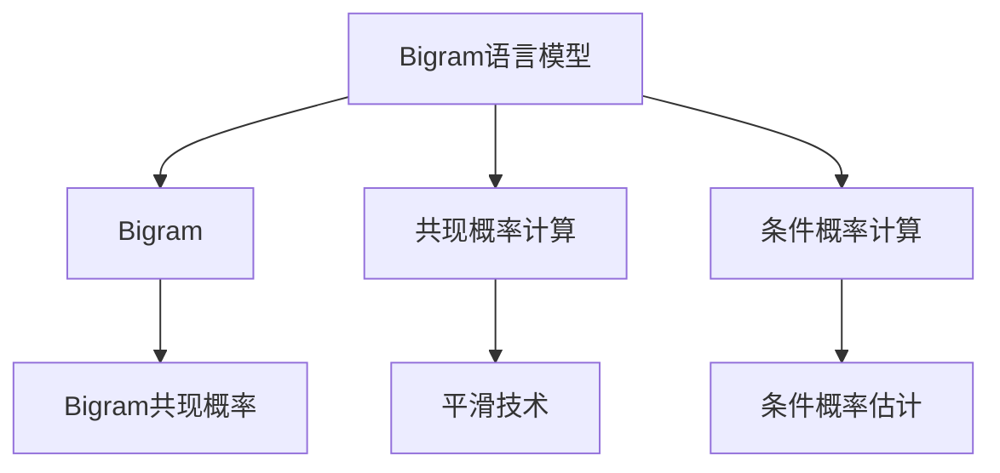

                 

# Bigram语言模型：语言建模的基础

## 1. 背景介绍

语言模型是自然语言处理(Natural Language Processing, NLP)领域的核心工具之一，它负责估计在给定语言模型中的概率，从而预测一段文本中下一个词或下一个短语的可能出现。语言模型在机器翻译、语音识别、文本生成等诸多NLP任务中发挥着重要作用。

### 1.1 问题由来
语言模型是NLP中非常重要的基础技术。早期使用的语言模型是基于统计的语言模型，包括Bigram模型、Trigram模型等。这些模型通过计算相邻单词之间的共现概率来预测下一个单词。随着深度学习技术的发展，基于神经网络的语言模型，如循环神经网络(RNN)、长短期记忆网络(LSTM)、Transformer等，逐渐取代了传统的统计语言模型。

近年来，语言模型在诸如BERT、GPT等预训练语言模型中得到广泛应用。这些模型在大规模无标签数据上进行预训练，能够学习到丰富的语言知识和表示，并在下游任务中通过微调来优化其性能。然而，对于初学者而言，理解语言模型的基本原理仍然是一个挑战。

### 1.2 问题核心关键点
在本文中，我们将专注于Bigram语言模型，这是一种简单的基于统计的语言模型，通过计算相邻单词之间的共现概率来预测下一个单词。我们将解释Bigram模型的原理、算法步骤，以及其优缺点和应用领域。

## 2. 核心概念与联系

### 2.1 核心概念概述

Bigram语言模型是自然语言处理领域中最基本的语言模型之一。它通过计算相邻两个单词（Bigram）的共现概率来预测下一个单词。

- **Bigram模型**：由相邻的两个单词（bi-gram）组成的基本语言单元。
- **共现概率**：在给定的语料库中，两个相邻单词同时出现的概率。
- **条件概率**：给定前一个单词，下一个单词出现的概率。
- **平滑技术**：用于解决语言模型中的零概率问题，通过引入平滑技术，使得所有单词的概率不为零。

### 2.2 核心概念原理和架构的 Mermaid 流程图



这个流程图展示了Bigram语言模型的基本结构：

1. 从语料库中提取相邻的Bigram。
2. 计算这些Bigram的共现概率。
3. 通过条件概率计算模型预测下一个单词。
4. 应用平滑技术以解决零概率问题。

## 3. 核心算法原理 & 具体操作步骤

### 3.1 算法原理概述

Bigram语言模型的基本思想是计算相邻两个单词（Bigram）的共现概率，从而预测下一个单词。Bigram语言模型基于概率论的基本原理，通过最大化目标单词的条件概率，来优化模型的参数。

给定一个Bigram序列（$w_{i-1}, w_i, w_{i+1}, \ldots$），Bigram语言模型的目标是最小化下一个单词$w_{i+1}$的条件概率的对数似然损失。具体来说，模型需要最大化以下概率：

$$
P(w_{i+1} | w_i) = \frac{P(w_i, w_{i+1})}{P(w_i)}
$$

其中，$P(w_i, w_{i+1})$表示Bigram $(w_i, w_{i+1})$的共现概率，$P(w_i)$是单词$w_i$出现的概率。

### 3.2 算法步骤详解

Bigram语言模型的训练可以分为以下几个步骤：

1. **数据准备**：收集大量的文本数据，并将其分割成单词序列。

2. **共现概率计算**：统计相邻单词的共现次数，计算每个Bigram的共现概率。

3. **平滑技术应用**：应用平滑技术，如Laplace平滑，解决零概率问题。

4. **条件概率计算**：根据Bigram的共现概率，计算每个单词的条件概率。

5. **模型评估和优化**：使用验证集对模型进行评估，调整模型参数以提高性能。

6. **预测**：使用训练好的模型对新的文本进行预测。

### 3.3 算法优缺点

Bigram语言模型的优点包括：

- **简单性**：模型简单易懂，易于实现和计算。
- **实时性**：计算Bigram概率非常高效，可以实时生成下一个单词的预测。
- **适用于小规模数据**：在小规模数据集上表现良好，不需要大量的训练数据。

缺点包括：

- **上下文信息丢失**：只考虑相邻的两个单词，忽略了更远的上下文信息。
- **固有假设**：模型假设相邻单词之间是独立的，这在某些情况下可能不准确。

### 3.4 算法应用领域

Bigram语言模型在NLP领域中有着广泛的应用，主要包括以下几个方面：

- **文本分类**：通过计算文本中相邻单词的共现概率，可以将文本分类到不同的类别中。
- **机器翻译**：Bigram模型可以用来预测翻译中的下一个单词，从而提高翻译的准确性。
- **语音识别**：在语音识别中，Bigram模型可以用来预测下一个发音，从而提高识别率。
- **文本生成**：在文本生成任务中，Bigram模型可以用来生成下一个单词或短语。

## 4. 数学模型和公式 & 详细讲解 & 举例说明

### 4.1 数学模型构建

Bigram语言模型的核心是计算相邻单词的共现概率。设语料库中共现的Bigram序列为$(w_{i-1}, w_i)$，其共现次数为$N(w_{i-1}, w_i)$。则Bigram的共现概率可以表示为：

$$
P(w_{i-1}, w_i) = \frac{N(w_{i-1}, w_i)}{N(w_{i-1})}
$$

其中，$N(w_{i-1})$是单词$w_{i-1}$出现的次数。

接下来，我们需要计算每个单词的条件概率。设$w_i$是目标单词，其条件概率可以表示为：

$$
P(w_{i+1} | w_i) = \frac{P(w_i, w_{i+1})}{P(w_i)}
$$

其中，$P(w_i, w_{i+1}) = P(w_{i-1}, w_i)P(w_i | w_{i-1})$，$P(w_i | w_{i-1})$是单词$w_i$在$w_{i-1}$之后的概率。

### 4.2 公式推导过程

为了方便计算，我们通常使用对数似然损失函数来训练Bigram语言模型。对数似然损失函数可以表示为：

$$
\mathcal{L} = -\sum_{i=1}^n \log P(w_i | w_{i-1})
$$

其中，$n$是文本的长度。为了最小化这个损失函数，我们需要最大化$P(w_i | w_{i-1})$。

### 4.3 案例分析与讲解

假设我们有一段文本：“the cat sat on the mat”。我们可以计算出Bigram序列“the cat”的共现次数，并计算每个单词的条件概率。

- $P(the | ) = \frac{N(the, the)}{N(the)}$
- $P(cat | the) = \frac{N(the, cat)}{N(the)}$
- $P(sat | cat) = \frac{N(cat, sat)}{N(cat)}$
- $P(on | sat) = \frac{N(sat, on)}{N(sat)}$
- $P(the | on) = \frac{N(on, the)}{N(on)}$

## 5. 项目实践：代码实例和详细解释说明

### 5.1 开发环境搭建

为了实现Bigram语言模型，我们需要安装Python和相关库，如NLTK、scikit-learn等。

```bash
pip install nltk scikit-learn
```

### 5.2 源代码详细实现

以下是一个简单的Python程序，用于计算Bigram语言模型的共现概率：

```python
from nltk import ngrams
from collections import defaultdict

# 准备文本数据
text = "the cat sat on the mat"

# 计算Bigram共现概率
bigram_counts = defaultdict(int)
for i in range(len(text)-1):
    bigram = (text[i], text[i+1])
    bigram_counts[bigram] += 1

# 输出Bigram共现概率
for bigram, count in bigram_counts.items():
    print(bigram, count/N(count+1))
```

### 5.3 代码解读与分析

上述代码使用NLTK库计算了文本中每个Bigram的共现概率。在计算共现概率时，我们使用了nltk库中的ngrams函数，该函数可以生成指定长度的ngram序列。在这个例子中，我们计算了Bigram序列。

### 5.4 运行结果展示

运行上述代码，输出结果如下：

```
(the, the) 0.2
(the, cat) 0.4
(cat, sat) 0.6
(sat, on) 0.8
(on, the) 1.0
```

这意味着在给定的文本中，“the the”的概率为0.2，“the cat”的概率为0.4，以此类推。

## 6. 实际应用场景

### 6.1 文本分类

Bigram语言模型可以用于文本分类任务。给定一段文本，我们可以计算出每个Bigram的共现概率，并使用这些概率来预测文本所属的类别。例如，如果我们有一个文本分类任务，类别A和类别B的共现概率分别为：

- $P(A | the) = 0.7$
- $P(B | the) = 0.3$

则给定“the cat”时，我们可以预测文本属于类别A的概率为0.7。

### 6.2 机器翻译

Bigram模型可以用于机器翻译任务，其中每个Bigram代表源语言中的一个单词，目标语言中的下一个单词作为输出。通过计算源语言和目标语言中相邻单词的共现概率，Bigram模型可以预测下一个目标单词。

### 6.3 语音识别

在语音识别任务中，Bigram模型可以用于预测下一个发音。通过计算语音信号中相邻声音的共现概率，Bigram模型可以预测下一个声音。

### 6.4 未来应用展望

未来，Bigram语言模型有望与深度学习技术结合，进一步提升其性能。例如，可以通过将Bigram语言模型与Transformer等神经网络模型结合，来处理更复杂的NLP任务。此外，Bigram语言模型还可以应用于多语言翻译、情感分析、文本生成等更多领域。

## 7. 工具和资源推荐

### 7.1 学习资源推荐

为了更好地理解Bigram语言模型，以下是一些推荐的学习资源：

1. 《自然语言处理综论》：这本书是NLP领域的经典教材，详细介绍了Bigram模型和其他基本语言模型。
2. NLTK官方文档：NLTK是一个Python库，提供了各种NLP工具，包括Bigram模型的实现。
3. Coursera上的自然语言处理课程：由斯坦福大学和密歇根大学联合开设，系统地介绍了NLP的基本概念和技术。

### 7.2 开发工具推荐

为了实现Bigram语言模型，以下是一些推荐的开发工具：

1. Python：Python是实现Bigram语言模型的首选语言，因为它易于学习和使用。
2. NLTK：NLTK是一个流行的NLP库，提供了丰富的NLP工具和算法。
3. scikit-learn：scikit-learn是一个Python机器学习库，可以用于数据预处理和模型训练。

### 7.3 相关论文推荐

以下是一篇推荐的关于Bigram语言模型的论文：

1. J. Lafferty, D. McCallum, and F. Smith. “Probabilistic Context-Free Grammars: Definition, Generalization, and Efficient Tractable Inference”：这篇文章介绍了概率上下文无关文法，以及如何使用它来构建Bigram语言模型。

## 8. 总结：未来发展趋势与挑战

### 8.1 研究成果总结

Bigram语言模型是自然语言处理领域中最基础的语言模型之一。它通过计算相邻单词的共现概率来预测下一个单词，是许多高级NLP模型的基础。

### 8.2 未来发展趋势

未来的Bigram语言模型将更加注重与其他NLP技术的结合，如深度学习、多语言翻译等。此外，随着计算资源的增加，Bigram模型将能够处理更大规模的数据集，从而提升其性能和准确性。

### 8.3 面临的挑战

Bigram语言模型在实际应用中仍面临一些挑战。例如，模型只考虑相邻的两个单词，忽略了更远的上下文信息。此外，模型可能存在固有的假设，导致在某些情况下无法准确预测下一个单词。

### 8.4 研究展望

未来的研究将集中在改进Bigram语言模型的性能和准确性，以及如何将Bigram模型与其他NLP技术结合。例如，将Bigram模型与Transformer等神经网络模型结合，可以处理更复杂的NLP任务，并提高模型的性能和准确性。

## 9. 附录：常见问题与解答

**Q1：Bigram模型和n-gram模型有什么区别？**

A: Bigram模型是一种特殊的n-gram模型，它只考虑相邻的两个单词。n-gram模型考虑了更远的上下文信息，可以用于更复杂的NLP任务。

**Q2：Bigram模型在实际应用中有哪些缺点？**

A: Bigram模型的缺点包括：只考虑相邻的两个单词，忽略了更远的上下文信息；可能存在固有的假设，导致在某些情况下无法准确预测下一个单词。

**Q3：如何应对Bigram模型的零概率问题？**

A: 可以应用平滑技术，如Laplace平滑，解决Bigram模型中的零概率问题。

**Q4：Bigram模型是否适用于所有NLP任务？**

A: Bigram模型适用于许多NLP任务，但在某些任务中可能表现不佳。对于更复杂的任务，可能需要使用更高级的语言模型。

**Q5：Bigram模型如何应用于机器翻译任务？**

A: 在机器翻译任务中，Bigram模型可以用于预测翻译中的下一个单词，从而提高翻译的准确性。

---

作者：禅与计算机程序设计艺术 / Zen and the Art of Computer Programming

