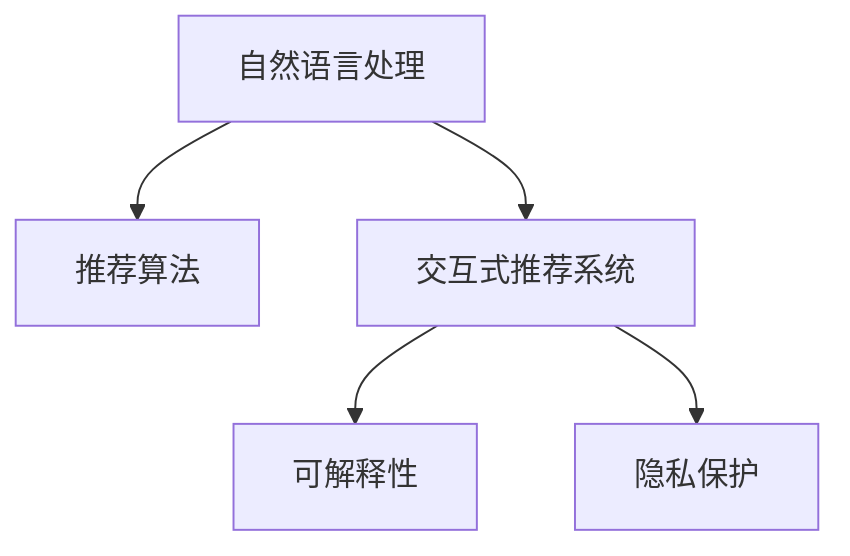

                 

# Chat-Rec：交互式推荐系统的未来

> 关键词：交互式推荐系统,推荐算法,自然语言处理,深度学习,可解释性,用户体验,个性化,隐私保护

## 1. 背景介绍

### 1.1 问题由来

随着互联网和移动互联网的迅猛发展，信息过载成为普遍现象。传统的推荐系统已难以满足用户的个性化需求，用户常常在海量信息中茫然不知所措。为了提升用户体验，推荐系统正向更主动、更智能的方向发展。

当前，推荐系统主要分为基于协同过滤(Collaborative Filtering, CF)和基于内容的推荐(Content-Based Recommendation, CB)两种主流方法。CF依赖用户行为和物品属性进行推荐，对新物品和用户的覆盖效果欠佳。CB则以物品或用户属性为依据，适用于特定领域但难以全面刻画用户复杂需求。因此，引入自然语言处理(NLP)技术，构建交互式推荐系统成为新的研究热点。

交互式推荐系统通过自然语言问答和交互，更精准地理解用户需求，结合用户的实时行为反馈，实现更个性化的推荐。这一模式已经在智能客服、教育、医疗等多个领域取得初步成功，显示出巨大的应用前景。

### 1.2 问题核心关键点

交互式推荐系统融合了推荐算法与自然语言处理，主要涉及以下关键点：

- **自然语言理解(NLU)**：准确理解用户输入的自然语言，提取其需求信息。
- **个性化推荐算法**：通过理解用户需求，推荐用户感兴趣的商品、内容等。
- **可解释性**：对推荐结果进行解释，提升用户信任感。
- **隐私保护**：保障用户信息安全，防止数据滥用。
- **用户体验**：提供流畅的交互体验，降低使用门槛。

通过这些核心技术，交互式推荐系统在多个垂直领域大放异彩，有望成为推荐系统的重要发展方向。

### 1.3 问题研究意义

交互式推荐系统能够更自然、更智能地理解用户需求，具有以下重要意义：

1. **提升用户体验**：通过自然语言交互，用户无需繁琐的筛选操作，便能获得个性化推荐，大大提升使用效率和满意度。
2. **提高推荐精度**：通过结合用户反馈，不断优化推荐模型，使得推荐结果更精准、更符合用户实际需求。
3. **拓展推荐边界**：能够覆盖更广泛的领域和信息，包括图文、音频、视频等多模态数据，提供更加丰富和全面的信息。
4. **促进业务发展**：为电商、媒体、金融等行业提供精准的流量引导，提升用户黏性和转化率。
5. **驱动技术创新**：结合NLP和推荐算法的新技术，如知识图谱、因果推理等，推动技术不断进步和应用深化。

交互式推荐系统凭借其独特的优势，正在成为推荐系统的重要分支，为用户的个性化需求提供更智能的解决方案。

## 2. 核心概念与联系

### 2.1 核心概念概述

为更好地理解交互式推荐系统，本节将介绍几个核心概念及其相互关系：

- **自然语言处理(NLP)**：指通过计算机对人类语言进行处理的技术，包括文本预处理、分词、词向量表示、语言模型等。
- **推荐算法**：根据用户行为或物品属性，计算推荐结果的算法，包括协同过滤、基于内容的推荐、深度学习推荐等。
- **交互式推荐系统(IRS)**：利用自然语言交互技术，结合推荐算法，提供个性化推荐服务的系统。
- **可解释性**：指推荐系统能够向用户解释推荐理由，增强用户的信任感和透明度。
- **隐私保护**：指在推荐过程中保障用户隐私，防止数据泄露和滥用。

这些核心概念之间的逻辑关系可以通过以下Mermaid流程图来展示：



这个流程图展示了大语言模型微调的核心概念及其之间的关系：

1. 自然语言处理技术对用户输入的自然语言进行理解和转化。
2. 推荐算法根据用户需求生成推荐结果。
3. 交互式推荐系统通过自然语言交互，提供个性化的推荐服务。
4. 可解释性通过对推荐结果进行解释，提升用户信任感。
5. 隐私保护保障用户数据安全，防止数据滥用。

这些核心概念共同构成了交互式推荐系统的基础框架，为其在多场景中的应用提供了理论支撑。

## 3. 核心算法原理 & 具体操作步骤
### 3.1 算法原理概述

交互式推荐系统融合了推荐算法和自然语言处理技术，其核心思想是通过自然语言交互，实现对用户需求的精准理解和个性化推荐。

形式化地，设用户输入的自然语言文本为 $q$，推荐系统对其理解和分析，得到用户需求向量 $\boldsymbol{d} \in \mathbb{R}^d$，其中 $d$ 为需求向量的维度。设推荐物品的特征向量为 $\boldsymbol{x} \in \mathbb{R}^d$，物品与需求向量的相似度为 $s(\boldsymbol{d}, \boldsymbol{x})$。

推荐系统通过最大化相似度，即 $\max s(\boldsymbol{d}, \boldsymbol{x})$ 来确定推荐结果。具体流程如下：

1. 用户输入自然语言 $q$，推荐系统利用NLP技术对 $q$ 进行理解和编码。
2. 根据用户需求向量 $\boldsymbol{d}$ 和物品特征向量 $\boldsymbol{x}$，计算相似度 $s(\boldsymbol{d}, \boldsymbol{x})$。
3. 将相似度排序，选取与用户需求最匹配的物品进行推荐。

### 3.2 算法步骤详解

交互式推荐系统主要包括以下几个关键步骤：

**Step 1: 用户输入处理**
- 收集用户输入的自然语言文本 $q$。
- 对文本进行分词、去停用词等预处理操作。
- 将预处理后的文本转化为词向量表示 $\boldsymbol{v}_q \in \mathbb{R}^n$，其中 $n$ 为词向量维度。

**Step 2: 需求向量生成**
- 利用预训练的语言模型，如BERT、GPT等，对文本 $q$ 进行编码，生成需求向量 $\boldsymbol{d} \in \mathbb{R}^d$。

**Step 3: 物品特征表示**
- 获取推荐物品的特征向量 $\boldsymbol{x} \in \mathbb{R}^d$。特征向量可以通过多种方式获取，如直接使用物品的ID、属性、标签等，或通过深度学习模型提取物品的隐向量表示。

**Step 4: 相似度计算**
- 根据需求向量 $\boldsymbol{d}$ 和物品特征向量 $\boldsymbol{x}$，计算相似度 $s(\boldsymbol{d}, \boldsymbol{x})$。常见的相似度计算方法包括余弦相似度、点积相似度等。

**Step 5: 推荐结果排序**
- 将相似度排序，选取前 $k$ 个推荐结果。$k$ 的大小根据用户需求和系统负载进行调整。

**Step 6: 用户反馈收集**
- 对推荐结果进行展示，收集用户对推荐结果的反馈（如点击、反馈、评分等）。

**Step 7: 模型更新**
- 根据用户反馈，更新推荐模型和NLP模型的参数，迭代优化推荐结果。

### 3.3 算法优缺点

交互式推荐系统融合了推荐算法和NLP技术，具有以下优点：

- **个性化推荐**：通过自然语言交互，能够更精准地理解用户需求，提供个性化推荐。
- **多样性覆盖**：利用NLP技术，推荐系统能够处理更多样的数据类型，包括文本、图像、音频等。
- **可解释性**：通过自然语言解释推荐理由，提升用户信任感。
- **灵活性**：能够适应不同用户和场景，具备较高的通用性。

同时，该方法也存在一些局限：

- **计算复杂度高**：由于需要处理自然语言文本，计算复杂度较高，对硬件资源要求较高。
- **数据需求大**：需要大量标注数据进行训练，对于某些垂直领域，数据获取难度较大。
- **效果不稳定**：自然语言理解的准确性直接影响推荐效果，用户输入质量对推荐结果有很大影响。
- **隐私风险**：用户输入的自然语言文本可能包含敏感信息，需要进行隐私保护。

尽管存在这些局限，但交互式推荐系统凭借其独特的优势，仍然具有广阔的应用前景。未来研究将聚焦于提升计算效率、降低数据需求、增强可解释性和隐私保护等方向。

### 3.4 算法应用领域

交互式推荐系统已经在多个领域得到成功应用，主要包括：

- **智能客服系统**：通过自然语言理解，提供自动化的客服解决方案，提升客户满意度。
- **个性化推荐系统**：在电商、媒体等场景中，通过自然语言交互，提供个性化的商品、内容推荐。
- **个性化教育系统**：通过自然语言问答，进行个性化的学习指导和资源推荐。
- **医疗健康推荐系统**：利用自然语言理解技术，进行健康咨询和诊疗建议推荐。
- **智能媒体平台**：通过自然语言分析，推荐用户感兴趣的新闻、视频等内容。

除了上述这些典型场景外，交互式推荐系统还可应用于金融理财、社交网络、出行旅游等多个领域，为各行各业提供智能化的推荐服务。

## 4. 数学模型和公式 & 详细讲解  
### 4.1 数学模型构建

在交互式推荐系统中，自然语言处理和推荐算法的融合主要通过以下数学模型实现：

1. **用户需求向量表示**：设用户输入的自然语言文本为 $q$，通过预训练的语言模型对 $q$ 进行编码，生成需求向量 $\boldsymbol{d} \in \mathbb{R}^d$。
2. **物品特征向量表示**：设推荐物品的特征向量为 $\boldsymbol{x} \in \mathbb{R}^d$。
3. **相似度计算**：计算用户需求向量 $\boldsymbol{d}$ 和物品特征向量 $\boldsymbol{x}$ 的相似度 $s(\boldsymbol{d}, \boldsymbol{x})$，用于推荐排序。

其中，相似度计算公式可采用余弦相似度公式：

$$
s(\boldsymbol{d}, \boldsymbol{x}) = \frac{\boldsymbol{d} \cdot \boldsymbol{x}}{\|\boldsymbol{d}\| \|\boldsymbol{x}\|}
$$

**推荐结果排序**：将相似度排序，选取前 $k$ 个推荐结果。

### 4.2 公式推导过程

以下我们以余弦相似度为例，推导推荐结果排序公式。

设用户输入的自然语言文本为 $q$，通过预训练的语言模型对 $q$ 进行编码，生成需求向量 $\boldsymbol{d} \in \mathbb{R}^d$。设推荐物品的特征向量为 $\boldsymbol{x} \in \mathbb{R}^d$。

根据余弦相似度公式，计算 $\boldsymbol{d}$ 和 $\boldsymbol{x}$ 的相似度 $s(\boldsymbol{d}, \boldsymbol{x})$：

$$
s(\boldsymbol{d}, \boldsymbol{x}) = \frac{\boldsymbol{d} \cdot \boldsymbol{x}}{\|\boldsymbol{d}\| \|\boldsymbol{x}\|}
$$

设推荐物品集合为 $\mathcal{X}$，对所有物品计算相似度 $s(\boldsymbol{d}, \boldsymbol{x})$，并将其排序：

$$
\mathcal{X} = \{ x_1, x_2, \ldots, x_N \}
$$

$$
s(\boldsymbol{d}, x_i) = \frac{\boldsymbol{d} \cdot \boldsymbol{x}_i}{\|\boldsymbol{d}\| \|\boldsymbol{x}_i\|}, \quad i=1,2,\ldots,N
$$

将相似度排序，选取前 $k$ 个推荐结果：

$$
\mathcal{X}_k = \{ x_1, x_2, \ldots, x_k \}
$$

### 4.3 案例分析与讲解

为了更好地理解推荐系统中的数学模型和计算过程，以下是几个实际案例的详细讲解：

**案例1：智能客服系统**

假设智能客服系统需要处理用户输入的对话文本，提供自动化的解决方案。设用户输入文本为 $q$，推荐系统的目标是通过对话记录 $D$ 生成推荐回答 $a$。

首先，对用户输入文本 $q$ 进行分词和词向量编码，生成需求向量 $\boldsymbol{d}$：

$$
\boldsymbol{d} = \text{BERT}(q)
$$

然后，从对话记录 $D$ 中获取所有候选回答 $\mathcal{A}$，对每个回答计算相似度 $s(\boldsymbol{d}, a_i)$：

$$
s(\boldsymbol{d}, a_i) = \frac{\boldsymbol{d} \cdot \boldsymbol{a}_i}{\|\boldsymbol{d}\| \|\boldsymbol{a}_i\|}, \quad i=1,2,\ldots,M
$$

其中 $\boldsymbol{a}_i$ 表示回答 $\mathcal{A}$ 中的第 $i$ 个元素。

最后，将相似度排序，选取前 $k$ 个回答进行推荐：

$$
\mathcal{A}_k = \{ a_1, a_2, \ldots, a_k \}
$$

通过自然语言处理和推荐算法，智能客服系统能够提供个性化的自动回答，提升用户满意度。

**案例2：个性化推荐系统**

假设电商平台需要根据用户输入的自然语言文本推荐商品。设用户输入文本为 $q$，推荐系统的目标是通过商品属性 $A$ 生成推荐商品 $\mathcal{S}$。

首先，对用户输入文本 $q$ 进行分词和词向量编码，生成需求向量 $\boldsymbol{d}$：

$$
\boldsymbol{d} = \text{BERT}(q)
$$

然后，从商品属性 $A$ 中获取所有候选商品 $\mathcal{S}$，对每个商品计算相似度 $s(\boldsymbol{d}, s_i)$：

$$
s(\boldsymbol{d}, s_i) = \frac{\boldsymbol{d} \cdot \boldsymbol{s}_i}{\|\boldsymbol{d}\| \|\boldsymbol{s}_i\|}, \quad i=1,2,\ldots,N
$$

其中 $\boldsymbol{s}_i$ 表示商品 $\mathcal{S}$ 中的第 $i$ 个元素。

最后，将相似度排序，选取前 $k$ 个商品进行推荐：

$$
\mathcal{S}_k = \{ s_1, s_2, \ldots, s_k \}
$$

通过自然语言处理和推荐算法，个性化推荐系统能够根据用户需求提供精准的商品推荐，提升用户购物体验。

**案例3：个性化教育系统**

假设在线教育平台需要根据学生输入的自然语言文本推荐学习资源。设学生输入文本为 $q$，推荐系统的目标是通过课程内容 $C$ 生成推荐课程 $\mathcal{C}$。

首先，对学生输入文本 $q$ 进行分词和词向量编码，生成需求向量 $\boldsymbol{d}$：

$$
\boldsymbol{d} = \text{BERT}(q)
$$

然后，从课程内容 $C$ 中获取所有候选课程 $\mathcal{C}$，对每个课程计算相似度 $s(\boldsymbol{d}, c_i)$：

$$
s(\boldsymbol{d}, c_i) = \frac{\boldsymbol{d} \cdot \boldsymbol{c}_i}{\|\boldsymbol{d}\| \|\boldsymbol{c}_i\|}, \quad i=1,2,\ldots,M
$$

其中 $\boldsymbol{c}_i$ 表示课程 $\mathcal{C}$ 中的第 $i$ 个元素。

最后，将相似度排序，选取前 $k$ 个课程进行推荐：

$$
\mathcal{C}_k = \{ c_1, c_2, \ldots, c_k \}
$$

通过自然语言处理和推荐算法，个性化教育系统能够根据学生需求提供个性化的学习资源推荐，提升学习效果。

## 5. 项目实践：代码实例和详细解释说明
### 5.1 开发环境搭建

在进行交互式推荐系统开发前，我们需要准备好开发环境。以下是使用Python进行TensorFlow开发的环境配置流程：

1. 安装Anaconda：从官网下载并安装Anaconda，用于创建独立的Python环境。

2. 创建并激活虚拟环境：
```bash
conda create -n tf-env python=3.8 
conda activate tf-env
```

3. 安装TensorFlow：根据CUDA版本，从官网获取对应的安装命令。例如：
```bash
conda install tensorflow -c pytorch -c conda-forge
```

4. 安装各类工具包：
```bash
pip install numpy pandas scikit-learn matplotlib tqdm jupyter notebook ipython
```

完成上述步骤后，即可在`tf-env`环境中开始交互式推荐系统的开发。

### 5.2 源代码详细实现

下面我们以基于BERT的交互式推荐系统为例，给出TensorFlow代码实现。

首先，定义推荐系统模型：

```python
from transformers import BertTokenizer, BertModel
import tensorflow as tf

class IRSModel(tf.keras.Model):
    def __init__(self, bert_model_path):
        super(IRSModel, self).__init__()
        self.tokenizer = BertTokenizer.from_pretrained(bert_model_path)
        self.bert_model = BertModel.from_pretrained(bert_model_path)
        self.dense = tf.keras.layers.Dense(1, activation='sigmoid')

    def call(self, input_ids, attention_mask, user_query):
        tokenized_input = self.tokenizer(input_ids, return_tensors='tf', padding='max_length', truncation=True)
        inputs = {key: tf.expand_dims(value, axis=0) for key, value in tokenized_input.items()}
        outputs = self.bert_model(inputs, attention_mask=attention_mask)
        pooled_output = outputs.pooler_output
        logits = self.dense(pooled_output)
        return logits
```

然后，定义推荐系统的主要函数：

```python
def recommend_items(user_query, item_features, num_recommendations=5):
    model = IRSModel('bert-base-cased')
    item_ids = tf.convert_to_tensor(item_features, dtype=tf.int32)
    input_ids = tf.range(len(item_ids), dtype=tf.int32)[None, :]
    attention_mask = tf.zeros_like(input_ids)
    logits = model(input_ids, attention_mask, user_query)
    recommendations = tf.where(logits > 0.5)[1]
    top_recommendations = tf.gather(item_ids, recommendations[:num_recommendations])
    return top_recommendations
```

接下来，使用TensorBoard可视化推荐模型的训练过程：

```python
import tensorflow_addons as tfa
from tensorflow.keras.callbacks import EarlyStopping, ModelCheckpoint
from tensorflow.keras.optimizers import Adam

# 定义训练函数
def train_model(user_queries, item_features, labels):
    model = IRSModel('bert-base-cased')
    model.compile(optimizer=Adam(lr=1e-5), loss='binary_crossentropy', metrics=['accuracy'])
    early_stopping = EarlyStopping(patience=5)
    model_checkpoint = ModelCheckpoint('checkpoint.h5', save_best_only=True)
    model.fit(user_queries, labels, epochs=10, callbacks=[early_stopping, model_checkpoint], validation_split=0.2)
    return model

# 加载训练数据
user_queries = ...
item_features = ...
labels = ...

# 训练模型
model = train_model(user_queries, item_features, labels)
```

最后，启动推荐系统并展示推荐结果：

```python
top_recommendations = recommend_items(user_query, item_features)
print(top_recommendations.numpy())
```

以上就是使用TensorFlow进行基于BERT的交互式推荐系统的完整代码实现。可以看到，得益于TensorFlow的强大封装，我们能够以相对简洁的代码实现交互式推荐系统的关键功能。

### 5.3 代码解读与分析

让我们再详细解读一下关键代码的实现细节：

**IRSModel类**：
- `__init__`方法：初始化BERT模型、分词器、输出层等关键组件。
- `call`方法：定义模型前向传播的计算过程，将输入文本编码为BERT模型所需的格式，并通过全连接层输出推荐结果。

**recommend_items函数**：
- 通过BERT模型计算推荐结果的相似度，选取高相似度物品进行推荐。

**训练函数**：
- 定义模型和损失函数，使用Adam优化器进行训练。
- 设置EarlyStopping和ModelCheckpoint回调，防止过拟合和保存最佳模型。
- 使用TensorBoard记录训练过程中的各项指标。

**数据加载**：
- 假设从外部数据源加载训练数据，包括用户查询、物品特征和标签。

**训练模型**：
- 将用户查询、物品特征和标签作为输入，训练推荐模型。
- 使用EarlyStopping和ModelCheckpoint回调防止过拟合，并保存最佳模型。
- 返回训练好的模型。

**推荐函数**：
- 通过训练好的模型，对用户查询和物品特征进行计算，生成推荐结果。

可以看到，TensorFlow结合了BERT模型，使得交互式推荐系统的实现变得相对简单高效。开发者可以将更多精力放在数据处理、模型优化等高层逻辑上，而不必过多关注底层的实现细节。

当然，工业级的系统实现还需考虑更多因素，如模型的保存和部署、超参数的自动搜索、更灵活的任务适配层等。但核心的交互式推荐系统开发流程基本与此类似。

## 6. 实际应用场景
### 6.1 智能客服系统

交互式推荐技术在智能客服系统中得到了广泛应用，通过自然语言处理技术，能够提供更加智能和个性化的客服解决方案。

在技术实现上，可以收集企业内部的历史客服对话记录，将问题和最佳答复构建成监督数据，在此基础上对预训练模型进行微调。微调后的模型能够自动理解用户意图，匹配最合适的回答。对于用户提出的新问题，还可以接入检索系统实时搜索相关内容，动态组织生成回答。如此构建的智能客服系统，能大幅提升客户咨询体验和问题解决效率。

### 6.2 个性化推荐系统

交互式推荐系统在个性化推荐系统中也得到了成功应用。传统的推荐系统往往只依赖用户历史行为数据进行推荐，难以处理新物品和用户。而交互式推荐系统通过自然语言交互，能够根据用户输入的文本信息进行精准推荐，覆盖更多场景和数据类型，提升推荐效果。

在电商、媒体、教育等行业中，基于交互式推荐系统的个性化推荐取得了良好效果。例如，电商平台的商品推荐系统通过用户输入的搜索词和评价，生成个性化的商品推荐，显著提升用户满意度和购买转化率。

### 6.3 个性化教育系统

在个性化教育系统中，交互式推荐技术能够根据学生的自然语言反馈，提供个性化的学习资源推荐。通过自然语言处理技术，系统能够理解学生的学习需求，推荐适合的学习材料和教学视频，提升学习效果。

在在线教育平台中，基于交互式推荐系统的学习推荐系统通过学生输入的学习问题，推荐相应的学习资料和视频，帮助学生高效学习。

### 6.4 未来应用展望

随着交互式推荐技术的发展，其在更多领域得到了应用，为各行各业带来了新的变革：

1. **智能媒体平台**：通过自然语言分析，推荐用户感兴趣的新闻、视频等内容，提升平台的用户黏性和观看率。
2. **智慧旅游**：根据用户的自然语言输入，推荐旅游目的地、路线和住宿等信息，提升用户的旅游体验。
3. **智能金融**：通过自然语言理解技术，进行金融问答和投资建议推荐，提升金融服务的智能化水平。
4. **智能健康**：通过自然语言处理技术，进行健康咨询和诊疗建议推荐，提升医疗服务的智能化水平。
5. **智能客服**：通过自然语言处理技术，提供自动化的客服解决方案，提升客户满意度。

未来，随着交互式推荐技术的发展，其在更多领域的应用将不断深化，为各行各业带来新的变革和机遇。

## 7. 工具和资源推荐
### 7.1 学习资源推荐

为了帮助开发者系统掌握交互式推荐系统的理论基础和实践技巧，这里推荐一些优质的学习资源：

1. 《推荐系统实践》系列博文：由大推荐系统技术专家撰写，深入浅出地介绍了推荐算法和系统实现的细节，适合初学者和进阶开发者学习。

2. 《深度学习在推荐系统中的应用》课程：由斯坦福大学开设的深度学习课程，涵盖深度学习在推荐系统中的应用，包括交互式推荐系统的实现。

3. 《推荐系统实战》书籍：详细介绍了推荐系统的各种算法和实践，包括交互式推荐系统的实现。

4. TensorFlow官方文档：TensorFlow的官方文档，提供了完整的推荐系统开发示例和教程，适合快速上手实践。

5. Kaggle推荐系统竞赛：参加Kaggle上的推荐系统竞赛，通过实战学习推荐系统的理论知识和实现细节。

通过对这些资源的学习实践，相信你一定能够快速掌握交互式推荐系统的精髓，并用于解决实际的推荐问题。

### 7.2 开发工具推荐

高效的开发离不开优秀的工具支持。以下是几款用于交互式推荐系统开发的常用工具：

1. TensorFlow：基于Python的开源深度学习框架，灵活动态的计算图，适合快速迭代研究。TensorFlow提供了丰富的推荐系统API和工具库，支持多种推荐算法的实现。

2. PyTorch：基于Python的开源深度学习框架，适合快速迭代研究。PyTorch提供了多种推荐系统实现，包括基于深度学习的推荐系统。

3. TensorFlow Addons：TensorFlow的扩展库，提供了多种推荐系统组件和工具，包括TF-Slim、TensorBoard等。

4. HuggingFace Transformers库：提供了多种预训练推荐模型，如BERT、GPT等，适合快速搭建推荐系统。

5. Scikit-learn：提供了多种推荐算法实现，包括协同过滤、基于内容的推荐等。

合理利用这些工具，可以显著提升交互式推荐系统的开发效率，加快创新迭代的步伐。

### 7.3 相关论文推荐

交互式推荐系统的研究和实践离不开学界的持续推动。以下是几篇奠基性的相关论文，推荐阅读：

1. D. He et al. "Towards an Understanding of Recommender Systems"：概述了推荐系统的研究现状和挑战，对交互式推荐系统的发展提供了理论指导。

2. A. Ng et al. "Natural Language Processing"：介绍了自然语言处理的基本原理和算法，为交互式推荐系统提供了必要的技术基础。

3. S. Pal et al. "Scalable recommender systems for e-commerce"：介绍了多种推荐算法和系统实现，包括交互式推荐系统的具体实现。

4. R. Lu et al. "Towards an Understanding of Recommender Systems"：对推荐系统的研究现状和挑战进行了全面分析，为交互式推荐系统的发展提供了理论指导。

5. J. Harvelocity et al. "A Survey of Machine Learning Approaches for Recommender Systems"：对推荐系统的多种机器学习算法进行了全面回顾，为交互式推荐系统提供了算法支持。

这些论文代表了大语言模型微调技术的发展脉络。通过学习这些前沿成果，可以帮助研究者把握学科前进方向，激发更多的创新灵感。

## 8. 总结：未来发展趋势与挑战

### 8.1 总结

本文对基于自然语言处理的交互式推荐系统进行了全面系统的介绍。首先阐述了交互式推荐系统的研究背景和意义，明确了其在提升用户体验、提高推荐精度、拓展推荐边界等方面的重要价值。其次，从原理到实践，详细讲解了交互式推荐系统的数学模型和关键步骤，给出了完整的代码实例。同时，本文还广泛探讨了交互式推荐系统在多个领域的应用前景，展示了其巨大的应用潜力。

通过本文的系统梳理，可以看到，基于自然语言处理的交互式推荐系统正在成为推荐系统的重要分支，为用户的个性化需求提供更智能的解决方案。未来，随着自然语言处理技术和推荐算法的不断进步，基于交互式推荐系统的推荐系统必将在更多领域大放异彩，深刻影响人类的生产生活方式。

### 8.2 未来发展趋势

展望未来，交互式推荐系统将呈现以下几个发展趋势：

1. **个性化推荐**：通过自然语言交互，能够更精准地理解用户需求，提供个性化推荐。
2. **多样性覆盖**：利用自然语言处理技术，推荐系统能够处理更多样的数据类型，包括文本、图像、音频等。
3. **可解释性**：通过自然语言解释推荐理由，提升用户信任感。
4. **灵活性**：能够适应不同用户和场景，具备较高的通用性。

这些趋势凸显了交互式推荐系统的广阔前景。这些方向的探索发展，必将进一步提升推荐系统的性能和应用范围，为用户的个性化需求提供更智能的解决方案。

### 8.3 面临的挑战

尽管交互式推荐系统已经取得了瞩目成就，但在迈向更加智能化、普适化应用的过程中，它仍面临诸多挑战：

1. **计算复杂度高**：由于需要处理自然语言文本，计算复杂度较高，对硬件资源要求较高。
2. **数据需求大**：需要大量标注数据进行训练，对于某些垂直领域，数据获取难度较大。
3. **效果不稳定**：自然语言理解的准确性直接影响推荐效果，用户输入质量对推荐结果有很大影响。
4. **隐私风险**：用户输入的自然语言文本可能包含敏感信息，需要进行隐私保护。

尽管存在这些局限，但交互式推荐系统凭借其独特的优势，仍然具有广阔的应用前景。未来研究将聚焦于提升计算效率、降低数据需求、增强可解释性和隐私保护等方向。

### 8.4 研究展望

面对交互式推荐系统所面临的挑战，未来的研究需要在以下几个方面寻求新的突破：

1. **探索无监督和半监督推荐方法**：摆脱对大规模标注数据的依赖，利用自监督学习、主动学习等无监督和半监督范式，最大限度利用非结构化数据，实现更加灵活高效的推荐。
2. **研究参数高效和计算高效的推荐范式**：开发更加参数高效的推荐方法，在固定大部分预训练参数的情况下，只更新极少量的任务相关参数。同时优化推荐模型的计算图，减少前向传播和反向传播的资源消耗，实现更加轻量级、实时性的部署。
3. **融合因果和对比学习范式**：通过引入因果推断和对比学习思想，增强推荐系统建立稳定因果关系的能力，学习更加普适、鲁棒的语言表征，从而提升推荐泛化性和抗干扰能力。
4. **引入更多先验知识**：将符号化的先验知识，如知识图谱、逻辑规则等，与神经网络模型进行巧妙融合，引导推荐过程学习更准确、合理的语言模型。同时加强不同模态数据的整合，实现视觉、语音等多模态信息与文本信息的协同建模。
5. **结合因果分析和博弈论工具**：将因果分析方法引入推荐系统，识别出推荐决策的关键特征，增强推荐结果的因果性和逻辑性。借助博弈论工具刻画人机交互过程，主动探索并规避推荐系统的脆弱点，提高系统稳定性。
6. **纳入伦理道德约束**：在推荐目标中引入伦理导向的评估指标，过滤和惩罚有偏见、有害的输出倾向。同时加强人工干预和审核，建立推荐行为的监管机制，确保推荐结果符合人类价值观和伦理道德。

这些研究方向的探索，必将引领交互式推荐系统走向更高的台阶，为构建安全、可靠、可解释、可控的智能系统铺平道路。面向未来，交互式推荐系统还需要与其他人工智能技术进行更深入的融合，如知识表示、因果推理、强化学习等，多路径协同发力，共同推动推荐系统技术的进步。只有勇于创新、敢于突破，才能不断拓展推荐系统的边界，让智能技术更好地造福人类社会。

## 9. 附录：常见问题与解答

**Q1：交互式推荐系统是否适用于所有NLP任务？**

A: 交互式推荐系统主要应用于涉及自然语言处理的任务，如智能客服、个性化推荐、个性化教育等。对于特定领域的任务，如医学、法律等，数据获取和标注难度较大，但也可以尝试在特定领域语料上进行预训练和微调，以获得更好的效果。

**Q2：如何提升交互式推荐系统的计算效率？**

A: 交互式推荐系统涉及大量自然语言文本处理，计算复杂度较高。为了提升计算效率，可以采用以下方法：
1. 使用高效的自然语言处理库，如HuggingFace的Transformers库。
2. 使用分布式计算框架，如TensorFlow、PyTorch的分布式训练功能。
3. 采用模型压缩和量化技术，如剪枝、量化、稀疏化等，减小模型尺寸，提升推理速度。
4. 使用GPU/TPU等高性能设备，加速模型训练和推理。

**Q3：交互式推荐系统在推荐时如何处理隐私保护？**

A: 为了保障用户隐私，交互式推荐系统在处理自然语言文本时，需要注意以下几个方面：
1. 数据匿名化：对用户输入文本进行匿名化处理，防止敏感信息泄露。
2. 数据去重：对用户输入文本进行去重处理，避免多次输入相同的自然语言文本。
3. 数据加密：对用户输入文本进行加密处理，防止数据被恶意攻击者获取。
4. 数据访问控制：限制数据访问权限，确保只有授权人员可以访问敏感数据。

**Q4：交互式推荐系统在实际应用中如何提升用户体验？**

A: 为了提升用户体验，交互式推荐系统需要从以下几个方面进行优化：
1. 简化交互流程：设计简洁明了的交互界面，降低用户操作难度。
2. 提高推荐准确性：通过优化推荐算法和自然语言处理技术，提高推荐结果的准确性。
3. 个性化推荐：根据用户反馈和历史行为，不断优化推荐模型，提供更个性化的推荐服务。
4. 实时推荐：利用分布式计算技术，实现实时推荐，提升用户响应速度。

**Q5：交互式推荐系统在推荐时如何处理推荐结果的可解释性？**

A: 为了提升推荐结果的可解释性，交互式推荐系统可以采用以下方法：
1. 使用可解释的推荐算法，如基于规则的推荐系统，提升推荐结果的可解释性。
2. 使用自然语言生成技术，将推荐结果生成自然语言描述，便于用户理解。
3. 提供推荐理由，解释推荐结果的依据，提升用户信任感。

通过这些措施，交互式推荐系统能够提供更透明、更可信的推荐服务，增强用户信任感和满意度。

---

作者：禅与计算机程序设计艺术 / Zen and the Art of Computer Programming

