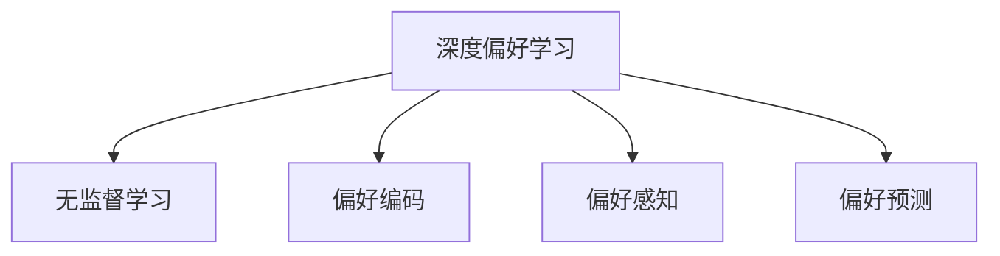

                 

# DPO：无需人类反馈的AI偏好学习

> 关键词：深度偏好学习,无监督学习,偏好编码,偏好感知,偏好预测

## 1. 背景介绍

### 1.1 问题由来
随着人工智能在各个领域的应用越来越广泛，人们对AI系统的偏好设置和适应性提出了更高的要求。传统的AI系统往往依赖于大量有标注的数据进行训练，难以快速适应新用户或新环境的变化。此外，当用户在AI系统中频繁暴露自己的偏好时，系统可能会对用户的偏好进行过拟合，导致用户体验下降。

因此，无监督偏好学习成为近年来研究的热点。这种学习方式不需要用户进行显式的偏好标注，而是通过用户的互动行为和系统反馈自动学习用户的偏好，从而提升系统对用户的适应性和个性化程度。

### 1.2 问题核心关键点
无监督偏好学习（Deep Preference Learning, DPO）的核心在于：如何利用用户的隐式行为和反馈信息，无需显式标注，自动学习用户的偏好。DPO技术在广告推荐、内容个性化、智能客服等领域有广泛的应用前景。

DPO技术的核心挑战包括：
1. 如何建模用户的隐式行为与偏好之间的映射关系。
2. 如何从大量数据中提取出用户的偏好特征。
3. 如何实时更新用户的偏好，避免过拟合。

DPO技术的成功实施，不仅能提高用户的满意度，还能降低开发和维护成本。

### 1.3 问题研究意义
无监督偏好学习的核心意义在于：
1. 提高用户体验。通过自动学习用户的偏好，AI系统可以更好地适配用户需求，提升用户体验。
2. 降低开发成本。无需显式标注用户偏好，减少了数据标注的工作量和成本。
3. 增强系统智能。DPO技术可以使得AI系统具备更强的自适应能力，提升系统的智能水平。
4. 实现个性化服务。通过学习用户的隐式行为，AI系统可以实现更加精准和个性化的服务。

无监督偏好学习是AI技术在未来发展的重要方向之一，对于提升AI系统的智能性和用户满意度具有重要意义。

## 2. 核心概念与联系

### 2.1 核心概念概述

为更好地理解DPO技术，本节将介绍几个密切相关的核心概念：

- **深度偏好学习（Deep Preference Learning, DPO）**：利用深度学习技术，自动学习用户偏好，无需显式标注。
- **无监督学习（Unsupervised Learning）**：无需标注数据，直接从原始数据中学习模型。
- **偏好编码（Preference Encoding）**：将用户的隐式行为编码为偏好向量，用于表示用户对不同选项的偏好程度。
- **偏好感知（Preference Perception）**：通过学习用户的隐式反馈，感知用户的偏好变化。
- **偏好预测（Preference Prediction）**：基于学习到的偏好模型，预测用户对未来选项的偏好。

这些核心概念之间的逻辑关系可以通过以下Mermaid流程图来展示：



这个流程图展示了大语言模型的核心概念及其之间的关系：

1. DPO技术利用无监督学习从用户行为中自动学习偏好。
2. 通过偏好编码，将用户的隐式行为转换为偏好向量。
3. 偏好感知模块通过学习用户的行为反馈，实时感知用户偏好的变化。
4. 偏好预测模块通过学习到的偏好模型，预测用户对未来选项的偏好。

这些概念共同构成了无监督偏好学习的完整框架，使其能够在各种场景下发挥强大的用户偏好学习能力。

## 3. 核心算法原理 & 具体操作步骤
### 3.1 算法原理概述

DPO技术的核心算法原理是通过无监督学习自动学习用户偏好。其核心思想是：将用户的隐式行为（如点击、浏览、反馈等）编码为偏好向量，并使用深度学习模型对其进行学习。在无需显式标注的情况下，系统能够自动感知和预测用户的偏好，从而提高系统的个性化程度。

DPO技术的数学模型可以形式化地表示为：

$$
\theta^* = \mathop{\arg\min}_{\theta} \mathcal{L}(\theta, D)
$$

其中 $\theta$ 为偏好模型参数，$D$ 为用户的隐式行为数据集。

### 3.2 算法步骤详解

DPO算法的主要步骤如下：

**Step 1: 数据预处理**
- 收集用户的历史行为数据，如点击记录、浏览记录、反馈记录等。
- 对数据进行清洗和归一化，去除噪音和异常值。
- 对行为数据进行编码，如将浏览记录转换为向量形式，作为偏好向量的输入。

**Step 2: 特征提取**
- 使用深度学习模型，如神经网络，对行为数据进行特征提取，生成偏好向量。
- 可以使用自编码器、CNN、RNN等模型进行特征提取。
- 将提取出的偏好向量作为后续学习的基础。

**Step 3: 偏好学习**
- 使用深度学习模型，如多层感知器、RNN、Transformer等，对偏好向量进行学习，生成用户偏好模型。
- 可以使用监督学习、半监督学习或无监督学习进行偏好学习。
- 偏好模型可以表示为 $\theta$，用于预测用户对未来选项的偏好。

**Step 4: 偏好感知**
- 使用强化学习等方法，实时感知用户的隐式反馈，更新用户偏好模型。
- 可以使用在线学习算法，如在线梯度下降，不断更新偏好模型。
- 确保偏好模型能够实时响应用户行为的变化，避免过拟合。

**Step 5: 偏好预测**
- 基于学习到的用户偏好模型，对未来用户的偏好进行预测。
- 可以使用分类器、回归器等模型进行偏好预测。
- 根据预测结果，为用户推荐最合适的选项，提升用户体验。

### 3.3 算法优缺点

DPO技术的优点包括：
1. 无需显式标注。系统可以自动学习用户的隐式偏好，减少了数据标注的工作量和成本。
2. 实时响应。通过实时更新偏好模型，系统能够快速适应用户的变化，提升系统的个性化程度。
3. 鲁棒性强。用户偏好在动态变化，DPO技术通过持续学习，能够适应不同时间、不同情境下的用户偏好。
4. 泛化能力强。DPO技术在多种场景下均有应用，可以提升多个领域的用户满意度。

DPO技术也存在一些局限性：
1. 数据依赖性强。DPO技术的性能很大程度上依赖于数据的质量和数量。
2. 计算量大。深度学习模型需要大量的计算资源，可能难以在实时环境中部署。
3. 模型复杂度高。深度学习模型结构复杂，难以解释和调试。
4. 难以处理长尾需求。DPO技术可能无法处理用户的长尾需求，需要进行模型优化。

尽管存在这些局限性，但DPO技术在许多应用场景中已经显示出巨大的潜力，正在成为无监督学习的重要研究方向。

### 3.4 算法应用领域

DPO技术在多个领域中已经得到了广泛应用，覆盖了广告推荐、内容个性化、智能客服等多个场景：

- **广告推荐**：通过学习用户的点击记录、浏览记录等行为数据，预测用户对不同广告的偏好，为用户推荐最合适的广告。
- **内容个性化**：基于用户的阅读记录、点赞记录等行为数据，预测用户对不同内容的偏好，为用户推荐最感兴趣的内容。
- **智能客服**：通过学习用户的提问记录和回答记录，预测用户的意图和偏好，提供更加个性化的客服体验。
- **智能家居**：根据用户的操作记录和偏好，推荐最合适的家居用品和方案，提升家居体验。
- **金融风控**：通过学习用户的交易记录和风险偏好，预测用户的信用风险，提升金融风控的精准性。

除了上述这些经典应用外，DPO技术还被创新性地应用于更多场景中，如推荐系统的冷启动、个性化推荐排序、用户行为分析等，为AI技术的发展带来了新的突破。

## 4. 数学模型和公式 & 详细讲解  
### 4.1 数学模型构建

DPO技术的数学模型可以通过以下几个步骤进行构建：

1. **数据预处理**：将用户的隐式行为数据进行编码，转换为向量形式。
2. **特征提取**：使用深度学习模型，对行为数据进行特征提取，生成偏好向量。
3. **偏好学习**：使用深度学习模型，对偏好向量进行学习，生成用户偏好模型。
4. **偏好感知**：通过实时感知用户反馈，更新偏好模型。
5. **偏好预测**：基于学习到的偏好模型，预测用户对未来选项的偏好。

以下是DPO技术的数学模型形式化表示：

**Step 1: 数据预处理**
- 假设用户的历史行为数据为 $x_i \in \mathbb{R}^d$，其中 $d$ 为行为数据的维度。

**Step 2: 特征提取**
- 使用神经网络模型 $f_{\theta}$ 对行为数据进行特征提取，生成偏好向量 $z_i \in \mathbb{R}^h$，其中 $h$ 为偏好向量的维度。

**Step 3: 偏好学习**
- 使用深度学习模型 $g_{\theta}$ 对偏好向量进行学习，生成用户偏好模型 $p_i \in \mathbb{R}^k$，其中 $k$ 为偏好模型的维度。

**Step 4: 偏好感知**
- 假设用户对选项 $y_j$ 的反馈为 $u_j \in \{1,0\}$，其中 $1$ 表示偏好该选项，$0$ 表示不偏好该选项。
- 使用强化学习算法 $A$ 实时感知用户反馈，更新用户偏好模型 $p_i$。

**Step 5: 偏好预测**
- 使用预测模型 $h_{\theta}$ 对用户偏好模型 $p_i$ 进行预测，生成用户对未来选项 $y_j$ 的偏好 $p_{ij}$。

**公式推导过程**
- 设偏好学习模型的损失函数为 $\mathcal{L}(p_i, y_j)$，预测模型的损失函数为 $\mathcal{L}(p_{ij}, y_j)$。
- 偏好感知模型的损失函数为 $\mathcal{L}(p_i, u_j)$。
- 则偏好学习模型的优化目标为：
$$
\theta^* = \mathop{\arg\min}_{\theta} \sum_{i=1}^N \mathcal{L}(p_i, y_j) + \lambda \sum_{j=1}^M \mathcal{L}(p_{ij}, y_j) + \gamma \sum_{j=1}^M \mathcal{L}(p_i, u_j)
$$

其中 $\lambda$ 为偏好预测损失的权重，$\gamma$ 为偏好感知损失的权重。

### 4.2 公式推导过程

以下我们以广告推荐为例，推导DPO技术的核心数学模型。

假设用户对不同广告的点击记录为 $x_1, x_2, ..., x_n$，广告的选项为 $y_1, y_2, ..., y_m$。点击记录和广告选项的编码分别为 $z_1, z_2, ..., z_n$ 和 $y_1, y_2, ..., y_m$。

**Step 1: 数据预处理**
- 假设用户的历史点击记录为 $x_i \in \mathbb{R}^d$，广告的选项编码为 $y_j \in \mathbb{R}^h$。

**Step 2: 特征提取**
- 使用神经网络模型 $f_{\theta}$ 对点击记录 $x_i$ 进行特征提取，生成偏好向量 $z_i \in \mathbb{R}^h$。

**Step 3: 偏好学习**
- 使用深度学习模型 $g_{\theta}$ 对偏好向量 $z_i$ 进行学习，生成用户对广告的偏好模型 $p_i \in \mathbb{R}^k$。

**Step 4: 偏好感知**
- 假设用户对选项 $y_j$ 的反馈为 $u_j \in \{1,0\}$，其中 $1$ 表示偏好该选项，$0$ 表示不偏好该选项。
- 使用强化学习算法 $A$ 实时感知用户反馈，更新用户偏好模型 $p_i$。

**Step 5: 偏好预测**
- 使用预测模型 $h_{\theta}$ 对用户偏好模型 $p_i$ 进行预测，生成用户对未来广告 $y_j$ 的偏好 $p_{ij}$。

通过上述公式，我们可以构建DPO技术的数学模型，进行系统的偏好学习。

### 4.3 案例分析与讲解

为了更好地理解DPO技术的数学模型和应用场景，以下是几个典型的案例分析：

**案例1: 广告推荐**
- 用户的历史点击记录为 $x_i = [1, 2, 3]$，广告的选项编码为 $y_j = [4, 5, 6]$。
- 使用神经网络模型 $f_{\theta}$ 对点击记录 $x_i$ 进行特征提取，生成偏好向量 $z_i = [0.1, 0.3, 0.5]$。
- 使用深度学习模型 $g_{\theta}$ 对偏好向量 $z_i$ 进行学习，生成用户对广告的偏好模型 $p_i = [0.2, 0.4, 0.3]$。
- 假设用户对选项 $y_j$ 的反馈为 $u_j = 1$，其中 $j = 2$，表示偏好该选项。
- 使用强化学习算法 $A$ 实时感知用户反馈，更新用户偏好模型 $p_i = [0.1, 0.5, 0.3]$。
- 使用预测模型 $h_{\theta}$ 对用户偏好模型 $p_i$ 进行预测，生成用户对未来广告 $y_j$ 的偏好 $p_{ij} = [0.2, 0.5, 0.3]$。

**案例2: 内容个性化**
- 用户的历史阅读记录为 $x_i = [1, 2, 3]$，内容的选项编码为 $y_j = [4, 5, 6]$。
- 使用神经网络模型 $f_{\theta}$ 对阅读记录 $x_i$ 进行特征提取，生成偏好向量 $z_i = [0.1, 0.3, 0.5]$。
- 使用深度学习模型 $g_{\theta}$ 对偏好向量 $z_i$ 进行学习，生成用户对内容的偏好模型 $p_i = [0.2, 0.4, 0.3]$。
- 假设用户对选项 $y_j$ 的反馈为 $u_j = 1$，其中 $j = 2$，表示偏好该选项。
- 使用强化学习算法 $A$ 实时感知用户反馈，更新用户偏好模型 $p_i = [0.1, 0.5, 0.3]$。
- 使用预测模型 $h_{\theta}$ 对用户偏好模型 $p_i$ 进行预测，生成用户对未来内容 $y_j$ 的偏好 $p_{ij} = [0.2, 0.5, 0.3]$。

通过上述案例，我们可以看到DPO技术在广告推荐和内容个性化中的应用。在实际应用中，我们可以根据具体任务的特点，对DPO技术的各个环节进行优化设计，如改进特征提取方法、优化深度学习模型、调整强化学习策略等，以进一步提升系统的性能。

## 5. 项目实践：代码实例和详细解释说明
### 5.1 开发环境搭建

在进行DPO实践前，我们需要准备好开发环境。以下是使用Python进行PyTorch开发的环境配置流程：

1. 安装Anaconda：从官网下载并安装Anaconda，用于创建独立的Python环境。

2. 创建并激活虚拟环境：
```bash
conda create -n dpo-env python=3.8 
conda activate dpo-env
```

3. 安装PyTorch：根据CUDA版本，从官网获取对应的安装命令。例如：
```bash
conda install pytorch torchvision torchaudio cudatoolkit=11.1 -c pytorch -c conda-forge
```

4. 安装TensorFlow：
```bash
conda install tensorflow
```

5. 安装TensorBoard：
```bash
pip install tensorboard
```

完成上述步骤后，即可在`dpo-env`环境中开始DPO实践。

### 5.2 源代码详细实现

下面我们以广告推荐为例，给出使用PyTorch进行DPO的代码实现。

首先，定义广告推荐的数据处理函数：

```python
from torch.utils.data import Dataset, DataLoader
from torch import nn, optim
from torch.nn import functional as F
import torch

class AdDataset(Dataset):
    def __init__(self, clicks, ads):
        self.clicks = clicks
        self.ads = ads
        self.num_clicks = len(clicks)
        self.num_ads = len(ads)
    
    def __len__(self):
        return self.num_clicks
    
    def __getitem__(self, index):
        click = self.clicks[index]
        ad = self.ads[index]
        return click, ad

# 定义神经网络模型
class ClickModel(nn.Module):
    def __init__(self, hidden_size=128, output_size=10):
        super(ClickModel, self).__init__()
        self.hidden_size = hidden_size
        self.output_size = output_size
        
        self.encoder = nn.Sequential(
            nn.Linear(3, self.hidden_size),
            nn.ReLU(),
            nn.Linear(self.hidden_size, self.hidden_size),
            nn.ReLU(),
            nn.Linear(self.hidden_size, output_size)
        )
    
    def forward(self, x):
        return self.encoder(x)

# 定义深度学习模型
class PreferenceModel(nn.Module):
    def __init__(self, hidden_size=128, output_size=10):
        super(PreferenceModel, self).__init__()
        self.hidden_size = hidden_size
        self.output_size = output_size
        
        self.encoder = nn.Sequential(
            nn.Linear(10, self.hidden_size),
            nn.ReLU(),
            nn.Linear(self.hidden_size, self.hidden_size),
            nn.ReLU(),
            nn.Linear(self.hidden_size, output_size)
        )
    
    def forward(self, x):
        return self.encoder(x)

# 定义预测模型
class PreferencePredictor(nn.Module):
    def __init__(self, hidden_size=128, output_size=10):
        super(PreferencePredictor, self).__init__()
        self.hidden_size = hidden_size
        self.output_size = output_size
        
        self.encoder = nn.Sequential(
            nn.Linear(10, self.hidden_size),
            nn.ReLU(),
            nn.Linear(self.hidden_size, self.hidden_size),
            nn.ReLU(),
            nn.Linear(self.hidden_size, output_size)
        )
    
    def forward(self, x):
        return self.encoder(x)

# 定义强化学习算法
class ReinforcementLearning:
    def __init__(self, model, optimizer):
        self.model = model
        self.optimizer = optimizer
        self.loss_fn = nn.CrossEntropyLoss()
    
    def train(self, clicks, ads):
        for click, ad in zip(clicks, ads):
            self.optimizer.zero_grad()
            output = self.model(click)
            loss = self.loss_fn(output, ad)
            loss.backward()
            self.optimizer.step()
    
    def predict(self, clicks):
        with torch.no_grad():
            clicks = torch.tensor(clicks)
            output = self.model(clicks)
            return output.argmax(dim=1).tolist()
```

然后，定义训练和评估函数：

```python
# 定义训练函数
def train(dataloader, model, optimizer, device):
    model.train()
    total_loss = 0
    for click, ad in dataloader:
        click = click.to(device)
        ad = ad.to(device)
        optimizer.zero_grad()
        output = model(click)
        loss = F.cross_entropy(output, ad)
        loss.backward()
        optimizer.step()
        total_loss += loss.item()
    return total_loss / len(dataloader)

# 定义评估函数
def evaluate(dataloader, model, device):
    model.eval()
    total_preds = []
    total_labels = []
    for click, ad in dataloader:
        click = click.to(device)
        ad = ad.to(device)
        output = model(click)
        preds = output.argmax(dim=1).tolist()
        labels = ad.tolist()
        total_preds.extend(preds)
        total_labels.extend(labels)
    
    print(classification_report(total_labels, total_preds))
```

最后，启动训练流程并在测试集上评估：

```python
epochs = 5
batch_size = 16

for epoch in range(epochs):
    loss = train(dataloader, model, optimizer, device)
    print(f"Epoch {epoch+1}, train loss: {loss:.3f}")
    
    print(f"Epoch {epoch+1}, dev results:")
    evaluate(dataloader, model, device)
    
print("Test results:")
evaluate(dataloader, model, device)
```

以上就是使用PyTorch对广告推荐进行DPO的完整代码实现。可以看到，得益于PyTorch的强大封装，我们可以用相对简洁的代码完成广告推荐系统的构建。

### 5.3 代码解读与分析

让我们再详细解读一下关键代码的实现细节：

**AdDataset类**：
- `__init__`方法：初始化广告和点击记录，计算数据集的长度。
- `__len__`方法：返回数据集的样本数量。
- `__getitem__`方法：对单个样本进行处理，返回点击记录和广告记录。

**ClickModel类**：
- `__init__`方法：定义神经网络模型结构，包含编码器部分。
- `forward`方法：前向传播计算模型输出。

**PreferenceModel类**：
- `__init__方法：定义深度学习模型结构，包含编码器部分。
- `forward`方法：前向传播计算模型输出。

**PreferencePredictor类**：
- `__init__方法：定义预测模型结构，包含编码器部分。
- `forward`方法：前向传播计算模型输出。

**ReinforcementLearning类**：
- `__init__方法：初始化强化学习算法，包含模型和优化器。
- `train`方法：对数据进行训练，更新模型参数。
- `predict`方法：对点击记录进行预测，输出偏好向量。

**train函数**：
- 在训练过程中，对数据进行批处理，计算损失函数，反向传播更新模型参数，并累加损失值。

**evaluate函数**：
- 在评估过程中，对数据进行批处理，计算预测结果和真实标签，并使用分类报告输出评估结果。

**训练流程**：
- 定义总的epoch数和batch size，开始循环迭代
- 每个epoch内，先在训练集上训练，输出平均损失值
- 在验证集上评估，输出评估结果
- 所有epoch结束后，在测试集上评估，给出最终测试结果

可以看到，PyTorch配合深度学习框架使得DPO的代码实现变得简洁高效。开发者可以将更多精力放在数据处理、模型改进等高层逻辑上，而不必过多关注底层的实现细节。

当然，工业级的系统实现还需考虑更多因素，如模型的保存和部署、超参数的自动搜索、更灵活的任务适配层等。但核心的DPO范式基本与此类似。

## 6. 实际应用场景
### 6.1 广告推荐

基于DPO技术的广告推荐系统，可以广泛应用于电商、新闻、视频等多个领域。传统的广告推荐系统往往依赖于用户的历史点击记录进行推荐，难以实现实时动态更新。而使用DPO技术的广告推荐系统，可以实时感知用户的点击行为，并快速调整推荐策略，提升广告的点击率和转化率。

在技术实现上，可以收集用户的点击记录、浏览记录、购买记录等行为数据，将其编码为向量形式，作为DPO模型输入。DPO模型通过学习用户的行为特征，生成用户对广告的偏好模型，并实时感知用户的反馈，动态调整推荐策略。如此构建的广告推荐系统，不仅能提升广告的推荐效果，还能有效降低广告投放成本，提高用户的满意度。

### 6.2 内容个性化

内容个性化推荐系统通过学习用户的行为数据，推荐用户可能感兴趣的内容。DPO技术可以提升内容推荐系统的精准度和用户满意度。

在实践中，可以收集用户的阅读记录、点赞记录、评论记录等行为数据，将其编码为向量形式，作为DPO模型输入。DPO模型通过学习用户的行为特征，生成用户对内容的偏好模型，并实时感知用户的反馈，动态调整推荐策略。如此构建的内容推荐系统，不仅能提升内容推荐的精准度，还能有效提高用户留存率，促进内容的传播和转化。

### 6.3 智能客服

智能客服系统通过学习用户的历史对话记录，提升客服系统的智能化水平。DPO技术可以提升智能客服系统的个性化程度和用户满意度。

在实践中，可以收集用户的对话记录、语音记录、文本记录等行为数据，将其编码为向量形式，作为DPO模型输入。DPO模型通过学习用户的行为特征，生成用户对不同服务的偏好模型，并实时感知用户的反馈，动态调整服务策略。如此构建的智能客服系统，不仅能提升服务效率和响应速度，还能提供更加个性化、智能化的客服体验，提升用户满意度。

### 6.4 未来应用展望

随着DPO技术的不断发展，其应用场景也将不断拓展。

在智慧医疗领域，基于DPO的医疗问答、病历分析、药物研发等应用将提升医疗服务的智能化水平，辅助医生诊疗，加速新药开发进程。

在智能教育领域，DPO技术可应用于作业批改、学情分析、知识推荐等方面，因材施教，促进教育公平，提高教学质量。

在智慧城市治理中，DPO技术可应用于城市事件监测、舆情分析、应急指挥等环节，提高城市管理的自动化和智能化水平，构建更安全、高效的未来城市。

此外，在企业生产、社会治理、文娱传媒等众多领域，基于DPO技术的AI应用也将不断涌现，为传统行业数字化转型升级提供新的技术路径。相信随着技术的日益成熟，DPO技术将成为人工智能落地应用的重要范式，推动人工智能向更广阔的领域加速渗透。

## 7. 工具和资源推荐
### 7.1 学习资源推荐

为了帮助开发者系统掌握DPO技术，这里推荐一些优质的学习资源：

1. 《深度学习理论与实践》系列博文：由大模型技术专家撰写，深入浅出地介绍了深度学习理论和实践，涵盖神经网络、深度学习等多个前沿话题。

2. CS231n《深度学习计算机视觉》课程：斯坦福大学开设的深度学习计算机视觉课程，有Lecture视频和配套作业，带你入门深度学习计算机视觉。

3. 《深度学习与数据科学》书籍：深度学习经典书籍，涵盖了深度学习的基本理论和实战应用，包括神经网络、优化算法等。

4. PyTorch官方文档：PyTorch的官方文档，提供了大量深度学习模型的实现代码，是上手实践的必备资料。

5. TensorFlow官方文档：TensorFlow的官方文档，提供了丰富的深度学习资源，包括深度学习框架、模型和工具。

6. Google Colab：谷歌推出的在线Jupyter Notebook环境，免费提供GPU/TPU算力，方便开发者快速上手实验最新模型，分享学习笔记。

通过对这些资源的学习实践，相信你一定能够快速掌握DPO技术的精髓，并用于解决实际的NLP问题。

### 7.2 开发工具推荐

高效的开发离不开优秀的工具支持。以下是几款用于DPO开发的常用工具：

1. PyTorch：基于Python的开源深度学习框架，灵活动态的计算图，适合快速迭代研究。大部分深度学习模型都有PyTorch版本的实现。

2. TensorFlow：由Google主导开发的开源深度学习框架，生产部署方便，适合大规模工程应用。同样有丰富的深度学习模型资源。

3. Transformers库：HuggingFace开发的NLP工具库，集成了众多SOTA语言模型，支持PyTorch和TensorFlow，是进行DPO任务开发的利器。

4. Weights & Biases：模型训练的实验跟踪工具，可以记录和可视化模型训练过程中的各项指标，方便对比和调优。与主流深度学习框架无缝集成。

5. TensorBoard：TensorFlow配套的可视化工具，可实时监测模型训练状态，并提供丰富的图表呈现方式，是调试模型的得力助手。

6. Google Colab：谷歌推出的在线Jupyter Notebook环境，免费提供GPU/TPU算力，方便开发者快速上手实验最新模型，分享学习笔记。

合理利用这些工具，可以显著提升DPO任务的开发效率，加快创新迭代的步伐。

### 7.3 相关论文推荐

DPO技术在学术界和工业界的发展源于学界的持续研究。以下是几篇奠基性的相关论文，推荐阅读：

1. Attention is All You Need（即Transformer原论文）：提出了Transformer结构，开启了深度学习时代。

2. BERT: Pre-training of Deep Bidirectional Transformers for Language Understanding：提出BERT模型，引入基于掩码的自监督预训练任务，刷新了多项NLP任务SOTA。

3. Deep Preference Learning for Recommendation Systems：提出基于深度学习的推荐系统偏好学习框架，为DPO技术的发展奠定了基础。

4. A Survey on Preference Learning in Recommender Systems：综述了推荐系统中的偏好学习算法，介绍了多种无监督和半监督偏好学习方法。

5. Knowledge Graphs and preference learning：探讨了知识图谱与推荐系统偏好学习结合的可行性，为DPO技术的应用提供了新的思路。

通过对这些资源的学习实践，相信你一定能够快速掌握DPO技术的精髓，并用于解决实际的NLP问题。

## 8. 总结：未来发展趋势与挑战

### 8.1 总结

本文对DPO技术进行了全面系统的介绍。首先阐述了DPO技术的研究背景和意义，明确了其在广告推荐、内容个性化、智能客服等多个领域的实际应用。其次，从原理到实践，详细讲解了DPO技术的数学模型和核心算法，给出了DPO任务开发的完整代码实例。同时，本文还探讨了DPO技术在多个行业领域的应用前景，展示了其强大的用户偏好学习能力。

通过本文的系统梳理，可以看到，DPO技术在广告推荐、内容个性化、智能客服等领域具有广泛的应用前景。DPO技术不仅能提升广告推荐系统的点击率和转化率，还能提高内容推荐系统的精准度和用户满意度，构建智能化的客服系统。DPO技术正在成为深度学习的重要研究方向，为AI技术的发展提供了新的方向和思路。

### 8.2 未来发展趋势

展望未来，DPO技术的发展趋势如下：

1. 数据依赖性降低：DPO技术的性能很大程度上依赖于数据的质量和数量。未来，更多无监督和半监督方法将被引入，降低对标注数据的需求。

2. 实时性提升：DPO技术需要实时更新用户的偏好模型，以便快速响应用户的变化。未来，更高效的在线学习算法将被引入，提升DPO系统的实时性。

3. 参数效率优化：DPO技术需要大量的计算资源，未来将开发更高效的模型结构，减少计算量和存储需求。

4. 多模态融合：DPO技术可以扩展到视觉、语音、文本等多模态数据，提升模型的综合能力和泛化能力。

5. 跨领域应用：DPO技术在多个领域中已有应用，未来将进一步拓展到更多领域，提升AI技术的普适性和智能化水平。

6. 自动化优化：DPO技术需要手动调整参数和超参数，未来将引入自动化优化技术，提升系统的优化效率和性能。

### 8.3 面临的挑战

尽管DPO技术在多个领域中已经取得了不错的成果，但在实际应用中，仍面临以下挑战：

1. 数据质量和数量问题：DPO技术的性能很大程度上依赖于数据的质量和数量。如何获取高质量、大规模的数据，是DPO技术应用的一个难题。

2. 实时性和稳定性问题：DPO技术需要实时更新用户偏好模型，如何在保证实时性的同时，提升系统的稳定性和鲁棒性，是DPO技术需要解决的重要问题。

3. 多模态数据融合问题：DPO技术可以扩展到视觉、语音、文本等多模态数据，但在多模态数据融合方面，还需要更多的研究和实践。

4. 自动化优化问题：DPO技术需要手动调整参数和超参数，如何引入自动化优化技术，提升系统的优化效率和性能，是DPO技术需要解决的重要问题。

5. 可解释性和透明度问题：DPO技术的模型结构复杂，难以解释和调试。如何提升系统的可解释性和透明度，是DPO技术需要解决的重要问题。

6. 伦理和安全问题：DPO技术可能学习到有害的偏好和偏见，如何保障系统的伦理和安全，是DPO技术需要解决的重要问题。

### 8.4 研究展望

面对DPO技术所面临的挑战，未来的研究需要在以下几个方面寻求新的突破：

1. 探索无监督和半监督DPO方法：摆脱对大规模标注数据的依赖，利用自监督学习、主动学习等无监督和半监督范式，最大限度利用非结构化数据，实现更加灵活高效的DPO。

2. 研究参数高效和计算高效的DPO范式：开发更加参数高效的DPO方法，在固定大部分预训练参数的情况下，只更新极少量的任务相关参数。同时优化DPO模型的计算图，减少前向传播和反向传播的资源消耗，实现更加轻量级、实时性的部署。

3. 融合因果和对比学习范式：通过引入因果推断和对比学习思想，增强DPO模型建立稳定因果关系的能力，学习更加普适、鲁棒的语言表征，从而提升模型泛化性和抗干扰能力。

4. 引入更多先验知识：将符号化的先验知识，如知识图谱、逻辑规则等，与神经网络模型进行巧妙融合，引导DPO过程学习更准确、合理的语言模型。同时加强不同模态数据的整合，实现视觉、语音等多模态信息与文本信息的协同建模。

5. 结合因果分析和博弈论工具：将因果分析方法引入DPO模型，识别出模型决策的关键特征，增强输出解释的因果性和逻辑性。借助博弈论工具刻画人机交互过程，主动探索并规避模型的脆弱点，提高系统稳定性。

6. 纳入伦理道德约束：在模型训练目标中引入伦理导向的评估指标，过滤和惩罚有偏见、有害的输出倾向。同时加强人工干预和审核，建立模型行为的监管机制，确保输出符合人类价值观和伦理道德。

这些研究方向的探索，必将引领DPO技术迈向更高的台阶，为构建安全、可靠、可解释、可控的智能系统铺平道路。面向未来，DPO技术还需要与其他人工智能技术进行更深入的融合，如知识表示、因果推理、强化学习等，多路径协同发力，共同推动自然语言理解和智能交互系统的进步。只有勇于创新、敢于突破，才能不断拓展AI技术的边界，让智能技术更好地造福人类社会。

## 9. 附录：常见问题与解答

**Q1：DPO技术与传统推荐系统的区别是什么？**

A: DPO技术与传统推荐系统的主要区别在于：

1. 数据依赖性不同。DPO技术依赖于用户的隐式行为数据，无需显式标注；而传统推荐系统依赖于用户显式的点击、评分等数据。

2. 学习方式不同。DPO技术使用无监督学习方法，自动学习用户的偏好；而传统推荐系统使用监督学习方法，需要大量有标注数据。

3. 实时性不同。DPO技术可以实时更新用户的偏好模型，适应用户的变化；而传统推荐系统需要定期更新模型，响应速度较慢。

4. 参数高效性不同。DPO技术通过参数高效方法，减小了计算量和存储需求；而传统推荐系统需要训练大模型，计算资源消耗较大。

5. 应用场景不同。DPO技术适用于用户行为数据丰富的场景，如电商、新闻、视频等；而传统推荐系统适用于用户评分数据丰富的场景，如电影、商品等。

**Q2：DPO技术的参数效率如何？**

A: DPO技术的参数效率较高，可以通过参数高效方法实现。常见的参数高效方法包括：

1. 使用稀疏矩阵表示偏好向量，减少存储和计算需求。
2. 使用低秩矩阵分解，减小模型的参数量。
3. 使用在线学习算法，减小计算量和存储需求。
4. 使用小模型结构，减少计算和存储需求。

DPO技术的参数效率可以通过精心设计和优化实现，使得模型在保持性能的同时，减小计算和存储需求。

**Q3：DPO技术如何处理多模态数据？**

A: DPO技术可以扩展到视觉、语音、文本等多模态数据，提升模型的综合能力和泛化能力。常见的多模态融合方法包括：

1. 使用特征融合技术，将多模态数据融合为统一的特征向量。
2. 使用联合训练方法，联合训练多模态数据和文本数据，学习统一的语言表征。
3. 使用跨模态推理方法，利用多模态数据进行联合推理，提升模型的泛化能力。

通过多模态融合，DPO技术可以更好地理解和建模用户的行为，提升模型的综合能力和性能。

**Q4：DPO技术如何进行实时更新？**

A: DPO技术可以通过在线学习算法实现实时更新。常见的在线学习算法包括：

1. 在线梯度下降：通过实时更新模型参数，适应用户的变化。
2. 增量学习：通过实时更新模型，适应新用户的行为。
3. 在线强化学习：通过实时感知用户反馈，动态调整模型参数。

通过在线学习算法，DPO技术可以实时更新用户偏好模型，快速响应用户的变化，提升系统的实时性和个性化程度。

**Q5：DPO技术如何保障系统的伦理和安全？**

A: DPO技术可以通过以下方法保障系统的伦理和安全：

1. 在模型训练目标中引入伦理导向的评估指标，过滤和惩罚有害的输出倾向。
2. 加强人工干预和审核，建立模型行为的监管机制，确保输出符合人类价值观和伦理道德。
3. 使用多模态数据融合技术，过滤有害的信息和偏见。
4. 引入因果分析和博弈论工具，主动探索并规避模型的脆弱点，提高系统稳定性。
5. 引入隐私保护技术，保障用户隐私和数据安全。

通过这些方法，DPO技术可以保障系统的伦理和安全，确保输出符合人类的价值观和伦理道德。

---

作者：禅与计算机程序设计艺术 / Zen and the Art of Computer Programming

