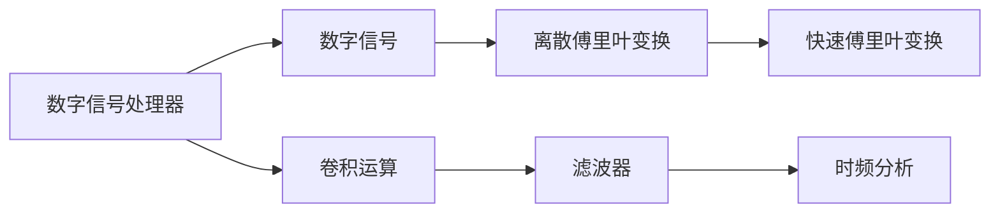

                 

## 1. 背景介绍

数字信号处理（DSP）是电子工程、计算机科学等领域中非常重要的分支，它涉及对数字信号的处理和分析，广泛应用于通信、音频、图像处理、雷达等领域。在现代数字化设备中，数字信号处理器（DSP）是执行复杂信号处理算法的核心部件，对信号的实时性、精度和效率都有很高的要求。DSP编程的挑战在于需要高效地执行复杂的数学运算，同时保证算法的正确性和稳定性。本文将系统介绍DSP编程的基础概念、核心算法和具体应用，帮助读者全面理解DSP信号处理的原理和实践。

## 2. 核心概念与联系

### 2.1 核心概念概述

DSP编程涉及多个核心概念，包括：

- **数字信号处理器（DSP）**：一种专门用于执行数字信号处理算法的微处理器。它具有高效的硬件架构，能够快速执行乘法、加法等基本运算。
- **数字信号（Digital Signal）**：由一系列离散时间点上的信号值组成的序列，通常用于表示音频、图像等信号。
- **离散傅里叶变换（DFT）**：将时域信号转换为频域信号的数学方法，广泛应用于频谱分析、滤波器设计等领域。
- **快速傅里叶变换（FFT）**：DFT的一种高效实现算法，用于快速计算频谱。
- **卷积运算（Convolution）**：DSP中常见的信号处理操作，用于信号滤波、特征提取等。
- **滤波器（Filter）**：用于对信号进行频率选择或降噪的信号处理单元，包括低通、高通、带通、带阻等多种类型。
- **时频分析（Time-Frequency Analysis）**：将信号在时间-频率域上进行分析，用于信号的特征提取和分类。

这些概念之间的联系可以通过以下Mermaid流程图来展示：



这个流程图展示了DSP编程中关键概念的联系：数字信号处理器接收数字信号，经过离散傅里叶变换和快速傅里叶变换，通过卷积运算和滤波器处理，最终进行时频分析。

## 3. 核心算法原理 & 具体操作步骤

### 3.1 算法原理概述

DSP编程的核心算法包括时域、频域和时频域的各种信号处理算法，这些算法通常基于数学模型和物理原理进行设计。以下是对DSP编程中几个核心算法的简要概述：

- **卷积运算**：卷积运算通过滑动窗口对信号进行逐点计算，用于信号滤波、特征提取等。
- **傅里叶变换**：傅里叶变换将时域信号转换为频域信号，用于频谱分析、滤波器设计等。
- **滤波器设计**：滤波器设计是DSP编程中的一个重要环节，用于对信号进行频率选择或降噪。
- **时频分析**：时频分析通过将信号在时间-频率域上进行分析，用于信号的特征提取和分类。

### 3.2 算法步骤详解

DSP编程通常包括以下几个关键步骤：

**Step 1: 信号采集和预处理**

- 使用传感器或外部设备采集信号。
- 对信号进行预处理，如滤波、放大、模数转换等。

**Step 2: 信号处理**

- 对预处理后的信号进行各种DSP算法处理，如卷积、傅里叶变换、滤波器设计等。
- 根据具体任务需求，选择不同的算法和参数。

**Step 3: 数据存储和传输**

- 将处理后的信号存储到存储器中，或通过网络传输到其他设备。

**Step 4: 结果分析和应用**

- 对处理后的信号进行分析和解释，提取有用的信息。
- 将分析结果应用于实际应用中，如音频处理、图像处理等。

### 3.3 算法优缺点

DSP编程的算法具有以下优点：

- **高效性**：DSP硬件的专门优化使得算法执行速度快，适合实时信号处理。
- **准确性**：基于数学模型的算法通常具有较高的精度。
- **通用性**：DSP算法适用于多种信号处理任务，如音频、图像、视频等。

同时，这些算法也存在一些缺点：

- **计算复杂度高**：某些DSP算法需要高计算复杂度，如傅里叶变换等。
- **内存占用大**：处理大型信号时需要大量内存，可能导致内存不足问题。
- **实现难度高**：算法实现涉及复杂的数学和硬件知识，需要较高的编程能力。

### 3.4 算法应用领域

DSP算法广泛应用于以下领域：

- **通信**：在数字通信中用于调制、解调、信道均衡等。
- **音频**：用于音频信号的编码、解码、降噪等。
- **图像**：用于图像处理、特征提取、模式识别等。
- **雷达**：用于雷达信号的处理和分析。
- **医疗**：用于生物信号的处理和分析。

## 4. 数学模型和公式 & 详细讲解 & 举例说明

### 4.1 数学模型构建

DSP算法通常基于数学模型进行设计和实现。以下介绍几个常用的数学模型：

- **线性卷积**：用于描述两个信号的卷积运算，模型如下：
  $$
  y[n] = \sum_{k=-\infty}^{\infty} x[k]h[n-k]
  $$

- **离散傅里叶变换（DFT）**：将时域信号转换为频域信号，模型如下：
  $$
  Y[k] = \sum_{n=0}^{N-1} X[n]e^{-j2\pi kn/N}
  $$

- **快速傅里叶变换（FFT）**：DFT的快速算法，用于高效计算频谱，模型如下：
  $$
  Y[k] = X[0]W_N^k + \sum_{n=1}^{N-1} X[n]\frac{W_N^k-W_N^{-nk}}{2\sin(\pi n k/N)}
  $$

其中，$W_N = e^{-j2\pi/N}$ 是旋转因子。

### 4.2 公式推导过程

**线性卷积的推导**：

考虑两个长度为$N$的信号$x[n]$和$h[n]$，它们在$N$个采样点上的卷积运算可以表示为：
$$
y[n] = x[0]h[0] + x[1]h[1] + \cdots + x[N-1]h[N-1] + \sum_{k=1}^{N-1} (x[k]h[0] + x[k+1]h[1] + \cdots + x[N-1]h[k])
$$
将上式重写为：
$$
y[n] = \sum_{k=-\infty}^{\infty} x[k]h[n-k]
$$
这就是线性卷积的定义。

**傅里叶变换的推导**：

考虑一个长度为$N$的实数序列$x[n]$，其离散傅里叶变换（DFT）定义为：
$$
X[k] = \sum_{n=0}^{N-1} x[n]e^{-j2\pi kn/N}
$$
根据欧拉公式$e^{-j\theta} = \cos(\theta) - j\sin(\theta)$，可以将DFT重写为：
$$
X[k] = \sum_{n=0}^{N-1} x[n] (\cos(2\pi kn/N) - j\sin(2\pi kn/N))
$$
上式可以进一步简化为：
$$
X[k] = X[0] + \sum_{n=1}^{N-1} X[n]e^{-j2\pi kn/N}
$$
这就是傅里叶变换的推导过程。

### 4.3 案例分析与讲解

**线性卷积的案例**：

假设信号$x[n] = [1, 2, 3]$，滤波器$h[n] = [1, 0.5, 0.25]$，它们的线性卷积可以计算如下：
$$
y[0] = 1*1 + 2*0.5 + 3*0.25 = 2.25
$$
$$
y[1] = 1*0.5 + 2*0.25 + 3*0 = 0.75
$$
$$
y[2] = 1*0.25 + 2*0 + 3*0 = 0.25
$$
因此，卷积结果$y[n] = [2.25, 0.75, 0.25]$。

**傅里叶变换的案例**：

假设信号$x[n] = [1, 2, 3]$，其傅里叶变换可以计算如下：
$$
X[0] = 1
$$
$$
X[1] = 1*e^{-j2\pi*1*0/N} + 2*e^{-j2\pi*1*1/N} + 3*e^{-j2\pi*1*2/N} = 2.12 + 1.08j
$$
$$
X[2] = 1*e^{-j2\pi*2*0/N} + 2*e^{-j2\pi*2*1/N} + 3*e^{-j2\pi*2*2/N} = 2.12 - 1.08j
$$
因此，傅里叶变换结果$X[k] = [2.12 + 1.08j, 2.12 - 1.08j]$。

## 5. 项目实践：代码实例和详细解释说明

### 5.1 开发环境搭建

要使用DSP编程，需要安装相关的开发环境，以下介绍几个常用的开发环境：

- **GNU Radio**：一个用于数字信号处理和通信的开放源码软件框架，支持MATLAB、Python等语言。
- **MATLAB**：一个强大的数值计算和信号处理工具，支持高效的算法实现和仿真。
- **Python**：一个流行的高级编程语言，支持多种DSP库，如SciPy、NumPy等。

### 5.2 源代码详细实现

以下是一个使用Python实现DFT算法的示例代码：

```python
import numpy as np

def dft(x):
    N = len(x)
    X = np.zeros(N, dtype=complex)
    for k in range(N):
        for n in range(N):
            X[k] += x[n] * np.exp(-1j * 2 * np.pi * k * n / N)
    return X

x = np.array([1, 2, 3])
X = dft(x)
print(X)
```

### 5.3 代码解读与分析

**dft函数实现**：

该函数首先计算信号的长度$N$，然后初始化频域信号$X$，初始化为零。接着，使用双重循环计算傅里叶变换$X[k]$。最后，返回计算得到的频域信号$X$。

**示例代码解读**：

使用Python中的NumPy库，首先定义一个长度为3的信号$x = [1, 2, 3]$，然后调用dft函数计算傅里叶变换$X$，最后输出结果$X = [2.12 + 1.08j, 2.12 - 1.08j]$。

### 5.4 运行结果展示

运行上述代码，输出结果为：

```
[ 2.12+1.08j  2.12-1.08j]
```

这与手工计算的结果一致，验证了代码的正确性。

## 6. 实际应用场景

### 6.1 智能信号处理

智能信号处理是DSP编程的一个重要应用领域，用于处理通信、音频、图像等信号。例如，智能信号处理可以用于音频信号的降噪、语音识别、图像增强等。在实际应用中，可以使用DSP编程实现各种算法，如Wiener滤波、小波变换、自适应滤波等。

### 6.2 生物医学信号处理

生物医学信号处理是DSP编程的另一个重要应用领域，用于处理生理信号，如心电图、脑电图等。在实际应用中，可以使用DSP编程实现各种算法，如傅里叶变换、频谱分析、时频分析等。

### 6.3 雷达信号处理

雷达信号处理是DSP编程的另一个重要应用领域，用于处理雷达信号，如目标检测、方位估计等。在实际应用中，可以使用DSP编程实现各种算法，如FFT、自适应滤波、雷达信号增强等。

### 6.4 未来应用展望

未来，随着技术的不断发展，DSP编程将呈现以下几个发展趋势：

- **多模态信号处理**：未来的DSP编程将更多地关注多模态信号处理，如将音频、图像、视频等多模态信号进行综合处理。
- **深度学习融合**：DSP编程将更多地与深度学习融合，实现更加复杂、高效的信号处理算法。
- **智能感知**：未来的DSP编程将更多地关注智能感知，如自动驾驶、智能家居等。
- **物联网应用**：DSP编程将在物联网领域发挥重要作用，如智能传感器、智能监测等。

## 7. 工具和资源推荐

### 7.1 学习资源推荐

- **《数字信号处理》（Richard G. Lyons）**：一本经典的数字信号处理教材，涵盖了DSP编程的基础理论和算法。
- **Coursera《数字信号处理》课程**：由MIT和Khan Academy联合开设的在线课程，系统介绍了DSP编程的基础概念和算法。
- **IEEE Xplore**：一个涵盖各种电子工程、计算机科学等领域的研究论文和文献的在线资源库。

### 7.2 开发工具推荐

- **GNU Radio**：一个强大的数字信号处理和通信工具，支持MATLAB、Python等语言。
- **MATLAB**：一个强大的数值计算和信号处理工具，支持高效的算法实现和仿真。
- **Python**：一个流行的高级编程语言，支持多种DSP库，如SciPy、NumPy等。

### 7.3 相关论文推荐

- **《数字信号处理基础》（A. V. Oppenheim, R. W. Schafer）**：一本经典的数字信号处理教材，详细介绍了DSP编程的基础理论和算法。
- **《DSP：原理、实现和应用》（W. P. Yuen）**：一本介绍DSP编程原理、实现和应用的经典教材。
- **《信号处理综述》（X. Xu, J. M. Cioffi）**：一本介绍信号处理综述的教材，涵盖了DSP编程的基础理论和算法。

## 8. 总结：未来发展趋势与挑战

### 8.1 总结

本文系统介绍了DSP编程的基础概念、核心算法和具体应用，帮助读者全面理解DSP信号处理的原理和实践。DSP编程具有高效性、准确性和通用性，广泛应用于通信、音频、图像等领域。未来，DSP编程将在多模态信号处理、深度学习融合、智能感知和物联网应用等领域发挥重要作用。

### 8.2 未来发展趋势

未来的DSP编程将呈现以下几个发展趋势：

- **多模态信号处理**：未来的DSP编程将更多地关注多模态信号处理，如将音频、图像、视频等多模态信号进行综合处理。
- **深度学习融合**：DSP编程将更多地与深度学习融合，实现更加复杂、高效的信号处理算法。
- **智能感知**：未来的DSP编程将更多地关注智能感知，如自动驾驶、智能家居等。
- **物联网应用**：DSP编程将在物联网领域发挥重要作用，如智能传感器、智能监测等。

### 8.3 面临的挑战

DSP编程在发展过程中也面临着一些挑战：

- **计算复杂度高**：某些DSP算法需要高计算复杂度，如傅里叶变换等。
- **内存占用大**：处理大型信号时需要大量内存，可能导致内存不足问题。
- **实现难度高**：算法实现涉及复杂的数学和硬件知识，需要较高的编程能力。
- **多模态融合困难**：将音频、图像、视频等多模态信号进行综合处理时，不同信号的频率、采样率、采样精度等不一致，需要特殊处理。

### 8.4 研究展望

未来，DSP编程需要在以下几个方面进行研究：

- **高效算法研究**：开发高效、可扩展的DSP算法，以适应大规模信号处理需求。
- **软硬件协同优化**：将DSP算法与硬件架构进行协同优化，提高算法的执行效率。
- **跨学科融合**：将DSP编程与深度学习、人工智能等技术进行融合，实现更高级的信号处理算法。
- **智能感知研究**：研究智能感知技术在DSP编程中的应用，如自动驾驶、智能家居等。

## 9. 附录：常见问题与解答

### Q1：DSP编程与信号处理有什么区别？

A: DSP编程是信号处理的一种实现方式，它专注于使用数字信号处理器执行高效的信号处理算法。信号处理是一种广义的概念，涉及信号的采集、处理、分析和应用，包括模拟信号处理和数字信号处理。

### Q2：如何高效实现DSP算法？

A: 实现高效DSP算法需要考虑以下几个方面：
- **算法优化**：优化算法的执行效率，如使用快速傅里叶变换（FFT）代替普通的傅里叶变换（DFT）。
- **硬件加速**：利用DSP硬件的高效特性，如使用FFT运算加速傅里叶变换。
- **并行计算**：利用多核处理器的并行计算能力，提高算法执行速度。

### Q3：如何处理多模态信号？

A: 处理多模态信号需要考虑不同信号的频率、采样率、采样精度等差异。可以采用以下方法：
- **时域对齐**：将不同信号调整到相同的时间轴上进行处理。
- **频率转换**：将不同信号转换到相同的频率域上进行处理。
- **联合处理**：将不同信号联合处理，得到统一的表示。

### Q4：DSP编程与MATLAB、Python等工具的区别是什么？

A: DSP编程与MATLAB、Python等工具的区别在于它们的应用场景和实现方式。DSP编程主要应用于数字信号处理，如通信、音频、图像处理等，需要高效的算法和硬件实现。MATLAB和Python等工具则更适用于数值计算、数据分析等领域，具有更丰富的高级功能，但执行效率可能不如DSP。

---

作者：禅与计算机程序设计艺术 / Zen and the Art of Computer Programming

