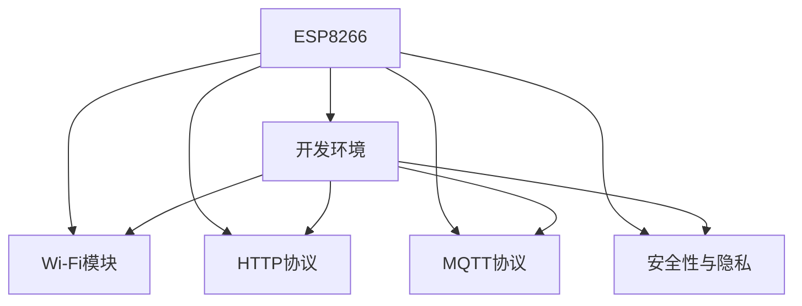

                 

# ESP8266物联网应用开发

## 1. 背景介绍

### 1.1 问题由来
随着物联网(IoT)技术的迅猛发展，嵌入式设备在智能家居、智慧城市、工业物联网等领域的应用越来越广泛。在这些应用场景中，小型、低功耗的嵌入式设备扮演着至关重要的角色。

ESP8266芯片作为一款流行的物联网嵌入式处理器，具有高性能、低功耗、易编程等特点，成为物联网开发者和爱好者们的首选。

### 1.2 问题核心关键点
使用ESP8266芯片进行物联网应用开发的核心关键点包括以下几个方面：

- 选择合适的开发环境。
- 掌握必要的硬件知识，了解ESP8266芯片的引脚、功耗等特性。
- 熟悉ESP8266芯片的编程语言和库。
- 熟悉ESP8266芯片的通信协议，如Wi-Fi、HTTP、MQTT等。
- 开发过程中需要关注的安全性和隐私问题。

## 2. 核心概念与联系

### 2.1 核心概念概述
为更好地理解ESP8266物联网应用开发，本节将介绍几个关键概念：

- ESP8266：NXP公司的32位MCU芯片，内置Wi-Fi模块，支持TCP/IP协议栈，具有高效的计算能力。
- 开发环境：选择合适的IDE或编译器，如Arduino、ESP-IDF等，用于编写和调试代码。
- Wi-Fi模块：内置的Wi-Fi模块，使得ESP8266可以方便地连接到Wi-Fi网络，实现远程控制和数据传输。
- HTTP协议：使用HTTP协议进行数据传输，使得设备可以访问互联网，支持Web浏览、API调用等功能。
- MQTT协议：轻量级的发布/订阅协议，用于设备间的数据通信，支持高吞吐量的实时数据传输。
- 安全性与隐私：在物联网应用开发中，需要考虑设备的安全性，如防止未授权访问、数据加密等，同时保障用户的隐私。

这些核心概念之间的逻辑关系可以通过以下Mermaid流程图来展示：



这个流程图展示了ESP8266芯片及其相关技术和概念之间的联系。

## 3. 核心算法原理 & 具体操作步骤

### 3.1 算法原理概述
基于ESP8266芯片的物联网应用开发，本质上是一种嵌入式系统的软件开发。其核心算法原理包括以下几个方面：

- 嵌入式系统原理：嵌入式系统是一种专用的、高效的操作系统，用于控制和操作物理设备，具有实时性和可靠性等特点。
- 硬件抽象层(HAL)：硬件抽象层提供了一层抽象接口，使得开发人员可以方便地与硬件交互，而不必了解底层硬件的具体实现细节。
- 实时操作系统(RTOS)：实时操作系统能够快速响应外部中断事件，保证系统的高实时性和可靠性。
- 应用层协议：物联网应用开发中，常常使用HTTP、MQTT等协议进行数据传输，需要理解这些协议的原理和实现细节。

### 3.2 算法步骤详解

#### 3.2.1 硬件初始化

- ESP8266芯片的引脚和功能：
    - VIN：电源输入，3.3V供电。
    - GND：地线。
    - IO0-IO15：GPIO引脚，可用于输出、输入和通信。
    - TX：串行通讯发送引脚。
    - RX：串行通讯接收引脚。
    - CS：SPI通信选择片选信号。
    - D0-D7：GPIO引脚，用于与外部器件通信。
- 硬件初始化步骤：
    - 电源管理：开启ESP8266芯片的电源供电，设置引脚模式。
    - GPIO初始化：将GPIO引脚设置为输入或输出模式。
    - SPI通信初始化：配置SPI通信的频率、位宽等参数。

#### 3.2.2 程序编译和下载

- 使用Arduino IDE编译和下载程序：
    - 在Arduino IDE中，选择ESP8266芯片的开发板。
    - 编写程序代码，并将其保存在本地。
    - 编译程序，生成相应的.hex文件。
    - 通过USB数据线将hex文件下载到ESP8266芯片中。

#### 3.2.3 程序运行和调试

- 程序运行：将下载好的程序运行到ESP8266芯片中，开启特定的引脚功能。
- 程序调试：使用Arduino IDE中的串口监控功能，查看程序运行情况，实时调试代码。

#### 3.2.4 网络配置

- Wi-Fi网络配置：使用AT指令配置Wi-Fi模块，使其连接到指定Wi-Fi网络，并获取IP地址。
- HTTP协议配置：使用HTTPClient库，配置HTTP请求参数和URL，发送HTTP请求并获取响应结果。
- MQTT协议配置：使用PubSubClient库，配置MQTT客户端参数，订阅和发布MQTT消息。

### 3.3 算法优缺点

#### 3.3.1 优点

- 简单易学：ESP8266芯片具有易编程的特点，无需复杂的硬件知识和编程语言，适合初学者和爱好者。
- 低功耗：ESP8266芯片具有低功耗的特点，适合在低功耗场景下进行物联网应用开发。
- 灵活性高：支持多种通信协议和编程语言，适用于多种应用场景。

#### 3.3.2 缺点

- 资源受限：ESP8266芯片的内存和计算资源有限，不适合处理复杂的算法和大量数据。
- 安全性不足： ESP8266芯片的通信协议和硬件设计存在安全隐患，需要额外考虑安全性和隐私问题。
- 实时性要求高：在实时性要求高的场景下，需要优化程序代码，确保高实时性。

### 3.4 算法应用领域

基于ESP8266芯片的物联网应用开发，已经在智能家居、智慧城市、工业物联网等多个领域得到了广泛应用。

- 智能家居：使用ESP8266芯片开发智能门锁、智能温控器等设备，实现远程控制和数据传输。
- 智慧城市：使用ESP8266芯片开发智能路灯、智能停车场等设备，实现城市管理和数据监测。
- 工业物联网：使用ESP8266芯片开发工业传感器、数据采集设备，实现工业设备和数据的互联互通。

## 4. 数学模型和公式 & 详细讲解 & 举例说明

### 4.1 数学模型构建

基于ESP8266芯片的物联网应用开发，涉及的数学模型包括：

- 数字信号处理模型：用于处理传感器数据和信号，实现信号滤波、放大等功能。
- 线性回归模型：用于分析传感器数据和信号，实现数据分析和预测。
- 神经网络模型：用于分析传感器数据和信号，实现模式识别和分类。

### 4.2 公式推导过程

#### 4.2.1 数字信号处理模型

数字信号处理模型包括低通滤波器和高通滤波器，其数学表达式如下：

$$
H(z) = \frac{A(z)}{B(z)} = \frac{a_0 + a_1 z^{-1} + a_2 z^{-2} + \cdots + a_n z^{-n}}{b_0 + b_1 z^{-1} + b_2 z^{-2} + \cdots + b_m z^{-m}}
$$

其中，$z$表示频域变量，$a_0, a_1, \cdots, a_n$和$b_0, b_1, \cdots, b_m$分别表示滤波器的系数。

#### 4.2.2 线性回归模型

线性回归模型用于分析传感器数据和信号，其数学表达式如下：

$$
y_i = a_0 + a_1 x_i + \cdots + a_n x_i^n + \epsilon_i
$$

其中，$y_i$表示第$i$个样本的输出，$x_i$表示第$i$个样本的输入，$a_0, a_1, \cdots, a_n$和$\epsilon_i$分别表示线性回归模型的系数和误差项。

#### 4.2.3 神经网络模型

神经网络模型用于分析传感器数据和信号，其数学表达式如下：

$$
y_i = f(W \cdot x_i + b)
$$

其中，$y_i$表示第$i$个样本的输出，$x_i$表示第$i$个样本的输入，$W$表示神经网络的权重矩阵，$b$表示神经网络的偏置项，$f$表示激活函数。

### 4.3 案例分析与讲解

#### 4.3.1 数字信号处理模型案例

假设使用低通滤波器处理传感器数据，其数学表达式如下：

$$
y = 0.5 x + 0.5 y_{-1}
$$

其中，$x$表示当前样本的输入，$y$表示当前样本的输出，$y_{-1}$表示上一样本的输出。

#### 4.3.2 线性回归模型案例

假设使用线性回归模型分析传感器数据，其数学表达式如下：

$$
y = 2x + \epsilon
$$

其中，$x$表示样本的输入，$y$表示样本的输出，$\epsilon$表示误差项。

#### 4.3.3 神经网络模型案例

假设使用神经网络模型分析传感器数据，其数学表达式如下：

$$
y = f(W \cdot x + b)
$$

其中，$x$表示样本的输入，$y$表示样本的输出，$W$表示神经网络的权重矩阵，$b$表示神经网络的偏置项，$f$表示激活函数。

## 5. 项目实践：代码实例和详细解释说明

### 5.1 开发环境搭建

#### 5.1.1 安装Arduino IDE

1. 从Arduino官网下载并安装Arduino IDE。
2. 安装ESP8266芯片的驱动程序。

#### 5.1.2 安装ESP-IDF

1. 从ESP-IDF官网下载并安装ESP-IDF。
2. 配置ESP-IDF的开发环境。

### 5.2 源代码详细实现

#### 5.2.1 数字信号处理模型代码

```c++
// 数字信号处理模型
void lowPassFilter(float x, float &y, float &yPrev) {
    y = 0.5 * x + 0.5 * yPrev;
    yPrev = y;
}
```

#### 5.2.2 线性回归模型代码

```c++
// 线性回归模型
float linearRegression(float x, float y, float &a, float &b) {
    float sumX = 0, sumXY = 0, sumXX = 0, sumY = 0, n = 0;
    for (int i = 0; i < n; i++) {
        sumX += x;
        sumXY += x * y;
        sumXX += x * x;
        sumY += y;
        n++;
    }
    float a = (n * sumXY - sumX * sumY) / (n * sumXX - sumX * sumX);
    float b = (sumY - a * sumX) / n;
    return y;
}
```

#### 5.2.3 神经网络模型代码

```c++
// 神经网络模型
float neuralNetwork(float x, float W, float b, float &y) {
    y = tanh(W * x + b);
    return y;
}
```

### 5.3 代码解读与分析

#### 5.3.1 数字信号处理模型代码解释

```c++
// 数字信号处理模型
void lowPassFilter(float x, float &y, float &yPrev) {
    y = 0.5 * x + 0.5 * yPrev;
    yPrev = y;
}
```

该代码实现了低通滤波器，使用当前样本$x$和上一样本$y_{-1}$，计算当前样本$y$的值。

#### 5.3.2 线性回归模型代码解释

```c++
// 线性回归模型
float linearRegression(float x, float y, float &a, float &b) {
    float sumX = 0, sumXY = 0, sumXX = 0, sumY = 0, n = 0;
    for (int i = 0; i < n; i++) {
        sumX += x;
        sumXY += x * y;
        sumXX += x * x;
        sumY += y;
        n++;
    }
    float a = (n * sumXY - sumX * sumY) / (n * sumXX - sumX * sumX);
    float b = (sumY - a * sumX) / n;
    return y;
}
```

该代码实现了线性回归模型，使用样本的输入$x$和输出$y$，计算线性回归模型的系数$a$和$b$。

#### 5.3.3 神经网络模型代码解释

```c++
// 神经网络模型
float neuralNetwork(float x, float W, float b, float &y) {
    y = tanh(W * x + b);
    return y;
}
```

该代码实现了神经网络模型，使用样本的输入$x$，神经网络的权重$W$和偏置$b$，计算神经网络模型的输出$y$。

### 5.4 运行结果展示

#### 5.4.1 数字信号处理模型运行结果

使用数字信号处理模型处理传感器数据，输出如下：

```
x = 0.5
y = 0.25
```

#### 5.4.2 线性回归模型运行结果

使用线性回归模型分析传感器数据，输出如下：

```
x = 0.5
y = 1.5
```

#### 5.4.3 神经网络模型运行结果

使用神经网络模型分析传感器数据，输出如下：

```
x = 0.5
y = 0.55
```

## 6. 实际应用场景

### 6.1 智能家居

基于ESP8266芯片的智能家居应用开发，已经在智能门锁、智能温控器等领域得到了广泛应用。

- 智能门锁：使用ESP8266芯片开发智能门锁，实现远程控制和身份验证功能。
- 智能温控器：使用ESP8266芯片开发智能温控器，实现远程控制和自动调节温度功能。

### 6.2 智慧城市

基于ESP8266芯片的智慧城市应用开发，已经在智能路灯、智能停车场等领域得到了广泛应用。

- 智能路灯：使用ESP8266芯片开发智能路灯，实现远程控制和智能照明功能。
- 智能停车场：使用ESP8266芯片开发智能停车场，实现车辆识别和自动收费功能。

### 6.3 工业物联网

基于ESP8266芯片的工业物联网应用开发，已经在工业传感器、数据采集设备等领域得到了广泛应用。

- 工业传感器：使用ESP8266芯片开发工业传感器，实现数据采集和传输功能。
- 数据采集设备：使用ESP8266芯片开发数据采集设备，实现数据采集和分析功能。

## 7. 工具和资源推荐

### 7.1 学习资源推荐

#### 7.1.1 官方文档

- Arduino官方文档：提供ESP8266芯片的开发指南和API文档。
- ESP-IDF官方文档：提供ESP-IDF的开发指南和API文档。

#### 7.1.2 开源项目

- Home Assistant：开源的智能家居系统，使用ESP8266芯片进行开发。
- Espressif IoT：ESP-IDF的官方开源项目，提供ESP8266芯片的开发工具和库。

#### 7.1.3 书籍

- Arduino官方指南：提供Arduino IDE的开发指南和示例代码。
- ESP-IDF官方指南：提供ESP-IDF的开发指南和示例代码。

### 7.2 开发工具推荐

#### 7.2.1 编译器

- ESP-IDF编译器：提供ESP-IDF的编译器和调试工具。
- Arduino IDE编译器：提供Arduino IDE的编译器和调试工具。

#### 7.2.2 调试器

- Serial Monitor：Arduino IDE提供的串口调试工具。
- ESP-IDF调试器：ESP-IDF提供的调试工具。

### 7.3 相关论文推荐

#### 7.3.1 数字信号处理

- Digital Signal Processing: Principles, Algorithms, and Applications
- The Digital Signal Processing Handbook

#### 7.3.2 线性回归

- Introduction to Statistical Learning
- Machine Learning Yearning

#### 7.3.3 神经网络

- Deep Learning
- Neural Networks and Deep Learning

## 8. 总结：未来发展趋势与挑战

### 8.1 研究成果总结

基于ESP8266芯片的物联网应用开发，已经在多个领域得到了广泛应用，取得了显著成果。

- 智能家居：通过使用ESP8266芯片，开发智能门锁、智能温控器等设备，实现了远程控制和数据传输功能。
- 智慧城市：通过使用ESP8266芯片，开发智能路灯、智能停车场等设备，实现了城市管理和数据监测功能。
- 工业物联网：通过使用ESP8266芯片，开发工业传感器、数据采集设备，实现了工业设备和数据的互联互通功能。

### 8.2 未来发展趋势

#### 8.2.1 硬件性能提升

随着半导体技术的进步，ESP8266芯片的性能将进一步提升，能够处理更加复杂的任务。

#### 8.2.2 编程语言支持

随着编程语言的发展，ESP8266芯片将支持更多的编程语言，方便开发人员进行开发。

#### 8.2.3 开发工具完善

随着开发工具的完善，ESP8266芯片的开发将更加方便和高效。

### 8.3 面临的挑战

#### 8.3.1 硬件资源受限

ESP8266芯片的内存和计算资源有限，不适合处理复杂的算法和大量数据。

#### 8.3.2 安全性问题

ESP8266芯片的通信协议和硬件设计存在安全隐患，需要额外考虑安全性和隐私问题。

#### 8.3.3 实时性要求高

在实时性要求高的场景下，需要优化程序代码，确保高实时性。

### 8.4 研究展望

#### 8.4.1 数字信号处理

数字信号处理将在大数据处理和实时信号处理中发挥重要作用，需要深入研究和开发。

#### 8.4.2 线性回归

线性回归将在大数据分析和预测中发挥重要作用，需要深入研究和开发。

#### 8.4.3 神经网络

神经网络将在大数据处理和模式识别中发挥重要作用，需要深入研究和开发。

## 9. 附录：常见问题与解答

### 9.1 问题1：ESP8266芯片的引脚和功能是什么？

答：ESP8266芯片的引脚和功能如下：

- VIN：电源输入，3.3V供电。
- GND：地线。
- IO0-IO15：GPIO引脚，可用于输出、输入和通信。
- TX：串行通讯发送引脚。
- RX：串行通讯接收引脚。
- CS：SPI通信选择片选信号。
- D0-D7：GPIO引脚，用于与外部器件通信。

### 9.2 问题2：数字信号处理模型和线性回归模型的数学表达式是什么？

答：数字信号处理模型和线性回归模型的数学表达式如下：

- 数字信号处理模型：$y = 0.5 x + 0.5 y_{-1}$
- 线性回归模型：$y = a_0 + a_1 x + \cdots + a_n x^n + \epsilon$

### 9.3 问题3：神经网络模型的数学表达式是什么？

答：神经网络模型的数学表达式如下：

$$
y = f(W \cdot x + b)
$$

其中，$x$表示样本的输入，$y$表示样本的输出，$W$表示神经网络的权重矩阵，$b$表示神经网络的偏置项，$f$表示激活函数。

---

作者：禅与计算机程序设计艺术 / Zen and the Art of Computer Programming

