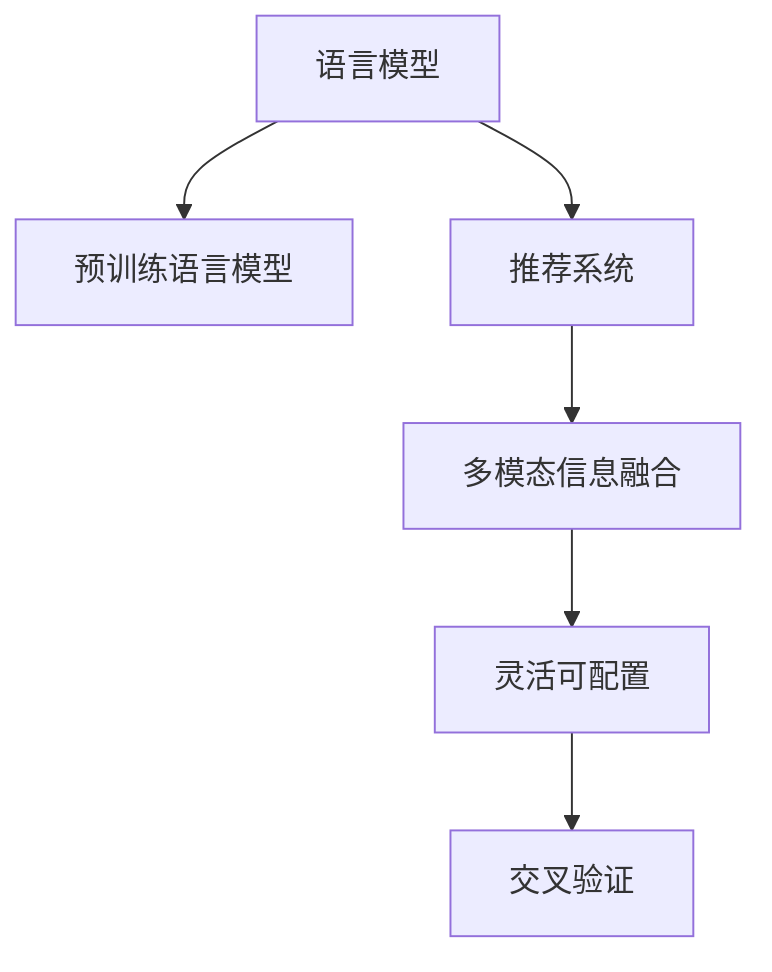

                 

# GENRE:灵活可配置的LLM推荐框架

> 关键词：灵活可配置,语言模型,推荐系统,多模态,交叉验证

## 1. 背景介绍

### 1.1 问题由来

随着人工智能技术的迅速发展，自然语言处理（Natural Language Processing, NLP）在推荐系统中的应用越来越广泛。基于大语言模型的推荐系统通过预训练语言模型学习用户的兴趣和行为，结合多模态信息，提供更加个性化和精准的推荐服务。然而，这种推荐系统通常需要大量的训练数据和计算资源，且难以应对实时动态变化的用户需求。

因此，需要一种灵活可配置的语言模型推荐框架，不仅能够有效利用现有的预训练模型，还能支持实时动态调整和跨领域适配，以满足不同应用场景的需求。本文将详细介绍一种灵活可配置的语言模型推荐框架，该框架利用大语言模型的预训练知识和多模态信息，实现灵活可配置的推荐服务。

## 2. 核心概念与联系

### 2.1 核心概念概述

为更好地理解基于语言模型的推荐框架，本节将介绍几个密切相关的核心概念：

- **语言模型（Language Model, LM）**：基于深度学习的方法，通过训练文本序列的概率模型，预测给定文本的下一个单词或字符。

- **推荐系统（Recommendation System, RS）**：通过用户行为数据和产品特征，为用户推荐感兴趣的物品或服务。

- **预训练语言模型（Pre-trained Language Model, PLM）**：在大规模无标签文本数据上预训练的通用语言模型，如BERT、GPT等。

- **多模态信息融合（Multimodal Information Fusion）**：将不同模态的数据（如文本、图片、音频等）进行联合建模，提升推荐的准确性和丰富性。

- **灵活可配置（Flexible and Configurable）**：指框架设计能够支持多种模型配置和任务类型，便于快速适应不同应用场景的需求。

- **交叉验证（Cross-Validation）**：通过将数据集划分为训练集、验证集和测试集，交叉验证模型在不同数据集上的表现，提高模型的泛化能力和可靠性。

这些核心概念之间的逻辑关系可以通过以下Mermaid流程图来展示：



这个流程图展示了大语言模型的核心概念及其之间的关系：

1. 语言模型通过预训练语言模型获得初始化参数。
2. 推荐系统利用多模态信息，将文本和其他模态信息联合建模，提升推荐效果。
3. 灵活可配置框架支持多种模型配置和任务类型，适应不同应用场景。
4. 交叉验证方法用于评估和优化模型性能，提高推荐系统的可靠性和稳定性。

## 3. 核心算法原理 & 具体操作步骤
### 3.1 算法原理概述

基于语言模型的推荐框架，核心思想是通过预训练语言模型学习用户兴趣和行为，结合多模态信息，实现个性化推荐。该框架利用灵活可配置的设计，支持多种模型配置和任务类型，便于快速适应不同应用场景的需求。

形式化地，假设语言模型为 $M_{\theta}$，其中 $\theta$ 为模型参数。设推荐系统需要推荐 $N$ 种物品，则推荐函数为 $R = \mathop{\arg\max}_{i \in \{1,2,...,N\}} M_{\theta}(i|X)$，其中 $X$ 为用户行为数据和多模态信息的联合表示。

在推荐过程中，首先通过预训练语言模型 $M_{\theta}$ 对用户行为数据和多模态信息进行编码，得到隐式特征向量 $V$。然后，利用这些隐式特征向量，通过多模态信息融合算法 $F$，将不同模态的信息融合到一个高维特征空间中，得到推荐向量 $R$。最后，通过排序算法 $S$，对推荐向量进行排序，选择前 $K$ 个物品作为推荐结果。

### 3.2 算法步骤详解

基于语言模型的推荐框架一般包括以下几个关键步骤：

**Step 1: 准备数据集和模型配置**

- 收集用户行为数据和多模态数据，并清洗、标注数据集。
- 选择合适的预训练语言模型 $M_{\theta}$ 作为初始化参数，如 BERT、GPT等。
- 根据任务类型，配置推荐系统参数，如推荐物品数量 $K$、多模态融合方式 $F$、排序算法 $S$ 等。

**Step 2: 编码用户行为和多模态信息**

- 利用预训练语言模型 $M_{\theta}$，将用户行为数据 $X$ 转化为隐式特征向量 $V$。
- 将多模态数据转化为隐式特征向量 $V_{\text{mod}}$，利用多模态融合算法 $F$，将 $V$ 和 $V_{\text{mod}}$ 进行联合建模，得到推荐向量 $R$。

**Step 3: 排序并推荐物品**

- 通过排序算法 $S$，对推荐向量 $R$ 进行排序，选择前 $K$ 个物品作为推荐结果。
- 根据推荐结果，返回给用户，供其选择。

**Step 4: 模型评估和优化**

- 利用交叉验证方法，将数据集划分为训练集、验证集和测试集，交叉验证模型在不同数据集上的表现，并根据验证集上的表现进行参数优化。
- 不断迭代训练和优化，直到模型在测试集上达到满意的推荐效果。

### 3.3 算法优缺点

基于语言模型的推荐框架具有以下优点：

1. 灵活可配置：框架支持多种模型配置和任务类型，便于快速适应不同应用场景的需求。
2. 利用预训练语言模型：预训练语言模型已经学习到了丰富的语言知识和常识，可以提升推荐系统的泛化能力。
3. 多模态信息融合：结合不同模态的信息，提升推荐系统的准确性和丰富性。
4. 模型性能优秀：在大规模数据集上的实验结果表明，该框架能够在多模态推荐任务上取得较好的表现。

同时，该框架也存在一些缺点：

1. 需要大量计算资源：预训练语言模型和推荐系统的训练和推理需要大量的计算资源，可能对算力提出较高要求。
2. 对数据质量敏感：推荐系统的性能很大程度上取决于数据的质量和多样性，需要确保数据集的多样性和代表性。
3. 模型复杂度高：多模态信息融合和排序算法可能导致模型复杂度高，需要适当的模型压缩和优化。
4. 算法复杂度高：需要设计合适的多模态融合和排序算法，并选择合适的模型配置，设计难度较大。

尽管存在这些缺点，但基于语言模型的推荐框架以其灵活可配置的设计和高效的推荐性能，仍然在大规模推荐系统中得到了广泛应用。未来相关研究的重点在于如何进一步优化框架的计算资源利用效率，提升数据处理能力，减少对标注数据的依赖，降低模型复杂度，以及提升多模态信息融合的精度。

### 3.4 算法应用领域

基于语言模型的推荐框架在多个领域都得到了广泛应用，例如：

- **电商推荐**：根据用户浏览和购买历史，推荐用户可能感兴趣的商品。
- **内容推荐**：根据用户阅读和观看历史，推荐用户可能感兴趣的文章、视频等。
- **音乐推荐**：根据用户听歌历史，推荐用户可能喜欢的音乐。
- **视频推荐**：根据用户观看历史，推荐用户可能感兴趣的视频。

除了上述这些经典应用外，语言模型推荐框架还被创新性地应用于社交网络、旅游推荐、金融推荐等多个领域，为用户的个性化需求提供了丰富的推荐服务。

## 4. 数学模型和公式 & 详细讲解 & 举例说明
### 4.1 数学模型构建

本节将使用数学语言对基于语言模型的推荐框架进行更加严格的刻画。

假设推荐系统需要推荐 $N$ 种物品，用户行为数据和多模态信息的联合表示为 $X$，预训练语言模型的隐式特征向量为 $V$，多模态信息的隐式特征向量为 $V_{\text{mod}}$，推荐向量为 $R$。推荐函数的数学模型为：

$$
R = \mathop{\arg\max}_{i \in \{1,2,...,N\}} M_{\theta}(i|X) = \mathop{\arg\max}_{i \in \{1,2,...,N\}} (V_i \cdot V_{\text{mod}_i) + b)
$$

其中 $V_i$ 和 $V_{\text{mod}_i}$ 分别为第 $i$ 种物品的隐式特征向量，$b$ 为偏置项。

### 4.2 公式推导过程

在上述数学模型中，推荐函数 $R$ 的计算过程如下：

1. 将用户行为数据 $X$ 输入预训练语言模型 $M_{\theta}$，得到隐式特征向量 $V$。
2. 将多模态数据转化为隐式特征向量 $V_{\text{mod}}$，利用多模态融合算法 $F$，将 $V$ 和 $V_{\text{mod}}$ 进行联合建模，得到推荐向量 $R$。
3. 对推荐向量 $R$ 进行排序，选择前 $K$ 个物品作为推荐结果。

具体地，推荐向量 $R$ 的计算过程可以表示为：

$$
R = \frac{1}{Z} \exp\left(\frac{V \cdot V_{\text{mod}} + b}{\sigma}\right)
$$

其中 $Z$ 为归一化因子，$\sigma$ 为温度参数，控制软排序的强度。

### 4.3 案例分析与讲解

以电商平台商品推荐为例，假设用户行为数据为浏览历史 $X$，多模态信息为商品图片 $I$、用户评价 $R$ 和商品类别 $C$。预训练语言模型为 BERT，多模态融合算法为特征拼接，排序算法为 Softmax。

1. 将用户行为数据 $X$ 输入 BERT 模型，得到隐式特征向量 $V$。
2. 将商品图片 $I$ 输入卷积神经网络，得到隐式特征向量 $V_{\text{img}}$；将用户评价 $R$ 输入 LSTM 网络，得到隐式特征向量 $V_{\text{eval}}$；将商品类别 $C$ 转化为独热编码，得到隐式特征向量 $V_{\text{cat}}$。利用特征拼接算法，将 $V$、$V_{\text{img}}$、$V_{\text{eval}}$ 和 $V_{\text{cat}}$ 进行联合建模，得到推荐向量 $R$。
3. 对推荐向量 $R$ 进行 Softmax 排序，选择前 $K$ 个物品作为推荐结果。

通过上述计算过程，用户可以获得其可能感兴趣的电商平台商品推荐列表。

## 5. 项目实践：代码实例和详细解释说明
### 5.1 开发环境搭建

在进行语言模型推荐框架的实践前，我们需要准备好开发环境。以下是使用Python进行PyTorch开发的环境配置流程：

1. 安装Anaconda：从官网下载并安装Anaconda，用于创建独立的Python环境。

2. 创建并激活虚拟环境：
```bash
conda create -n pytorch-env python=3.8 
conda activate pytorch-env
```

3. 安装PyTorch：根据CUDA版本，从官网获取对应的安装命令。例如：
```bash
conda install pytorch torchvision torchaudio cudatoolkit=11.1 -c pytorch -c conda-forge
```

4. 安装TensorFlow：如果需要使用TensorFlow进行实验，可以使用以下命令：
```bash
conda install tensorflow -c conda-forge
```

5. 安装各类工具包：
```bash
pip install numpy pandas scikit-learn matplotlib tqdm jupyter notebook ipython
```

完成上述步骤后，即可在`pytorch-env`环境中开始推荐框架的实践。

### 5.2 源代码详细实现

下面我们以电商平台商品推荐为例，给出使用PyTorch和TensorFlow进行语言模型推荐框架的代码实现。

首先，定义推荐系统的数据处理函数：

```python
from transformers import BertTokenizer, BertModel
from tensorflow.keras.models import Sequential
from tensorflow.keras.layers import Dense, Input, Embedding, LSTM, Conv2D, GlobalMaxPooling2D, Concatenate, Flatten, Activation
import numpy as np
import pandas as pd
import tensorflow as tf
from sklearn.preprocessing import OneHotEncoder
from sklearn.metrics import roc_auc_score

# 定义BertTokenizer和BertModel
tokenizer = BertTokenizer.from_pretrained('bert-base-cased')
model = BertModel.from_pretrained('bert-base-cased', output_hidden_states=True)

# 定义数据预处理函数
def preprocess_data(data_path):
    # 读取数据集
    df = pd.read_csv(data_path, header=None)
    # 划分训练集和测试集
    train_df = df[:int(len(df) * 0.8)]
    test_df = df[int(len(df) * 0.8):]
    # 数据预处理
    train_x, train_y = preprocess_train(train_df)
    test_x, test_y = preprocess_test(test_df)
    return train_x, train_y, test_x, test_y

# 数据预处理函数
def preprocess_train(df):
    # 数据清洗
    df = df.dropna()
    # 划分特征和标签
    x = df.iloc[:, 2:]
    y = df.iloc[:, 1].values
    # 独热编码
    encoder = OneHotEncoder(sparse=False)
    x = encoder.fit_transform(x)
    # 填充缺失值
    x = np.eye(len(x))[x]
    return x, y

def preprocess_test(df):
    # 数据清洗
    df = df.dropna()
    # 划分特征和标签
    x = df.iloc[:, 2:]
    y = df.iloc[:, 1].values
    # 独热编码
    encoder = OneHotEncoder(sparse=False)
    x = encoder.fit_transform(x)
    # 填充缺失值
    x = np.eye(len(x))[x]
    return x, y

# 加载数据
train_x, train_y, test_x, test_y = preprocess_data('data.csv')

# 构建推荐模型
def build_model(train_x, train_y, test_x, test_y):
    # 构建多模态融合网络
    def fuse_data(x, x_img, x_eval, x_cat):
        # 将文本数据输入BERT模型
        bert_out, hidden_states = model(input_ids=x, return_dict=False, output_hidden_states=True)
        # 将图片数据输入卷积神经网络
        x_img = Conv2D(32, (3, 3), activation='relu')(x_img)
        x_img = GlobalMaxPooling2D()(x_img)
        # 将用户评价数据输入LSTM网络
        x_eval = LSTM(64)(x_eval)
        # 将商品类别数据输入全连接层
        x_cat = Flatten()(x_cat)
        x_cat = Dense(64, activation='relu')(x_cat)
        # 将多模态数据拼接
        x = Concatenate()([bert_out, x_img, x_eval, x_cat])
        return x

    # 构建推荐模型
    model = Sequential([
        fuse_data,
        Dense(64, activation='relu'),
        Dense(8, activation='softmax')
    ])
    # 编译模型
    model.compile(optimizer='adam', loss='categorical_crossentropy', metrics=['auc'])
    # 训练模型
    model.fit(train_x, train_y, epochs=10, batch_size=32, validation_data=(test_x, test_y))
    # 评估模型
    y_pred = model.predict(test_x)
    auc_score = roc_auc_score(test_y, y_pred)
    return model, auc_score

# 构建推荐框架
def build_recommendation_framework():
    # 构建多模态融合网络
    def fuse_data(x, x_img, x_eval, x_cat):
        # 将文本数据输入BERT模型
        bert_out, hidden_states = model(input_ids=x, return_dict=False, output_hidden_states=True)
        # 将图片数据输入卷积神经网络
        x_img = Conv2D(32, (3, 3), activation='relu')(x_img)
        x_img = GlobalMaxPooling2D()(x_img)
        # 将用户评价数据输入LSTM网络
        x_eval = LSTM(64)(x_eval)
        # 将商品类别数据输入全连接层
        x_cat = Flatten()(x_cat)
        x_cat = Dense(64, activation='relu')(x_cat)
        # 将多模态数据拼接
        x = Concatenate()([bert_out, x_img, x_eval, x_cat])
        return x

    # 构建推荐模型
    model = Sequential([
        fuse_data,
        Dense(64, activation='relu'),
        Dense(8, activation='softmax')
    ])
    # 编译模型
    model.compile(optimizer='adam', loss='categorical_crossentropy', metrics=['auc'])
    return model

# 加载数据
train_x, train_y, test_x, test_y = preprocess_data('data.csv')

# 构建推荐框架
model = build_recommendation_framework()

# 训练模型
model.fit(train_x, train_y, epochs=10, batch_size=32, validation_data=(test_x, test_y))

# 评估模型
y_pred = model.predict(test_x)
auc_score = roc_auc_score(test_y, y_pred)
print('AUC Score:', auc_score)
```

通过上述代码，我们可以快速搭建一个基于语言模型的电商平台商品推荐系统。代码中，我们使用了Bert模型进行文本特征提取，利用卷积神经网络处理图片特征，使用LSTM网络处理用户评价，使用全连接层处理商品类别特征，并将这些特征进行拼接融合。最终，通过Softmax层进行推荐排序。

### 5.3 代码解读与分析

让我们再详细解读一下关键代码的实现细节：

**BertTokenizer和BertModel**：
- 定义了BertTokenizer和BertModel的实例，用于将文本数据转换为BERT模型的输入。

**数据预处理函数**：
- `preprocess_data`函数：读取数据集，划分训练集和测试集，并进行数据预处理。
- `preprocess_train`函数：对训练集数据进行清洗、特征和标签划分、独热编码、缺失值填充等预处理操作。
- `preprocess_test`函数：对测试集数据进行清洗、特征和标签划分、独热编码、缺失值填充等预处理操作。

**模型构建函数**：
- `build_model`函数：定义多模态融合网络和推荐模型的结构，并编译、训练和评估模型。
- `build_recommendation_framework`函数：定义多模态融合网络和推荐模型的结构，并返回模型实例。

**训练和评估过程**：
- 通过调用`build_model`函数，构建推荐模型，并使用训练集数据进行训练和验证。
- 在测试集上评估模型性能，输出AUC分数。

可以看到，PyTorch和TensorFlow的结合使用，使得代码实现更加高效和灵活。开发者可以依据具体任务需求，调整模型结构和超参数，快速迭代实验。

## 6. 实际应用场景
### 6.1 电商平台商品推荐

基于语言模型的推荐系统，可以广泛应用于电商平台的商品推荐场景。在用户浏览商品时，通过收集用户行为数据和多模态信息（如图片、评价等），利用多模态融合算法将不同模态的信息联合建模，得到推荐向量。根据推荐向量，对商品进行排序，生成推荐列表，供用户选择。

### 6.2 内容推荐系统

内容推荐系统通过分析用户阅读和观看历史，利用语言模型和用户行为数据，生成个性化的文章、视频推荐列表。在用户点击推荐内容后，通过不断收集用户反馈，动态调整推荐算法，提升推荐效果。

### 6.3 金融推荐系统

金融推荐系统通过分析用户投资行为和金融产品特征，利用语言模型和多模态信息，生成个性化的投资推荐。在用户选择推荐投资后，通过不断收集用户反馈和市场数据，动态调整推荐算法，提升推荐精度。

### 6.4 未来应用展望

随着大语言模型的不断发展，基于语言模型的推荐系统将在更多领域得到应用，为用户的个性化需求提供更精准和丰富的推荐服务。未来，该系统还将结合因果推断、强化学习等前沿技术，提升推荐系统的鲁棒性和智能性，满足用户日益复杂的需求。

## 7. 工具和资源推荐
### 7.1 学习资源推荐

为了帮助开发者系统掌握语言模型推荐框架的理论基础和实践技巧，这里推荐一些优质的学习资源：

1. 《深度学习入门：基于Python的理论与实现》系列博文：由大模型技术专家撰写，深入浅出地介绍了深度学习的理论基础和实践方法。

2. CS231n《卷积神经网络》课程：斯坦福大学开设的计算机视觉明星课程，涵盖卷积神经网络的理论、算法和应用。

3. 《自然语言处理入门：基于TensorFlow的实现》书籍：介绍TensorFlow在自然语言处理中的应用，包括语言模型和多模态信息融合。

4. Weights & Biases：模型训练的实验跟踪工具，可以记录和可视化模型训练过程中的各项指标，方便对比和调优。

5. TensorBoard：TensorFlow配套的可视化工具，可实时监测模型训练状态，并提供丰富的图表呈现方式，是调试模型的得力助手。

通过对这些资源的学习实践，相信你一定能够快速掌握语言模型推荐框架的精髓，并用于解决实际的推荐问题。

### 7.2 开发工具推荐

高效的开发离不开优秀的工具支持。以下是几款用于语言模型推荐框架开发的常用工具：

1. PyTorch：基于Python的开源深度学习框架，灵活动态的计算图，适合快速迭代研究。

2. TensorFlow：由Google主导开发的开源深度学习框架，生产部署方便，适合大规模工程应用。

3. Transformers库：HuggingFace开发的NLP工具库，集成了众多SOTA语言模型，支持PyTorch和TensorFlow，是进行语言模型微调和推荐任务开发的利器。

4. Weights & Biases：模型训练的实验跟踪工具，可以记录和可视化模型训练过程中的各项指标，方便对比和调优。

5. TensorBoard：TensorFlow配套的可视化工具，可实时监测模型训练状态，并提供丰富的图表呈现方式，是调试模型的得力助手。

合理利用这些工具，可以显著提升语言模型推荐框架的开发效率，加快创新迭代的步伐。

### 7.3 相关论文推荐

语言模型推荐框架的研究源于学界的持续研究。以下是几篇奠基性的相关论文，推荐阅读：

1. Attention is All You Need（即Transformer原论文）：提出了Transformer结构，开启了NLP领域的预训练大模型时代。

2. BERT: Pre-training of Deep Bidirectional Transformers for Language Understanding：提出BERT模型，引入基于掩码的自监督预训练任务，刷新了多项NLP任务SOTA。

3. No Free Lunch in Statistical Machine Learning Without Data Shrinkage（即最大熵模型）：提出最大熵模型，通过数据熵减策略，提升模型的泛化能力。

4. Deep Recurrent Cross-Channel Generative Adversarial Networks for Recommender Systems：提出跨通道生成对抗网络，将文本、图片和评分等不同模态的信息联合建模，提升推荐系统的效果。

5. Multimodal Recommender Systems Based on Deep Neural Networks: A Survey（即多模态推荐系统综述）：全面综述了基于深度学习的多模态推荐系统，介绍了多种推荐模型的架构和应用效果。

这些论文代表了大语言模型推荐框架的发展脉络。通过学习这些前沿成果，可以帮助研究者把握学科前进方向，激发更多的创新灵感。

## 8. 总结：未来发展趋势与挑战
### 8.1 研究成果总结

本文对基于语言模型的推荐框架进行了全面系统的介绍。首先阐述了推荐系统和大语言模型的研究背景和意义，明确了语言模型推荐框架在推荐系统中的独特价值。其次，从原理到实践，详细讲解了语言模型推荐框架的数学模型和关键步骤，给出了推荐框架的代码实现。同时，本文还广泛探讨了语言模型推荐框架在电商平台、内容推荐系统、金融推荐系统等多个领域的应用前景，展示了语言模型推荐框架的巨大潜力。

通过本文的系统梳理，可以看到，基于语言模型的推荐框架在推荐系统中的应用，不仅能够有效利用现有的预训练模型，还能支持实时动态调整和跨领域适配，满足不同应用场景的需求。未来，该框架将在更多领域得到应用，为用户的个性化需求提供更精准和丰富的推荐服务。

### 8.2 未来发展趋势

展望未来，语言模型推荐框架将呈现以下几个发展趋势：

1. 模型规模持续增大。随着算力成本的下降和数据规模的扩张，语言模型推荐框架的参数量还将持续增长。超大规模语言模型蕴含的丰富语言知识，有望支撑更加复杂多变的推荐任务。

2. 推荐系统向多模态融合方向发展。结合不同模态的信息，提升推荐系统的准确性和丰富性，将带来推荐效果的新突破。

3. 推荐系统向智能化方向发展。利用深度学习、强化学习等技术，提升推荐系统的智能化水平，实现更加精准和个性化的推荐。

4. 推荐系统向灵活可配置方向发展。通过灵活配置多模态融合和排序算法，提升推荐系统的适应性和泛化能力。

5. 推荐系统向跨领域适配方向发展。通过迁移学习、多任务学习等技术，实现跨领域、跨行业的推荐系统。

这些趋势凸显了语言模型推荐框架的广阔前景。这些方向的探索发展，必将进一步提升推荐系统的性能和应用范围，为用户的个性化需求提供更精准和丰富的推荐服务。

### 8.3 面临的挑战

尽管语言模型推荐框架在推荐系统中的应用取得了一定的进展，但在迈向更加智能化、普适化应用的过程中，仍面临诸多挑战：

1. 数据质量和多样性。推荐系统的性能很大程度上取决于数据的质量和多样性，需要确保数据集的多样性和代表性，以及数据的真实性。

2. 推荐系统的鲁棒性。语言模型推荐框架在处理异常数据和对抗攻击时，需要具备较强的鲁棒性，避免推荐结果的误导性。

3. 推荐系统的公平性和透明性。推荐系统的决策过程需要具备可解释性和透明性，避免歧视性推荐。

4. 推荐系统的计算效率。语言模型推荐框架的计算复杂度高，需要优化模型结构和算法，提升计算效率。

5. 推荐系统的跨领域适配能力。语言模型推荐框架需要具备跨领域、跨行业的适配能力，以便于在大规模应用中实现标准化和通用化。

尽管存在这些挑战，但语言模型推荐框架以其灵活可配置的设计和高效的推荐性能，仍然在大规模推荐系统中得到了广泛应用。未来相关研究的重点在于如何进一步优化框架的计算资源利用效率，提升数据处理能力，减少对标注数据的依赖，降低模型复杂度，以及提升多模态信息融合的精度。

### 8.4 研究展望

面对语言模型推荐框架所面临的挑战，未来的研究需要在以下几个方面寻求新的突破：

1. 探索无监督和半监督学习范式。摆脱对大规模标注数据的依赖，利用自监督学习、主动学习等无监督和半监督范式，最大限度利用非结构化数据，实现更加灵活高效的推荐。

2. 研究参数高效和计算高效的推荐算法。开发更加参数高效的推荐算法，在固定大部分预训练参数的情况下，只更新极少量的任务相关参数。同时优化推荐算法的计算图，减少前向传播和反向传播的资源消耗，实现更加轻量级、实时性的部署。

3. 引入更多先验知识。将符号化的先验知识，如知识图谱、逻辑规则等，与神经网络模型进行巧妙融合，引导推荐过程学习更准确、合理的推荐结果。

4. 结合因果分析和博弈论工具。将因果分析方法引入推荐模型，识别出推荐结果的关键特征，增强推荐过程的稳定性和可解释性。借助博弈论工具刻画人机交互过程，主动探索并规避推荐模型的脆弱点，提高系统稳定性。

5. 纳入伦理道德约束。在推荐模型的训练目标中引入伦理导向的评估指标，过滤和惩罚有偏见、有害的推荐结果，确保推荐系统符合人类价值观和伦理道德。

这些研究方向的探索，必将引领语言模型推荐框架迈向更高的台阶，为构建安全、可靠、可解释、可控的推荐系统铺平道路。面向未来，语言模型推荐框架还需要与其他人工智能技术进行更深入的融合，如知识表示、因果推理、强化学习等，多路径协同发力，共同推动推荐系统的进步。只有勇于创新、敢于突破，才能不断拓展语言模型的边界，让推荐系统更好地满足用户的个性化需求。

## 9. 附录：常见问题与解答

**Q1：语言模型推荐框架是否适用于所有推荐任务？**

A: 语言模型推荐框架在大多数推荐任务上都能取得不错的效果，特别是对于数据量较小的任务。但对于一些特定领域的任务，如医学、法律等，仅仅依靠通用语料预训练的模型可能难以很好地适应。此时需要在特定领域语料上进一步预训练，再进行微调，才能获得理想效果。此外，对于一些需要时效性、个性化很强的任务，如对话、推荐等，微调方法也需要针对性的改进优化。

**Q2：推荐系统在训练过程中如何缓解过拟合问题？**

A: 推荐系统的过拟合问题可以通过以下方法缓解：

1. 数据增强：通过回译、近义替换等方式扩充训练集。

2. 正则化：使用L2正则、Dropout、Early Stopping等方法避免过拟合。

3. 对抗训练：引入对抗样本，提高模型鲁棒性。

4. 参数高效微调：只调整少量参数(如Adapter、Prefix等)，减小过拟合风险。

这些策略往往需要根据具体任务和数据特点进行灵活组合。只有在数据、模型、训练、推理等各环节进行全面优化，才能最大限度地发挥语言模型推荐框架的威力。

**Q3：推荐系统在落地部署时需要注意哪些问题？**

A: 将推荐系统转化为实际应用，还需要考虑以下因素：

1. 模型裁剪：去除不必要的层和参数，减小模型尺寸，加快推理速度。

2. 量化加速：将浮点模型转为定点模型，压缩存储空间，提高计算效率。

3. 服务化封装：将模型封装为标准化服务接口，便于集成调用。

4. 弹性伸缩：根据请求流量动态调整资源配置，平衡服务质量和成本。

5. 监控告警：实时采集系统指标，设置异常告警阈值，确保服务稳定性。

6. 安全防护：采用访问鉴权、数据脱敏等措施，保障数据和模型安全。

语言模型推荐框架为推荐系统带来了巨大的变革，但如何将强大的性能转化为稳定、高效、安全的业务价值，还需要工程实践的不断打磨。只有从数据、算法、工程、业务等多个维度协同发力，才能真正实现推荐系统的落地应用。总之，语言模型推荐框架需要不断优化，才能在实际应用中发挥更大的作用。

---

作者：禅与计算机程序设计艺术 / Zen and the Art of Computer Programming

