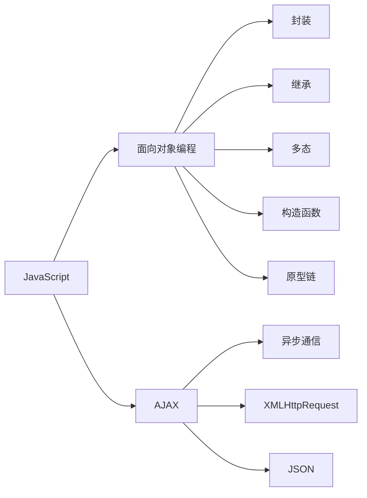

                 

# JavaScript 高级主题：面向对象编程和 AJAX

## 1. 背景介绍

JavaScript（JS）作为一门广泛使用的脚本语言，长期以来一直居于Web前端开发的核心地位。其支持面向对象编程（Object-Oriented Programming, OOP）的特性，使得开发者能够更高效、更灵活地构建复杂的Web应用。与此同时，AJAX（Asynchronous JavaScript and XML）技术的诞生，极大地提升了Web应用的交互性和用户体验，成为了Web前端开发的一项重要工具。

本文将系统地介绍面向对象编程和AJAX的高级主题，包括对象的生命周期管理、继承与多态、事件驱动模型、异步编程等核心概念，并结合实际项目案例，展示如何巧妙利用这些技术构建高效、响应式的Web应用。通过深入理解这些内容，你不仅能提升JavaScript编程技巧，还能在实际开发中运用自如，提高开发效率和应用性能。

## 2. 核心概念与联系

### 2.1 核心概念概述

在深入探讨面向对象编程和AJAX之前，我们先来梳理一下相关的核心概念及其联系。

#### 面向对象编程

- **封装**：将数据和方法包装在一起，形成独立、封闭的对象，减少外部对对象的直接操作，提高代码的模块化和安全性。
- **继承**：通过继承现有类，创建新的子类，继承父类的属性和方法，实现代码复用和扩展。
- **多态**：同一个方法可以在不同的对象上产生不同的行为，增强代码的灵活性和可扩展性。
- **构造函数**：用于创建对象的函数，通常带有“new”关键字，可以通过构造函数创建多个对象实例。
- **原型链**：通过原型继承机制，实现属性和方法的共享和继承。

#### AJAX

- **异步通信**：在不刷新页面的情况下，通过AJAX技术向服务器发送请求和接收响应，实现数据和页面的异步更新。
- **XMLHttpRequest**：内置的XMLHttpRequest对象，提供了与服务器异步通信的核心API。
- **JSON**：作为轻量级的数据交换格式，与AJAX结合使用，提高了数据传输的效率和灵活性。

### 2.2 核心概念原理和架构的 Mermaid 流程图



这个流程图展示了JavaScript中的面向对象编程和AJAX技术之间的联系。封装、继承、多态、构造函数和原型链是面向对象编程的核心概念，而异步通信、XMLHttpRequest和JSON则是AJAX技术的关键组成部分。

## 3. 核心算法原理 & 具体操作步骤

### 3.1 算法原理概述

#### 面向对象编程

面向对象编程的基本原理是通过封装、继承和多态，将复杂的问题分解为更小、更易于管理的对象。每个对象拥有自己的数据和方法，可以独立工作，同时通过继承和多态机制，实现代码复用和扩展。

#### AJAX

AJAX技术的核心原理是利用XMLHttpRequest对象，通过异步通信方式向服务器发送请求和接收响应，从而在不刷新页面的情况下，实现数据的动态更新和交互。AJAX使得Web应用能够更加灵活、响应更快，用户体验更佳。

### 3.2 算法步骤详解

#### 面向对象编程

1. **创建对象**：使用构造函数创建对象实例。
2. **封装属性和方法**：将数据和方法封装在对象中，减少外部直接操作。
3. **继承**：通过继承现有类，创建新的子类，继承父类的属性和方法。
4. **多态**：在子类中重写父类的方法，实现不同行为。
5. **事件驱动模型**：通过事件机制实现对象之间的交互和通信。

#### AJAX

1. **创建XMLHttpRequest对象**：通过new关键字创建XMLHttpRequest对象。
2. **发送请求**：使用open方法和send方法，向服务器发送HTTP请求。
3. **接收响应**：通过onreadystatechange事件处理函数，监听服务器响应。
4. **处理响应数据**：使用responseText或responseXML属性获取响应数据，并进行处理。
5. **更新页面**：通过DOM操作或innerHTML属性，更新Web页面。

### 3.3 算法优缺点

#### 面向对象编程

- **优点**：提高代码复用性和可扩展性，增强代码的可读性和可维护性，支持事件驱动模型。
- **缺点**：可能增加代码复杂度，特别是继承和多态机制，需要良好的设计。

#### AJAX

- **优点**：提升用户体验，减少页面刷新次数，提高Web应用的响应性和交互性。
- **缺点**：需要处理跨域问题，可能影响SEO效果，增加代码复杂度。

### 3.4 算法应用领域

#### 面向对象编程

面向对象编程广泛应用于各种Web应用开发中，如电子商务平台、社交网络、游戏开发等。通过封装、继承和多态机制，开发者能够高效构建复杂的应用系统，实现代码复用和扩展。

#### AJAX

AJAX技术被广泛应用于各种Web应用中，如实时聊天、动态搜索、用户管理系统等。通过异步通信和数据动态更新，Web应用能够实现更加灵活、响应更快的交互方式。

## 4. 数学模型和公式 & 详细讲解 & 举例说明

### 4.1 数学模型构建

#### 面向对象编程

面向对象编程的数学模型可以表示为：

$$
\text{Object} = (\text{Data}, \text{Methods}, \text{Inheritance})
$$

其中，Data表示对象的数据，Methods表示对象的方法，Inheritance表示对象之间的继承关系。

#### AJAX

AJAX的数学模型可以表示为：

$$
\text{AJAX} = (\text{XMLHttpRequest}, \text{HTTP Request}, \text{Response Handling})
$$

其中，XMLHttpRequest表示XMLHttpRequest对象，HTTP Request表示向服务器发送HTTP请求的过程，Response Handling表示接收和处理服务器响应数据的过程。

### 4.2 公式推导过程

#### 面向对象编程

面向对象编程的封装、继承和多态机制可以通过以下公式进行推导：

1. **封装**：
$$
\text{封装} = \text{Data} + \text{Methods} - \text{Public Data} - \text{Public Methods}
$$

2. **继承**：
$$
\text{继承} = \text{Parent Class} + \text{Child Class} - \text{Parent Data} - \text{Parent Methods}
$$

3. **多态**：
$$
\text{多态} = \text{Parent Class} + \text{Child Class} + \text{Subclass Methods} - \text{Parent Methods}
$$

#### AJAX

AJAX的异步通信、XMLHttpRequest和JSON可以通过以下公式进行推导：

1. **异步通信**：
$$
\text{异步通信} = \text{XMLHttpRequest} + \text{HTTP Request} - \text{HTTP Synchronous Request}
$$

2. **XMLHttpRequest**：
$$
\text{XMLHttpRequest} = \text{Open Method} + \text{Send Method} + \text{Onreadystatechange Event}
$$

3. **JSON**：
$$
\text{JSON} = \text{JavaScript Object} + \text{JSON.stringify} - \text{XMLSerializer}
$$

### 4.3 案例分析与讲解

#### 面向对象编程

假设我们正在开发一个用户管理系统，需要实现用户注册和登录功能。可以通过面向对象编程的方式进行实现。

1. **创建User对象**：
```javascript
function User(name, password) {
  this.name = name;
  this.password = password;
  this.login = function() {
    console.log('User logged in.');
  };
}
```

2. **封装属性和方法**：
```javascript
function User(name, password) {
  var _name = name;
  var _password = password;
  
  this.getName = function() {
    return _name;
  };
  
  this.getPassword = function() {
    return _password;
  };
  
  this.login = function() {
    console.log('User logged in.');
  };
}
```

3. **继承**：
```javascript
function Employee(name, password, department) {
  User.call(this, name, password);
  this.department = department;
}
Employee.prototype = Object.create(User.prototype);
Employee.prototype.constructor = Employee;
```

4. **多态**：
```javascript
function Manager(name, password, department) {
  Employee.call(this, name, password, department);
  this.getAllEmployees = function() {
    console.log('All employees in department: ' + this.department);
  };
}
Manager.prototype = Object.create(Employee.prototype);
Manager.prototype.constructor = Manager;
Manager.prototype.getAllEmployees = function() {
  console.log('All employees in department: ' + this.department);
}
```

#### AJAX

假设我们正在开发一个实时聊天应用，需要实现用户在网页上发送消息和接收消息的功能。可以通过AJAX技术进行实现。

1. **创建XMLHttpRequest对象**：
```javascript
var xhr = new XMLHttpRequest();
```

2. **发送请求**：
```javascript
xhr.open('GET', 'http://example.com/messages', true);
xhr.send();
```

3. **接收响应**：
```javascript
xhr.onreadystatechange = function() {
  if (xhr.readyState === XMLHttpRequest.DONE && xhr.status === 200) {
    var messages = JSON.parse(xhr.responseText);
    // 处理响应数据
  }
};
```

4. **更新页面**：
```javascript
var messageBox = document.getElementById('messageBox');
for (var i = 0; i < messages.length; i++) {
  var message = messages[i];
  var messageElement = document.createElement('div');
  messageElement.innerHTML = message.text;
  messageBox.appendChild(messageElement);
}
```

## 5. 项目实践：代码实例和详细解释说明

### 5.1 开发环境搭建

在进行面向对象编程和AJAX实践前，我们需要准备好开发环境。以下是使用JavaScript进行Web开发的环境配置流程：

1. **安装Node.js和npm**：从官网下载并安装Node.js和npm，这是JavaScript的核心开发环境。
2. **创建项目目录**：
```bash
mkdir myproject
cd myproject
```
3. **初始化项目**：
```bash
npm init
```

### 5.2 源代码详细实现

#### 面向对象编程

1. **创建User对象**：
```javascript
function User(name, password) {
  this.name = name;
  this.password = password;
  this.login = function() {
    console.log('User logged in.');
  };
}
```

2. **封装属性和方法**：
```javascript
function User(name, password) {
  var _name = name;
  var _password = password;
  
  this.getName = function() {
    return _name;
  };
  
  this.getPassword = function() {
    return _password;
  };
  
  this.login = function() {
    console.log('User logged in.');
  };
}
```

3. **继承**：
```javascript
function Employee(name, password, department) {
  User.call(this, name, password);
  this.department = department;
}
Employee.prototype = Object.create(User.prototype);
Employee.prototype.constructor = Employee;
```

4. **多态**：
```javascript
function Manager(name, password, department) {
  Employee.call(this, name, password, department);
  this.getAllEmployees = function() {
    console.log('All employees in department: ' + this.department);
  };
}
Manager.prototype = Object.create(Employee.prototype);
Manager.prototype.constructor = Manager;
Manager.prototype.getAllEmployees = function() {
  console.log('All employees in department: ' + this.department);
}
```

#### AJAX

1. **创建XMLHttpRequest对象**：
```javascript
var xhr = new XMLHttpRequest();
```

2. **发送请求**：
```javascript
xhr.open('GET', 'http://example.com/messages', true);
xhr.send();
```

3. **接收响应**：
```javascript
xhr.onreadystatechange = function() {
  if (xhr.readyState === XMLHttpRequest.DONE && xhr.status === 200) {
    var messages = JSON.parse(xhr.responseText);
    // 处理响应数据
  }
};
```

4. **更新页面**：
```javascript
var messageBox = document.getElementById('messageBox');
for (var i = 0; i < messages.length; i++) {
  var message = messages[i];
  var messageElement = document.createElement('div');
  messageElement.innerHTML = message.text;
  messageBox.appendChild(messageElement);
}
```

### 5.3 代码解读与分析

#### 面向对象编程

- **构造函数**：通过构造函数User创建新的用户对象，将属性和方法封装在构造函数内部。
- **封装**：通过var关键字将属性私有化，只暴露公共方法getName和getPassword，增强了数据安全性。
- **继承**：通过继承User对象，创建新的Employee对象，继承了User的属性和方法，同时添加新的属性department。
- **多态**：通过继承Employee对象，创建新的Manager对象，重写了Employee的方法getAllEmployees，实现不同行为。

#### AJAX

- **XMLHttpRequest对象**：通过new关键字创建XMLHttpRequest对象，用于异步通信。
- **异步请求**：使用open方法和send方法，向服务器发送HTTP请求。
- **事件监听**：通过onreadystatechange事件处理函数，监听XMLHttpRequest对象的响应状态，处理响应数据。
- **更新页面**：通过DOM操作，动态更新Web页面，展示接收到的消息。

## 6. 实际应用场景

### 6.1 实时聊天应用

实时聊天应用是AJAX技术的典型应用场景之一。通过AJAX技术，用户可以在网页上实时发送和接收消息，无需刷新页面，提升了用户体验。同时，可以通过面向对象编程的方式，将用户、消息等复杂的数据结构封装在对象中，提高代码的模块化和可维护性。

#### 面向对象编程

1. **创建User对象**：
```javascript
function User(name, password) {
  this.name = name;
  this.password = password;
  this.login = function() {
    console.log('User logged in.');
  };
}
```

2. **封装属性和方法**：
```javascript
function User(name, password) {
  var _name = name;
  var _password = password;
  
  this.getName = function() {
    return _name;
  };
  
  this.getPassword = function() {
    return _password;
  };
  
  this.login = function() {
    console.log('User logged in.');
  };
}
```

3. **继承**：
```javascript
function Employee(name, password, department) {
  User.call(this, name, password);
  this.department = department;
}
Employee.prototype = Object.create(User.prototype);
Employee.prototype.constructor = Employee;
```

4. **多态**：
```javascript
function Manager(name, password, department) {
  Employee.call(this, name, password, department);
  this.getAllEmployees = function() {
    console.log('All employees in department: ' + this.department);
  };
}
Manager.prototype = Object.create(Employee.prototype);
Manager.prototype.constructor = Manager;
Manager.prototype.getAllEmployees = function() {
  console.log('All employees in department: ' + this.department);
}
```

#### AJAX

1. **创建XMLHttpRequest对象**：
```javascript
var xhr = new XMLHttpRequest();
```

2. **发送请求**：
```javascript
xhr.open('GET', 'http://example.com/messages', true);
xhr.send();
```

3. **接收响应**：
```javascript
xhr.onreadystatechange = function() {
  if (xhr.readyState === XMLHttpRequest.DONE && xhr.status === 200) {
    var messages = JSON.parse(xhr.responseText);
    // 处理响应数据
  }
};
```

4. **更新页面**：
```javascript
var messageBox = document.getElementById('messageBox');
for (var i = 0; i < messages.length; i++) {
  var message = messages[i];
  var messageElement = document.createElement('div');
  messageElement.innerHTML = message.text;
  messageBox.appendChild(messageElement);
}
```

### 6.2 动态搜索功能

动态搜索功能是AJAX技术的另一重要应用。通过AJAX技术，用户可以在网页上实时输入查询条件，并动态更新搜索结果，无需刷新页面。同时，可以通过面向对象编程的方式，将搜索逻辑封装在对象中，提高代码的可维护性和可扩展性。

#### 面向对象编程

1. **创建Search对象**：
```javascript
function Search(query, options) {
  this.query = query;
  this.options = options;
  this.execute = function() {
    console.log('Executing search with query: ' + this.query);
  };
}
```

2. **封装属性和方法**：
```javascript
function Search(query, options) {
  var _query = query;
  var _options = options;
  
  this.getQuery = function() {
    return _query;
  };
  
  this.getOptions = function() {
    return _options;
  };
  
  this.execute = function() {
    console.log('Executing search with query: ' + this.query);
  };
}
```

3. **继承**：
```javascript
function AutoCompleteSearch(query, options) {
  Search.call(this, query, options);
}
AutoCompleteSearch.prototype = Object.create(Search.prototype);
AutoCompleteSearch.prototype.constructor = AutoCompleteSearch;
```

4. **多态**：
```javascript
function SuggestSearch(query, options) {
  Search.call(this, query, options);
  this.execute = function() {
    console.log('Suggesting search results with query: ' + this.query);
  };
}
SuggestSearch.prototype = Object.create(Search.prototype);
SuggestSearch.prototype.constructor = SuggestSearch;
SuggestSearch.prototype.execute = function() {
  console.log('Suggesting search results with query: ' + this.query);
}
```

#### AJAX

1. **创建XMLHttpRequest对象**：
```javascript
var xhr = new XMLHttpRequest();
```

2. **发送请求**：
```javascript
xhr.open('GET', 'http://example.com/search?q=' + query, true);
xhr.send();
```

3. **接收响应**：
```javascript
xhr.onreadystatechange = function() {
  if (xhr.readyState === XMLHttpRequest.DONE && xhr.status === 200) {
    var results = JSON.parse(xhr.responseText);
    // 处理响应数据
  }
};
```

4. **更新页面**：
```javascript
var searchBox = document.getElementById('searchBox');
searchBox.innerHTML = results.join(', ');
```

### 6.3 购物车功能

购物车功能是面向对象编程的典型应用场景之一。通过面向对象编程的方式，将购物车、商品等复杂的数据结构封装在对象中，提高代码的模块化和可维护性。

#### 面向对象编程

1. **创建Cart对象**：
```javascript
function Cart() {
  this.items = [];
  this.addItem = function(item) {
    this.items.push(item);
    console.log('Item added to cart: ' + item.name);
  };
}
```

2. **封装属性和方法**：
```javascript
function Cart() {
  var _items = [];
  
  this.getItems = function() {
    return _items;
  };
  
  this.addItem = function(item) {
    _items.push(item);
    console.log('Item added to cart: ' + item.name);
  };
}
```

3. **继承**：
```javascript
function ShoppingCart() {
  Cart.call(this);
}
ShoppingCart.prototype = Object.create(Cart.prototype);
ShoppingCart.prototype.constructor = ShoppingCart;
```

4. **多态**：
```javascript
function ElectronicsCart() {
  ShoppingCart.call(this);
  this.addItem = function(item) {
    if (item.type === 'electronics') {
      this.items.push(item);
      console.log('Electronics item added to cart: ' + item.name);
    }
  };
}
ElectronicsCart.prototype = Object.create(ShoppingCart.prototype);
ElectronicsCart.prototype.constructor = ElectronicsCart;
ElectronicsCart.prototype.addItem = function(item) {
  if (item.type === 'electronics') {
    this.items.push(item);
    console.log('Electronics item added to cart: ' + item.name);
  }
}
```

#### AJAX

1. **创建XMLHttpRequest对象**：
```javascript
var xhr = new XMLHttpRequest();
```

2. **发送请求**：
```javascript
xhr.open('GET', 'http://example.com/cart', true);
xhr.send();
```

3. **接收响应**：
```javascript
xhr.onreadystatechange = function() {
  if (xhr.readyState === XMLHttpRequest.DONE && xhr.status === 200) {
    var cartItems = JSON.parse(xhr.responseText);
    // 处理响应数据
  }
};
```

4. **更新页面**：
```javascript
var cartBox = document.getElementById('cartBox');
for (var i = 0; i < cartItems.length; i++) {
  var item = cartItems[i];
  var itemElement = document.createElement('div');
  itemElement.innerHTML = item.name + ': ' + item.price;
  cartBox.appendChild(itemElement);
}
```

## 7. 工具和资源推荐

### 7.1 学习资源推荐

为了帮助开发者深入理解面向对象编程和AJAX技术，以下是一些优质的学习资源：

1. **JavaScript高级教程**：《JavaScript高级教程》是一本经典之作，系统介绍了JavaScript的面向对象编程、AJAX、DOM、事件等内容，适合初学者和进阶开发者阅读。

2. **ES6标准规范**：ES6标准规范详细介绍了JavaScript ES6版本的最新特性，如类、模块、箭头函数等，对于理解现代JavaScript编程模式非常有帮助。

3. **Udemy《JavaScript高级编程》课程**：这是一门深入浅出的JavaScript高级编程课程，涵盖了面向对象编程、AJAX、设计模式、性能优化等内容，适合有一定基础的开发者。

4. **MDN Web Docs**：Mozilla开发者网络提供了全面的JavaScript和Web开发文档，包括面向对象编程、AJAX、DOM、事件等技术，是开发者学习的好帮手。

5. **《JavaScript设计模式》书籍**：这本书详细介绍了JavaScript设计模式，包括单例模式、观察者模式、装饰器模式等，对于编写高质量、可维护的代码非常有帮助。

### 7.2 开发工具推荐

为了提高JavaScript开发效率，以下是一些常用的开发工具：

1. **Visual Studio Code**：一款功能强大的文本编辑器，支持JavaScript和Node.js开发，集成了丰富的插件和扩展。

2. **WebStorm**：一款专业的JavaScript开发工具，提供智能代码提示、代码导航、调试等功能，适合开发大型Web应用。

3. **Node.js和npm**：Node.js是JavaScript的服务器端运行环境，npm是JavaScript的包管理工具，提供了大量第三方库和框架，方便开发和部署。

4. **Chrome DevTools**：Chrome浏览器自带的开发工具，提供了调试、性能分析、网络监控等功能，适合开发和优化Web应用。

5. **Postman**：一款流行的API测试工具，支持HTTP请求、断言、测试用例等，适合测试和调试API接口。

### 7.3 相关论文推荐

面向对象编程和AJAX技术的研究论文很多，以下是几篇具有代表性的论文，推荐阅读：

1. **“Object-Oriented Programming” by Alan Kay**：这篇论文是面向对象编程的奠基之作，详细介绍了面向对象编程的设计思想和实现方法。

2. **“Asynchronous JavaScript and XML (AJAX)” by David Flanagan**：这篇论文是AJAX技术的奠基之作，详细介绍了AJAX技术的原理和实现方法。

3. **“JavaScript: The Definitive Guide” by David Flanagan**：这本书详细介绍了JavaScript语言的各种特性和最佳实践，包括面向对象编程和AJAX等技术。

4. **“Design Patterns” by Erich Gamma et al.**：这本书详细介绍了23种经典的设计模式，包括单例模式、观察者模式、装饰器模式等，对于理解JavaScript设计模式非常有帮助。

## 8. 总结：未来发展趋势与挑战

### 8.1 研究成果总结

本文系统地介绍了JavaScript的面向对象编程和AJAX技术，涵盖核心概念、算法原理和实践应用。通过深入分析这些技术在实际项目中的应用，展示了其强大的功能和灵活性。

### 8.2 未来发展趋势

JavaScript的面向对象编程和AJAX技术将继续快速发展，未来的趋势包括：

1. **TypeScript**：TypeScript是JavaScript的超集，提供了强类型、类、模块等特性，逐渐成为JavaScript的主流开发语言。

2. **React**：React是目前最流行的JavaScript前端框架之一，通过组件化、状态管理等机制，使得JavaScript前端开发更加高效、可维护。

3. **GraphQL**：GraphQL是一种新的数据查询语言，通过动态解析、查询优化等特性，提高了JavaScript前后端的通信效率。

4. **Vue.js**：Vue.js是另一流行的JavaScript前端框架，通过响应式数据绑定、组件化等机制，使得JavaScript前端开发更加灵活、可维护。

5. **WebSocket**：WebSocket是一种新的网络通信协议，通过双向通信、实时更新等特性，提高了JavaScript应用的响应性和交互性。

### 8.3 面临的挑战

尽管JavaScript的面向对象编程和AJAX技术在不断发展，但也面临一些挑战：

1. **跨域问题**：在AJAX应用中，如何处理跨域问题，保障数据安全，是一个重要的挑战。

2. **性能优化**：如何在JavaScript应用中实现高效的性能优化，避免内存泄漏、渲染阻塞等问题，是一个重要的研究方向。

3. **安全性**：在JavaScript应用中，如何防止XSS、CSRF等安全漏洞，保障用户数据安全，是一个重要的挑战。

4. **可维护性**：在JavaScript应用中，如何提高代码的可维护性，避免代码冗余、难以维护等问题，是一个重要的挑战。

5. **兼容性**：在JavaScript应用中，如何保障代码在不同浏览器和设备上的兼容性，是一个重要的挑战。

### 8.4 研究展望

未来的研究需要在以下几个方面寻求新的突破：

1. **TypeScript和ES6**：进一步研究和推广TypeScript和ES6，提升JavaScript开发效率和代码质量。

2. **React和Vue.js**：研究和优化React和Vue.js等前端框架，提升JavaScript前端开发效率和用户体验。

3. **GraphQL和WebSocket**：研究和优化GraphQL和WebSocket等新技术，提升JavaScript应用的响应性和实时性。

4. **性能优化和安全**：研究和优化JavaScript应用的性能和安全性，提高代码的可维护性和用户数据安全。

通过不断探索和优化，JavaScript的面向对象编程和AJAX技术将不断进步，为Web应用带来更多的创新和突破。

## 9. 附录：常见问题与解答

**Q1：什么是面向对象编程？**

A: 面向对象编程（Object-Oriented Programming, OOP）是一种编程范式，通过将数据和方法封装在对象中，实现代码的模块化和可维护性。其主要特点包括封装、继承和多态。

**Q2：什么是AJAX？**

A: AJAX（Asynchronous JavaScript and XML）是一种Web开发技术，通过异步通信方式，在不刷新页面的情况下，向服务器发送请求和接收响应，实现数据的动态更新和交互。

**Q3：什么是XMLHttpRequest？**

A: XMLHttpRequest（XHR）是XMLHttpRequest对象的缩写，是JavaScript异步通信的核心API，用于向服务器发送HTTP请求和接收响应。

**Q4：什么是JSON？**

A: JSON（JavaScript Object Notation）是一种轻量级的数据交换格式，常用于AJAX应用的响应数据传输。

**Q5：什么是面向对象编程的设计模式？**

A: 设计模式是解决特定问题的一系列解决方案，包括单例模式、观察者模式、装饰器模式等。面向对象编程的设计模式可以帮助开发者更高效、可维护地编写代码。

