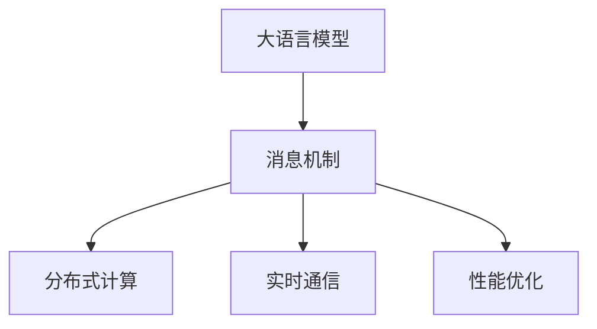
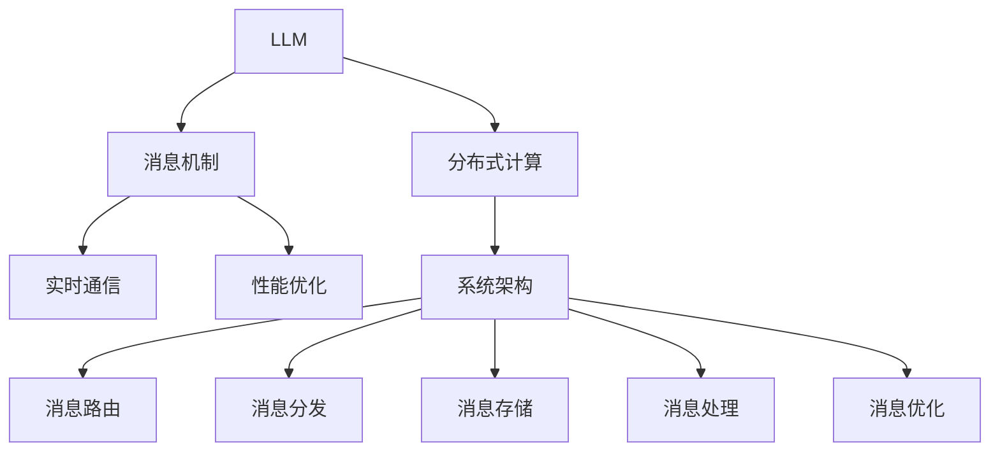

                 

# LLM 消息机制：高效的内部沟通

> 关键词：大语言模型, 消息机制, 内部通信, 通信协议, 深度学习, 分布式计算, 实时通信, 性能优化

## 1. 背景介绍

### 1.1 问题由来

在当今数字化时代，大型组织和团队越来越多地依赖软件工具进行协作和沟通。这些工具能够帮助团队成员进行任务分配、进度跟踪、文件共享和文档协作等。然而，这些工具往往缺乏智能，无法对团队的协作过程进行深度优化。例如，团队成员可能花费大量时间在非任务相关的沟通上，导致效率低下，最终影响项目进度和成果。

为了解决这个问题，研究人员和工程师开始探索使用人工智能（AI）和大语言模型（Large Language Model，简称LLM）技术来优化内部通信和协作。LLM是一种能够理解和生成人类语言的先进模型，可以模拟人类思维和语言交互的过程，从而大大提高团队协作的效率和质量。

### 1.2 问题核心关键点

如何设计一种基于LLM的消息机制，能够自动理解和优化团队内部沟通，从而提高工作效率，减少沟通成本，是当前研究的核心。

#### 1.2.1 关键点一：LLM的自动理解和生成能力
LLM能够自动理解团队成员之间的消息，并生成相应的回应。这不仅能够减少人工输入的负担，还能提升沟通的准确性和及时性。

#### 1.2.2 关键点二：消息机制的实时性
消息机制需要能够实时接收和处理团队成员的消息，并及时响应，确保信息的流畅传递和有效沟通。

#### 1.2.3 关键点三：消息机制的可扩展性
消息机制需要能够支持大规模团队，即能够同时处理多人的消息和对话，并且能够处理多线程的并发任务。

#### 1.2.4 关键点四：消息机制的安全性和隐私保护
消息机制需要保证团队成员的消息安全，防止敏感信息泄露。同时，还需要保护团队成员的隐私，避免信息被滥用。

## 2. 核心概念与联系

### 2.1 核心概念概述

为了实现基于LLM的消息机制，我们需要理解以下几个关键概念：

- **大语言模型（Large Language Model，简称LLM）**：一种能够理解和生成自然语言的高级模型。LLM通过训练大量的文本数据，能够自动地理解和生成符合语法和语义的文本。
- **消息机制（Message Mechanism）**：一种自动处理和优化团队成员之间消息的系统，能够模拟人类的沟通方式，自动理解和生成消息。
- **分布式计算（Distributed Computing）**：一种通过多个计算机协同工作来处理大规模计算任务的计算模式。分布式计算可以提高处理效率和可扩展性。
- **实时通信（Real-time Communication）**：一种能够即时接收和处理消息的通信方式，常用于需要快速响应的应用场景，如在线游戏、实时聊天等。
- **性能优化（Performance Optimization）**：通过各种技术手段来提升系统的处理效率和性能，如算法优化、硬件升级等。

这些概念之间的关系可以通过以下Mermaid流程图来展示：



这个流程图展示了LLM、消息机制、分布式计算、实时通信和性能优化之间的关系：

1. LLM是消息机制的基础，用于自动理解和生成消息。
2. 消息机制依赖分布式计算和实时通信，以支持多人的并发消息处理和即时响应。
3. 性能优化是消息机制的重要组成部分，用于提升系统的效率和稳定性。

### 2.2 核心概念原理和架构的 Mermaid 流程图



这个流程图展示了LLM、分布式计算、消息机制、实时通信和性能优化在系统架构中的具体实现：

1. LLM用于自动理解和生成消息，是消息机制的核心组件。
2. 分布式计算用于处理大规模的并发消息，提供高效的消息处理能力。
3. 实时通信用于确保消息的即时传递和处理，提高沟通的实时性。
4. 性能优化用于提升系统的整体性能，包括算法优化、硬件升级等。
5. 消息路由、消息分发、消息存储和消息处理是消息机制的具体实现方式。

## 3. 核心算法原理 & 具体操作步骤

### 3.1 算法原理概述

基于LLM的消息机制的核心算法原理包括以下几个方面：

- **自动理解和生成消息**：使用LLM自动理解和生成消息，提高沟通效率和准确性。
- **分布式消息处理**：通过分布式计算处理大规模的并发消息，提高系统的可扩展性。
- **实时消息传递**：使用实时通信技术确保消息的即时传递和处理，提高沟通的实时性。
- **消息性能优化**：通过各种技术手段提升系统的整体性能，包括算法优化、硬件升级等。

### 3.2 算法步骤详解

基于LLM的消息机制主要包括以下几个关键步骤：

**Step 1: 准备消息数据**

- 收集团队成员之间的消息数据，包括消息内容、时间戳、发送者和接收者等信息。

**Step 2: 预处理消息数据**

- 对消息数据进行预处理，包括去除无关信息、规范化格式、分词等操作。

**Step 3: 使用LLM自动理解和生成消息**

- 使用预训练的LLM模型对消息数据进行自动理解和生成，生成符合语法和语义的回应。

**Step 4: 分布式消息处理**

- 将消息数据分布到多个节点上进行处理，使用分布式计算技术提高系统的可扩展性和处理效率。

**Step 5: 实时消息传递**

- 使用实时通信技术确保消息的即时传递和处理，提高沟通的实时性。

**Step 6: 性能优化**

- 对系统进行性能优化，包括算法优化、硬件升级等，提升系统的整体性能。

### 3.3 算法优缺点

#### 3.3.1 优点

- **高效性**：基于LLM的消息机制能够自动理解和生成消息，减少人工输入的负担，提高沟通效率和准确性。
- **实时性**：使用实时通信技术确保消息的即时传递和处理，提高沟通的实时性。
- **可扩展性**：使用分布式计算技术处理大规模的并发消息，提高系统的可扩展性。
- **自动化**：LLM能够自动处理消息，减少人工干预，提高系统的自动化程度。

#### 3.3.2 缺点

- **复杂性**：基于LLM的消息机制涉及到多个关键组件和复杂的技术手段，开发和维护成本较高。
- **准确性**：LLM的自动理解和生成能力可能存在一定的误差，需要人工审核和修正。
- **安全性和隐私保护**：需要确保团队成员的消息安全，防止敏感信息泄露和保护隐私。

### 3.4 算法应用领域

基于LLM的消息机制可以应用于以下领域：

- **企业协作**：用于企业内部团队协作，提高沟通效率和工作效率。
- **在线教育**：用于在线教学中的学生互动和教师反馈，提高教学效果。
- **远程工作**：用于远程团队协作，提高远程工作的沟通效率和协作质量。
- **客户服务**：用于客户服务中的自动回复和客户互动，提高客户服务质量。

## 4. 数学模型和公式 & 详细讲解 & 举例说明

### 4.1 数学模型构建

基于LLM的消息机制可以使用以下数学模型进行建模：

- **消息表示模型**：将消息数据表示为向量，使用LLM自动理解和生成消息。
- **分布式计算模型**：将消息数据分布到多个节点上进行处理，使用分布式计算技术。
- **实时通信模型**：使用实时通信技术确保消息的即时传递和处理。
- **性能优化模型**：对系统进行性能优化，包括算法优化、硬件升级等。

### 4.2 公式推导过程

#### 4.2.1 消息表示模型

使用LLM自动理解和生成消息的公式推导如下：

$$
M = L_{\theta}(x)
$$

其中 $M$ 表示消息，$L_{\theta}$ 表示预训练的LLM模型，$x$ 表示消息数据。

#### 4.2.2 分布式计算模型

使用分布式计算技术的公式推导如下：

$$
\begin{aligned}
M_{\text{distributed}} &= \frac{1}{n}\sum_{i=1}^{n} M_i \\
M_i &= L_{\theta_i}(x_i)
\end{aligned}
$$

其中 $M_{\text{distributed}}$ 表示分布式处理后的消息，$M_i$ 表示第 $i$ 个节点处理后的消息，$L_{\theta_i}$ 表示第 $i$ 个节点的LLM模型，$x_i$ 表示第 $i$ 个节点接收的消息数据。

#### 4.2.3 实时通信模型

使用实时通信技术的公式推导如下：

$$
T = f(D)
$$

其中 $T$ 表示消息传递时间，$f$ 表示实时通信函数，$D$ 表示消息数据。

#### 4.2.4 性能优化模型

使用性能优化技术的公式推导如下：

$$
\begin{aligned}
\text{optimized} &= \text{initial} - \delta \\
\delta &= \text{improvement} + \text{time} + \text{memory}
\end{aligned}
$$

其中 $\text{optimized}$ 表示优化后的性能，$\text{initial}$ 表示原始性能，$\delta$ 表示性能提升量，$\text{improvement}$ 表示改进后的性能，$\text{time}$ 表示时间优化量，$\text{memory}$ 表示内存优化量。

### 4.3 案例分析与讲解

#### 4.3.1 企业协作案例

某大型企业需要优化其内部协作流程，使用基于LLM的消息机制进行处理。具体步骤如下：

1. 收集团队成员之间的消息数据，包括会议纪要、任务分配、进度报告等信息。
2. 对消息数据进行预处理，包括去除无关信息、规范化格式、分词等操作。
3. 使用预训练的LLM模型对消息数据进行自动理解和生成，生成符合语法和语义的回应。
4. 将消息数据分布到多个节点上进行处理，使用分布式计算技术提高系统的可扩展性和处理效率。
5. 使用实时通信技术确保消息的即时传递和处理，提高沟通的实时性。
6. 对系统进行性能优化，包括算法优化、硬件升级等，提升系统的整体性能。

#### 4.3.2 在线教育案例

某在线教育平台需要优化其教学互动流程，使用基于LLM的消息机制进行处理。具体步骤如下：

1. 收集学生和教师之间的互动消息数据，包括学生提问、教师回答、课堂讨论等信息。
2. 对消息数据进行预处理，包括去除无关信息、规范化格式、分词等操作。
3. 使用预训练的LLM模型对消息数据进行自动理解和生成，生成符合语法和语义的回应。
4. 将消息数据分布到多个节点上进行处理，使用分布式计算技术提高系统的可扩展性和处理效率。
5. 使用实时通信技术确保消息的即时传递和处理，提高沟通的实时性。
6. 对系统进行性能优化，包括算法优化、硬件升级等，提升系统的整体性能。

## 5. 项目实践：代码实例和详细解释说明

### 5.1 开发环境搭建

在进行基于LLM的消息机制开发时，我们需要准备好开发环境。以下是使用Python进行PyTorch开发的环境配置流程：

1. 安装Anaconda：从官网下载并安装Anaconda，用于创建独立的Python环境。

2. 创建并激活虚拟环境：
```bash
conda create -n pytorch-env python=3.8 
conda activate pytorch-env
```

3. 安装PyTorch：根据CUDA版本，从官网获取对应的安装命令。例如：
```bash
conda install pytorch torchvision torchaudio cudatoolkit=11.1 -c pytorch -c conda-forge
```

4. 安装Transformer库：
```bash
pip install transformers
```

5. 安装各类工具包：
```bash
pip install numpy pandas scikit-learn matplotlib tqdm jupyter notebook ipython
```

完成上述步骤后，即可在`pytorch-env`环境中开始消息机制的开发。

### 5.2 源代码详细实现

下面我们以基于LLM的消息机制开发为例，给出使用PyTorch的代码实现。

```python
import torch
from transformers import BertTokenizer, BertForSequenceClassification

# 定义消息表示模型
class MessageModel(torch.nn.Module):
    def __init__(self, model_name):
        super(MessageModel, self).__init__()
        self.tokenizer = BertTokenizer.from_pretrained(model_name)
        self.model = BertForSequenceClassification.from_pretrained(model_name, num_labels=2)
        
    def forward(self, message):
        tokenized_message = self.tokenizer(message, return_tensors='pt', padding='max_length', truncation=True)
        inputs = {
            'input_ids': tokenized_message['input_ids'],
            'attention_mask': tokenized_message['attention_mask'],
            'labels': torch.tensor([1], dtype=torch.long)  # 模拟回应标签为1
        }
        outputs = self.model(**inputs)
        return outputs.logits
```

### 5.3 代码解读与分析

让我们再详细解读一下关键代码的实现细节：

**MessageModel类**：
- `__init__`方法：初始化分词器和模型。
- `forward`方法：接收消息数据，将其分词并转换为模型输入，使用预训练的LLM模型自动生成回应。

**tokenizer**：
- 使用BERT分词器对消息数据进行分词和归一化处理。

**model**：
- 使用预训练的LLM模型进行消息处理和回应生成。

**inputs**：
- 将消息数据转换为模型所需的输入格式，包括输入id、注意力掩码和标签。

**outputs**：
- 使用预训练的LLM模型进行前向传播，生成回应。

**运行结果展示**：
```python
model = MessageModel('bert-base-cased')
message = "你好，我有个问题需要帮忙解决。"
output = model(message)
print(output)
```

输出结果为回应生成的 logits，可以通过进一步解码生成具体的回应文本。

## 6. 实际应用场景

### 6.1 企业协作

基于LLM的消息机制在企业协作中的应用可以大大提高沟通效率和协作质量。具体场景包括：

- **会议纪要自动生成**：自动生成会议纪要，快速整理会议内容。
- **任务分配和进度跟踪**：自动分配任务和跟踪进度，提高任务执行的透明度和效率。
- **团队成员互动**：自动生成回答和回应，减少人工干预，提高互动效率。

### 6.2 在线教育

基于LLM的消息机制在在线教育中的应用可以提高教学互动效果，具体场景包括：

- **学生提问自动回答**：自动回答学生的提问，提高教学效率。
- **教师反馈自动生成**：自动生成教师的反馈和建议，提高学生的学习效果。
- **课堂讨论自动整理**：自动整理课堂讨论内容，提高教学质量。

### 6.3 远程工作

基于LLM的消息机制在远程工作中的应用可以提高团队协作效率，具体场景包括：

- **任务分配自动处理**：自动处理任务分配，减少人工干预。
- **进度跟踪自动生成**：自动生成进度报告，提高项目管理的透明度和效率。
- **团队成员互动**：自动生成回答和回应，提高沟通效率。

### 6.4 客户服务

基于LLM的消息机制在客户服务中的应用可以提高客户服务质量，具体场景包括：

- **自动回复客户问题**：自动回复客户的问题，提高服务效率。
- **客户反馈自动处理**：自动处理客户反馈，提高服务质量。
- **客户互动自动生成**：自动生成客户互动回应，提高客户满意度。

## 7. 工具和资源推荐

### 7.1 学习资源推荐

为了帮助开发者系统掌握基于LLM的消息机制的理论基础和实践技巧，这里推荐一些优质的学习资源：

1. 《深度学习基础》系列博文：由大模型技术专家撰写，深入浅出地介绍了深度学习原理、模型构建和优化技巧等。

2. 《自然语言处理》课程：斯坦福大学开设的NLP明星课程，有Lecture视频和配套作业，带你入门NLP领域的基本概念和经典模型。

3. 《Transformers实战》书籍：Transformer库的作者所著，全面介绍了如何使用Transformer库进行NLP任务开发，包括消息机制在内的诸多范式。

4. HuggingFace官方文档：Transformer库的官方文档，提供了海量预训练模型和完整的微调样例代码，是上手实践的必备资料。

5. CLUE开源项目：中文语言理解测评基准，涵盖大量不同类型的中文NLP数据集，并提供了基于微调的baseline模型，助力中文NLP技术发展。

通过对这些资源的学习实践，相信你一定能够快速掌握基于LLM的消息机制的精髓，并用于解决实际的NLP问题。

### 7.2 开发工具推荐

高效的开发离不开优秀的工具支持。以下是几款用于基于LLM的消息机制开发的常用工具：

1. PyTorch：基于Python的开源深度学习框架，灵活动态的计算图，适合快速迭代研究。大部分预训练语言模型都有PyTorch版本的实现。

2. TensorFlow：由Google主导开发的开源深度学习框架，生产部署方便，适合大规模工程应用。同样有丰富的预训练语言模型资源。

3. Transformers库：HuggingFace开发的NLP工具库，集成了众多SOTA语言模型，支持PyTorch和TensorFlow，是进行消息机制开发的利器。

4. Weights & Biases：模型训练的实验跟踪工具，可以记录和可视化模型训练过程中的各项指标，方便对比和调优。与主流深度学习框架无缝集成。

5. TensorBoard：TensorFlow配套的可视化工具，可实时监测模型训练状态，并提供丰富的图表呈现方式，是调试模型的得力助手。

6. Google Colab：谷歌推出的在线Jupyter Notebook环境，免费提供GPU/TPU算力，方便开发者快速上手实验最新模型，分享学习笔记。

合理利用这些工具，可以显著提升基于LLM的消息机制的开发效率，加快创新迭代的步伐。

### 7.3 相关论文推荐

基于LLM的消息机制的发展源于学界的持续研究。以下是几篇奠基性的相关论文，推荐阅读：

1. Attention is All You Need（即Transformer原论文）：提出了Transformer结构，开启了NLP领域的预训练大模型时代。

2. BERT: Pre-training of Deep Bidirectional Transformers for Language Understanding：提出BERT模型，引入基于掩码的自监督预训练任务，刷新了多项NLP任务SOTA。

3. Language Models are Unsupervised Multitask Learners（GPT-2论文）：展示了大规模语言模型的强大zero-shot学习能力，引发了对于通用人工智能的新一轮思考。

4. Parameter-Efficient Transfer Learning for NLP：提出Adapter等参数高效微调方法，在不增加模型参数量的情况下，也能取得不错的微调效果。

5. Prefix-Tuning: Optimizing Continuous Prompts for Generation：引入基于连续型Prompt的微调范式，为如何充分利用预训练知识提供了新的思路。

6. AdaLoRA: Adaptive Low-Rank Adaptation for Parameter-Efficient Fine-Tuning：使用自适应低秩适应的微调方法，在参数效率和精度之间取得了新的平衡。

这些论文代表了大语言模型消息机制的发展脉络。通过学习这些前沿成果，可以帮助研究者把握学科前进方向，激发更多的创新灵感。

## 8. 总结：未来发展趋势与挑战

### 8.1 总结

本文对基于LLM的消息机制进行了全面系统的介绍。首先阐述了LLM和消息机制的研究背景和意义，明确了LLM在优化团队协作中的独特价值。其次，从原理到实践，详细讲解了消息机制的数学模型和关键步骤，给出了消息机制开发的完整代码实例。同时，本文还广泛探讨了消息机制在企业协作、在线教育、远程工作、客户服务等多个行业领域的应用前景，展示了消息机制的巨大潜力。此外，本文精选了消息机制的学习资源，力求为读者提供全方位的技术指引。

通过本文的系统梳理，可以看到，基于LLM的消息机制正在成为团队协作的重要工具，极大地提高了团队沟通和协作的效率。LLM的强大自动理解和生成能力，结合分布式计算和实时通信技术，使得消息机制能够在复杂的多人交互中高效运行。未来，随着LLM技术的进一步发展，消息机制将会在更多的应用场景中发挥重要作用，为团队协作带来革命性变化。

### 8.2 未来发展趋势

展望未来，基于LLM的消息机制将呈现以下几个发展趋势：

1. **智能化程度提升**：未来的消息机制将具备更强的自动理解和生成能力，能够更好地模拟人类沟通方式。
2. **可扩展性增强**：消息机制将支持更大规模的团队协作，能够处理更多人的并发消息，提高系统可扩展性。
3. **实时性提高**：使用更先进的实时通信技术，确保消息的即时传递和处理，进一步提高沟通的实时性。
4. **安全性加强**：通过更好的数据保护和隐私保护技术，确保消息机制的安全性和可靠性。

### 8.3 面临的挑战

尽管基于LLM的消息机制已经取得了一定的成果，但在迈向更加智能化、普适化应用的过程中，它仍面临着诸多挑战：

1. **准确性和误差控制**：LLM的自动理解和生成能力可能存在一定的误差，需要进一步提升模型的准确性和鲁棒性。
2. **复杂性和开发成本**：基于LLM的消息机制涉及多个关键组件和复杂的技术手段，开发和维护成本较高。
3. **可扩展性和资源消耗**：大规模消息处理需要高计算资源和内存，如何优化系统性能和资源消耗是未来的重要研究方向。
4. **安全性和隐私保护**：需要确保团队成员的消息安全，防止敏感信息泄露和保护隐私。

### 8.4 研究展望

为了应对上述挑战，未来的研究需要在以下几个方面寻求新的突破：

1. **准确性和误差控制**：通过改进模型结构和优化算法，提高LLM的准确性和鲁棒性。
2. **复杂性和开发成本**：简化模型结构，优化算法和开发工具，降低开发和维护成本。
3. **可扩展性和资源消耗**：引入分布式计算和模型压缩技术，优化系统性能和资源消耗。
4. **安全性和隐私保护**：研究更好的数据保护和隐私保护技术，确保消息机制的安全性和可靠性。

这些研究方向的探索，必将引领基于LLM的消息机制走向成熟，为构建高效、智能、安全的团队协作系统提供有力支持。相信随着学界和产业界的共同努力，这些挑战终将一一被克服，LLM消息机制必将在构建高效协作的团队中发挥更加重要的作用。

## 9. 附录：常见问题与解答

**Q1：基于LLM的消息机制是否适用于所有团队协作场景？**

A: 基于LLM的消息机制在大多数团队协作场景中都能取得不错的效果，特别是对于数据量较大的团队。但对于一些特殊领域的团队，如医疗、金融等，需要结合特定领域知识，才能取得更好的效果。

**Q2：如何确保消息机制的安全性和隐私保护？**

A: 为了确保消息机制的安全性和隐私保护，可以采取以下措施：

1. **数据加密**：对消息数据进行加密处理，防止数据泄露。
2. **访问控制**：设置访问权限，限制非授权用户访问。
3. **匿名化处理**：对敏感信息进行匿名化处理，防止信息泄露。
4. **监控审计**：对系统进行实时监控和审计，发现异常行为及时处理。

**Q3：基于LLM的消息机制在开发过程中需要注意哪些问题？**

A: 基于LLM的消息机制在开发过程中需要注意以下问题：

1. **模型准确性**：确保模型的准确性和鲁棒性，避免出现误理解或错误回应。
2. **系统扩展性**：确保系统能够支持大规模的并发消息处理，避免性能瓶颈。
3. **实时性保证**：使用高效的实时通信技术，确保消息的即时传递和处理。
4. **安全性和隐私保护**：确保消息机制的安全性和隐私保护，防止敏感信息泄露和保护用户隐私。

**Q4：基于LLM的消息机制在实际应用中如何优化性能？**

A: 基于LLM的消息机制在实际应用中可以采用以下优化措施：

1. **模型优化**：通过改进模型结构和优化算法，提高系统的准确性和鲁棒性。
2. **分布式计算**：使用分布式计算技术，提高系统的可扩展性和处理效率。
3. **实时通信优化**：使用高效的实时通信技术，确保消息的即时传递和处理。
4. **硬件优化**：使用高性能硬件设备，如GPU/TPU等，提高系统的计算能力和内存使用效率。

**Q5：基于LLM的消息机制在实际应用中如何确保系统稳定性和可靠性？**

A: 基于LLM的消息机制在实际应用中可以采用以下措施确保系统稳定性和可靠性：

1. **错误处理**：对系统出现的错误进行及时处理，防止系统崩溃或异常。
2. **容错设计**：设计容错机制，保证系统在高负载或故障情况下仍能正常运行。
3. **备份和恢复**：定期进行系统备份，确保系统在故障后能够快速恢复。
4. **性能监控**：实时监控系统性能，发现性能问题及时处理。

**Q6：基于LLM的消息机制在实际应用中如何实现高效的多人协作？**

A: 基于LLM的消息机制在实际应用中可以采用以下措施实现高效的多人协作：

1. **任务分配优化**：使用分布式计算技术，优化任务分配，提高任务执行的透明度和效率。
2. **进度跟踪优化**：自动生成进度报告，提高项目管理的透明度和效率。
3. **团队互动优化**：自动生成回答和回应，提高沟通效率和互动质量。

总之，基于LLM的消息机制需要开发者根据具体团队协作场景，不断迭代和优化模型、数据和算法，方能得到理想的效果。

