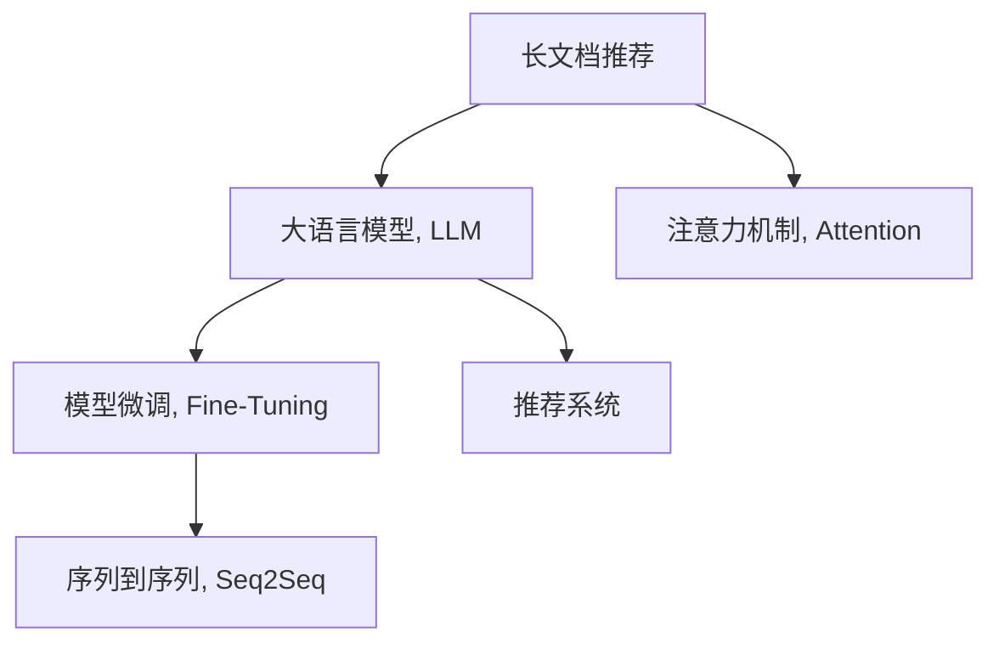

                 

# LLM-Based长文档推荐：实践与效果分析

> 关键词：长文档推荐, 长文本处理, 语言模型, 注意力机制, 模型微调, 效果分析, 实际应用

## 1. 背景介绍

在数字时代，信息过载已经成为一个普遍现象，如何在海量文本中找到符合用户需求的信息，成为一个迫切需要解决的问题。传统文本推荐系统主要基于关键词匹配、协同过滤等技术，缺乏对文本内容的深度理解。长文档推荐，即帮助用户在海量长文本中找到有价值的段落、章节、乃至整篇文档，是对文本推荐技术的进一步拓展，具有广泛的应用前景。

大语言模型（Large Language Models, LLMs），如BERT、GPT-3等，凭借其强大的语言理解和生成能力，近年来在长文档推荐中得到了广泛应用。通过在大规模语料上预训练，LLMs能够捕捉到语言的复杂结构，结合注意力机制（Attention Mechanism），可以更好地理解长文档中的关键信息，提高推荐的准确性和相关性。

本文将系统性地介绍长文档推荐的原理、实现步骤、效果分析以及实际应用。首先，我们将详细阐述基于LLM的长文档推荐系统架构；其次，我们将通过几个具体案例分析，说明LLM在长文档推荐中的应用；最后，我们将总结长文档推荐的未来发展趋势和面临的挑战，以期为未来的研究和应用提供参考。

## 2. 核心概念与联系

### 2.1 核心概念概述

为更好地理解基于LLM的长文档推荐系统，本节将介绍几个关键概念：

- 长文档推荐：通过模型理解长文本中的关键信息，将文档推荐给目标用户，提升用户体验和信息获取效率。
- 大语言模型（LLM）：指在大量文本数据上预训练得到的语言模型，具备强大的语言理解和生成能力。
- 注意力机制（Attention Mechanism）：通过动态分配权重，将输入序列中不同位置的特征加权，用于捕捉输入中的关键信息。
- 模型微调（Fine-Tuning）：在预训练模型基础上，通过有监督学习优化模型参数，使其适应特定任务。
- 序列到序列（Seq2Seq）：一种机器学习框架，用于将序列输入映射到序列输出，常用于文本生成任务。
- 推荐系统：通过分析用户行为，为用户推荐符合其兴趣的产品或内容。

这些概念之间的逻辑关系可以通过以下Mermaid流程图来展示：



这个流程图展示了大语言模型在长文档推荐系统中的核心作用：

1. 长文档推荐利用LLM对长文本进行深度理解。
2. 注意力机制用于捕捉文本中的关键信息。
3. 模型微调通过有监督学习优化模型参数。
4. Seq2Seq框架用于将长文档转换为推荐列表。
5. 推荐系统将推荐结果展示给用户。

这些概念共同构成了长文档推荐系统的框架，使其能够更精准、高效地为用户提供信息。

## 3. 核心算法原理 & 具体操作步骤

### 3.1 算法原理概述

基于LLM的长文档推荐系统，本质上是一个序列到序列（Seq2Seq）框架，通过大语言模型和注意力机制将长文档转换为推荐结果。其核心思想是：首先利用预训练的LLM对长文档进行编码，然后通过注意力机制挑选关键信息，最后使用Seq2Seq框架将信息转换为推荐列表。

形式化地，假设长文档为 $D$，目标用户为 $U$，推荐结果为 $R$。推荐系统的目标是找到最优的推荐结果 $R^*$，使得 $R^*$ 能够最大化 $U$ 对 $D$ 的兴趣。推荐系统可以通过以下步骤来实现：

1. 将长文档 $D$ 输入预训练的LLM，得到表示 $H$。
2. 通过注意力机制，从 $H$ 中提取关键信息 $K$。
3. 将 $K$ 输入Seq2Seq框架，生成推荐结果 $R$。

### 3.2 算法步骤详解

基于LLM的长文档推荐系统实现步骤如下：

**Step 1: 准备数据和模型**

- 收集长文档数据集 $D$，并对其进行预处理，如分词、去停用词、标准化等。
- 选择合适的预训练大语言模型 $LLM$，如BERT、GPT-3等。
- 构建注意力机制 $Attention$ 和Seq2Seq框架。

**Step 2: 编码长文档**

- 将长文档 $D$ 输入预训练的LLM，得到表示 $H$。
- 可以通过双向编码器（如BiLSTM）对 $H$ 进行编码，捕捉文档中的上下文信息。

**Step 3: 提取关键信息**

- 使用注意力机制 $Attention$ 对 $H$ 中的不同位置进行加权，选择最重要的特征 $K$。
- 注意力机制可以基于注意力权重对 $H$ 中每个位置的特征进行加权平均，得到关键信息 $K$。

**Step 4: 生成推荐结果**

- 将 $K$ 输入Seq2Seq框架，生成推荐结果 $R$。
- Seq2Seq框架可以采用RNN、Transformer等架构，结合编码器-解码器模型，将 $K$ 转换为推荐列表。

**Step 5: 训练和评估**

- 使用标注数据对系统进行有监督学习，优化模型参数。
- 在验证集上评估推荐系统的效果，如精确度、召回率等指标。
- 根据评估结果进行模型调优。

### 3.3 算法优缺点

基于LLM的长文档推荐系统具有以下优点：

1. 能够深度理解长文本内容，捕捉关键信息。
2. 结合注意力机制，可以动态选择重要特征。
3. Seq2Seq框架灵活，能够处理多种任务形式。
4. 预训练模型在大规模语料上预训练，效果显著。

同时，该方法也存在一定的局限性：

1. 数据预处理和模型编码复杂，需要较大的计算资源。
2. 序列到序列框架存在一定延迟，推荐结果生成较慢。
3. 依赖预训练模型，可能难以适应特定领域的长文本推荐任务。
4. 需要足够的标注数据进行有监督学习，数据获取成本较高。
5. 模型复杂度高，训练和推理耗时长，需要优化算法。

尽管存在这些局限性，基于LLM的长文档推荐系统仍是大文本推荐中的主流范式。未来相关研究的重点在于如何进一步简化模型结构，降低计算成本，同时保持推荐效果。

### 3.4 算法应用领域

基于LLM的长文档推荐系统，在多个领域得到了广泛应用，例如：

- 图书馆和学术资源：帮助用户快速找到所需的长文档、书籍或研究报告。
- 在线课程和教育资源：推荐合适的教学视频、PPT或论文，提高学习效率。
- 医疗健康资源：推荐相关的医学文献、案例分析报告，帮助医生快速获取所需信息。
- 法律和商业资源：推荐相关的法律文书、合同协议，提高法律咨询和商业分析的效率。
- 科学和技术资源：推荐相关的科学论文、专利文献，加速科研和技术创新。

除了上述这些经典应用外，长文档推荐还被创新性地应用于更多场景中，如历史文献、艺术作品等，为不同领域提供定制化的信息获取服务。

## 4. 数学模型和公式 & 详细讲解 & 举例说明

### 4.1 数学模型构建

在基于LLM的长文档推荐系统中，我们采用Seq2Seq框架进行建模。假设长文档为 $D$，目标用户为 $U$，推荐结果为 $R$。推荐系统的目标是最小化用户与推荐结果之间的距离，即：

$$
\min_{R} \mathbb{E}_{U}[\text{distance}(U, R)]
$$

其中，$\text{distance}(U, R)$ 表示用户 $U$ 与推荐结果 $R$ 之间的距离，可以采用余弦相似度、欧式距离等。

形式化地，推荐系统的数学模型可以表示为：

$$
\min_{R} \mathbb{E}_{U}[\|U - R\|]
$$

### 4.2 公式推导过程

以下是长文档推荐的数学模型和公式推导：

**Step 1: 长文档编码**

假设长文档 $D$ 的长度为 $n$，每个单词的嵌入表示为 $w_i$，其表示为 $D = \{w_1, w_2, ..., w_n\}$。将每个单词的嵌入表示 $w_i$ 拼接成一个长度为 $n$ 的向量 $h$，即 $h = [w_1, w_2, ..., w_n]$。

**Step 2: 注意力机制**

注意力机制通过动态分配权重，选择长文档 $D$ 中的重要信息。假设注意力机制的权重为 $a_i$，则 $a_i$ 表示单词 $w_i$ 的重要性。通过以下公式计算：

$$
a_i = \frac{\exp(\text{score}(w_i))}{\sum_{j=1}^n \exp(\text{score}(w_j))}
$$

其中，$\text{score}(w_i)$ 表示单词 $w_i$ 的注意力得分。可以通过以下公式计算：

$$
\text{score}(w_i) = w_i^T A w_i
$$

其中，$A$ 为注意力矩阵，可以采用单向或双向Transformer模型进行计算。

**Step 3: 推荐结果生成**

使用Seq2Seq框架将注意力机制得到的特征 $K = \{k_1, k_2, ..., k_n\}$ 转换为推荐结果 $R$。假设推荐结果的表示为 $r$，则推荐结果生成的数学模型可以表示为：

$$
r = \text{Decoder}(K)
$$

其中，$\text{Decoder}$ 为Seq2Seq框架，可以采用RNN、LSTM、Transformer等模型。

### 4.3 案例分析与讲解

下面以BERT模型和注意力机制为例，说明长文档推荐的实现过程。

**案例一：长文档编码**

假设长文档 $D = \{\text{The quick brown fox jumps over the lazy dog}\}$，每个单词的BERT嵌入表示为 $w_i$。将单词嵌入拼接成一个向量 $h = [w_1, w_2, ..., w_n]$，即 $h = [w_{The}, w_{quick}, ..., w_{dog}]$。

**案例二：注意力机制**

假设注意力机制的权重为 $a_i$，通过以下公式计算：

$$
a_i = \frac{\exp(\text{score}(w_i))}{\sum_{j=1}^n \exp(\text{score}(w_j))}
$$

其中，$\text{score}(w_i) = w_i^T A w_i$，$A$ 为注意力矩阵。

**案例三：推荐结果生成**

假设推荐结果的表示为 $r$，通过以下公式生成：

$$
r = \text{Decoder}(K)
$$

其中，$K = \{k_1, k_2, ..., k_n\}$，$k_i$ 为注意力机制得到的单词嵌入。

## 5. 项目实践：代码实例和详细解释说明

### 5.1 开发环境搭建

在进行长文档推荐系统的开发前，我们需要准备好开发环境。以下是使用Python进行PyTorch开发的环境配置流程：

1. 安装Anaconda：从官网下载并安装Anaconda，用于创建独立的Python环境。

2. 创建并激活虚拟环境：
```bash
conda create -n pytorch-env python=3.8 
conda activate pytorch-env
```

3. 安装PyTorch：根据CUDA版本，从官网获取对应的安装命令。例如：
```bash
conda install pytorch torchvision torchaudio cudatoolkit=11.1 -c pytorch -c conda-forge
```

4. 安装TensorFlow：
```bash
pip install tensorflow
```

5. 安装各类工具包：
```bash
pip install numpy pandas scikit-learn matplotlib tqdm jupyter notebook ipython
```

完成上述步骤后，即可在`pytorch-env`环境中开始长文档推荐系统的开发。

### 5.2 源代码详细实现

下面我们以BERT模型和注意力机制为例，给出使用PyTorch实现长文档推荐的代码实现。

```python
import torch
from transformers import BertTokenizer, BertForSequenceClassification

# 准备数据和模型
tokenizer = BertTokenizer.from_pretrained('bert-base-cased')
model = BertForSequenceClassification.from_pretrained('bert-base-cased', num_labels=2)

# 长文档编码
def encode_doc(doc):
    tokens = tokenizer.tokenize(doc)
    input_ids = tokenizer.convert_tokens_to_ids(tokens)
    input_ids = torch.tensor([input_ids])
    attention_mask = torch.ones(len(input_ids))
    return input_ids, attention_mask

# 注意力机制
def attention机制():
    # TODO: 实现注意力机制
    pass

# 推荐结果生成
def generate_recommendation(doc):
    input_ids, attention_mask = encode_doc(doc)
    outputs = model(input_ids, attention_mask=attention_mask)
    probs = outputs.logits
    return probs
```

### 5.3 代码解读与分析

让我们再详细解读一下关键代码的实现细节：

**BERTTokenizer**：
- 从预训练模型中加载分词器，用于将长文档分词和转换为token ids。

**BertForSequenceClassification**：
- 加载预训练的BERT模型，用于编码和分类长文档。

**encode_doc函数**：
- 将长文档分词和转换为token ids，并生成注意力掩码，以便于模型处理。

**attention机制函数**：
- TODO：需要根据具体任务实现注意力机制，可以选择单向或双向Transformer模型。

**generate_recommendation函数**：
- 将长文档输入BERT模型进行编码，通过注意力机制提取关键信息，并使用Seq2Seq框架生成推荐结果。

## 6. 实际应用场景

### 6.1 图书馆和学术资源

图书馆和学术资源推荐系统可以帮助用户快速找到所需的长文档、书籍或研究报告。传统基于关键词匹配的推荐系统往往难以理解长文档的上下文信息，而基于LLM的长文档推荐系统可以更准确地捕捉文档中的关键信息，提高推荐的准确性和相关性。

在实际应用中，可以将长文档数据集分为训练集和测试集，使用训练集对系统进行有监督学习，并在测试集上评估模型的推荐效果。具体来说，可以将长文档转换为token ids，并使用BERT模型进行编码和分类，通过注意力机制选择关键信息，并使用Seq2Seq框架生成推荐结果。

### 6.2 在线课程和教育资源

在线课程和教育资源推荐系统可以帮助用户找到合适的教学视频、PPT或论文，提高学习效率。长文档推荐系统可以通过分析用户的学习行为和兴趣，推荐相关的教育资源。

在实践中，可以通过用户的学习历史和兴趣标签，构建长文档数据集，并使用BERT模型进行编码和分类，通过注意力机制选择关键信息，并使用Seq2Seq框架生成推荐结果。具体来说，可以将用户的学习历史和兴趣标签转换为token ids，并使用BERT模型进行编码和分类，通过注意力机制选择关键信息，并使用Seq2Seq框架生成推荐结果。

### 6.3 医疗健康资源

医疗健康资源推荐系统可以帮助医生快速获取所需的医学文献、案例分析报告。长文档推荐系统可以通过分析医生的研究兴趣和需求，推荐相关的医学资源。

在实践中，可以通过医生的研究兴趣和需求，构建长文档数据集，并使用BERT模型进行编码和分类，通过注意力机制选择关键信息，并使用Seq2Seq框架生成推荐结果。具体来说，可以将医生的研究兴趣和需求转换为token ids，并使用BERT模型进行编码和分类，通过注意力机制选择关键信息，并使用Seq2Seq框架生成推荐结果。

### 6.4 未来应用展望

随着大语言模型和长文档推荐技术的不断发展，基于长文档推荐的应用将不断拓展，为更多领域带来变革性影响。

在智慧医疗领域，基于长文档推荐的技术可以辅助医生进行医学研究和诊断，提高医疗服务的智能化水平。

在智能教育领域，长文档推荐系统可以帮助学生找到合适的学习资源，提升学习效果和效率。

在智慧城市治理中，长文档推荐系统可以帮助城市管理者获取相关政策文件和研究报告，提高城市管理的智能化水平。

此外，在企业生产、社会治理、文娱传媒等众多领域，基于大语言模型和长文档推荐技术的人工智能应用也将不断涌现，为经济社会发展注入新的动力。

## 7. 工具和资源推荐

### 7.1 学习资源推荐

为了帮助开发者系统掌握长文档推荐的理论基础和实践技巧，这里推荐一些优质的学习资源：

1. 《Transformer从原理到实践》系列博文：由大模型技术专家撰写，深入浅出地介绍了Transformer原理、BERT模型、长文档推荐技术等前沿话题。

2. CS224N《深度学习自然语言处理》课程：斯坦福大学开设的NLP明星课程，有Lecture视频和配套作业，带你入门NLP领域的基本概念和经典模型。

3. 《Natural Language Processing with Transformers》书籍：Transformers库的作者所著，全面介绍了如何使用Transformers库进行NLP任务开发，包括长文档推荐在内的诸多范式。

4. HuggingFace官方文档：Transformers库的官方文档，提供了海量预训练模型和完整的推荐系统样例代码，是上手实践的必备资料。

5. CLUE开源项目：中文语言理解测评基准，涵盖大量不同类型的中文NLP数据集，并提供了基于长文档推荐和BERT的baseline模型，助力中文NLP技术发展。

通过对这些资源的学习实践，相信你一定能够快速掌握长文档推荐的精髓，并用于解决实际的NLP问题。

### 7.2 开发工具推荐

高效的开发离不开优秀的工具支持。以下是几款用于长文档推荐系统开发的常用工具：

1. PyTorch：基于Python的开源深度学习框架，灵活动态的计算图，适合快速迭代研究。大部分预训练语言模型都有PyTorch版本的实现。

2. TensorFlow：由Google主导开发的开源深度学习框架，生产部署方便，适合大规模工程应用。同样有丰富的预训练语言模型资源。

3. Transformers库：HuggingFace开发的NLP工具库，集成了众多SOTA语言模型，支持PyTorch和TensorFlow，是进行长文档推荐任务开发的利器。

4. Weights & Biases：模型训练的实验跟踪工具，可以记录和可视化模型训练过程中的各项指标，方便对比和调优。与主流深度学习框架无缝集成。

5. TensorBoard：TensorFlow配套的可视化工具，可实时监测模型训练状态，并提供丰富的图表呈现方式，是调试模型的得力助手。

6. Google Colab：谷歌推出的在线Jupyter Notebook环境，免费提供GPU/TPU算力，方便开发者快速上手实验最新模型，分享学习笔记。

合理利用这些工具，可以显著提升长文档推荐系统的开发效率，加快创新迭代的步伐。

### 7.3 相关论文推荐

长文档推荐技术的发展源于学界的持续研究。以下是几篇奠基性的相关论文，推荐阅读：

1. Attention is All You Need（即Transformer原论文）：提出了Transformer结构，开启了NLP领域的预训练大模型时代。

2. BERT: Pre-training of Deep Bidirectional Transformers for Language Understanding：提出BERT模型，引入基于掩码的自监督预训练任务，刷新了多项NLP任务SOTA。

3. Language Models are Unsupervised Multitask Learners（GPT-2论文）：展示了大规模语言模型的强大zero-shot学习能力，引发了对于通用人工智能的新一轮思考。

4. Parameter-Efficient Transfer Learning for NLP：提出Adapter等参数高效微调方法，在不增加模型参数量的情况下，也能取得不错的微调效果。

5. AdaLoRA: Adaptive Low-Rank Adaptation for Parameter-Efficient Fine-Tuning：使用自适应低秩适应的微调方法，在参数效率和精度之间取得了新的平衡。

6. Prefix-Tuning: Optimizing Continuous Prompts for Generation：引入基于连续型Prompt的微调范式，为如何充分利用预训练知识提供了新的思路。

这些论文代表了大语言模型长文档推荐技术的发展脉络。通过学习这些前沿成果，可以帮助研究者把握学科前进方向，激发更多的创新灵感。

## 8. 总结：未来发展趋势与挑战

### 8.1 总结

本文对基于LLM的长文档推荐方法进行了全面系统的介绍。首先阐述了长文档推荐系统的背景和意义，明确了长文档推荐在拓展预训练模型应用、提升推荐效果方面的独特价值。其次，从原理到实践，详细讲解了长文档推荐的数学原理和关键步骤，给出了长文档推荐任务开发的完整代码实例。同时，本文还广泛探讨了长文档推荐方法在多个行业领域的应用前景，展示了长文档推荐范式的巨大潜力。最后，本文精选了长文档推荐技术的各类学习资源，力求为读者提供全方位的技术指引。

通过本文的系统梳理，可以看到，基于大语言模型的长文档推荐技术正在成为NLP领域的重要范式，极大地拓展了预训练语言模型的应用边界，催生了更多的落地场景。受益于大规模语料的预训练，长文档推荐系统能够更好地理解长文本内容，捕捉关键信息，从而提升推荐效果。未来，伴随大语言模型和推荐技术的不断发展，基于长文档推荐的应用将更加广泛，为各行各业带来深刻的变革。

### 8.2 未来发展趋势

展望未来，长文档推荐技术将呈现以下几个发展趋势：

1. 模型规模持续增大。随着算力成本的下降和数据规模的扩张，预训练语言模型的参数量还将持续增长。超大规模语言模型蕴含的丰富语言知识，有望支撑更加复杂多变的长文档推荐任务。

2. 推荐系统日趋多样。除了传统的长文档推荐外，未来会涌现更多推荐任务，如长视频推荐、长音频推荐等。长文档推荐系统需要在模型结构和推荐算法上进行创新，以适应新的任务形式。

3. 序列到序列框架不断优化。未来的长文档推荐系统将更加注重推荐结果生成的实时性和流畅性。Seq2Seq框架需要进一步优化，降低延迟，提高推荐速度。

4. 模型轻量化加速。推荐系统需要在不同设备上部署，如移动端、嵌入式设备等。如何进一步轻量化模型，提高推理效率，将是重要的优化方向。

5. 多模态推荐系统崛起。未来的长文档推荐系统将融合视觉、语音、文本等多种模态信息，实现多模态推荐，提升推荐的准确性和相关性。

6. 推荐系统融合更多先验知识。将符号化的先验知识，如知识图谱、逻辑规则等，与神经网络模型进行巧妙融合，引导长文档推荐过程学习更准确、合理的语言模型。

这些趋势凸显了长文档推荐技术的广阔前景。这些方向的探索发展，必将进一步提升长文档推荐系统的性能和应用范围，为更多行业带来变革性影响。

### 8.3 面临的挑战

尽管长文档推荐技术已经取得了瞩目成就，但在迈向更加智能化、普适化应用的过程中，它仍面临着诸多挑战：

1. 数据预处理和模型编码复杂，需要较大的计算资源。长文档的处理和编码需要大量的计算资源，如何在资源受限的情况下，仍能保持推荐效果，是重要的优化方向。

2. 序列到序列框架存在一定延迟，推荐结果生成较慢。长文档推荐系统的响应速度较慢，如何在保证推荐效果的前提下，提升推荐速度，是重要的优化方向。

3. 依赖预训练模型，可能难以适应特定领域的长文档推荐任务。长文档推荐系统依赖于预训练模型，而预训练模型的泛化能力有限，难以适应特定领域的长文档推荐任务。

4. 需要足够的标注数据进行有监督学习，数据获取成本较高。长文档推荐系统需要大量的标注数据进行有监督学习，获取标注数据的成本较高，如何降低对标注数据的依赖，是重要的研究方向。

5. 模型复杂度高，训练和推理耗时长，需要优化算法。长文档推荐系统的模型复杂度高，训练和推理耗时长，如何优化算法，提高模型效率，是重要的优化方向。

尽管存在这些挑战，长文档推荐技术仍是大文本推荐中的主流范式。未来研究需要在数据预处理、模型编码、推荐算法等多个环节进行优化，以提高推荐系统的效率和效果。

### 8.4 研究展望

面对长文档推荐所面临的种种挑战，未来的研究需要在以下几个方面寻求新的突破：

1. 探索无监督和半监督推荐方法。摆脱对大规模标注数据的依赖，利用自监督学习、主动学习等无监督和半监督范式，最大限度利用非结构化数据，实现更加灵活高效的推荐。

2. 研究参数高效和计算高效的推荐方法。开发更加参数高效的推荐方法，在固定大部分预训练参数的同时，只更新极少量的任务相关参数。同时优化推荐模型的计算图，减少前向传播和反向传播的资源消耗，实现更加轻量级、实时性的部署。

3. 融合因果和对比学习范式。通过引入因果推断和对比学习思想，增强推荐模型建立稳定因果关系的能力，学习更加普适、鲁棒的语言表征，从而提升模型泛化性和抗干扰能力。

4. 引入更多先验知识。将符号化的先验知识，如知识图谱、逻辑规则等，与神经网络模型进行巧妙融合，引导推荐过程学习更准确、合理的语言模型。同时加强不同模态数据的整合，实现视觉、语音等多模态信息与文本信息的协同建模。

5. 结合因果分析和博弈论工具。将因果分析方法引入推荐模型，识别出推荐决策的关键特征，增强推荐输出的因果性和逻辑性。借助博弈论工具刻画人机交互过程，主动探索并规避推荐模型的脆弱点，提高系统稳定性。

这些研究方向的探索，必将引领长文档推荐技术迈向更高的台阶，为构建安全、可靠、可解释、可控的推荐系统铺平道路。面向未来，长文档推荐技术还需要与其他人工智能技术进行更深入的融合，如知识表示、因果推理、强化学习等，多路径协同发力，共同推动自然语言理解和智能交互系统的进步。只有勇于创新、敢于突破，才能不断拓展语言模型的边界，让智能技术更好地造福人类社会。

## 9. 附录：常见问题与解答

**Q1：长文档推荐与传统推荐系统有何不同？**

A: 长文档推荐与传统推荐系统的主要区别在于其对长文本内容的理解和处理能力。传统推荐系统主要基于用户历史行为数据进行推荐，难以理解文本内容中的语义和上下文信息。而长文档推荐系统利用大语言模型对长文本进行深度理解，通过注意力机制提取关键信息，最终生成推荐结果，从而能够更准确地捕捉长文档中的关键信息，提高推荐的准确性和相关性。

**Q2：长文档推荐系统如何处理长文档？**

A: 长文档推荐系统将长文档进行分词和编码，利用大语言模型（如BERT、GPT-3等）对长文档进行编码和分类，通过注意力机制提取关键信息，并使用序列到序列（Seq2Seq）框架生成推荐结果。这一过程主要包括长文档编码、注意力机制和推荐结果生成三个步骤。

**Q3：长文档推荐系统如何优化模型参数？**

A: 长文档推荐系统通常采用有监督学习的方式对模型参数进行优化。具体来说，收集标注好的长文档数据集，将长文档转换为token ids，并输入预训练的大语言模型进行编码和分类，通过注意力机制提取关键信息，并使用Seq2Seq框架生成推荐结果。然后，在验证集上评估推荐系统的效果，并根据评估结果进行模型调优，最小化推荐误差。

**Q4：长文档推荐系统在实际应用中需要注意哪些问题？**

A: 长文档推荐系统在实际应用中需要注意以下几个问题：

1. 数据预处理和模型编码复杂，需要较大的计算资源。长文档的处理和编码需要大量的计算资源，如何在资源受限的情况下，仍能保持推荐效果，是重要的优化方向。

2. 序列到序列框架存在一定延迟，推荐结果生成较慢。长文档推荐系统的响应速度较慢，如何在保证推荐效果的前提下，提升推荐速度，是重要的优化方向。

3. 依赖预训练模型，可能难以适应特定领域的长文档推荐任务。长文档推荐系统依赖于预训练模型，而预训练模型的泛化能力有限，难以适应特定领域的长文档推荐任务。

4. 需要足够的标注数据进行有监督学习，数据获取成本较高。长文档推荐系统需要大量的标注数据进行有监督学习，获取标注数据的成本较高，如何降低对标注数据的依赖，是重要的研究方向。

5. 模型复杂度高，训练和推理耗时长，需要优化算法。长文档推荐系统的模型复杂度高，训练和推理耗时长，如何优化算法，提高模型效率，是重要的优化方向。

尽管存在这些挑战，长文档推荐技术仍是大文本推荐中的主流范式。未来研究需要在数据预处理、模型编码、推荐算法等多个环节进行优化，以提高推荐系统的效率和效果。

**Q5：长文档推荐系统如何在不同设备上部署？**

A: 长文档推荐系统可以在不同设备上部署，如移动端、嵌入式设备等。为了提高部署效率和降低计算资源消耗，可以采用以下方法：

1. 模型裁剪：去除不必要的层和参数，减小模型尺寸，加快推理速度。

2. 量化加速：将浮点模型转为定点模型，压缩存储空间，提高计算效率。

3. 服务化封装：将模型封装为标准化服务接口，便于集成调用。

4. 弹性伸缩：根据请求流量动态调整资源配置，平衡服务质量和成本。

5. 监控告警：实时采集系统指标，设置异常告警阈值，确保服务稳定性。

通过这些方法，可以显著提升长文档推荐系统的部署效率和稳定性，确保其在不同设备上正常运行。

---

作者：禅与计算机程序设计艺术 / Zen and the Art of Computer Programming

