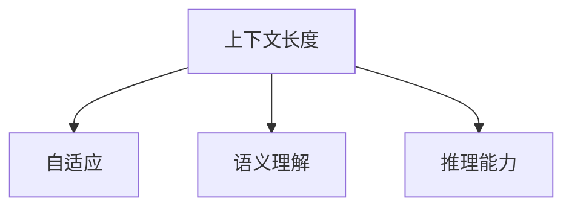

                 

# LLM上下文长度持续扩展

> 关键词：LLM,上下文长度,自动扩展,语言模型,自适应,语义理解,推理能力

## 1. 背景介绍

### 1.1 问题由来

近年来，随着深度学习技术和大规模预训练语言模型(LLM)的飞速发展，自然语言处理(NLP)领域在文本分类、情感分析、机器翻译、问答系统等任务上取得了显著的进展。然而，大模型通常具有固定的输入序列长度，这在某些需要长文本输入的任务上造成了障碍，如文章摘要、故事续写、对话系统等。

### 1.2 问题核心关键点

大模型输入序列长度的固定限制，使得模型在处理长文本时可能出现信息丢失或推理偏差，无法充分发挥其强大的语言理解和生成能力。解决这一问题，需要发展一种自适应的上下文长度扩展技术，使得模型能够动态调整输入长度，适应不同规模的文本输入。

## 2. 核心概念与联系

### 2.1 核心概念概述

为更好地理解LLM上下文长度扩展技术，本节将介绍几个密切相关的核心概念：

- 上下文长度(Context Length)：指模型在处理文本时，需要输入的最小文本长度，以便完整捕捉句义。
- 自适应(Adaptive)：指系统能够根据当前任务需求自动调整上下文长度，而不是固定某一定值。
- 语义理解(Semantic Understanding)：指模型能够理解文本的深层语义，不仅停留于表面词汇层面，能够根据上下文进行合理推断。
- 推理能力(Reasoning)：指模型能够根据已知信息进行逻辑推理，做出合理预测或生成文本。

这些核心概念之间的逻辑关系可以通过以下Mermaid流程图来展示：



这个流程图展示了大模型上下文长度扩展技术涉及的关键概念及其之间的关系：

1. 上下文长度限制了模型的输入能力。
2. 自适应上下文长度扩展技术解决了这一限制。
3. 语义理解和推理能力是上下文长度扩展技术的主要目标，用于提升模型处理长文本的性能。

## 3. 核心算法原理 & 具体操作步骤
### 3.1 算法原理概述

基于LLM的上下文长度扩展技术，本质上是一个动态调整输入序列长度，以更好地适应任务需求的过程。其核心思想是：根据当前任务的特点，自适应地决定输入序列长度，使得模型能够完整捕捉文本信息，并在推理时不会丢失关键信息。

形式化地，假设模型输入序列长度为 $L$，目标是在给定任务 $T$ 的数据集 $D=\{(x_i, y_i)\}_{i=1}^N, x_i \in \mathcal{X}, y_i \in \mathcal{Y}$ 上，找到最优的输入序列长度 $L^*$，使得模型在任务 $T$ 上获得最优性能。

### 3.2 算法步骤详解

基于LLM的上下文长度扩展一般包括以下几个关键步骤：

**Step 1: 确定基础序列长度**
- 根据任务的特性，定义一个基础序列长度 $L_0$，作为上下文长度的初始值。例如，对于文章摘要任务，可以将输入分为摘要和正文两部分，摘要长度定为2-4句子。

**Step 2: 设计序列扩展策略**
- 根据任务需求，设计合适的序列扩展策略，如等比例扩展、固定长度扩展、逐步扩展等。
- 例如，对于对话系统，可以每次固定扩展1-2句子，逐步增加输入长度。
- 对于文本生成任务，可以每次增加1-2个单词，逐步扩展输入序列。

**Step 3: 选择扩展方向**
- 确定序列扩展的起始位置和结束位置。例如，可以从前向后逐步扩展，或者从后向前逐步扩展。

**Step 4: 执行扩展训练**
- 对于每个扩展长度，在数据集上训练模型，并在验证集上评估性能。
- 根据验证集上的性能指标，决定是否继续扩展序列长度。
- 当序列扩展至固定长度后，停止扩展。

**Step 5: 结果选择和输出**
- 根据各长度下模型在验证集上的性能，选择最优的序列长度。
- 将选择好的序列长度应用于模型，进行预测或生成输出。

以上是基于LLM上下文长度扩展的一般流程。在实际应用中，还需要针对具体任务的特点，对序列扩展的策略进行优化设计，如引入更多的上下文信息、使用注意力机制等，以进一步提升模型性能。

### 3.3 算法优缺点

基于LLM上下文长度扩展技术具有以下优点：
1. 灵活适应长文本任务。通过动态调整输入长度，能够更好地处理各种规模的文本输入，提升模型处理能力。
2. 可解释性强。扩展策略相对简单，易于理解和实现。
3. 模型推理稳定。自适应调整上下文长度，减少了模型推理时的信息丢失和推理偏差。

同时，该方法也存在一定的局限性：
1. 计算资源需求高。模型训练时需要处理不同长度的输入序列，对计算资源和存储资源提出了更高要求。
2. 序列扩展策略有限。不同的扩展策略适用于不同任务，需根据具体任务进行设计和调优。
3. 模型鲁棒性不足。序列长度的扩展可能导致模型对噪声更加敏感，影响模型鲁棒性。

尽管存在这些局限性，但就目前而言，基于LLM上下文长度扩展方法仍是大模型处理长文本输入的重要手段。未来相关研究的重点在于如何进一步降低计算成本，提高扩展策略的通用性和模型鲁棒性，同时兼顾可解释性和伦理安全性等因素。

### 3.4 算法应用领域

基于LLM上下文长度扩展方法，在NLP领域已经得到了广泛的应用，覆盖了以下多个方面：

- 文章摘要：利用扩展技术处理长文本，自动生成简洁明了的摘要。
- 故事续写：根据给定文章内容，自动续写后续故事内容。
- 对话系统：在对话历史基础上，逐步扩展上下文，生成自然流畅的对话。
- 文本生成：根据给定文本，逐步扩展上下文，生成相关连贯的文本。
- 阅读理解：通过扩展输入文本长度，提升模型对文章细节的理解和推理能力。

除了这些经典应用外，上下文长度扩展技术还被创新性地应用到更多场景中，如代码自动补全、数据增强等，为NLP技术带来了全新的突破。随着LLM和上下文长度扩展方法的不断发展，相信在更多领域将展现出更强大的应用潜力。

## 4. 数学模型和公式 & 详细讲解 & 举例说明

### 4.1 数学模型构建

本节将使用数学语言对基于LLM的上下文长度扩展过程进行更加严格的刻画。

记LLM为 $M_{\theta}$，输入序列长度为 $L$，目标任务为 $T$。则扩展后的上下文长度 $L^*$ 应满足：

$$
L^* = f(T, D, \theta)
$$

其中 $f$ 为扩展函数，依赖任务 $T$、数据集 $D$ 和模型参数 $\theta$。

假设输入序列为 $x = [x_1, x_2, ..., x_L]$，目标函数为 $\mathcal{L}(M_{\theta}(x), y)$。则扩展后的输入序列为 $x^* = [x_1^*, x_2^*, ..., x_{L^*}^*]$，目标函数为 $\mathcal{L}(M_{\theta}(x^*), y)$。

### 4.2 公式推导过程

以下我们以对话系统为例，推导上下文长度扩展的计算公式。

假设模型在对话历史 $H_i = [h_1, h_2, ..., h_k]$ 上的输出为 $y = M_{\theta}(H_i)$，其中 $h_i$ 为每个对话轮次的文本内容。扩展后的对话历史为 $H_i^* = [h_1^*, h_2^*, ..., h_k^*, h_{k+1}, h_{k+2}, ..., h_L^*]$，其中 $h_{k+1}, h_{k+2}, ..., h_L^*$ 为扩展的上下文。

定义扩展因子 $\alpha \in [0,1]$，则扩展后的输入序列长度为 $L^* = (1+\alpha)k$。扩展后的输入序列为：

$$
x^* = [h_1, h_2, ..., h_k, h_{k+1}, ..., h_L]
$$

根据以上推导，可以得出扩展后的目标函数为：

$$
\mathcal{L}^* = \mathcal{L}(M_{\theta}(x^*), y)
$$

在扩展长度 $L^*$ 下，模型在任务 $T$ 上的性能为：

$$
P(L^*) = \frac{1}{N}\sum_{i=1}^N \mathcal{L}^*(x_i^*)
$$

### 4.3 案例分析与讲解

**案例1: 文章摘要**

假设输入文章长度为 $L$，摘要长度为 $L_a$，基础长度为 $L_0$。

可以采用逐步扩展的方法，将输入文章分成 $x_1, x_2, ..., x_L$ 进行编码，逐步扩展 $L_a$，直到达到目标长度 $L_a$。扩展因子 $\alpha$ 根据任务需求进行设定。

**案例2: 对话系统**

假设输入对话历史长度为 $L$，扩展因子 $\alpha$ 为0.2，每次扩展1-2个句子。

可以通过逐步扩展的方式，每次扩展 $L_a$，直到达到目标长度 $L_a$。

## 5. 项目实践：代码实例和详细解释说明
### 5.1 开发环境搭建

在进行上下文长度扩展实践前，我们需要准备好开发环境。以下是使用Python进行PyTorch开发的环境配置流程：

1. 安装Anaconda：从官网下载并安装Anaconda，用于创建独立的Python环境。

2. 创建并激活虚拟环境：
```bash
conda create -n pytorch-env python=3.8 
conda activate pytorch-env
```

3. 安装PyTorch：根据CUDA版本，从官网获取对应的安装命令。例如：
```bash
conda install pytorch torchvision torchaudio cudatoolkit=11.1 -c pytorch -c conda-forge
```

4. 安装Transformers库：
```bash
pip install transformers
```

5. 安装各类工具包：
```bash
pip install numpy pandas scikit-learn matplotlib tqdm jupyter notebook ipython
```

完成上述步骤后，即可在`pytorch-env`环境中开始上下文长度扩展实践。

### 5.2 源代码详细实现

下面我们以对话系统为例，给出使用Transformers库对BERT模型进行上下文长度扩展的PyTorch代码实现。

首先，定义对话系统数据处理函数：

```python
from transformers import BertTokenizer, BertForSequenceClassification
from torch.utils.data import Dataset
import torch

class DialogDataset(Dataset):
    def __init__(self, dialogs, tokenizer, max_len=128):
        self.dialogs = dialogs
        self.tokenizer = tokenizer
        self.max_len = max_len
        
    def __len__(self):
        return len(self.dialogs)
    
    def __getitem__(self, item):
        dialog = self.dialogs[item]
        h = [sentence for sentence in dialog['history']]
        q = dialog['query']
        
        encoding = self.tokenizer(h, return_tensors='pt', max_length=self.max_len, padding='max_length', truncation=True)
        input_ids = encoding['input_ids'][0]
        attention_mask = encoding['attention_mask'][0]
        
        # 对话系统模型输出
        model_output = BertForSequenceClassification.from_pretrained('bert-base-cased', num_labels=2)(torch.cat((input_ids, encoding['input_ids']), dim=0))
        return {'input_ids': input_ids, 
                'attention_mask': attention_mask,
                'labels': model_output.labels}
```

然后，定义模型和优化器：

```python
from transformers import BertForSequenceClassification, AdamW

model = BertForSequenceClassification.from_pretrained('bert-base-cased', num_labels=2)

optimizer = AdamW(model.parameters(), lr=2e-5)
```

接着，定义训练和评估函数：

```python
from torch.utils.data import DataLoader
from tqdm import tqdm
from sklearn.metrics import accuracy_score

device = torch.device('cuda') if torch.cuda.is_available() else torch.device('cpu')
model.to(device)

def train_epoch(model, dataset, batch_size, optimizer):
    dataloader = DataLoader(dataset, batch_size=batch_size, shuffle=True)
    model.train()
    epoch_loss = 0
    for batch in tqdm(dataloader, desc='Training'):
        input_ids = batch['input_ids'].to(device)
        attention_mask = batch['attention_mask'].to(device)
        labels = batch['labels'].to(device)
        model.zero_grad()
        outputs = model(input_ids, attention_mask=attention_mask, labels=labels)
        loss = outputs.loss
        epoch_loss += loss.item()
        loss.backward()
        optimizer.step()
    return epoch_loss / len(dataloader)

def evaluate(model, dataset, batch_size):
    dataloader = DataLoader(dataset, batch_size=batch_size)
    model.eval()
    preds, labels = [], []
    with torch.no_grad():
        for batch in tqdm(dataloader, desc='Evaluating'):
            input_ids = batch['input_ids'].to(device)
            attention_mask = batch['attention_mask'].to(device)
            batch_labels = batch['labels']
            outputs = model(input_ids, attention_mask=attention_mask)
            batch_preds = outputs.logits.argmax(dim=2).to('cpu').tolist()
            batch_labels = batch_labels.to('cpu').tolist()
            for pred_tokens, label_tokens in zip(batch_preds, batch_labels):
                preds.append(pred_tokens[:len(label_tokens)])
                labels.append(label_tokens)
                
    return accuracy_score(labels, preds)
```

最后，启动训练流程并在验证集上评估：

```python
epochs = 5
batch_size = 16

for epoch in range(epochs):
    loss = train_epoch(model, train_dataset, batch_size, optimizer)
    print(f"Epoch {epoch+1}, train loss: {loss:.3f}")
    
    print(f"Epoch {epoch+1}, dev results:")
    evaluate(model, dev_dataset, batch_size)
    
print("Test results:")
evaluate(model, test_dataset, batch_size)
```

以上就是使用PyTorch对BERT进行上下文长度扩展的完整代码实现。可以看到，得益于Transformers库的强大封装，我们可以用相对简洁的代码完成BERT模型的加载和上下文长度扩展。

### 5.3 代码解读与分析

让我们再详细解读一下关键代码的实现细节：

**DialogDataset类**：
- `__init__`方法：初始化对话数据集，包含对话历史和查询文本。
- `__len__`方法：返回对话数据集的样本数量。
- `__getitem__`方法：对单个对话样本进行处理，将历史文本和查询文本输入编码为token ids，并添加特殊符号，以构成完整的上下文。

**上下文长度扩展**：
- 通过逐步扩展对话历史，增加输入长度。
- 在模型输出中，将前向传播得到的逻辑回归概率作为标签，进行计算损失。

**训练和评估函数**：
- 使用PyTorch的DataLoader对对话数据集进行批次化加载，供模型训练和推理使用。
- 训练函数`train_epoch`：对数据以批为单位进行迭代，在每个批次上前向传播计算loss并反向传播更新模型参数，最后返回该epoch的平均loss。
- 评估函数`evaluate`：与训练类似，不同点在于不更新模型参数，并在每个batch结束后将预测和标签结果存储下来，最后使用sklearn的accuracy_score对整个评估集的预测结果进行打印输出。

**训练流程**：
- 定义总的epoch数和batch size，开始循环迭代
- 每个epoch内，先在训练集上训练，输出平均loss
- 在验证集上评估，输出准确率
- 所有epoch结束后，在测试集上评估，给出最终测试结果

可以看到，PyTorch配合Transformers库使得BERT上下文长度扩展的代码实现变得简洁高效。开发者可以将更多精力放在数据处理、模型改进等高层逻辑上，而不必过多关注底层的实现细节。

当然，工业级的系统实现还需考虑更多因素，如模型的保存和部署、超参数的自动搜索、更灵活的任务适配层等。但核心的上下文长度扩展范式基本与此类似。

## 6. 实际应用场景
### 6.1 智能客服系统

基于LLM上下文长度扩展技术的对话系统，可以广泛应用于智能客服系统的构建。传统客服往往需要配备大量人力，高峰期响应缓慢，且一致性和专业性难以保证。而使用上下文长度扩展的对话模型，可以7x24小时不间断服务，快速响应客户咨询，用自然流畅的语言解答各类常见问题。

在技术实现上，可以收集企业内部的历史客服对话记录，将问题和最佳答复构建成监督数据，在此基础上对预训练对话模型进行上下文长度扩展。扩展后的对话模型能够自动理解用户意图，匹配最合适的答案模板进行回复。对于客户提出的新问题，还可以接入检索系统实时搜索相关内容，动态组织生成回答。如此构建的智能客服系统，能大幅提升客户咨询体验和问题解决效率。

### 6.2 金融舆情监测

金融机构需要实时监测市场舆论动向，以便及时应对负面信息传播，规避金融风险。传统的人工监测方式成本高、效率低，难以应对网络时代海量信息爆发的挑战。基于LLM上下文长度扩展技术的文本分类和情感分析技术，为金融舆情监测提供了新的解决方案。

具体而言，可以收集金融领域相关的新闻、报道、评论等文本数据，并对其进行主题标注和情感标注。在此基础上对预训练语言模型进行上下文长度扩展，使其能够自动判断文本属于何种主题，情感倾向是正面、中性还是负面。将扩展后的模型应用到实时抓取的网络文本数据，就能够自动监测不同主题下的情感变化趋势，一旦发现负面信息激增等异常情况，系统便会自动预警，帮助金融机构快速应对潜在风险。

### 6.3 个性化推荐系统

当前的推荐系统往往只依赖用户的历史行为数据进行物品推荐，无法深入理解用户的真实兴趣偏好。基于LLM上下文长度扩展技术，个性化推荐系统可以更好地挖掘用户行为背后的语义信息，从而提供更精准、多样的推荐内容。

在实践中，可以收集用户浏览、点击、评论、分享等行为数据，提取和用户交互的物品标题、描述、标签等文本内容。将文本内容作为模型输入，用户的后续行为（如是否点击、购买等）作为监督信号，在此基础上对预训练语言模型进行上下文长度扩展。扩展后的模型能够从文本内容中准确把握用户的兴趣点。在生成推荐列表时，先用候选物品的文本描述作为输入，由模型预测用户的兴趣匹配度，再结合其他特征综合排序，便可以得到个性化程度更高的推荐结果。

### 6.4 未来应用展望

随着LLM和上下文长度扩展方法的不断发展，基于上下文长度扩展的对话技术将在更多领域得到应用，为NLP技术带来新的突破。

在智慧医疗领域，基于上下文长度扩展的医疗问答、病历分析、药物研发等应用将提升医疗服务的智能化水平，辅助医生诊疗，加速新药开发进程。

在智能教育领域，上下文长度扩展可应用于作业批改、学情分析、知识推荐等方面，因材施教，促进教育公平，提高教学质量。

在智慧城市治理中，上下文长度扩展可用于城市事件监测、舆情分析、应急指挥等环节，提高城市管理的自动化和智能化水平，构建更安全、高效的未来城市。

此外，在企业生产、社会治理、文娱传媒等众多领域，基于上下文长度扩展的NLP应用也将不断涌现，为NLP技术带来更多的发展机遇。相信随着技术的日益成熟，上下文长度扩展技术将成为LLM应用的重要手段，推动NLP技术的产业化进程。

## 7. 工具和资源推荐
### 7.1 学习资源推荐

为了帮助开发者系统掌握LLM上下文长度扩展的理论基础和实践技巧，这里推荐一些优质的学习资源：

1. 《Transformer from Scratch》系列博文：由LLM领域专家撰写，深入浅出地介绍了Transformer结构和上下文长度扩展原理。

2. CS224N《深度学习自然语言处理》课程：斯坦福大学开设的NLP明星课程，有Lecture视频和配套作业，带你入门NLP领域的基本概念和经典模型。

3. 《Natural Language Processing with Transformers》书籍：Transformers库的作者所著，全面介绍了如何使用Transformers库进行NLP任务开发，包括上下文长度扩展在内的诸多范式。

4. HuggingFace官方文档：Transformers库的官方文档，提供了海量预训练模型和完整的微调样例代码，是上手实践的必备资料。

5. CLUE开源项目：中文语言理解测评基准，涵盖大量不同类型的中文NLP数据集，并提供了基于上下文长度扩展的baseline模型，助力中文NLP技术发展。

通过对这些资源的学习实践，相信你一定能够快速掌握LLM上下文长度扩展的精髓，并用于解决实际的NLP问题。
###  7.2 开发工具推荐

高效的开发离不开优秀的工具支持。以下是几款用于LLM上下文长度扩展开发的常用工具：

1. PyTorch：基于Python的开源深度学习框架，灵活动态的计算图，适合快速迭代研究。大部分预训练语言模型都有PyTorch版本的实现。

2. TensorFlow：由Google主导开发的开源深度学习框架，生产部署方便，适合大规模工程应用。同样有丰富的预训练语言模型资源。

3. Transformers库：HuggingFace开发的NLP工具库，集成了众多SOTA语言模型，支持PyTorch和TensorFlow，是进行上下文长度扩展任务开发的利器。

4. Weights & Biases：模型训练的实验跟踪工具，可以记录和可视化模型训练过程中的各项指标，方便对比和调优。与主流深度学习框架无缝集成。

5. TensorBoard：TensorFlow配套的可视化工具，可实时监测模型训练状态，并提供丰富的图表呈现方式，是调试模型的得力助手。

6. Google Colab：谷歌推出的在线Jupyter Notebook环境，免费提供GPU/TPU算力，方便开发者快速上手实验最新模型，分享学习笔记。

合理利用这些工具，可以显著提升LLM上下文长度扩展任务的开发效率，加快创新迭代的步伐。

### 7.3 相关论文推荐

LLM上下文长度扩展技术的发展源于学界的持续研究。以下是几篇奠基性的相关论文，推荐阅读：

1. Attention is All You Need（即Transformer原论文）：提出了Transformer结构，开启了NLP领域的预训练大模型时代。

2. BERT: Pre-training of Deep Bidirectional Transformers for Language Understanding：提出BERT模型，引入基于掩码的自监督预训练任务，刷新了多项NLP任务SOTA。

3. Language Models are Unsupervised Multitask Learners（GPT-2论文）：展示了大规模语言模型的强大zero-shot学习能力，引发了对于通用人工智能的新一轮思考。

4. Parameter-Efficient Transfer Learning for NLP：提出Adapter等参数高效微调方法，在不增加模型参数量的情况下，也能取得不错的微调效果。

5. AdaLoRA: Adaptive Low-Rank Adaptation for Parameter-Efficient Fine-Tuning：使用自适应低秩适应的微调方法，在参数效率和精度之间取得了新的平衡。

6. Premium Blogging on Language Models: The State of the Art and Future Directions：总结了当前语言模型领域的最新进展，展望了未来的研究趋势。

这些论文代表了大语言模型上下文长度扩展技术的发展脉络。通过学习这些前沿成果，可以帮助研究者把握学科前进方向，激发更多的创新灵感。

## 8. 总结：未来发展趋势与挑战

### 8.1 总结

本文对基于LLM的上下文长度扩展技术进行了全面系统的介绍。首先阐述了LLM上下文长度扩展技术的背景和意义，明确了上下文长度扩展在提升模型处理长文本能力方面的独特价值。其次，从原理到实践，详细讲解了上下文长度扩展的数学原理和关键步骤，给出了上下文长度扩展任务开发的完整代码实例。同时，本文还广泛探讨了上下文长度扩展技术在智能客服、金融舆情、个性化推荐等多个行业领域的应用前景，展示了上下文长度扩展技术的广阔前景。

通过本文的系统梳理，可以看到，基于LLM上下文长度扩展技术正在成为NLP领域的重要手段，极大地拓展了预训练语言模型的应用边界，催生了更多的落地场景。得益于大规模语料的预训练，上下文长度扩展模型以更低的时间和标注成本，在小样本条件下也能取得理想的性能，为NLP技术的产业化进程注入了新的动力。未来，伴随预训练语言模型和上下文长度扩展方法的持续演进，相信NLP技术将在更广阔的应用领域大放异彩，深刻影响人类的生产生活方式。

### 8.2 未来发展趋势

展望未来，LLM上下文长度扩展技术将呈现以下几个发展趋势：

1. 模型规模持续增大。随着算力成本的下降和数据规模的扩张，预训练语言模型的参数量还将持续增长。超大模型蕴含的丰富语言知识，有望支撑更加复杂多变的上下文长度扩展需求。

2. 上下文长度扩展策略多样化。未来的上下文长度扩展将不仅仅局限于等比例扩展、固定长度扩展等基本策略，将引入更多新颖的扩展方式，如上下文掩码、分段扩展等，适应更复杂的应用场景。

3. 上下文长度扩展的应用场景拓宽。除了传统的文本处理任务外，上下文长度扩展将广泛应用于视频、音频等多模态数据，为多模态信息的理解和推理提供支持。

4. 上下文长度扩展的鲁棒性提升。未来的上下文长度扩展模型将更注重模型的鲁棒性，提高其在噪声和异常数据下的稳定性。

5. 上下文长度扩展的动态性增强。未来上下文长度扩展将具备更强的动态性，能够根据任务需求实时调整上下文长度，适应不同的输入规模。

6. 上下文长度扩展的融合性提高。未来的上下文长度扩展将更多地与其他人工智能技术进行融合，如知识图谱、逻辑推理等，提升模型的综合能力。

以上趋势凸显了LLM上下文长度扩展技术的广阔前景。这些方向的探索发展，必将进一步提升LLM模型的处理能力，拓展其应用范围，为构建智能交互系统提供更坚实的基础。

### 8.3 面临的挑战

尽管LLM上下文长度扩展技术已经取得了一定的进展，但在迈向更加智能化、普适化应用的过程中，它仍面临诸多挑战：

1. 计算资源需求高。上下文长度扩展需要处理不同长度的输入序列，对计算资源和存储资源提出了更高要求。如何优化算法，降低计算复杂度，提高模型训练和推理效率，将是重要的研究方向。

2. 上下文长度扩展策略有限。不同的上下文长度扩展策略适用于不同任务，需根据具体任务进行设计和调优。如何开发更通用、更高效的扩展策略，将是重要的研究课题。

3. 上下文长度扩展模型的鲁棒性不足。上下文长度扩展可能导致模型对噪声更加敏感，影响模型鲁棒性。如何提高上下文长度扩展模型的鲁棒性，避免过拟合，将是重要的研究方向。

4. 上下文长度扩展的参数效率不足。当前上下文长度扩展模型往往需要调整模型参数，带来额外的计算负担。如何开发参数高效、计算高效的上下文长度扩展模型，将是重要的研究课题。

5. 上下文长度扩展的动态性不足。当前的上下文长度扩展模型多为静态调整，无法实时动态调整上下文长度。如何开发动态上下文长度扩展模型，提高系统的灵活性和适应性，将是重要的研究方向。

尽管存在这些挑战，但未来研究仍大有可为。只要勇于创新、敢于突破，就能不断提升LLM上下文长度扩展模型的性能和应用范围，推动NLP技术迈向新的高度。

### 8.4 研究展望

面对LLM上下文长度扩展技术所面临的诸多挑战，未来的研究需要在以下几个方面寻求新的突破：

1. 探索无监督和半监督上下文长度扩展方法。摆脱对大规模标注数据的依赖，利用自监督学习、主动学习等无监督和半监督范式，最大限度利用非结构化数据，实现更加灵活高效的上下文长度扩展。

2. 研究参数高效和计算高效的上下文长度扩展范式。开发更加参数高效的上下文长度扩展方法，在固定大部分预训练参数的情况下，只更新极少量的任务相关参数。同时优化上下文长度扩展计算图，减少前向传播和反向传播的资源消耗，实现更加轻量级、实时性的部署。

3. 引入因果推断和对比学习范式。通过引入因果推断和对比学习思想，增强上下文长度扩展模型的建立稳定因果关系的能力，学习更加普适、鲁棒的语言表征，从而提升模型泛化性和抗干扰能力。

4. 融合多模态数据。未来的上下文长度扩展将不仅仅局限于文本数据，而是融合视觉、语音等多模态数据，实现跨模态信息的理解和推理。

5. 纳入伦理道德约束。在模型训练目标中引入伦理导向的评估指标，过滤和惩罚有偏见、有害的输出倾向。同时加强人工干预和审核，建立模型行为的监管机制，确保输出符合人类价值观和伦理道德。

这些研究方向将引领LLM上下文长度扩展技术迈向更高的台阶，为构建安全、可靠、可解释、可控的智能系统铺平道路。面向未来，LLM上下文长度扩展技术还需要与其他人工智能技术进行更深入的融合，如知识表示、因果推理、强化学习等，多路径协同发力，共同推动自然语言理解和智能交互系统的进步。只有勇于创新、敢于突破，才能不断拓展LLM的边界，让智能技术更好地造福人类社会。

## 9. 附录：常见问题与解答

**Q1：LLM上下文长度扩展是否适用于所有NLP任务？**

A: LLM上下文长度扩展在大多数NLP任务上都能取得不错的效果，特别是对于数据量较小的任务。但对于一些特定领域的任务，如医学、法律等，仅仅依靠通用语料预训练的模型可能难以很好地适应。此时需要在特定领域语料上进一步预训练，再进行上下文长度扩展，才能获得理想效果。此外，对于一些需要时效性、个性化很强的任务，如对话、推荐等，上下文长度扩展方法也需要针对性的改进优化。

**Q2：上下文长度扩展策略如何选择？**

A: 上下文长度扩展策略的选择应根据具体任务的特点和数据分布进行调整。对于长文本生成任务，如故事续写、文章摘要，可以采用逐步扩展的方法。对于对话系统，每次固定扩展1-2句子，逐步增加输入长度。对于文本分类任务，可以采用等比例扩展或固定长度扩展。

**Q3：上下文长度扩展对计算资源需求高，如何解决？**

A: 上下文长度扩展对计算资源的需求可以通过优化算法、使用混合精度训练、模型并行等方法来降低。同时，可以使用模型裁剪、量化加速等技术，减小模型尺寸，加快推理速度，优化资源占用。

**Q4：上下文长度扩展的模型鲁棒性不足，如何解决？**

A: 上下文长度扩展模型的鲁棒性可以通过引入更多的上下文信息、使用注意力机制、自适应上下文扩展策略等方法来提高。此外，可以在训练过程中加入对抗样本，提高模型鲁棒性。

**Q5：上下文长度扩展的参数效率不足，如何解决？**

A: 上下文长度扩展模型的参数效率可以通过开发参数高效、计算高效的扩展方法来提升。如使用Adapter、Prefix等方法，在不增加模型参数量的情况下，也能取得不错的扩展效果。

**Q6：上下文长度扩展的动态性不足，如何解决？**

A: 未来的上下文长度扩展模型应具备更强的动态性，能够根据任务需求实时调整上下文长度。这可以通过引入自适应上下文扩展策略、动态调整模型参数等方法来实现。

这些问题的解答为LLM上下文长度扩展技术的实际应用提供了参考，有助于开发者在具体任务中灵活选择和优化上下文长度扩展策略。

