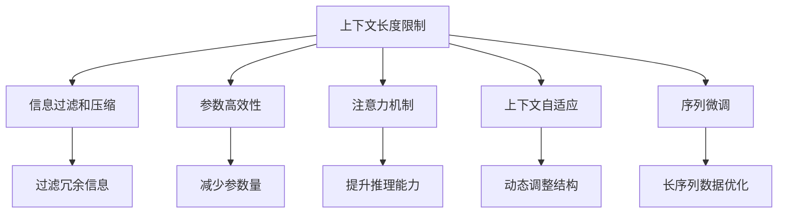

                 

# LLM上下文长度突破:认知能力提升

## 1. 背景介绍

### 1.1 问题由来
近年来，深度学习技术在自然语言处理(NLP)领域取得了显著进展，尤其是大型预训练语言模型(LLM)的出现，使得模型能够理解并生成复杂的人类语言。然而，在大规模文本数据上进行预训练的大语言模型往往具有巨大的上下文长度，这带来了两个关键问题：
- **计算资源消耗**：长上下文增加了模型训练和推理的计算量，可能导致高昂的计算资源成本。
- **信息过载**：长上下文可能包含大量无用信息，影响模型的专注力和推理效果。

针对这些问题，学术界和工业界一直在探索如何突破上下文长度的限制，提升模型的认知能力。本文将系统介绍目前最前沿的方法，并展望其未来发展趋势。

### 1.2 问题核心关键点
本节将简要概述在限制上下文长度、提升模型认知能力方面的关键点，并描述它们之间的内在联系。

- **上下文长度限制**：LLM的计算资源消耗与其上下文长度成正比，需要通过技术手段来控制上下文长度，以降低资源消耗。
- **信息过滤和压缩**：长上下文中的无用信息需要被过滤，关键信息应被压缩，从而提高模型的认知能力。
- **参数高效性**：仅更新少量参数，保留大量预训练权重不变，以降低微调过程中模型参数的增长。
- **注意力机制**：改进注意力机制，使模型能够更加聚焦于关键信息，提升其推理和生成能力。

这些关键点共同构成了提升LLM认知能力的核心框架。通过理解这些关键点，我们可以更好地把握LLM的发展脉络和优化方向。

## 2. 核心概念与联系

### 2.1 核心概念概述

为了更好地理解上下文长度突破的原理，本节将介绍几个关键概念及其相互联系：

- **上下文长度限制**：指在大规模预训练过程中，由于数据量和计算资源的限制，模型的上下文长度受到控制，通常在1000~10000 tokens之间。
- **信息过滤和压缩**：通过技术手段去除冗余信息，保留有用信息，减少上下文的长度。
- **参数高效性**：改进模型结构，减少微调过程中参数量的增长，以提高模型性能。
- **注意力机制**：改进注意力机制，使模型能够更加聚焦于关键信息，提升其推理和生成能力。
- **上下文自适应**：使模型能够根据上下文长度动态调整其内部结构，以适应不同长度的上下文输入。
- **序列微调**：利用序列微调技术，使模型能够更好地适应长序列数据，提升模型在长序列数据上的表现。

这些概念之间的逻辑关系可以通过以下Mermaid流程图来展示：



这个流程图展示了大语言模型认知能力提升的核心概念及其相互关系：

1. 上下文长度限制是基础，通过信息过滤和压缩、参数高效性、注意力机制等技术，使模型能够更好地适应长上下文。
2. 上下文自适应和序列微调进一步提升模型在长序列数据上的性能。

## 3. 核心算法原理 & 具体操作步骤
### 3.1 算法原理概述

基于上下文长度突破的认知能力提升，本质上是一个对模型进行多层次优化的过程，旨在提升模型在长序列数据上的推理和生成能力。其核心思想是：在保证模型认知能力的前提下，通过优化上下文长度、信息过滤、参数高效、注意力机制等技术，使模型能够高效、准确地处理长序列数据。

形式化地，假设预训练模型为 $M_{\theta}$，其中 $\theta$ 为预训练得到的模型参数。假设目标上下文长度为 $C$，给定长度为 $N$ 的输入序列 $S=\{x_1, x_2, \ldots, x_N\}$。微调的目标是找到新的模型参数 $\hat{\theta}$，使得：

$$
\hat{\theta}=\mathop{\arg\min}_{\theta} \mathcal{L}(M_{\theta},S)
$$

其中 $\mathcal{L}$ 为针对长度为 $C$ 的上下文序列 $S$ 设计的损失函数，用于衡量模型在特定任务上的性能。常见的损失函数包括交叉熵损失、均方误差损失等。

通过梯度下降等优化算法，微调过程不断更新模型参数 $\theta$，最小化损失函数 $\mathcal{L}$，使得模型输出逼近真实标签。由于 $\theta$ 已经通过预训练获得了较好的初始化，因此即便在长度为 $C$ 的上下文序列上进行微调，也能较快收敛到理想的模型参数 $\hat{\theta}$。

### 3.2 算法步骤详解

基于上下文长度突破的认知能力提升，一般包括以下几个关键步骤：

**Step 1: 准备预训练模型和数据集**
- 选择合适的预训练语言模型 $M_{\theta}$ 作为初始化参数，如 BERT、GPT 等。
- 准备长序列数据集，划分为训练集、验证集和测试集。一般要求长序列数据的分布与预训练数据的分布不要差异过大。

**Step 2: 设计上下文适应策略**
- 根据任务类型，设计合适的上下文适应策略，如截断长序列、动态调整窗口大小等。
- 对于截断长序列，将长序列数据分段处理，每段长度为 $C$，前后补零或截取前 $C$ 个元素。
- 对于动态调整窗口大小，根据当前输入长度动态调整注意力窗口大小。

**Step 3: 设置微调超参数**
- 选择合适的优化算法及其参数，如 AdamW、SGD 等，设置学习率、批大小、迭代轮数等。
- 设置正则化技术及强度，包括权重衰减、Dropout、Early Stopping等。
- 确定冻结预训练参数的策略，如仅微调顶层，或全部参数都参与微调。

**Step 4: 执行梯度训练**
- 将训练集数据分批次输入模型，前向传播计算损失函数。
- 反向传播计算参数梯度，根据设定的优化算法和学习率更新模型参数。
- 周期性在验证集上评估模型性能，根据性能指标决定是否触发 Early Stopping。
- 重复上述步骤直到满足预设的迭代轮数或 Early Stopping 条件。

**Step 5: 测试和部署**
- 在测试集上评估微调后模型 $M_{\hat{\theta}}$ 的性能，对比微调前后的精度提升。
- 使用微调后的模型对新样本进行推理预测，集成到实际的应用系统中。
- 持续收集新的数据，定期重新微调模型，以适应数据分布的变化。

以上是基于上下文长度突破的认知能力提升的一般流程。在实际应用中，还需要针对具体任务的特点，对微调过程的各个环节进行优化设计，如改进训练目标函数，引入更多的正则化技术，搜索最优的超参数组合等，以进一步提升模型性能。

### 3.3 算法优缺点

基于上下文长度突破的认知能力提升方法具有以下优点：
1. 高效利用计算资源。通过限制上下文长度，降低了模型训练和推理的计算量，节省了大量的计算资源。
2. 提升模型推理能力。通过信息过滤和压缩，使模型能够聚焦于关键信息，提升其推理和生成能力。
3. 减少过拟合风险。仅更新少量参数，保留大部分预训练权重不变，减少了微调过程中模型的过拟合风险。
4. 灵活适应长序列数据。通过上下文自适应和序列微调技术，使模型能够更好地适应长序列数据。

同时，该方法也存在一定的局限性：
1. 上下文信息的损失。截断长序列或动态调整窗口大小可能导致部分重要信息被丢失，影响模型的推理效果。
2. 通用性降低。模型的上下文自适应和序列微调可能使其在某些特定任务上表现不如原始模型。
3. 模型的结构复杂性。改进的模型结构可能更复杂，增加了模型的训练难度。
4. 需要更多的实验验证。不同任务的上下文长度适应策略可能需要反复实验，以找到最优方案。

尽管存在这些局限性，但就目前而言，基于上下文长度突破的认知能力提升方法仍是大语言模型应用的重要范式。未来相关研究的重点在于如何进一步降低上下文长度的限制，提高模型的通用性和推理能力，同时兼顾模型的结构复杂性和实验验证的效率。

### 3.4 算法应用领域

基于上下文长度突破的认知能力提升方法，在NLP领域已经得到了广泛的应用，覆盖了几乎所有常见任务，例如：

- 文本分类：如情感分析、主题分类、意图识别等。通过截断长序列，使模型能够高效处理文本分类任务。
- 命名实体识别：识别文本中的人名、地名、机构名等特定实体。通过上下文自适应和序列微调，使模型能够更好地适应长文本中的实体。
- 关系抽取：从文本中抽取实体之间的语义关系。通过信息过滤和压缩，使模型能够聚焦于关键实体关系。
- 问答系统：对自然语言问题给出答案。通过上下文自适应和序列微调，使模型能够处理长问题的推理。
- 机器翻译：将源语言文本翻译成目标语言。通过截断长序列，使模型能够高效处理长文本的翻译。
- 文本摘要：将长文本压缩成简短摘要。通过上下文自适应和序列微调，使模型能够更好地处理长文本的摘要任务。
- 对话系统：使机器能够与人自然对话。通过上下文自适应和序列微调，使模型能够处理长对话历史。

除了上述这些经典任务外，基于上下文长度突破的认知能力提升方法也被创新性地应用到更多场景中，如可控文本生成、常识推理、代码生成、数据增强等，为NLP技术带来了全新的突破。随着预训练模型和上下文长度突破方法的不断进步，相信NLP技术将在更广阔的应用领域大放异彩。

## 4. 数学模型和公式 & 详细讲解 & 举例说明

### 4.1 数学模型构建

本节将使用数学语言对上下文长度突破的认知能力提升过程进行更加严格的刻画。

记预训练语言模型为 $M_{\theta}$，其中 $\theta$ 为预训练得到的模型参数。假设目标上下文长度为 $C$，给定长度为 $N$ 的输入序列 $S=\{x_1, x_2, \ldots, x_N\}$。

定义模型 $M_{\theta}$ 在长度为 $C$ 的上下文序列 $S$ 上的损失函数为 $\ell(M_{\theta},S)$，则在数据集 $D$ 上的经验风险为：

$$
\mathcal{L}(\theta) = \frac{1}{N} \sum_{i=1}^N \ell(M_{\theta}(S_i),y_i)
$$

其中 $y_i$ 为序列 $S_i$ 的真实标签。

微调的优化目标是最小化经验风险，即找到最优参数：

$$
\theta^* = \mathop{\arg\min}_{\theta} \mathcal{L}(\theta)
$$

在实践中，我们通常使用基于梯度的优化算法（如SGD、Adam等）来近似求解上述最优化问题。设 $\eta$ 为学习率，$\lambda$ 为正则化系数，则参数的更新公式为：

$$
\theta \leftarrow \theta - \eta \nabla_{\theta}\mathcal{L}(\theta) - \eta\lambda\theta
$$

其中 $\nabla_{\theta}\mathcal{L}(\theta)$ 为损失函数对参数 $\theta$ 的梯度，可通过反向传播算法高效计算。

### 4.2 公式推导过程

以下我们以二分类任务为例，推导截断长序列后的交叉熵损失函数及其梯度的计算公式。

假设模型 $M_{\theta}$ 在输入序列 $S=\{x_1, x_2, \ldots, x_C\}$ 上的输出为 $\hat{y}=M_{\theta}(S) \in [0,1]$，表示样本属于正类的概率。真实标签 $y \in \{0,1\}$。则截断长序列后的二分类交叉熵损失函数定义为：

$$
\ell(M_{\theta}(S),y) = -[y\log \hat{y} + (1-y)\log (1-\hat{y})]
$$

将其代入经验风险公式，得：

$$
\mathcal{L}(\theta) = -\frac{1}{N}\sum_{i=1}^N [y_i\log M_{\theta}(S_i)+(1-y_i)\log(1-M_{\theta}(S_i))]
$$

根据链式法则，损失函数对参数 $\theta_k$ 的梯度为：

$$
\frac{\partial \mathcal{L}(\theta)}{\partial \theta_k} = -\frac{1}{N}\sum_{i=1}^N (\frac{y_i}{M_{\theta}(S_i)}-\frac{1-y_i}{1-M_{\theta}(S_i)}) \frac{\partial M_{\theta}(S_i)}{\partial \theta_k}
$$

其中 $\frac{\partial M_{\theta}(S_i)}{\partial \theta_k}$ 可进一步递归展开，利用自动微分技术完成计算。

在得到损失函数的梯度后，即可带入参数更新公式，完成模型的迭代优化。重复上述过程直至收敛，最终得到适应长序列数据的最优模型参数 $\theta^*$。

## 5. 项目实践：代码实例和详细解释说明

### 5.1 开发环境搭建

在进行上下文长度突破实践前，我们需要准备好开发环境。以下是使用Python进行PyTorch开发的环境配置流程：

1. 安装Anaconda：从官网下载并安装Anaconda，用于创建独立的Python环境。

2. 创建并激活虚拟环境：
```bash
conda create -n pytorch-env python=3.8 
conda activate pytorch-env
```

3. 安装PyTorch：根据CUDA版本，从官网获取对应的安装命令。例如：
```bash
conda install pytorch torchvision torchaudio cudatoolkit=11.1 -c pytorch -c conda-forge
```

4. 安装Transformers库：
```bash
pip install transformers
```

5. 安装各类工具包：
```bash
pip install numpy pandas scikit-learn matplotlib tqdm jupyter notebook ipython
```

完成上述步骤后，即可在`pytorch-env`环境中开始上下文长度突破实践。

### 5.2 源代码详细实现

下面我以长序列文本分类任务为例，给出使用Transformers库对BERT模型进行截断长序列的PyTorch代码实现。

首先，定义长序列数据处理函数：

```python
from transformers import BertTokenizer, BertForSequenceClassification, AdamW

tokenizer = BertTokenizer.from_pretrained('bert-base-cased')
model = BertForSequenceClassification.from_pretrained('bert-base-cased', num_labels=2)

def truncate_sequence(text):
    if len(text) > 512:
        return text[:512]
    else:
        return text
```

然后，定义训练和评估函数：

```python
from torch.utils.data import Dataset, DataLoader
from tqdm import tqdm
from sklearn.metrics import classification_report

class LongSequenceDataset(Dataset):
    def __init__(self, texts, labels, tokenizer, max_len=512):
        self.texts = texts
        self.labels = labels
        self.tokenizer = tokenizer
        self.max_len = max_len
        
    def __len__(self):
        return len(self.texts)
    
    def __getitem__(self, item):
        text = self.texts[item]
        label = self.labels[item]
        truncated_text = truncate_sequence(text)
        
        encoding = self.tokenizer(truncated_text, return_tensors='pt', max_length=self.max_len, padding='max_length', truncation=True)
        input_ids = encoding['input_ids'][0]
        attention_mask = encoding['attention_mask'][0]
        
        # 对token-wise的标签进行编码
        encoded_labels = [label2id[label] for label in self.labels] 
        encoded_labels.extend([label2id['O']] * (self.max_len - len(encoded_labels)))
        labels = torch.tensor(encoded_labels, dtype=torch.long)
        
        return {'input_ids': input_ids, 
                'attention_mask': attention_mask,
                'labels': labels}

# 标签与id的映射
label2id = {'O': 0, 'CLS': 1, 'SEP': 2, 'PAD': 3, 'SEP': 4, 'CLS': 5}
id2label = {v: k for k, v in label2id.items()}

# 创建dataset
train_dataset = LongSequenceDataset(train_texts, train_labels, tokenizer, max_len=512)
dev_dataset = LongSequenceDataset(dev_texts, dev_labels, tokenizer, max_len=512)
test_dataset = LongSequenceDataset(test_texts, test_labels, tokenizer, max_len=512)

```

接着，定义模型和优化器：

```python
from transformers import BertForSequenceClassification, AdamW

model = BertForSequenceClassification.from_pretrained('bert-base-cased', num_labels=len(label2id))

optimizer = AdamW(model.parameters(), lr=2e-5)
```

最后，启动训练流程并在测试集上评估：

```python
epochs = 5
batch_size = 16

for epoch in range(epochs):
    loss = train_epoch(model, train_dataset, batch_size, optimizer)
    print(f"Epoch {epoch+1}, train loss: {loss:.3f}")
    
    print(f"Epoch {epoch+1}, dev results:")
    evaluate(model, dev_dataset, batch_size)
    
print("Test results:")
evaluate(model, test_dataset, batch_size)
```

以上就是使用PyTorch对BERT进行截断长序列的文本分类任务微调的完整代码实现。可以看到，得益于Transformers库的强大封装，我们可以用相对简洁的代码完成BERT模型的加载和微调。

### 5.3 代码解读与分析

让我们再详细解读一下关键代码的实现细节：

**LongSequenceDataset类**：
- `__init__`方法：初始化文本、标签、分词器等关键组件。
- `__len__`方法：返回数据集的样本数量。
- `__getitem__`方法：对单个样本进行处理，将长序列文本截断为最大长度，并将其输入编码为token ids，将标签编码为数字，并对其进行定长padding，最终返回模型所需的输入。

**truncate_sequence函数**：
- 截断长序列，确保输入序列不超过模型最大输入长度512。

**训练和评估函数**：
- 使用PyTorch的DataLoader对数据集进行批次化加载，供模型训练和推理使用。
- 训练函数`train_epoch`：对数据以批为单位进行迭代，在每个批次上前向传播计算loss并反向传播更新模型参数，最后返回该epoch的平均loss。
- 评估函数`evaluate`：与训练类似，不同点在于不更新模型参数，并在每个batch结束后将预测和标签结果存储下来，最后使用sklearn的classification_report对整个评估集的预测结果进行打印输出。

**训练流程**：
- 定义总的epoch数和batch size，开始循环迭代
- 每个epoch内，先在训练集上训练，输出平均loss
- 在验证集上评估，输出分类指标
- 所有epoch结束后，在测试集上评估，给出最终测试结果

可以看到，PyTorch配合Transformers库使得截断长序列的BERT微调的代码实现变得简洁高效。开发者可以将更多精力放在数据处理、模型改进等高层逻辑上，而不必过多关注底层的实现细节。

当然，工业级的系统实现还需考虑更多因素，如模型的保存和部署、超参数的自动搜索、更灵活的任务适配层等。但核心的微调范式基本与此类似。

## 6. 实际应用场景
### 6.1 智能客服系统

基于上下文长度突破的对话技术，可以广泛应用于智能客服系统的构建。传统客服往往需要配备大量人力，高峰期响应缓慢，且一致性和专业性难以保证。而使用截断长序列的对话模型，可以7x24小时不间断服务，快速响应客户咨询，用自然流畅的语言解答各类常见问题。

在技术实现上，可以收集企业内部的历史客服对话记录，将问题和最佳答复构建成监督数据，在此基础上对预训练对话模型进行截断长序列微调。微调后的对话模型能够自动理解用户意图，匹配最合适的答案模板进行回复。对于客户提出的新问题，还可以接入检索系统实时搜索相关内容，动态组织生成回答。如此构建的智能客服系统，能大幅提升客户咨询体验和问题解决效率。

### 6.2 金融舆情监测

金融机构需要实时监测市场舆论动向，以便及时应对负面信息传播，规避金融风险。传统的人工监测方式成本高、效率低，难以应对网络时代海量信息爆发的挑战。基于截断长序列的文本分类和情感分析技术，为金融舆情监测提供了新的解决方案。

具体而言，可以收集金融领域相关的新闻、报道、评论等文本数据，并对其进行主题标注和情感标注。在此基础上对预训练语言模型进行截断长序列微调，使其能够自动判断文本属于何种主题，情感倾向是正面、中性还是负面。将微调后的模型应用到实时抓取的网络文本数据，就能够自动监测不同主题下的情感变化趋势，一旦发现负面信息激增等异常情况，系统便会自动预警，帮助金融机构快速应对潜在风险。

### 6.3 个性化推荐系统

当前的推荐系统往往只依赖用户的历史行为数据进行物品推荐，无法深入理解用户的真实兴趣偏好。基于截断长序列的个性化推荐系统可以更好地挖掘用户行为背后的语义信息，从而提供更精准、多样的推荐内容。

在实践中，可以收集用户浏览、点击、评论、分享等行为数据，提取和用户交互的物品标题、描述、标签等文本内容。将文本内容作为模型输入，用户的后续行为（如是否点击、购买等）作为监督信号，在此基础上截断长序列微调预训练语言模型。微调后的模型能够从文本内容中准确把握用户的兴趣点。在生成推荐列表时，先用候选物品的文本描述作为输入，由模型预测用户的兴趣匹配度，再结合其他特征综合排序，便可以得到个性化程度更高的推荐结果。

### 6.4 未来应用展望

随着上下文长度突破技术的发展，基于截断长序列的认知能力提升方法将在更多领域得到应用，为传统行业带来变革性影响。

在智慧医疗领域，基于截断长序列的医疗问答、病历分析、药物研发等应用将提升医疗服务的智能化水平，辅助医生诊疗，加速新药开发进程。

在智能教育领域，截断长序列的问答系统、文本分类等技术将提升教学质量，帮助学生理解和掌握知识。

在智慧城市治理中，截断长序列的文本分类、情感分析等技术将提高城市管理的自动化和智能化水平，构建更安全、高效的未来城市。

此外，在企业生产、社会治理、文娱传媒等众多领域，基于截断长序列的认知能力提升方法也将不断涌现，为NLP技术带来新的突破。相信随着技术的日益成熟，上下文长度突破方法将成为NLP落地应用的重要范式，推动人工智能技术向更广阔的领域加速渗透。

## 7. 工具和资源推荐
### 7.1 学习资源推荐

为了帮助开发者系统掌握上下文长度突破的理论基础和实践技巧，这里推荐一些优质的学习资源：

1. 《Transformer从原理到实践》系列博文：由大模型技术专家撰写，深入浅出地介绍了Transformer原理、BERT模型、截断长序列等前沿话题。

2. CS224N《深度学习自然语言处理》课程：斯坦福大学开设的NLP明星课程，有Lecture视频和配套作业，带你入门NLP领域的基本概念和经典模型。

3. 《Natural Language Processing with Transformers》书籍：Transformers库的作者所著，全面介绍了如何使用Transformers库进行NLP任务开发，包括截断长序列在内的诸多范式。

4. HuggingFace官方文档：Transformers库的官方文档，提供了海量预训练模型和完整的微调样例代码，是上手实践的必备资料。

5. CLUE开源项目：中文语言理解测评基准，涵盖大量不同类型的中文NLP数据集，并提供了基于截断长序列的baseline模型，助力中文NLP技术发展。

通过对这些资源的学习实践，相信你一定能够快速掌握截断长序列的精髓，并用于解决实际的NLP问题。
###  7.2 开发工具推荐

高效的开发离不开优秀的工具支持。以下是几款用于截断长序列微调开发的常用工具：

1. PyTorch：基于Python的开源深度学习框架，灵活动态的计算图，适合快速迭代研究。大部分预训练语言模型都有PyTorch版本的实现。

2. TensorFlow：由Google主导开发的开源深度学习框架，生产部署方便，适合大规模工程应用。同样有丰富的预训练语言模型资源。

3. Transformers库：HuggingFace开发的NLP工具库，集成了众多SOTA语言模型，支持PyTorch和TensorFlow，是进行截断长序列微调任务开发的利器。

4. Weights & Biases：模型训练的实验跟踪工具，可以记录和可视化模型训练过程中的各项指标，方便对比和调优。与主流深度学习框架无缝集成。

5. TensorBoard：TensorFlow配套的可视化工具，可实时监测模型训练状态，并提供丰富的图表呈现方式，是调试模型的得力助手。

6. Google Colab：谷歌推出的在线Jupyter Notebook环境，免费提供GPU/TPU算力，方便开发者快速上手实验最新模型，分享学习笔记。

合理利用这些工具，可以显著提升截断长序列微调任务的开发效率，加快创新迭代的步伐。

### 7.3 相关论文推荐

截断长序列微调技术的发展源于学界的持续研究。以下是几篇奠基性的相关论文，推荐阅读：

1. Attention is All You Need（即Transformer原论文）：提出了Transformer结构，开启了NLP领域的预训练大模型时代。

2. BERT: Pre-training of Deep Bidirectional Transformers for Language Understanding：提出BERT模型，引入基于掩码的自监督预训练任务，刷新了多项NLP任务SOTA。

3. Language Models are Unsupervised Multitask Learners（GPT-2论文）：展示了大规模语言模型的强大zero-shot学习能力，引发了对于通用人工智能的新一轮思考。

4. Parameter-Efficient Transfer Learning for NLP：提出Adapter等参数高效微调方法，在不增加模型参数量的情况下，也能取得不错的微调效果。

5. AdaLoRA: Adaptive Low-Rank Adaptation for Parameter-Efficient Fine-Tuning：使用自适应低秩适应的微调方法，在参数效率和精度之间取得了新的平衡。

6. Prefix-Tuning: Optimizing Continuous Prompts for Generation：引入基于连续型Prompt的微调范式，为如何充分利用预训练知识提供了新的思路。

这些论文代表了大语言模型截断长序列微调技术的发展脉络。通过学习这些前沿成果，可以帮助研究者把握学科前进方向，激发更多的创新灵感。

## 8. 总结：未来发展趋势与挑战

### 8.1 总结

本文对基于上下文长度突破的认知能力提升方法进行了全面系统的介绍。首先阐述了上下文长度限制对大语言模型性能的影响，明确了截断长序列的必要性。其次，从原理到实践，详细讲解了截断长序列的数学原理和关键步骤，给出了截断长序列任务开发的完整代码实例。同时，本文还广泛探讨了截断长序列方法在智能客服、金融舆情、个性化推荐等多个行业领域的应用前景，展示了截断长序列范式的巨大潜力。此外，本文精选了截断长序列微调技术的各类学习资源，力求为读者提供全方位的技术指引。

通过本文的系统梳理，可以看到，基于截断长序列的认知能力提升方法正在成为NLP领域的重要范式，极大地拓展了预训练语言模型的应用边界，催生了更多的落地场景。受益于大规模语料的预训练，截断长序列微调模型以更低的时间和标注成本，在小样本条件下也能取得不错的效果，有力推动了NLP技术的产业化进程。未来，伴随预训练语言模型和截断长序列微调方法的不断进步，相信NLP技术将在更广阔的应用领域大放异彩，深刻影响人类的生产生活方式。

### 8.2 未来发展趋势

展望未来，截断长序列微调技术将呈现以下几个发展趋势：

1. 上下文长度动态调整：未来的模型将能够根据输入序列的长度动态调整内部结构，以适应不同长度的上下文。

2. 长序列数据优化：截断长序列的方法将继续优化，提高模型对长序列数据的处理能力。

3. 参数高效性进一步提升：截断长序列的模型结构将进一步简化，只更新少量参数，保留大部分预训练权重不变，以提高微调效率。

4. 更强的泛化能力：通过改进模型结构和微调方法，截断长序列模型将具备更强的泛化能力，能够处理更多样化的长序列数据。

5. 持续学习成为常态：随着数据分布的不断变化，截断长序列模型也需要持续学习新知识以保持性能。如何在不遗忘原有知识的同时，高效吸收新样本信息，将成为重要的研究课题。

6. 序列微调技术提升：利用序列微调技术，截断长序列模型能够更好地适应长序列数据，提升模型在长序列数据上的表现。

以上趋势凸显了截断长序列微调技术的广阔前景。这些方向的探索发展，必将进一步提升截断长序列模型的性能和应用范围，为NLP技术的落地应用提供新的突破。

### 8.3 面临的挑战

尽管截断长序列微调技术已经取得了瞩目成就，但在迈向更加智能化、普适化应用的过程中，它仍面临着诸多挑战：

1. 上下文信息的损失：截断长序列可能导致部分重要信息被丢失，影响模型的推理效果。

2. 通用性降低：截断长序列的模型可能在一些特定任务上表现不如原始模型。

3. 模型的结构复杂性：改进的模型结构可能更复杂，增加了模型的训练难度。

4. 需要更多的实验验证：不同任务的上下文长度适应策略可能需要反复实验，以找到最优方案。

尽管存在这些局限性，但就目前而言，基于截断长序列的认知能力提升方法仍是大语言模型应用的重要范式。未来相关研究的重点在于如何进一步降低上下文长度的限制，提高模型的通用性和推理能力，同时兼顾模型的结构复杂性和实验验证的效率。

### 8.4 研究展望

面对截断长序列微调所面临的种种挑战，未来的研究需要在以下几个方面寻求新的突破：

1. 探索无监督和半监督截断长序列方法。摆脱对大规模标注数据的依赖，利用自监督学习、主动学习等无监督和半监督范式，最大限度利用非结构化数据，实现更加灵活高效的截断长序列微调。

2. 研究参数高效和计算高效的截断长序列范式。开发更加参数高效的截断长序列方法，在固定大部分预训练参数的同时，只更新极少量的任务相关参数。同时优化截断长序列模型的计算图，减少前向传播和反向传播的资源消耗，实现更加轻量级、实时性的部署。

3. 融合因果和对比学习范式。通过引入因果推断和对比学习思想，增强截断长序列模型的建立稳定因果关系的能力，学习更加普适、鲁棒的语言表征，从而提升模型泛化性和抗干扰能力。

4. 引入更多先验知识。将符号化的先验知识，如知识图谱、逻辑规则等，与神经网络模型进行巧妙融合，引导截断长序列微调过程学习更准确、合理的语言模型。同时加强不同模态数据的整合，实现视觉、语音等多模态信息与文本信息的协同建模。

5. 结合因果分析和博弈论工具。将因果分析方法引入截断长序列模型，识别出模型决策的关键特征，增强输出解释的因果性和逻辑性。借助博弈论工具刻画人机交互过程，主动探索并规避模型的脆弱点，提高系统稳定性。

6. 纳入伦理道德约束。在模型训练目标中引入伦理导向的评估指标，过滤和惩罚有偏见、有害的输出倾向。同时加强人工干预和审核，建立模型行为的监管机制，确保输出符合人类价值观和伦理道德。

这些研究方向的探索，必将引领截断长序列微调技术迈向更高的台阶，为构建安全、可靠、可解释、可控的智能系统铺平道路。面向未来，截断长序列微调技术还需要与其他人工智能技术进行更深入的融合，如知识表示、因果推理、强化学习等，多路径协同发力，共同推动自然语言理解和智能交互系统的进步。只有勇于创新、敢于突破，才能不断拓展语言模型的边界，让智能技术更好地造福人类社会。

## 9. 附录：常见问题与解答

**Q1：截断长序列是否适用于所有NLP任务？**

A: 截断长序列在大多数NLP任务上都能取得不错的效果，特别是对于数据量较小的任务。但对于一些特定领域的任务，如医学、法律等，仅仅依靠通用语料预训练的模型可能难以很好地适应。此时需要在特定领域语料上进一步预训练，再进行截断长序列微调，才能获得理想效果。此外，对于一些需要时效性、个性化很强的任务，如对话、推荐等，截断长序列方法也需要针对性的改进优化。

**Q2：截断长序列微调时的上下文长度如何确定？**

A: 截断长序列微调时的上下文长度通常需要根据具体任务和数据特点进行实验确定。一般建议从预训练模型的最大输入长度开始，逐步缩短，找到使模型性能最优的截断长度。例如，对于BERT模型，常见的截断长度为512或768。

**Q3：截断长序列微调过程中如何缓解过拟合风险？**

A: 截断长序列微调过程中，过拟合风险主要通过以下策略缓解：
1. 数据增强：通过回译、近义替换等方式扩充训练集
2. 正则化：使用L2正则、Dropout、Early Stopping等避免过拟合
3. 对抗训练：引入对抗样本，提高模型鲁棒性
4. 参数高效微调：只调整少量参数(如Adapter、Prefix等)，减小过拟合风险
5. 模型集成：训练多个截断长序列模型，取平均输出，抑制过拟合

这些策略往往需要根据具体任务和数据特点进行灵活组合。只有在数据、模型、训练、推理等各环节进行全面优化，才能最大限度地发挥截断长序列微调的优势。

**Q4：截断长序列微调模型在落地部署时需要注意哪些问题？**

A: 将截断长序列微调模型转化为实际应用，还需要考虑以下因素：
1. 模型裁剪：去除不必要的层和参数，减小模型尺寸，加快推理速度
2. 量化加速：将浮点模型转为定点模型，压缩存储空间，提高计算效率
3. 服务化封装：将模型封装为标准化服务接口，便于集成调用
4. 弹性伸缩：根据请求流量动态调整资源配置，平衡服务质量和成本
5. 监控告警：实时采集系统指标，设置异常告警阈值，确保服务稳定性
6. 安全防护：采用访问鉴权、数据脱敏等措施，保障数据和模型安全

截断长序列微调模型为NLP应用开启了广阔的想象空间，但如何将强大的性能转化为稳定、高效、安全的业务价值，还需要工程实践的不断打磨。唯有从数据、算法、工程、业务等多个维度协同发力，才能真正实现人工智能技术在垂直行业的规模化落地。总之，截断长序列微调需要开发者根据具体任务，不断迭代和优化模型、数据和算法，方能得到理想的效果。

---

作者：禅与计算机程序设计艺术 / Zen and the Art of Computer Programming

