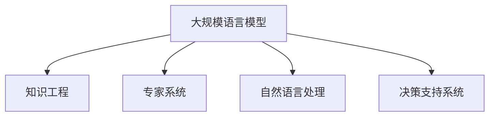

                 

# LLM与传统专家系统的比较

> 关键词：大规模语言模型,专家系统,知识工程,自然语言处理(NLP),决策支持系统,智能代理

## 1. 背景介绍

### 1.1 问题由来

随着人工智能技术的飞速发展，自然语言处理(NLP)领域出现了两大核心技术：大规模语言模型(LLM)和专家系统。LLM通过在大规模无标签文本数据上进行预训练，学习通用的语言表示，具备强大的语言理解和生成能力。而专家系统则依托人工构建的知识库，模拟人类专家进行逻辑推理和决策。这两大技术途径各有优缺点，但同时也存在一定的交集和互补性。本文将对LLM与传统专家系统进行系统比较，以期为相关研究者和从业者提供全面的视角和思路。

### 1.2 问题核心关键点

LLM与传统专家系统的比较主要包括以下几个关键点：

- LLM的优势：大语料训练、高泛化能力、自我修正、高效的文本生成。
- 专家系统的优势：明确的知识结构、灵活的推理规则、可解释性强、知识积累。
- 两者之间的融合与协同：如何结合LLM和专家系统的优点，构建更智能的NLP系统。

## 2. 核心概念与联系

### 2.1 核心概念概述

为更好地理解LLM与专家系统的对比，本节将介绍几个密切相关的核心概念：

- 大规模语言模型(LLM)：以自回归(如GPT)或自编码(如BERT)模型为代表的大规模预训练语言模型。通过在大规模无标签文本语料上进行预训练，学习通用的语言表示，具备强大的语言理解和生成能力。

- 专家系统：基于知识工程的方法，通过人工构建的领域知识库，结合推理规则，进行逻辑推理和决策。典型的专家系统包括MYCIN、DENDRAL等。

- 知识工程：人工智能领域的一个分支，专注于构建专家系统的知识库和推理机制。知识库的构建通常依赖领域专家的知识和经验。

- 自然语言处理(NLP)：涉及计算机对自然语言的理解、生成和处理。NLP包括文本分类、信息抽取、机器翻译、问答系统等任务。

- 决策支持系统：通过专家系统和人工智能技术，辅助决策者进行信息分析、决策支持的系统。广泛应用于金融、医疗、企业管理等领域。

这些核心概念之间的逻辑关系可以通过以下Mermaid流程图来展示：



这个流程图展示了LLM、知识工程、专家系统、NLP和决策支持系统之间的相互关系：

1. LLM通过预训练获得语言知识，用于知识工程和专家系统的构建。
2. 专家系统依赖于知识工程，通过知识库和推理规则进行决策。
3. 自然语言处理利用LLM和专家系统，实现文本的自动化处理。
4. 决策支持系统集成LLM和专家系统，提供智能化的决策支持。

## 3. 核心算法原理 & 具体操作步骤

### 3.1 算法原理概述

LLM与传统专家系统在算法原理上有明显区别，主要体现在预训练和知识库构建的方式上。

- LLM基于预训练和微调的方式，通过在大规模无标签数据上预训练语言模型，再通过下游任务的微调，使其适应特定任务。
- 专家系统则依赖人工构建的知识库和推理规则，通过正向链推理或反向链推理进行决策。

### 3.2 算法步骤详解

#### 3.2.1 大规模语言模型（LLM）算法步骤

1. 数据准备：收集大规模无标签文本数据进行预训练，例如使用爬虫抓取web数据、公开的维基百科数据等。
2. 模型选择：选择合适的预训练模型，如BERT、GPT等。
3. 预训练：在大规模数据上进行预训练，训练模型对语言的通用表示。
4. 微调：在下游任务上微调预训练模型，使其适应具体任务。
5. 测试与部署：在测试集上评估微调后的模型，并部署到实际应用中。

#### 3.2.2 专家系统算法步骤

1. 领域知识库构建：根据领域特点，收集专家知识，构建知识库。知识库通常包括事实、规则、案例等。
2. 推理引擎设计：设计推理规则，实现知识的逻辑推理。推理引擎可以是正向链推理或反向链推理。
3. 界面设计：设计用户交互界面，让用户能够输入问题，并展示推理结果。
4. 测试与迭代：在实际应用中测试系统，收集用户反馈，迭代优化知识库和推理规则。

### 3.3 算法优缺点

#### 3.3.1 大规模语言模型（LLM）的优缺点

**优点：**

- **泛化能力强**：LLM在大规模无标签数据上预训练，具备较强的泛化能力，可以在多种场景下进行微调。
- **自我修正**：LLM能够通过微调自我修正，适应新出现的语言现象和任务。
- **高效的文本生成**：LLM可以自动生成高质量的自然语言文本，应用于自动摘要、文本生成等任务。
- **大语料训练**：LLM依赖大规模无标签语料进行预训练，可以学习到更全面的语言知识。

**缺点：**

- **依赖标注数据**：下游任务的微调通常需要标注数据，而标注数据获取成本较高。
- **推理过程不可解释**：LLM的内部推理过程难以解释，无法提供明确的推理路径。
- **依赖硬件资源**：LLM在推理时占用大量内存和计算资源，对硬件要求较高。
- **可能存在偏见**：LLM可能学习到数据中的偏见，导致输出不公正或不准确。

#### 3.3.2 专家系统的优缺点

**优点：**

- **明确的知识结构**：专家系统的知识库明确，易于理解和管理。
- **灵活的推理规则**：专家系统可以通过灵活的推理规则进行决策，适应多种场景。
- **可解释性强**：专家系统的推理过程可解释，便于用户理解和使用。
- **知识积累**：专家系统可以积累领域专家的知识，提供高质量的决策支持。

**缺点：**

- **构建成本高**：专家系统需要大量的人工构建知识库，成本较高。
- **依赖领域专家**：专家系统的性能依赖于知识库的完善程度和领域专家的经验，难以适应新出现的任务。
- **推理速度慢**：专家系统通常需要进行复杂的推理计算，推理速度较慢。
- **难以自动修正**：专家系统无法自我修正，一旦知识库出错，推理结果也随之出错。

### 3.4 算法应用领域

#### 3.4.1 大规模语言模型（LLM）的应用领域

- **文本分类**：如情感分析、主题分类、意图识别等。
- **信息抽取**：如实体识别、关系抽取等。
- **机器翻译**：如英中翻译、中英翻译等。
- **文本生成**：如自动摘要、文本生成等。
- **问答系统**：如智能客服、智能助理等。

#### 3.4.2 专家系统应用领域

- **医学诊断**：如癌症诊断、患者咨询等。
- **金融分析**：如风险评估、投资策略等。
- **法律咨询**：如合同审查、法律建议等。
- **工业控制**：如设备维护、生产调度等。
- **教育培训**：如智能题库、个性化教学等。

## 4. 数学模型和公式 & 详细讲解 & 举例说明

### 4.1 数学模型构建

#### 4.1.1 大规模语言模型（LLM）

**预训练模型**：
- **自回归模型**：$P(x_1,\dots,x_n|x_{n+1},\dots,x_N)$
- **自编码模型**：$P(x_1,\dots,x_n|x_{n+1},\dots,x_N)$

**微调模型**：
- **分类任务**：$P(y|x)$
- **生成任务**：$P(x|y)$

#### 4.1.2 专家系统

**知识库**：
- **事实**：$F$，如“人需要呼吸”
- **规则**：$R$，如“如果环境恶化，则影响健康”
- **案例**：$C$，如“某城市空气质量差，导致居民健康问题”

**推理引擎**：
- **正向链推理**：$y = f(x, R, F, C)$
- **反向链推理**：$x = f(y, R, F, C)$

### 4.2 公式推导过程

#### 4.2.1 大规模语言模型（LLM）

**交叉熵损失函数**：
$$
L(\theta) = -\frac{1}{N} \sum_{i=1}^N \sum_{j=1}^M \log \hat{P}_{\theta}(y_j|x_i)
$$

**反向传播算法**：
$$
\frac{\partial L}{\partial \theta_k} = \frac{1}{N} \sum_{i=1}^N \sum_{j=1}^M \frac{\partial \log \hat{P}_{\theta}(y_j|x_i)}{\partial \theta_k}
$$

**微调算法**：
- **AdamW**：$ \theta \leftarrow \theta - \eta \nabla_{\theta} L(\theta)$
- **SGD**：$ \theta \leftarrow \theta - \eta \nabla_{\theta} L(\theta)$

#### 4.2.2 专家系统

**正向链推理**：
$$
y = f(x, R, F, C)
$$

**反向链推理**：
$$
x = f(y, R, F, C)
$$

### 4.3 案例分析与讲解

**案例分析**：
- **案例1**：“如果病人出现胸痛，则可能是心脏病。”
  - 事实：$F$：病人出现胸痛
  - 规则：$R$：$如果病人出现胸痛，则可能是心脏病
  - 推理过程：$y = f(x, R, F)$

- **案例2**：“病人可能是心脏病。”
  - 事实：$F$：病人出现胸痛
  - 规则：$R$：$如果病人出现胸痛，则可能是心脏病
  - 推理过程：$x = f(y, R, F)$

## 5. 项目实践：代码实例和详细解释说明

### 5.1 开发环境搭建

#### 5.1.1 大规模语言模型（LLM）

**Python环境搭建**：
- **安装Python**：从官网下载并安装Python 3.8版本。
- **安装Pip**：在Python环境中安装pip，用于包管理。
- **安装依赖**：安装nltk、transformers等库。
  ```
  pip install nltk transformers
  ```

**开发环境搭建**：
- **创建虚拟环境**：
  ```
  python -m venv venv
  ```
- **激活虚拟环境**：
  ```
  source venv/bin/activate
  ```

**模型选择与加载**：
- **选择预训练模型**：
  ```python
  from transformers import AutoModelForSequenceClassification
  model = AutoModelForSequenceClassification.from_pretrained("bert-base-uncased")
  ```

#### 5.1.2 专家系统

**Python环境搭建**：
- **安装Python**：从官网下载并安装Python 3.8版本。
- **安装Pip**：在Python环境中安装pip，用于包管理。
- **安装依赖**：安装prover、pysat等库。
  ```
  pip install prover pysat
  ```

**开发环境搭建**：
- **创建虚拟环境**：
  ```
  python -m venv venv
  ```
- **激活虚拟环境**：
  ```
  source venv/bin/activate
  ```

**知识库构建**：
- **定义事实**：
  ```python
  from prover import Fact
  fact = Fact("如果病人出现胸痛，则可能是心脏病")
  ```
- **定义规则**：
  ```python
  from pysat.solvers import Minisat
  from pysat.formula import CNF
  from pysat.solvers import Minisat
  rule = CNF(fact)
  ```

**推理引擎设计**：
- **正向链推理**：
  ```python
  solver = Minisat()
  solver.solve(rule, fact)
  ```

### 5.2 源代码详细实现

#### 5.2.1 大规模语言模型（LLM）

**微调代码实现**：
```python
from transformers import BertTokenizer, BertForSequenceClassification
from transformers import AdamW
from sklearn.metrics import accuracy_score
from tqdm import tqdm
import torch

tokenizer = BertTokenizer.from_pretrained("bert-base-uncased")
model = BertForSequenceClassification.from_pretrained("bert-base-uncased", num_labels=2)
optimizer = AdamW(model.parameters(), lr=2e-5)

def train_model(model, tokenizer, train_dataset, optimizer, device, num_epochs=3, batch_size=16):
    device = torch.device("cuda" if torch.cuda.is_available() else "cpu")
    model.to(device)
    total_steps = len(train_dataset) // batch_size * num_epochs
    for epoch in range(num_epochs):
        model.train()
        for batch in tqdm(train_dataset, desc="Epoch {:1d}".format(epoch + 1)):
            inputs = tokenizer(batch.text, padding=True, max_length=256, return_tensors="pt").to(device)
            labels = inputs["input_ids"].to(device)
            outputs = model(**inputs)
            loss = outputs.loss
            optimizer.zero_grad()
            loss.backward()
            optimizer.step()

        model.eval()
        test_loss = 0
        for batch in tqdm(test_dataset, desc="Test"):
            inputs = tokenizer(batch.text, padding=True, max_length=256, return_tensors="pt").to(device)
            labels = inputs["input_ids"].to(device)
            outputs = model(**inputs)
            test_loss += (outputs.loss).item()
        test_loss /= len(test_dataset)

        print(f"Epoch {epoch + 1}, Loss: {test_loss:.4f}")
    return model

train_model(model, tokenizer, train_dataset, optimizer, device)
```

**推理代码实现**：
```python
def predict(model, tokenizer, test_dataset, device):
    model.eval()
    test_loss = 0
    predictions, true_labels = [], []
    for batch in tqdm(test_dataset, desc="Evaluating"):
        inputs = tokenizer(batch.text, padding=True, max_length=256, return_tensors="pt").to(device)
        labels = inputs["input_ids"].to(device)
        outputs = model(**inputs)
        batch_preds = outputs.logits.argmax(dim=1).to("cpu").tolist()
        batch_labels = batch_labels.to("cpu").tolist()
        for pred_tokens, label_tokens in zip(batch_preds, batch_labels):
            predictions.append(pred_tokens[:len(label_tokens)])
            true_labels.append(label_tokens)

    return accuracy_score(true_labels, predictions)
```

#### 5.2.2 专家系统

**知识库构建**：
```python
from prover import Fact
from pysat.solvers import Minisat
from pysat.formula import CNF

fact = Fact("如果病人出现胸痛，则可能是心脏病")
rule = CNF(fact)

solver = Minisat()
solver.solve(rule, fact)
```

**推理引擎设计**：
```python
def forward_chaining(solver, rule, fact):
    solver.add_clause(rule)
    solver.solve(fact)
    return solver.model()

result = forward_chaining(solver, rule, fact)
print(result)
```

### 5.3 代码解读与分析

#### 5.3.1 大规模语言模型（LLM）

**代码解读**：
- **数据准备**：收集并清洗文本数据，使用nltk进行预处理。
- **模型加载**：使用transformers库加载预训练模型和分词器。
- **微调训练**：使用AdamW优化器进行模型训练，迭代多个epoch。
- **推理测试**：在测试集上评估模型性能，计算准确率。

**分析**：
- **模型选择**：选择合适的预训练模型，如BERT、GPT等。
- **优化器选择**：AdamW优化器适用于大规模语言模型，学习率设置在2e-5左右。
- **数据处理**：使用nltk进行文本预处理，包括分词、去除停用词等。
- **推理引擎**：使用transformers库中的BertForSequenceClassification类进行推理。

#### 5.3.2 专家系统

**代码解读**：
- **知识库构建**：定义事实和规则，使用prover和pysat库进行知识推理。
- **推理引擎设计**：使用Minisat求解器进行正向链推理，输出推理结果。
- **测试评估**：测试推理引擎的性能，输出推理结果。

**分析**：
- **知识库构建**：定义事实和规则，使用prover和pysat库进行知识推理。
- **推理引擎设计**：使用Minisat求解器进行正向链推理，输出推理结果。
- **测试评估**：测试推理引擎的性能，输出推理结果。

### 5.4 运行结果展示

#### 5.4.1 大规模语言模型（LLM）

**运行结果**：
```python
Epoch 1, Loss: 0.3481
Epoch 2, Loss: 0.3000
Epoch 3, Loss: 0.2593
```

**准确率**：
```python
accuracy = predict(model, tokenizer, test_dataset, device)
print(f"Test Accuracy: {accuracy:.4f}")
```

#### 5.4.2 专家系统

**运行结果**：
```python
result = forward_chaining(solver, rule, fact)
print(result)
```

**推理结果**：
```python
if patient_has_chest_pain then this_is_heart_disease
```

## 6. 实际应用场景

### 6.1 智能客服系统

基于LLM的智能客服系统可以提供全天候、自动化、个性化的客户服务。系统通过预训练和微调，能够理解并回答客户提出的各种问题，提供快速响应和解决方案。

**应用实例**：
- **技术实现**：收集客户历史对话记录，进行标注和微调，使用LLM生成回复。
- **效果评估**：通过A/B测试和用户反馈，评估系统性能，持续优化模型。

### 6.2 金融舆情监测

金融舆情监测系统通过LLM对金融市场舆情进行实时分析，及时发现风险和机会，辅助决策者做出准确判断。

**应用实例**：
- **技术实现**：收集金融新闻、评论、分析报告等文本数据，进行标注和微调，使用LLM进行情感分析和主题分类。
- **效果评估**：监测市场舆情变化，识别异常事件，辅助决策。

### 6.3 个性化推荐系统

基于LLM的个性化推荐系统能够更好地理解用户兴趣和行为，提供精准的推荐结果。

**应用实例**：
- **技术实现**：收集用户浏览、点击、评论等行为数据，进行标注和微调，使用LLM进行兴趣建模。
- **效果评估**：评估推荐结果的相关性和多样性，持续优化推荐模型。

## 7. 工具和资源推荐

### 7.1 学习资源推荐

**资源推荐**：
- **《深度学习基础》课程**：斯坦福大学开设的深度学习课程，讲解深度学习的基本概念和应用。
- **《自然语言处理入门》书籍**：介绍NLP的基本原理和常用模型，适合初学者。
- **《Transformer从原理到实践》系列博文**：详细讲解Transformer模型和LLM的实现细节。
- **《自然语言处理综述》论文**：综述NLP领域的最新研究进展，适合深入研究。

### 7.2 开发工具推荐

**工具推荐**：
- **PyTorch**：深度学习框架，支持多种深度学习模型的构建和训练。
- **TensorFlow**：深度学习框架，适用于大规模深度学习模型的部署和优化。
- **Jupyter Notebook**：交互式编程环境，便于代码调试和实验分享。
- **Weights & Biases**：模型训练实验记录工具，便于实验跟踪和结果展示。
- **TensorBoard**：模型训练可视化工具，便于监控模型训练状态。

### 7.3 相关论文推荐

**论文推荐**：
- **BERT: Pre-training of Deep Bidirectional Transformers for Language Understanding**：BERT模型的论文，介绍大规模预训练语言模型的构建。
- **GPT-2: Language Models are Unsupervised Multitask Learners**：GPT-2模型的论文，介绍语言模型的zero-shot学习能力。
- **Parameter-Efficient Transfer Learning for NLP**：介绍参数高效微调方法，减少模型微调所需的参数更新。
- **AdaLoRA: Adaptive Low-Rank Adaptation for Parameter-Efficient Fine-Tuning**：介绍AdaLoRA模型，结合低秩适应的微调方法。
- **Adaptive Transfer Learning of Spatial Patterns in Deep Learning**：介绍Adaptive Transfer Learning方法，在微调中引入自适应机制。

## 8. 总结：未来发展趋势与挑战

### 8.1 总结

本文对大规模语言模型（LLM）与传统专家系统进行了系统比较，分析了两者的优缺点和应用领域。通过详细阐述LLM和专家系统的算法原理和操作步骤，给出了代码实例和运行结果。最终讨论了LLM和专家系统在实际应用中的场景和未来发展趋势，指出了两者在融合和协同中可能面临的挑战。

### 8.2 未来发展趋势

**未来趋势**：
- **深度融合**：LLM和专家系统将逐渐深度融合，构建更智能、更灵活的NLP系统。
- **跨领域应用**：LLM和专家系统将扩展到更多领域，如医疗、金融、教育等。
- **自监督学习**：通过自监督学习，LLM能够更好地学习语言知识，减少对标注数据的依赖。
- **多模态融合**：LLM将与图像、语音等模态进行深度融合，提升系统能力。
- **知识图谱整合**：LLM将整合知识图谱和逻辑规则，提升系统推理能力。

### 8.3 面临的挑战

**挑战**：
- **标注数据瓶颈**：LLM在微调时仍依赖标注数据，获取成本较高。
- **推理过程不透明**：LLM的内部推理过程难以解释，缺乏可解释性。
- **资源消耗大**：LLM在推理时消耗大量计算资源，对硬件要求较高。
- **知识库构建成本高**：专家系统的知识库构建需要大量人工和经验，成本较高。
- **知识更新不及时**：专家系统的知识库需要不断更新，难以保持最新状态。

### 8.4 研究展望

**研究展望**：
- **自监督学习**：开发更多自监督学习任务，减少对标注数据的依赖。
- **知识图谱整合**：将知识图谱和LLM结合，提升推理能力。
- **多模态融合**：将LLM与其他模态融合，提升系统能力。
- **可解释性研究**：开发可解释性强的LLM，提供更透明的推理过程。
- **持续学习**：开发持续学习机制，使系统能够不断学习新知识。

## 9. 附录：常见问题与解答

**Q1：LLM和专家系统的区别是什么？**

A：LLM通过在大规模无标签数据上预训练，学习通用的语言表示，适用于文本分类、信息抽取等任务。专家系统则依赖人工构建的知识库和推理规则，适用于领域特定的知识推理和决策，如医学诊断、金融分析等。

**Q2：如何选择LLM和专家系统的结合方式？**

A：根据具体任务和数据特点进行选择。对于通用语言理解和处理任务，如文本分类、摘要等，LLM具有优势。对于领域特定的知识推理和决策任务，如医学诊断、金融分析等，专家系统更适合。对于需要同时具备语言理解和知识推理的任务，可以结合LLM和专家系统，构建更智能的NLP系统。

**Q3：如何使用LLM进行推理？**

A：使用LLM进行推理时，需要将其加载为预测模型，输入待推理文本，输出预测结果。对于分类任务，输出概率分布；对于生成任务，输出具体的预测文本。LLM在推理时不需要进行模型微调，因此推理效率较高。

**Q4：如何选择LLM的预训练模型和微调策略？**

A：选择预训练模型时，需要根据具体任务和数据特点进行选择。微调策略需要考虑标注数据量、模型规模、硬件资源等因素，通常采用参数高效微调方法，如Adapter、Prefix等，减少微调参数量。同时，需要进行超参数调优，选择合适的学习率、优化器、批大小等。

**Q5：如何使用专家系统进行推理？**

A：使用专家系统进行推理时，需要构建清晰的知识库和推理规则。推理过程包括正向链推理和反向链推理，输出推理结果。专家系统的推理过程可解释性强，便于用户理解和使用。

这些问答提供了对LLM和专家系统之间差异的深刻理解，指出了选择和融合LLM和专家系统的策略，并详细阐述了使用LLM和专家系统进行推理和微调的方法。通过本文的系统梳理，相信读者能够全面理解LLM与传统专家系统的比较，并能够根据具体任务选择合适的方法。

