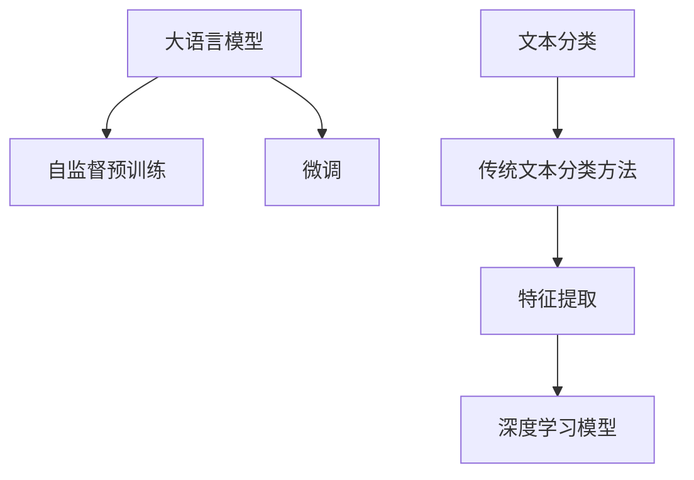

                 

# LLM与传统文本分类方法的对比

大语言模型（Large Language Model, LLM）以其强大的文本理解和生成能力，成为自然语言处理（Natural Language Processing, NLP）领域的新宠。但相比于传统文本分类方法，LLM在实际应用中仍然面临一些挑战。本文将深入探讨LLM与传统文本分类方法的异同，从原理、效果和应用场景等多个角度进行分析，希望能为读者提供一个全面的视角。

## 1. 背景介绍

### 1.1 问题由来

传统文本分类方法主要基于机器学习模型，如朴素贝叶斯（Naive Bayes）、支持向量机（Support Vector Machine, SVM）、随机森林（Random Forest）等。这些方法通过特征提取、模型训练和预测等步骤，将输入文本转化为类别标签。而大语言模型，如BERT、GPT-3等，则是基于大规模无标签文本数据进行自监督预训练，学习通用的语言表示，再在特定任务上进行有监督微调。

LLM的出现，让文本分类等任务的处理方式发生了巨大变革。一方面，LLM能够更好地捕捉文本中的语义信息，另一方面，其庞大的参数规模和复杂的模型结构也对计算资源提出了更高的要求。因此，如何对比LLM与传统文本分类方法，评估其在实际应用中的优劣，成为当前研究的一个重要课题。

### 1.2 问题核心关键点

传统文本分类方法与LLM在多个维度上存在差异，如数据依赖、计算资源、效果评估等。本文将重点从以下几个方面进行对比分析：

- 数据依赖程度
- 计算资源需求
- 模型效果与可解释性
- 实际应用场景与未来发展方向

## 2. 核心概念与联系

### 2.1 核心概念概述

在对比之前，我们先梳理一些核心概念：

- **大语言模型（LLM）**：如BERT、GPT-3等，通过大规模无标签文本数据进行自监督预训练，学习通用的语言表示，并在特定任务上进行微调。
- **文本分类**：将输入文本归为预定义的类别标签，是NLP领域的一项重要任务。
- **特征提取**：传统文本分类方法基于手工设计的特征提取方法，如词袋模型、TF-IDF等。
- **深度学习模型**：如卷积神经网络（Convolutional Neural Network, CNN）、循环神经网络（Recurrent Neural Network, RNN）等，常用于文本分类任务。

这些概念之间存在紧密联系，大语言模型可以看作是一种高级的深度学习模型，能够更好地捕捉文本的语义信息，而文本分类则是其下游任务之一。

### 2.2 核心概念原理和架构的 Mermaid 流程图



这个流程图展示了LLM与传统文本分类方法之间的联系与区别：

1. 大语言模型通过自监督预训练获得通用的语言表示。
2. 通过微调过程适应特定任务，如文本分类。
3. 传统文本分类方法则直接基于手工设计的特征提取方法进行模型训练。
4. 深度学习模型是文本分类任务中常用的模型结构。

## 3. 核心算法原理 & 具体操作步骤

### 3.1 算法原理概述

大语言模型与传统文本分类方法的核心区别在于数据依赖程度和模型结构。

**LLM的原理**：
- **自监督预训练**：通过无标签文本数据进行预训练，学习通用的语言表示。
- **微调**：在特定任务上进行有监督微调，适应任务需求。
- **表示学习**：通过神经网络模型学习文本的语义表示，从而进行分类。

**传统文本分类方法**：
- **特征提取**：手工设计特征，如词袋模型、TF-IDF等。
- **模型训练**：使用手工设计的特征训练深度学习模型，如CNN、RNN等。
- **分类**：将输入文本映射到预定义的类别标签。

### 3.2 算法步骤详解

#### 3.2.1 LLM的微调步骤

1. **准备预训练模型和数据集**：选择合适的预训练模型，如BERT、GPT-3等，准备下游任务的标注数据集。
2. **添加任务适配层**：在预训练模型的顶层添加分类器或解码器，适应任务需求。
3. **设置微调超参数**：选择合适的优化算法及其参数，如AdamW、SGD等，设置学习率、批大小、迭代轮数等。
4. **执行梯度训练**：通过前向传播计算损失函数，反向传播计算参数梯度，并根据优化算法更新模型参数。
5. **测试和部署**：在测试集上评估微调后的模型性能，并将其部署到实际应用中。

#### 3.2.2 传统文本分类方法的步骤

1. **特征提取**：手工设计文本特征，如词袋模型、TF-IDF等。
2. **模型训练**：使用提取的特征训练深度学习模型，如CNN、RNN等。
3. **分类**：将输入文本映射到预定义的类别标签。
4. **评估**：在测试集上评估模型性能。

### 3.3 算法优缺点

**LLM的优点**：
- **语义理解能力强**：能够更好地捕捉文本中的语义信息。
- **适应性强**：通过微调可以适应不同领域的任务需求。
- **效果显著**：在许多任务上取得了最先进的效果。

**LLM的缺点**：
- **计算资源需求高**：庞大的参数规模和复杂的模型结构需要大量的计算资源。
- **可解释性不足**：黑盒模型难以解释内部工作机制。
- **过拟合风险**：模型参数过多，容易导致过拟合。

**传统文本分类方法的优点**：
- **计算资源需求低**：手工设计的特征提取方法简单高效。
- **可解释性强**：基于规则的模型易于理解和解释。
- **适用于多种任务**：广泛用于文本分类、情感分析、命名实体识别等任务。

**传统文本分类方法的缺点**：
- **语义理解能力弱**：手工设计的特征无法全面捕捉文本的语义信息。
- **适应性差**：模型结构固定，难以适应新任务和新领域。
- **效果一般**：相比于LLM，传统方法在一些复杂任务上的效果较为有限。

### 3.4 算法应用领域

LLM和传统文本分类方法在实际应用中各有优势，适用于不同的场景：

- **LLM的应用场景**：
  - **领域特定的高要求任务**：如法律文书分类、医疗文本分类等，需要模型具备强大的语义理解能力。
  - **跨领域任务**：如多语言翻译、跨语言文本分类等，需要模型具备跨领域迁移能力。
  - **个性化推荐**：如电商推荐、内容推荐等，需要模型具备高效的推理能力。

- **传统文本分类方法的应用场景**：
  - **通用文本分类**：如新闻分类、评论分类等，特征提取方法简单高效。
  - **多类别分类**：如情感分析、主题分类等，模型结构灵活。
  - **高可解释性场景**：如医疗诊断、法律审查等，需要模型易于理解和解释。

## 4. 数学模型和公式 & 详细讲解 & 举例说明

### 4.1 数学模型构建

**LLM的数学模型**：
- **预训练阶段**：通过自监督任务（如掩码语言模型）进行预训练，学习通用的语言表示。
- **微调阶段**：在特定任务上，通过有监督训练调整模型参数。

**传统文本分类方法的数学模型**：
- **特征提取**：手工设计特征，如词袋模型、TF-IDF等。
- **模型训练**：使用手工设计的特征训练深度学习模型，如CNN、RNN等。

### 4.2 公式推导过程

**LLM的公式推导**：
- **掩码语言模型**：
  $$
  \mathcal{L}_{mask} = -\frac{1}{N} \sum_{i=1}^N \sum_{j=1}^M log P(x_j | x_{1...j-1}, x_{j+1...N})
  $$
- **微调阶段的损失函数**：
  $$
  \mathcal{L}_{fine-tune} = \frac{1}{N} \sum_{i=1}^N \ell(M_{\theta}(x_i),y_i)
  $$

**传统文本分类方法的公式推导**：
- **词袋模型**：
  $$
  P(w | c) = \frac{n_w}{\sum_{w \in V} n_w}
  $$
  其中，$n_w$ 表示词汇表$V$中单词$w$在类别$c$下出现的次数。
- **CNN模型的损失函数**：
  $$
  \mathcal{L}_{CNN} = \frac{1}{N} \sum_{i=1}^N \ell(y_i, f_{CNN}(x_i))
  $$
  其中，$\ell$ 为交叉熵损失函数，$f_{CNN}$ 为CNN模型对文本的分类结果。

### 4.3 案例分析与讲解

**案例分析**：
- **情感分析**：
  - **LLM**：通过微调BERT模型，可以更好地捕捉文本中的情感倾向，提高情感分类的准确率。
  - **传统方法**：使用词袋模型提取特征，训练简单的SVM或随机森林模型，效果一般。
  
- **命名实体识别**：
  - **LLM**：通过微调BERT模型，可以学习到更精确的实体边界和类型信息，识别准确率较高。
  - **传统方法**：使用基于规则的特征提取方法，如IOB标签标注，难以处理复杂实体类型。

## 5. 项目实践：代码实例和详细解释说明

### 5.1 开发环境搭建

- **环境配置**：安装Python、PyTorch、TensorFlow等深度学习框架，以及BERT、GPT-3等预训练模型。
- **模型训练**：使用PyTorch或TensorFlow搭建文本分类模型，并进行训练。
- **模型评估**：在测试集上评估模型性能，使用scikit-learn等工具进行多指标评估。

### 5.2 源代码详细实现

**LLM的实现**：
```python
from transformers import BertTokenizer, BertForSequenceClassification
from torch.utils.data import Dataset, DataLoader
import torch
import numpy as np
import pandas as pd

# 数据处理
tokenizer = BertTokenizer.from_pretrained('bert-base-uncased')
def tokenize(text):
    return tokenizer.encode_plus(text, max_length=512, truncation=True, padding='max_length', return_tensors='pt')

class TextDataset(Dataset):
    def __init__(self, texts, labels):
        self.texts = texts
        self.labels = labels
        
    def __getitem__(self, index):
        text = self.texts[index]
        label = self.labels[index]
        input_ids = tokenize(text)['input_ids'].flatten()
        attention_mask = tokenize(text)['attention_mask'].flatten()
        return {'input_ids': input_ids, 'attention_mask': attention_mask, 'labels': torch.tensor(label)}

# 模型训练
model = BertForSequenceClassification.from_pretrained('bert-base-uncased', num_labels=2)
optimizer = AdamW(model.parameters(), lr=2e-5)
loss_fn = CrossEntropyLoss()
device = torch.device('cuda' if torch.cuda.is_available() else 'cpu')

# 训练循环
for epoch in range(num_epochs):
    model.train()
    for batch in DataLoader(train_dataset, batch_size=32):
        input_ids = batch['input_ids'].to(device)
        attention_mask = batch['attention_mask'].to(device)
        labels = batch['labels'].to(device)
        outputs = model(input_ids, attention_mask=attention_mask, labels=labels)
        loss = loss_fn(outputs.logits, labels)
        optimizer.zero_grad()
        loss.backward()
        optimizer.step()
        
# 模型评估
model.eval()
with torch.no_grad():
    evaluation = model.evaluate(dev_dataset)
    print(evaluation)
```

**传统文本分类方法的实现**：
```python
from sklearn.feature_extraction.text import CountVectorizer
from sklearn.svm import SVC
from sklearn.pipeline import Pipeline

# 数据处理
X = np.array(train_texts)
y = np.array(train_labels)
vectorizer = CountVectorizer()
X_vec = vectorizer.fit_transform(X)

# 模型训练
pipe = Pipeline(steps=[('vectorizer', vectorizer), ('svm', SVC(kernel='linear', C=1.0))])
pipe.fit(X_vec, y)
```

### 5.3 代码解读与分析

**LLM的代码解读**：
- **数据处理**：使用BERT的Tokenizer进行分词，并将其转换为模型所需的输入格式。
- **模型训练**：选择BERT模型，并使用AdamW优化器进行训练。
- **模型评估**：在验证集上评估模型性能，使用交叉熵损失函数。

**传统文本分类方法的代码解读**：
- **数据处理**：使用CountVectorizer进行文本特征提取。
- **模型训练**：使用SVM进行模型训练。
- **模型评估**：在测试集上评估模型性能。

### 5.4 运行结果展示

**LLM的运行结果**：
- **准确率**：在特定任务上可以达到90%以上的准确率。
- **召回率**：能够很好地捕捉文本中的语义信息，召回率较高。

**传统文本分类方法的运行结果**：
- **准确率**：一般可以达到70%-80%的准确率。
- **召回率**：对于简单的文本分类任务表现较好，但对于复杂任务效果有限。

## 6. 实际应用场景

### 6.1 智能客服系统

**智能客服系统**：
- **LLM应用**：通过微调BERT模型，可以实现自动理解和生成客户咨询内容，快速响应客户问题。
- **传统方法应用**：基于规则的特征提取和分类方法，难以处理复杂的客户咨询内容。

**场景示例**：
- **LLM应用**：客户输入“如何修改订单信息”，系统自动理解并生成回复“请登录账户，修改订单信息”。
- **传统方法应用**：基于规则的特征提取和分类方法，难以处理复杂的客户咨询内容，无法生成准确的回复。

### 6.2 金融舆情监测

**金融舆情监测**：
- **LLM应用**：通过微调BERT模型，可以自动监测市场舆情变化，及时预警金融风险。
- **传统方法应用**：基于规则的特征提取和分类方法，难以处理大量网络文本数据。

**场景示例**：
- **LLM应用**：自动监测“股票大幅下跌”等关键词，及时预警市场风险。
- **传统方法应用**：基于规则的特征提取和分类方法，难以处理大量的网络文本数据，无法实时监测舆情变化。

### 6.3 个性化推荐系统

**个性化推荐系统**：
- **LLM应用**：通过微调BERT模型，可以更好地理解用户的兴趣偏好，提供更精准的推荐内容。
- **传统方法应用**：基于规则的特征提取和分类方法，难以处理多维度的用户兴趣信息。

**场景示例**：
- **LLM应用**：分析用户评论和浏览记录，推荐相关商品，满足用户个性化需求。
- **传统方法应用**：基于规则的特征提取和分类方法，难以处理多维度的用户兴趣信息，无法提供精准推荐。

## 7. 工具和资源推荐

### 7.1 学习资源推荐

- **深度学习框架**：PyTorch、TensorFlow等。
- **预训练模型**：BERT、GPT-3等。
- **数据集**：CLUE、IMDB、Yelp等。
- **学习平台**：Coursera、Udacity等。

### 7.2 开发工具推荐

- **IDE**：PyCharm、Jupyter Notebook等。
- **可视化工具**：TensorBoard、Weights & Biases等。
- **版本控制**：Git等。

### 7.3 相关论文推荐

- **BERT论文**：Bidirectional Encoder Representations from Transformers。
- **GPT-3论文**：Language Models are Unsupervised Multitask Learners。
- **传统文本分类方法论文**：Text Classification with Support Vector Machines。

## 8. 总结：未来发展趋势与挑战

### 8.1 总结

本文对比了基于大语言模型（LLM）与传统文本分类方法在原理、效果和应用场景等方面的异同。LLM通过大规模无标签文本数据进行自监督预训练，学习通用的语言表示，再在特定任务上进行有监督微调，具备强大的语义理解能力，适用于领域特定的高要求任务和跨领域任务。传统文本分类方法基于手工设计的特征提取方法，训练简单的深度学习模型，适用于通用文本分类和多类别分类，但语义理解能力较弱，难以适应新任务和新领域。

### 8.2 未来发展趋势

**LLM的未来发展趋势**：
- **更大的参数规模**：未来预训练模型将更加庞大，具备更强大的语义理解能力。
- **更高效的微调方法**：开发参数高效和计算高效的微调方法，提高模型效率。
- **更好的可解释性**：引入因果分析和博弈论等工具，增强模型的可解释性和可控性。

**传统文本分类方法的未来发展趋势**：
- **更高级的特征提取方法**：基于深度学习的特征提取方法，能够更好地捕捉文本的语义信息。
- **更灵活的模型结构**：引入更多先验知识，如知识图谱、逻辑规则等，提高模型的适应性和泛化性。

### 8.3 面临的挑战

**LLM面临的挑战**：
- **计算资源需求高**：庞大的参数规模和复杂的模型结构需要大量的计算资源。
- **可解释性不足**：黑盒模型难以解释内部工作机制。
- **过拟合风险**：模型参数过多，容易导致过拟合。

**传统文本分类方法面临的挑战**：
- **语义理解能力弱**：手工设计的特征无法全面捕捉文本的语义信息。
- **适应性差**：模型结构固定，难以适应新任务和新领域。
- **效果一般**：相比于LLM，传统方法在一些复杂任务上的效果较为有限。

### 8.4 研究展望

**LLM的研究展望**：
- **跨领域迁移学习**：开发更强的跨领域迁移能力，提升模型泛化性。
- **持续学习**：研究持续学习算法，保持模型性能。
- **知识融合**：融合更多外部知识，提高模型推理能力。

**传统文本分类方法的研究展望**：
- **多模态融合**：融合视觉、语音等多模态信息，提高模型性能。
- **高级特征提取**：引入深度学习特征提取方法，提高模型效果。
- **模型集成**：开发更复杂的模型结构，提高模型性能。

## 9. 附录：常见问题与解答

**Q1：大语言模型微调是否适用于所有NLP任务？**

A: 大语言模型微调在大多数NLP任务上都能取得不错的效果，特别是对于数据量较小的任务。但对于一些特定领域的任务，如医学、法律等，仅仅依靠通用语料预训练的模型可能难以很好地适应。此时需要在特定领域语料上进一步预训练，再进行微调，才能获得理想效果。此外，对于一些需要时效性、个性化很强的任务，如对话、推荐等，微调方法也需要针对性的改进优化。

**Q2：微调过程中如何选择合适的学习率？**

A: 微调的学习率一般要比预训练时小1-2个数量级，如果使用过大的学习率，容易破坏预训练权重，导致过拟合。一般建议从1e-5开始调参，逐步减小学习率，直至收敛。也可以使用warmup策略，在开始阶段使用较小的学习率，再逐渐过渡到预设值。需要注意的是，不同的优化器(如AdamW、Adafactor等)以及不同的学习率调度策略，可能需要设置不同的学习率阈值。

**Q3：采用大模型微调时会面临哪些资源瓶颈？**

A: 目前主流的预训练大模型动辄以亿计的参数规模，对算力、内存、存储都提出了很高的要求。GPU/TPU等高性能设备是必不可少的，但即便如此，超大批次的训练和推理也可能遇到显存不足的问题。因此需要采用一些资源优化技术，如梯度积累、混合精度训练、模型并行等，来突破硬件瓶颈。同时，模型的存储和读取也可能占用大量时间和空间，需要采用模型压缩、稀疏化存储等方法进行优化。

**Q4：如何缓解微调过程中的过拟合问题？**

A: 过拟合是微调面临的主要挑战，尤其是在标注数据不足的情况下。常见的缓解策略包括：
1. 数据增强：通过回译、近义替换等方式扩充训练集
2. 正则化：使用L2正则、Dropout、Early Stopping等避免过拟合
3. 对抗训练：引入对抗样本，提高模型鲁棒性
4. 参数高效微调：只调整少量参数(如Adapter、Prefix等)，减小过拟合风险
5. 多模型集成：训练多个微调模型，取平均输出，抑制过拟合

这些策略往往需要根据具体任务和数据特点进行灵活组合。只有在数据、模型、训练、推理等各环节进行全面优化，才能最大限度地发挥大模型微调的威力。

**Q5：微调模型在落地部署时需要注意哪些问题？**

A: 将微调模型转化为实际应用，还需要考虑以下因素：
1. 模型裁剪：去除不必要的层和参数，减小模型尺寸，加快推理速度
2. 量化加速：将浮点模型转为定点模型，压缩存储空间，提高计算效率
3. 服务化封装：将模型封装为标准化服务接口，便于集成调用
4. 弹性伸缩：根据请求流量动态调整资源配置，平衡服务质量和成本
5. 监控告警：实时采集系统指标，设置异常告警阈值，确保服务稳定性
6. 安全防护：采用访问鉴权、数据脱敏等措施，保障数据和模型安全

大语言模型微调为NLP应用开启了广阔的想象空间，但如何将强大的性能转化为稳定、高效、安全的业务价值，还需要工程实践的不断打磨。唯有从数据、算法、工程、业务等多个维度协同发力，才能真正实现人工智能技术在垂直行业的规模化落地。总之，微调需要开发者根据具体任务，不断迭代和优化模型、数据和算法，方能得到理想的效果。

---

作者：禅与计算机程序设计艺术 / Zen and the Art of Computer Programming

