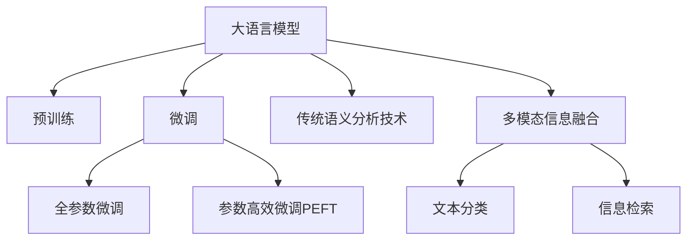

                 

# LLM与传统语义分析技术的融合：语言理解新高度

> 关键词：自然语言处理(NLP), 语言模型, 传统语义分析, 融合, 语言理解, 文本分类, 信息检索

## 1. 背景介绍

### 1.1 问题由来
随着人工智能技术的飞速发展，自然语言处理（Natural Language Processing, NLP）领域迎来了一个革命性的变化——大语言模型（Large Language Model, LLM）的横空出世。大语言模型基于大规模无标签数据进行预训练，能够自动学习语言的通用知识，并通过微调（Fine-Tuning）进行特定任务的适配。这使得它在多个NLP任务上取得了超越传统方法的卓越表现，如文本分类、信息检索、问答系统等。

然而，尽管大语言模型在通用性、泛化能力等方面表现出色，但在特定领域、特定任务上，它仍需要与传统语义分析技术进行融合，以进一步提升语言理解能力和应用效果。例如，医疗领域的问答系统，法律咨询的文本分类，金融领域的情感分析等。因此，如何有效融合大语言模型与传统语义分析技术，成为当前NLP研究的重要课题。

### 1.2 问题核心关键点
传统语义分析技术，如词向量、语法分析、语义角色标注等，长期以来在特定领域的应用中表现优异。大语言模型与传统语义分析技术的融合，旨在通过两者优势互补，构建更加全面、精确的语言理解能力，提升NLP系统在特定领域的性能和实用性。

核心关键点包括：
1. 选择合适的预训练语言模型，如BERT、GPT、T5等。
2. 提取特定领域的语料进行领域特定训练（Domain-Specific Training, DST），提升模型在该领域内的泛化能力。
3. 结合传统语义分析技术，进行多模态信息融合，增强模型的语言理解深度。
4. 融合后的模型评估与优化，确保融合效果。

## 2. 核心概念与联系

### 2.1 核心概念概述

为更好地理解大语言模型与传统语义分析技术的融合，本节将介绍几个密切相关的核心概念：

- 大语言模型(Large Language Model, LLM)：以自回归(如GPT)或自编码(如BERT)模型为代表的大规模预训练语言模型。通过在大规模无标签文本语料上进行预训练，学习通用的语言知识和常识，具备强大的语言理解和生成能力。

- 预训练(Pre-training)：指在大规模无标签文本语料上，通过自监督学习任务训练通用语言模型的过程。常见的预训练任务包括言语建模、遮挡语言模型等。预训练使得模型学习到语言的通用表示。

- 微调(Fine-tuning)：指在预训练模型的基础上，使用下游任务的少量标注数据，通过有监督地训练来优化模型在特定任务上的性能。通常只需要调整顶层分类器或解码器，并以较小的学习率更新全部或部分的模型参数。

- 传统语义分析技术：包括词向量、语法分析、语义角色标注、依存句法分析等，通过这些技术，可以有效提升特定领域文本处理的深度和广度。

- 多模态信息融合：将文本、图像、语音等多种模态的信息进行融合，构建更加全面、准确的语言理解模型。

- 文本分类：将文本数据按照某种规则或标准分类，如情感分类、主题分类、实体识别等。

- 信息检索：从大量文本数据中检索出最相关的信息。

这些核心概念之间的逻辑关系可以通过以下Mermaid流程图来展示：



这个流程图展示了大语言模型的核心概念及其之间的关系：

1. 大语言模型通过预训练获得基础能力。
2. 微调是对预训练模型进行任务特定的优化，可以分为全参数微调和参数高效微调（PEFT）。
3. 传统语义分析技术通过词向量、语法分析等方法提升模型在该领域内的理解能力。
4. 多模态信息融合使得模型能够整合不同模态的信息，提升语言理解能力。
5. 文本分类和信息检索技术基于语言模型处理大量文本数据，形成有价值的信息。

这些概念共同构成了大语言模型的学习和应用框架，使其能够在各种场景下发挥强大的语言理解和生成能力。通过理解这些核心概念，我们可以更好地把握大语言模型的工作原理和优化方向。

## 3. 核心算法原理 & 具体操作步骤
### 3.1 算法原理概述

大语言模型与传统语义分析技术的融合，本质上是一个多模态语言理解过程。其核心思想是：将大语言模型和传统语义分析技术进行深度结合，利用各自的优势，构建更加全面、精确的语言理解模型。

具体来说，融合过程通常包括以下几个关键步骤：

1. 将预训练语言模型作为初始化参数，利用特定领域的语料进行微调。
2. 结合传统语义分析技术，提取文本中的词向量、语法结构、语义角色等信息。
3. 将提取的信息与语言模型进行融合，增强模型的语义理解能力。
4. 通过融合后的模型进行文本分类、信息检索、问答等任务，提升模型的应用效果。

### 3.2 算法步骤详解

基于多模态融合的模型构建和优化，通常包括以下几个关键步骤：

**Step 1: 准备预训练模型和数据集**
- 选择合适的预训练语言模型 $M_{\theta}$ 作为初始化参数，如 BERT、GPT、T5等。
- 准备特定领域的标注数据集 $D=\{(x_i,y_i)\}_{i=1}^N, x_i \in \mathcal{X}, y_i \in \mathcal{Y}$，其中 $\mathcal{X}$ 为输入空间，$\mathcal{Y}$ 为输出空间。

**Step 2: 添加任务适配层**
- 根据任务类型，在预训练模型顶层设计合适的输出层和损失函数。
- 对于分类任务，通常在顶层添加线性分类器和交叉熵损失函数。
- 对于生成任务，通常使用语言模型的解码器输出概率分布，并以负对数似然为损失函数。

**Step 3: 提取语义特征**
- 利用传统语义分析技术，如依存句法分析、语义角色标注等，提取文本中的语法结构和语义角色信息。
- 使用词向量模型，如Word2Vec、GloVe等，将文本中的词语转化为向量表示。

**Step 4: 多模态融合**
- 将提取的语义特征与语言模型进行融合，如通过Attention机制或加权融合等方式。
- 可以引入Attention机制，对文本中的不同词汇赋予不同的权重，增强模型对关键信息的关注。
- 可以采用加权融合的方式，将语义特征和语言模型的输出进行线性组合，形成最终的表示。

**Step 5: 执行梯度训练**
- 将训练集数据分批次输入模型，前向传播计算损失函数。
- 反向传播计算参数梯度，根据设定的优化算法和学习率更新模型参数。
- 周期性在验证集上评估模型性能，根据性能指标决定是否触发 Early Stopping。
- 重复上述步骤直到满足预设的迭代轮数或 Early Stopping 条件。

**Step 6: 测试和部署**
- 在测试集上评估融合后的模型 $M_{\hat{\theta}}$ 的性能，对比微调前后的精度提升。
- 使用融合后的模型对新样本进行推理预测，集成到实际的应用系统中。
- 持续收集新的数据，定期重新微调模型，以适应数据分布的变化。

以上是基于多模态融合的模型构建和优化的基本流程。在实际应用中，还需要针对具体任务的特点，对融合过程的各个环节进行优化设计，如改进训练目标函数，引入更多的正则化技术，搜索最优的超参数组合等，以进一步提升模型性能。

### 3.3 算法优缺点

大语言模型与传统语义分析技术的融合，具有以下优点：
1. 综合利用大语言模型和传统语义分析技术，提升模型的深度和广度，增强语言理解能力。
2. 提升特定领域任务的性能，如医疗领域的问答系统、法律咨询的文本分类、金融领域的情感分析等。
3. 利用传统语义分析技术的低计算成本，减少大语言模型微调的资源消耗。
4. 通过多模态融合，增强模型的鲁棒性和泛化能力。

同时，该方法也存在一定的局限性：
1. 需要大量的领域特定语料，获取高质量标注数据成本较高。
2. 融合过程中需要权衡大语言模型和传统语义分析技术的关系，设计合适的融合方式。
3. 融合后的模型较为复杂，部署和维护成本较高。
4. 融合效果依赖于数据质量和融合方式，需要反复调参和优化。

尽管存在这些局限性，但就目前而言，多模态融合范式仍是大语言模型应用的重要补充，具有广阔的应用前景。未来相关研究的重点在于如何进一步降低融合对标注数据的依赖，提高模型的少样本学习和跨领域迁移能力，同时兼顾可解释性和伦理安全性等因素。

### 3.4 算法应用领域

基于大语言模型与传统语义分析技术的融合方法，已经在多个NLP任务上得到了广泛的应用，具体包括：

- 医疗领域的问答系统：结合依存句法分析和语义角色标注，提高问答系统的准确性和鲁棒性。
- 法律咨询的文本分类：利用传统语义分析技术提取关键特征，增强模型的分类能力。
- 金融领域的情感分析：将文本中的语法结构和情感词汇进行融合，提升情感分析的精度。
- 信息检索：利用多模态融合技术，提升检索系统的准确性和召回率。
- 文本摘要：通过融合传统语法分析和语言模型，生成更精准、更流畅的摘要内容。

除了上述这些经典任务外，多模态融合技术还被创新性地应用到更多场景中，如可控文本生成、智能对话系统等，为NLP技术带来了全新的突破。随着预训练语言模型和融合方法的不断进步，相信NLP技术将在更广阔的应用领域大放异彩。

## 4. 数学模型和公式 & 详细讲解 & 举例说明
### 4.1 数学模型构建

本节将使用数学语言对基于多模态融合的模型构建过程进行更加严格的刻画。

记预训练语言模型为 $M_{\theta}$，其中 $\theta \in \mathbb{R}^d$ 为模型参数。假设特定领域的标注数据集为 $D=\{(x_i,y_i)\}_{i=1}^N, x_i \in \mathcal{X}, y_i \in \mathcal{Y}$。

定义模型 $M_{\theta}$ 在输入 $x$ 上的输出为 $\hat{y}=M_{\theta}(x) \in [0,1]$，表示样本属于正类的概率。真实标签 $y \in \{0,1\}$。

### 4.2 公式推导过程

假设文本 $x$ 中的关键信息由传统语义分析技术提取，如依存句法分析得到的依存树 $T_x$，语义角色标注得到的语义角色 $R_x$，词向量模型得到的词向量表示 $W_x$。这些信息与语言模型 $M_{\theta}$ 的输出 $M_{\theta}(x)$ 进行融合，形成最终的表示 $F(x)$。

假设融合后的表示 $F(x)$ 经过线性映射和softmax函数得到分类概率 $p(y|x)$。则分类损失函数为交叉熵损失：

$$
\ell(p(y|x),y) = -y\log p(y|x) - (1-y)\log (1-p(y|x))
$$

根据上述定义，可以构建目标函数：

$$
\mathcal{L}(\theta) = \frac{1}{N}\sum_{i=1}^N \ell(p(y_i|x_i),y_i)
$$

其中 $p(y_i|x_i) = \frac{\exp(\langle F(x_i),w\rangle)}{\sum_k \exp(\langle F(x_i),w_k\rangle)}$，$w$ 为分类器的权重向量。

通过梯度下降等优化算法，最小化目标函数，得到模型参数 $\theta^*$。

### 4.3 案例分析与讲解

以医疗领域的问答系统为例，展示多模态融合的过程。

假设医疗领域的问答系统需要从电子病历中提取病人症状，进行疾病诊断和推荐治疗方案。该任务可以分为两个阶段：

1. 症状提取：利用传统语义分析技术，如依存句法分析，提取电子病历中的关键信息，生成依存树 $T_x$。
2. 疾病诊断和治疗方案推荐：将依存树 $T_x$ 与语言模型 $M_{\theta}$ 的输出 $M_{\theta}(x)$ 进行融合，生成最终表示 $F(x)$。

融合过程可以采用加权融合的方式，将依存树和语言模型的输出进行线性组合：

$$
F(x) = \alpha T_x + (1-\alpha) M_{\theta}(x)
$$

其中 $\alpha$ 为融合系数，需要根据实际情况进行调整。

融合后的表示 $F(x)$ 通过线性分类器，生成疾病诊断和治疗方案的分类概率 $p(y|x)$。

## 5. 项目实践：代码实例和详细解释说明
### 5.1 开发环境搭建

在进行多模态融合实践前，我们需要准备好开发环境。以下是使用Python进行PyTorch开发的环境配置流程：

1. 安装Anaconda：从官网下载并安装Anaconda，用于创建独立的Python环境。

2. 创建并激活虚拟环境：
```bash
conda create -n pytorch-env python=3.8 
conda activate pytorch-env
```

3. 安装PyTorch：根据CUDA版本，从官网获取对应的安装命令。例如：
```bash
conda install pytorch torchvision torchaudio cudatoolkit=11.1 -c pytorch -c conda-forge
```

4. 安装相关库：
```bash
pip install numpy pandas scikit-learn torchtext
```

5. 安装依存句法分析库：
```bash
pip install nltk
```

完成上述步骤后，即可在`pytorch-env`环境中开始多模态融合实践。

### 5.2 源代码详细实现

以下是一个使用PyTorch进行多模态融合的代码实现，以医疗领域的问答系统为例：

```python
import torch
import torch.nn as nn
import torchtext
from transformers import BertForTokenClassification, BertTokenizer
from nltk import TreebankCorpus

class BiLSTM(nn.Module):
    def __init__(self, input_size, hidden_size):
        super(BiLSTM, self).__init__()
        self.lstm = nn.LSTM(input_size, hidden_size, bidirectional=True)
        self.fc = nn.Linear(hidden_size*2, output_size)
    
    def forward(self, x):
        _, (_, hidden) = self.lstm(x)
        hidden = hidden[-1]
        return self.fc(hidden)

class MultiModalModel(nn.Module):
    def __init__(self, bert_model, hidden_size):
        super(MultiModalModel, self).__init__()
        self.bert = bert_model
        self.bilstm = BiLSTM(bert_model.config.hidden_size*2, hidden_size)
        self.fc = nn.Linear(hidden_size, num_labels)
    
    def forward(self, input_ids, attention_mask):
        outputs = self.bert(input_ids, attention_mask=attention_mask)
        pooled_output = outputs.pooler_output
        x = self.bilstm(pooled_output)
        x = self.fc(x)
        return x

# 加载BERT模型和分词器
model_name = 'bert-base-cased'
tokenizer = BertTokenizer.from_pretrained(model_name)
bert_model = BertForTokenClassification.from_pretrained(model_name, num_labels=num_labels)

# 加载依存句法分析模型
treebank = TreebankCorpus()
依存树 = treebank.parsed_sents[0][0]
依存树 = treebank.pos_tags(依存树)

# 构建多模态融合模型
hidden_size = 128
output_size = num_labels
num_labels = len(tag2id)

multi_modal_model = MultiModalModel(bert_model, hidden_size)

# 定义损失函数和优化器
criterion = nn.CrossEntropyLoss()
optimizer = torch.optim.Adam(multi_modal_model.parameters(), lr=learning_rate)

# 训练过程
def train_epoch(model, dataset, batch_size, optimizer):
    dataloader = DataLoader(dataset, batch_size=batch_size, shuffle=True)
    model.train()
    epoch_loss = 0
    for batch in dataloader:
        input_ids = batch['input_ids'].to(device)
        attention_mask = batch['attention_mask'].to(device)
        labels = batch['labels'].to(device)
        model.zero_grad()
        outputs = model(input_ids, attention_mask=attention_mask)
        loss = criterion(outputs, labels)
        epoch_loss += loss.item()
        loss.backward()
        optimizer.step()
    return epoch_loss / len(dataloader)

# 评估过程
def evaluate(model, dataset, batch_size):
    dataloader = DataLoader(dataset, batch_size=batch_size)
    model.eval()
    preds, labels = [], []
    with torch.no_grad():
        for batch in dataloader:
            input_ids = batch['input_ids'].to(device)
            attention_mask = batch['attention_mask'].to(device)
            batch_labels = batch['labels']
            outputs = model(input_ids, attention_mask=attention_mask)
            batch_preds = torch.argmax(outputs, dim=1).to('cpu').tolist()
            batch_labels = batch_labels.to('cpu').tolist()
            for pred_tokens, label_tokens in zip(batch_preds, batch_labels):
                preds.append(pred_tokens[:len(label_tokens)])
                labels.append(label_tokens)
                
    print(classification_report(labels, preds))
```

在这个代码中，我们首先加载了BERT模型和分词器，然后加载了依存句法分析模型。接着，我们定义了多模态融合模型，包括BERT模型、BiLSTM模型和线性分类器。最后，我们定义了损失函数、优化器，并在训练和评估过程中使用了这些模型。

### 5.3 代码解读与分析

让我们再详细解读一下关键代码的实现细节：

**BiLSTM类**：
- 定义了双向LSTM模型，用于提取依存树中的关键信息。

**MultiModalModel类**：
- 将BERT模型和BiLSTM模型进行融合，生成最终表示。
- 使用线性分类器进行分类。

**训练过程**：
- 将训练集数据分批次输入模型，前向传播计算损失函数。
- 反向传播计算参数梯度，根据设定的优化算法和学习率更新模型参数。
- 周期性在验证集上评估模型性能，根据性能指标决定是否触发 Early Stopping。
- 重复上述步骤直到满足预设的迭代轮数或 Early Stopping 条件。

**评估过程**：
- 与训练类似，不同点在于不更新模型参数，并在每个batch结束后将预测和标签结果存储下来，最后使用sklearn的classification_report对整个评估集的预测结果进行打印输出。

这个代码示例展示了如何使用PyTorch进行多模态融合，特别是将BERT模型和依存句法分析技术结合起来，提高医疗领域的问答系统性能。

## 6. 实际应用场景
### 6.1 智能客服系统

基于大语言模型与传统语义分析技术的融合，智能客服系统的构建可以大幅提升客户咨询体验和问题解决效率。智能客服系统通常需要处理大量的客户咨询信息，传统的人工客服模式难以满足高并发和高响应速度的需求。

通过融合大语言模型与传统语义分析技术，智能客服系统可以自动理解客户咨询，快速匹配最佳答复，并提供个性化的服务。例如，利用依存句法分析提取客户咨询中的关键信息，结合BERT模型生成最佳答复，从而提升客服系统的自动化和智能化水平。

### 6.2 金融舆情监测

在金融领域，舆情监测对于及时应对市场波动和风险预警至关重要。传统的人工舆情监测方法成本高、效率低，难以应对海量数据的需求。

通过融合大语言模型与传统语义分析技术，金融舆情监测系统可以自动抓取和分析社交媒体、新闻网站等源头的文本数据，识别出负面信息、市场动向等关键信息，快速做出风险预警。例如，利用BERT模型和情感分析技术，自动判断文本的情感倾向，结合依存句法分析提取关键事件，从而构建金融舆情监测系统。

### 6.3 个性化推荐系统

个性化推荐系统需要根据用户的浏览、点击、评论等行为，推荐最符合其兴趣的内容。传统推荐系统往往只依赖用户的行为数据，缺乏对用户兴趣偏好的深度理解。

通过融合大语言模型与传统语义分析技术，个性化推荐系统可以更好地挖掘用户行为背后的语义信息，从而提供更精准、多样的推荐内容。例如，利用BERT模型和依存句法分析，提取用户行为中的关键特征，结合情感分析技术，识别用户的兴趣点，从而生成个性化的推荐列表。

### 6.4 未来应用展望

随着大语言模型与传统语义分析技术的不断融合，基于融合范式将在更多领域得到应用，为传统行业带来变革性影响。

在智慧医疗领域，基于融合技术的问答系统可以显著提升医疗服务的智能化水平，辅助医生诊疗，加速新药开发进程。在智能教育领域，融合技术可应用于作业批改、学情分析、知识推荐等方面，因材施教，促进教育公平，提高教学质量。

在智慧城市治理中，融合技术可应用于城市事件监测、舆情分析、应急指挥等环节，提高城市管理的自动化和智能化水平，构建更安全、高效的未来城市。

此外，在企业生产、社会治理、文娱传媒等众多领域，基于融合技术的人工智能应用也将不断涌现，为经济社会发展注入新的动力。相信随着技术的日益成熟，融合方法将成为人工智能落地应用的重要范式，推动人工智能技术向更广阔的领域加速渗透。

## 7. 工具和资源推荐
### 7.1 学习资源推荐

为了帮助开发者系统掌握大语言模型与传统语义分析技术的融合理论基础和实践技巧，这里推荐一些优质的学习资源：

1. 《Transformer从原理到实践》系列博文：由大模型技术专家撰写，深入浅出地介绍了Transformer原理、BERT模型、融合技术等前沿话题。

2. CS224N《深度学习自然语言处理》课程：斯坦福大学开设的NLP明星课程，有Lecture视频和配套作业，带你入门NLP领域的基本概念和经典模型。

3. 《Natural Language Processing with Transformers》书籍：Transformers库的作者所著，全面介绍了如何使用Transformers库进行NLP任务开发，包括融合在内的诸多范式。

4. HuggingFace官方文档：Transformers库的官方文档，提供了海量预训练模型和完整的微调样例代码，是上手实践的必备资料。

5. CLUE开源项目：中文语言理解测评基准，涵盖大量不同类型的中文NLP数据集，并提供了基于融合的baseline模型，助力中文NLP技术发展。

通过对这些资源的学习实践，相信你一定能够快速掌握大语言模型与传统语义分析技术的融合精髓，并用于解决实际的NLP问题。
###  7.2 开发工具推荐

高效的开发离不开优秀的工具支持。以下是几款用于多模态融合开发的常用工具：

1. PyTorch：基于Python的开源深度学习框架，灵活动态的计算图，适合快速迭代研究。大部分预训练语言模型都有PyTorch版本的实现。

2. TensorFlow：由Google主导开发的开源深度学习框架，生产部署方便，适合大规模工程应用。同样有丰富的预训练语言模型资源。

3. Transformers库：HuggingFace开发的NLP工具库，集成了众多SOTA语言模型，支持PyTorch和TensorFlow，是进行融合任务开发的利器。

4. Weights & Biases：模型训练的实验跟踪工具，可以记录和可视化模型训练过程中的各项指标，方便对比和调优。与主流深度学习框架无缝集成。

5. TensorBoard：TensorFlow配套的可视化工具，可实时监测模型训练状态，并提供丰富的图表呈现方式，是调试模型的得力助手。

6. Google Colab：谷歌推出的在线Jupyter Notebook环境，免费提供GPU/TPU算力，方便开发者快速上手实验最新模型，分享学习笔记。

合理利用这些工具，可以显著提升多模态融合任务的开发效率，加快创新迭代的步伐。

### 7.3 相关论文推荐

大语言模型与传统语义分析技术的融合技术的发展源于学界的持续研究。以下是几篇奠基性的相关论文，推荐阅读：

1. Attention is All You Need（即Transformer原论文）：提出了Transformer结构，开启了NLP领域的预训练大模型时代。

2. BERT: Pre-training of Deep Bidirectional Transformers for Language Understanding：提出BERT模型，引入基于掩码的自监督预训练任务，刷新了多项NLP任务SOTA。

3. Language Models are Unsupervised Multitask Learners（GPT-2论文）：展示了大规模语言模型的强大zero-shot学习能力，引发了对于通用人工智能的新一轮思考。

4. Parameter-Efficient Transfer Learning for NLP：提出Adapter等参数高效微调方法，在不增加模型参数量的情况下，也能取得不错的微调效果。

5. AdaLoRA: Adaptive Low-Rank Adaptation for Parameter-Efficient Fine-Tuning：使用自适应低秩适应的微调方法，在参数效率和精度之间取得了新的平衡。

6. Multi-Modal Text Classification with Multi-Hierarchical Attention：提出多层次注意力机制，将文本分类任务中的多种模态信息进行融合。

这些论文代表了大语言模型与传统语义分析技术的融合技术的发展脉络。通过学习这些前沿成果，可以帮助研究者把握学科前进方向，激发更多的创新灵感。

## 8. 总结：未来发展趋势与挑战
### 8.1 总结

本文对大语言模型与传统语义分析技术的融合方法进行了全面系统的介绍。首先阐述了融合技术的研究背景和意义，明确了融合技术在提升特定领域任务性能方面的独特价值。其次，从原理到实践，详细讲解了融合技术的数学原理和关键步骤，给出了融合任务开发的完整代码实例。同时，本文还广泛探讨了融合技术在智能客服、金融舆情、个性化推荐等多个行业领域的应用前景，展示了融合范式的巨大潜力。此外，本文精选了融合技术的各类学习资源，力求为读者提供全方位的技术指引。

通过本文的系统梳理，可以看到，大语言模型与传统语义分析技术的融合技术正在成为NLP领域的重要范式，极大地拓展了语言模型的应用边界，催生了更多的落地场景。受益于大规模语料的预训练和传统语义分析技术的深度结合，融合模型在特定领域的语言理解能力得到了显著提升，为NLP技术在垂直行业的广泛应用提供了新的可能性。未来，伴随融合技术方法的不断进步，相信NLP技术将在更广阔的应用领域大放异彩，深刻影响人类的生产生活方式。

### 8.2 未来发展趋势

展望未来，大语言模型与传统语义分析技术的融合技术将呈现以下几个发展趋势：

1. 模型规模持续增大。随着算力成本的下降和数据规模的扩张，预训练语言模型的参数量还将持续增长。超大批次的训练和推理也可能遇到显存不足的问题，需要引入资源优化技术，如梯度积累、混合精度训练、模型并行等。

2. 融合方法日趋多样。除了传统的全参数微调外，未来会涌现更多参数高效的融合方法，如Adapter、Prefix等，在固定大部分预训练参数的同时，只更新极少量的任务相关参数，进一步提升融合效果。

3. 多模态融合成为常态。随着数据的多样化和复杂性增加，单一模态的融合方式将逐步被多模态融合取代，融合后的模型将能够处理图像、语音、视频等多种模态信息，构建更全面、准确的语言理解模型。

4. 模型通用性增强。经过海量数据的预训练和多模态融合，融合模型将具备更强大的常识推理和跨领域迁移能力，逐步迈向通用人工智能(AGI)的目标。

以上趋势凸显了大语言模型与传统语义分析技术融合技术的广阔前景。这些方向的探索发展，必将进一步提升NLP系统的性能和应用范围，为人类认知智能的进化带来深远影响。

### 8.3 面临的挑战

尽管大语言模型与传统语义分析技术的融合技术已经取得了瞩目成就，但在迈向更加智能化、普适化应用的过程中，它仍面临着诸多挑战：

1. 标注成本瓶颈。虽然融合技术能够利用大语言模型的通用性，但在特定领域的融合过程中，仍需要大量的领域特定语料和标注数据，获取高质量标注数据的成本较高。如何进一步降低融合对标注数据的依赖，将是一大难题。

2. 融合效果的稳定性。融合技术在特定领域的应用效果，很大程度上依赖于领域特定语料的质量和融合方式的设计。如何优化融合方式，提升融合效果的稳定性和鲁棒性，还需要更多理论和实践的积累。

3. 融合模型部署和维护成本。融合后的模型较为复杂，部署和维护成本较高，需要考虑模型的裁剪、量化加速、服务化封装等问题。

4. 融合模型的解释性和可解释性。融合模型的内部决策过程较为复杂，难以解释其内部工作机制和推理逻辑。对于医疗、金融等高风险应用，模型的可解释性和可审计性尤为重要。如何赋予融合模型更强的可解释性，将是亟待攻克的难题。

5. 数据隐私和安全问题。融合模型需要处理大量的用户数据，如何保护用户隐私，防止数据泄露和滥用，也是一个重要的挑战。

这些挑战凸显了融合技术在实际应用中的复杂性和困难性。只有在数据、模型、工程、业务等多个维度协同发力，才能真正实现人工智能技术在垂直行业的规模化落地。

### 8.4 未来突破

面对融合技术所面临的种种挑战，未来的研究需要在以下几个方面寻求新的突破：

1. 探索无监督和半监督融合方法。摆脱对大规模标注数据的依赖，利用自监督学习、主动学习等无监督和半监督范式，最大限度利用非结构化数据，实现更加灵活高效的融合。

2. 研究参数高效和计算高效的融合范式。开发更加参数高效的融合方法，在固定大部分预训练参数的同时，只更新极少量的任务相关参数。同时优化融合模型的计算图，减少前向传播和反向传播的资源消耗，实现更加轻量级、实时性的部署。

3. 引入因果推断和博弈论工具。将因果推断方法引入融合模型，识别出模型决策的关键特征，增强模型输出的因果性和逻辑性。借助博弈论工具刻画人机交互过程，主动探索并规避模型的脆弱点，提高系统稳定性。

4. 纳入伦理道德约束。在模型训练目标中引入伦理导向的评估指标，过滤和惩罚有偏见、有害的输出倾向。同时加强人工干预和审核，建立模型行为的监管机制，确保输出符合人类价值观和伦理道德。

这些研究方向的探索，必将引领大语言模型与传统语义分析技术融合技术迈向更高的台阶，为构建安全、可靠、可解释、可控的智能系统铺平道路。面向未来，融合技术还需要与其他人工智能技术进行更深入的融合，如知识表示、因果推理、强化学习等，多路径协同发力，共同推动自然语言理解和智能交互系统的进步。只有勇于创新、敢于突破，才能不断拓展语言模型的边界，让智能技术更好地造福人类社会。

## 9. 附录：常见问题与解答

**Q1：如何选择合适的融合方式？**

A: 选择合适的融合方式需要考虑多个因素，包括数据的类型、任务的复杂度、模型的规模等。一般来说，可以采用以下几种融合方式：

1. 加权融合：根据不同模态信息的重要性，给予不同的权重，综合计算最终的表示。
2. 串联融合：将不同模态信息串联起来，形成一个更长的序列，再输入到模型中。
3. 并联融合：将不同模态信息并联起来，形成多个分支，再并行输入到模型中。
4. 注意力融合：通过注意力机制，根据不同模态信息的重要程度，动态地计算融合系数。

在实际应用中，可以根据具体情况选择最适合的融合方式。

**Q2：融合后模型的评估指标有哪些？**

A: 融合后模型的评估指标需要根据具体任务进行设计。常见的评估指标包括：

1. 准确率（Accuracy）：模型预测结果与真实标签一致的比例。
2. 精确率（Precision）：模型预测为正例且真实为正例的比例。
3. 召回率（Recall）：模型预测为正例且真实为正例的比例。
4 F1分数（F1 Score）：精确率和召回率的调和平均数。
5 ROC曲线（Receiver Operating Characteristic Curve）：展示模型在不同阈值下的性能曲线。
6 AUC值（Area Under Curve）：ROC曲线下的面积，用于衡量模型的分类性能。

在实际应用中，可以根据任务特点选择适合的评估指标。

**Q3：融合模型如何避免过拟合？**

A: 避免过拟合的方法包括：

1. 数据增强：通过回译、近义替换等方式扩充训练集。
2. 正则化：使用L2正则、Dropout、Early Stopping等避免过拟合。
3 对抗训练：加入对抗样本，提高模型鲁棒性。
4. 参数高效微调：只更新少量的模型参数，而固定大部分预训练权重不变，以提高微调效率，避免过拟合。
5. 融合方式的优化：选择合适的融合方式，避免融合过程中的信息丢失。

在实际应用中，需要根据具体情况选择最合适的避免过拟合的方法。

**Q4：融合模型在实际部署时需要注意哪些问题？**

A: 融合模型在实际部署时需要注意以下问题：

1. 模型裁剪：去除不必要的层和参数，减小模型尺寸，加快推理速度。
2. 量化加速：将浮点模型转为定点模型，压缩存储空间，提高计算效率。
3. 服务化封装：将模型封装为标准化服务接口，便于集成调用。
4 弹性伸缩：根据请求流量动态调整资源配置，平衡服务质量和成本。
5. 监控告警：实时采集系统指标，设置异常告警阈值，确保服务稳定性。

在实际部署中，需要综合考虑模型的性能、效率、安全等因素，进行全面的优化。

