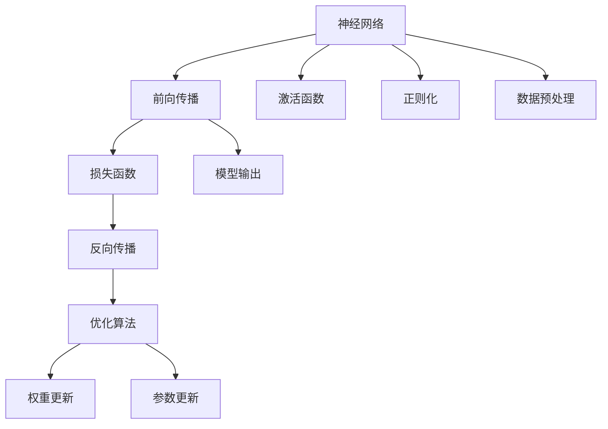

                 

# LLM与深度学习：异同点分析

> 关键词：大语言模型(LLM), 深度学习, 神经网络, 算法, 应用场景, 机器学习

## 1. 背景介绍

### 1.1 问题由来

在当今人工智能领域，深度学习已占据重要地位。深度学习通过多层神经网络结构，从数据中学习复杂特征，应用在图像、语音、自然语言处理等领域，取得了巨大成功。同时，以大规模预训练语言模型为代表的大语言模型(LLM)，也正成为自然语言处理(NLP)领域的前沿方向。

尽管深度学习和大语言模型都是基于神经网络构建的模型，但两者在原理、应用场景、训练方法等方面存在差异。本文旨在深入剖析LLM与深度学习的异同点，探讨其在实际应用中的区别和联系，帮助读者更好地理解这一重要领域的核心技术。

### 1.2 问题核心关键点

本文将围绕以下关键点进行探讨：

- **原理**：深度学习与LLM的神经网络结构有何异同？
- **训练**：深度学习与LLM在数据标注、模型训练上的不同方法。
- **应用**：深度学习与LLM在NLP领域的具体应用场景。
- **未来**：深度学习与LLM的发展趋势和应用前景。

通过比较深度学习和大语言模型，希望能为初学者提供清晰的思路，为深度学习研究者提供新的启发，为NLP应用开发者提供更具实操性的指导。

## 2. 核心概念与联系

### 2.1 核心概念概述

深度学习与大语言模型的核心概念涵盖了神经网络、激活函数、损失函数、优化算法、正则化等基础知识。

- **神经网络**：由多个层次构成的计算模型，通过反向传播算法更新模型参数。
- **激活函数**：如ReLU、Sigmoid等，用于增加神经网络非线性特性。
- **损失函数**：如交叉熵、均方误差等，用于衡量模型输出与真实标签之间的差异。
- **优化算法**：如SGD、Adam等，用于最小化损失函数，更新模型参数。
- **正则化**：如L2正则、Dropout等，用于防止过拟合。

### 2.2 核心概念原理和架构的 Mermaid 流程图(Mermaid 流程节点中不要有括号、逗号等特殊字符)



这个流程图展示了深度学习的核心流程：数据通过模型进行前向传播，计算损失函数，反向传播更新权重，权重更新包含激活函数和正则化过程。

## 3. 核心算法原理 & 具体操作步骤

### 3.1 算法原理概述

深度学习与大语言模型在算法原理上存在明显差异。深度学习通常采用有监督或无监督学习的方式，通过大量标注数据训练模型；而大语言模型主要依赖自监督预训练，利用大规模无标签数据预训练通用语言表示。

在应用领域上，深度学习主要用于图像识别、语音识别、自然语言处理等。而大语言模型则更加聚焦于自然语言处理领域，尤其是文本生成、机器翻译、问答系统等。

### 3.2 算法步骤详解

#### 3.2.1 深度学习的训练步骤

1. **数据准备**：收集大量标注数据，将数据分为训练集、验证集和测试集。
2. **模型构建**：设计神经网络结构，选择激活函数、损失函数和优化算法。
3. **模型训练**：使用训练集数据进行迭代训练，通过反向传播算法更新模型参数，在验证集上评估模型性能。
4. **模型测试**：在测试集上评估模型性能，如准确率、召回率等指标。
5. **参数调优**：根据测试结果，调整模型参数，直到模型性能达到预期。

#### 3.2.2 大语言模型的训练步骤

1. **数据准备**：收集大规模无标签文本数据。
2. **预训练**：使用自监督任务如掩码语言模型(MLM)、下一句预测任务(NSP)等，预训练语言模型。
3. **微调**：选择下游任务，收集少量标注数据，对预训练模型进行微调，优化模型在特定任务上的性能。
4. **模型评估**：在测试集上评估模型性能，如BLEU、ROUGE等指标。
5. **参数调优**：根据评估结果，调整模型参数和超参数，优化模型性能。

### 3.3 算法优缺点

#### 深度学习的优点

1. **可解释性强**：由于有监督学习方法使用了标注数据，模型的决策过程更加透明。
2. **泛化能力强**：大量标注数据使得模型具有更好的泛化能力。
3. **应用广泛**：深度学习在图像、语音、NLP等领域均有广泛应用。

#### 深度学习的缺点

1. **数据依赖度高**：需要有大量标注数据，数据获取成本高。
2. **模型复杂度高**：神经网络结构复杂，难以理解。
3. **训练时间长**：大数据集和复杂模型训练时间长，需要高性能硬件支持。

#### 大语言模型的优点

1. **知识积累**：自监督预训练使得模型积累了丰富的语言知识。
2. **参数高效**：通过微调，在固定大部分预训练参数的情况下，可以提升模型性能。
3. **跨领域迁移**：通过微调，可以适应不同领域的下游任务。

#### 大语言模型的缺点

1. **可解释性差**：自监督预训练使得模型"黑盒"化，难以解释其内部机制。
2. **泛化能力受限**：微调时依赖标注数据，泛化能力受数据分布影响。
3. **对抗攻击脆弱**：微调模型对抗攻击的鲁棒性不足。

### 3.4 算法应用领域

#### 深度学习应用领域

1. **计算机视觉**：如图像分类、目标检测、人脸识别等。
2. **自然语言处理**：如文本分类、情感分析、机器翻译等。
3. **语音识别**：如语音转文字、自动摘要等。
4. **推荐系统**：如协同过滤、基于内容的推荐等。

#### 大语言模型应用领域

1. **文本生成**：如自然语言推理、文本摘要、对话系统等。
2. **机器翻译**：如英中翻译、英日翻译等。
3. **问答系统**：如智能客服、知识图谱问答等。
4. **情感分析**：如社交媒体情感分析、新闻情感分析等。

## 4. 数学模型和公式 & 详细讲解 & 举例说明

### 4.1 数学模型构建

#### 深度学习模型

深度学习模型通常由多个神经网络层构成，每一层包括多个神经元。以一个简单的全连接神经网络为例，其数学模型可以表示为：

$$
y = Wx + b
$$

其中，$x$为输入向量，$W$为权重矩阵，$b$为偏置向量，$y$为输出向量。

#### 大语言模型

大语言模型通常使用Transformer结构，其数学模型可以表示为：

$$
y = AT + M
$$

其中，$A$为自注意力机制，$T$为编码器，$M$为解码器，$y$为输出向量。

### 4.2 公式推导过程

#### 深度学习模型

对于一个简单的全连接神经网络，其前向传播过程可以表示为：

$$
y = f(Wx + b)
$$

其中，$f$为激活函数。

假设损失函数为均方误差，反向传播过程中的权重更新公式为：

$$
W \leftarrow W - \eta \frac{\partial L}{\partial W}
$$

其中，$\eta$为学习率，$L$为损失函数。

#### 大语言模型

以Transformer模型为例，其前向传播过程可以表示为：

$$
y = AT + M
$$

其中，$A$为自注意力机制，$T$为编码器，$M$为解码器，$y$为输出向量。

假设损失函数为交叉熵，反向传播过程中的权重更新公式为：

$$
W \leftarrow W - \eta \frac{\partial L}{\partial W}
$$

其中，$\eta$为学习率，$L$为损失函数。

### 4.3 案例分析与讲解

#### 深度学习案例

假设我们有一个手写数字识别任务，收集了大量手写数字的图像数据，并标注每个数字。我们使用一个简单的卷积神经网络(CNN)模型，通过反向传播算法进行训练。训练步骤如下：

1. **数据准备**：收集手写数字图像和对应的标签，将数据分为训练集、验证集和测试集。
2. **模型构建**：设计一个简单的卷积神经网络模型，包含卷积层、池化层和全连接层。
3. **模型训练**：使用训练集数据进行迭代训练，通过反向传播算法更新模型参数。
4. **模型测试**：在测试集上评估模型性能，如准确率、召回率等指标。
5. **参数调优**：根据测试结果，调整模型参数和超参数，优化模型性能。

#### 大语言模型案例

假设我们有一个机器翻译任务，收集了大量英文与法语的平行语料。我们使用GPT模型，通过自监督预训练学习语言表示，然后在机器翻译任务上对模型进行微调。训练步骤如下：

1. **数据准备**：收集英文与法语的平行语料，将数据分为训练集、验证集和测试集。
2. **预训练**：使用掩码语言模型(MLM)等自监督任务，对GPT模型进行预训练。
3. **微调**：对预训练模型进行微调，优化模型在机器翻译任务上的性能。
4. **模型评估**：在测试集上评估模型性能，如BLEU、ROUGE等指标。
5. **参数调优**：根据评估结果，调整模型参数和超参数，优化模型性能。

## 5. 项目实践：代码实例和详细解释说明

### 5.1 开发环境搭建

在进行深度学习和大语言模型开发时，首先需要准备好开发环境。以下是使用Python进行TensorFlow开发的环境配置流程：

1. 安装Anaconda：从官网下载并安装Anaconda，用于创建独立的Python环境。

2. 创建并激活虚拟环境：
```bash
conda create -n tf-env python=3.8 
conda activate tf-env
```

3. 安装TensorFlow：根据CUDA版本，从官网获取对应的安装命令。例如：
```bash
conda install tensorflow -c tf -c conda-forge
```

4. 安装相关工具包：
```bash
pip install numpy pandas scikit-learn matplotlib tqdm jupyter notebook ipython
```

完成上述步骤后，即可在`tf-env`环境中开始深度学习和大语言模型的开发。

### 5.2 源代码详细实现

由于篇幅限制，这里仅提供一个简单的卷积神经网络模型实现，用于手写数字识别任务。

```python
import tensorflow as tf
from tensorflow.keras import datasets, layers, models

# 加载手写数字数据集
(train_images, train_labels), (test_images, test_labels) = datasets.mnist.load_data()

# 预处理数据
train_images = train_images.reshape((60000, 28 * 28))
train_images = train_images / 255.0
test_images = test_images.reshape((10000, 28 * 28))
test_images = test_images / 255.0

# 构建卷积神经网络模型
model = models.Sequential()
model.add(layers.Conv2D(32, (3, 3), activation='relu', input_shape=(28, 28, 1)))
model.add(layers.MaxPooling2D((2, 2)))
model.add(layers.Conv2D(64, (3, 3), activation='relu'))
model.add(layers.MaxPooling2D((2, 2)))
model.add(layers.Flatten())
model.add(layers.Dense(64, activation='relu'))
model.add(layers.Dense(10))

# 编译模型
model.compile(optimizer='adam',
              loss=tf.keras.losses.SparseCategoricalCrossentropy(from_logits=True),
              metrics=['accuracy'])

# 训练模型
model.fit(train_images, train_labels, epochs=5, 
          validation_data=(test_images, test_labels))

# 评估模型
model.evaluate(test_images,  test_labels, verbose=2)
```

### 5.3 代码解读与分析

上述代码实现了一个简单的卷积神经网络，用于手写数字识别任务。具体步骤如下：

1. **数据准备**：使用`mnist.load_data()`函数加载手写数字数据集，并进行数据预处理。
2. **模型构建**：设计一个简单的卷积神经网络模型，包含卷积层、池化层和全连接层。
3. **模型编译**：选择优化器、损失函数和评价指标。
4. **模型训练**：使用训练集数据进行迭代训练。
5. **模型评估**：在测试集上评估模型性能。

需要注意的是，深度学习模型的训练通常需要高性能硬件支持，如GPU。此外，模型参数调优也是深度学习开发中不可或缺的一环。

## 6. 实际应用场景

### 6.1 计算机视觉

深度学习在计算机视觉领域有着广泛应用，如图像分类、目标检测、人脸识别等。以图像分类为例，深度学习模型通过大量标注数据训练，能够识别出不同类别的图像，应用于自动驾驶、医疗影像分析等场景。

### 6.2 自然语言处理

深度学习在自然语言处理领域也有着重要应用，如文本分类、情感分析、机器翻译等。以机器翻译为例，深度学习模型通过大量平行语料进行训练，能够在不同语言间进行翻译，应用于跨语言沟通、自动翻译系统等场景。

### 6.3 语音识别

深度学习在语音识别领域也有着重要应用，如语音转文字、自动摘要等。以语音转文字为例，深度学习模型通过大量带标注的语音数据进行训练，能够将语音转换为文本，应用于智能音箱、语音助手等场景。

## 7. 工具和资源推荐

### 7.1 学习资源推荐

为了帮助开发者系统掌握深度学习和大语言模型的理论基础和实践技巧，这里推荐一些优质的学习资源：

1. 《深度学习》系列书籍：如Ian Goodfellow等人的《深度学习》，涵盖了深度学习的基本概念和算法。
2. Coursera《深度学习专项课程》：由Andrew Ng开设的深度学习课程，系统讲解了深度学习的理论基础和实践技巧。
3. PyTorch官方文档：PyTorch官方文档，提供了丰富的示例代码和详细解释，是深度学习开发的必备资料。
4. HuggingFace官方文档：HuggingFace官方文档，提供了丰富的预训练模型和微调样例代码，是大语言模型开发的必备资料。
5. Arxiv论文：深度学习和自然语言处理领域的最新研究成果，提供了丰富的理论支持和实践指导。

通过对这些资源的学习实践，相信你一定能够快速掌握深度学习和大语言模型的精髓，并用于解决实际的NLP问题。

### 7.2 开发工具推荐

高效的开发离不开优秀的工具支持。以下是几款用于深度学习和大语言模型开发的常用工具：

1. PyTorch：基于Python的开源深度学习框架，灵活动态的计算图，适合快速迭代研究。
2. TensorFlow：由Google主导开发的开源深度学习框架，生产部署方便，适合大规模工程应用。
3. HuggingFace Transformers库：提供了丰富的预训练模型和微调样例代码，是大语言模型开发的利器。
4. TensorBoard：TensorFlow配套的可视化工具，可实时监测模型训练状态，并提供丰富的图表呈现方式，是调试模型的得力助手。
5. Jupyter Notebook：交互式编程环境，方便编写和调试代码。
6. Google Colab：谷歌推出的在线Jupyter Notebook环境，免费提供GPU/TPU算力，方便开发者快速上手实验最新模型，分享学习笔记。

合理利用这些工具，可以显著提升深度学习和大语言模型开发的效率，加快创新迭代的步伐。

### 7.3 相关论文推荐

深度学习和大语言模型的发展源于学界的持续研究。以下是几篇奠基性的相关论文，推荐阅读：

1. AlexNet：ImageNet大规模视觉识别挑战赛的冠军模型，标志着深度学习在计算机视觉领域的突破。
2. RNNs：长短期记忆网络，用于序列数据建模，广泛应用于文本生成、机器翻译等场景。
3. Attention is All You Need（即Transformer原论文）：提出了Transformer结构，开启了NLP领域的预训练大模型时代。
4. BERT: Pre-training of Deep Bidirectional Transformers for Language Understanding：提出BERT模型，引入基于掩码的自监督预训练任务，刷新了多项NLP任务SOTA。
5. GPT-2：展示了大规模语言模型的强大zero-shot学习能力，引发了对于通用人工智能的新一轮思考。
6. LSTM：长短期记忆网络，用于序列数据建模，广泛应用于文本分类、情感分析等场景。

这些论文代表了大语言模型和大语言模型微调技术的发展脉络。通过学习这些前沿成果，可以帮助研究者把握学科前进方向，激发更多的创新灵感。

## 8. 总结：未来发展趋势与挑战

### 8.1 总结

本文对深度学习和大语言模型的异同点进行了全面系统的介绍。深度学习和大语言模型在原理、应用场景、训练方法等方面存在明显差异。尽管两者都是基于神经网络构建的模型，但深度学习侧重于有监督学习，大语言模型侧重于自监督预训练和微调。

深度学习在大规模标注数据上训练，具有较好的可解释性和泛化能力，广泛应用于计算机视觉、自然语言处理等领域。而大语言模型通过自监督预训练学习语言知识，通过微调适应特定任务，具有较好的知识积累和参数效率，广泛应用于文本生成、机器翻译等NLP任务。

### 8.2 未来发展趋势

展望未来，深度学习和大语言模型将呈现以下几个发展趋势：

1. **模型规模持续增大**：预训练语言模型的参数量将继续增长，构建更大规模的深度学习模型，提升性能。
2. **跨领域迁移能力提升**：深度学习模型将在更多领域进行迁移，大语言模型将在更广泛的NLP任务中应用。
3. **融合多模态数据**：深度学习模型将融合视觉、语音等多模态数据，提升综合性能。
4. **参数高效方法涌现**：未来的深度学习模型将采用更多参数高效的方法，如参数剪枝、模型蒸馏等，提升模型效率。
5. **知识图谱结合**：深度学习模型将结合知识图谱等外部知识，提升模型推理能力。

### 8.3 面临的挑战

尽管深度学习和大语言模型已经取得了瞩目成就，但在迈向更加智能化、普适化应用的过程中，仍面临诸多挑战：

1. **数据依赖度高**：深度学习模型需要有大量标注数据，数据获取成本高。大语言模型虽然部分任务可以无需标注数据，但在特定领域仍需大量标注数据。
2. **计算资源需求高**：深度学习和大语言模型都需要高性能硬件支持，计算资源需求高。
3. **可解释性差**：深度学习模型和部分大语言模型缺乏可解释性，难以理解其内部机制。
4. **对抗攻击脆弱**：深度学习模型和大语言模型对抗攻击的鲁棒性不足。
5. **知识积累受限**：大语言模型虽然通过预训练积累了丰富知识，但在特定领域仍需通过微调获取更多知识。

### 8.4 研究展望

面对深度学习和大语言模型所面临的挑战，未来的研究需要在以下几个方面寻求新的突破：

1. **无监督和半监督学习方法**：开发更多无监督和半监督学习方法，减少对标注数据的依赖。
2. **知识图谱融合**：将知识图谱等外部知识与深度学习模型结合，提升模型推理能力。
3. **多模态数据融合**：融合视觉、语音等多模态数据，提升模型综合性能。
4. **参数高效优化**：开发更多参数高效的方法，如参数剪枝、模型蒸馏等，提升模型效率。
5. **对抗攻击防御**：研究对抗攻击防御方法，提升模型鲁棒性。
6. **知识图谱融合**：将知识图谱等外部知识与深度学习模型结合，提升模型推理能力。

这些研究方向的探索，必将引领深度学习和大语言模型向更高的台阶发展，为构建安全、可靠、可解释、可控的智能系统铺平道路。面向未来，深度学习和大语言模型还需要与其他人工智能技术进行更深入的融合，如知识表示、因果推理、强化学习等，多路径协同发力，共同推动自然语言理解和智能交互系统的进步。只有勇于创新、敢于突破，才能不断拓展语言模型的边界，让智能技术更好地造福人类社会。

---

作者：禅与计算机程序设计艺术 / Zen and the Art of Computer Programming

