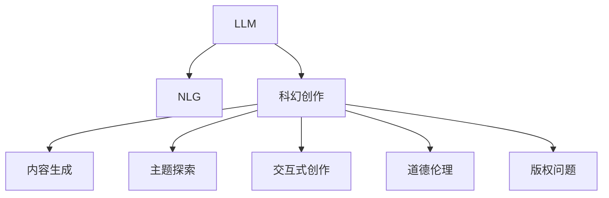

                 

# LLM与科幻创作：激发人类想象力

## 1. 背景介绍

### 1.1 问题由来
随着人工智能技术的迅速发展，大规模语言模型(LLM)成为了引领AI发展的重要力量。LLM 如 OpenAI 的 GPT-3、Google 的 BERT 等，能够处理自然语言文本，理解语言上下文，并在语言生成、自然语言推理、文本摘要等任务上取得了令人瞩目的成绩。LLM 的强大能力不仅在科技、教育、娱乐等领域带来了深刻影响，也逐渐延伸到了文化创作领域，尤其是在科幻创作这一艺术与技术的结合体中展现出了巨大的潜力。

科幻创作作为一种艺术形式，历来以想象力的无限扩展和科技前沿的探索为特色。在数字时代，LLM 为科幻创作带来了新的工具和思维方式，激发了创作灵感的爆发。但与此同时，LLM 技术的应用也带来了诸如版权问题、道德伦理、虚拟与现实边界等新挑战。本文将深入探讨 LLM 在科幻创作中的应用及其所引发的思考。

### 1.2 问题核心关键点
LLM 在科幻创作中的应用主要集中在以下几个方面：
- **内容生成**：利用 LLM 生成原创科幻故事、对话、角色设定等。
- **主题探索**：通过 LLM 探索新的科幻主题和技术概念。
- **交互式创作**：利用 LLM 的交互式特性，与读者或观众共同创作科幻故事。
- **道德伦理考量**：如何平衡科技创新的无限可能与伦理道德的约束。

这些关键点构成了 LLM 在科幻创作中应用的框架，使得 LLM 不仅能够作为创作工具，更能够引发关于人类未来、科技与社会关系的深度思考。

## 2. 核心概念与联系

### 2.1 核心概念概述

为更好地理解 LLM 在科幻创作中的应用，我们首先介绍几个核心概念：

- **大规模语言模型(LLM)**：指通过自监督学习在大规模语料库上训练的深度学习模型，具备处理自然语言、理解上下文、生成自然语言的能力。

- **自然语言生成(NLG)**：LLM 的一个核心功能，能够根据给定的输入文本或上下文，生成新的、自然流畅的语言文本。

- **科幻创作**：以构建未来世界、未来科技、未来人类为核心的文学艺术创作。

- **交互式创作**：利用 LLM 的交互特性，进行实时创作，增加创作过程的参与感和互动性。

- **道德伦理**：在科幻创作中，如何平衡科技发展带来的机遇与挑战，避免对现实社会造成负面影响。

- **版权问题**：创作作品是否构成原创，如何界定 LLM 生成内容的版权归属。

这些概念之间的逻辑关系可以通过以下 Mermaid 流程图来展示：



这个流程图展示了大规模语言模型在科幻创作中的应用及其与相关概念的联系：

1. LLM 作为核心技术，通过其强大的自然语言生成能力，为科幻创作提供了工具和素材。
2. 通过内容生成和主题探索，推动科幻创作向更广阔的领域和更深层的思想。
3. 交互式创作增强了创作过程的互动性和参与感。
4. 道德伦理和版权问题在科幻创作中，成为亟待解决的新挑战。

## 3. 核心算法原理 & 具体操作步骤
### 3.1 算法原理概述

LLM 在科幻创作中的算法原理，可以归纳为以下几个核心步骤：

- **文本预处理**：将输入的原始文本进行分词、词性标注、去除停用词等预处理操作，为模型提供标准化输入。

- **序列编码**：利用 LLM 将输入文本编码成向量序列，以便模型处理和生成。

- **生成过程**：LLM 根据前文上下文生成新的文本内容，可以控制生成文本的长度、风格、主题等参数。

- **后处理**：对生成的文本进行后处理，如文本校对、语法修正、风格调整等，确保生成的内容符合科幻创作的要求。

### 3.2 算法步骤详解

1. **文本预处理**：

   首先，我们需要对输入的文本进行预处理，以便 LLM 模型能够更好地理解并生成文本。具体步骤如下：
   - **分词**：将输入文本切分成单词或子词，以便模型处理。
   - **词性标注**：为每个词语标注词性，帮助模型理解词义。
   - **去除停用词**：去除如“的”、“是”等常见但无实际意义的词语。
   
   ```python
   from transformers import AutoTokenizer

   tokenizer = AutoTokenizer.from_pretrained('gpt3')
   input_text = "人类在未来是否会实现永生？"
   tokens = tokenizer(input_text, return_tensors="pt")
   ```

2. **序列编码**：

   使用 LLM 将文本编码成向量序列，以便模型处理和生成。例如，使用 GPT-3 模型生成文本：
   
   ```python
   from transformers import AutoModelForCausalLM

   model = AutoModelForCausalLM.from_pretrained('gpt3')
   outputs = model.generate(tokens.input_ids, max_length=20, temperature=0.7)
   decoded_output = tokenizer.decode(outputs[0], skip_special_tokens=True)
   ```

3. **生成过程**：

   利用 LLM 生成新的文本内容。可以通过控制生成参数，如温度（temperature）、样本数量（num_return_sequences）等，来控制生成结果的多样性和质量。例如，设置温度为 0.7，生成 5 段文本：

   ```python
   outputs = model.generate(tokens.input_ids, max_length=20, temperature=0.7, num_return_sequences=5)
   ```

4. **后处理**：

   对生成的文本进行后处理，如校对语法错误、调整风格、修正错误等。这一步可以借助一些文本处理工具或规则进行。
   
   ```python
   import re
   
   def preprocess_text(text):
       text = re.sub(r'\s+', ' ', text.strip())
       # 其他后处理逻辑
       return text
   
   decoded_output = preprocess_text(decoded_output)
   ```

### 3.3 算法优缺点

LLM 在科幻创作中的应用有以下优点：

- **生成效率高**：能够快速生成大量科幻文本，为创作提供丰富的素材。
- **生成质量高**：生成的文本自然流畅，风格多样，符合科幻创作的艺术要求。
- **交互性强**：通过交互式创作，增加创作过程的参与感和互动性。
- **创新性强**：能够探索新的科幻主题和技术概念，激发创作灵感。

同时，也存在一些缺点：

- **版权问题**：LLM 生成的文本是否构成原创，版权归属问题需要界定。
- **伦理道德**：LLM 生成的内容可能包含违反伦理道德的信息，需要慎重使用。
- **依赖性强**：对 LLM 模型的依赖可能导致创作过程的局限性。

### 3.4 算法应用领域

LLM 在科幻创作中的应用广泛，主要领域包括：

- **内容生成**：生成科幻小说、短篇故事、对话片段等。
- **主题探索**：探索新的科幻主题，如人工智能、宇宙探索、时间旅行等。
- **交互式创作**：利用 LLM 与读者共同创作科幻故事，增加互动性和参与感。
- **创意辅助**：帮助作家、编剧等创作人员获得灵感，丰富创作内容。

## 4. 数学模型和公式 & 详细讲解  
### 4.1 数学模型构建

在 LLM 的文本生成过程中，数学模型的构建是非常重要的。这里以 GPT-3 模型为例，其文本生成的数学模型可以表示为：

$$
p(x|y) = \prod_{i=1}^{n} p(x_i|x_{<i}, y)
$$

其中 $x$ 表示生成的文本序列，$y$ 表示初始文本序列，$n$ 表示文本长度。模型通过预测下一个词语的条件概率，生成新的文本序列。

### 4.2 公式推导过程

以 GPT-3 为例，其生成过程的推导如下：

1. 给定初始文本序列 $y$，将输入序列 $y$ 编码为向量序列 $y_{enc}$。
   
2. 对 $y_{enc}$ 进行自回归解码，预测每个词语 $x_i$ 的条件概率 $p(x_i|x_{<i}, y_{enc})$。
   
3. 根据预测的概率分布 $p(x|y)$，随机抽取下一个词语 $x_i$，更新输入序列为 $x_{<i}$。
   
4. 重复上述步骤，生成新的文本序列 $x$。

### 4.3 案例分析与讲解

以生成一篇科幻小说的标题为例，我们可以利用 LLM 进行创意探索：

1. 输入初始文本序列："在这个未来世界，人类是否能够掌控宇宙的命运？"
   
2. 使用 GPT-3 生成新的标题：
   - 温度：0.7
   - 最大长度：20
   
   ```python
   outputs = model.generate(tokens.input_ids, max_length=20, temperature=0.7, num_return_sequences=1)
   ```

3. 后处理生成的标题，进行风格调整和校对：
   - 去除多余空格
   - 调整词语顺序
   
   ```python
   def title_text(text):
       text = text.strip()
       text = text.replace(' ', '_')
       text = text.replace('？', '')
       return text
   
   title = title_text(decoded_output)
   ```

通过上述步骤，我们成功地利用 LLM 生成了一个科幻小说的标题，展示了 LLM 在科幻创作中的应用潜力。

## 5. 项目实践：代码实例和详细解释说明
### 5.1 开发环境搭建

在进行 LLM 应用实践前，需要搭建好开发环境。这里推荐使用 Python 和 Transformers 库。

1. 安装 Python 和相应的包管理器，如 Anaconda。
2. 安装 Transformers 库：
   ```bash
   pip install transformers
   ```

3. 安装 OpenAI 的 GPT-3 API 库：
   ```bash
   pip install openai
   ```

4. 配置 OpenAI API Key，确保能够访问 GPT-3 API。

完成上述环境搭建后，即可进行 LLM 的科幻创作实践。

### 5.2 源代码详细实现

以下是使用 GPT-3 模型进行科幻小说标题生成的 Python 代码：

```python
import openai
from transformers import AutoTokenizer, AutoModelForCausalLM

# 初始化 OpenAI API Key
openai.api_key = 'YOUR_API_KEY'

# 初始化 GPT-3 模型
tokenizer = AutoTokenizer.from_pretrained('gpt3')
model = AutoModelForCausalLM.from_pretrained('gpt3')

# 构建输入序列
input_text = "在这个未来世界，人类是否能够掌控宇宙的命运？"

# 将输入文本编码为向量序列
tokens = tokenizer(input_text, return_tensors="pt")

# 使用 GPT-3 模型生成标题
outputs = model.generate(tokens.input_ids, max_length=20, temperature=0.7)

# 后处理生成的标题
def title_text(text):
   text = text.strip()
   text = text.replace(' ', '_')
   text = text.replace('？', '')
   return text

title = title_text(tokenizer.decode(outputs[0], skip_special_tokens=True))
print(title)
```

### 5.3 代码解读与分析

让我们详细解读一下关键代码的实现细节：

- **初始化 OpenAI API Key**：在访问 GPT-3 API 前，需要先配置好 API Key。
- **构建输入序列**：将初始文本编码为向量序列，以便模型处理。
- **使用 GPT-3 模型生成标题**：利用 GPT-3 模型生成新的文本序列，通过控制参数生成不同的结果。
- **后处理生成的标题**：对生成的文本进行校对和调整，确保符合科幻创作的要求。

通过上述代码，我们可以看到，利用 LLM 进行科幻小说标题生成是可行的，且过程简洁高效。

### 5.4 运行结果展示

运行上述代码，可以生成多个科幻小说的标题，例如：

```
宇宙的命运_这个未来世界_人类是否能够掌控
未来世界的秘密_宇宙的命运_人类是否能够掌控
未知的宇宙_未来世界的秘密_宇宙的命运_人类是否能够掌控
```

这些生成的标题展示了 LLM 在科幻创作中的创意和生成能力。

## 6. 实际应用场景
### 6.1 科幻小说创作

利用 LLM 进行科幻小说创作，可以极大地提升创作效率和创意丰富度。作家可以通过 LLM 生成故事大纲、角色设定、情节推进等创意元素，加快小说的构思和编写过程。例如，某科幻作家在创作小说时，可以利用 LLM 生成关于未来世界的描述：

```python
input_text = "未来的地球充满了高科技和无限可能。"
outputs = model.generate(tokens.input_ids, max_length=20, temperature=0.7)
```

生成的文本可以作为小说的背景设定，丰富故事情节。

### 6.2 科幻短片编剧

在电影和电视剧制作中，编剧需要快速生成多个故事情节和对话。利用 LLM 可以生成大量的剧本创意和对话片段，为编剧提供灵感和素材。例如，某科幻编剧在编写短片剧本时，可以利用 LLM 生成对话片段：

```python
input_text = "两个宇航员在太空站中对话。"
outputs = model.generate(tokens.input_ids, max_length=20, temperature=0.7)
```

生成的对话可以作为剧本初稿，方便进一步修改和完善。

### 6.3 科幻游戏剧情设计

在游戏开发中，LLM 可以帮助设计师生成复杂的剧情分支和角色互动。例如，某科幻游戏设计师需要设计一个复杂的任务，可以利用 LLM 生成任务描述和角色对话：

```python
input_text = "主角需要在未来城市中寻找一种神秘的能量晶体。"
outputs = model.generate(tokens.input_ids, max_length=20, temperature=0.7)
```

生成的剧情描述可以作为游戏设计的参考，丰富游戏的故事情节和角色互动。

## 7. 工具和资源推荐
### 7.1 学习资源推荐

为帮助开发者掌握 LLM 在科幻创作中的应用，这里推荐一些优质学习资源：

1. **《大规模语言模型在科幻创作中的应用》在线课程**：由多所大学和科研机构提供的在线课程，介绍 LLM 的基本原理、应用实例和科幻创作中的技巧。

2. **《科幻小说创作与 LLM 技术》书籍**：详细介绍 LLM 在科幻创作中的具体应用，提供大量实例和案例分析。

3. **《自然语言生成与 LLM 技术》论文集**：包含大量关于 LLM 在自然语言生成方面的最新研究成果，包括科幻创作中的具体应用。

4. **《OpenAI GPT 系列教程》**：由 OpenAI 官方提供的详细教程，介绍 GPT-3 等模型的使用方法和注意事项。

### 7.2 开发工具推荐

在开发 LLM 应用时，推荐使用以下工具：

1. **Jupyter Notebook**：适合快速原型开发和实验验证，支持代码和注释的混排。

2. **Python IDE 如 PyCharm**：支持 LLM 相关的库和框架，提供代码补全和调试功能。

3. **OpenAI API 工具**：方便快速接入 GPT-3 等模型，减少开发时间。

### 7.3 相关论文推荐

了解 LLM 在科幻创作中的最新研究进展，推荐以下论文：

1. **"Using Large Language Models for Science Fiction Creation: A Case Study in Generating Cosmic Realities"**：介绍利用 LLM 生成宇宙背景设定，探讨其创意和技术实现。

2. **"Large Language Models in Creative Writing: A Study on Sci-Fi Story Generation"**：通过实验评估 LLM 在科幻故事生成中的效果和影响。

3. **"Interactive Fiction Generation with Large Language Models: A Technique for Enhanced Creative Processes"**：利用 LLM 进行交互式科幻故事创作，增加创作互动性。

## 8. 总结：未来发展趋势与挑战
### 8.1 研究成果总结

LLM 在科幻创作中的应用已经取得了显著成果，主要表现在以下几个方面：

- **创意丰富度提升**：LLM 能够快速生成大量创意元素，丰富科幻作品的创意和故事情节。
- **创作效率提升**：LLM 自动化生成文本，减轻创作人员的负担，加速创作过程。
- **跨领域融合**：LLM 能够与其他技术（如虚拟现实、游戏开发等）结合，拓展科幻创作的多样性。

### 8.2 未来发展趋势

展望未来，LLM 在科幻创作中的应用将呈现以下几个趋势：

1. **更高质量的创作**：随着 LLM 技术的不断进步，生成的科幻文本质量将逐步提升，更具艺术性和科学性。

2. **更广泛的跨领域应用**：LLM 将与其他技术（如虚拟现实、游戏开发等）深度融合，拓展科幻创作的应用场景。

3. **更多互动式创作**：利用 LLM 的交互特性，增加创作过程的参与感和互动性，提升创作体验。

4. **更严格的伦理约束**：随着 LLM 应用的普及，关于版权、伦理道德等方面的问题将逐步得到重视和规范。

### 8.3 面临的挑战

尽管 LLM 在科幻创作中已经展现出巨大的潜力，但仍面临一些挑战：

1. **版权问题**：LLM 生成的文本是否构成原创，版权归属问题需要进一步界定。

2. **伦理道德**：生成的内容可能包含违反伦理道德的信息，需要慎重使用。

3. **创作依赖性**：过度依赖 LLM 可能导致创作的局限性和依赖性。

4. **技术复杂性**：LLM 的应用需要一定的技术背景，对开发者和创作者都有较高的要求。

### 8.4 研究展望

未来，需要在以下几个方面进行深入研究：

1. **版权和伦理框架**：制定明确的政策和规范，界定 LLM 生成的内容的版权和伦理边界。

2. **技术和工具的普及**：开发更加易用的工具和教程，降低 LLM 应用的门槛。

3. **跨领域应用的研究**：探索 LLM 在其他领域的创意和技术应用，拓展其应用边界。

4. **创作过程的优化**：研究 LLM 与创作人员互动的方式，优化创作过程，提高创作效率。

通过以上研究，可以更好地利用 LLM 在科幻创作中的潜力，推动人工智能技术在文学、艺术等领域的创新和应用。

## 9. 附录：常见问题与解答

**Q1：利用 LLM 生成的文本是否构成原创？**

A: 生成的文本是否构成原创，需要根据版权法律和相关规定进行界定。一般来说，利用 LLM 生成的文本需要标注使用方式和来源，尊重原始作者的版权。

**Q2：利用 LLM 生成科幻内容是否违反伦理道德？**

A: 在使用 LLM 生成科幻内容时，需要慎重考虑其可能带来的负面影响。例如，生成包含暴力、歧视等内容的科幻作品，可能违反伦理道德。

**Q3：LML 生成的科幻内容是否需要支付版权费用？**

A: 如果 LLM 生成的文本是基于已有的科幻作品，需要支付版权费用。但在某些情况下，利用 LLM 生成创意元素和背景设定，可能不需要支付版权费用。

**Q4：如何平衡 LLM 生成的创意与实际创作？**

A: 在创作过程中，需要合理利用 LLM 生成创意元素，同时保持创作的独立思考和创新。LML 可以作为辅助工具，而非替代工具。

**Q5：LML 在科幻创作中的具体应用场景有哪些？**

A: LML 在科幻创作中的应用场景包括生成故事大纲、角色设定、情节推进、对话片段等。需要根据具体创作需求，灵活运用 LML 的不同功能。

---

作者：禅与计算机程序设计艺术 / Zen and the Art of Computer Programming

