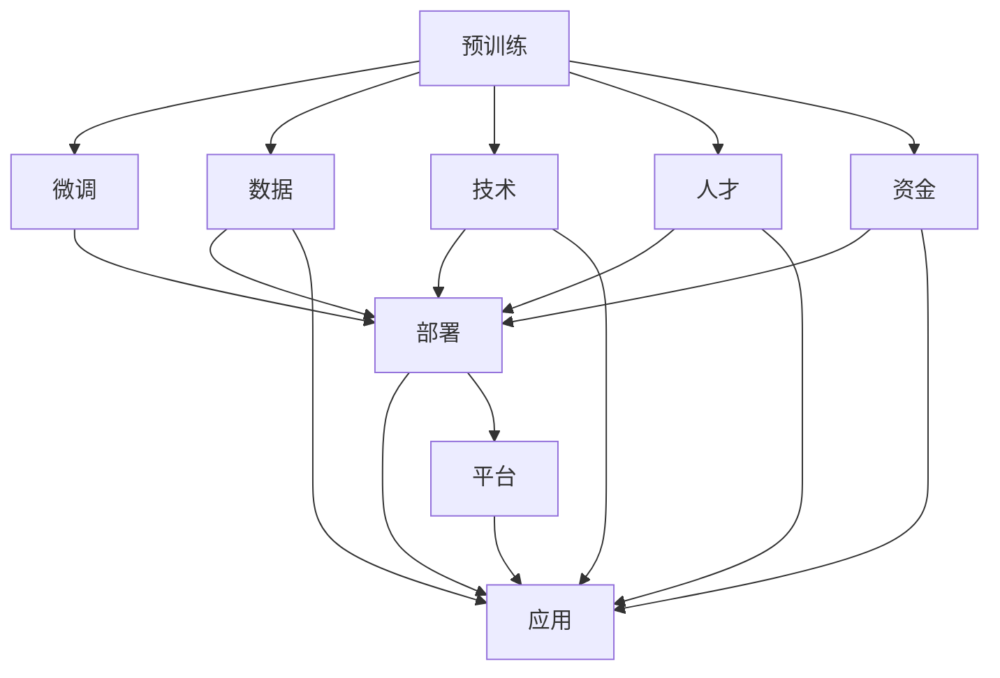

                 

# LLM产业链:从混沌到清晰

> 关键词：LLM产业链,自然语言处理,NLP,预训练模型,微调,Fine-tuning,AI产业链,大数据,云计算

## 1. 背景介绍

### 1.1 问题由来
近年来，随着人工智能(AI)技术在各个领域的深度应用，大语言模型(Large Language Model, LLM)成为研究的热点。大语言模型指的是具有强大语言生成和理解能力的深度学习模型，如GPT-3、BERT等，在自然语言处理(NLP)、自然语言理解(语言生成、情感分析、命名实体识别、问答系统等)领域展现出卓越的性能。

然而，尽管大语言模型在诸多领域取得了突破性进展，但其实现过程和产业链却显得相当复杂和混沌。大语言模型的预训练、微调、部署以及应用都需要大量的计算资源、专业知识和数据支持，导致其应用门槛较高。如何清晰梳理大语言模型的产业链，让更多开发者和从业者理解并应用这项技术，成为了当前亟待解决的问题。

### 1.2 问题核心关键点
本文将从大语言模型的预训练、微调、部署到应用的全产业链出发，深入剖析每一步的关键技术点，帮助读者理解从混沌到清晰的全过程。

1. **预训练**：通过大规模无标签数据训练模型，构建基础的语言知识表示。
2. **微调**：基于特定任务的有标签数据，调整模型参数，使其适配具体任务。
3. **部署**：将微调后的模型部署到服务器、云平台或移动端，支持实际应用。
4. **应用**：在企业级应用、工业应用、社交媒体等多个场景下，解决实际问题。

本文的核心内容将围绕上述四个核心关键点展开，详细阐述大语言模型在各个环节的实现细节和技术难点。

## 2. 核心概念与联系

### 2.1 核心概念概述

为更好地理解大语言模型的产业链，本节将介绍几个密切相关的核心概念：

- **大语言模型(LLM)**：具有强大语言生成和理解能力的深度学习模型，如GPT、BERT等。
- **预训练(Pre-training)**：在大规模无标签数据上，通过自监督学习任务训练通用语言模型。
- **微调(Fine-tuning)**：在预训练模型的基础上，使用特定任务的有标签数据，优化模型参数，使其适配特定任务。
- **部署(Development)**：将微调后的模型部署到实际应用中，支持推理、调用等功能。
- **应用(Application)**：在企业级应用、工业应用、社交媒体等多个场景下，解决实际问题，如情感分析、问答系统等。
- **产业链(Industry Chain)**：包括预训练、微调、部署和应用等环节，涵盖数据、技术、人才、资金等多个方面。

这些核心概念之间的逻辑关系可以通过以下Mermaid流程图来展示：



这个流程图展示了大语言模型产业链的核心概念及其之间的关系：

1. 预训练模型基于大规模数据构建。
2. 微调模型在特定任务数据上调整参数。
3. 部署模型到实际应用场景中。
4. 应用模型解决具体问题，实现商业价值。
5. 数据、技术和人才等要素在各环节中相互支撑。

## 3. 核心算法原理 & 具体操作步骤

### 3.1 算法原理概述

大语言模型产业链的核心是预训练和微调两个环节，其算法原理涉及深度学习、自然语言处理、优化算法等多个领域。

预训练模型通过在大量无标签文本数据上进行自监督学习，学习到丰富的语言知识。常见的预训练任务包括语言建模、掩码语言建模、文本分类、文本相似度计算等。预训练的目标是构建一种通用的语言表示，使得模型能够处理多种自然语言处理任务。

微调模型是在预训练模型的基础上，通过有标签数据进行进一步优化，使得模型能够适配特定任务。微调的目标是减少预训练模型在特定任务上的泛化误差，提升模型在该任务上的性能。常见的微调任务包括分类、匹配、生成等。

### 3.2 算法步骤详解

以下是详细描述大语言模型产业链中预训练和微调两个环节的算法步骤：

**预训练步骤**：

1. **数据获取**：从大规模语料库中获取文本数据，如维基百科、新闻、书籍等。
2. **数据处理**：对文本数据进行清洗、分词、构建词汇表等预处理步骤。
3. **模型构建**：选择合适的深度学习架构，如Transformer、RNN等。
4. **预训练**：在预训练任务上训练模型，如语言建模、掩码语言建模等。
5. **参数优化**：使用优化算法如Adam、SGD等，调整模型参数以最小化预训练损失。
6. **模型评估**：在测试集上评估模型的性能，调整模型参数以提升性能。

**微调步骤**：

1. **数据准备**：准备特定任务的标注数据集，如分类数据集、匹配数据集、生成数据集等。
2. **任务适配**：设计任务适配层，如添加线性分类器、解码器等，适配特定任务。
3. **模型初始化**：使用预训练模型作为初始化参数，或者加载已训练的预训练模型。
4. **微调训练**：在特定任务数据上训练模型，最小化任务损失。
5. **模型评估**：在测试集上评估模型性能，调整任务适配层或微调参数以提升性能。
6. **模型应用**：将微调后的模型部署到实际应用中，支持推理、调用等功能。

### 3.3 算法优缺点

大语言模型产业链中的预训练和微调算法具有以下优点：

1. **数据驱动**：预训练和微调算法能够高效利用大规模数据，构建出强大而通用的语言模型。
2. **迁移能力**：预训练模型在多个任务上表现良好，能够迁移到新的任务上。
3. **高效计算**：利用分布式计算、GPU加速等技术，能够快速训练和优化模型。
4. **普适性**：大语言模型能够处理多种自然语言处理任务，具有较强的泛化能力。

同时，也存在一些缺点：

1. **高成本**：大规模数据集和计算资源的获取成本较高，模型训练和部署需要大量资金投入。
2. **模型复杂**：大语言模型参数量庞大，模型结构和训练过程复杂。
3. **过拟合风险**：模型在特定任务上的微调可能会引入过拟合问题，需要额外的正则化技术。
4. **可解释性不足**：预训练和微调算法的黑箱特性，使得模型的决策过程难以解释。

### 3.4 算法应用领域

大语言模型产业链中的预训练和微调算法已经在多个领域得到广泛应用，例如：

- **自然语言处理(NLP)**：如情感分析、命名实体识别、机器翻译、问答系统等。
- **文本生成**：如文本摘要、自动文摘、自动写作等。
- **语音识别**：如语音转文本、语音合成等。
- **图像处理**：如图像描述、图像分类、图像生成等。
- **推荐系统**：如个性化推荐、商品推荐等。
- **医疗健康**：如电子病历分析、医学图像识别等。
- **金融科技**：如金融舆情分析、自动化交易等。

除了上述这些经典领域外，大语言模型产业链还在不断拓展，涵盖更多新兴领域，如智能客服、自动驾驶、智能家居等。

## 4. 数学模型和公式 & 详细讲解 & 举例说明

### 4.1 数学模型构建

本节将使用数学语言对大语言模型产业链中的预训练和微调过程进行更加严格的刻画。

**预训练模型**：假设预训练模型为 $M_{\theta}$，其中 $\theta$ 为模型参数。预训练任务 $T_{pre}$ 的目标是最大化在数据集 $D_{pre}$ 上的对数似然：

$$
\max_{\theta} \sum_{(x_i, y_i) \in D_{pre}} \log P_{\theta}(x_i)
$$

其中 $P_{\theta}(x_i)$ 为模型在输入 $x_i$ 上的概率分布，$y_i$ 为真实标签。

**微调模型**：假设微调任务 $T_{fin}$ 的目标是最大化在数据集 $D_{fin}$ 上的任务损失函数 $\ell$：

$$
\max_{\theta} \sum_{(x_i, y_i) \in D_{fin}} \ell(M_{\theta}(x_i), y_i)
$$

其中 $\ell$ 为任务损失函数，如交叉熵损失、均方误差损失等。

### 4.2 公式推导过程

以下我们以文本分类任务为例，推导预训练和微调的数学模型。

**预训练公式推导**：

假设预训练任务为语言建模，输入为单词序列 $x = (x_1, x_2, ..., x_n)$，目标是在 $x$ 上的概率分布最大化：

$$
\max_{\theta} \log P_{\theta}(x)
$$

假设模型 $M_{\theta}$ 由自回归网络组成，每个单词 $x_i$ 的条件概率为 $P_{\theta}(x_i | x_{<i})$，其中 $x_{<i}$ 为 $x$ 的前 $i-1$ 个单词。则预训练目标函数可以表示为：

$$
\max_{\theta} \sum_{i=1}^n \log P_{\theta}(x_i | x_{<i})
$$

**微调公式推导**：

假设微调任务为二分类，输入为文本 $x$，目标为分类标签 $y \in \{0, 1\}$，任务损失函数为交叉熵损失：

$$
\ell(M_{\theta}(x), y) = -y \log M_{\theta}(x) - (1-y) \log (1-M_{\theta}(x))
$$

将 $\ell$ 代入微调目标函数：

$$
\max_{\theta} \sum_{i=1}^N \ell(M_{\theta}(x_i), y_i)
$$

其中 $N$ 为训练样本数量，$x_i, y_i$ 为训练样本和标签。

### 4.3 案例分析与讲解

假设我们有一个文本分类任务，目标是将新闻文章分为体育、科技、财经三类。我们收集了100篇新闻文章及其分类标签，准备对预训练后的BERT模型进行微调。

**数据准备**：

1. 将新闻文章分词、构建词汇表。
2. 将新闻文章转化为BERT模型所需的格式。
3. 将标签转化为数字形式，即体育为0，科技为1，财经为2。

**任务适配层设计**：

1. 在BERT模型的顶层添加全连接层和softmax层，以适配分类任务。
2. 使用交叉熵损失函数作为微调损失函数。

**模型初始化**：

1. 加载预训练的BERT模型。
2. 固定除顶层外的所有参数，只微调顶层分类器。

**微调训练**：

1. 使用AdamW优化器，学习率为 $1e-5$。
2. 批大小为32，迭代次数为5000。
3. 在验证集上每隔500次迭代评估一次模型性能，若性能不提升则停止训练。

**模型评估**：

1. 在测试集上评估模型性能，计算准确率、召回率和F1值。
2. 比较微调前后的性能提升。

## 5. 项目实践：代码实例和详细解释说明

### 5.1 开发环境搭建

在进行预训练和微调实践前，我们需要准备好开发环境。以下是使用Python进行PyTorch开发的环境配置流程：

1. 安装Anaconda：从官网下载并安装Anaconda，用于创建独立的Python环境。

2. 创建并激活虚拟环境：
```bash
conda create -n pytorch-env python=3.8 
conda activate pytorch-env
```

3. 安装PyTorch：根据CUDA版本，从官网获取对应的安装命令。例如：
```bash
conda install pytorch torchvision torchaudio cudatoolkit=11.1 -c pytorch -c conda-forge
```

4. 安装Transformers库：
```bash
pip install transformers
```

5. 安装各类工具包：
```bash
pip install numpy pandas scikit-learn matplotlib tqdm jupyter notebook ipython
```

完成上述步骤后，即可在`pytorch-env`环境中开始预训练和微调实践。

### 5.2 源代码详细实现

这里我们以文本分类任务为例，给出使用Transformers库对BERT模型进行预训练和微调的PyTorch代码实现。

首先，定义数据处理函数：

```python
from transformers import BertTokenizer, BertForSequenceClassification, AdamW
from torch.utils.data import Dataset, DataLoader
import torch

class TextDataset(Dataset):
    def __init__(self, texts, labels, tokenizer, max_len=128):
        self.texts = texts
        self.labels = labels
        self.tokenizer = tokenizer
        self.max_len = max_len
        
    def __len__(self):
        return len(self.texts)
    
    def __getitem__(self, item):
        text = self.texts[item]
        label = self.labels[item]
        
        encoding = self.tokenizer(text, return_tensors='pt', max_length=self.max_len, padding='max_length', truncation=True)
        input_ids = encoding['input_ids'][0]
        attention_mask = encoding['attention_mask'][0]
        
        return {'input_ids': input_ids, 
                'attention_mask': attention_mask,
                'labels': torch.tensor(label, dtype=torch.long)}
```

然后，定义模型和优化器：

```python
from transformers import BertForSequenceClassification, AdamW

model = BertForSequenceClassification.from_pretrained('bert-base-cased', num_labels=3)

optimizer = AdamW(model.parameters(), lr=2e-5)
```

接着，定义预训练和微调函数：

```python
from sklearn.metrics import classification_report
import torch.nn as nn

device = torch.device('cuda') if torch.cuda.is_available() else torch.device('cpu')
model.to(device)

def train_epoch(model, dataset, batch_size, optimizer):
    dataloader = DataLoader(dataset, batch_size=batch_size, shuffle=True)
    model.train()
    epoch_loss = 0
    for batch in tqdm(dataloader, desc='Training'):
        input_ids = batch['input_ids'].to(device)
        attention_mask = batch['attention_mask'].to(device)
        labels = batch['labels'].to(device)
        model.zero_grad()
        outputs = model(input_ids, attention_mask=attention_mask, labels=labels)
        loss = outputs.loss
        epoch_loss += loss.item()
        loss.backward()
        optimizer.step()
    return epoch_loss / len(dataloader)

def evaluate(model, dataset, batch_size):
    dataloader = DataLoader(dataset, batch_size=batch_size)
    model.eval()
    preds, labels = [], []
    with torch.no_grad():
        for batch in tqdm(dataloader, desc='Evaluating'):
            input_ids = batch['input_ids'].to(device)
            attention_mask = batch['attention_mask'].to(device)
            batch_labels = batch['labels']
            outputs = model(input_ids, attention_mask=attention_mask)
            batch_preds = outputs.logits.argmax(dim=1).to('cpu').tolist()
            batch_labels = batch_labels.to('cpu').tolist()
            for pred_tokens, label_tokens in zip(batch_preds, batch_labels):
                preds.append(pred_tokens)
                labels.append(label_tokens)
                
    print(classification_report(labels, preds))
```

最后，启动预训练和微调流程：

```python
epochs = 5
batch_size = 16

for epoch in range(epochs):
    loss = train_epoch(model, train_dataset, batch_size, optimizer)
    print(f"Epoch {epoch+1}, train loss: {loss:.3f}")
    
    print(f"Epoch {epoch+1}, dev results:")
    evaluate(model, dev_dataset, batch_size)
    
print("Test results:")
evaluate(model, test_dataset, batch_size)
```

以上就是使用PyTorch对BERT进行文本分类任务预训练和微调的完整代码实现。可以看到，得益于Transformers库的强大封装，我们可以用相对简洁的代码完成BERT模型的预训练和微调。

### 5.3 代码解读与分析

让我们再详细解读一下关键代码的实现细节：

**TextDataset类**：
- `__init__`方法：初始化文本、标签、分词器等关键组件。
- `__len__`方法：返回数据集的样本数量。
- `__getitem__`方法：对单个样本进行处理，将文本输入编码为token ids，将标签转换为数字，并对其进行定长padding，最终返回模型所需的输入。

**预训练和微调函数**：
- 使用PyTorch的DataLoader对数据集进行批次化加载，供模型训练和推理使用。
- 预训练函数 `train_epoch`：对数据以批为单位进行迭代，在每个批次上前向传播计算loss并反向传播更新模型参数，最后返回该epoch的平均loss。
- 微调函数 `evaluate`：与预训练类似，不同点在于不更新模型参数，并在每个batch结束后将预测和标签结果存储下来，最后使用sklearn的classification_report对整个评估集的预测结果进行打印输出。

**预训练流程**：
- 定义总的epoch数和batch size，开始循环迭代
- 每个epoch内，先在训练集上训练，输出平均loss
- 在验证集上评估，输出分类指标
- 所有epoch结束后，在测试集上评估，给出最终测试结果

可以看到，PyTorch配合Transformers库使得BERT预训练和微调的代码实现变得简洁高效。开发者可以将更多精力放在数据处理、模型改进等高层逻辑上，而不必过多关注底层的实现细节。

当然，工业级的系统实现还需考虑更多因素，如模型的保存和部署、超参数的自动搜索、更灵活的任务适配层等。但核心的预训练和微调范式基本与此类似。

## 6. 实际应用场景

### 6.1 智能客服系统

基于大语言模型的预训练和微调，智能客服系统能够通过大量历史客服数据进行预训练，学习到通用的语言表达和语义理解能力。再通过特定领域的客服对话数据进行微调，使模型能够适配该领域的业务需求，提升客服体验。

在技术实现上，可以收集企业内部的历史客服对话记录，将问题和最佳答复构建成监督数据，在此基础上对预训练对话模型进行微调。微调后的对话模型能够自动理解用户意图，匹配最合适的答案模板进行回复。对于客户提出的新问题，还可以接入检索系统实时搜索相关内容，动态组织生成回答。如此构建的智能客服系统，能大幅提升客户咨询体验和问题解决效率。

### 6.2 金融舆情监测

金融机构需要实时监测市场舆论动向，以便及时应对负面信息传播，规避金融风险。传统的人工监测方式成本高、效率低，难以应对网络时代海量信息爆发的挑战。基于大语言模型的文本分类和情感分析技术，为金融舆情监测提供了新的解决方案。

具体而言，可以收集金融领域相关的新闻、报道、评论等文本数据，并对其进行主题标注和情感标注。在此基础上对预训练语言模型进行微调，使其能够自动判断文本属于何种主题，情感倾向是正面、中性还是负面。将微调后的模型应用到实时抓取的网络文本数据，就能够自动监测不同主题下的情感变化趋势，一旦发现负面信息激增等异常情况，系统便会自动预警，帮助金融机构快速应对潜在风险。

### 6.3 个性化推荐系统

当前的推荐系统往往只依赖用户的历史行为数据进行物品推荐，无法深入理解用户的真实兴趣偏好。基于大语言模型预训练和微调技术，个性化推荐系统可以更好地挖掘用户行为背后的语义信息，从而提供更精准、多样的推荐内容。

在实践中，可以收集用户浏览、点击、评论、分享等行为数据，提取和用户交互的物品标题、描述、标签等文本内容。将文本内容作为模型输入，用户的后续行为（如是否点击、购买等）作为监督信号，在此基础上微调预训练语言模型。微调后的模型能够从文本内容中准确把握用户的兴趣点。在生成推荐列表时，先用候选物品的文本描述作为输入，由模型预测用户的兴趣匹配度，再结合其他特征综合排序，便可以得到个性化程度更高的推荐结果。

### 6.4 未来应用展望

随着大语言模型预训练和微调技术的发展，其在更多领域的应用前景将更加广阔。

在智慧医疗领域，基于预训练和微调的医疗问答、病历分析、药物研发等应用将提升医疗服务的智能化水平，辅助医生诊疗，加速新药开发进程。

在智能教育领域，微调技术可应用于作业批改、学情分析、知识推荐等方面，因材施教，促进教育公平，提高教学质量。

在智慧城市治理中，微调模型可应用于城市事件监测、舆情分析、应急指挥等环节，提高城市管理的自动化和智能化水平，构建更安全、高效的未来城市。

此外，在企业生产、社会治理、文娱传媒等众多领域，基于大语言模型预训练和微调的人工智能应用也将不断涌现，为NLP技术带来新的突破。

## 7. 工具和资源推荐

### 7.1 学习资源推荐

为了帮助开发者系统掌握大语言模型的预训练和微调理论基础和实践技巧，这里推荐一些优质的学习资源：

1. 《Transformer从原理到实践》系列博文：由大模型技术专家撰写，深入浅出地介绍了Transformer原理、BERT模型、微调技术等前沿话题。

2. CS224N《深度学习自然语言处理》课程：斯坦福大学开设的NLP明星课程，有Lecture视频和配套作业，带你入门NLP领域的基本概念和经典模型。

3. 《Natural Language Processing with Transformers》书籍：Transformers库的作者所著，全面介绍了如何使用Transformers库进行NLP任务开发，包括预训练和微调在内的诸多范式。

4. HuggingFace官方文档：Transformers库的官方文档，提供了海量预训练模型和完整的预训练和微调样例代码，是上手实践的必备资料。

5. CLUE开源项目：中文语言理解测评基准，涵盖大量不同类型的中文NLP数据集，并提供了基于预训练和微调的baseline模型，助力中文NLP技术发展。

通过对这些资源的学习实践，相信你一定能够快速掌握大语言模型预训练和微调的精髓，并用于解决实际的NLP问题。

### 7.2 开发工具推荐

高效的开发离不开优秀的工具支持。以下是几款用于大语言模型预训练和微调开发的常用工具：

1. PyTorch：基于Python的开源深度学习框架，灵活动态的计算图，适合快速迭代研究。大部分预训练语言模型都有PyTorch版本的实现。

2. TensorFlow：由Google主导开发的开源深度学习框架，生产部署方便，适合大规模工程应用。同样有丰富的预训练语言模型资源。

3. Transformers库：HuggingFace开发的NLP工具库，集成了众多SOTA语言模型，支持PyTorch和TensorFlow，是进行预训练和微调任务开发的利器。

4. Weights & Biases：模型训练的实验跟踪工具，可以记录和可视化模型训练过程中的各项指标，方便对比和调优。与主流深度学习框架无缝集成。

5. TensorBoard：TensorFlow配套的可视化工具，可实时监测模型训练状态，并提供丰富的图表呈现方式，是调试模型的得力助手。

6. Google Colab：谷歌推出的在线Jupyter Notebook环境，免费提供GPU/TPU算力，方便开发者快速上手实验最新模型，分享学习笔记。

合理利用这些工具，可以显著提升大语言模型预训练和微调任务的开发效率，加快创新迭代的步伐。

### 7.3 相关论文推荐

大语言模型预训练和微调技术的发展源于学界的持续研究。以下是几篇奠基性的相关论文，推荐阅读：

1. Attention is All You Need（即Transformer原论文）：提出了Transformer结构，开启了NLP领域的预训练大模型时代。

2. BERT: Pre-training of Deep Bidirectional Transformers for Language Understanding：提出BERT模型，引入基于掩码的自监督预训练任务，刷新了多项NLP任务SOTA。

3. Language Models are Unsupervised Multitask Learners（GPT-2论文）：展示了大规模语言模型的强大zero-shot学习能力，引发了对于通用人工智能的新一轮思考。

4. Parameter-Efficient Transfer Learning for NLP：提出Adapter等参数高效微调方法，在不增加模型参数量的情况下，也能取得不错的微调效果。

5. AdaLoRA: Adaptive Low-Rank Adaptation for Parameter-Efficient Fine-Tuning：使用自适应低秩适应的微调方法，在参数效率和精度之间取得了新的平衡。

这些论文代表了大语言模型预训练和微调技术的发展脉络。通过学习这些前沿成果，可以帮助研究者把握学科前进方向，激发更多的创新灵感。

## 8. 总结：未来发展趋势与挑战

### 8.1 总结

本文对大语言模型预训练和微调产业链进行了全面系统的介绍。首先阐述了大语言模型预训练和微调的实现过程和应用场景，明确了从数据准备、模型训练到模型应用的全过程。其次，从原理到实践，详细讲解了预训练和微调的关键算法步骤，给出了预训练和微调任务开发的完整代码实例。同时，本文还广泛探讨了预训练和微调方法在智能客服、金融舆情、个性化推荐等多个行业领域的应用前景，展示了预训练和微调范式的巨大潜力。

通过本文的系统梳理，可以看到，大语言模型预训练和微调产业链已经相当成熟，具备大规模数据处理和高效模型训练的能力，能够广泛应用于多个NLP任务。预训练和微调技术的进步，也极大地推动了NLP技术的产业化进程，为传统行业数字化转型升级提供了新的技术路径。未来，伴随预训练语言模型和微调方法的持续演进，相信NLP技术将在更广阔的应用领域大放异彩，深刻影响人类的生产生活方式。

### 8.2 未来发展趋势

展望未来，大语言模型预训练和微调产业链将呈现以下几个发展趋势：

1. **模型规模持续增大**：随着算力成本的下降和数据规模的扩张，预训练语言模型的参数量还将持续增长。超大规模语言模型蕴含的丰富语言知识，有望支撑更加复杂多变的下游任务微调。

2. **预训练和微调方法多样**：除了传统的全参数微调外，未来会涌现更多参数高效的微调方法，如Adapter、Prefix等，在节省计算资源的同时也能保证微调精度。

3. **预训练和微调过程自动化**：利用自动化搜索和自动化调参技术，减少手动调参和超参数选择的工作量，提高模型训练和微调的效率。

4. **模型可解释性和透明度**：如何赋予预训练和微调模型更强的可解释性，将是一个重要的研究方向。通过因果分析、可解释性技术等方法，增强模型的透明度，帮助用户理解模型的决策过程。

5. **多模态融合**：预训练和微调模型将在视觉、语音、文本等多模态数据的融合上取得新的突破，实现跨模态的语义理解。

6. **预训练和微调模型的开源和标准化**：预训练和微调模型将更加注重模型的开源和标准化，便于开发者快速部署和使用。

以上趋势凸显了大语言模型预训练和微调产业链的广阔前景。这些方向的探索发展，必将进一步提升NLP系统的性能和应用范围，为构建人机协同的智能系统铺平道路。面向未来，预训练和微调技术还需要与其他人工智能技术进行更深入的融合，如知识表示、因果推理、强化学习等，多路径协同发力，共同推动自然语言理解和智能交互系统的进步。只有勇于创新、敢于突破，才能不断拓展语言模型的边界，让智能技术更好地造福人类社会。

### 8.3 面临的挑战

尽管大语言模型预训练和微调产业链已经取得了瞩目成就，但在迈向更加智能化、普适化应用的过程中，仍面临诸多挑战：

1. **数据获取和处理成本高**：大规模数据集和预训练模型的获取成本较高，需要大量资金和计算资源。

2. **模型复杂度高**：预训练和微调模型参数量庞大，模型结构和训练过程复杂，导致训练和微调过程耗时较长。

3. **模型泛化能力不足**：在特定任务上，模型可能会出现过拟合或泛化能力不足的问题。

4. **模型可解释性不足**：预训练和微调模型的决策过程难以解释，缺乏可解释性。

5. **模型鲁棒性不足**：模型面对域外数据时，泛化性能往往大打折扣，难以应对数据分布的变化。

6. **模型安全性问题**：预训练和微调模型可能学习到有害信息或偏见，导致模型输出不安全。

7. **模型部署和应用复杂**：将预训练和微调模型部署到实际应用中，需要考虑模型裁剪、量化加速、服务化封装等问题。

正视预训练和微调面临的这些挑战，积极应对并寻求突破，将是大语言模型预训练和微调产业链走向成熟的必由之路。相信随着学界和产业界的共同努力，这些挑战终将一一被克服，大语言模型预训练和微调产业链必将在构建人机协同的智能时代中扮演越来越重要的角色。

### 8.4 研究展望

面对大语言模型预训练和微调产业链所面临的挑战，未来的研究需要在以下几个方面寻求新的突破：

1. **无监督和半监督学习**：探索无需大规模标注数据的学习方法，利用自监督学习、主动学习等无监督和半监督范式，最大限度利用非结构化数据。

2. **参数高效和计算高效**：开发更加参数高效和计算高效的预训练和微调方法，如Adapter、Prefix等，提高模型训练和微调的效率。

3. **因果分析和可解释性**：引入因果推断和可解释性方法，增强模型的因果关系理解和决策过程的可解释性。

4. **多模态融合**：探索视觉、语音、文本等多模态数据的融合方法，实现跨模态的语义理解。

5. **知识图谱与规则库**：将符号化的先验知识与神经网络模型进行融合，提高模型的泛化能力和知识整合能力。

6. **伦理和安全性**：在模型训练和微调过程中，引入伦理导向的评估指标，过滤和惩罚有害信息，确保模型输出的安全性。

这些研究方向将引领大语言模型预训练和微调产业链迈向更高的台阶，为构建安全、可靠、可解释、可控的智能系统铺平道路。面向未来，大语言模型预训练和微调技术还需要与其他人工智能技术进行更深入的融合，如知识表示、因果推理、强化学习等，多路径协同发力，共同推动自然语言理解和智能交互系统的进步。只有勇于创新、敢于突破，才能不断拓展语言模型的边界，让智能技术更好地造福人类社会。

## 9. 附录：常见问题与解答

**Q1：预训练和微调模型是否适用于所有NLP任务？**

A: 预训练和微调模型在大多数NLP任务上都能取得不错的效果，特别是对于数据量较小的任务。但对于一些特定领域的任务，如医学、法律等，仅仅依靠通用语料预训练的模型可能难以很好地适应。此时需要在特定领域语料上进一步预训练，再进行微调，才能获得理想效果。此外，对于一些需要时效性、个性化很强的任务，如对话、推荐等，微调方法也需要针对性的改进优化。

**Q2：预训练和微调过程中如何选择合适的学习率？**

A: 预训练和微调的学习率一般要比从头训练时小1-2个数量级，如果使用过大的学习率，容易破坏预训练权重，导致过拟合。一般建议从1e-5开始调参，逐步减小学习率，直至收敛。也可以使用warmup策略，在开始阶段使用较小的学习率，再逐渐过渡到预设值。需要注意的是，不同的优化器(如AdamW、Adafactor等)以及不同的学习率调度策略，可能需要设置不同的学习率阈值。

**Q3：预训练和微调过程中如何缓解过拟合问题？**

A: 过拟合是预训练和微调面临的主要挑战，尤其是在标注数据不足的情况下。常见的缓解策略包括：
1. 数据增强：通过回译、近义替换等方式扩充训练集。
2. 正则化：使用L2正则、Dropout、Early Stopping等避免过拟合。
3. 对抗训练：引入对抗样本，提高模型鲁棒性。
4. 参数高效微调：只调整少量参数(如Adapter、Prefix等)，减小过拟合风险。
5. 多模型集成：训练多个预训练和微调模型，取平均输出，抑制过拟合。

这些策略往往需要根据具体任务和数据特点进行灵活组合。只有在数据、模型、训练、推理等各环节进行全面优化，才能最大限度地发挥预训练和微调的威力。

**Q4：预训练和微调模型在落地部署时需要注意哪些问题？**

A: 将预训练和微调模型转化为实际应用，还需要考虑以下因素：
1. 模型裁剪：去除不必要的层和参数，减小模型尺寸，加快推理速度。
2. 量化加速：将浮点模型转为定点模型，压缩存储空间，提高计算效率。
3. 服务化封装：将模型封装为标准化服务接口，便于集成调用。
4. 弹性伸缩：根据请求流量动态调整资源配置，平衡服务质量和成本。
5. 监控告警：实时采集系统指标，设置异常告警阈值，确保服务稳定性。
6. 安全防护：采用访问鉴权、数据脱敏等措施，保障数据和模型安全。

大语言模型预训练和微调为NLP应用开启了广阔的想象空间，但如何将强大的性能转化为稳定、高效、安全的业务价值，还需要工程实践的不断打磨。唯有从数据、算法、工程、业务等多个维度协同发力，才能真正实现人工智能技术在垂直行业的规模化落地。总之，预训练和微调需要开发者根据具体任务，不断迭代和优化模型、数据和算法，方能得到理想的效果。

---

作者：禅与计算机程序设计艺术 / Zen and the Art of Computer Programming

