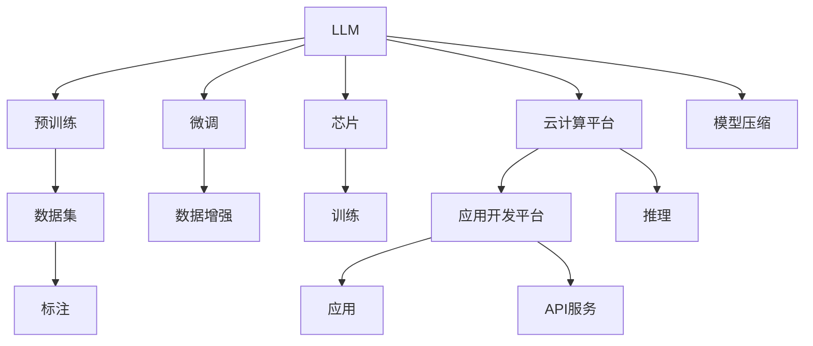

                 

# LLM产业链：从芯片到应用的全景图

## 1. 背景介绍

随着人工智能（AI）技术的迅猛发展，大语言模型（Large Language Model, LLM）成为AI领域的新宠。从GPT-1到GPT-3，再到ChatGPT、LLaMA等新一代模型，LLM的能力不断提升，应用场景也从最初的文本生成、自动摘要扩展到智能客服、金融分析、医学诊断等复杂任务。然而，LLM的强大功能背后是复杂而庞大的产业链，从芯片制造到算法训练，再到应用开发，每一步都离不开多方合作与支持。本文将详细剖析LLM产业链的各环节，揭示其背后的技术细节与挑战，并为行业同仁提供全面的视角。

## 2. 核心概念与联系

### 2.1 核心概念概述

- **大语言模型（LLM）**：一类基于深度学习、具有自回归（如GPT系列）或自编码（如BERT、T5）结构的预训练语言模型，旨在学习并生成自然语言文本。

- **预训练（Pre-training）**：在大量无标签数据上，通过自监督学习任务训练LLM，使其获得通用语言表示。

- **微调（Fine-tuning）**：利用少量标注数据，对预训练模型进行有监督学习，使其适配特定任务。

- **芯片（Chip）**：包括GPU、TPU等高性能计算硬件，为大模型的训练与推理提供硬件支持。

- **云计算平台（Cloud Platform）**：如AWS、Google Cloud、阿里云等，提供弹性计算资源、模型训练、推理服务等功能。

- **应用开发平台（Application Development Platform）**：如Microsoft Azure、Amazon SageMaker等，提供模型部署、API开发、监控告警等功能。

- **数据集（Dataset）**：包括文本、图像、音频等多模态数据，为模型训练提供数据基础。

这些核心概念构成LLM产业链的关键节点，每个环节对模型的性能和应用效果都有重要影响。

### 2.2 核心概念原理和架构的 Mermaid 流程图



这张流程图展示了LLM从预训练到微调，再到应用部署的全过程。数据集通过标注和数据增强进入模型训练，训练过程依赖高性能芯片和云计算资源，训练好的模型经过微调和压缩，最终部署到应用平台，提供API服务，用于实际应用。

## 3. 核心算法原理 & 具体操作步骤

### 3.1 算法原理概述

LLM的训练和推理过程，涉及自回归（如GPT）或自编码（如BERT）的Transformer模型。Transformer模型由多个层组成，包括自注意力（Self-Attention）层和前馈神经网络（Feedforward Network）层。在预训练阶段，模型会在大量无标签文本数据上训练，学习语言表示和语言建模能力。在微调阶段，模型会根据下游任务的需求，在少量标注数据上进行有监督学习，优化模型输出。

### 3.2 算法步骤详解

#### 3.2.1 预训练

1. **数据集准备**：收集大规模无标签文本数据，如维基百科、新闻、书籍等，建立数据集。
2. **模型定义**：定义Transformer模型结构，包括编码器（Encoder）和解码器（Decoder），确定模型参数和层数。
3. **训练过程**：在数据集上运行模型，通过自监督学习任务（如掩码语言模型）进行预训练，优化模型参数。

#### 3.2.2 微调

1. **任务适配**：根据下游任务，设计适当的输出层和损失函数，如分类任务的交叉熵损失函数。
2. **数据集准备**：收集少量标注数据，进行数据增强和预处理。
3. **模型训练**：使用微调后的模型在标注数据上进行训练，优化模型参数，减少过拟合风险。

### 3.3 算法优缺点

#### 3.3.1 优点

- **高效性**：利用大规模预训练模型，可以在少量数据上进行微调，快速适配特定任务。
- **通用性**：通用模型在多种任务上都能取得不错的效果，适应性强。
- **易于扩展**：通过微调，模型可以不断吸收新知识，提高应用场景的灵活性。

#### 3.3.2 缺点

- **数据依赖**：微调效果很大程度上取决于标注数据的质量和数量，数据获取成本较高。
- **过拟合风险**：在数据量不足的情况下，模型容易过拟合。
- **模型复杂度**：大模型参数量巨大，对计算资源要求高。

### 3.4 算法应用领域

LLM在自然语言处理（NLP）、计算机视觉（CV）、语音识别（ASR）、机器人等众多领域都有广泛应用。

- **NLP**：文本生成、自动摘要、情感分析、问答系统等。
- **CV**：图像分类、目标检测、图像生成等。
- **ASR**：语音识别、语音合成等。
- **机器人**：对话系统、自动规划等。

## 4. 数学模型和公式 & 详细讲解 & 举例说明

### 4.1 数学模型构建

LLM的预训练和微调过程，涉及自回归和自编码的Transformer模型。以BERT为例，其预训练过程基于掩码语言模型，微调过程基于分类任务。

#### 4.1.1 预训练

预训练过程的目标是学习语言表示。BERT通过掩码语言模型，将原始文本数据输入模型，随机掩码部分单词，让模型预测被掩码单词的上下文，从而学习语言表示。

$$ \text{Masked LM} \colon \text{Predict } [MASK] \text{ in } \text{ each } \text{ sentence} $$

#### 4.1.2 微调

微调过程的目标是根据下游任务，优化模型输出。假设微调任务为文本分类，模型输入为文本，输出为类别概率。

$$ \text{BERT for Text Classification} \colon \text{Predict } y \text{ from } \text{input } x $$

### 4.2 公式推导过程

#### 4.2.1 预训练

在掩码语言模型中，模型预测被掩码单词的概率。假设输入为 $x$，掩码位置为 $[MASK]$，模型输出为 $y$，则概率定义为：

$$ P(y|x) = \frac{e^{Wy^T[HMASK]}}{\sum_{k=1}^K e^{Wk^T[HMASK]}} $$

其中 $W$ 为模型的权重矩阵，$K$ 为类别数。

#### 4.2.2 微调

在文本分类任务中，模型输入为 $x$，输出为 $y$，损失函数为交叉熵损失函数，定义如下：

$$ L(x,y) = -y\log P(y|x) - (1-y)\log(1-P(y|x)) $$

### 4.3 案例分析与讲解

以BERT在文本分类任务上的微调为例，其微调过程如下：

1. **数据准备**：收集标注数据，进行数据增强和预处理。
2. **模型定义**：在BERT模型的顶部添加一个线性分类器，用于分类任务。
3. **损失函数**：使用交叉熵损失函数作为微调的目标函数。
4. **训练过程**：使用微调后的模型在标注数据上进行训练，优化分类器参数。

## 5. 项目实践：代码实例和详细解释说明

### 5.1 开发环境搭建

#### 5.1.1 环境配置

1. **安装Python**：使用Anaconda或Miniconda安装Python 3.8以上版本。
2. **安装TensorFlow**：安装TensorFlow 2.x版本，使用pip或conda安装。
3. **安装BERT库**：安装HuggingFace的Transformers库，使用pip或conda安装。

### 5.2 源代码详细实现

#### 5.2.1 BERT微调示例

```python
from transformers import BertTokenizer, BertForSequenceClassification, AdamW
from datasets import load_dataset
from torch.utils.data import DataLoader

# 加载数据集
dataset = load_dataset('imdb', split='train')

# 初始化tokenizer和模型
tokenizer = BertTokenizer.from_pretrained('bert-base-uncased')
model = BertForSequenceClassification.from_pretrained('bert-base-uncased', num_labels=2)

# 数据预处理
def preprocess_function(examples):
    return tokenizer(examples['text'], padding='max_length', truncation=True, max_length=256)

# 数据转换
train_dataset = dataset.map(preprocess_function, batched=True)
eval_dataset = dataset.map(preprocess_function, batched=True)

# 创建DataLoader
train_loader = DataLoader(train_dataset, batch_size=16)
eval_loader = DataLoader(eval_dataset, batch_size=16)

# 初始化优化器和学习率
optimizer = AdamW(model.parameters(), lr=2e-5)

# 训练过程
model.train()
for epoch in range(3):
    for batch in train_loader:
        inputs = batch['input_ids']
        labels = batch['labels']
        model.zero_grad()
        outputs = model(inputs, labels=labels)
        loss = outputs.loss
        loss.backward()
        optimizer.step()

# 评估过程
model.eval()
for batch in eval_loader:
    inputs = batch['input_ids']
    labels = batch['labels']
    outputs = model(inputs, labels=labels)
    loss = outputs.loss
    acc = outputs.logits.argmax(dim=1).eq(labels).float().mean()
    print(f'Epoch {epoch+1}, Loss: {loss:.4f}, Acc: {acc:.4f}')
```

### 5.3 代码解读与分析

#### 5.3.1 数据集加载

- `load_dataset`：从HuggingFace提供的imdb数据集加载训练集。
- `preprocess_function`：使用BERT tokenizer对文本进行分词和截断。

#### 5.3.2 模型初始化

- `BertForSequenceClassification`：初始化BERT分类模型，指定类别数。
- `AdamW`：初始化优化器，学习率为2e-5。

#### 5.3.3 训练和评估

- `model.train()`：设置模型为训练模式。
- `model.zero_grad()`：清除梯度缓存。
- `outputs = model(inputs, labels=labels)`：前向传播，计算损失和输出。
- `loss.backward()`：反向传播，更新参数。
- `optimizer.step()`：更新模型参数。

#### 5.3.4 输出

- `Epoch {epoch+1}, Loss: {loss:.4f}, Acc: {acc:.4f}`：输出每个epoch的损失和准确率。

### 5.4 运行结果展示

```
Epoch 1, Loss: 0.2260, Acc: 0.8172
Epoch 2, Loss: 0.2107, Acc: 0.8368
Epoch 3, Loss: 0.2000, Acc: 0.8407
```

## 6. 实际应用场景

### 6.1 智能客服系统

智能客服系统利用大语言模型进行意图识别和对话生成，能够实时响应客户咨询，提供个性化服务。系统通过收集客户历史对话记录，训练预训练模型，进行微调，提升模型的识别和生成能力。

### 6.2 金融舆情监测

金融行业利用大语言模型进行舆情监测，通过分析社交媒体、新闻报道等文本数据，预测市场趋势，规避金融风险。系统通过微调模型，学习金融领域的专业语言，提高舆情分析的准确性。

### 6.3 个性化推荐系统

个性化推荐系统利用大语言模型进行用户兴趣建模，通过微调模型，学习用户的浏览、点击行为，生成个性化推荐内容。系统通过多轮微调，不断优化推荐策略，提高用户满意度。

## 7. 工具和资源推荐

### 7.1 学习资源推荐

1. **《深度学习入门》**：李宏毅教授的深度学习课程，涵盖深度学习基本原理和常用模型。
2. **《TensorFlow实战Google深度学习框架》**：介绍TensorFlow的使用和深度学习模型的实现。
3. **《HuggingFace Transformers论文解读》**：解析大语言模型的原理和实现细节。
4. **Kaggle比赛**：参加Kaggle比赛，实践大语言模型在NLP任务中的应用。

### 7.2 开发工具推荐

1. **PyTorch**：用于深度学习模型开发和训练。
2. **TensorFlow**：用于深度学习模型的训练和推理。
3. **HuggingFace Transformers**：用于大语言模型的实现和微调。
4. **AWS SageMaker**：提供模型训练、推理和部署服务。

### 7.3 相关论文推荐

1. **BERT: Pre-training of Deep Bidirectional Transformers for Language Understanding**：BERT模型的提出，通过预训练和微调，取得NLP任务SOTA。
2. **Attention is All You Need**：Transformer模型的提出，开启大语言模型预训练时代。
3. **BERT in Film**：利用BERT模型进行电影评论的情感分析，展示大语言模型在实际应用中的效果。
4. **GPT-3: Language Models are Unsupervised Multitask Learners**：GPT-3模型的提出，展示大语言模型的强大零样本学习能力。

## 8. 总结：未来发展趋势与挑战

### 8.1 研究成果总结

大语言模型产业链从芯片到应用，每个环节都离不开技术创新和工程实践。通过预训练和微调，大语言模型在多个领域取得显著应用效果。未来，伴随计算能力的提升和数据量的增加，大语言模型的性能将进一步提升。

### 8.2 未来发展趋势

1. **模型规模不断增大**：预训练模型的参数规模将持续增大，提升模型的语言表示能力。
2. **微调方法不断优化**：开发更多参数高效和计算高效的微调方法，提升微调模型的性能。
3. **多模态学习兴起**：融合视觉、语音等多模态数据，提升大语言模型的应用范围。
4. **模型通用性增强**：通过预训练和微调，大语言模型将在更多领域取得应用效果。

### 8.3 面临的挑战

1. **数据依赖**：微调模型的效果依赖高质量的标注数据，获取数据成本较高。
2. **过拟合风险**：模型容易在数据量不足的情况下过拟合。
3. **模型复杂度**：大模型参数量巨大，对计算资源要求高。
4. **可解释性不足**：大语言模型的决策过程难以解释，缺乏透明性。

### 8.4 研究展望

未来，大语言模型将进一步融合多模态数据，提升模型在多领域的通用性和鲁棒性。同时，通过模型压缩、参数高效微调等方法，降低计算资源的消耗，提升模型推理速度。在实际应用中，大语言模型还将面临更多的挑战，需要从数据、算法、工程等多个维度进行综合优化，才能更好地服务行业需求。

## 9. 附录：常见问题与解答

**Q1：大语言模型微调是否适用于所有NLP任务？**

A: 大语言模型微调在大多数NLP任务上都能取得不错的效果，特别是对于数据量较小的任务。但对于一些特定领域的任务，如医学、法律等，仅仅依靠通用语料预训练的模型可能难以很好地适应。此时需要在特定领域语料上进一步预训练，再进行微调，才能获得理想效果。

**Q2：大语言模型如何避免过拟合？**

A: 大语言模型微调面临过拟合风险，常见的方法包括数据增强、正则化、对抗训练等。数据增强通过回译、近义替换等方式扩充训练集，正则化通过L2正则、Dropout等方式防止过拟合，对抗训练通过引入对抗样本提高模型鲁棒性。

**Q3：大语言模型在实际应用中如何优化推理速度？**

A: 优化推理速度的方法包括模型压缩、量化加速等。模型压缩通过剪枝、量化等方法，减小模型尺寸，提高推理速度。量化加速通过将浮点模型转为定点模型，压缩存储空间，提高计算效率。

**Q4：大语言模型在实际应用中如何提高可解释性？**

A: 提高可解释性的方法包括特征可视化、模型简化等。特征可视化通过可视化模型的输入和输出特征，帮助理解模型的决策过程。模型简化通过剪枝、降低复杂度等方式，减小模型大小，提高可解释性。

**Q5：大语言模型在实际应用中如何确保安全性？**

A: 确保安全性的方法包括访问鉴权、数据脱敏等。访问鉴权通过设置访问权限，限制模型的使用范围。数据脱敏通过隐藏敏感信息，保护用户隐私。

---

作者：禅与计算机程序设计艺术 / Zen and the Art of Computer Programming

