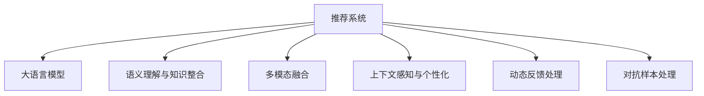

                 

# LLM作为推荐系统的评估与局限性研究

> 关键词：推荐系统,大语言模型,评价指标,局限性

## 1. 背景介绍

### 1.1 问题由来

推荐系统作为互联网时代用户信息获取的决策引擎，为用户提供了精准的个性化内容推荐。传统的推荐方法主要依赖用户行为数据，如浏览历史、点击记录、评分等，在数据量大、用户行为多样化的今天，依然面临着数据稀疏、冷启动等问题。

近年来，基于大语言模型(Large Language Model, LLM)的推荐方法受到了越来越多的关注。LLM通过大规模无标签文本预训练，学习了丰富的语言知识和常识，具备强大的语言生成能力。将其引入推荐系统，可以实现从文本中抽取隐含信息，生成有意义的推荐理由，甚至在少样本、无样本的情况下，通过自然语言推理推断出推荐结果。

### 1.2 问题核心关键点

LLM应用于推荐系统，主要涉及以下几个关键点：

- **语义理解与知识整合**：LLM能够理解自然语言描述，从文本中提取实体、关系等信息，形成结构化的知识图谱。这些知识在推荐决策中可充当推荐理由或特征，提升推荐的准确性和多样性。

- **多模态融合**：推荐系统需要融合多种模态的信息，如文本、图片、音频等。LLM能够处理文本信息，配合图像识别、语音识别等技术，实现多模态数据的整合，提供更丰富的推荐维度。

- **上下文感知与个性化**：LLM可以生成个性化推荐语段，根据用户的具体需求和上下文场景，动态生成推荐理由。在个性化推荐中，这一特性能够更好地满足用户的多样化需求。

- **处理动态反馈**：LLM可以实时处理用户的反馈，结合动态数据进行推荐调整，实现持续的优化。在实时推荐系统中，这一能力尤为重要。

- **对抗样本处理**：推荐系统可能会受到恶意对抗样本的影响，如虚假评论、恶意刷单等。LLM能够通过对抗训练和模型鲁棒性提升，增强系统的抗干扰能力。

### 1.3 问题研究意义

大语言模型在推荐系统中的应用，为推荐技术带来了新的突破点，尤其在解决数据稀疏、冷启动、推荐理由生成等方面具有独特优势。通过LLM的引入，推荐系统可以更好地适应动态变化的用户需求，提升推荐的个性化水平，构建更加精准、高效的推荐引擎。

## 2. 核心概念与联系

### 2.1 核心概念概述

本节将介绍几个密切相关的核心概念：

- **推荐系统(Recommendation System)**：通过分析用户历史行为和属性，为用户推荐相关内容，如商品、文章、视频等。推荐系统在电商、新闻、视频等多个领域都有广泛应用。

- **大语言模型(Large Language Model, LLM)**：以自回归(如GPT)或自编码(如BERT)模型为代表的大规模预训练语言模型。通过在大规模无标签文本语料上进行预训练，学习通用的语言表示，具备强大的语言理解和生成能力。

- **语义理解与知识整合**：从文本中提取实体、关系等知识，构建结构化的知识图谱，辅助推荐决策。

- **多模态融合**：融合文本、图片、音频等多模态数据，丰富推荐维度。

- **上下文感知与个性化**：根据用户的具体需求和上下文场景，动态生成推荐理由。

- **动态反馈处理**：结合用户实时反馈，动态调整推荐结果，实现持续优化。

- **对抗样本处理**：应对恶意对抗样本，提升系统鲁棒性。

这些核心概念之间的逻辑关系可以通过以下Mermaid流程图来展示：



这个流程图展示了大语言模型在推荐系统中的应用框架：

1. 推荐系统利用用户数据，生成推荐结果。
2. 将自然语言文本作为输入，通过大语言模型提取语义信息。
3. 融合多种模态数据，增强推荐维度。
4. 根据用户上下文，动态生成推荐理由。
5. 实时处理用户反馈，调整推荐结果。
6. 应对对抗样本，提高系统鲁棒性。

## 3. 核心算法原理 & 具体操作步骤
### 3.1 算法原理概述

基于大语言模型的推荐系统，本质上是一种基于自然语言推理的推荐范式。其核心思想是：通过自然语言描述，利用大语言模型的语义理解能力，抽取推荐理由，生成推荐结果。

形式化地，假设推荐系统需要为用户推荐商品 $I$，给定商品的文本描述 $D$，用户的历史评分数据 $R$，以及商品的类别 $C$。推荐的目标是最小化预测误差，即：

$$
\hat{R}_{i,t} = \mathop{\arg\min}_{\theta} \mathcal{L}(D_i; \theta)
$$

其中 $\theta$ 为大语言模型参数，$\mathcal{L}$ 为损失函数，用于衡量模型预测评分与真实评分之间的差异。

通过梯度下降等优化算法，推荐系统不断更新模型参数 $\theta$，最小化损失函数 $\mathcal{L}$，使得模型预测评分逼近真实评分。

### 3.2 算法步骤详解

基于大语言模型的推荐系统一般包括以下几个关键步骤：

**Step 1: 准备数据集**
- 收集推荐系统所需的用户行为数据，如浏览历史、评分记录等。
- 准备商品的文本描述，可以是商品标题、介绍等。

**Step 2: 数据预处理**
- 对用户行为数据进行清洗和标准化处理，去除异常值和噪声。
- 对商品描述进行分词、去停用词等预处理，以便模型输入。

**Step 3: 选择预训练模型**
- 根据任务需求，选择合适的预训练语言模型，如BERT、GPT等。

**Step 4: 添加任务适配层**
- 在预训练模型的基础上，添加任务适配层，用于生成推荐理由。

**Step 5: 设计推荐策略**
- 根据任务特点，设计推荐策略，如基于评分、兴趣、时间等的多维度推荐。

**Step 6: 训练与评估**
- 在标注数据集上训练模型，使用交叉熵损失函数进行优化。
- 在验证集和测试集上评估模型性能，选择最优模型。

**Step 7: 部署与应用**
- 将训练好的模型部署到推荐系统框架中。
- 根据用户需求实时生成推荐结果，并提供推荐理由。

### 3.3 算法优缺点

基于大语言模型的推荐系统具有以下优点：

- **语义理解能力**：LLM能够理解自然语言文本，从文本中抽取实体、关系等信息，形成结构化的知识图谱，提升推荐理由的准确性和多样性。
- **多模态融合能力**：LLM配合图像识别、语音识别等技术，实现多模态数据的整合，提供更丰富的推荐维度。
- **上下文感知与个性化**：LLM能够根据用户的具体需求和上下文场景，动态生成推荐理由，提升推荐的个性化水平。
- **动态反馈处理**：LLM可以实时处理用户的反馈，结合动态数据进行推荐调整，实现持续优化。
- **对抗样本处理**：LLM通过对抗训练和模型鲁棒性提升，增强系统的抗干扰能力。

同时，该方法也存在一些局限性：

- **数据依赖**：推荐结果的准确性高度依赖于用户行为数据和商品描述的丰富程度。对于数据稀疏、冷启动问题，推荐效果可能会大打折扣。
- **模型复杂性**：大语言模型本身具有亿计的参数量，在实时推荐系统中可能会面临计算和存储的瓶颈。
- **泛化能力**：LLM在不同领域和任务上的泛化能力需要进一步验证，特别是在特定领域的数据集上，可能需要进一步预训练。
- **解释性不足**：LLM作为"黑盒"模型，缺乏可解释性，难以理解其内部工作机制和决策逻辑。

尽管存在这些局限性，但基于大语言模型的推荐系统依然在电商、新闻、视频等多个领域展现了显著的效果，成为推荐技术的重要方向。

### 3.4 算法应用领域

基于大语言模型的推荐系统已经在电商、新闻、视频等多个领域得到了广泛的应用：

- **电商推荐**：利用用户浏览、点击、购买等行为数据，以及商品标题、介绍等信息，为用户推荐相关商品。LLM能够从商品描述中抽取关键词，生成推荐理由，提升推荐效果。

- **新闻推荐**：根据用户的历史阅读记录，以及新闻标题、摘要等信息，为用户推荐相关新闻。LLM能够从新闻文本中抽取主题、情感等信息，生成推荐理由。

- **视频推荐**：利用用户观看历史、评分记录等行为数据，以及视频标题、介绍等信息，为用户推荐相关视频。LLM能够从视频描述中抽取标签、关键词，生成推荐理由。

除了这些经典应用外，基于大语言模型的推荐系统还被创新性地应用到更多场景中，如个性化推荐、知识图谱构建、对话推荐等，为推荐技术带来了新的突破。

## 4. 数学模型和公式 & 详细讲解  
### 4.1 数学模型构建

本节将使用数学语言对基于大语言模型的推荐系统进行更加严格的刻画。

假设推荐系统需要为用户推荐商品 $I$，给定商品的文本描述 $D$，用户的历史评分数据 $R$，以及商品的类别 $C$。推荐的目标是最小化预测误差，即：

$$
\hat{R}_{i,t} = \mathop{\arg\min}_{\theta} \mathcal{L}(D_i; \theta)
$$

其中 $\theta$ 为大语言模型参数，$\mathcal{L}$ 为损失函数，用于衡量模型预测评分与真实评分之间的差异。

推荐系统的训练数据集为 $\mathcal{D}=\{(D_i, R_i, C_i)\}_{i=1}^N$，其中 $D_i$ 为商品 $I$ 的文本描述，$R_i$ 为用户的真实评分，$C_i$ 为商品 $I$ 的类别。

定义模型 $M_{\theta}$ 在商品 $I$ 的文本描述 $D_i$ 上的输出为 $\hat{R}_i$，则在数据集 $\mathcal{D}$ 上的经验风险为：

$$
\mathcal{L}(\theta) = \frac{1}{N}\sum_{i=1}^N \mathcal{L}(D_i; \theta)
$$

在实践中，我们通常使用基于梯度的优化算法（如Adam、SGD等）来近似求解上述最优化问题。设 $\eta$ 为学习率，$\lambda$ 为正则化系数，则参数的更新公式为：

$$
\theta \leftarrow \theta - \eta \nabla_{\theta}\mathcal{L}(\theta) - \eta\lambda\theta
$$

其中 $\nabla_{\theta}\mathcal{L}(\theta)$ 为损失函数对参数 $\theta$ 的梯度，可通过反向传播算法高效计算。

### 4.2 公式推导过程

以下我们以电商推荐为例，推导推荐系统的损失函数及其梯度的计算公式。

假设模型 $M_{\theta}$ 在商品 $I$ 的文本描述 $D_i$ 上的输出为 $\hat{R}_i$，真实评分为 $R_i$，则在数据集 $\mathcal{D}$ 上的经验风险为：

$$
\mathcal{L}(\theta) = \frac{1}{N}\sum_{i=1}^N [R_i - \hat{R}_i]^2
$$

根据链式法则，损失函数对参数 $\theta_k$ 的梯度为：

$$
\frac{\partial \mathcal{L}(\theta)}{\partial \theta_k} = \frac{2}{N}\sum_{i=1}^N [R_i - \hat{R}_i] \frac{\partial \hat{R}_i}{\partial \theta_k}
$$

其中 $\frac{\partial \hat{R}_i}{\partial \theta_k}$ 可进一步递归展开，利用自动微分技术完成计算。

在得到损失函数的梯度后，即可带入参数更新公式，完成模型的迭代优化。重复上述过程直至收敛，最终得到适应电商推荐任务的最优模型参数 $\theta^*$。

## 5. 项目实践：代码实例和详细解释说明
### 5.1 开发环境搭建

在进行推荐系统实践前，我们需要准备好开发环境。以下是使用Python进行PyTorch开发的环境配置流程：

1. 安装Anaconda：从官网下载并安装Anaconda，用于创建独立的Python环境。

2. 创建并激活虚拟环境：
```bash
conda create -n pytorch-env python=3.8 
conda activate pytorch-env
```

3. 安装PyTorch：根据CUDA版本，从官网获取对应的安装命令。例如：
```bash
conda install pytorch torchvision torchaudio cudatoolkit=11.1 -c pytorch -c conda-forge
```

4. 安装Transformers库：
```bash
pip install transformers
```

5. 安装各类工具包：
```bash
pip install numpy pandas scikit-learn matplotlib tqdm jupyter notebook ipython
```

完成上述步骤后，即可在`pytorch-env`环境中开始推荐系统实践。

### 5.2 源代码详细实现

这里我们以电商推荐任务为例，给出使用Transformers库对BERT模型进行电商推荐微调的PyTorch代码实现。

首先，定义电商推荐任务的数据处理函数：

```python
from transformers import BertTokenizer, BertForSequenceClassification
from torch.utils.data import Dataset, DataLoader
import torch

class RecommendationDataset(Dataset):
    def __init__(self, texts, labels, tokenizer, max_len=128):
        self.texts = texts
        self.labels = labels
        self.tokenizer = tokenizer
        self.max_len = max_len
        
    def __len__(self):
        return len(self.texts)
    
    def __getitem__(self, item):
        text = self.texts[item]
        label = self.labels[item]
        
        encoding = self.tokenizer(text, return_tensors='pt', max_length=self.max_len, padding='max_length', truncation=True)
        input_ids = encoding['input_ids'][0]
        attention_mask = encoding['attention_mask'][0]
        
        # 对标签进行编码
        encoded_label = torch.tensor(label, dtype=torch.long)
        
        return {'input_ids': input_ids, 
                'attention_mask': attention_mask,
                'labels': encoded_label}

# 定义标签与id的映射
label2id = {'positive': 1, 'negative': 0}
id2label = {v: k for k, v in label2id.items()}

# 创建dataset
tokenizer = BertTokenizer.from_pretrained('bert-base-cased')

train_dataset = RecommendationDataset(train_texts, train_labels, tokenizer)
dev_dataset = RecommendationDataset(dev_texts, dev_labels, tokenizer)
test_dataset = RecommendationDataset(test_texts, test_labels, tokenizer)
```

然后，定义模型和优化器：

```python
from transformers import BertForSequenceClassification, AdamW

model = BertForSequenceClassification.from_pretrained('bert-base-cased', num_labels=2)

optimizer = AdamW(model.parameters(), lr=2e-5)
```

接着，定义训练和评估函数：

```python
from tqdm import tqdm

device = torch.device('cuda') if torch.cuda.is_available() else torch.device('cpu')
model.to(device)

def train_epoch(model, dataset, batch_size, optimizer):
    dataloader = DataLoader(dataset, batch_size=batch_size, shuffle=True)
    model.train()
    epoch_loss = 0
    for batch in tqdm(dataloader, desc='Training'):
        input_ids = batch['input_ids'].to(device)
        attention_mask = batch['attention_mask'].to(device)
        labels = batch['labels'].to(device)
        model.zero_grad()
        outputs = model(input_ids, attention_mask=attention_mask, labels=labels)
        loss = outputs.loss
        epoch_loss += loss.item()
        loss.backward()
        optimizer.step()
    return epoch_loss / len(dataloader)

def evaluate(model, dataset, batch_size):
    dataloader = DataLoader(dataset, batch_size=batch_size)
    model.eval()
    preds, labels = [], []
    with torch.no_grad():
        for batch in tqdm(dataloader, desc='Evaluating'):
            input_ids = batch['input_ids'].to(device)
            attention_mask = batch['attention_mask'].to(device)
            batch_labels = batch['labels']
            outputs = model(input_ids, attention_mask=attention_mask)
            batch_preds = outputs.logits.argmax(dim=2).to('cpu').tolist()
            batch_labels = batch_labels.to('cpu').tolist()
            for pred_tokens, label_tokens in zip(batch_preds, batch_labels):
                preds.append(pred_tokens)
                labels.append(label_tokens)
                
    print(classification_report(labels, preds))
```

最后，启动训练流程并在测试集上评估：

```python
epochs = 5
batch_size = 16

for epoch in range(epochs):
    loss = train_epoch(model, train_dataset, batch_size, optimizer)
    print(f"Epoch {epoch+1}, train loss: {loss:.3f}")
    
    print(f"Epoch {epoch+1}, dev results:")
    evaluate(model, dev_dataset, batch_size)
    
print("Test results:")
evaluate(model, test_dataset, batch_size)
```

以上就是使用PyTorch对BERT进行电商推荐任务微调的完整代码实现。可以看到，得益于Transformers库的强大封装，我们可以用相对简洁的代码完成BERT模型的加载和微调。

### 5.3 代码解读与分析

让我们再详细解读一下关键代码的实现细节：

**RecommendationDataset类**：
- `__init__`方法：初始化文本、标签、分词器等关键组件。
- `__len__`方法：返回数据集的样本数量。
- `__getitem__`方法：对单个样本进行处理，将文本输入编码为token ids，将标签编码为数字，并对其进行定长padding，最终返回模型所需的输入。

**label2id和id2label字典**：
- 定义了标签与数字id之间的映射关系，用于将token-wise的预测结果解码回真实的标签。

**训练和评估函数**：
- 使用PyTorch的DataLoader对数据集进行批次化加载，供模型训练和推理使用。
- 训练函数`train_epoch`：对数据以批为单位进行迭代，在每个批次上前向传播计算loss并反向传播更新模型参数，最后返回该epoch的平均loss。
- 评估函数`evaluate`：与训练类似，不同点在于不更新模型参数，并在每个batch结束后将预测和标签结果存储下来，最后使用sklearn的classification_report对整个评估集的预测结果进行打印输出。

**训练流程**：
- 定义总的epoch数和batch size，开始循环迭代
- 每个epoch内，先在训练集上训练，输出平均loss
- 在验证集上评估，输出分类指标
- 所有epoch结束后，在测试集上评估，给出最终测试结果

可以看到，PyTorch配合Transformers库使得BERT微调的代码实现变得简洁高效。开发者可以将更多精力放在数据处理、模型改进等高层逻辑上，而不必过多关注底层的实现细节。

当然，工业级的系统实现还需考虑更多因素，如模型的保存和部署、超参数的自动搜索、更灵活的任务适配层等。但核心的微调范式基本与此类似。

## 6. 实际应用场景
### 6.1 智能推荐引擎

基于大语言模型的推荐系统，可以构建智能推荐引擎，实现个性化推荐、热点推荐等功能。智能推荐引擎通过对用户行为和商品描述进行分析，自动生成推荐理由，提升推荐效果。

在技术实现上，可以收集用户浏览、点击、评分等行为数据，以及商品标题、介绍等信息。将商品描述作为模型输入，用户行为数据作为监督信号，训练大语言模型，生成推荐理由。将推荐理由与商品标签结合，形成推荐结果，提供给用户。

### 6.2 新闻内容推荐

新闻推荐系统利用用户的历史阅读记录，以及新闻标题、摘要等信息，为用户推荐相关新闻。基于大语言模型的推荐系统能够从新闻文本中抽取主题、情感等信息，生成推荐理由，提升推荐效果。

在实现上，可以收集用户阅读历史、新闻标题、摘要等信息，训练大语言模型，生成推荐理由。将推荐理由与新闻标签结合，形成推荐结果，提供给用户。

### 6.3 个性化视频推荐

视频推荐系统利用用户观看历史、评分记录等行为数据，以及视频标题、介绍等信息，为用户推荐相关视频。基于大语言模型的推荐系统能够从视频描述中抽取标签、关键词，生成推荐理由，提升推荐效果。

在实现上，可以收集用户观看历史、评分记录等行为数据，以及视频标题、介绍等信息，训练大语言模型，生成推荐理由。将推荐理由与视频标签结合，形成推荐结果，提供给用户。

### 6.4 未来应用展望

随着大语言模型和推荐系统的发展，基于大语言模型的推荐技术将在更多领域得到应用，为推荐系统带来新的突破点。

在智慧医疗领域，基于大语言模型的推荐系统可以推荐医疗相关的内容，如疾病诊疗、健康知识等，辅助医生诊疗，提升医疗服务质量。

在智能教育领域，基于大语言模型的推荐系统可以推荐个性化的学习资源，如课程、教材等，因材施教，提升教学质量。

在智慧城市治理中，基于大语言模型的推荐系统可以推荐相关政策和活动，提高城市管理的自动化和智能化水平，构建更安全、高效的未来城市。

此外，在企业生产、社会治理、文娱传媒等众多领域，基于大语言模型的推荐技术也将不断涌现，为推荐系统带来新的方向。相信随着技术的日益成熟，大语言模型推荐系统必将在推荐领域中发挥越来越重要的作用，提升推荐系统的精准性和个性化水平，促进推荐技术的产业化进程。

## 7. 工具和资源推荐
### 7.1 学习资源推荐

为了帮助开发者系统掌握大语言模型在推荐系统中的应用，这里推荐一些优质的学习资源：

1. 《Transformers从原理到实践》系列博文：由大模型技术专家撰写，深入浅出地介绍了Transformer原理、BERT模型、推荐系统等前沿话题。

2. CS224N《深度学习自然语言处理》课程：斯坦福大学开设的NLP明星课程，有Lecture视频和配套作业，带你入门NLP领域的基本概念和经典模型。

3. 《Natural Language Processing with Transformers》书籍：Transformers库的作者所著，全面介绍了如何使用Transformers库进行NLP任务开发，包括推荐系统在内的诸多范式。

4. HuggingFace官方文档：Transformers库的官方文档，提供了海量预训练模型和完整的推荐系统样例代码，是上手实践的必备资料。

5. CLUE开源项目：中文语言理解测评基准，涵盖大量不同类型的中文推荐数据集，并提供了基于大语言模型的baseline推荐模型，助力中文推荐技术发展。

通过对这些资源的学习实践，相信你一定能够快速掌握大语言模型在推荐系统中的应用，并用于解决实际的推荐问题。
###  7.2 开发工具推荐

高效的开发离不开优秀的工具支持。以下是几款用于大语言模型推荐系统开发的常用工具：

1. PyTorch：基于Python的开源深度学习框架，灵活动态的计算图，适合快速迭代研究。大部分预训练语言模型都有PyTorch版本的实现。

2. TensorFlow：由Google主导开发的开源深度学习框架，生产部署方便，适合大规模工程应用。同样有丰富的预训练语言模型资源。

3. Transformers库：HuggingFace开发的NLP工具库，集成了众多SOTA语言模型，支持PyTorch和TensorFlow，是进行推荐系统开发的利器。

4. Weights & Biases：模型训练的实验跟踪工具，可以记录和可视化模型训练过程中的各项指标，方便对比和调优。与主流深度学习框架无缝集成。

5. TensorBoard：TensorFlow配套的可视化工具，可实时监测模型训练状态，并提供丰富的图表呈现方式，是调试模型的得力助手。

6. Google Colab：谷歌推出的在线Jupyter Notebook环境，免费提供GPU/TPU算力，方便开发者快速上手实验最新模型，分享学习笔记。

合理利用这些工具，可以显著提升大语言模型推荐系统的开发效率，加快创新迭代的步伐。

### 7.3 相关论文推荐

大语言模型在推荐系统中的应用源于学界的持续研究。以下是几篇奠基性的相关论文，推荐阅读：

1. Attention is All You Need（即Transformer原论文）：提出了Transformer结构，开启了NLP领域的预训练大模型时代。

2. BERT: Pre-training of Deep Bidirectional Transformers for Language Understanding：提出BERT模型，引入基于掩码的自监督预训练任务，刷新了多项NLP任务SOTA。

3. Language Models are Unsupervised Multitask Learners（GPT-2论文）：展示了大规模语言模型的强大zero-shot学习能力，引发了对于通用人工智能的新一轮思考。

4. Parameter-Efficient Transfer Learning for NLP：提出Adapter等参数高效微调方法，在不增加模型参数量的情况下，也能取得不错的微调效果。

5. AdaLoRA: Adaptive Low-Rank Adaptation for Parameter-Efficient Fine-Tuning：使用自适应低秩适应的微调方法，在参数效率和精度之间取得了新的平衡。

这些论文代表了大语言模型在推荐系统中的发展脉络。通过学习这些前沿成果，可以帮助研究者把握学科前进方向，激发更多的创新灵感。

## 8. 总结：未来发展趋势与挑战
### 8.1 总结

本文对基于大语言模型的推荐系统进行了全面系统的介绍。首先阐述了大语言模型和推荐系统的研究背景和意义，明确了LLM在推荐系统中的独特价值。其次，从原理到实践，详细讲解了基于大语言模型的推荐系统理论基础和关键步骤，给出了推荐系统开发的完整代码实例。同时，本文还广泛探讨了LLM在电商、新闻、视频等多个领域的应用前景，展示了LLM在推荐系统中的巨大潜力。

通过本文的系统梳理，可以看到，基于大语言模型的推荐系统已经在电商、新闻、视频等多个领域展现了显著的效果，成为推荐技术的重要方向。大语言模型的语义理解能力、多模态融合能力、上下文感知与个性化特性，为推荐系统带来了新的突破点，提升了推荐的精准性和个性化水平。

### 8.2 未来发展趋势

展望未来，大语言模型在推荐系统中的应用将呈现以下几个发展趋势：

1. **语义理解能力的提升**：未来大语言模型将通过更先进的自然语言推理技术，提升其语义理解能力，能够更准确地抽取推荐理由，生成个性化推荐语段。

2. **多模态融合能力的增强**：未来推荐系统将进一步融合多种模态数据，如文本、图片、音频等，形成更全面的推荐维度，提升推荐效果。

3. **上下文感知与个性化的深化**：未来推荐系统将更深入地理解用户需求和上下文场景，动态生成更加个性化、多样化的推荐理由，提升推荐效果。

4. **实时反馈与动态调整**：未来推荐系统将能够实时处理用户反馈，结合动态数据进行推荐调整，实现持续优化。

5. **对抗样本处理的加强**：未来推荐系统将更好地应对恶意对抗样本，提升系统鲁棒性，确保推荐结果的可靠性。

6. **跨领域泛化能力的拓展**：未来大语言模型将在不同领域和任务上展现更强的泛化能力，提升推荐系统在不同场景下的适用性。

这些趋势凸显了大语言模型在推荐系统中的广阔前景。这些方向的探索发展，必将进一步提升推荐系统的性能和应用范围，为推荐技术带来新的突破。

### 8.3 面临的挑战

尽管大语言模型在推荐系统中的应用取得了显著进展，但在迈向更加智能化、普适化应用的过程中，它仍面临着诸多挑战：

1. **数据依赖问题**：推荐结果的准确性高度依赖于用户行为数据和商品描述的丰富程度。对于数据稀疏、冷启动问题，推荐效果可能会大打折扣。

2. **模型复杂性问题**：大语言模型本身具有亿计的参数量，在实时推荐系统中可能会面临计算和存储的瓶颈。

3. **泛化能力问题**：大语言模型在不同领域和任务上的泛化能力需要进一步验证，特别是在特定领域的数据集上，可能需要进一步预训练。

4. **解释性问题**：大语言模型作为"黑盒"模型，缺乏可解释性，难以理解其内部工作机制和决策逻辑。

5. **安全性问题**：大语言模型可能会学习到有害信息，通过推荐系统传递给用户，造成安全风险。

6. **动态反馈处理问题**：实时处理用户反馈，结合动态数据进行推荐调整，需要优化模型架构和算法，确保推荐结果的时效性和准确性。

7. **对抗样本处理问题**：应对恶意对抗样本，提升系统鲁棒性，需要开发新的对抗训练方法和防御机制。

8. **跨领域泛化问题**：在跨领域推荐中，如何将不同领域的知识整合，形成一致的推荐逻辑，仍是一个挑战。

这些挑战凸显了大语言模型在推荐系统中的复杂性和局限性。只有在数据、模型、算法等多个维度协同发力，才能真正实现大语言模型在推荐系统中的应用。

### 8.4 研究展望

面向未来，大语言模型在推荐系统中的应用还需要在以下几个方向进行深入研究：

1. **跨领域知识整合**：通过符号化的先验知识，如知识图谱、逻辑规则等，与神经网络模型进行融合，提升推荐系统的跨领域泛化能力。

2. **多模态数据融合**：将图像、语音、视频等多模态数据与文本数据融合，提升推荐系统的多模态融合能力。

3. **上下文感知个性化**：深入理解用户需求和上下文场景，动态生成更加个性化、多样化的推荐理由，提升推荐效果。

4. **实时反馈处理**：结合动态数据进行实时推荐调整，实现推荐系统的持续优化。

5. **对抗样本防御**：开发新的对抗训练方法和防御机制，提升推荐系统的鲁棒性和安全性。

6. **可解释性研究**：通过因果分析、对抗训练等技术，提升推荐系统的可解释性和可信度。

7. **动态反馈优化**：优化模型架构和算法，确保推荐结果的时效性和准确性，提升推荐系统的用户体验。

8. **跨领域泛化研究**：在跨领域推荐中，如何将不同领域的知识整合，形成一致的推荐逻辑，提升推荐系统的通用性。

这些研究方向将推动大语言模型在推荐系统中的应用，进一步提升推荐系统的性能和应用范围，为推荐技术带来新的突破。

## 9. 附录：常见问题与解答

**Q1：大语言模型在推荐系统中如何避免过拟合？**

A: 大语言模型在推荐系统中容易过拟合，特别是当推荐数据集较小或领域特殊时。为了缓解过拟合问题，可以采用以下方法：
1. 数据增强：通过回译、近义替换等方式扩充训练集，增加数据的多样性。
2. 正则化：使用L2正则、Dropout等技术，防止模型过度适应训练集。
3. 对抗训练：引入对抗样本，提高模型的鲁棒性，避免过拟合。
4. 多模型集成：训练多个推荐模型，取平均输出，抑制过拟合。
5. 参数高效微调：只调整少量参数，固定大部分预训练参数，提高模型的泛化能力。

这些方法可以在不同的推荐任务和数据集上灵活应用，避免大语言模型在推荐系统中的过拟合问题。

**Q2：大语言模型在推荐系统中的效果评估指标有哪些？**

A: 大语言模型在推荐系统中的效果评估指标主要包括以下几种：
1. 精确率（Precision）：推荐的正确率，即推荐结果中正确标签的比例。
2. 召回率（Recall）：所有正确标签中被推荐的比例。
3. F1分数（F1 Score）：精确率和召回率的调和平均，综合评估推荐效果。
4. NDCG（Normalized Discounted Cumulative Gain）：衡量推荐结果的相关性，通常用于评估排序推荐系统的表现。
5. HR（Hit Rate）：推荐的正确率，即推荐结果中正确标签的比例。

这些指标可以根据具体任务进行选择和调整，综合评估推荐系统的性能。

**Q3：大语言模型在推荐系统中的训练时间如何优化？**

A: 大语言模型在推荐系统中的训练时间较长，可以通过以下方法进行优化：
1. 数据并行：使用多个GPU或TPU进行数据并行，加速训练过程。
2. 模型并行：将大模型拆分为多个小模型，分别训练，最后将结果合并，减小单模型参数量。
3. 混合精度训练：使用混合精度浮点数训练，减少计算量，加速训练过程。
4. 模型压缩：使用知识蒸馏、剪枝等技术，减小模型参数量，加速训练和推理过程。
5. 模型缓存：将训练过程中的中间结果缓存到硬盘，减少重复计算。

这些方法可以在不同的推荐任务和数据集上灵活应用，优化大语言模型在推荐系统中的训练时间。

**Q4：大语言模型在推荐系统中如何应对对抗样本？**

A: 大语言模型在推荐系统中容易受到对抗样本的影响，需要采用以下方法进行防御：
1. 对抗训练：在训练过程中加入对抗样本，提高模型的鲁棒性，增强对恶意样本的识别能力。
2. 鲁棒性评估：在测试集中加入对抗样本，评估模型对恶意样本的鲁棒性，识别和过滤恶意样本。
3. 检测机制：开发检测机制，自动识别和处理恶意样本，确保推荐结果的安全性。
4. 防御模型：训练专门用于对抗样本检测和过滤的模型，提升推荐系统的安全性。

这些方法可以在不同的推荐任务和数据集上灵活应用，提升大语言模型在推荐系统中的鲁棒性和安全性。

**Q5：大语言模型在推荐系统中如何进行个性化推荐？**

A: 大语言模型在推荐系统中可以采用以下方法进行个性化推荐：
1. 上下文感知：根据用户的具体需求和上下文场景，动态生成推荐理由，提升推荐效果。
2. 兴趣挖掘：通过用户行为数据，挖掘用户的兴趣点，生成个性化推荐语段。
3. 多模态融合：结合用户的多模态数据，如文本、图片、音频等，生成个性化推荐语段。
4. 推荐理由生成：利用大语言模型生成推荐理由，提升推荐的多样性和解释性。

这些方法可以在不同的推荐任务和数据集上灵活应用，提升大语言模型在推荐系统中的个性化水平。

---

作者：禅与计算机程序设计艺术 / Zen and the Art of Computer Programming

