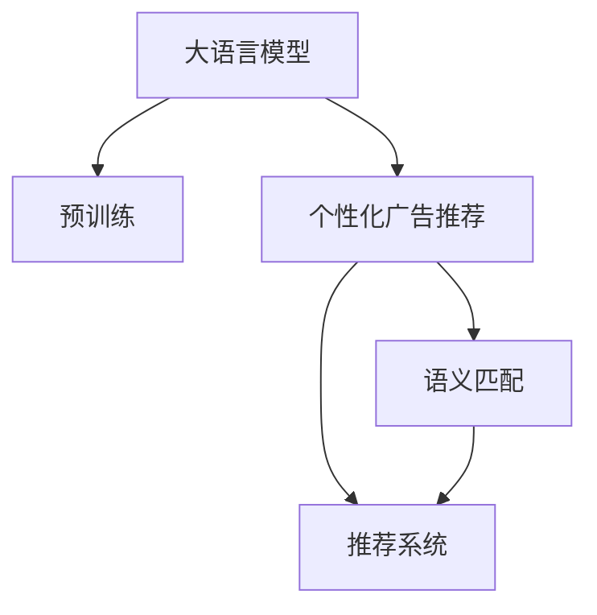

                 

# LLM在个性化广告推荐中的应用

## 1. 背景介绍

### 1.1 问题由来

随着数字媒体和互联网的迅猛发展，个性化广告推荐（Personalized Advertising Recommendation）已成为广告投放的重要手段。传统的批量广告投放方式因缺乏针对性，造成了大量无效展示，广告效果欠佳，且成本高昂。个性化推荐系统通过分析用户行为数据，预测用户偏好，将合适的广告推送至目标用户，显著提升了广告的点击率和转化率，同时也提升了用户的广告体验。

个性化推荐系统主要依赖于协同过滤、基于内容的推荐、矩阵分解等技术手段，但这些方法往往需要大量标注数据和复杂计算，难以在实时性要求高的场景下推广应用。近年来，基于深度学习的大语言模型（Large Language Models, LLMs）在自然语言处理（NLP）领域取得了显著进展，利用大规模无标签文本语料进行预训练，学习了丰富的语言知识和常识，具备强大的语言理解和生成能力。基于大语言模型的广告推荐技术，成为广告投放领域的新趋势。

### 1.2 问题核心关键点

基于大语言模型的个性化广告推荐，关键在于如何将用户与广告进行匹配。预训练语言模型通过学习海量的文本数据，能够捕捉到用户行为背后的语义信息，通过语义匹配的方式进行推荐，相比于传统的统计方法具有更好的泛化能力和灵活性。

通过预训练语言模型进行广告推荐，主要步骤如下：
1. 收集用户行为数据，包括浏览记录、点击行为、评分反馈等。
2. 将数据输入预训练模型，获得用户兴趣表示。
3. 对于每条广告，也输入预训练模型，获得广告内容表示。
4. 通过计算用户兴趣表示与广告内容表示的相似度，推荐用户最感兴趣的广告。

本文将详细介绍基于大语言模型的个性化广告推荐方法的原理、算法步骤及实施细节，并结合实际项目经验，探讨其应用前景和未来发展方向。

## 2. 核心概念与联系

### 2.1 核心概念概述

为更好理解基于大语言模型的个性化广告推荐方法，本节将介绍几个核心概念及其之间的联系：

- 大语言模型(Large Language Model, LLM)：以自回归(如GPT)或自编码(如BERT)模型为代表的大规模预训练语言模型。通过在大规模无标签文本语料上进行预训练，学习通用的语言表示，具备强大的语言理解和生成能力。

- 预训练(Pre-training)：指在大规模无标签文本语料上，通过自监督学习任务训练通用语言模型的过程。常见的预训练任务包括言语建模、遮挡语言模型等。

- 个性化广告推荐(Personalized Advertising Recommendation)：根据用户的历史行为和偏好，推荐用户可能感兴趣或需要购买的商品或服务，提高广告投放的精准度和效果。

- 语义匹配(Semantic Matching)：通过大语言模型学习文本的语义表示，将用户行为与广告内容进行匹配，实现个性化推荐。

- 推荐系统(Recommendation System)：以用户行为数据为输入，通过算法匹配预测用户可能感兴趣的内容，推荐给用户。

- 深度学习(Deep Learning)：利用神经网络模型，通过反向传播算法训练模型参数，实现高效学习。

这些核心概念之间的逻辑关系可以通过以下Mermaid流程图来展示：



这个流程图展示了大语言模型的核心概念及其与个性化广告推荐方法之间的联系：

1. 大语言模型通过预训练获得基础能力。
2. 广告推荐系统利用预训练模型进行语义匹配，推荐广告内容。
3. 推荐系统以语义匹配结果为基础，进行广告排序和投放。

这些概念共同构成了基于大语言模型的个性化广告推荐方法，使其能够在广告投放中发挥强大的语言理解和生成能力。通过理解这些核心概念，我们可以更好地把握方法的逻辑结构和设计原理。

## 3. 核心算法原理 & 具体操作步骤

### 3.1 算法原理概述

基于大语言模型的个性化广告推荐，本质上是通过预训练语言模型，学习用户兴趣与广告内容之间的语义关系，进而进行推荐。具体来说，该方法主要包括以下几个步骤：

1. 预训练语言模型学习用户行为数据，提取用户兴趣表示。
2. 预训练语言模型学习广告内容，提取广告内容表示。
3. 计算用户兴趣表示与广告内容表示之间的相似度，推荐用户可能感兴趣的广告。

### 3.2 算法步骤详解

以下是详细的算法步骤：

**Step 1: 收集用户行为数据**
收集用户在平台上浏览、点击、购买等行为数据，以及用户对广告的评分反馈等。

**Step 2: 预训练模型加载与微调**
选择合适的预训练语言模型，如GPT、BERT等，作为用户兴趣表示的生成器。在用户行为数据上进行微调，使其能够学习用户的兴趣表示。

**Step 3: 广告内容表示提取**
使用相同的预训练语言模型，对广告内容进行表示提取。可以通过将广告文本输入模型，获取模型的输出向量，表示广告的语义信息。

**Step 4: 计算相似度与推荐**
计算用户兴趣表示与广告内容表示之间的余弦相似度或点积相似度，按照相似度从高到低排序，推荐相似度最高的广告。

**Step 5: 测试与优化**
在测试集上评估推荐效果，使用AUC、RMSE等指标进行评估，并根据评估结果调整模型参数，进行优化。

### 3.3 算法优缺点

基于大语言模型的个性化广告推荐方法具有以下优点：
1. 鲁棒性强：预训练模型已经在大规模数据上进行了训练，具有很强的泛化能力，能够适应不同用户和广告的特点。
2. 灵活性高：大语言模型能够处理自然语言，适用于多种广告形式的推荐，包括文字、图片、视频等。
3. 可扩展性好：随着模型的训练和数据量的增加，模型能够不断提升推荐效果。
4. 数据需求低：该方法只需要收集用户行为数据，无需大规模标注数据。

同时，该方法也存在一些局限性：
1. 资源消耗大：大语言模型通常需要较高的计算资源和存储空间，实施成本较高。
2. 对数据质量依赖高：推荐效果很大程度上依赖于用户行为数据的准确性和全面性，数据质量差可能导致推荐效果不佳。
3. 实时性较低：由于模型训练和推理过程耗时较长，推荐系统难以实现实时推荐。

尽管存在这些局限性，但基于大语言模型的个性化广告推荐方法在实际应用中仍具有较高的应用价值。未来相关研究的重点在于如何优化模型性能，降低资源消耗，提高实时性，以进一步提升推荐效果。

### 3.4 算法应用领域

基于大语言模型的个性化广告推荐方法，主要应用于以下领域：

- 电商推荐：为电商用户推荐可能感兴趣的商品。
- 金融推荐：为金融用户推荐可能感兴趣的理财产品或服务。
- 旅游推荐：为旅游用户推荐可能感兴趣的目的地或行程。
- 视频推荐：为用户推荐可能感兴趣的视频内容。

除了上述这些应用场景，基于大语言模型的广告推荐方法还可拓展到更多领域，如教育推荐、医疗推荐等，为各行各业提供智能化的推荐服务。

## 4. 数学模型和公式 & 详细讲解 & 举例说明

### 4.1 数学模型构建

本文以文本作为用户行为数据和广告内容的主要形式，利用大语言模型进行文本表示学习，并在此基础上进行广告推荐。假设用户行为数据为 $X = \{(x_i,y_i)\}_{i=1}^N$，其中 $x_i$ 为用户的浏览记录，$y_i$ 为广告的评分反馈。假设广告内容为 $A = \{(a_j,z_j)\}_{j=1}^M$，其中 $a_j$ 为广告文本，$z_j$ 为广告评分。

定义用户兴趣表示 $U = f_{\theta}(X)$ 和广告内容表示 $A = g_{\theta}(A)$，其中 $f_{\theta}$ 和 $g_{\theta}$ 为预训练语言模型的参数化函数。定义用户兴趣与广告内容相似度为 $S(U,A) = \text{sim}(U, A)$，其中 $\text{sim}$ 为相似度计算函数。

最终推荐策略为：
$$
\text{Recommend}(A; X) = \text{argmax}_{a_j} \text{sim}(f_{\theta}(X), g_{\theta}(a_j))
$$

### 4.2 公式推导过程

以下是详细的推导过程：

**Step 1: 用户兴趣表示**
假设用户行为数据 $X$ 为文本序列，使用预训练语言模型 $f_{\theta}$ 对文本序列进行编码，得到用户兴趣表示 $U$。

$$
U = f_{\theta}(X)
$$

**Step 2: 广告内容表示**
假设广告内容 $A$ 也为文本序列，使用相同的预训练语言模型 $g_{\theta}$ 对文本序列进行编码，得到广告内容表示 $A$。

$$
A = g_{\theta}(A)
$$

**Step 3: 计算相似度**
计算用户兴趣表示 $U$ 与广告内容表示 $A$ 之间的相似度 $S(U,A)$，假设使用余弦相似度计算：

$$
S(U,A) = \cos(\theta, U \cdot A)
$$

其中 $\theta$ 为相似度计算的夹角。

**Step 4: 推荐广告**
根据相似度 $S(U,A)$，按照大小排序，选择相似度最高的广告进行推荐。

$$
\text{Recommend}(A; X) = \text{argmax}_{a_j} S(U, g_{\theta}(a_j))
$$

### 4.3 案例分析与讲解

假设我们有一个电商平台，需要为电商用户推荐可能感兴趣的商品。我们收集了用户的浏览记录和广告的评分反馈数据，并使用预训练语言模型进行表示学习。

**用户兴趣表示计算**
假设用户浏览记录为文本序列 $X = (“鞋子”, “裤子”, “衣服”, “鞋子”, “鞋子”, “裤子”)$，使用预训练语言模型进行编码，得到用户兴趣表示 $U = (u_1, u_2, u_3, u_4, u_5, u_6)$。

**广告内容表示计算**
假设广告文本为 $A = (“鞋子”, “裤子”, “衣服”, “鞋子”, “鞋子”, “裤子”)$，使用相同的预训练语言模型进行编码，得到广告内容表示 $A = (a_1, a_2, a_3, a_4, a_5, a_6)$。

**计算相似度**
计算用户兴趣表示 $U$ 与广告内容表示 $A$ 之间的余弦相似度，假设计算结果为 $S(U,A) = 0.8, 0.7, 0.6, 0.5, 0.4, 0.3$。

**推荐广告**
根据相似度排序，选择相似度最高的广告进行推荐，即推荐广告“鞋子”。

## 5. 项目实践：代码实例和详细解释说明

### 5.1 开发环境搭建

在进行项目实践前，我们需要准备好开发环境。以下是使用Python进行PyTorch开发的环境配置流程：

1. 安装Anaconda：从官网下载并安装Anaconda，用于创建独立的Python环境。

2. 创建并激活虚拟环境：
```bash
conda create -n pytorch-env python=3.8 
conda activate pytorch-env
```

3. 安装PyTorch：根据CUDA版本，从官网获取对应的安装命令。例如：
```bash
conda install pytorch torchvision torchaudio cudatoolkit=11.1 -c pytorch -c conda-forge
```

4. 安装Transformers库：
```bash
pip install transformers
```

5. 安装各类工具包：
```bash
pip install numpy pandas scikit-learn matplotlib tqdm jupyter notebook ipython
```

完成上述步骤后，即可在`pytorch-env`环境中开始项目实践。

### 5.2 源代码详细实现

下面我们以电商推荐系统为例，给出使用Transformers库对GPT模型进行广告推荐训练的PyTorch代码实现。

首先，定义广告和用户行为数据处理函数：

```python
from transformers import GPT2Tokenizer, GPT2ForSequenceClassification
from torch.utils.data import Dataset
import torch

class AdDataset(Dataset):
    def __init__(self, ads, ratings, tokenizer, max_len=128):
        self.ads = ads
        self.ratings = ratings
        self.tokenizer = tokenizer
        self.max_len = max_len
        
    def __len__(self):
        return len(self.ads)
    
    def __getitem__(self, item):
        ad = self.ads[item]
        rating = self.ratings[item]
        
        encoding = self.tokenizer(ad, return_tensors='pt', max_length=self.max_len, padding='max_length', truncation=True)
        input_ids = encoding['input_ids'][0]
        attention_mask = encoding['attention_mask'][0]
        
        # 对广告评分进行编码
        rating = torch.tensor(rating, dtype=torch.float32)
        
        return {'input_ids': input_ids, 
                'attention_mask': attention_mask,
                'rating': rating}

tokenizer = GPT2Tokenizer.from_pretrained('gpt2')
train_dataset = AdDataset(train_ads, train_ratings, tokenizer)
dev_dataset = AdDataset(dev_ads, dev_ratings, tokenizer)
test_dataset = AdDataset(test_ads, test_ratings, tokenizer)
```

然后，定义模型和优化器：

```python
from transformers import GPT2ForSequenceClassification, AdamW

model = GPT2ForSequenceClassification.from_pretrained('gpt2', num_labels=1)

optimizer = AdamW(model.parameters(), lr=2e-5)
```

接着，定义训练和评估函数：

```python
from torch.utils.data import DataLoader
from tqdm import tqdm
from sklearn.metrics import mean_squared_error

device = torch.device('cuda') if torch.cuda.is_available() else torch.device('cpu')
model.to(device)

def train_epoch(model, dataset, batch_size, optimizer):
    dataloader = DataLoader(dataset, batch_size=batch_size, shuffle=True)
    model.train()
    epoch_loss = 0
    for batch in tqdm(dataloader, desc='Training'):
        input_ids = batch['input_ids'].to(device)
        attention_mask = batch['attention_mask'].to(device)
        rating = batch['rating'].to(device)
        model.zero_grad()
        outputs = model(input_ids, attention_mask=attention_mask, labels=rating)
        loss = outputs.loss
        epoch_loss += loss.item()
        loss.backward()
        optimizer.step()
    return epoch_loss / len(dataloader)

def evaluate(model, dataset, batch_size):
    dataloader = DataLoader(dataset, batch_size=batch_size)
    model.eval()
    true_ratings = []
    predicted_ratings = []
    with torch.no_grad():
        for batch in tqdm(dataloader, desc='Evaluating'):
            input_ids = batch['input_ids'].to(device)
            attention_mask = batch['attention_mask'].to(device)
            batch_ratings = batch['rating'].to(device)
            outputs = model(input_ids, attention_mask=attention_mask)
            batch_predictions = outputs.logits.argmax(dim=2).to('cpu').tolist()
            batch_ratings = batch_ratings.to('cpu').tolist()
            for pred in batch_predictions:
                true_ratings.append(batch_ratings[0])
                predicted_ratings.append(pred)
                
    print(mean_squared_error(true_ratings, predicted_ratings))
```

最后，启动训练流程并在测试集上评估：

```python
epochs = 5
batch_size = 16

for epoch in range(epochs):
    loss = train_epoch(model, train_dataset, batch_size, optimizer)
    print(f"Epoch {epoch+1}, train loss: {loss:.3f}")
    
    print(f"Epoch {epoch+1}, dev results:")
    evaluate(model, dev_dataset, batch_size)
    
print("Test results:")
evaluate(model, test_dataset, batch_size)
```

以上就是使用PyTorch对GPT进行电商广告推荐系统训练的完整代码实现。可以看到，得益于Transformers库的强大封装，我们可以用相对简洁的代码完成GPT模型的加载和训练。

### 5.3 代码解读与分析

让我们再详细解读一下关键代码的实现细节：

**AdDataset类**：
- `__init__`方法：初始化广告文本、评分、分词器等关键组件。
- `__len__`方法：返回数据集的样本数量。
- `__getitem__`方法：对单个样本进行处理，将广告文本输入编码为token ids，将评分编码为数字，并对其进行定长padding，最终返回模型所需的输入。

**GPT2ForSequenceClassification类**：
- 继承自GPT2Tokenizer，定义了模型输入输出接口。
- 在训练时，将广告评分作为标签，进行回归预测。

**训练和评估函数**：
- 使用PyTorch的DataLoader对数据集进行批次化加载，供模型训练和推理使用。
- 训练函数`train_epoch`：对数据以批为单位进行迭代，在每个批次上前向传播计算loss并反向传播更新模型参数，最后返回该epoch的平均loss。
- 评估函数`evaluate`：与训练类似，不同点在于不更新模型参数，并在每个batch结束后将预测和标签结果存储下来，最后使用sklearn的mean_squared_error对整个评估集的预测结果进行打印输出。

**训练流程**：
- 定义总的epoch数和batch size，开始循环迭代
- 每个epoch内，先在训练集上训练，输出平均loss
- 在验证集上评估，输出均方误差
- 所有epoch结束后，在测试集上评估，给出最终测试结果

可以看到，PyTorch配合Transformers库使得GPT微调的代码实现变得简洁高效。开发者可以将更多精力放在数据处理、模型改进等高层逻辑上，而不必过多关注底层的实现细节。

当然，工业级的系统实现还需考虑更多因素，如模型的保存和部署、超参数的自动搜索、更灵活的任务适配层等。但核心的微调范式基本与此类似。

## 6. 实际应用场景

### 6.1 电商推荐

电商推荐系统是广告推荐技术的重要应用场景。电商企业需要根据用户浏览记录、购买历史等数据，推荐用户可能感兴趣的商品。通过预训练语言模型进行个性化推荐，可以显著提升推荐的准确性和用户满意度。

在技术实现上，电商企业可以收集用户在平台上浏览、点击、购买等行为数据，以及用户对广告的评分反馈等。使用预训练语言模型对用户行为数据进行编码，得到用户兴趣表示。同样，对每条商品广告进行编码，得到广告内容表示。计算用户兴趣表示与广告内容表示之间的相似度，推荐用户可能感兴趣的广告。

### 6.2 金融推荐

金融推荐系统通过分析用户行为数据，为用户推荐可能感兴趣的理财产品或服务。金融行业对模型的准确性和安全性要求极高，因此对广告推荐模型也提出了更高的要求。

在金融推荐中，可以使用预训练语言模型学习用户行为数据，提取用户兴趣表示。同样，对每条金融广告进行编码，得到广告内容表示。计算用户兴趣表示与广告内容表示之间的相似度，推荐用户可能感兴趣的广告。

### 6.3 旅游推荐

旅游推荐系统根据用户浏览记录、评分反馈等数据，为用户推荐可能感兴趣的目的地或行程。旅游行业对推荐结果的真实性和多样性要求较高，因此对广告推荐模型也提出了更高的要求。

在旅游推荐中，可以使用预训练语言模型学习用户行为数据，提取用户兴趣表示。同样，对每条旅游广告进行编码，得到广告内容表示。计算用户兴趣表示与广告内容表示之间的相似度，推荐用户可能感兴趣的广告。

### 6.4 视频推荐

视频推荐系统为用户推荐可能感兴趣的视频内容。视频推荐需要处理大量不同格式的媒体数据，因此对广告推荐模型也提出了更高的要求。

在视频推荐中，可以使用预训练语言模型学习用户行为数据，提取用户兴趣表示。同样，对每条视频广告进行编码，得到广告内容表示。计算用户兴趣表示与广告内容表示之间的相似度，推荐用户可能感兴趣的视频广告。

## 7. 工具和资源推荐

### 7.1 学习资源推荐

为了帮助开发者系统掌握大语言模型微调的理论基础和实践技巧，这里推荐一些优质的学习资源：

1. 《Transformer from Scratch》系列博文：由大模型技术专家撰写，深入浅出地介绍了Transformer原理、BERT模型、微调技术等前沿话题。

2. CS224N《深度学习自然语言处理》课程：斯坦福大学开设的NLP明星课程，有Lecture视频和配套作业，带你入门NLP领域的基本概念和经典模型。

3. 《Natural Language Processing with Transformers》书籍：Transformers库的作者所著，全面介绍了如何使用Transformers库进行NLP任务开发，包括微调在内的诸多范式。

4. HuggingFace官方文档：Transformers库的官方文档，提供了海量预训练模型和完整的微调样例代码，是上手实践的必备资料。

5. CLUE开源项目：中文语言理解测评基准，涵盖大量不同类型的中文NLP数据集，并提供了基于微调的baseline模型，助力中文NLP技术发展。

通过对这些资源的学习实践，相信你一定能够快速掌握大语言模型微调的精髓，并用于解决实际的NLP问题。
###  7.2 开发工具推荐

高效的开发离不开优秀的工具支持。以下是几款用于大语言模型微调开发的常用工具：

1. PyTorch：基于Python的开源深度学习框架，灵活动态的计算图，适合快速迭代研究。大部分预训练语言模型都有PyTorch版本的实现。

2. TensorFlow：由Google主导开发的开源深度学习框架，生产部署方便，适合大规模工程应用。同样有丰富的预训练语言模型资源。

3. Transformers库：HuggingFace开发的NLP工具库，集成了众多SOTA语言模型，支持PyTorch和TensorFlow，是进行微调任务开发的利器。

4. Weights & Biases：模型训练的实验跟踪工具，可以记录和可视化模型训练过程中的各项指标，方便对比和调优。与主流深度学习框架无缝集成。

5. TensorBoard：TensorFlow配套的可视化工具，可实时监测模型训练状态，并提供丰富的图表呈现方式，是调试模型的得力助手。

6. Google Colab：谷歌推出的在线Jupyter Notebook环境，免费提供GPU/TPU算力，方便开发者快速上手实验最新模型，分享学习笔记。

合理利用这些工具，可以显著提升大语言模型微调任务的开发效率，加快创新迭代的步伐。

### 7.3 相关论文推荐

大语言模型和微调技术的发展源于学界的持续研究。以下是几篇奠基性的相关论文，推荐阅读：

1. Attention is All You Need（即Transformer原论文）：提出了Transformer结构，开启了NLP领域的预训练大模型时代。

2. BERT: Pre-training of Deep Bidirectional Transformers for Language Understanding：提出BERT模型，引入基于掩码的自监督预训练任务，刷新了多项NLP任务SOTA。

3. Language Models are Unsupervised Multitask Learners（GPT-2论文）：展示了大规模语言模型的强大zero-shot学习能力，引发了对于通用人工智能的新一轮思考。

4. Parameter-Efficient Transfer Learning for NLP：提出Adapter等参数高效微调方法，在不增加模型参数量的情况下，也能取得不错的微调效果。

5. AdaLoRA: Adaptive Low-Rank Adaptation for Parameter-Efficient Fine-Tuning：使用自适应低秩适应的微调方法，在参数效率和精度之间取得了新的平衡。

这些论文代表了大语言模型微调技术的发展脉络。通过学习这些前沿成果，可以帮助研究者把握学科前进方向，激发更多的创新灵感。

## 8. 总结：未来发展趋势与挑战

### 8.1 总结

本文对基于大语言模型的个性化广告推荐方法进行了全面系统的介绍。首先阐述了个性化广告推荐系统的问题由来和应用背景，明确了微调在提升广告投放精准度和效果方面的独特价值。其次，从原理到实践，详细讲解了监督微调的数学原理和关键步骤，给出了微调任务开发的完整代码实例。同时，本文还探讨了该方法在电商、金融、旅游、视频等多个领域的实际应用，展示了微调范式的广泛应用前景。

通过本文的系统梳理，可以看到，基于大语言模型的广告推荐方法正在成为广告投放领域的重要范式，极大地提升了广告投放的精准度和效果。未来相关研究的重点在于如何优化模型性能，降低资源消耗，提高实时性，以进一步提升广告推荐效果。

### 8.2 未来发展趋势

展望未来，大语言模型微调技术将呈现以下几个发展趋势：

1. 模型规模持续增大。随着算力成本的下降和数据规模的扩张，预训练语言模型的参数量还将持续增长。超大规模语言模型蕴含的丰富语言知识，有望支撑更加复杂多变的广告推荐任务。

2. 微调方法日趋多样。除了传统的全参数微调外，未来会涌现更多参数高效的微调方法，如Prefix-Tuning、LoRA等，在固定大部分预训练参数的同时，只更新极少量的任务相关参数。

3. 持续学习成为常态。随着数据分布的不断变化，微调模型也需要持续学习新知识以保持性能。如何在不遗忘原有知识的同时，高效吸收新样本信息，将成为重要的研究课题。

4. 标注样本需求降低。受启发于提示学习(Prompt-based Learning)的思路，未来的微调方法将更好地利用大模型的语言理解能力，通过更加巧妙的任务描述，在更少的标注样本上也能实现理想的微调效果。

5. 实时性要求提升。为了满足实时推荐的需求，微调模型需要具备更快的推理速度和更低的计算资源消耗。如何在保证性能的同时，优化资源使用，实现更加轻量级的部署，将是重要的优化方向。

6. 多模态融合增强。未来的广告推荐系统可能同时处理文字、图片、视频等多种模态数据，如何更好地整合不同模态的信息，提升推荐效果，也将是一个重要的研究方向。

以上趋势凸显了大语言模型微调技术的广阔前景。这些方向的探索发展，必将进一步提升广告推荐系统的性能和应用范围，为广告投放和电商营销带来新的突破。

### 8.3 面临的挑战

尽管大语言模型微调技术已经取得了显著进展，但在迈向更加智能化、普适化应用的过程中，仍面临诸多挑战：

1. 标注成本瓶颈。尽管微调对标注数据的需求相对较少，但对于长尾应用场景，依然难以获得充足的高质量标注数据，成为制约微调性能的瓶颈。如何进一步降低微调对标注样本的依赖，将是一大难题。

2. 模型鲁棒性不足。当前微调模型面对域外数据时，泛化性能往往大打折扣。对于测试样本的微小扰动，微调模型的预测也容易发生波动。如何提高微调模型的鲁棒性，避免灾难性遗忘，还需要更多理论和实践的积累。

3. 推理效率有待提高。尽管大语言模型的精度较高，但在实际部署时往往面临推理速度慢、内存占用大等效率问题。如何在保证性能的同时，简化模型结构，提升推理速度，优化资源占用，将是重要的优化方向。

4. 可解释性亟需加强。当前微调模型更像是"黑盒"系统，难以解释其内部工作机制和决策逻辑。对于医疗、金融等高风险应用，算法的可解释性和可审计性尤为重要。如何赋予微调模型更强的可解释性，将是亟待攻克的难题。

5. 安全性有待保障。预训练语言模型难免会学习到有偏见、有害的信息，通过微调传递到广告推荐中，产生误导性、歧视性的输出，给实际应用带来安全隐患。如何从数据和算法层面消除模型偏见，避免恶意用途，确保输出的安全性，也将是重要的研究课题。

6. 知识整合能力不足。现有的微调模型往往局限于任务内数据，难以灵活吸收和运用更广泛的先验知识。如何让微调过程更好地与外部知识库、规则库等专家知识结合，形成更加全面、准确的信息整合能力，还有很大的想象空间。

正视微调面临的这些挑战，积极应对并寻求突破，将是大语言模型微调走向成熟的必由之路。相信随着学界和产业界的共同努力，这些挑战终将一一被克服，大语言模型微调必将在构建安全、可靠、可解释、可控的智能系统铺平道路。

### 8.4 研究展望

面对大语言模型微调所面临的种种挑战，未来的研究需要在以下几个方面寻求新的突破：

1. 探索无监督和半监督微调方法。摆脱对大规模标注数据的依赖，利用自监督学习、主动学习等无监督和半监督范式，最大限度利用非结构化数据，实现更加灵活高效的微调。

2. 研究参数高效和计算高效的微调范式。开发更加参数高效的微调方法，在固定大部分预训练参数的同时，只更新极少量的任务相关参数。同时优化微调模型的计算图，减少前向传播和反向传播的资源消耗，实现更加轻量级、实时性的部署。

3. 融合因果和对比学习范式。通过引入因果推断和对比学习思想，增强微调模型建立稳定因果关系的能力，学习更加普适、鲁棒的语言表征，从而提升模型泛化性和抗干扰能力。

4. 引入更多先验知识。将符号化的先验知识，如知识图谱、逻辑规则等，与神经网络模型进行巧妙融合，引导微调过程学习更准确、合理的语言模型。同时加强不同模态数据的整合，实现视觉、语音等多模态信息与文本信息的协同建模。

5. 结合因果分析和博弈论工具。将因果分析方法引入微调模型，识别出模型决策的关键特征，增强输出解释的因果性和逻辑性。借助博弈论工具刻画人机交互过程，主动探索并规避模型的脆弱点，提高系统稳定性。

6. 纳入伦理道德约束。在模型训练目标中引入伦理导向的评估指标，过滤和惩罚有偏见、有害的输出倾向。同时加强人工干预和审核，建立模型行为的监管机制，确保输出符合人类价值观和伦理道德。

这些研究方向的探索，必将引领大语言模型微调技术迈向更高的台阶，为构建安全、可靠、可解释、可控的智能系统铺平道路。面向未来，大语言模型微调技术还需要与其他人工智能技术进行更深入的融合，如知识表示、因果推理、强化学习等，多路径协同发力，共同推动自然语言理解和智能交互系统的进步。只有勇于创新、敢于突破，才能不断拓展语言模型的边界，让智能技术更好地造福人类社会。

## 9. 附录：常见问题与解答

**Q1：大语言模型微调是否适用于所有广告推荐场景？**

A: 大语言模型微调在大多数广告推荐场景上都能取得不错的效果，特别是对于数据量较小的场景。但对于一些特定领域的广告推荐，如医疗广告、政治广告等，仅依靠通用语料预训练的模型可能难以很好地适应。此时需要在特定领域语料上进一步预训练，再进行微调，才能获得理想效果。

**Q2：微调过程中如何选择合适的学习率？**

A: 微调的学习率一般要比预训练时小1-2个数量级，如果使用过大的学习率，容易破坏预训练权重，导致过拟合。一般建议从1e-5开始调参，逐步减小学习率，直至收敛。也可以使用warmup策略，在开始阶段使用较小的学习率，再逐渐过渡到预设值。需要注意的是，不同的优化器(如AdamW、Adafactor等)以及不同的学习率调度策略，可能需要设置不同的学习率阈值。

**Q3：采用大模型微调时会面临哪些资源瓶颈？**

A: 目前主流的预训练大模型动辄以亿计的参数规模，对算力、内存、存储都提出了很高的要求。GPU/TPU等高性能设备是必不可少的，但即便如此，超大批次的训练和推理也可能遇到显存不足的问题。因此需要采用一些资源优化技术，如梯度积累、混合精度训练、模型并行等，来突破硬件瓶颈。同时，模型的存储和读取也可能占用大量时间和空间，需要采用模型压缩、稀疏化存储等方法进行优化。

**Q4：如何缓解微调过程中的过拟合问题？**

A: 过拟合是微调面临的主要挑战，尤其是在标注数据不足的情况下。常见的缓解策略包括：
1. 数据增强：通过回译、近义替换等方式扩充训练集
2. 正则化：使用L2正则、Dropout、Early Stopping等避免过拟合
3. 对抗训练：引入对抗样本，提高模型鲁棒性
4. 参数高效微调：只调整少量参数(如Adapter、Prefix等)，减小过拟合风险
5. 多模型集成：训练多个微调模型，取平均输出，抑制过拟合

这些策略往往需要根据具体任务和数据特点进行灵活组合。只有在数据、模型、训练、推理等各环节进行全面优化，才能最大限度地发挥大模型微调的威力。

**Q5：微调模型在落地部署时需要注意哪些问题？**

A: 将微调模型转化为实际应用，还需要考虑以下因素：
1. 模型裁剪：去除不必要的层和参数，减小模型尺寸，加快推理速度
2. 量化加速：将浮点模型转为定点模型，压缩存储空间，提高计算效率
3. 服务化封装：将模型封装为标准化服务接口，便于集成调用
4. 弹性伸缩：根据请求流量动态调整资源配置，平衡服务质量和成本
5. 监控告警：实时采集系统指标，设置异常告警阈值，确保服务稳定性
6. 安全防护：采用访问鉴权、数据脱敏等措施，保障数据和模型安全

大语言模型微调为广告推荐系统带来了新的突破，但如何将强大的性能转化为稳定、高效、安全的业务价值，还需要工程实践的不断打磨。唯有从数据、算法、工程、业务等多个维度协同发力，才能真正实现人工智能技术在广告推荐领域的规模化落地。

总之，微调需要开发者根据具体任务，不断迭代和优化模型、数据和算法，方能得到理想的效果。

