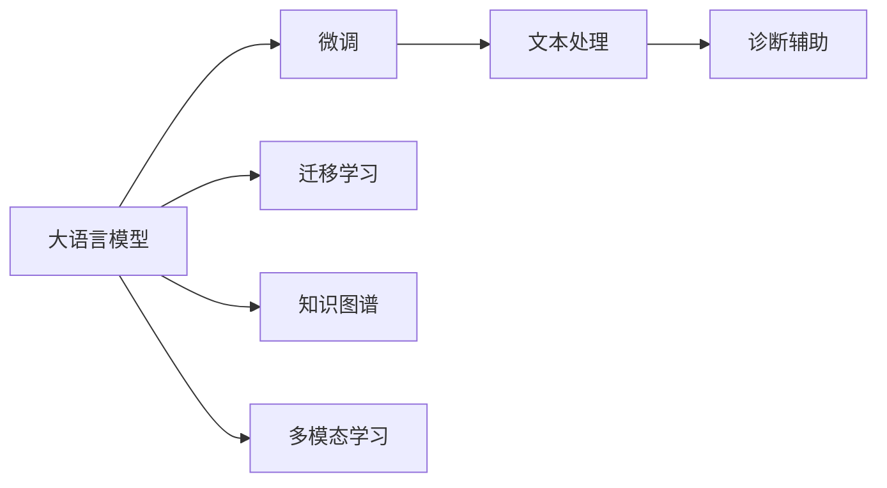

                 

# LLM在医疗诊断中的应用可能性

大语言模型（Large Language Model, LLM）在自然语言处理（Natural Language Processing, NLP）领域取得了突破性进展，显示出其在理解人类语言、生成自然语言文本、翻译、问答等方面的强大能力。随着技术的发展，大语言模型也开始在医疗诊断领域探索其应用可能性。本文将详细介绍大语言模型在医疗诊断中的应用，包括其核心概念、原理、操作步骤，并结合具体案例分析其优缺点及应用前景。

## 1. 背景介绍

### 1.1 问题由来
现代医学诊断越来越依赖于复杂的实验室检测和专业医生的经验，然而这些方法往往耗时耗力、成本高昂且依赖人工，无法及时满足患者的需求。而大语言模型作为自然语言处理技术的最新突破，具备了处理自然语言文本的能力，这使得它在医疗诊断领域的应用成为可能。

### 1.2 问题核心关键点
大语言模型在医疗诊断中的核心应用点在于利用其强大的文本处理能力，对医生的诊断报告、病历记录、医学文献进行自动化处理和分析，从而辅助医生进行诊断决策。这种应用可以减少医生工作量，提高诊断效率，尤其是在海量医疗数据面前，大语言模型能够帮助医生快速锁定可能的疾病诊断方向，提供参考性意见。

## 2. 核心概念与联系

### 2.1 核心概念概述
- **大语言模型**：指基于Transformer等架构的大规模预训练语言模型，通过自监督学习任务（如语言建模、掩码语言模型等）在大量文本数据上预训练，具备强大的语言理解和生成能力。
- **微调**：在预训练模型的基础上，使用特定领域的数据集进行有监督训练，使其在特定任务上表现更佳。
- **迁移学习**：将一个领域的知识迁移到另一个相关领域，以提高模型的泛化能力。
- **知识图谱**：用于表示实体和它们之间的关系的知识库，辅助大语言模型理解复杂的医疗领域知识。
- **多模态学习**：结合文本、图像、声音等多源信息，提升模型的综合诊断能力。

### 2.2 核心概念原理和架构的 Mermaid 流程图


## 3. 核心算法原理 & 具体操作步骤

### 3.1 算法原理概述
大语言模型在医疗诊断中的应用主要通过以下步骤实现：
1. 数据预处理：收集、清洗、标注相关的医学文本数据，包括病历记录、诊断报告、医学文献等。
2. 大语言模型微调：在大规模医疗数据集上，对大语言模型进行微调，使其学习到与医疗相关的语言表示。
3. 诊断辅助：微调后的模型用于辅助医生进行初步诊断，提供可能的疾病诊断方向和相关文献参考。

### 3.2 算法步骤详解

**步骤1：数据收集与预处理**
- **数据来源**：病历记录、诊断报告、医学文献等。
- **数据标注**：病历记录需要标注包括疾病、症状、检查结果等关键信息。
- **数据清洗**：去除无关信息，如患者个人信息等。
- **数据分割**：将数据分为训练集、验证集和测试集。

**步骤2：大语言模型微调**
- **模型选择**：选择合适的预训练大语言模型，如BERT、GPT-3等。
- **任务适配**：设计适合医疗诊断的输出层和损失函数，如分类任务使用交叉熵损失函数。
- **微调超参数设置**：选择合适的优化算法和学习率，应用正则化技术。
- **微调训练**：在训练集上进行前向传播和反向传播，更新模型参数。
- **验证与测试**：在验证集和测试集上评估微调后的模型性能。

**步骤3：诊断辅助**
- **输入文本准备**：将医生的诊断记录、病历摘要等作为输入文本。
- **模型推理**：将输入文本输入微调后的模型，得到可能的疾病诊断方向。
- **结果展示**：将模型的输出结果展示给医生，辅助医生做出诊断决策。

### 3.3 算法优缺点
**优点**：
- **高效性**：大语言模型能够快速处理大量医学文本，辅助医生进行初步诊断，提高诊断效率。
- **泛化能力**：通过迁移学习和多模态学习，大语言模型能够泛化到不同领域和疾病。
- **成本低**：相比于传统的人工诊断方法，大语言模型的应用成本更低，尤其是在处理大量病历数据时。

**缺点**：
- **准确性依赖数据质量**：模型表现受数据标注质量影响，标注错误可能导致误诊。
- **解释性不足**：大语言模型的决策过程难以解释，医生可能难以理解模型的推理逻辑。
- **伦理和安全问题**：模型的输出可能存在偏见，需在设计时考虑伦理和安全问题。

### 3.4 算法应用领域
大语言模型在医疗诊断领域可以应用于以下方面：
- **病历分析**：对病历记录进行文本分析，提取关键信息，辅助医生诊断。
- **医学文献检索**：自动检索相关医学文献，提供参考信息。
- **疾病预测**：基于患者症状，预测可能的疾病。
- **临床决策支持**：辅助医生做出诊断决策，提供可能的诊断方向。

## 4. 数学模型和公式 & 详细讲解 & 举例说明

### 4.1 数学模型构建
假设大语言模型为 $M_{\theta}$，输入为病历记录文本 $x$，输出为疾病类别 $y$。病历记录的文本表示为 $x = (x_1, x_2, ..., x_n)$，其中每个 $x_i$ 代表病历记录中的一个句子。模型输出疾病类别的概率分布为 $P(y|x)$。

### 4.2 公式推导过程
- **交叉熵损失函数**：$L(x, y) = -\sum_{y} y \log P(y|x)$
- **模型前向传播**：$P(y|x) = \sigma(W_{\theta} \cdot [x; y])$
  - 其中 $\sigma$ 为激活函数，$W_{\theta}$ 为模型参数，$[x; y]$ 表示将 $x$ 和 $y$ 拼接后输入模型。

### 4.3 案例分析与讲解
**案例：基于病历记录的疾病诊断**
- **输入**：病历记录 $x = "患者，男，45岁。体检发现肝区不适，CT显示肝脏占位。请给出可能的疾病"$
- **模型输出**：模型给出可能的疾病 $y_1, y_2, ..., y_k$，如“肝癌”、“肝硬化”等。

**分析**：模型通过预训练学习到通用的语言表示，通过微调学习到与医疗相关的语言表示，在输入病历记录时，模型会根据其语言表示输出可能的疾病诊断方向。这种自动化的疾病诊断方法能够辅助医生进行初步筛查，提高诊断效率。

## 5. 项目实践：代码实例和详细解释说明

### 5.1 开发环境搭建
- **Python环境**：安装Anaconda，创建虚拟环境，并激活。
- **深度学习框架**：安装TensorFlow或PyTorch。
- **预训练模型**：下载BERT等预训练模型，并进行微调。

### 5.2 源代码详细实现

```python
import tensorflow as tf
from transformers import TFBertTokenizer, TFBertForSequenceClassification

# 初始化预训练模型和tokenizer
tokenizer = TFBertTokenizer.from_pretrained('bert-base-cased')
model = TFBertForSequenceClassification.from_pretrained('bert-base-cased', num_labels=10)

# 加载训练集
train_dataset = ...

# 构建模型输入和输出
input_ids = tf.keras.layers.Input(shape=(128,), dtype=tf.int32)
tokens = tokenizer.encode(train_dataset['text'], truncation=True, padding='max_length')
labels = tf.keras.layers.Input(shape=(1,), dtype=tf.int32)
outputs = model(tokens, labels)

# 定义损失函数和优化器
loss_fn = tf.keras.losses.SparseCategoricalCrossentropy(from_logits=True)
optimizer = tf.keras.optimizers.Adam()

# 训练模型
model.compile(optimizer=optimizer, loss=loss_fn)
model.fit(x=train_dataset, epochs=5)

# 推理模型
test_dataset = ...
test_labels = model.predict(test_dataset)
```

### 5.3 代码解读与分析
- **数据预处理**：使用BERT tokenizer将文本转换为模型所需的token ids。
- **模型构建**：使用TFBertForSequenceClassification构建分类模型，指定输出层为10个类别的softmax层。
- **模型训练**：使用Adam优化器和交叉熵损失函数，在训练集上进行前向传播和反向传播，更新模型参数。
- **模型推理**：在测试集上进行推理，得到每个样本的概率分布。

### 5.4 运行结果展示
- **训练集结果**：模型在训练集上的精度和召回率。
- **测试集结果**：模型在测试集上的精度和召回率。
- **病例分析**：对具体病例进行诊断，输出可能的疾病类型和概率。

## 6. 实际应用场景

### 6.1 医院诊断辅助系统
- **应用场景**：医院内部系统，辅助医生进行病历记录分析，提供疾病诊断建议。
- **技术实现**：收集病历记录，使用微调后的模型进行自动分析，输出疾病诊断方向和相关文献。

### 6.2 远程医疗平台
- **应用场景**：远程医疗平台，医生通过在线咨询系统向患者提供初步诊断。
- **技术实现**：患者提供病历记录，微调后的模型提供疾病诊断建议，医生据此进行进一步检查或治疗。

### 6.3 临床决策支持系统
- **应用场景**：医院内部系统，辅助医生进行临床决策，提供疾病诊断和治疗方案。
- **技术实现**：医生输入患者病历记录，微调后的模型提供可能的疾病诊断方向和治疗建议。

### 6.4 未来应用展望
- **多模态融合**：结合医学图像、声音等多模态数据，提升诊断准确性。
- **实时诊断**：构建实时诊断系统，快速响应患者咨询，提供初步诊断。
- **跨领域迁移**：将模型知识迁移到其他医学领域，如影像诊断、遗传学等。

## 7. 工具和资源推荐

### 7.1 学习资源推荐
- **《深度学习理论与实践》**：介绍深度学习基础和NLP领域的技术应用。
- **《自然语言处理综述》**：全面回顾NLP领域的发展历程和技术进展。
- **Hugging Face官方文档**：提供最新的预训练模型和微调样例。

### 7.2 开发工具推荐
- **TensorFlow**：深度学习框架，提供丰富的TensorFlow模型和工具。
- **PyTorch**：灵活的深度学习框架，支持大规模模型训练。
- **Jupyter Notebook**：在线笔记本环境，方便数据处理和模型实验。

### 7.3 相关论文推荐
- **BERT: Pre-training of Deep Bidirectional Transformers for Language Understanding**：提出BERT模型，引入自监督预训练任务。
- **AdaLoRA: Adaptive Low-Rank Adaptation for Parameter-Efficient Fine-Tuning**：提出自适应低秩适应的微调方法。
- **Parameter-Efficient Transfer Learning for NLP**：提出 Adapter等参数高效微调方法。

## 8. 总结：未来发展趋势与挑战

### 8.1 总结
本文详细介绍了大语言模型在医疗诊断领域的应用可能性，探讨了其核心概念、原理和操作步骤。通过具体案例分析，展示了大语言模型在医疗诊断中的潜力和挑战。大语言模型能够处理大量医疗文本，辅助医生进行诊断决策，提高诊断效率和准确性。然而，模型的准确性依赖数据质量，解释性不足，需进一步优化和改进。

### 8.2 未来发展趋势
- **多模态融合**：结合医学图像、声音等多模态数据，提升诊断准确性。
- **实时诊断**：构建实时诊断系统，快速响应患者咨询，提供初步诊断。
- **跨领域迁移**：将模型知识迁移到其他医学领域，如影像诊断、遗传学等。

### 8.3 面临的挑战
- **数据标注成本**：高质量标注数据的获取成本高昂，需进一步降低标注成本。
- **模型解释性**：大语言模型的决策过程难以解释，需提高模型的可解释性。
- **伦理和安全问题**：模型的输出可能存在偏见，需在设计时考虑伦理和安全问题。

### 8.4 研究展望
- **数据增强**：通过数据增强技术，扩充训练集，提升模型泛化能力。
- **模型优化**：优化模型结构，提高推理速度，减少计算资源消耗。
- **知识图谱融合**：将知识图谱与大语言模型结合，提升模型的综合诊断能力。

## 9. 附录：常见问题与解答

**Q1：大语言模型在医疗诊断中的应用存在哪些挑战？**

A: 大语言模型在医疗诊断中的应用面临以下挑战：
- **数据标注成本**：高质量标注数据的获取成本高昂，需进一步降低标注成本。
- **模型解释性**：大语言模型的决策过程难以解释，需提高模型的可解释性。
- **伦理和安全问题**：模型的输出可能存在偏见，需在设计时考虑伦理和安全问题。

**Q2：大语言模型在医疗诊断中的准确性如何评估？**

A: 大语言模型在医疗诊断中的准确性可以通过以下指标进行评估：
- **精确度（Precision）**：正确预测的阳性样本占所有预测阳性样本的比例。
- **召回率（Recall）**：正确预测的阳性样本占所有真实阳性样本的比例。
- **F1分数（F1 Score）**：精确度和召回率的调和平均数。

**Q3：如何提高大语言模型在医疗诊断中的可解释性？**

A: 提高大语言模型在医疗诊断中的可解释性，可以采取以下措施：
- **模型透明化**：设计透明化的模型结构，便于理解和解释。
- **可视化输出**：通过可视化技术展示模型的推理过程和输出结果。
- **因果分析**：使用因果分析方法，识别出模型决策的关键特征。

**Q4：大语言模型在医疗诊断中的应用场景有哪些？**

A: 大语言模型在医疗诊断中的应用场景包括：
- **病历分析**：对病历记录进行文本分析，提取关键信息，辅助医生诊断。
- **医学文献检索**：自动检索相关医学文献，提供参考信息。
- **疾病预测**：基于患者症状，预测可能的疾病。
- **临床决策支持**：辅助医生做出诊断决策，提供可能的诊断方向。

**Q5：大语言模型在医疗诊断中的性能如何提升？**

A: 大语言模型在医疗诊断中的性能提升可以通过以下方法：
- **数据增强**：通过数据增强技术，扩充训练集，提升模型泛化能力。
- **模型优化**：优化模型结构，提高推理速度，减少计算资源消耗。
- **知识图谱融合**：将知识图谱与大语言模型结合，提升模型的综合诊断能力。

---

作者：禅与计算机程序设计艺术 / Zen and the Art of Computer Programming

