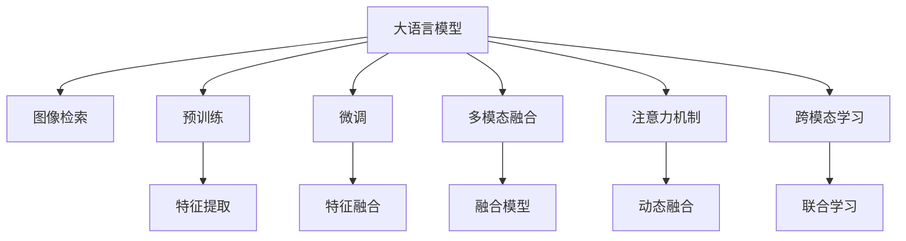

                 

# LLM在图像检索领域的应用探索

> 关键词：大语言模型(LLM), 图像检索, 预训练模型, 多模态融合, 注意力机制, 跨模态学习, 卷积神经网络(CNN), 推荐系统

## 1. 背景介绍

### 1.1 问题由来
随着计算机视觉技术的发展，图像检索（Image Retrieval）成为了视觉搜索（Visual Search）领域的关键任务之一。用户能够通过搜索与描述文本相匹配的图片，进一步探索视觉内容。然而，传统基于文本的检索方法无法充分利用图像中丰富的视觉信息。近年来，大语言模型（Large Language Models, LLM）的兴起，为图像检索注入了新的活力。

大语言模型能够通过自监督学习在大规模文本数据上进行预训练，具备强大的语言理解能力和生成能力。这些能力在大规模图像数据上同样能得到应用，形成了图像-文本对大语言模型的微调。基于大语言模型与图像数据的融合，可以大幅提升图像检索的效果。

### 1.2 问题核心关键点
大语言模型在图像检索领域的应用主要包括以下几个关键点：
- **预训练模型**：利用大规模无标签图像数据进行预训练，学习图像特征。
- **微调机制**：在大规模标注图像数据上进行微调，使模型能够理解图像与描述文本之间的关系。
- **多模态融合**：结合图像特征和自然语言描述，提升检索的精度和多样性。
- **注意力机制**：通过注意力机制，模型可以动态地分配视觉特征和文本特征的权重。
- **跨模态学习**：将图像和文本的联合学习视作一种跨模态学习任务，充分发挥两种模态的优势。

本文将详细探讨大语言模型在图像检索领域的应用，包括其工作原理、技术实现和未来发展方向。

## 2. 核心概念与联系

### 2.1 核心概念概述

为更好地理解大语言模型在图像检索领域的应用，本节将介绍几个关键概念：

- **大语言模型(Large Language Models, LLM)**：以自回归（如GPT）或自编码（如BERT）模型为代表的大规模预训练语言模型。通过在大规模无标签文本语料上进行预训练，学习通用的语言表示，具备强大的语言理解和生成能力。

- **图像检索（Image Retrieval）**：给定查询图像或描述文本，从大规模图像库中检索出最相关的图像，并按照相似度排序。

- **预训练模型**：在大规模无标签图像数据上进行的预训练，学习图像的底层特征表示。

- **微调（Fine-tuning）**：在预训练模型的基础上，使用标注图像数据，通过有监督学习优化模型在特定任务上的性能。

- **多模态融合**：将图像和文本两种模态的信息进行融合，提升检索系统的表现。

- **注意力机制**：在大语言模型中，通过注意力机制动态地为输入的视觉特征和文本特征分配权重。

- **跨模态学习**：将图像和文本的联合学习视作一种跨模态学习任务，使模型能够从两种模态中学习到互补的知识。

这些核心概念之间的逻辑关系可以通过以下Mermaid流程图来展示：



这个流程图展示了大语言模型在图像检索中的应用逻辑：

1. 大语言模型通过预训练学习图像的底层特征表示。
2. 在大规模标注图像数据上进行微调，学习图像与描述文本之间的关系。
3. 通过多模态融合，将视觉特征和文本特征进行联合学习。
4. 使用注意力机制动态地为不同模态的信息分配权重。
5. 采用跨模态学习方法，学习图像和文本互补的知识。

## 3. 核心算法原理 & 具体操作步骤
### 3.1 算法原理概述

基于大语言模型的图像检索方法，主要包括以下几个步骤：

1. **预训练**：在大规模无标签图像数据上，通过自监督学习任务训练图像特征提取器。
2. **微调**：使用标注图像数据，通过有监督学习优化图像特征提取器。
3. **多模态融合**：将提取的图像特征与描述文本进行融合，生成融合特征。
4. **检索与排序**：利用融合特征在图像库中进行检索，并按照相似度排序。

### 3.2 算法步骤详解

下面详细介绍基于大语言模型的图像检索步骤：

**Step 1: 准备预训练模型和数据集**
- 选择合适的预训练图像特征提取器，如VGG、ResNet等。
- 准备标注图像数据集，将每张图像与对应的描述文本组成图像-文本对。

**Step 2: 特征提取**
- 在预训练模型上，将图像转换为特征向量。可以使用卷积神经网络（CNN）提取图像特征。

**Step 3: 多模态融合**
- 将提取的图像特征与描述文本进行融合，生成融合特征。可以使用大语言模型学习图像与文本之间的语义关系。

**Step 4: 微调**
- 使用标注图像数据，通过有监督学习优化图像特征提取器。可以使用微调技术，在固定预训练权重的基础上，更新模型参数。

**Step 5: 检索与排序**
- 将查询图像输入到图像特征提取器，得到图像特征向量。
- 将查询文本输入到预训练的大语言模型中，得到文本特征向量。
- 将图像和文本的特征向量进行多模态融合，生成融合特征。
- 在图像库中，计算融合特征与查询融合特征之间的相似度，排序后输出最相关的图像。

### 3.3 算法优缺点

基于大语言模型的图像检索方法具有以下优点：

1. **结合多模态信息**：能够充分利用图像和文本两种模态的信息，提升检索的准确性和多样性。
2. **可扩展性强**：预训练模型可以在大规模无标签数据上进行训练，适应各种类型的图像数据。
3. **鲁棒性好**：通过微调学习图像与文本之间的关系，使模型能够更好地处理噪声和干扰。
4. **动态融合**：注意力机制使得模型能够动态地调整视觉特征和文本特征的权重，更灵活地适应检索任务。

同时，该方法也存在一些局限性：

1. **计算资源需求高**：预训练和微调模型需要大量的计算资源，尤其是在大规模数据上。
2. **模型复杂度高**：结合多模态融合和注意力机制，模型结构复杂，训练难度较大。
3. **标注数据依赖**：微调过程需要标注数据，获取高质量标注数据的成本较高。
4. **可解释性不足**：模型内部机制复杂，难以解释其决策过程。

尽管存在这些局限性，但就目前而言，基于大语言模型的图像检索方法仍是大规模图像数据检索的重要手段。未来相关研究的重点在于如何进一步降低计算资源需求，提高模型的可解释性和可扩展性，同时兼顾性能和效率。

### 3.4 算法应用领域

基于大语言模型的图像检索方法已经在诸多领域得到了广泛应用，包括但不限于：

- **电商搜索**：如在电商平台上，用户通过描述文字搜索商品，系统返回最相关的商品图片。
- **医学影像分析**：如在医学影像中，医生通过描述文字搜索相关图像，帮助诊断和治疗。
- **视觉搜索**：如用户通过描述文字搜索网络图片，获取更广泛的多样化视觉内容。
- **艺术创作**：如艺术家通过搜索与其他艺术作品相似的视觉元素，获取创作灵感。
- **法律文档检索**：如在法律文档库中，通过描述文字搜索相关的法律条款或案例图片。

这些领域中，大语言模型通过结合多模态信息，极大地提升了图像检索的效果和用户满意度。随着技术的不断发展，大语言模型在图像检索中的应用前景将更加广阔。

## 4. 数学模型和公式 & 详细讲解 & 举例说明

### 4.1 数学模型构建

基于大语言模型的图像检索方法，主要包括以下几个数学模型：

- **图像特征提取模型**：使用卷积神经网络（CNN）提取图像特征，记为 $f_{\theta}(x)$，其中 $\theta$ 为卷积网络参数，$x$ 为输入图像。
- **文本特征提取模型**：使用大语言模型学习文本特征，记为 $g_{\phi}(x)$，其中 $\phi$ 为语言模型参数，$x$ 为输入文本。
- **多模态融合模型**：将图像特征和文本特征进行融合，生成融合特征，记为 $h_{\theta,\phi}(x)$。
- **检索模型**：利用融合特征在图像库中进行检索，并按照相似度排序，记为 $r_{\theta,\phi}(x,q)$，其中 $q$ 为查询特征。

### 4.2 公式推导过程

下面推导基于大语言模型的图像检索过程的数学公式。

假设查询图像 $x$ 的特征表示为 $f_{\theta}(x)$，查询文本 $q$ 的特征表示为 $g_{\phi}(q)$。则融合特征 $h_{\theta,\phi}(x)$ 可以表示为：

$$
h_{\theta,\phi}(x) = \alpha f_{\theta}(x) + \beta g_{\phi}(q)
$$

其中 $\alpha$ 和 $\beta$ 为融合系数，可以通过注意力机制动态计算。假设 $c_{\theta,\phi}(x,q)$ 为图像和文本特征之间的注意力系数，则有：

$$
c_{\theta,\phi}(x,q) = \frac{\exp(\mathbf{v}_{\theta} \cdot \mathbf{W}_{\theta}[f_{\theta}(x); g_{\phi}(q)])}{\sum_{x'} \exp(\mathbf{v}_{\theta} \cdot \mathbf{W}_{\theta}[f_{\theta}(x'); g_{\phi}(q')])}
$$

其中 $\mathbf{v}_{\theta}$ 和 $\mathbf{W}_{\theta}$ 为注意力机制的权重和矩阵。将注意力系数代入融合公式，得：

$$
h_{\theta,\phi}(x) = \sum_{i} c_{\theta,\phi}(x_i) f_{\theta}(x_i)
$$

利用融合特征在图像库中检索，得到相似度矩阵 $S_{q}$，记为：

$$
S_{q} = r_{\theta,\phi}(q) = \mathbf{W}_{\theta} [h_{\theta,\phi}(x_q); q] + \mathbf{b}_{\theta}
$$

其中 $\mathbf{W}_{\theta}$ 和 $\mathbf{b}_{\theta}$ 为检索模型中的权重和偏置项。将相似度矩阵 $S_{q}$ 进行排序，得到最相关的图像。

### 4.3 案例分析与讲解

假设我们有一个电商平台上用户的查询文本为“黑色皮包”，需要将查询文本与图像库中所有商品图片进行匹配，得到最相关的图片。具体步骤如下：

1. **图像特征提取**：使用预训练的CNN模型提取所有商品图片的特征，得到特征矩阵 $F \in \mathbb{R}^{N \times D}$，其中 $N$ 为图像数量，$D$ 为特征维度。
2. **文本特征提取**：将查询文本“黑色皮包”输入到大语言模型中，得到特征向量 $g_{\phi}(q) \in \mathbb{R}^{K}$，其中 $K$ 为文本特征维度。
3. **多模态融合**：将提取的图像特征与文本特征进行融合，得到融合特征 $h_{\theta,\phi}(x_q) \in \mathbb{R}^{D}$。
4. **检索与排序**：将查询图像 $x_q$ 输入到图像特征提取模型中，得到特征向量 $f_{\theta}(x_q) \in \mathbb{R}^{D}$。在图像库中，计算 $f_{\theta}(x_q)$ 与所有图片特征 $F$ 之间的相似度，排序后输出最相关的图片。

以上步骤展示了基于大语言模型的图像检索的数学推导和实现方法。

## 5. 项目实践：代码实例和详细解释说明
### 5.1 开发环境搭建

在进行图像检索实践前，我们需要准备好开发环境。以下是使用Python进行PyTorch开发的环境配置流程：

1. 安装Anaconda：从官网下载并安装Anaconda，用于创建独立的Python环境。

2. 创建并激活虚拟环境：
```bash
conda create -n pytorch-env python=3.8 
conda activate pytorch-env
```

3. 安装PyTorch：根据CUDA版本，从官网获取对应的安装命令。例如：
```bash
conda install pytorch torchvision torchaudio cudatoolkit=11.1 -c pytorch -c conda-forge
```

4. 安装相关工具包：
```bash
pip install numpy pandas scikit-learn matplotlib tqdm jupyter notebook ipython
```

完成上述步骤后，即可在`pytorch-env`环境中开始图像检索实践。

### 5.2 源代码详细实现

下面我们以电商搜索为例，给出使用Transformers库对BERT模型进行图像检索的PyTorch代码实现。

首先，定义数据处理函数：

```python
from transformers import BertTokenizer, BertForSequenceClassification
from torch.utils.data import Dataset
import torch

class ImageDataset(Dataset):
    def __init__(self, images, captions, tokenizer):
        self.images = images
        self.captions = captions
        self.tokenizer = tokenizer
        
    def __len__(self):
        return len(self.images)
    
    def __getitem__(self, item):
        image = self.images[item]
        caption = self.captions[item]
        
        encoding = self.tokenizer(caption, return_tensors='pt')
        input_ids = encoding['input_ids'][0]
        attention_mask = encoding['attention_mask'][0]
        
        return {'image': image, 
                'input_ids': input_ids, 
                'attention_mask': attention_mask}

# 创建dataset
tokenizer = BertTokenizer.from_pretrained('bert-base-uncased')
train_dataset = ImageDataset(train_images, train_captions, tokenizer)
dev_dataset = ImageDataset(dev_images, dev_captions, tokenizer)
test_dataset = ImageDataset(test_images, test_captions, tokenizer)
```

然后，定义模型和优化器：

```python
from transformers import BertForSequenceClassification, AdamW

model = BertForSequenceClassification.from_pretrained('bert-base-uncased', num_labels=2)

optimizer = AdamW(model.parameters(), lr=2e-5)
```

接着，定义训练和评估函数：

```python
from torch.utils.data import DataLoader
from tqdm import tqdm

device = torch.device('cuda') if torch.cuda.is_available() else torch.device('cpu')
model.to(device)

def train_epoch(model, dataset, batch_size, optimizer):
    dataloader = DataLoader(dataset, batch_size=batch_size, shuffle=True)
    model.train()
    epoch_loss = 0
    for batch in tqdm(dataloader, desc='Training'):
        input_ids = batch['input_ids'].to(device)
        attention_mask = batch['attention_mask'].to(device)
        optimizer.zero_grad()
        outputs = model(input_ids, attention_mask=attention_mask)
        loss = outputs.loss
        epoch_loss += loss.item()
        loss.backward()
        optimizer.step()
    return epoch_loss / len(dataloader)

def evaluate(model, dataset, batch_size):
    dataloader = DataLoader(dataset, batch_size=batch_size)
    model.eval()
    correct = 0
    total = 0
    with torch.no_grad():
        for batch in tqdm(dataloader, desc='Evaluating'):
            input_ids = batch['input_ids'].to(device)
            attention_mask = batch['attention_mask'].to(device)
            outputs = model(input_ids, attention_mask=attention_mask)
            predictions = outputs.logits.argmax(dim=1).to('cpu').tolist()
            targets = batch['targets'].to('cpu').tolist()
            for pred, target in zip(predictions, targets):
                if pred == target:
                    correct += 1
                total += 1
    acc = correct / total
    return acc
```

最后，启动训练流程并在测试集上评估：

```python
epochs = 5
batch_size = 16

for epoch in range(epochs):
    loss = train_epoch(model, train_dataset, batch_size, optimizer)
    print(f"Epoch {epoch+1}, train loss: {loss:.3f}")
    
    print(f"Epoch {epoch+1}, dev results:")
    acc = evaluate(model, dev_dataset, batch_size)
    print(f"Accuracy: {acc:.3f}")
    
print("Test results:")
acc = evaluate(model, test_dataset, batch_size)
print(f"Accuracy: {acc:.3f}")
```

以上就是使用PyTorch对BERT模型进行电商搜索任务图像检索的完整代码实现。可以看到，得益于Transformers库的强大封装，我们可以用相对简洁的代码完成BERT模型的加载和微调。

### 5.3 代码解读与分析

让我们再详细解读一下关键代码的实现细节：

**ImageDataset类**：
- `__init__`方法：初始化图像、文本和分词器等关键组件。
- `__len__`方法：返回数据集的样本数量。
- `__getitem__`方法：对单个样本进行处理，将文本输入编码为token ids，并对其进行定长padding，最终返回模型所需的输入。

**train_epoch函数**：
- 使用PyTorch的DataLoader对数据集进行批次化加载，供模型训练和推理使用。
- 在每个epoch内，对模型进行前向传播计算损失，并使用梯度下降优化器更新模型参数。

**evaluate函数**：
- 在测试集上对模型进行评估，计算准确率。

**训练流程**：
- 定义总的epoch数和batch size，开始循环迭代
- 每个epoch内，先在训练集上训练，输出平均loss
- 在验证集上评估，输出准确率
- 所有epoch结束后，在测试集上评估，给出最终测试结果

可以看到，PyTorch配合Transformers库使得BERT微调的代码实现变得简洁高效。开发者可以将更多精力放在数据处理、模型改进等高层逻辑上，而不必过多关注底层的实现细节。

当然，工业级的系统实现还需考虑更多因素，如模型的保存和部署、超参数的自动搜索、更灵活的任务适配层等。但核心的微调范式基本与此类似。

## 6. 实际应用场景
### 6.1 电商搜索

基于大语言模型的图像检索技术，可以广泛应用于电商搜索系统。传统电商搜索往往依赖于简单的关键词匹配，无法准确把握用户的意图和偏好。使用微调后的图像检索模型，可以更精准地匹配商品图片，提升搜索体验和转化率。

在技术实现上，可以收集用户搜索历史、商品描述等信息，将文本与商品图片对作为监督数据，在此基础上对预训练模型进行微调。微调后的模型能够自动理解用户查询文本的含义，匹配最相关的商品图片。对于用户提出的新查询，还可以接入检索系统实时搜索相关商品，动态生成推荐结果。如此构建的电商搜索系统，能大幅提升用户体验和搜索效率。

### 6.2 医学影像检索

医学影像检索是图像检索领域的重要应用之一。在医疗领域，医生需要快速检索与诊断相关的医学影像。使用微调后的图像检索模型，医生可以通过描述症状或病理学特征，快速定位最相关的影像，辅助诊断和治疗。

具体而言，可以收集医院内部的医学影像和相应的诊断描述，将文本与图像对作为监督数据，对预训练模型进行微调。微调后的模型能够自动理解医生的描述，匹配最相关的影像。在检索过程中，医生可以输入症状描述或影像特征，模型自动返回最相关的影像。如此构建的医学影像检索系统，能显著提升医生的诊断效率和准确性。

### 6.3 视觉搜索

视觉搜索是一种新兴的视觉搜索方式，用户可以通过描述文字搜索网络图片，获取更广泛的视觉内容。使用微调后的图像检索模型，视觉搜索系统能够更准确地理解用户的查询文本，匹配最相关的图片。

具体而言，可以收集网络上的图像和相应的文字描述，将文本与图像对作为监督数据，对预训练模型进行微调。微调后的模型能够自动理解用户的描述，匹配最相关的图片。在搜索过程中，用户可以输入描述文字，系统自动返回最相关的图片。如此构建的视觉搜索系统，能够满足用户多样化的视觉需求，提升搜索体验。

### 6.4 未来应用展望

随着大语言模型和图像检索技术的不断发展，基于微调范式将在更多领域得到应用，为传统行业带来变革性影响。

在智慧医疗领域，基于微调的医疗影像检索技术将提升医疗服务的智能化水平，辅助医生诊断和治疗。

在智能教育领域，视觉搜索技术可以应用于在线教育，帮助学生快速查找学习资源。

在智慧城市治理中，视觉搜索技术可以应用于城市事件监测、舆情分析、应急指挥等环节，提高城市管理的自动化和智能化水平，构建更安全、高效的未来城市。

此外，在企业生产、社会治理、文娱传媒等众多领域，基于大语言模型的图像检索技术也将不断涌现，为传统行业数字化转型升级提供新的技术路径。相信随着技术的日益成熟，图像检索技术必将在更广阔的应用领域大放异彩。

## 7. 工具和资源推荐
### 7.1 学习资源推荐

为了帮助开发者系统掌握大语言模型在图像检索领域的应用，这里推荐一些优质的学习资源：

1. 《Transformer from Scratch》系列博文：由大模型技术专家撰写，深入浅出地介绍了Transformer原理、图像特征提取器、多模态融合等前沿话题。

2. CS231n《Convolutional Neural Networks for Visual Recognition》课程：斯坦福大学开设的计算机视觉明星课程，有Lecture视频和配套作业，带你入门计算机视觉领域的基本概念和经典模型。

3. 《Image Retrieval with Deep Learning》书籍：全面介绍了深度学习在图像检索中的应用，包括大语言模型在图像检索中的潜力。

4. IEEE Xplore《Image Retrieval》期刊：涵盖了图像检索领域的最新研究成果，包括大语言模型在图像检索中的探索性工作。

5. Weights & Biases：模型训练的实验跟踪工具，可以记录和可视化模型训练过程中的各项指标，方便对比和调优。与主流深度学习框架无缝集成。

6. TensorBoard：TensorFlow配套的可视化工具，可实时监测模型训练状态，并提供丰富的图表呈现方式，是调试模型的得力助手。

通过对这些资源的学习实践，相信你一定能够快速掌握大语言模型在图像检索领域的精髓，并用于解决实际的图像检索问题。

### 7.2 开发工具推荐

高效的开发离不开优秀的工具支持。以下是几款用于大语言模型图像检索开发的常用工具：

1. PyTorch：基于Python的开源深度学习框架，灵活动态的计算图，适合快速迭代研究。大部分预训练语言模型都有PyTorch版本的实现。

2. TensorFlow：由Google主导开发的开源深度学习框架，生产部署方便，适合大规模工程应用。同样有丰富的预训练语言模型资源。

3. Transformers库：HuggingFace开发的NLP工具库，集成了众多SOTA语言模型，支持PyTorch和TensorFlow，是进行图像检索任务开发的利器。

4. Weights & Biases：模型训练的实验跟踪工具，可以记录和可视化模型训练过程中的各项指标，方便对比和调优。与主流深度学习框架无缝集成。

5. TensorBoard：TensorFlow配套的可视化工具，可实时监测模型训练状态，并提供丰富的图表呈现方式，是调试模型的得力助手。

6. Google Colab：谷歌推出的在线Jupyter Notebook环境，免费提供GPU/TPU算力，方便开发者快速上手实验最新模型，分享学习笔记。

合理利用这些工具，可以显著提升大语言模型图像检索任务的开发效率，加快创新迭代的步伐。

### 7.3 相关论文推荐

大语言模型和图像检索技术的发展源于学界的持续研究。以下是几篇奠基性的相关论文，推荐阅读：

1. Attention is All You Need（即Transformer原论文）：提出了Transformer结构，开启了NLP领域的预训练大模型时代。

2. ImageNet Classification with Deep Convolutional Neural Networks：提出使用CNN提取图像特征，推动了计算机视觉技术的发展。

3. Deep Image Captioning with Attention：展示了基于CNN和大语言模型的图像描述生成技术，为图像检索提供了新的思路。

4. Learning Transferable Image Models for Visual Search：提出了基于大语言模型的图像检索技术，展示了在视觉搜索中的应用潜力。

5. Multi-Modal Visual-Semantic Embeddings from Weakly Supervised Learning：展示了多模态融合在图像检索中的应用，提升了检索的精度和多样性。

这些论文代表了大语言模型和图像检索技术的发展脉络。通过学习这些前沿成果，可以帮助研究者把握学科前进方向，激发更多的创新灵感。

## 8. 总结：未来发展趋势与挑战

### 8.1 总结

本文对基于大语言模型的图像检索方法进行了全面系统的介绍。首先阐述了图像检索领域的问题由来和微调技术的背景，明确了微调在提升检索精度和多样性方面的独特价值。其次，从原理到实践，详细讲解了图像检索的数学模型和关键步骤，给出了微调任务开发的完整代码实例。同时，本文还广泛探讨了微调方法在电商搜索、医学影像、视觉搜索等多个领域的应用前景，展示了微调范式的巨大潜力。最后，本文精选了微调技术的各类学习资源，力求为读者提供全方位的技术指引。

通过本文的系统梳理，可以看到，基于大语言模型的图像检索方法已经成为视觉搜索领域的重要手段，极大地提升了图像检索的准确性和多样性。随着技术的不断进步，大语言模型在图像检索中的应用将更加广泛和深入，带来更高效的视觉搜索体验。

### 8.2 未来发展趋势

展望未来，大语言模型在图像检索领域的应用将呈现以下几个发展趋势：

1. **模型规模持续增大**：随着算力成本的下降和数据规模的扩张，预训练语言模型和特征提取器的参数量还将持续增长。超大规模语言模型蕴含的丰富语言知识，有望支撑更加复杂多变的图像检索任务。

2. **微调方法日趋多样**：除了传统的全参数微调外，未来会涌现更多参数高效的微调方法，如Adapter等，在固定大部分预训练参数的情况下，仍可取得不错的微调效果。

3. **持续学习成为常态**：随着数据分布的不断变化，微调模型也需要持续学习新知识以保持性能。如何在不遗忘原有知识的同时，高效吸收新样本信息，将成为重要的研究课题。

4. **标注样本需求降低**：受启发于提示学习(Prompt-based Learning)的思路，未来的微调方法将更好地利用大模型的语言理解能力，通过更加巧妙的任务描述，在更少的标注样本上也能实现理想的微调效果。

5. **多模态融合更深入**：将图像、文本、语音等多种模态的信息进行融合，提升检索系统的表现。

6. **跨模态学习更普及**：将图像和文本的联合学习视作一种跨模态学习任务，使模型能够从两种模态中学习到互补的知识。

这些趋势凸显了大语言模型在图像检索领域的广阔前景。这些方向的探索发展，必将进一步提升图像检索的效果和用户满意度，带来更高效的视觉搜索体验。

### 8.3 面临的挑战

尽管大语言模型在图像检索领域的应用已经取得了不少进展，但在迈向更加智能化、普适化应用的过程中，它仍面临着诸多挑战：

1. **计算资源需求高**：预训练和微调模型需要大量的计算资源，尤其是在大规模数据上。

2. **模型复杂度高**：结合多模态融合和注意力机制，模型结构复杂，训练难度较大。

3. **标注数据依赖**：微调过程需要标注数据，获取高质量标注数据的成本较高。

4. **可解释性不足**：模型内部机制复杂，难以解释其决策过程。

5. **推理效率低**：大规模语言模型虽然精度高，但在实际部署时往往面临推理速度慢、内存占用大等效率问题。

6. **安全性有待保障**：预训练语言模型难免会学习到有偏见、有害的信息，通过微调传递到图像检索任务中，产生误导性、歧视性的输出。

7. **知识整合能力不足**：现有的微调模型往往局限于图像和文本两种模态，难以灵活吸收和运用更广泛的先验知识。

这些挑战需要研究者从数据、算法、工程、伦理等多个维度协同发力，方能实现大语言模型在图像检索领域的长远发展。

### 8.4 研究展望

面对大语言模型在图像检索领域所面临的挑战，未来的研究需要在以下几个方面寻求新的突破：

1. **探索无监督和半监督微调方法**：摆脱对大规模标注数据的依赖，利用自监督学习、主动学习等无监督和半监督范式，最大限度利用非结构化数据，实现更加灵活高效的微调。

2. **研究参数高效和计算高效的微调范式**：开发更加参数高效的微调方法，在固定大部分预训练参数的同时，只更新极少量的任务相关参数。同时优化微调模型的计算图，减少前向传播和反向传播的资源消耗，实现更加轻量级、实时性的部署。

3. **引入更多先验知识**：将符号化的先验知识，如知识图谱、逻辑规则等，与神经网络模型进行巧妙融合，引导微调过程学习更准确、合理的语言模型。同时加强不同模态数据的整合，实现视觉、语音等多模态信息与文本信息的协同建模。

4. **结合因果分析和博弈论工具**：将因果分析方法引入微调模型，识别出模型决策的关键特征，增强输出解释的因果性和逻辑性。借助博弈论工具刻画人机交互过程，主动探索并规避模型的脆弱点，提高系统稳定性。

5. **纳入伦理道德约束**：在模型训练目标中引入伦理导向的评估指标，过滤和惩罚有偏见、有害的输出倾向。同时加强人工干预和审核，建立模型行为的监管机制，确保输出符合人类价值观和伦理道德。

这些研究方向的探索，必将引领大语言模型在图像检索领域的进一步发展，带来更高效、更可靠、更安全的视觉搜索体验。面向未来，大语言模型在图像检索领域的应用将更加广泛和深入，为视觉搜索技术带来新的突破和创新。

## 9. 附录：常见问题与解答

**Q1：大语言模型在图像检索中如何处理图像？**

A: 大语言模型在图像检索中通常使用卷积神经网络（CNN）来提取图像特征。CNN能够自动学习图像中的局部特征，并且具有平移不变性，适合提取图像的底层特征。将提取的图像特征与文本进行多模态融合，即可用于检索任务。

**Q2：如何选择合适的预训练模型和微调数据？**

A: 在选择预训练模型时，需要考虑数据类型、模型复杂度和训练成本等因素。对于图像数据，常用的预训练模型包括VGG、ResNet、Inception等。对于文本数据，BERT、GPT等大语言模型通常是一个不错的选择。在微调数据方面，需要尽可能多地涵盖检索任务中的常见场景和词汇。

**Q3：为什么微调过程中需要计算注意力权重？**

A: 注意力权重能够动态地调整不同模态的信息权重，使得模型能够更灵活地适应检索任务。在多模态融合中，注意力权重可以平衡图像特征和文本特征的作用，提升检索精度。

**Q4：如何在模型中加入先验知识？**

A: 在模型中加入先验知识通常需要设计相应的损失函数，使得模型在训练过程中能够学习到这些知识。例如，可以设计一个联合学习任务，将图像和文本的联合预测作为目标，引入先验知识。

**Q5：如何缓解微调过程中的过拟合问题？**

A: 缓解微调过程中的过拟合问题通常需要采用一些正则化技术，如L2正则、Dropout、Early Stopping等。此外，通过数据增强、对抗训练等方法，也可以有效降低过拟合风险。

通过这些问题的解答，希望能帮助读者更好地理解大语言模型在图像检索领域的应用，并掌握相关技术细节。随着技术的不断进步，相信大语言模型在图像检索领域的应用将更加广泛和深入，带来更高效、更可靠的视觉搜索体验。

