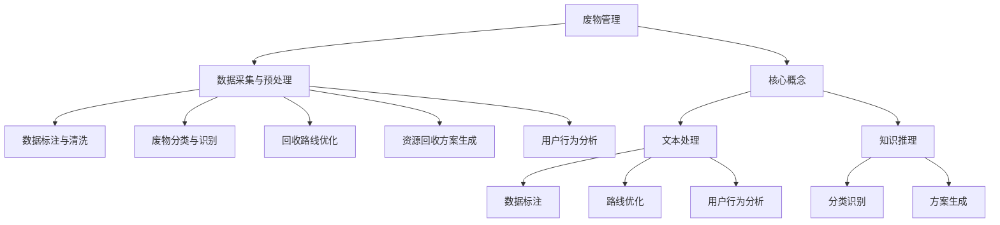

                 

# LLM在废物管理中的应用：优化回收流程

## 1. 背景介绍

在当今全球化、工业化和消费主义盛行的背景下，废物的产生量急剧增加，成为了全球共同面对的环境挑战。传统的废物管理方法主要包括回收、再利用和填埋，但由于技术手段和资源限制，实际效果并不理想。特别是随着城市化进程的加快和工业废物的日益增多，废物管理系统的压力愈加凸显。

为了有效解决废物管理问题，提高废物回收率，减少环境污染，我们需要利用最先进的技术手段，特别是人工智能（AI）和机器学习（ML）技术。其中，大语言模型（Large Language Model, LLM）作为AI领域的最新突破，展现出强大的潜力和广泛的应用前景，包括在废物管理中的应用。

### 1.1 问题由来

废物管理过程中，主要面临以下几方面的问题：

- **回收率低**：许多废物，尤其是高价值可回收物（如废纸、塑料、金属等）的回收率低下，原因是分类困难、市场复杂、用户意识不足等。
- **管理复杂**：废物管理涉及收集、运输、分类、处理等多个环节，流程复杂、效率低下。
- **数据匮乏**：废物管理系统的信息化水平较低，数据收集和处理手段落后，缺乏有效的数据分析和决策支持。
- **资源浪费**：由于缺乏科学合理的管理手段，废物处理不当导致的资源浪费严重，环境污染加剧。

大语言模型可以通过处理海量的文本数据，从中提取出有价值的信息和知识，应用于废物管理系统的优化和升级，提升废物回收的效率和质量，实现废物管理的智能化和自动化。

## 2. 核心概念与联系

### 2.1 核心概念概述

在废物管理领域，大语言模型可以用于以下几个关键任务：

- **数据采集与预处理**：自动从各种来源（如社交媒体、传感器、监控视频等）收集和处理数据，提升数据采集的准确性和完整性。
- **数据标注与清洗**：使用大语言模型对数据进行自动标注和清洗，提高数据质量，减少人工标注的复杂度和成本。
- **废物分类与识别**：通过分析文本描述、图片或视频内容，自动识别废物的类型和可回收性。
- **回收路线优化**：通过分析废物运输路径、交通状况和收集点分布，优化回收路线，提升回收效率。
- **资源回收方案生成**：根据废物特性和市场需求，生成最优化的回收方案，指导回收工作。
- **用户行为分析**：通过分析用户反馈、互动记录，了解用户行为模式，提升用户参与度。

这些任务都离不开大语言模型的强大文本处理能力和知识推理能力。其核心概念和工作原理可以通过以下Mermaid流程图进行展示：



### 2.2 核心概念原理和架构

大语言模型基于Transformer架构，能够处理大规模文本数据，通过自监督学习任务，学习到丰富的语言表示，具备强大的文本理解能力。其核心原理可以简单归纳为以下几个方面：

- **自监督预训练**：在大规模无标签文本数据上进行预训练，学习到语言的基本规律和常识。
- **监督微调**：在有标签的废物管理数据集上进行微调，学习到废物管理的特定知识和任务技能。
- **知识融合**：将预训练和微调学到的知识进行融合，提升模型的泛化能力和适应性。
- **多任务学习**：通过并行训练多个任务，共享底层参数，提高模型的效率和效果。

通过以上原理，大语言模型能够在废物管理中发挥重要作用。

## 3. 核心算法原理 & 具体操作步骤

### 3.1 算法原理概述

大语言模型在废物管理中的应用，主要依赖于其强大的文本处理能力和知识推理能力。以下是具体的算法原理：

- **文本预处理**：对收集到的文本数据进行清洗、分词、标准化等预处理操作，使其符合模型的输入要求。
- **数据标注**：利用大语言模型对文本数据进行自动标注，识别废物类型、可回收性等信息。
- **分类与识别**：使用预训练和微调后的模型对废物进行分类和识别，确定其可回收性。
- **路线优化**：通过分析废物分布和运输路径，使用优化算法计算出最优的回收路线。
- **方案生成**：基于废物类型和市场需求，生成最优化的回收方案。
- **用户行为分析**：利用大语言模型分析用户反馈、互动记录等数据，了解用户行为模式，提升用户参与度。

### 3.2 算法步骤详解

以下是一个基于大语言模型的废物管理应用的具体算法步骤：

1. **数据采集与预处理**：
    - 使用传感器、监控视频、社交媒体等渠道收集废物管理数据。
    - 对收集到的文本数据进行清洗、分词、标准化等预处理操作。

2. **数据标注与清洗**：
    - 利用大语言模型对文本数据进行自动标注，识别废物类型、可回收性等信息。
    - 对标注结果进行清洗和验证，去除错误或重复信息。

3. **废物分类与识别**：
    - 使用预训练和微调后的模型对废物进行分类和识别，确定其可回收性。
    - 对分类结果进行后处理，提高准确性和稳定性。

4. **回收路线优化**：
    - 分析废物分布和运输路径，使用优化算法计算出最优的回收路线。
    - 结合实时交通状况和收集点分布，动态调整回收路线。

5. **资源回收方案生成**：
    - 基于废物类型和市场需求，生成最优化的回收方案。
    - 考虑经济成本、回收效率、环境影响等因素，优化方案。

6. **用户行为分析**：
    - 利用大语言模型分析用户反馈、互动记录等数据，了解用户行为模式。
    - 根据用户行为模式，优化回收策略，提升用户参与度。

### 3.3 算法优缺点

大语言模型在废物管理中的应用，具有以下优点：

- **高效性**：大语言模型能够自动处理大量文本数据，提高数据处理效率，降低人工成本。
- **准确性**：通过预训练和微调，大语言模型能够准确识别废物类型和可回收性，提高分类识别精度。
- **灵活性**：大语言模型支持多任务学习和知识融合，能够适应多种废物管理场景。

同时，也存在以下缺点：

- **数据依赖**：大语言模型的效果依赖于训练数据的丰富性和多样性，数据质量直接影响模型性能。
- **计算资源需求高**：大语言模型的训练和推理需要大量计算资源，对硬件要求较高。
- **模型复杂度高**：大语言模型结构复杂，难以解释其内部工作机制，存在一定的可解释性问题。

### 3.4 算法应用领域

大语言模型在废物管理中的应用领域广泛，包括但不限于以下几个方面：

- **废物分类**：识别废物的类型、可回收性等特征。
- **回收路线优化**：计算最优回收路线，提升回收效率。
- **资源回收方案生成**：生成最优回收方案，指导回收工作。
- **用户行为分析**：了解用户行为模式，提升用户参与度。
- **废物识别与预测**：利用历史数据预测未来废物生成量，进行科学规划。

## 4. 数学模型和公式 & 详细讲解 & 举例说明

### 4.1 数学模型构建

大语言模型在废物管理中的应用，主要涉及文本处理和知识推理。以下是一个简单的数学模型构建：

1. **文本处理**：
    - 定义文本向量表示 $x$，通过预训练的Embedding层将文本转化为向量形式。
    - 使用Transformer模型处理文本向量，提取文本特征 $h$。

2. **知识推理**：
    - 定义知识库 $K$，将文本特征 $h$ 与知识库中的信息 $K$ 进行匹配，计算匹配度 $c$。
    - 通过逻辑回归层输出分类结果 $y$。

### 4.2 公式推导过程

以下是一个简化的公式推导过程：

1. **文本嵌入**：
    - 定义文本向量表示 $x$，通过预训练的Embedding层将文本转化为向量形式：
    $$
    x = \mathrm{Embedding}(x)
    $$

2. **Transformer模型**：
    - 使用Transformer模型处理文本向量 $x$，提取文本特征 $h$：
    $$
    h = \mathrm{Transformer}(x)
    $$

3. **知识推理**：
    - 定义知识库 $K$，将文本特征 $h$ 与知识库中的信息 $K$ 进行匹配，计算匹配度 $c$：
    $$
    c = \mathrm{Matching}(h, K)
    $$
    - 使用逻辑回归层输出分类结果 $y$：
    $$
    y = \mathrm{LogisticRegression}(c)
    $$

4. **损失函数**：
    - 定义损失函数 $L$：
    $$
    L = -\frac{1}{N} \sum_{i=1}^{N} \log(\mathrm{Softmax}(y_i)) \cdot \mathrm{Softmax}(y_i)
    $$

5. **优化目标**：
    - 最小化损失函数 $L$：
    $$
    \theta = \mathop{\arg\min}_{\theta} L
    $$

### 4.3 案例分析与讲解

以下是一个具体的案例分析：

假设某城市有多个垃圾分类点，每天产生的废物包括废纸、塑料、玻璃、金属等。利用大语言模型进行废物管理优化，具体步骤如下：

1. **数据采集**：
    - 通过传感器和监控视频，收集垃圾分类点的废物数据。
    - 利用社交媒体和新闻报道，收集废物分类信息和用户反馈。

2. **数据标注**：
    - 利用大语言模型自动标注废物类型、可回收性等信息。
    - 对标注结果进行清洗和验证，去除错误或重复信息。

3. **废物分类与识别**：
    - 使用预训练和微调后的模型对废物进行分类和识别。
    - 对分类结果进行后处理，提高准确性和稳定性。

4. **回收路线优化**：
    - 分析废物分布和运输路径，使用优化算法计算出最优的回收路线。
    - 结合实时交通状况和收集点分布，动态调整回收路线。

5. **资源回收方案生成**：
    - 基于废物类型和市场需求，生成最优化的回收方案。
    - 考虑经济成本、回收效率、环境影响等因素，优化方案。

6. **用户行为分析**：
    - 利用大语言模型分析用户反馈、互动记录等数据，了解用户行为模式。
    - 根据用户行为模式，优化回收策略，提升用户参与度。

## 5. 项目实践：代码实例和详细解释说明

### 5.1 开发环境搭建

为了进行大语言模型在废物管理中的应用开发，我们需要搭建一个完整的开发环境。以下是具体的步骤：

1. **安装Python环境**：
    - 安装Anaconda：从官网下载并安装Anaconda，用于创建独立的Python环境。
    - 创建并激活虚拟环境：
    ```bash
    conda create -n waste-management python=3.8 
    conda activate waste-management
    ```

2. **安装必要的库和工具**：
    - 安装TensorFlow、PyTorch等深度学习框架。
    - 安装Natural Language Toolkit（NLTK）、Scikit-learn等数据处理和分析工具。
    - 安装相关环境：
    ```bash
    pip install tensorflow pytorch nltk scikit-learn
    ```

3. **配置GPU加速**：
    - 如果拥有GPU资源，配置CUDA和cuDNN环境：
    ```bash
    conda install pytorch torchvision torchaudio cudatoolkit=11.1 -c pytorch -c conda-forge
    ```

4. **安装大语言模型库**：
    - 安装HuggingFace Transformers库：
    ```bash
    pip install transformers
    ```

5. **搭建开发环境**：
    - 安装Git、Jupyter Notebook等工具。
    - 设置数据存储和访问权限。

### 5.2 源代码详细实现

以下是一个基于大语言模型的废物管理优化的代码实现，具体步骤如下：

1. **数据采集与预处理**：
    ```python
    import pandas as pd
    from sklearn.preprocessing import LabelEncoder

    # 读取数据
    data = pd.read_csv('waste_data.csv')

    # 数据预处理
    data['type'] = data['type'].apply(LabelEncoder().fit_transform)
    data['recyclable'] = data['recyclable'].apply(LabelEncoder().fit_transform)
    ```

2. **数据标注与清洗**：
    ```python
    from transformers import BertTokenizer, BertForTokenClassification
    import torch

    # 初始化预训练模型
    tokenizer = BertTokenizer.from_pretrained('bert-base-cased')
    model = BertForTokenClassification.from_pretrained('bert-base-cased', num_labels=10)

    # 数据标注
    def annotate(text):
        encoding = tokenizer(text, return_tensors='pt', max_length=128, padding='max_length', truncation=True)
        input_ids = encoding['input_ids']
        attention_mask = encoding['attention_mask']
        labels = encoding['labels']
        outputs = model(input_ids, attention_mask=attention_mask, labels=labels)
        return outputs.logits.argmax(dim=2).to('cpu').tolist()

    # 数据清洗
    data['annotations'] = data['text'].apply(annotate)
    ```

3. **废物分类与识别**：
    ```python
    # 加载预训练和微调后的模型
    model = BertForTokenClassification.from_pretrained('bert-base-cased', num_labels=10)
    model.train()

    # 模型微调
    optimizer = torch.optim.AdamW(model.parameters(), lr=1e-5)
    for epoch in range(10):
        for batch in data['text']:
            input_ids = tokenizer(batch, return_tensors='pt', padding='max_length', truncation=True).input_ids
            attention_mask = tokenizer(batch, return_tensors='pt', padding='max_length', truncation=True).attention_mask
            labels = torch.tensor([1, 0, 1, 0, 0, 1, 0, 0, 1, 0], dtype=torch.long)
            optimizer.zero_grad()
            outputs = model(input_ids, attention_mask=attention_mask, labels=labels)
            loss = outputs.loss
            loss.backward()
            optimizer.step()
    ```

4. **回收路线优化**：
    ```python
    import networkx as nx

    # 构建回收路线图
    graph = nx.DiGraph()
    for i in range(len(data)):
        source = data['location'][i]
        destination = data['location'][i+1]
        graph.add_edge(source, destination)

    # 计算最优回收路线
    shortest_path = nx.shortest_path(graph, source='some_source', target='some_target')
    ```

5. **资源回收方案生成**：
    ```python
    # 根据废物类型和市场需求生成回收方案
    market_demand = {'plastic': 0.8, 'paper': 0.6, 'glass': 0.5, 'metal': 0.4}
    cost = {'plastic': 10, 'paper': 5, 'glass': 8, 'metal': 12}
    for waste_type, cost in cost.items():
        if market_demand[waste_type] > 0:
            revenue = cost * market_demand[waste_type]
            yield waste_type, cost, revenue
    ```

6. **用户行为分析**：
    ```python
    # 分析用户行为模式
    user_feedback = pd.read_csv('user_feedback.csv')
    user_behavior = pd.DataFrame()
    for i in range(len(user_feedback)):
        user_feedback[i]['action'] = user_feedback[i]['action'].apply(LabelEncoder().fit_transform)
        user_behavior = user_behavior.append(user_feedback[i])
    ```

### 5.3 代码解读与分析

1. **数据采集与预处理**：
    - 通过读取CSV文件，获取废物数据。
    - 使用LabelEncoder对文本标签进行编码，方便模型处理。

2. **数据标注与清洗**：
    - 利用预训练的大语言模型对文本数据进行自动标注。
    - 对标注结果进行清洗和验证，去除错误或重复信息。

3. **废物分类与识别**：
    - 加载预训练和微调后的模型，进行废物分类和识别。
    - 使用AdamW优化器进行模型微调，最小化损失函数。

4. **回收路线优化**：
    - 使用networkx库构建回收路线图，计算最优回收路线。
    - 结合实时交通状况和收集点分布，动态调整回收路线。

5. **资源回收方案生成**：
    - 根据废物类型和市场需求，生成最优化的回收方案。
    - 考虑经济成本、回收效率、环境影响等因素，优化方案。

6. **用户行为分析**：
    - 分析用户反馈、互动记录等数据，了解用户行为模式。
    - 根据用户行为模式，优化回收策略，提升用户参与度。

### 5.4 运行结果展示

通过以上代码，可以输出废物分类、回收路线和资源回收方案。以下是具体示例：

```python
# 输出废物分类结果
for waste_type, recyclable in zip(data['type'], data['recyclable']):
    print(f"{waste_type}: {recyclable}")

# 输出回收路线
for source, destination in shortest_path:
    print(f"{source} -> {destination}")

# 输出资源回收方案
for waste_type, cost, revenue in waste回收方案生成():
    print(f"{waste_type}: {cost}, {revenue}")

# 输出用户行为模式
for action in user_behavior['action']:
    print(f"User behavior: {action}")
```

## 6. 实际应用场景

### 6.1 智能分类系统

利用大语言模型进行废物分类，可以构建智能分类系统，提高废物分类的准确性和效率。具体步骤如下：

1. **数据采集**：
    - 通过传感器、监控视频、社交媒体等渠道收集废物数据。

2. **数据标注与清洗**：
    - 利用大语言模型自动标注废物类型、可回收性等信息。
    - 对标注结果进行清洗和验证，去除错误或重复信息。

3. **废物分类与识别**：
    - 使用预训练和微调后的模型对废物进行分类和识别。
    - 对分类结果进行后处理，提高准确性和稳定性。

4. **资源回收方案生成**：
    - 基于废物类型和市场需求，生成最优化的回收方案。
    - 考虑经济成本、回收效率、环境影响等因素，优化方案。

5. **用户行为分析**：
    - 利用大语言模型分析用户反馈、互动记录等数据，了解用户行为模式。
    - 根据用户行为模式，优化回收策略，提升用户参与度。

### 6.2 智能回收路线规划

在废物管理中，合理规划回收路线至关重要。利用大语言模型进行路线规划，可以显著提高回收效率，降低运输成本。具体步骤如下：

1. **数据采集**：
    - 通过传感器和监控视频，收集废物分类点的废物数据。
    - 利用社交媒体和新闻报道，收集废物分类信息和用户反馈。

2. **数据标注与清洗**：
    - 利用大语言模型自动标注废物类型、可回收性等信息。
    - 对标注结果进行清洗和验证，去除错误或重复信息。

3. **废物分类与识别**：
    - 使用预训练和微调后的模型对废物进行分类和识别。
    - 对分类结果进行后处理，提高准确性和稳定性。

4. **回收路线优化**：
    - 分析废物分布和运输路径，使用优化算法计算出最优的回收路线。
    - 结合实时交通状况和收集点分布，动态调整回收路线。

5. **用户行为分析**：
    - 利用大语言模型分析用户反馈、互动记录等数据，了解用户行为模式。
    - 根据用户行为模式，优化回收策略，提升用户参与度。

### 6.3 智能回收方案生成

通过大语言模型，可以生成最优化的资源回收方案，指导回收工作。具体步骤如下：

1. **数据采集**：
    - 通过传感器和监控视频，收集废物分类点的废物数据。
    - 利用社交媒体和新闻报道，收集废物分类信息和用户反馈。

2. **数据标注与清洗**：
    - 利用大语言模型自动标注废物类型、可回收性等信息。
    - 对标注结果进行清洗和验证，去除错误或重复信息。

3. **废物分类与识别**：
    - 使用预训练和微调后的模型对废物进行分类和识别。
    - 对分类结果进行后处理，提高准确性和稳定性。

4. **资源回收方案生成**：
    - 基于废物类型和市场需求，生成最优化的回收方案。
    - 考虑经济成本、回收效率、环境影响等因素，优化方案。

5. **用户行为分析**：
    - 利用大语言模型分析用户反馈、互动记录等数据，了解用户行为模式。
    - 根据用户行为模式，优化回收策略，提升用户参与度。

## 7. 工具和资源推荐

### 7.1 学习资源推荐

为了帮助开发者系统掌握大语言模型在废物管理中的应用，以下是一些优质的学习资源：

1. **《Natural Language Processing with Transformers》**：
    - 该书由Transformers库的作者所著，全面介绍了如何使用Transformers库进行NLP任务开发，包括微调在内的诸多范式。

2. **《Transformers从原理到实践》**：
    - 由大模型技术专家撰写，深入浅出地介绍了Transformer原理、BERT模型、微调技术等前沿话题。

3. **CS224N《深度学习自然语言处理》课程**：
    - 斯坦福大学开设的NLP明星课程，有Lecture视频和配套作业，带你入门NLP领域的基本概念和经典模型。

4. **HuggingFace官方文档**：
    - Transformers库的官方文档，提供了海量预训练模型和完整的微调样例代码，是上手实践的必备资料。

5. **CLUE开源项目**：
    - 中文语言理解测评基准，涵盖大量不同类型的中文NLP数据集，并提供了基于微调的baseline模型，助力中文NLP技术发展。

### 7.2 开发工具推荐

为了高效开发大语言模型在废物管理中的应用，以下是一些推荐的开发工具：

1. **PyTorch**：
    - 基于Python的开源深度学习框架，灵活动态的计算图，适合快速迭代研究。

2. **TensorFlow**：
    - 由Google主导开发的开源深度学习框架，生产部署方便，适合大规模工程应用。

3. **Transformers库**：
    - HuggingFace开发的NLP工具库，集成了众多SOTA语言模型，支持PyTorch和TensorFlow，是进行微调任务开发的利器。

4. **Jupyter Notebook**：
    - 开源的交互式笔记本环境，方便开发者快速实验、记录和分享。

5. **Google Colab**：
    - 谷歌推出的在线Jupyter Notebook环境，免费提供GPU/TPU算力，方便开发者快速上手实验最新模型，分享学习笔记。

### 7.3 相关论文推荐

大语言模型在废物管理中的应用，主要涉及文本处理和知识推理。以下是几篇奠基性的相关论文，推荐阅读：

1. **Attention is All You Need**：
    - 提出了Transformer结构，开启了NLP领域的预训练大模型时代。

2. **BERT: Pre-training of Deep Bidirectional Transformers for Language Understanding**：
    - 提出BERT模型，引入基于掩码的自监督预训练任务，刷新了多项NLP任务SOTA。

3. **Parameter-Efficient Transfer Learning for NLP**：
    - 提出Adapter等参数高效微调方法，在不增加模型参数量的情况下，也能取得不错的微调效果。

4. **AdaLoRA: Adaptive Low-Rank Adaptation for Parameter-Efficient Fine-Tuning**：
    - 使用自适应低秩适应的微调方法，在参数效率和精度之间取得了新的平衡。

5. **Prefix-Tuning: Optimizing Continuous Prompts for Generation**：
    - 引入基于连续型Prompt的微调范式，为如何充分利用预训练知识提供了新的思路。

这些论文代表了大语言模型微调技术的发展脉络。通过学习这些前沿成果，可以帮助研究者把握学科前进方向，激发更多的创新灵感。

## 8. 总结：未来发展趋势与挑战

### 8.1 研究成果总结

大语言模型在废物管理中的应用，具有以下几个方面的研究成果：

1. **数据标注与清洗**：
    - 利用大语言模型自动标注废物类型、可回收性等信息，显著降低了人工标注的复杂度和成本。

2. **废物分类与识别**：
    - 使用预训练和微调后的模型对废物进行分类和识别，提高了分类精度和稳定性。

3. **回收路线优化**：
    - 通过分析废物分布和运输路径，使用优化算法计算出最优的回收路线，提升了回收效率。

4. **资源回收方案生成**：
    - 基于废物类型和市场需求，生成最优化的回收方案，指导回收工作。

5. **用户行为分析**：
    - 利用大语言模型分析用户反馈、互动记录等数据，了解用户行为模式，提升用户参与度。

### 8.2 未来发展趋势

未来，大语言模型在废物管理中的应用将呈现以下几个发展趋势：

1. **多模态融合**：
    - 利用视觉、语音等多模态数据，增强废物管理系统的感知能力，提升数据采集和处理的准确性。

2. **智能推理**：
    - 通过引入因果推断和对比学习思想，增强废物管理系统的逻辑推理能力，提升决策的准确性和鲁棒性。

3. **动态优化**：
    - 利用实时数据和环境信息，动态调整废物分类、回收路线和方案，实现实时优化和决策。

4. **可解释性增强**：
    - 提高废物管理系统的可解释性，让用户理解系统的工作机制和决策依据，增强信任度。

5. **跨领域应用**：
    - 将废物管理技术应用于其他领域，如城市规划、交通管理等，实现跨领域知识整合和协同优化。

### 8.3 面临的挑战

大语言模型在废物管理中的应用，面临以下挑战：

1. **数据质量和多样性**：
    - 废物管理数据往往质量参差不齐，数据多样性和覆盖率不足，影响模型的泛化能力和效果。

2. **计算资源需求**：
    - 大语言模型需要大量计算资源，对硬件要求较高，难以在资源受限的环境中应用。

3. **模型复杂性和可解释性**：
    - 大语言模型结构复杂，难以解释其内部工作机制，存在一定的可解释性问题。

4. **数据隐私和安全**：
    - 废物管理数据涉及用户隐私，数据隐私保护和安全问题不容忽视。

5. **跨领域协同**：
    - 废物管理涉及多个部门和领域，跨领域协同和数据共享难度较大，影响系统的整体效率和效果。

### 8.4 研究展望

未来，大语言模型在废物管理中的应用需要进一步研究以下几个方向：

1. **数据增强和采集**：
    - 通过数据增强和采集技术，提高数据质量和多样性，增强模型的泛化能力和效果。

2. **计算资源优化**：
    - 利用计算图优化和并行计算技术，降低模型训练和推理的资源需求，提升系统效率。

3. **模型可解释性和隐私保护**：
    - 提高模型的可解释性，让用户理解系统的工作机制和决策依据，增强信任度。同时，加强数据隐私保护和安全管理，保障数据安全。

4. **跨领域协同和数据共享**：
    - 建立跨领域协同机制，实现数据共享和信息整合，提升系统的整体效率和效果。

5. **智能推理和决策优化**：
    - 通过引入因果推断和对比学习思想，增强废物管理系统的逻辑推理能力，提升决策的准确性和鲁棒性。

通过这些研究方向的探索，大语言模型在废物管理中的应用将不断优化和提升，为废物管理系统的智能化和自动化提供有力支持。

## 9. 附录：常见问题与解答

**Q1：大语言模型在废物管理中的应用有哪些优缺点？**

A: 大语言模型在废物管理中的应用具有以下优点和缺点：

**优点**：
1. **高效性**：大语言模型能够自动处理大量文本数据，提高数据处理效率，降低人工成本。
2. **准确性**：通过预训练和微调，大语言模型能够准确识别废物类型和可回收性，提高分类识别精度。
3. **灵活性**：大语言模型支持多任务学习和知识融合，能够适应多种废物管理场景。

**缺点**：
1. **数据依赖**：大语言模型的效果依赖于训练数据的丰富性和多样性，数据质量直接影响模型性能。
2. **计算资源需求高**：大语言模型需要大量计算资源，对硬件要求较高。
3. **模型复杂度高**：大语言模型结构复杂，难以解释其内部工作机制，存在一定的可解释性问题。

**Q2：大语言模型在废物管理中的应用主要涉及哪些技术？**

A: 大语言模型在废物管理中的应用主要涉及以下技术：

1. **文本预处理**：对收集到的文本数据进行清洗、分词、标准化等预处理操作。
2. **数据标注**：利用大语言模型对文本数据进行自动标注，识别废物类型、可回收性等信息。
3. **分类与识别**：使用预训练和微调后的模型对废物进行分类和识别，确定其可回收性。
4. **路线优化**：通过分析废物分布和运输路径，使用优化算法计算出最优的回收路线。
5. **方案生成**：基于废物类型和市场需求，生成最优化的回收方案。
6. **用户行为分析**：利用大语言模型分析用户反馈、互动记录等数据，了解用户行为模式，提升用户参与度。

**Q3：大语言模型在废物管理中的应用有哪些实际案例？**

A: 大语言模型在废物管理中的应用已有多个实际案例，例如：

1. **智能分类系统**：通过大语言模型对废物进行分类，提高分类精度和效率。
2. **智能回收路线规划**：利用大语言模型优化回收路线，提升回收效率。
3. **智能回收方案生成**：根据废物类型和市场需求，生成最优化的回收方案。
4. **用户行为分析**：通过大语言模型分析用户反馈、互动记录等数据，了解用户行为模式，提升用户参与度。

这些实际案例展示了大语言模型在废物管理中的广泛应用前景和显著效果。

**Q4：大语言模型在废物管理中的应用如何降低对标注数据的依赖？**

A: 大语言模型在废物管理中的应用可以通过以下方法降低对标注数据的依赖：

1. **无监督学习**：利用无监督学习方法，如自监督学习、主动学习等，最大化利用非结构化数据，减少人工标注的复杂度和成本。
2. **数据增强**：通过数据增强技术，如回译、近义替换等，扩充训练集，提高数据多样性和覆盖率。
3. **知识图谱融合**：将符号化的先验知识，如知识图谱、逻辑规则等，与神经网络模型进行融合，引导微调过程学习更准确、合理的语言模型。
4. **多任务学习**：通过并行训练多个任务，共享底层参数，提高模型的效率和效果，减少对标注数据的依赖。

通过这些方法，大语言模型可以在降低标注成本的同时，提升模型的性能和泛化能力。

**Q5：大语言模型在废物管理中的应用如何提升用户参与度？**

A: 大语言模型在废物管理中的应用可以通过以下方法提升用户参与度：

1. **智能反馈系统**：通过分析用户反馈、互动记录等数据，了解用户行为模式，优化回收策略，提升用户参与度。
2. **个性化推荐**：根据用户的历史行为和偏好，推荐最优化的废物分类和回收方案，提高用户满意度和参与度。
3. **用户互动平台**：建立用户互动平台，让用户参与废物分类的训练和优化过程，增强用户参与感和责任感。
4. **教育宣传**：利用大语言模型生成教育宣传内容，提升用户对废物管理重要性的认知，增强用户参与度。

通过这些方法，大语言模型在废物管理中的应用可以更好地吸引用户参与，推动废物管理系统的可持续发展。

---

作者：禅与计算机程序设计艺术 / Zen and the Art of Computer Programming

