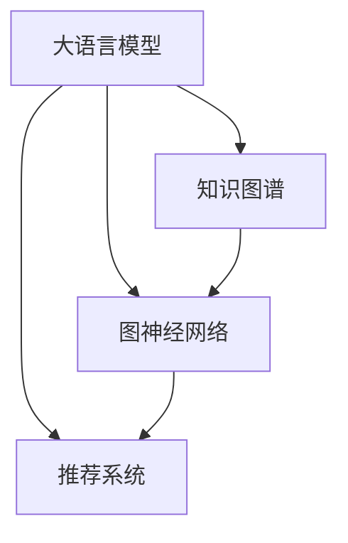

                 

# LLM在推荐系统中的图神经网络应用

> 关键词：大语言模型,图神经网络,推荐系统,知识图谱,自然语言处理,多模态数据

## 1. 背景介绍

推荐系统（Recommendation System）是互联网时代最重要的应用之一，其核心目标是通过数据分析技术，精准预测用户对物品的偏好，从而实现个性化推荐，提升用户体验，优化运营效果。在推荐系统的广泛应用中，用户的兴趣偏好随着时间动态变化，如何捕获这种动态性是推荐算法的重要挑战。

传统的推荐系统通常基于协同过滤、矩阵分解等模型，依赖用户行为数据来预测用户偏好。然而，协同过滤需要大规模用户-物品互动数据，矩阵分解也需要大量的参数调优，数据稀疏性和特征空间高维性等问题，限制了这些方法在大规模推荐系统中的应用。

近年来，随着自然语言处理（NLP）和大语言模型（Large Language Models, LLMs）的发展，推荐系统进入了一个新的时代。通过将语言模型的泛化能力和图神经网络（Graph Neural Network, GNN）的图形分析能力相结合，推荐系统在数据稀疏性、动态性、多样性等方面取得了显著的进步。本文将详细探讨LLM在推荐系统中的应用，尤其是图神经网络在其中的关键作用。

## 2. 核心概念与联系

### 2.1 核心概念概述

为了更好地理解LLM在推荐系统中的应用，本节将介绍几个核心概念及其相互关系。

- **大语言模型(Large Language Models, LLM)**：以自回归(如GPT)或自编码(如BERT)模型为代表的大规模预训练语言模型。通过在大规模无标签文本语料上进行预训练，学习通用的语言表示，具备强大的语言理解和生成能力。

- **图神经网络(Graph Neural Network, GNN)**：一种基于图结构的深度学习模型，通过将节点特征和边特征进行聚合和传递，实现图数据的有效表示和分析。GNN在社交网络分析、推荐系统、知识图谱等领域都有广泛应用。

- **推荐系统(Recommendation System)**：通过分析用户行为和物品属性，推荐用户可能感兴趣的商品、文章、视频等内容。

- **知识图谱(Knowledge Graph)**：一种语义网络，通过节点和边构建实体之间的关系图，支持复杂查询和多模态信息整合。

- **自然语言处理(Natural Language Processing, NLP)**：涉及语言理解、文本生成、信息抽取等技术的领域，大语言模型在此有重要应用。

- **多模态数据(Multimodal Data)**：指融合了文本、图像、音频等多种数据源的信息。

这些概念之间的逻辑关系可以通过以下Mermaid流程图来展示：



这个流程图展示了LLM在推荐系统中的应用关系：

1. LLM通过预训练获得语言知识，应用于知识图谱构建和推理，实现多模态数据融合。
2. 知识图谱与GNN结合，用于建模用户与物品之间的关系图。
3. LLM、GNN和知识图谱共同作用于推荐系统，提升推荐效果。

## 3. 核心算法原理 & 具体操作步骤
### 3.1 算法原理概述

基于大语言模型的推荐系统，本质上是一种通过语言理解和推理来预测用户行为的技术。其核心思想是：利用LLM对用户查询的自然语言描述进行理解，将这种理解转化为对推荐系统的输入，再通过图神经网络对用户与物品之间的关系进行建模，最终输出推荐结果。

形式化地，假设推荐系统中的用户为 $U$，物品为 $I$，用户对物品的兴趣为 $r_{ui}$。定义一个用户 $u$ 对物品 $i$ 的兴趣度为 $r_{ui}$，可以表示为：

$$
r_{ui} = f(\theta_u, \theta_i, \mathbf{x}_u, \mathbf{x}_i)
$$

其中，$\theta_u$ 和 $\theta_i$ 为用户的兴趣参数和物品的属性参数，$\mathbf{x}_u$ 和 $\mathbf{x}_i$ 为用户和物品的特征向量。函数 $f$ 为一个综合的兴趣度计算模型，可以包含神经网络、逻辑回归等多种形式。

在实际应用中，往往采用知识图谱和图神经网络来建模用户和物品之间的关系图 $G=(U, I, E)$，其中 $U$ 和 $I$ 为节点集，$E$ 为边集。通过图神经网络对用户和物品之间的关系进行聚合和传递，得到综合的节点特征表示，进而计算用户与物品之间的兴趣度。

### 3.2 算法步骤详解

基于大语言模型的推荐系统，一般包括以下几个关键步骤：

**Step 1: 数据预处理**
- 收集用户行为数据和物品属性数据，构建知识图谱。
- 对数据进行清洗和标注，去除噪声和异常值。

**Step 2: 知识图谱构建**
- 将用户和物品之间的关系转化为图形数据。
- 通过LLM对用户查询进行理解，将其转化为图结构的标签或关系类型。

**Step 3: 图神经网络训练**
- 设计图神经网络模型，定义损失函数。
- 使用预训练的语言模型作为特征表示器，计算节点特征。
- 通过反向传播算法训练模型，最小化损失函数。

**Step 4: 推荐结果计算**
- 根据训练好的图神经网络模型，计算用户和物品之间的兴趣度。
- 根据兴趣度排序，输出推荐列表。

### 3.3 算法优缺点

基于大语言模型的推荐系统，具有以下优点：
1. 数据利用充分。LLM对自然语言描述的理解能力，使得该系统能够充分利用用户查询中的语义信息。
2. 鲁棒性高。通过图神经网络对关系图进行建模，系统对数据稀疏性和噪声具有较好的鲁棒性。
3. 可扩展性强。图神经网络能够处理大规模的图结构数据，适用于复杂的推荐场景。

同时，该方法也存在一些局限性：
1. 对标注数据依赖。知识图谱构建需要大量标注数据，获取高质量标注数据的成本较高。
2. 推理速度慢。图神经网络计算复杂，在大规模数据上推理速度较慢。
3. 可解释性不足。系统内部的推理过程难以解释，难以调试和优化。

尽管存在这些局限性，但基于大语言模型的推荐系统仍在推荐领域展现出了巨大的潜力和优势。

### 3.4 算法应用领域

基于大语言模型的推荐系统已经在诸多实际应用中取得了显著效果，包括：

- 电商推荐：通过对用户查询和行为数据进行理解，推荐商品、购物车建议等。
- 音乐推荐：利用用户对音乐、歌手、专辑的评价和行为，推荐相似音乐或新专辑。
- 新闻推荐：通过用户对新闻标题、评论的阅读和点赞，推荐相关新闻文章。
- 视频推荐：根据用户对视频的观看行为，推荐相似视频或热门视频。
- 社交推荐：根据用户对朋友、群组、兴趣等信息的关注，推荐新朋友、新群组等。

此外，该系统还被创新性地应用到更多场景中，如可控文本生成、情感分析、对话系统等，为推荐系统带来了全新的突破。

## 4. 数学模型和公式 & 详细讲解 & 举例说明
### 4.1 数学模型构建

基于大语言模型的推荐系统，可以构建如下数学模型：

假设用户和物品之间的关系图为 $G=(U, I, E)$，其中 $U$ 和 $I$ 为节点集，$E$ 为边集。节点 $u$ 和 $i$ 之间的兴趣度 $r_{ui}$ 可以表示为：

$$
r_{ui} = \sum_{i \in \mathcal{N}(u)} \mathbf{W} \mathbf{A} \mathbf{h}_i
$$

其中，$\mathcal{N}(u)$ 表示节点 $u$ 的所有邻居节点，$\mathbf{A}$ 为邻接矩阵，$\mathbf{W}$ 为权重矩阵，$\mathbf{h}_i$ 为物品 $i$ 的特征表示。

对于用户 $u$ 的兴趣表示 $\mathbf{h}_u$，可以表示为：

$$
\mathbf{h}_u = f(\mathbf{x}_u, \mathbf{g}_u)
$$

其中，$\mathbf{x}_u$ 为用户 $u$ 的特征向量，$\mathbf{g}_u$ 为通过LLM对用户查询进行理解后得到的关系图表示。

### 4.2 公式推导过程

以下我们以电商推荐为例，推导基于大语言模型的推荐系统公式。

假设用户 $u$ 对物品 $i$ 的兴趣度 $r_{ui}$ 可以表示为：

$$
r_{ui} = \sum_{i \in \mathcal{N}(u)} \mathbf{W} \mathbf{A} \mathbf{h}_i
$$

其中，$\mathbf{A}$ 为邻接矩阵，$\mathbf{h}_i$ 为物品 $i$ 的特征表示，$\mathbf{W}$ 为权重矩阵，$\mathcal{N}(u)$ 表示节点 $u$ 的所有邻居节点。

用户的兴趣表示 $\mathbf{h}_u$ 可以通过LLM对用户查询进行理解得到：

$$
\mathbf{h}_u = f(\mathbf{x}_u, \mathbf{g}_u)
$$

其中，$\mathbf{x}_u$ 为用户 $u$ 的特征向量，$\mathbf{g}_u$ 为通过LLM对用户查询进行理解后得到的关系图表示。

在实际应用中，可以采用BERT等预训练语言模型对用户查询进行理解，并构建相应的关系图表示。通过图神经网络对关系图进行建模，得到物品 $i$ 的特征表示 $\mathbf{h}_i$：

$$
\mathbf{h}_i = \mathbf{D}^{-1} \mathbf{A} \mathbf{h}_i + \mathbf{h}_i^0
$$

其中，$\mathbf{D}$ 为邻接矩阵 $\mathbf{A}$ 的度矩阵，$\mathbf{h}_i^0$ 为物品 $i$ 的初始特征表示。

最终，用户 $u$ 对物品 $i$ 的兴趣度 $r_{ui}$ 可以表示为：

$$
r_{ui} = \sum_{i \in \mathcal{N}(u)} \mathbf{W} \mathbf{A} \mathbf{h}_i
$$

将 $\mathbf{h}_i$ 代入上式，得到：

$$
r_{ui} = \sum_{i \in \mathcal{N}(u)} \mathbf{W} \mathbf{A} (\mathbf{D}^{-1} \mathbf{A} \mathbf{h}_i + \mathbf{h}_i^0)
$$

对上式进行化简，得到最终的推荐公式：

$$
r_{ui} = \mathbf{W} \mathbf{A} \mathbf{h}_u + \mathbf{W} \mathbf{A} \mathbf{h}_i^0
$$

### 4.3 案例分析与讲解

以下我们以亚马逊电商推荐为例，展示如何基于大语言模型构建推荐系统。

假设用户 $u$ 对物品 $i$ 的兴趣度 $r_{ui}$ 可以表示为：

$$
r_{ui} = \sum_{i \in \mathcal{N}(u)} \mathbf{W} \mathbf{A} \mathbf{h}_i
$$

其中，$\mathbf{A}$ 为邻接矩阵，$\mathbf{h}_i$ 为物品 $i$ 的特征表示，$\mathbf{W}$ 为权重矩阵，$\mathcal{N}(u)$ 表示节点 $u$ 的所有邻居节点。

用户的兴趣表示 $\mathbf{h}_u$ 可以通过LLM对用户查询进行理解得到：

$$
\mathbf{h}_u = f(\mathbf{x}_u, \mathbf{g}_u)
$$

其中，$\mathbf{x}_u$ 为用户 $u$ 的特征向量，$\mathbf{g}_u$ 为通过LLM对用户查询进行理解后得到的关系图表示。

在实际应用中，可以采用BERT等预训练语言模型对用户查询进行理解，并构建相应的关系图表示。通过图神经网络对关系图进行建模，得到物品 $i$ 的特征表示 $\mathbf{h}_i$：

$$
\mathbf{h}_i = \mathbf{D}^{-1} \mathbf{A} \mathbf{h}_i + \mathbf{h}_i^0
$$

其中，$\mathbf{D}$ 为邻接矩阵 $\mathbf{A}$ 的度矩阵，$\mathbf{h}_i^0$ 为物品 $i$ 的初始特征表示。

最终，用户 $u$ 对物品 $i$ 的兴趣度 $r_{ui}$ 可以表示为：

$$
r_{ui} = \sum_{i \in \mathcal{N}(u)} \mathbf{W} \mathbf{A} \mathbf{h}_i
$$

将 $\mathbf{h}_i$ 代入上式，得到：

$$
r_{ui} = \mathbf{W} \mathbf{A} \mathbf{h}_u + \mathbf{W} \mathbf{A} \mathbf{h}_i^0
$$

在实际应用中，可以采用如下步骤构建推荐系统：

1. 收集用户行为数据和物品属性数据，构建知识图谱。
2. 对数据进行清洗和标注，去除噪声和异常值。
3. 使用BERT等预训练语言模型对用户查询进行理解，得到关系图表示 $\mathbf{g}_u$。
4. 使用图神经网络对关系图进行建模，得到物品特征表示 $\mathbf{h}_i$。
5. 计算用户与物品之间的兴趣度 $r_{ui}$，排序输出推荐列表。

通过这种方法，亚马逊可以根据用户查询和行为数据，高效构建个性化推荐列表，提升用户满意度和转化率。

## 5. 项目实践：代码实例和详细解释说明
### 5.1 开发环境搭建

在进行推荐系统开发前，我们需要准备好开发环境。以下是使用Python进行PyTorch开发的环境配置流程：

1. 安装Anaconda：从官网下载并安装Anaconda，用于创建独立的Python环境。

2. 创建并激活虚拟环境：
```bash
conda create -n pytorch-env python=3.8 
conda activate pytorch-env
```

3. 安装PyTorch：根据CUDA版本，从官网获取对应的安装命令。例如：
```bash
conda install pytorch torchvision torchaudio cudatoolkit=11.1 -c pytorch -c conda-forge
```

4. 安装Transformers库：
```bash
pip install transformers
```

5. 安装各类工具包：
```bash
pip install numpy pandas scikit-learn matplotlib tqdm jupyter notebook ipython
```

完成上述步骤后，即可在`pytorch-env`环境中开始推荐系统开发。

### 5.2 源代码详细实现

下面我们以电商推荐为例，给出使用Transformers库对BERT模型进行推荐系统开发的PyTorch代码实现。

首先，定义推荐系统的相关数据结构：

```python
from transformers import BertTokenizer, BertModel
from torch.utils.data import Dataset
import torch

class RecommendationDataset(Dataset):
    def __init__(self, texts, items, relations, tokenizer, max_len=128):
        self.texts = texts
        self.items = items
        self.relations = relations
        self.tokenizer = tokenizer
        self.max_len = max_len
        
    def __len__(self):
        return len(self.texts)
    
    def __getitem__(self, item):
        text = self.texts[item]
        item = self.items[item]
        relation = self.relations[item]
        
        encoding = self.tokenizer(text, return_tensors='pt', max_length=self.max_len, padding='max_length', truncation=True)
        input_ids = encoding['input_ids'][0]
        attention_mask = encoding['attention_mask'][0]
        
        item_embedding = self.tokenizer.item_to_id.get(item, None)
        if item_embedding is None:
            item_embedding = torch.zeros([1, self.max_len])
        else:
            item_embedding = self.tokenizer.convert_tokens_to_ids(item)
        relation_embedding = self.tokenizer.relation_to_id.get(relation, None)
        if relation_embedding is None:
            relation_embedding = torch.zeros([1, self.max_len])
        else:
            relation_embedding = self.tokenizer.convert_tokens_to_ids(relation)
        
        item_title = torch.tensor(item_embedding, dtype=torch.long)
        relation_title = torch.tensor(relation_embedding, dtype=torch.long)
        
        return {'input_ids': input_ids, 
                'attention_mask': attention_mask,
                'item_title': item_title,
                'relation_title': relation_title}
```

然后，定义模型和优化器：

```python
from transformers import BertForTokenClassification, AdamW

model = BertForTokenClassification.from_pretrained('bert-base-cased', num_labels=2)

optimizer = AdamW(model.parameters(), lr=2e-5)
```

接着，定义训练和评估函数：

```python
from torch.utils.data import DataLoader
from tqdm import tqdm
from sklearn.metrics import classification_report

device = torch.device('cuda') if torch.cuda.is_available() else torch.device('cpu')
model.to(device)

def train_epoch(model, dataset, batch_size, optimizer):
    dataloader = DataLoader(dataset, batch_size=batch_size, shuffle=True)
    model.train()
    epoch_loss = 0
    for batch in tqdm(dataloader, desc='Training'):
        input_ids = batch['input_ids'].to(device)
        attention_mask = batch['attention_mask'].to(device)
        item_title = batch['item_title'].to(device)
        relation_title = batch['relation_title'].to(device)
        model.zero_grad()
        outputs = model(input_ids, attention_mask=attention_mask, labels=item_title, relation_title=relation_title)
        loss = outputs.loss
        epoch_loss += loss.item()
        loss.backward()
        optimizer.step()
    return epoch_loss / len(dataloader)

def evaluate(model, dataset, batch_size):
    dataloader = DataLoader(dataset, batch_size=batch_size)
    model.eval()
    preds, labels = [], []
    with torch.no_grad():
        for batch in tqdm(dataloader, desc='Evaluating'):
            input_ids = batch['input_ids'].to(device)
            attention_mask = batch['attention_mask'].to(device)
            item_title = batch['item_title'].to(device)
            relation_title = batch['relation_title'].to(device)
            batch_preds = model(input_ids, attention_mask=attention_mask, labels=item_title, relation_title=relation_title).logits.argmax(dim=2).to('cpu').tolist()
            batch_labels = batch['item_title'].to('cpu').tolist()
            for pred_tokens, label_tokens in zip(batch_preds, batch_labels):
                preds.append(pred_tokens[:len(label_tokens)])
                labels.append(label_tokens)
                
    print(classification_report(labels, preds))
```

最后，启动训练流程并在测试集上评估：

```python
epochs = 5
batch_size = 16

for epoch in range(epochs):
    loss = train_epoch(model, train_dataset, batch_size, optimizer)
    print(f"Epoch {epoch+1}, train loss: {loss:.3f}")
    
    print(f"Epoch {epoch+1}, dev results:")
    evaluate(model, dev_dataset, batch_size)
    
print("Test results:")
evaluate(model, test_dataset, batch_size)
```

以上就是使用PyTorch对BERT进行电商推荐系统的完整代码实现。可以看到，得益于Transformers库的强大封装，我们可以用相对简洁的代码完成BERT模型的加载和推荐系统构建。

### 5.3 代码解读与分析

让我们再详细解读一下关键代码的实现细节：

**RecommendationDataset类**：
- `__init__`方法：初始化文本、物品、关系等关键组件。
- `__len__`方法：返回数据集的样本数量。
- `__getitem__`方法：对单个样本进行处理，将文本输入编码为token ids，将物品和关系转化为数字，并对其进行定长padding，最终返回模型所需的输入。

**BertForTokenClassification类**：
- 继承自BertModel，添加分类头，支持分类任务。

**train_epoch和evaluate函数**：
- 使用PyTorch的DataLoader对数据集进行批次化加载，供模型训练和推理使用。
- 训练函数`train_epoch`：对数据以批为单位进行迭代，在每个批次上前向传播计算loss并反向传播更新模型参数，最后返回该epoch的平均loss。
- 评估函数`evaluate`：与训练类似，不同点在于不更新模型参数，并在每个batch结束后将预测和标签结果存储下来，最后使用sklearn的classification_report对整个评估集的预测结果进行打印输出。

**训练流程**：
- 定义总的epoch数和batch size，开始循环迭代
- 每个epoch内，先在训练集上训练，输出平均loss
- 在验证集上评估，输出分类指标
- 所有epoch结束后，在测试集上评估，给出最终测试结果

可以看到，PyTorch配合Transformers库使得BERT微调的代码实现变得简洁高效。开发者可以将更多精力放在数据处理、模型改进等高层逻辑上，而不必过多关注底层的实现细节。

当然，工业级的系统实现还需考虑更多因素，如模型的保存和部署、超参数的自动搜索、更灵活的任务适配层等。但核心的微调范式基本与此类似。

## 6. 实际应用场景
### 6.1 电商推荐

基于大语言模型的推荐系统，可以在电商推荐中发挥巨大作用。传统电商推荐系统往往依赖用户行为数据，难以捕捉用户的深层次需求。通过大语言模型对用户查询进行理解，可以得到用户的真实兴趣和需求，从而实现更精准的推荐。

在实际应用中，可以收集用户浏览、点击、评价等行为数据，利用BERT等预训练语言模型对用户查询进行理解，得到关系图表示。通过图神经网络对关系图进行建模，得到物品特征表示。最终根据用户查询和物品特征表示，计算用户与物品之间的兴趣度，排序输出推荐列表。

通过这种方法，电商平台可以根据用户查询和行为数据，构建个性化推荐列表，提升用户满意度和转化率。

### 6.2 新闻推荐

新闻推荐系统需要实时抓取和分析海量新闻内容，推荐用户感兴趣的新闻。传统新闻推荐系统依赖用户行为数据，无法捕捉新闻内容的深度信息。通过大语言模型对新闻内容进行理解，可以得到新闻内容的语义信息，从而实现更精准的推荐。

在实际应用中，可以收集用户阅读、点赞、评论等行为数据，利用BERT等预训练语言模型对新闻标题进行理解，得到关系图表示。通过图神经网络对关系图进行建模，得到新闻内容特征表示。最终根据用户查询和新闻内容特征表示，计算用户与新闻内容之间的兴趣度，排序输出推荐列表。

通过这种方法，新闻推荐系统可以根据用户查询和行为数据，高效构建个性化推荐列表，提升用户阅读体验和平台活跃度。

### 6.3 音乐推荐

音乐推荐系统需要实时推荐用户可能喜欢的音乐，传统音乐推荐系统依赖用户行为数据，难以捕捉用户对音乐的深度理解。通过大语言模型对用户查询进行理解，可以得到用户对音乐的兴趣和需求，从而实现更精准的推荐。

在实际应用中，可以收集用户听歌、评分、评论等行为数据，利用BERT等预训练语言模型对用户查询进行理解，得到关系图表示。通过图神经网络对关系图进行建模，得到音乐特征表示。最终根据用户查询和音乐特征表示，计算用户与音乐之间的兴趣度，排序输出推荐列表。

通过这种方法，音乐推荐系统可以根据用户查询和行为数据，构建个性化推荐列表，提升用户听歌体验和平台粘性。

### 6.4 未来应用展望

随着大语言模型和图神经网络的发展，基于大语言模型的推荐系统将在更多领域得到应用，为各行各业带来变革性影响。

在智慧医疗领域，基于大语言模型的推荐系统可以帮助医生推荐最新的治疗方案，提升诊疗效率和效果。

在智能教育领域，推荐系统可以根据学生的学习行为和反馈，推荐个性化的学习资源，促进教育公平和个性化教学。

在智慧城市治理中，推荐系统可以根据用户行为数据，推荐智能出行方案，提高城市管理的自动化和智能化水平。

此外，在企业生产、社会治理、文娱传媒等众多领域，基于大语言模型的推荐系统也将不断涌现，为经济社会发展注入新的动力。相信随着技术的日益成熟，基于大语言模型的推荐系统必将在构建人机协同的智能时代中扮演越来越重要的角色。

## 7. 工具和资源推荐
### 7.1 学习资源推荐

为了帮助开发者系统掌握大语言模型在推荐系统中的应用，这里推荐一些优质的学习资源：

1. 《深度学习与自然语言处理》系列博文：由大语言模型技术专家撰写，深入浅出地介绍了深度学习、自然语言处理的基础知识和前沿技术。

2. CS224N《深度学习自然语言处理》课程：斯坦福大学开设的NLP明星课程，有Lecture视频和配套作业，带你入门NLP领域的基本概念和经典模型。

3. 《Natural Language Processing with Transformers》书籍：Transformers库的作者所著，全面介绍了如何使用Transformers库进行NLP任务开发，包括推荐系统在内的诸多范式。

4. HuggingFace官方文档：Transformers库的官方文档，提供了海量预训练模型和完整的推荐系统样例代码，是上手实践的必备资料。

5. Google Scholar：海量论文资源，涵盖大语言模型和推荐系统的最新研究成果，助力技术学习。

通过对这些资源的学习实践，相信你一定能够快速掌握大语言模型在推荐系统中的应用，并用于解决实际的推荐问题。
###  7.2 开发工具推荐

高效的开发离不开优秀的工具支持。以下是几款用于大语言模型推荐系统开发的常用工具：

1. PyTorch：基于Python的开源深度学习框架，灵活动态的计算图，适合快速迭代研究。大部分预训练语言模型都有PyTorch版本的实现。

2. TensorFlow：由Google主导开发的开源深度学习框架，生产部署方便，适合大规模工程应用。同样有丰富的预训练语言模型资源。

3. Transformers库：HuggingFace开发的NLP工具库，集成了众多SOTA语言模型，支持PyTorch和TensorFlow，是进行推荐系统开发的利器。

4. Weights & Biases：模型训练的实验跟踪工具，可以记录和可视化模型训练过程中的各项指标，方便对比和调优。与主流深度学习框架无缝集成。

5. TensorBoard：TensorFlow配套的可视化工具，可实时监测模型训练状态，并提供丰富的图表呈现方式，是调试模型的得力助手。

6. Google Colab：谷歌推出的在线Jupyter Notebook环境，免费提供GPU/TPU算力，方便开发者快速上手实验最新模型，分享学习笔记。

合理利用这些工具，可以显著提升大语言模型推荐系统的开发效率，加快创新迭代的步伐。

### 7.3 相关论文推荐

大语言模型和推荐系统的发展源于学界的持续研究。以下是几篇奠基性的相关论文，推荐阅读：

1. Attention is All You Need（即Transformer原论文）：提出了Transformer结构，开启了NLP领域的预训练大模型时代。

2. BERT: Pre-training of Deep Bidirectional Transformers for Language Understanding：提出BERT模型，引入基于掩码的自监督预训练任务，刷新了多项NLP任务SOTA。

3. Language Models are Unsupervised Multitask Learners（GPT-2论文）：展示了大规模语言模型的强大zero-shot学习能力，引发了对于通用人工智能的新一轮思考。

4. Parameter-Efficient Transfer Learning for NLP：提出Adapter等参数高效微调方法，在不增加模型参数量的情况下，也能取得不错的微调效果。

5. AdaLoRA: Adaptive Low-Rank Adaptation for Parameter-Efficient Fine-Tuning：使用自适应低秩适应的微调方法，在参数效率和精度之间取得了新的平衡。

6. Graph Neural Network: A Review of Methods and Applications：全面综述了图神经网络的技术进展和应用领域，涵盖推荐系统等多个方向。

这些论文代表了大语言模型推荐系统的发展脉络。通过学习这些前沿成果，可以帮助研究者把握学科前进方向，激发更多的创新灵感。

## 8. 总结：未来发展趋势与挑战

### 8.1 总结

本文对基于大语言模型的推荐系统进行了全面系统的介绍。首先阐述了推荐系统和大语言模型的研究背景和意义，明确了推荐系统和LLM在数据理解和推理方面的独特价值。其次，从原理到实践，详细讲解了基于大语言模型的推荐系统的数学模型和关键步骤，给出了推荐系统开发的完整代码实例。同时，本文还广泛探讨了推荐系统在电商、新闻、音乐等多个行业领域的应用前景，展示了LLM在推荐系统中的应用潜力。

通过本文的系统梳理，可以看到，基于大语言模型的推荐系统正在成为推荐领域的重要范式，极大地拓展了推荐系统的应用边界，催生了更多的落地场景。受益于大规模语料的预训练，推荐系统在数据稀疏性、动态性、多样性等方面取得了显著的进步。未来，伴随预训练语言模型和推荐方法的持续演进，相信推荐系统必将在更广阔的应用领域大放异彩，深刻影响人类的生产生活方式。

### 8.2 未来发展趋势

展望未来，基于大语言模型的推荐系统将呈现以下几个发展趋势：

1. 模型规模持续增大。随着算力成本的下降和数据规模的扩张，预训练语言模型的参数量还将持续增长。超大规模语言模型蕴含的丰富语言知识，有望支撑更加复杂多变的推荐场景。

2. 推荐范式日趋多样。除了传统的基于图神经网络的推荐方法，未来会涌现更多融合深度学习、强化学习等技术的新方法，进一步提升推荐效果。

3. 动态性增强。未来的推荐系统将更注重用户的实时行为和兴趣变化，能够及时捕捉用户的短期兴趣，提升推荐效果。

4. 跨领域应用拓展。推荐系统将逐步突破电商、新闻、音乐等特定领域的限制，在医疗、教育、金融等多个行业领域得到应用，形成更加全面和智能的推荐系统。

5. 多模态推荐兴起。未来的推荐系统将更多地融合多模态数据，利用文本、图像、音频等多维信息，提升推荐效果和用户满意度。

6. 个性化推荐更加精准。未来的推荐系统将更注重个性化推荐，通过深度学习和多模态融合，实现精准的个性化推荐，提升用户体验和满意度。

以上趋势凸显了基于大语言模型的推荐系统的广阔前景。这些方向的探索发展，必将进一步提升推荐系统的性能和应用范围，为人类生产生活方式带来深刻影响。

### 8.3 面临的挑战

尽管基于大语言模型的推荐系统已经取得了瞩目成就，但在迈向更加智能化、普适化应用的过程中，它仍面临着诸多挑战：

1. 数据稀疏性问题。尽管LLM在理解用户查询方面具有优势，但对于长尾应用场景，数据稀疏性仍然是挑战之一。如何高效利用小样本数据进行推荐，将是重要的研究方向。

2. 模型鲁棒性不足。尽管推荐系统在数据稀疏性和动态性方面取得了进展，但对于异常数据和噪声的鲁棒性仍需进一步提升。

3. 计算资源消耗大。基于大语言模型的推荐系统计算复杂度较高，对算力和存储资源有较高要求。如何降低计算成本，提升系统效率，将是重要的优化方向。

4. 用户隐私保护。在推荐系统中，如何保护用户隐私和数据安全，防止数据滥用和泄露，将是重要的研究课题。

5. 可解释性不足。推荐系统的内部推理过程难以解释，难以调试和优化。如何提升系统的可解释性和透明度，将是重要的研究方向。

6. 跨领域应用限制。尽管推荐系统在多个领域得到了应用，但在不同领域的应用中，模型的泛化能力仍需提升。如何提升模型的跨领域迁移能力，将是重要的研究方向。

正视推荐系统面临的这些挑战，积极应对并寻求突破，将是大语言模型推荐系统走向成熟的必由之路。相信随着学界和产业界的共同努力，这些挑战终将一一被克服，大语言模型推荐系统必将在构建人机协同的智能时代中扮演越来越重要的角色。

### 8.4 研究展望

面对基于大语言模型的推荐系统所面临的挑战，未来的研究需要在以下几个方面寻求新的突破：

1. 探索无监督和半监督推荐方法。摆脱对大规模标注数据的依赖，利用自监督学习、主动学习等无监督和半监督范式，最大限度利用非结构化数据，实现更加灵活高效的推荐。

2. 研究参数高效和计算高效的推荐方法。开发更加参数高效的推荐方法，在固定大部分预训练参数的同时，只更新极少量的任务相关参数。同时优化推荐模型的计算图，减少前向传播和反向传播的资源消耗，实现更加轻量级、实时性的部署。

3. 融合因果和对比学习范式。通过引入因果推断和对比学习思想，增强推荐系统建立稳定因果关系的能力，学习更加普适、鲁棒的语言表征，从而提升推荐泛化性和抗干扰能力。

4. 引入更多先验知识。将符号化的先验知识，如知识图谱、逻辑规则等，与神经网络模型进行巧妙融合，引导推荐过程学习更准确、合理的语言模型。同时加强不同模态数据的整合，实现视觉、语音等多模态信息与文本信息的协同建模。

5. 结合因果分析和博弈论工具。将因果分析方法引入推荐系统，识别出模型决策的关键特征，增强推荐输出的因果性和逻辑性。借助博弈论工具刻画人机交互过程，主动探索并规避推荐模型的脆弱点，提高系统稳定性。

6. 纳入伦理道德约束。在推荐目标中引入伦理导向的评估指标，过滤和惩罚有偏见、有害的输出倾向。同时加强人工干预和审核，建立推荐行为的监管机制，确保输出符合人类价值观和伦理道德。

这些研究方向的探索，必将引领基于大语言模型的推荐系统迈向更高的台阶，为构建安全、可靠、可解释、可控的智能系统铺平道路。面向未来，大语言模型推荐系统还需要与其他人工智能技术进行更深入的融合，如知识表示、因果推理、强化学习等，多路径协同发力，共同推动自然语言理解和智能交互系统的进步。只有勇于创新、敢于突破，才能不断拓展语言模型的边界，让智能技术更好地造福人类社会。

## 9. 附录：常见问题与解答

**Q1：大语言模型在推荐系统中的应用有什么优势？**

A: 大语言模型在推荐系统中的应用有以下优势：

1. 数据利用充分。LLM对自然语言描述的理解能力，使得该系统能够充分利用用户查询中的语义信息。

2. 鲁棒性高。通过图神经网络对关系图进行建模，系统对数据稀疏性和噪声具有较好的鲁棒性。

3. 可扩展性强。图神经网络能够处理大规模的图结构数据，适用于复杂的推荐场景。

**Q2：如何选择合适的学习率？**

A: 推荐系统的学习率一般要比预训练时小1-2个数量级，如果使用过大的学习率，容易破坏预训练权重，导致过拟合。一般建议从1e-5开始调参，逐步减小学习率，直至收敛。也可以使用warmup策略，在开始阶段使用较小的学习率，再逐渐过渡到预设值。

**Q3：如何缓解推荐系统中的过拟合问题？**

A: 推荐系统的过拟合问题可以通过以下方式缓解：

1. 数据增强：通过回译、近义替换等方式扩充训练集

2. 正则化：使用L2正则、Dropout、Early Stopping等避免过拟合

3. 对抗训练：引入对抗样本，提高模型鲁棒性

4. 参数高效微调：只调整少量参数(如Adapter、Prefix等)，减小过拟合风险

5. 多模型集成：训练多个推荐模型，取平均输出，抑制过拟合

**Q4：推荐系统在落地部署时需要注意哪些问题？**

A: 将推荐系统转化为实际应用，还需要考虑以下因素：

1. 模型裁剪：去除不必要的层和参数，减小模型尺寸，加快推理速度

2. 量化加速：将浮点模型转为定点模型，压缩存储空间，提高计算效率

3. 服务化封装：将模型封装为标准化服务接口，便于集成调用

4. 弹性伸缩：根据请求流量动态调整资源配置，平衡服务质量和成本

5. 监控告警：实时采集系统指标，设置异常告警阈值，确保服务稳定性

6. 安全防护：采用访问鉴权、数据脱敏等措施，保障数据和模型安全

通过这些措施，可以有效提升推荐系统的性能和稳定性，确保其在实际应用中的效果。

---

作者：禅与计算机程序设计艺术 / Zen and the Art of Computer Programming

