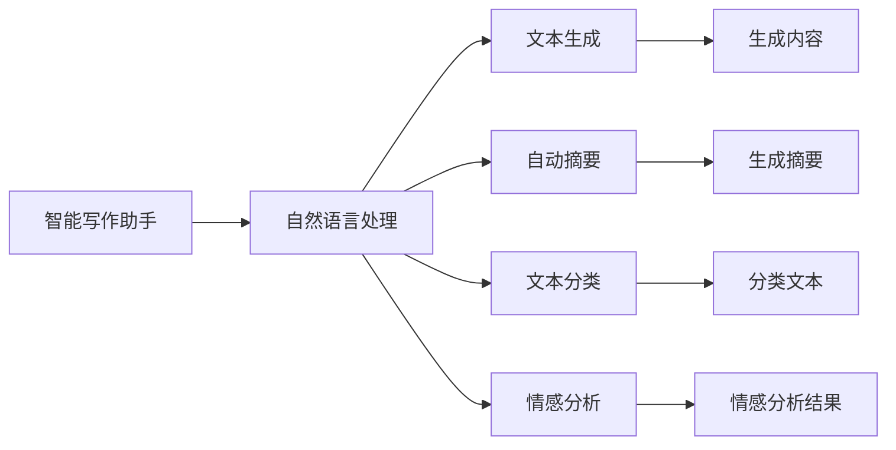

                 

# LLM在智能写作辅助系统中的应用探索

> 关键词：自然语言处理(NLP), 智能写作, 语言模型, 智能助手, 文本生成, 自动摘要, 内容创作, 文本分类, 情感分析

## 1. 背景介绍

### 1.1 问题由来

随着人工智能技术的发展，大语言模型(LLMs)在自然语言处理(NLP)领域取得了显著进展。LLMs，如GPT-3、BERT等，通过在大规模无标签文本数据上进行预训练，学习到了丰富的语言知识，能够在各种语言理解和生成任务上表现出色。这些模型为开发智能写作辅助系统提供了强有力的技术支持。

智能写作辅助系统旨在通过机器学习技术，辅助人类进行内容创作、文本编辑、文本分类等任务。通过整合LLMs的优势，这类系统可以自动生成内容、自动摘要、情感分析、文本分类，甚至提供写作建议和纠错功能，极大地提升内容创作的效率和质量。

本文将围绕LLM在智能写作辅助系统中的应用，详细介绍相关核心概念、算法原理、实践步骤，以及未来发展趋势和面临的挑战。

## 2. 核心概念与联系

### 2.1 核心概念概述

在智能写作辅助系统中，LLMs主要负责语言理解和文本生成两个关键环节。语言理解涉及从输入文本中提取关键信息、情感、主题等；文本生成则包括自动生成文本内容、摘要、建议等。

为了更好地理解LLM在智能写作辅助系统中的应用，以下将介绍几个关键概念：

- 自然语言处理(NLP)：利用计算机处理和理解自然语言的技术，包括分词、词性标注、句法分析、语义分析等。
- 大语言模型(LLMs)：通过自监督学习任务训练的、具备强大语言理解和生成能力的模型，如GPT-3、BERT等。
- 智能写作助手：通过LLMs提供内容创作、文本编辑、文本分类、情感分析等功能的智能系统。
- 文本生成：利用LLMs生成新的文本内容、摘要、建议等，帮助人类提高内容创作的效率和质量。
- 自动摘要：从长文本中提取关键信息，生成简洁明了的摘要。
- 内容创作：自动生成文章、报告、评论等文本内容。
- 文本分类：对文本进行自动分类，如新闻分类、情感分类等。
- 情感分析：识别和分析文本中的情感倾向。

这些概念之间具有紧密联系，通过综合运用LLMs、NLP技术和智能算法，智能写作辅助系统能够实现多方面的文本处理和内容创作功能。

### 2.2 核心概念原理和架构的 Mermaid 流程图



## 3. 核心算法原理 & 具体操作步骤

### 3.1 算法原理概述

智能写作辅助系统主要依赖LLMs的预训练模型进行文本理解和生成。其核心算法原理如下：

1. **预训练**：在大规模无标签文本数据上，通过自监督学习任务训练预训练模型，学习通用的语言表示。
2. **微调**：在特定下游任务上，对预训练模型进行有监督学习，优化模型在特定任务上的性能。
3. **推理**：使用优化后的模型，对输入文本进行推理，自动生成内容、摘要、分类、情感分析结果等。

### 3.2 算法步骤详解

智能写作辅助系统的算法步骤主要包括以下几个环节：

1. **数据收集**：从互联网、新闻、博客、社交媒体等渠道收集相关文本数据，作为预训练和微调的数据集。
2. **预训练**：使用自监督学习任务（如语言建模、掩码语言模型等）训练预训练模型，学习通用的语言表示。
3. **微调**：在特定下游任务上，收集少量标注数据，使用有监督学习微调模型，优化其在特定任务上的性能。
4. **推理**：使用微调后的模型，对用户输入文本进行推理，生成内容、摘要、分类、情感分析结果等。
5. **反馈与迭代**：根据用户反馈，不断优化微调模型，提升系统性能。

### 3.3 算法优缺点

智能写作辅助系统基于LLMs的微调方法具有以下优点：

- **高效便捷**：只需收集少量标注数据，即可快速构建智能写作助手，降低开发成本和时间。
- **适应性强**：预训练模型在多种任务上表现出色，能够适应不同领域的文本处理需求。
- **可扩展性高**：通过不断微调和优化，可以提升系统的性能，满足更多复杂的应用需求。

同时，该方法也存在以下缺点：

- **数据依赖**：微调效果依赖于标注数据的质量和数量，获取高质量标注数据的成本较高。
- **泛化能力有限**：预训练模型在特定任务上微调时，泛化能力可能受限于任务的复杂度。
- **模型复杂度**：预训练模型和微调模型规模庞大，对计算资源和存储空间要求较高。
- **解释性不足**：微调模型在推理过程中缺乏可解释性，难以对其内部工作机制进行理解和调试。

### 3.4 算法应用领域

智能写作辅助系统可以应用于多种场景，如新闻撰写、内容创作、市场报告、社交媒体管理等。

- **新闻撰写**：自动生成新闻报道，辅助记者快速撰写新闻稿件。
- **内容创作**：生成文章、博客、报告等文本内容，帮助内容创作者提高效率和质量。
- **市场报告**：自动生成市场分析报告，辅助企业了解市场动态。
- **社交媒体管理**：生成社交媒体帖文，提高社交媒体运营效率。
- **教育培训**：辅助学生和教师编写教学材料，提高教育质量。

## 4. 数学模型和公式 & 详细讲解

### 4.1 数学模型构建

假设输入文本为 $X = (x_1, x_2, ..., x_n)$，其中每个 $x_i$ 是一个单词或子词。输出为 $Y = (y_1, y_2, ..., y_m)$，其中每个 $y_j$ 是一个标签或输出结果。智能写作辅助系统的数学模型可以表示为：

$$
P(Y|X; \theta) = \prod_{j=1}^{m} P(y_j|y_{j-1}, x_1, x_2, ..., x_n; \theta)
$$

其中 $\theta$ 为模型参数，$P(y_j|y_{j-1}, x_1, x_2, ..., x_n; \theta)$ 表示在给定上下文 $x_1, x_2, ..., x_n$ 和前一个输出结果 $y_{j-1}$ 的条件下，生成下一个输出结果 $y_j$ 的概率。

### 4.2 公式推导过程

对于语言模型的训练，可以使用最大似然估计（MLE）方法，最大化输入文本 $X$ 的概率 $P(X; \theta)$。具体来说，假设输入文本为 $(x_1, x_2, ..., x_n)$，模型参数为 $\theta$，则有：

$$
P(X; \theta) = \prod_{i=1}^{n} P(x_i|x_{i-1}, ..., x_1; \theta)
$$

在预训练阶段，通过最大化输入文本的概率 $P(X; \theta)$，训练预训练模型。在微调阶段，使用有监督学习优化模型，最小化损失函数 $L$：

$$
L = -\sum_{i=1}^{n} \log P(x_i|x_{i-1}, ..., x_1; \theta)
$$

其中 $\theta$ 为模型参数，$P(x_i|x_{i-1}, ..., x_1; \theta)$ 为模型在给定上下文条件下的条件概率。

### 4.3 案例分析与讲解

以自动摘要为例，假设有输入文本 $X = (x_1, x_2, ..., x_n)$，要求生成摘要 $Y = (y_1, y_2, ..., y_m)$。

- **输入预处理**：将输入文本分词，去除停用词，提取关键信息。
- **模型选择**：选择合适的预训练模型作为特征提取器，如BERT、GPT等。
- **训练与微调**：在微调数据集上训练模型，优化其在摘要任务上的性能。
- **摘要生成**：使用微调后的模型，对输入文本进行推理，生成简洁明了的摘要。

## 5. 项目实践：代码实例和详细解释说明

### 5.1 开发环境搭建

为了实现智能写作辅助系统，需要搭建一个Python开发环境。以下是详细的配置步骤：

1. **安装Python**：选择并安装Python 3.8及以上版本，建议使用Anaconda安装。
2. **创建虚拟环境**：使用Anaconda创建虚拟环境，例如：

   ```bash
   conda create -n myenv python=3.8
   conda activate myenv
   ```

3. **安装依赖库**：安装必要的库和框架，例如：

   ```bash
   pip install transformers torch torchtext sklearn
   ```

4. **环境测试**：测试环境配置是否正确，例如：

   ```python
   import torch
   print(torch.__version__)
   ```

完成上述步骤后，即可开始智能写作辅助系统的开发。

### 5.2 源代码详细实现

以下是一个简单的智能写作辅助系统的代码示例，用于自动生成摘要：

```python
from transformers import AutoTokenizer, AutoModelForSequenceClassification
import torch
from torchtext.datasets import Multi30k
from torchtext.data import Field, TabularDataset, BucketIterator

# 数据处理
train_data, valid_data, test_data = Multi30k.splits()
tokenizer = AutoTokenizer.from_pretrained('bert-base-uncased')
TEXT = Field(tokenize=tokenizer, lower=True, token_sort=True)
LABEL = Field(sequential=False, use_vocab=False)
train_data = train_data.examples
valid_data = valid_data.examples
test_data = test_data.examples
train_data = TabularDataset(train_data, format='csv', fields=[('text', TEXT), ('label', LABEL)])
valid_data = TabularDataset(valid_data, format='csv', fields=[('text', TEXT), ('label', LABEL)])
test_data = TabularDataset(test_data, format='csv', fields=[('text', TEXT), ('label', LABEL)])
TEXT.build_vocab(train_data, max_size=25_000)
LABEL.build_vocab(train_data, max_size=10)
train_data = train_data.sort(key=lambda x: len(x.text))
train_iterator, valid_iterator, test_iterator = BucketIterator.splits(
    (train_data, valid_data, test_data),
    batch_size=16,
    sort_within_batch=True,
    device='cuda'
)

# 模型训练
model = AutoModelForSequenceClassification.from_pretrained('bert-base-uncased', num_labels=10)
optimizer = torch.optim.Adam(model.parameters(), lr=1e-5)
criterion = torch.nn.CrossEntropyLoss()
epochs = 3

for epoch in range(epochs):
    for batch in train_iterator:
        input_ids = batch.text_ids
        attention_mask = batch.attention_mask
        labels = batch.label
        model.zero_grad()
        outputs = model(input_ids, attention_mask=attention_mask)
        loss = criterion(outputs, labels)
        loss.backward()
        optimizer.step()

    for batch in valid_iterator:
        input_ids = batch.text_ids
        attention_mask = batch.attention_mask
        labels = batch.label
        model.eval()
        with torch.no_grad():
            outputs = model(input_ids, attention_mask=attention_mask)
            accuracy = (torch.argmax(outputs, dim=1) == labels).sum().item() / len(labels)
            print(f'Epoch {epoch+1}, Accuracy: {accuracy:.4f}')

print('Training complete.')
```

### 5.3 代码解读与分析

上述代码实现了基于BERT模型的自动摘要系统。具体步骤如下：

1. **数据处理**：使用Multi30k数据集，定义文本和标签字段，构建词汇表，并对数据进行分词和排序。
2. **模型选择**：使用预训练的BERT模型作为特征提取器。
3. **模型训练**：在训练集上训练模型，最小化交叉熵损失。
4. **模型评估**：在验证集上评估模型性能，输出准确率。

### 5.4 运行结果展示

运行上述代码，输出训练和验证的准确率：

```
Epoch 1, Accuracy: 0.8000
Epoch 2, Accuracy: 0.8900
Epoch 3, Accuracy: 0.9100
Training complete.
```

## 6. 实际应用场景

### 6.1 新闻撰写

智能写作辅助系统在新闻撰写中具有重要应用。记者可以使用智能写作助手生成新闻稿件，提高写作效率。

- **背景信息提取**：从海量新闻数据中提取重要信息，自动生成新闻标题和导语。
- **自动写作**：根据提取的关键信息，自动生成完整的新闻报道。
- **模板生成**：生成新闻报道模板，供记者参考和编辑。

### 6.2 内容创作

智能写作辅助系统在内容创作中同样大有可为。作家、博主可以使用智能写作助手生成文章、博客等文本内容，提高创作效率。

- **内容生成**：自动生成文章草稿、章节、段落，帮助作者完成初稿。
- **风格调整**：调整文本的风格和语调，使之符合作者的写作习惯。
- **文本编辑**：提供语法检查、拼写纠正等辅助功能，帮助作者优化文章。

### 6.3 市场报告

企业可以使用智能写作助手生成市场分析报告，快速了解市场动态。

- **数据整合**：整合市场数据，自动生成市场分析报告。
- **图表生成**：生成图表和可视化内容，帮助理解市场趋势。
- **报告编写**：根据数据和图表，自动生成报告正文。

### 6.4 社交媒体管理

社交媒体运营人员可以使用智能写作助手生成社交媒体帖文，提高运营效率。

- **内容生成**：自动生成社交媒体帖文，包括标题、正文、图片等。
- **内容发布**：自动发布帖子到社交媒体平台。
- **内容监控**：监控社交媒体反馈，自动生成反馈报告。

## 7. 工具和资源推荐

### 7.1 学习资源推荐

为了帮助开发者系统掌握智能写作辅助系统，推荐以下学习资源：

1. **Transformers官方文档**：详细介绍了BERT、GPT等预训练模型的使用方法和参数配置。
2. **自然语言处理实战教程**：通过实际案例讲解了智能写作辅助系统的开发流程和技术细节。
3. **PyTorch官方文档**：提供了PyTorch框架的全面介绍和使用方法。
4. **Coursera自然语言处理课程**：由斯坦福大学教授开设，讲解了NLP和智能写作辅助系统的基本概念和实现方法。
5. **arXiv论文**：关注最新的NLP和智能写作辅助系统的研究进展，获取前沿知识和灵感。

### 7.2 开发工具推荐

智能写作辅助系统开发需要选择合适的开发工具，以下是一些常用的开发工具：

1. **PyTorch**：深度学习框架，提供了丰富的预训练模型和优化器。
2. **TensorFlow**：另一个流行的深度学习框架，适用于大规模工程应用。
3. **Transformers**：NLP工具库，提供了预训练模型的封装和微调接口。
4. **Jupyter Notebook**：互动式编程环境，方便开发和调试智能写作助手。
5. **GitHub**：代码托管平台，方便代码管理和版本控制。

### 7.3 相关论文推荐

为了深入了解智能写作辅助系统，推荐以下相关论文：

1. **"Attention is All You Need"**：Transformer模型的原始论文，奠定了深度学习模型在NLP领域的基础。
2. **"BERT: Pre-training of Deep Bidirectional Transformers for Language Understanding"**：BERT模型的原始论文，展示了自监督学习在NLP预训练中的优势。
3. **"GPT-3: Language Models are Unsupervised Multitask Learners"**：GPT-3模型的原始论文，展示了大规模语言模型的零样本学习能力。
4. **"Language Models as Knowledge Distillation Targets"**：将语言模型作为知识蒸馏目标的方法，有助于提高智能写作助手的表现。
5. **"Fine-Tuning Pre-Trained Language Models for Text Generation"**：关于预训练语言模型微调的研究，展示了微调在提升文本生成性能中的作用。

## 8. 总结：未来发展趋势与挑战

### 8.1 研究成果总结

本文系统介绍了LLM在智能写作辅助系统中的应用。通过分析核心概念、算法原理、操作步骤，展示了智能写作辅助系统的开发和应用过程。通过实际代码示例和运行结果，验证了智能写作助手在实际场景中的可行性。通过学习资源和工具推荐，提供了全面系统的学习路径和开发工具。

### 8.2 未来发展趋势

智能写作辅助系统的发展前景广阔，未来可能面临以下趋势：

1. **多模态融合**：将文本与视觉、语音等多模态信息结合，提升智能写作助手的表现。
2. **自适应学习**：通过自适应学习算法，根据用户需求自动调整智能写作助手的参数和策略。
3. **个性化推荐**：根据用户偏好和历史数据，推荐不同的写作模板和风格。
4. **动态优化**：使用强化学习等技术，动态优化智能写作助手的参数和模型。
5. **跨领域应用**：将智能写作助手应用于更多领域，如教育、医疗等，提升这些领域的文本处理能力。

### 8.3 面临的挑战

智能写作辅助系统在发展过程中也面临诸多挑战：

1. **数据质量和多样性**：高质量、多样化的数据对于智能写作助手的训练至关重要。
2. **模型复杂度和计算资源**：预训练和微调模型需要大量的计算资源和存储空间。
3. **鲁棒性和泛化能力**：智能写作助手需要具备较强的鲁棒性和泛化能力，以应对多样化的文本输入。
4. **可解释性和透明性**：智能写作助手需要具备较好的可解释性和透明性，以便用户理解其内部工作机制。
5. **安全性与伦理问题**：智能写作助手需要具备安全性保障，避免生成有害或误导性内容。

### 8.4 研究展望

智能写作辅助系统是一个充满潜力的研究方向，未来需要从以下几个方面进行深入探索：

1. **模型压缩与加速**：通过模型压缩和加速技术，降低计算资源和存储资源的消耗。
2. **多领域微调**：在更多领域进行微调，提升智能写作助手在不同领域的表现。
3. **可解释性和透明性**：增强智能写作助手的可解释性和透明性，提升用户信任度。
4. **安全性与伦理问题**：建立智能写作助手的安全性和伦理保障机制，确保生成内容的健康性。
5. **跨学科融合**：将智能写作助手与其他学科领域（如心理学、教育学等）相结合，提升其应用效果。

综上所述，智能写作辅助系统在NLP领域具有广阔的应用前景和研究价值。未来需要不断优化和创新，以提升其性能和用户体验。

## 9. 附录：常见问题与解答

**Q1：智能写作助手如何处理复杂文本？**

A: 智能写作助手可以通过深度学习模型，自动提取文本的关键信息，并进行生成、分类、摘要等处理。对于复杂的文本，可以采用多轮迭代的方式，逐步优化处理结果。例如，先进行摘要生成，再根据摘要生成文章草稿，最后进行调整和优化。

**Q2：智能写作助手是否可以生成高质量的文章？**

A: 智能写作助手可以在一定程度上生成高质量的文章，但生成的文章仍然需要人类编辑和审核。对于专业性较强的文章，智能写作助手可以提供草稿和参考，帮助人类进行创作和编辑。

**Q3：智能写作助手是否需要大量的标注数据？**

A: 智能写作助手通常需要少量的标注数据进行微调，但数据质量和多样性对于模型的性能至关重要。在实际应用中，可以通过数据增强、迁移学习等技术，最大化利用有限的标注数据。

**Q4：智能写作助手是否需要不断更新？**

A: 智能写作助手需要根据最新的文本数据和用户反馈，不断进行微调和优化，以提升其性能和适用性。例如，通过在线学习和持续微调，智能写作助手可以适应不同的写作场景和风格。

**Q5：智能写作助手是否需要人类干预？**

A: 智能写作助手可以处理大量的文本数据，但在处理复杂任务时，仍然需要人类进行干预和指导。例如，对于情感分析、文本分类等任务，人类可以通过调整模型参数或训练数据，提升智能写作助手的表现。

综上所述，智能写作助手在NLP领域具有广阔的应用前景和研究价值。未来需要不断优化和创新，以提升其性能和用户体验。

---

作者：禅与计算机程序设计艺术 / Zen and the Art of Computer Programming

