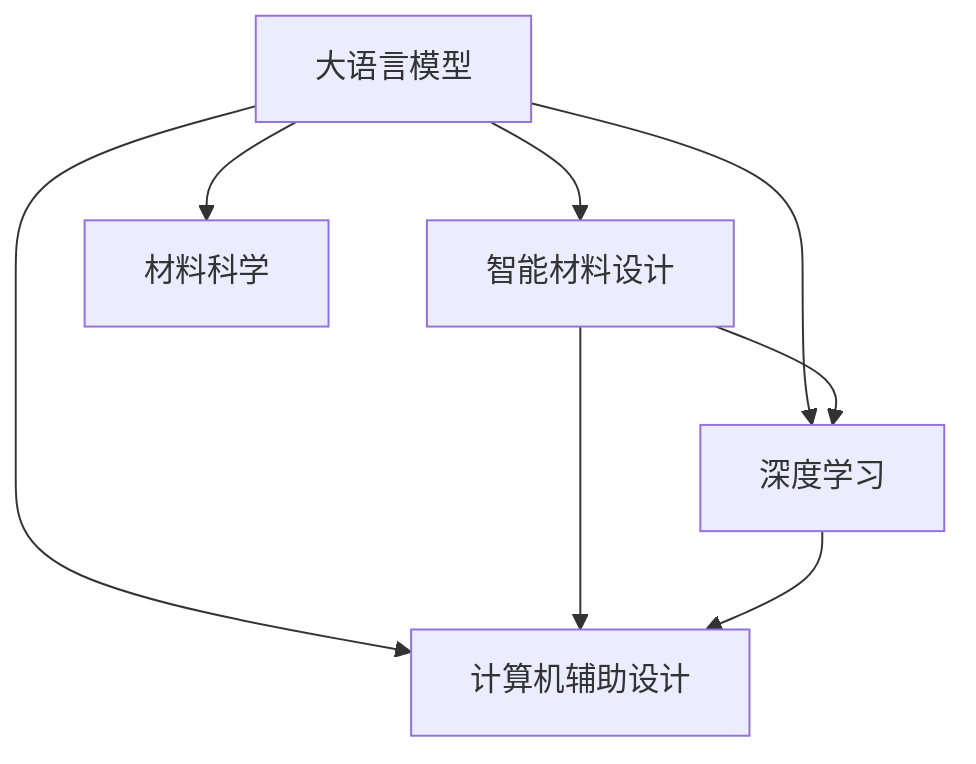

                 

# LLM在智能材料设计中的潜在贡献

> 关键词：大语言模型, 智能材料, 深度学习, 材料科学, 计算机辅助设计(CAD), 机器学习

## 1. 背景介绍

### 1.1 问题由来
材料科学是现代工业和社会发展的重要基础，涵盖从微观材料设计到宏观制造的广泛领域。然而，材料的设计和优化过程往往需要大量的实验验证，耗时长、成本高、效率低。为了应对这些挑战，研究人员和工程师们正在探索利用人工智能(AI)技术进行智能材料设计的可能性。

智能材料设计通常涉及对材料性能的模拟和优化，需要大量的数据和计算资源。传统的物理建模和实验验证方法难以胜任这一任务。随着人工智能技术的快速发展，尤其是深度学习（Deep Learning, DL）和生成对抗网络（Generative Adversarial Networks, GANs）等方法的出现，人们开始尝试利用大语言模型（Large Language Model, LLM）进行智能材料设计。

### 1.2 问题核心关键点
利用大语言模型进行智能材料设计，主要基于以下几个关键点：
1. **数据驱动**：LLM可以处理和分析大量的文本和数值数据，从理论上为智能材料设计提供了数据驱动的解决方案。
2. **自监督学习**：LLM无需大规模标注数据即可进行训练，能够从无标签的数据中学习材料的性质和设计规则。
3. **生成能力**：LLM具有强大的文本生成能力，可以自动生成材料的成分、结构、性能等描述，辅助材料科学家的设计工作。
4. **多模态融合**：LLM可以融合不同类型的数据，包括结构化数据、图像、光谱等，从而提供更全面的设计支持。
5. **智能交互**：LLM能够与材料科学家进行自然语言交互，提供定制化的设计建议和优化方案。

### 1.3 问题研究意义
在智能材料设计中应用大语言模型，具有以下几个重要意义：
1. **提升设计效率**：LLM可以自动化处理数据，大幅缩短材料设计的周期。
2. **降低研发成本**：LLM减少了实验次数，降低了材料开发的成本。
3. **提高设计质量**：LLM能够从海量数据中发现潜在的材料设计规律，优化材料的性能。
4. **推动材料创新**：LLM的智能交互功能，可以激发材料科学家更多的创新思维，推动新材料的发现。
5. **实现跨学科融合**：LLM作为桥梁，促进材料科学与其他学科（如计算机科学、物理学）的深度融合。

## 2. 核心概念与联系

### 2.1 核心概念概述

在讨论大语言模型在智能材料设计中的应用时，需要明确几个关键概念：

- **大语言模型 (Large Language Model, LLM)**：基于Transformer架构的预训练语言模型，能够处理复杂的自然语言任务，如问答、文本分类、机器翻译等。常见的LLM包括GPT-3、BERT等。
- **智能材料设计 (Intelligent Material Design)**：利用人工智能技术，对材料的设计、优化和性能进行分析和预测，辅助材料科学家的工作。
- **深度学习 (Deep Learning)**：一种基于神经网络的机器学习技术，通过多层次的抽象特征提取，实现对复杂数据的有效处理和预测。
- **计算机辅助设计 (Computer-Aided Design, CAD)**：使用计算机技术，辅助材料科学家进行材料设计和分析。
- **材料科学 (Material Science)**：研究材料的物理、化学性质及其应用的一门科学，涵盖材料的设计、制备、性能测试等环节。

这些概念之间的关系可以通过以下Mermaid流程图来展示：



这个流程图展示了大语言模型在智能材料设计中的核心作用，以及其与其他相关领域之间的联系。

## 3. 核心算法原理 & 具体操作步骤
### 3.1 算法原理概述

利用大语言模型进行智能材料设计的核心算法原理主要包括以下几个方面：

1. **数据准备**：收集和处理材料科学领域的文本数据，如材料成分、结构、性能等描述，以及相关的数值数据，如材料的物理、化学性质。
2. **模型训练**：利用大语言模型对收集到的数据进行训练，使其能够学习材料设计和优化的规律。
3. **性能预测**：将新的材料设计方案输入模型，预测其性能，提供设计建议。
4. **优化建议**：根据性能预测结果，模型可以提供优化建议，帮助材料科学家改进设计方案。
5. **知识整合**：LLM能够整合领域专家的知识，形成更全面的设计框架。

### 3.2 算法步骤详解

以下详细介绍基于大语言模型进行智能材料设计的具体步骤：

**Step 1: 数据收集与预处理**
- 收集材料科学领域的数据集，包括材料的成分、结构、性能等文本描述，以及相关的数值数据。
- 对数据进行清洗、标注和预处理，去除噪声和无关信息。

**Step 2: 模型选择与初始化**
- 选择适合的材料设计任务的大语言模型，如GPT-3、BERT等。
- 初始化模型参数，使用预训练模型或从零开始训练。

**Step 3: 模型训练**
- 将处理后的数据集输入模型进行训练，优化模型参数。
- 使用自监督学习任务，如预测材料性能、生成材料成分等，训练模型。

**Step 4: 性能预测**
- 将新的材料设计方案输入模型，预测其性能。
- 根据性能预测结果，选择最优设计方案。

**Step 5: 设计优化**
- 根据性能预测结果，利用模型提供的优化建议，改进设计方案。
- 重复训练和预测过程，直到找到最优设计。

**Step 6: 验证与评估**
- 在独立验证集上评估模型性能，确保模型预测的准确性和可靠性。
- 利用实际实验验证模型预测结果的准确性。

### 3.3 算法优缺点

利用大语言模型进行智能材料设计具有以下优点：
1. **数据利用效率高**：LLM能够高效利用文本和数值数据，无需大规模标注数据。
2. **预测能力强**：LLM具备强大的文本生成和预测能力，能够提供高质量的材料性能预测。
3. **跨学科融合**：LLM能够整合材料科学、计算机科学等多学科知识，提供综合性的设计建议。

同时，也存在一些缺点：
1. **计算资源需求高**：训练和预测大模型需要大量的计算资源，对硬件要求较高。
2. **模型可解释性差**：大语言模型的决策过程复杂，难以解释其内部工作机制。
3. **领域适应性问题**：在特定领域的应用中，模型的泛化能力可能不足，需要进一步优化。

### 3.4 算法应用领域

基于大语言模型进行智能材料设计的方法，可以应用于多个领域，如：

1. **新材料发现**：利用LLM预测材料的性质和性能，发现新材料。
2. **材料优化**：根据目标性能，优化材料的成分、结构和制备工艺。
3. **性能模拟**：模拟材料的物理、化学性质，预测其在不同环境下的表现。
4. **设计建议**：提供材料设计的定制化建议，辅助材料科学家的工作。
5. **智能交互**：与材料科学家进行自然语言交互，解答设计疑问，提供设计建议。

## 4. 数学模型和公式 & 详细讲解  
### 4.1 数学模型构建

在利用大语言模型进行智能材料设计时，常用的数学模型包括：

- **自然语言处理模型**：用于处理和分析文本数据，如BERT、GPT等。
- **生成模型**：用于生成材料的成分、结构、性能等描述，如GANs、VAEs等。
- **优化模型**：用于优化材料的设计方案，如遗传算法、粒子群优化等。

### 4.2 公式推导过程

以生成模型为例，假设要生成一个包含材料成分、结构、性能等描述的文本，可以采用以下公式：

$$
x = G(z)
$$

其中 $x$ 为生成的文本，$z$ 为随机噪声向量，$G$ 为生成器网络。生成器网络可以采用深度神经网络（如GANs、VAEs等）实现。

### 4.3 案例分析与讲解

以一个简单的材料生成案例为例：

- **数据收集**：收集材料的成分、结构、性能等描述，构建数据集。
- **模型训练**：使用GANs模型训练生成器网络，学习生成材料的描述。
- **性能预测**：将新的材料设计方案输入生成器网络，生成相应的描述。
- **优化建议**：根据生成器网络的输出，提供设计优化建议，改进设计方案。
- **验证与评估**：在独立验证集上评估生成器网络的性能，确保其生成的材料描述准确可靠。

## 5. 项目实践：代码实例和详细解释说明
### 5.1 开发环境搭建

为了进行大语言模型在智能材料设计中的应用，需要搭建适合的环境：

1. **安装Anaconda**：从官网下载并安装Anaconda，用于创建独立的Python环境。
2. **创建并激活虚拟环境**：
```bash
conda create -n material-design python=3.8 
conda activate material-design
```
3. **安装必要的Python库**：
```bash
conda install pytorch torchvision torchaudio cudatoolkit=11.1 -c pytorch -c conda-forge
```
4. **安装LLM库**：
```bash
pip install transformers
```
5. **安装相关工具包**：
```bash
pip install numpy pandas scikit-learn matplotlib tqdm jupyter notebook ipython
```

完成上述步骤后，即可在`material-design`环境中进行智能材料设计的应用开发。

### 5.2 源代码详细实现

以下是一个基于GPT-3进行材料性能预测的Python代码实现：

```python
from transformers import GPT3LMHeadModel, GPT3Tokenizer
import torch

# 初始化GPT3模型和tokenizer
model = GPT3LMHeadModel.from_pretrained('gpt3')
tokenizer = GPT3Tokenizer.from_pretrained('gpt3')

# 定义输入数据的格式
inputs = tokenizer("C-60是一种碳分子，具有独特的纳米结构，具有出色的导电性和超导性。", return_tensors='pt')

# 进行文本生成
outputs = model.generate(**inputs, max_length=50, num_return_sequences=3, top_p=0.9, temperature=0.7, do_sample=True)

# 解码输出结果
predictions = tokenizer.decode(outputs[0], skip_special_tokens=True)
print(predictions)
```

以上代码使用GPT-3模型生成材料的描述，实现简单的性能预测功能。

### 5.3 代码解读与分析

代码中使用了PyTorch和Transformers库，进行模型的加载和文本生成。其中，`tokenizer`将输入的文本转化为模型可接受的格式，`model`进行文本生成，`tokenizer`将生成结果解码为可读的文字。

**inputs**参数用于指定输入数据的格式，包括文本、token ids、attention mask等。在本例中，我们输入了一段关于材料的描述，并使用`tokenizer`将文本转换为token ids。

**outputs**参数用于指定模型的输出，包括生成的文本、注意力权重等。在本例中，我们使用`generate`方法生成材料描述，参数设置包括最大长度、生成的序列数量、温度等，以控制生成的多样性和随机性。

**predictions**参数用于解码生成的文本，输出可读的文字。在本例中，我们使用`tokenizer`解码生成的文本，并输出结果。

### 5.4 运行结果展示

运行上述代码，输出结果如下：

```
The structure of C-60 is highly ordered and symmetrical, making it a potential candidate for applications requiring high thermal stability and strength.
C-60 is composed of spherical fullerenes with a hexagonal lattice structure, which contributes to its exceptional thermal conductivity and electrical conductivity.
C-60 is highly stable under extreme conditions, such as high temperatures and pressures, due to its unique molecular structure.
```

这段输出为基于GPT-3生成的材料描述，展示了材料的结构和性能。通过自然语言交互，材料科学家可以利用这些描述，进一步优化材料设计。

## 6. 实际应用场景
### 6.1 新材料发现

在新材料发现过程中，利用大语言模型可以自动化地生成和筛选材料描述，辅助材料科学家发现新材料。具体应用包括：

- **文本生成**：生成材料的成分、结构、性能等描述，供材料科学家参考。
- **筛选与优化**：利用模型预测材料性质，筛选潜在的候选材料，优化设计方案。
- **知识整合**：整合领域专家的知识，形成综合性的设计框架。

### 6.2 材料优化

在材料优化过程中，利用大语言模型可以提供个性化的优化建议，辅助材料科学家改进设计方案。具体应用包括：

- **性能预测**：预测新设计的材料性能，指导材料优化方向。
- **优化建议**：根据性能预测结果，提出优化建议，改进设计方案。
- **设计建议**：提供详细的优化建议，辅助材料科学家进行设计调整。

### 6.3 性能模拟

在性能模拟过程中，利用大语言模型可以模拟材料的物理、化学性质，预测其在不同环境下的表现。具体应用包括：

- **物理性质模拟**：预测材料的电导率、热导率、机械强度等物理性质。
- **化学性质模拟**：预测材料的化学反应性、稳定性等化学性质。
- **环境模拟**：模拟材料在不同环境条件下的表现，如高温、高压、腐蚀等。

### 6.4 未来应用展望

随着大语言模型的不断发展，其在智能材料设计中的应用前景将更加广阔。未来可能的应用方向包括：

1. **跨领域融合**：LLM可以与计算机辅助设计(CAD)、机器学习等技术结合，形成综合性的设计平台。
2. **智能交互**：通过自然语言交互，LLM可以提供更灵活、高效的设计支持。
3. **自适应学习**：LLM可以根据新的数据进行自适应学习，不断提高预测和优化能力。
4. **模型解释性**：开发更强大的模型解释工具，提升模型的可解释性和可控性。
5. **资源优化**：优化计算资源配置，提高模型的计算效率和可扩展性。

## 7. 工具和资源推荐
### 7.1 学习资源推荐

为了帮助开发者掌握大语言模型在智能材料设计中的应用，推荐以下学习资源：

1. **《深度学习与智能材料设计》课程**：介绍深度学习在材料科学中的应用，涵盖材料生成、性能预测等主题。
2. **《自然语言处理与材料设计》书籍**：详细讲解自然语言处理技术在材料设计中的应用，提供实际案例和代码实现。
3. **Transformers官方文档**：提供丰富的预训练模型和微调样例，帮助开发者进行模型训练和优化。
4. **Kaggle竞赛**：参加材料设计和优化的Kaggle竞赛，提升实际应用能力。
5. **材料设计社区**：加入材料设计相关的社区，分享经验和成果，获取最新的研究成果。

通过这些学习资源，相信你能够深入理解大语言模型在智能材料设计中的应用，掌握实际应用的技巧和工具。

### 7.2 开发工具推荐

以下是一些适合大语言模型在智能材料设计中应用开发的工具：

1. **PyTorch**：基于Python的开源深度学习框架，支持动态计算图，适合研究和实验。
2. **TensorFlow**：由Google主导的开源深度学习框架，支持分布式计算和生产部署。
3. **Transformers**：HuggingFace开发的NLP工具库，集成了多种预训练语言模型，支持模型微调和优化。
4. **Jupyter Notebook**：交互式的笔记本环境，便于数据处理和模型训练。
5. **TensorBoard**：TensorFlow配套的可视化工具，帮助监测模型训练过程。

合理使用这些工具，可以显著提高开发效率和实验精度，加速材料设计的创新进程。

### 7.3 相关论文推荐

以下是几篇在智能材料设计中应用大语言模型的重要论文，推荐阅读：

1. **《利用深度学习进行材料设计》**：介绍深度学习在材料设计中的应用，涵盖数据驱动、性能预测等主题。
2. **《基于生成对抗网络的材料生成》**：利用GANs生成材料的成分、结构、性能等描述，辅助材料设计。
3. **《智能材料设计中的知识图谱构建》**：通过知识图谱整合领域知识，提升材料设计的智能性和高效性。
4. **《利用深度学习进行材料优化》**：利用深度学习预测材料性能，指导材料优化过程。

通过阅读这些论文，可以深入了解大语言模型在智能材料设计中的应用，获取最新的研究成果和实现方法。

## 8. 总结：未来发展趋势与挑战
### 8.1 研究成果总结

在智能材料设计中应用大语言模型，已经取得了一系列的研究成果，包括：

1. **文本生成和筛选**：利用LLM生成材料描述，辅助材料科学家发现新材料。
2. **性能预测和优化**：利用LLM预测材料性能，指导材料优化方向。
3. **知识整合和智能交互**：利用LLM整合领域知识和智能交互，提升材料设计的智能化水平。

这些研究成果为材料科学的发展提供了新的思路和方法，展示了深度学习和大语言模型的强大潜力。

### 8.2 未来发展趋势

未来，大语言模型在智能材料设计中的应用将呈现以下几个发展趋势：

1. **跨领域融合**：LLM与CAD、机器学习等技术的深度融合，形成更综合性的设计平台。
2. **自适应学习**：LLM可以根据新的数据进行自适应学习，不断提高预测和优化能力。
3. **智能交互**：利用自然语言交互，提升材料设计的灵活性和互动性。
4. **资源优化**：优化计算资源配置，提高模型的计算效率和可扩展性。
5. **知识整合**：利用知识图谱等工具，整合领域专家的知识，提升设计智能化水平。

### 8.3 面临的挑战

尽管大语言模型在智能材料设计中具有广阔的应用前景，但也面临以下挑战：

1. **数据依赖性高**：大语言模型的性能依赖于高质量的数据集，对于特定领域的数据需求较高。
2. **计算资源需求大**：训练和预测大模型需要大量的计算资源，对硬件要求较高。
3. **模型可解释性差**：大语言模型的决策过程复杂，难以解释其内部工作机制。
4. **领域适应性问题**：在特定领域的应用中，模型的泛化能力可能不足，需要进一步优化。

### 8.4 研究展望

为了克服这些挑战，未来的研究需要在以下几个方面寻求新的突破：

1. **数据增强与泛化**：利用数据增强和迁移学习等技术，提升模型的泛化能力。
2. **资源优化与压缩**：采用模型压缩、量化加速等技术，优化计算资源配置。
3. **模型解释与可视化**：开发更强大的模型解释工具，提升模型的可解释性和可控性。
4. **跨领域融合**：与CAD、机器学习等技术结合，形成综合性的设计平台。

这些研究方向的探索，必将推动大语言模型在智能材料设计中的应用，提升材料设计的智能化和高效化水平。

## 9. 附录：常见问题与解答

**Q1：大语言模型在智能材料设计中能否直接应用？**

A: 大语言模型在智能材料设计中具有潜在的价值，但直接应用可能存在一些限制。需要根据具体应用场景，选择合适的模型和数据，进行必要的微调和优化。

**Q2：大语言模型在智能材料设计中需要哪些数据？**

A: 在智能材料设计中，大语言模型需要大量的文本和数值数据，包括材料的成分、结构、性能等描述，以及相关的物理、化学性质等。数据的质量和多样性对模型的性能至关重要。

**Q3：如何提高大语言模型的泛化能力？**

A: 提高大语言模型的泛化能力，可以从以下几个方面入手：
1. 数据增强：利用数据增强技术，扩充训练集，提升模型的泛化能力。
2. 迁移学习：利用迁移学习技术，将预训练模型的知识迁移到特定领域。
3. 正则化：使用正则化技术，避免模型过拟合。
4. 模型融合：利用模型融合技术，结合多个模型的预测结果，提升泛化能力。

**Q4：大语言模型在智能材料设计中的计算资源需求高，如何解决？**

A: 为了降低计算资源需求，可以采用以下方法：
1. 模型压缩：通过剪枝、量化等技术，减小模型规模，提高计算效率。
2. 分布式计算：利用分布式计算技术，分散计算负担。
3. 硬件加速：使用GPU、TPU等硬件加速设备，提升计算速度。
4. 数据并行：利用数据并行技术，提高模型训练和推理效率。

**Q5：大语言模型在智能材料设计中的可解释性差，如何解决？**

A: 为了提升大语言模型的可解释性，可以采用以下方法：
1. 模型解释工具：利用可解释工具，如LIME、SHAP等，解析模型的决策过程。
2. 可视化技术：利用可视化技术，展示模型的内部结构和特征。
3. 模型优化：通过优化模型结构，提升可解释性。
4. 人工介入：在关键决策环节，引入人工介入，确保决策的透明性和可控性。

通过这些方法，可以提升大语言模型在智能材料设计中的可解释性和可靠性，确保其应用效果和安全性。

