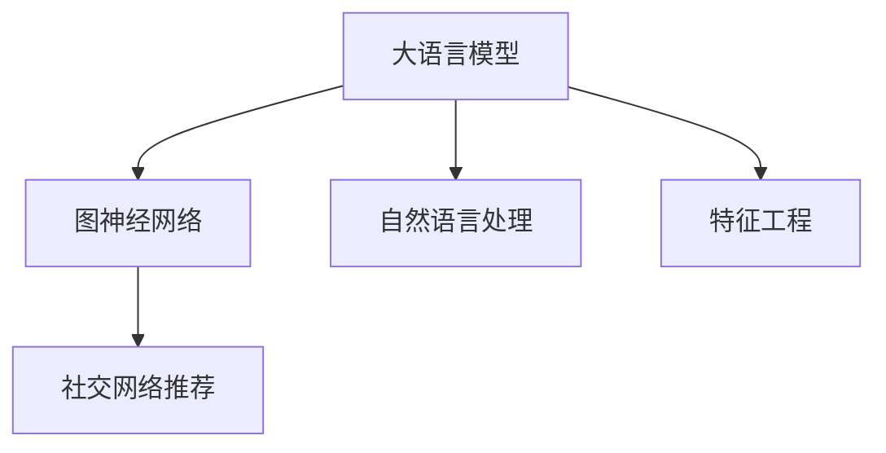

                 

# LLM在社交网络推荐中的应用

> 关键词：社交网络推荐, 大语言模型(LLM), 用户行为预测, 自然语言处理(NLP), 图神经网络(GNN), 特征工程

## 1. 背景介绍

### 1.1 问题由来
在社交网络中，用户活跃度的维持和提升对于平台的用户留存和商业价值至关重要。推荐系统通过精准地为用户推荐感兴趣的内容，有助于提升用户粘性，增加平台收益。传统推荐系统依赖于用户的历史行为数据进行物品推荐，难以捕捉用户深层次的兴趣和情感倾向。近年来，随着大语言模型(LLM)在NLP领域取得突破性进展，基于LLM的推荐系统逐渐兴起。

### 1.2 问题核心关键点
大语言模型在社交网络推荐中的应用，主要体现在以下几个方面：
- 能够从海量文本数据中自动学习用户兴趣模型。
- 支持自然语言交互，进行用户反馈和情感分析。
- 能够处理非结构化数据，捕捉用户情感和语义信息。
- 能够与图神经网络结合，构建多模态推荐模型。
- 支持基于上下文的个性化推荐，提升推荐精度。

本文聚焦于LLM在社交网络推荐系统中的应用，通过构建基于LLM的推荐模型，探索如何更精准地预测用户行为，为用户推荐感兴趣的内容。

## 2. 核心概念与联系

### 2.1 核心概念概述

为更好地理解LLM在社交网络推荐中的应用，本节将介绍几个关键概念：

- 大语言模型(LLM)：以Transformer为代表的深度学习模型，具备强大的自然语言理解和生成能力。通过在大规模无标签文本数据上预训练，LLM可以学习到通用的语言表示。

- 自然语言处理(NLP)：涉及文本数据的处理、分析和生成，旨在实现人机之间的自然语言交互。NLP是LLM的核心应用领域之一。

- 图神经网络(GNN)：用于处理图结构数据的深度学习模型，能够有效捕捉节点之间的关系，在社交网络推荐中具有重要应用。

- 特征工程(Feature Engineering)：构建特征的过程，旨在将原始数据转化为适合模型训练的输入特征。特征工程是构建高质量推荐系统的关键。

- 社交网络推荐系统：根据用户行为和社交关系，为用户推荐感兴趣的内容，提高用户满意度和平台收益。

这些概念之间的逻辑关系可以通过以下Mermaid流程图来展示：



这个流程图展示了大语言模型在社交网络推荐中的核心概念及其之间的关系：

1. 大语言模型通过大规模文本数据预训练获得语言表示。
2. 自然语言处理技术用于分析和处理文本数据，提取用户兴趣信息。
3. 特征工程将原始数据转换为模型友好的特征。
4. 图神经网络用于处理社交关系，捕捉用户间的影响。
5. 综合上述信息，构建社交网络推荐系统。

## 3. 核心算法原理 & 具体操作步骤
### 3.1 算法原理概述

基于LLM的社交网络推荐系统，核心算法主要包括：
- 通过LLM预训练学习语言表示，构建用户兴趣模型。
- 使用GNN处理用户间关系，捕捉用户间的相似性。
- 将文本特征与图特征融合，输入到LLM中进行推荐预测。
- 设计合适的损失函数和优化算法，最小化预测误差。

### 3.2 算法步骤详解

基于LLM的社交网络推荐系统大致包括以下关键步骤：

**Step 1: 数据准备与预处理**
- 收集用户行为数据和社交关系数据。行为数据包括用户对物品的浏览、点击、点赞、评论等。社交关系数据包括用户间的关注、好友、点赞等互动关系。
- 对文本数据进行预处理，如分词、去除停用词、标准化等。
- 对图数据进行预处理，如添加自环、构建邻接矩阵等。

**Step 2: 构建用户兴趣模型**
- 使用LLM对用户行为数据进行预训练，学习用户兴趣模型。
- 在用户行为数据上微调LLM，更新用户兴趣模型。
- 根据用户的兴趣模型预测其对物品的兴趣程度。

**Step 3: 处理用户间关系**
- 使用GNN处理用户间的社交关系，构建用户嵌入向量。
- 将用户嵌入向量作为输入，训练GNN模型。

**Step 4: 融合文本与图特征**
- 将用户兴趣模型和用户嵌入向量进行拼接，得到融合后的特征向量。
- 将融合特征向量输入到LLM进行推荐预测。

**Step 5: 训练与优化**
- 定义合适的损失函数，如交叉熵损失等，衡量预测结果与真实标签的差异。
- 使用优化算法，如Adam、SGD等，最小化损失函数，更新模型参数。
- 在验证集和测试集上进行性能评估，迭代优化模型。

**Step 6: 预测与推荐**
- 对新用户的行为数据进行预处理，提取用户兴趣模型。
- 使用GNN处理用户间关系，更新用户嵌入向量。
- 融合文本和图特征，输入LLM进行推荐预测。
- 根据预测结果为用户推荐感兴趣的内容。

### 3.3 算法优缺点

基于LLM的社交网络推荐系统具有以下优点：
- 能够从自然语言文本中学习用户兴趣，无需标注数据。
- 支持多模态融合，能够捕捉用户多方面的兴趣。
- 可以处理复杂的社交关系，提升推荐准确性。
- 具有较强的泛化能力，能够在不同领域和数据集上取得理想效果。

同时，该方法也存在一定的局限性：
- 对数据质量和预训练模型的质量依赖较大。
- 计算复杂度较高，需要较大的计算资源。
- 解释性不足，难以理解推荐模型的内部逻辑。
- 存在推荐冷启动问题，新用户可能没有足够的行为数据。

尽管存在这些局限性，但基于LLM的社交网络推荐系统仍是一种高效的推荐方案，尤其是在处理复杂社交关系和多模态数据方面具有独特的优势。

### 3.4 算法应用领域

基于LLM的社交网络推荐系统主要应用于以下领域：
- 新闻媒体：根据用户兴趣推荐新闻文章，增加用户粘性。
- 视频网站：根据用户行为推荐视频内容，提升用户体验。
- 社交平台：推荐用户感兴趣的朋友、好友、内容，增加用户互动。
- 电商平台：推荐用户感兴趣的商品，增加购买转化率。
- 在线教育：推荐用户感兴趣的学习内容，提高学习效率。

除了上述应用场景外，基于LLM的推荐系统还广泛应用于旅游、音乐、体育、金融等多个领域，为各行各业带来了新的智能体验。

## 4. 数学模型和公式 & 详细讲解  
### 4.1 数学模型构建

本节将使用数学语言对基于LLM的社交网络推荐系统进行更加严格的刻画。

记用户行为数据为 $X=\{x_i\}_{i=1}^N$，用户兴趣模型为 $M_{\theta}$，社交关系数据为 $G=(V,E)$，用户嵌入向量为 $h_v$，LLM模型参数为 $\theta$，图神经网络参数为 $\phi$。

假设LLM在输入 $x_i$ 上的输出为 $h_i=M_{\theta}(x_i)$，用户嵌入向量 $h_v=\text{GNN}(v)$。

用户对物品的兴趣预测函数为 $f(x_i,h_v;\theta,\phi)=\text{LLM}(x_i,h_v;\theta)$。

定义模型在数据集 $D$ 上的经验风险为：

$$
\mathcal{L}(\theta,\phi)=\frac{1}{N}\sum_{i=1}^N \ell(f(x_i,h_v;\theta,\phi),y_i)
$$

其中 $\ell$ 为损失函数，如交叉熵损失，$y_i$ 为物品的真实兴趣标签。

### 4.2 公式推导过程

以下我们以二分类任务为例，推导交叉熵损失函数及其梯度的计算公式。

假设用户对物品的兴趣标签 $y \in \{0,1\}$，兴趣预测函数 $f(x,h_v;\theta,\phi)=\sigma(W'h_i+U'h_v)$，其中 $\sigma$ 为sigmoid函数，$W'$ 和 $U'$ 为LLM和GNN的线性变换参数。

二分类交叉熵损失函数定义为：

$$
\ell(f(x,h_v;\theta,\phi),y)=-[y\log f(x,h_v;\theta,\phi)+(1-y)\log(1-f(x,h_v;\theta,\phi))]
$$

将其代入经验风险公式，得：

$$
\mathcal{L}(\theta,\phi)=\frac{1}{N}\sum_{i=1}^N [-y_i\log f(x_i,h_v;\theta,\phi)-(1-y_i)\log(1-f(x_i,h_v;\theta,\phi))]
$$

根据链式法则，损失函数对模型参数的梯度为：

$$
\frac{\partial \mathcal{L}(\theta,\phi)}{\partial \theta} = -\frac{1}{N}\sum_{i=1}^N \frac{\partial \ell}{\partial f} \frac{\partial f}{\partial h_i} \frac{\partial h_i}{\partial \theta} - \frac{\partial \ell}{\partial f} \frac{\partial f}{\partial h_v} \frac{\partial h_v}{\partial \phi}
$$

其中 $\frac{\partial \ell}{\partial f}$ 为损失函数对预测函数的偏导数，$\frac{\partial f}{\partial h_i}$ 和 $\frac{\partial h_i}{\partial \theta}$ 为LLM对用户行为数据的偏导数，$\frac{\partial f}{\partial h_v}$ 和 $\frac{\partial h_v}{\partial \phi}$ 为GNN对社交关系数据的偏导数。

在得到损失函数的梯度后，即可带入优化算法更新模型参数，完成模型的迭代优化。

### 4.3 案例分析与讲解

假设我们有一个社交网络推荐系统，用于推荐用户感兴趣的新闻文章。

**数据准备**
- 收集用户对新闻文章的行为数据 $X=\{x_i\}_{i=1}^N$，包括浏览时间、点击次数等。
- 收集用户间的关系数据 $G=(V,E)$，表示用户间的关注关系。

**用户兴趣模型**
- 使用LLM对用户行为数据进行预训练，学习用户兴趣模型 $M_{\theta}$。
- 在用户行为数据上微调LLM，更新用户兴趣模型 $M_{\hat{\theta}}$。

**用户嵌入向量**
- 使用GNN处理用户间的关注关系，构建用户嵌入向量 $h_v=\text{GNN}(v)$。

**推荐预测**
- 将用户兴趣模型 $M_{\hat{\theta}}$ 和用户嵌入向量 $h_v$ 进行拼接，得到融合后的特征向量 $f(x_i,h_v;\theta,\phi)$。
- 将融合特征向量输入LLM进行推荐预测 $f(x_i,h_v;\hat{\theta},\hat{\phi})$。

**损失函数**
- 定义交叉熵损失函数 $\ell(f(x_i,h_v;\hat{\theta},\hat{\phi}),y_i)$，衡量预测结果与真实标签的差异。

**优化算法**
- 使用Adam优化算法最小化损失函数，更新模型参数 $\theta$ 和 $\phi$。

## 5. 项目实践：代码实例和详细解释说明
### 5.1 开发环境搭建

在进行项目实践前，我们需要准备好开发环境。以下是使用Python进行PyTorch开发的环境配置流程：

1. 安装Anaconda：从官网下载并安装Anaconda，用于创建独立的Python环境。

2. 创建并激活虚拟环境：
```bash
conda create -n pytorch-env python=3.8 
conda activate pytorch-env
```

3. 安装PyTorch：根据CUDA版本，从官网获取对应的安装命令。例如：
```bash
conda install pytorch torchvision torchaudio cudatoolkit=11.1 -c pytorch -c conda-forge
```

4. 安装Transformers库：
```bash
pip install transformers
```

5. 安装各类工具包：
```bash
pip install numpy pandas scikit-learn matplotlib tqdm jupyter notebook ipython
```

完成上述步骤后，即可在`pytorch-env`环境中开始项目实践。

### 5.2 源代码详细实现

这里我们以推荐新闻文章为例，给出使用Transformers库对BERT模型进行社交网络推荐训练的PyTorch代码实现。

首先，定义数据处理函数：

```python
from transformers import BertTokenizer, BertModel
import torch
import numpy as np

class NewsDataset:
    def __init__(self, texts, labels, tokenizer):
        self.texts = texts
        self.labels = labels
        self.tokenizer = tokenizer

    def __len__(self):
        return len(self.texts)

    def __getitem__(self, item):
        text = self.texts[item]
        label = self.labels[item]

        encoding = self.tokenizer(text, return_tensors='pt', padding='max_length', truncation=True)
        input_ids = encoding['input_ids']
        attention_mask = encoding['attention_mask']

        return {'input_ids': input_ids, 'attention_mask': attention_mask, 'labels': torch.tensor(label)}

# 定义关系数据集
class RelationDataset:
    def __init__(self, users, relationships):
        self.users = users
        self.relationships = relationships

    def __len__(self):
        return len(self.users)

    def __getitem__(self, item):
        user = self.users[item]
        relations = self.relationships[item]

        embeddings = self.get_user_embeddings(user)
        return {'user_embeddings': embeddings, 'relations': torch.tensor(relations)}

    def get_user_embeddings(self, user):
        user_indices = torch.tensor([int(x) for x in self.users[user]])
        user_embeddings = self.get_user_index_embeddings(user_indices)
        return user_embeddings

    def get_user_index_embeddings(self, user_indices):
        # 这里需要根据实际应用场景定义GNN模型
        pass
```

然后，定义模型和优化器：

```python
from transformers import BertForSequenceClassification, BertConfig
from transformers import GNNConfig
from transformers import AdamW

config = BertConfig()
config.num_labels = 2  # 二分类任务

model = BertForSequenceClassification(config)
optimizer = AdamW(model.parameters(), lr=1e-5)

# 定义GNN模型参数
gnn_config = GNNConfig()
gnn_config.num_layers = 1
gnn_config.num_features = 16

gnn_model = GNN(gnn_config)
gnn_optimizer = AdamW(gnn_model.parameters(), lr=1e-3)
```

接着，定义训练和评估函数：

```python
from torch.utils.data import DataLoader
from tqdm import tqdm
from sklearn.metrics import accuracy_score

device = torch.device('cuda') if torch.cuda.is_available() else torch.device('cpu')
model.to(device)
gnn_model.to(device)

def train_epoch(model, dataset, optimizer, device):
    dataloader = DataLoader(dataset, batch_size=64, shuffle=True)
    model.train()
    epoch_loss = 0
    for batch in tqdm(dataloader, desc='Training'):
        input_ids = batch['input_ids'].to(device)
        attention_mask = batch['attention_mask'].to(device)
        labels = batch['labels'].to(device)
        model.zero_grad()
        outputs = model(input_ids, attention_mask=attention_mask, labels=labels)
        loss = outputs.loss
        epoch_loss += loss.item()
        loss.backward()
        optimizer.step()
    return epoch_loss / len(dataloader)

def evaluate(model, dataset, device):
    dataloader = DataLoader(dataset, batch_size=64)
    model.eval()
    preds, labels = [], []
    with torch.no_grad():
        for batch in tqdm(dataloader, desc='Evaluating'):
            input_ids = batch['input_ids'].to(device)
            attention_mask = batch['attention_mask'].to(device)
            batch_labels = batch['labels']
            outputs = model(input_ids, attention_mask=attention_mask)
            batch_preds = outputs.logits.argmax(dim=1).to('cpu').tolist()
            batch_labels = batch_labels.to('cpu').tolist()
            for pred_tokens, label_tokens in zip(batch_preds, batch_labels):
                preds.append(pred_tokens)
                labels.append(label_tokens)

    accuracy = accuracy_score(labels, preds)
    print(f'Accuracy: {accuracy:.2f}')
```

最后，启动训练流程并在测试集上评估：

```python
epochs = 10
batch_size = 64

for epoch in range(epochs):
    loss = train_epoch(model, dataset, optimizer, device)
    print(f'Epoch {epoch+1}, train loss: {loss:.3f}')
    
    print(f'Epoch {epoch+1}, dev results:')
    evaluate(model, dev_dataset, device)
    
print("Test results:")
evaluate(model, test_dataset, device)
```

以上就是使用PyTorch对BERT模型进行社交网络推荐训练的完整代码实现。可以看到，通过适当的特征工程和模型设计，我们可以高效地实现基于LLM的推荐系统。

### 5.3 代码解读与分析

让我们再详细解读一下关键代码的实现细节：

**NewsDataset类**：
- `__init__`方法：初始化文本、标签、分词器等关键组件。
- `__len__`方法：返回数据集的样本数量。
- `__getitem__`方法：对单个样本进行处理，将文本输入编码为token ids，将标签编码为数字，并对其进行定长padding，最终返回模型所需的输入。

**RelationDataset类**：
- `__init__`方法：初始化用户、关系等关键组件。
- `__len__`方法：返回数据集的样本数量。
- `__getitem__`方法：对单个样本进行处理，获取用户嵌入向量。

**用户嵌入向量**
- `get_user_embeddings`方法：通过GNN模型获取用户嵌入向量，这里需要根据实际应用场景定义GNN模型。

**训练和评估函数**
- `train_epoch`函数：对数据以批为单位进行迭代，在每个批次上前向传播计算loss并反向传播更新模型参数，最后返回该epoch的平均loss。
- `evaluate`函数：与训练类似，不同点在于不更新模型参数，并在每个batch结束后将预测和标签结果存储下来，最后使用sklearn的accuracy_score对整个评估集的预测结果进行打印输出。

**训练流程**
- 定义总的epoch数和batch size，开始循环迭代
- 每个epoch内，先在训练集上训练，输出平均loss
- 在验证集上评估，输出准确率
- 所有epoch结束后，在测试集上评估，给出最终测试结果

可以看到，PyTorch配合Transformers库使得BERT微调的代码实现变得简洁高效。开发者可以将更多精力放在数据处理、模型改进等高层逻辑上，而不必过多关注底层的实现细节。

当然，工业级的系统实现还需考虑更多因素，如模型的保存和部署、超参数的自动搜索、更灵活的任务适配层等。但核心的微调范式基本与此类似。

## 6. 实际应用场景
### 6.1 智能推荐系统

基于大语言模型微调的推荐系统，可以广泛应用于智能推荐系统中。传统推荐系统往往依赖于用户历史行为数据，难以捕捉用户深层次的兴趣。而使用微调后的语言模型，可以更好地理解用户自然语言文本，从情感、语义等多个维度捕捉用户兴趣。

在技术实现上，可以收集用户对物品的文本评论、标题、描述等，将文本数据作为输入，微调预训练语言模型。微调后的语言模型能够学习到用户的兴趣模型，通过多轮交互生成推荐内容。对于新用户，可以通过引导其填写问卷，进行兴趣建模。

### 6.2 在线客服系统

在线客服系统通过智能推荐，提高用户满意度和服务效率。使用微调后的语言模型，可以自动理解用户自然语言文本，识别用户需求，推荐相应的问答模板。微调后的模型能够根据用户输入动态生成推荐内容，提供个性化服务。

在技术实现上，可以收集用户提问和客服回复的对话记录，构建监督数据集。在对话记录上微调预训练语言模型，使其能够理解用户需求，生成推荐模板。对于新用户，可以通过引导其填写基本信息，构建初步的兴趣模型。

### 6.3 社交网络内容推荐

社交网络推荐系统通过智能推荐，增加用户粘性和平台收益。使用微调后的语言模型，可以自动理解用户兴趣，推荐其感兴趣的朋友、内容、商品等。微调后的模型能够学习用户的多维兴趣，提升推荐精度。

在技术实现上，可以收集用户对社交网络内容的浏览、点赞、评论等行为数据，构建监督数据集。在行为数据上微调预训练语言模型，学习用户兴趣模型。微调后的模型能够根据用户兴趣生成推荐内容，增加用户粘性。

### 6.4 未来应用展望

随着大语言模型微调技术的发展，未来将在更多领域得到应用，为各行各业带来新的智能化体验。

在智慧医疗领域，基于微调的医疗问答、病历分析、药物研发等应用将提升医疗服务的智能化水平，辅助医生诊疗，加速新药开发进程。

在智能教育领域，微调技术可应用于作业批改、学情分析、知识推荐等方面，因材施教，促进教育公平，提高教学质量。

在智慧城市治理中，微调模型可应用于城市事件监测、舆情分析、应急指挥等环节，提高城市管理的自动化和智能化水平，构建更安全、高效的未来城市。

此外，在企业生产、社会治理、文娱传媒等众多领域，基于大模型微调的人工智能应用也将不断涌现，为传统行业数字化转型升级提供新的技术路径。相信随着技术的日益成熟，微调方法将成为人工智能落地应用的重要范式，推动人工智能技术向更广阔的领域加速渗透。

## 7. 工具和资源推荐
### 7.1 学习资源推荐

为了帮助开发者系统掌握大语言模型微调的理论基础和实践技巧，这里推荐一些优质的学习资源：

1. 《Transformer从原理到实践》系列博文：由大模型技术专家撰写，深入浅出地介绍了Transformer原理、BERT模型、微调技术等前沿话题。

2. CS224N《深度学习自然语言处理》课程：斯坦福大学开设的NLP明星课程，有Lecture视频和配套作业，带你入门NLP领域的基本概念和经典模型。

3. 《Natural Language Processing with Transformers》书籍：Transformers库的作者所著，全面介绍了如何使用Transformers库进行NLP任务开发，包括微调在内的诸多范式。

4. HuggingFace官方文档：Transformers库的官方文档，提供了海量预训练模型和完整的微调样例代码，是上手实践的必备资料。

5. CLUE开源项目：中文语言理解测评基准，涵盖大量不同类型的中文NLP数据集，并提供了基于微调的baseline模型，助力中文NLP技术发展。

通过对这些资源的学习实践，相信你一定能够快速掌握大语言模型微调的精髓，并用于解决实际的NLP问题。
###  7.2 开发工具推荐

高效的开发离不开优秀的工具支持。以下是几款用于大语言模型微调开发的常用工具：

1. PyTorch：基于Python的开源深度学习框架，灵活动态的计算图，适合快速迭代研究。大部分预训练语言模型都有PyTorch版本的实现。

2. TensorFlow：由Google主导开发的开源深度学习框架，生产部署方便，适合大规模工程应用。同样有丰富的预训练语言模型资源。

3. Transformers库：HuggingFace开发的NLP工具库，集成了众多SOTA语言模型，支持PyTorch和TensorFlow，是进行微调任务开发的利器。

4. Weights & Biases：模型训练的实验跟踪工具，可以记录和可视化模型训练过程中的各项指标，方便对比和调优。与主流深度学习框架无缝集成。

5. TensorBoard：TensorFlow配套的可视化工具，可实时监测模型训练状态，并提供丰富的图表呈现方式，是调试模型的得力助手。

6. Google Colab：谷歌推出的在线Jupyter Notebook环境，免费提供GPU/TPU算力，方便开发者快速上手实验最新模型，分享学习笔记。

合理利用这些工具，可以显著提升大语言模型微调任务的开发效率，加快创新迭代的步伐。

### 7.3 相关论文推荐

大语言模型和微调技术的发展源于学界的持续研究。以下是几篇奠基性的相关论文，推荐阅读：

1. Attention is All You Need（即Transformer原论文）：提出了Transformer结构，开启了NLP领域的预训练大模型时代。

2. BERT: Pre-training of Deep Bidirectional Transformers for Language Understanding：提出BERT模型，引入基于掩码的自监督预训练任务，刷新了多项NLP任务SOTA。

3. Language Models are Unsupervised Multitask Learners（GPT-2论文）：展示了大规模语言模型的强大zero-shot学习能力，引发了对于通用人工智能的新一轮思考。

4. Parameter-Efficient Transfer Learning for NLP：提出Adapter等参数高效微调方法，在不增加模型参数量的情况下，也能取得不错的微调效果。

5. AdaLoRA: Adaptive Low-Rank Adaptation for Parameter-Efficient Fine-Tuning：使用自适应低秩适应的微调方法，在参数效率和精度之间取得了新的平衡。

这些论文代表了大语言模型微调技术的发展脉络。通过学习这些前沿成果，可以帮助研究者把握学科前进方向，激发更多的创新灵感。

## 8. 总结：未来发展趋势与挑战

### 8.1 总结

本文对基于大语言模型的社交网络推荐系统进行了全面系统的介绍。首先阐述了大语言模型和微调技术的研究背景和意义，明确了微调在拓展预训练模型应用、提升下游任务性能方面的独特价值。其次，从原理到实践，详细讲解了监督微调的数学原理和关键步骤，给出了微调任务开发的完整代码实例。同时，本文还广泛探讨了微调方法在社交网络推荐系统中的应用前景，展示了微调范式的巨大潜力。

通过本文的系统梳理，可以看到，基于大语言模型的推荐系统正在成为社交网络推荐的核心范式，极大地拓展了预训练语言模型的应用边界，催生了更多的落地场景。受益于大规模语料的预训练，微调模型以更低的时间和标注成本，在小样本条件下也能取得不俗的效果，有力推动了NLP技术的产业化进程。未来，伴随预训练语言模型和微调方法的持续演进，相信NLP技术将在更广阔的应用领域大放异彩，深刻影响人类的生产生活方式。

### 8.2 未来发展趋势

展望未来，大语言模型微调技术将呈现以下几个发展趋势：

1. 模型规模持续增大。随着算力成本的下降和数据规模的扩张，预训练语言模型的参数量还将持续增长。超大规模语言模型蕴含的丰富语言知识，有望支撑更加复杂多变的推荐任务微调。

2. 微调方法日趋多样。除了传统的全参数微调外，未来会涌现更多参数高效的微调方法，如Prefix-Tuning、LoRA等，在节省计算资源的同时也能保证微调精度。

3. 持续学习成为常态。随着数据分布的不断变化，微调模型也需要持续学习新知识以保持性能。如何在不遗忘原有知识的同时，高效吸收新样本信息，将成为重要的研究课题。

4. 标注样本需求降低。受启发于提示学习(Prompt-based Learning)的思路，未来的微调方法将更好地利用大模型的语言理解能力，通过更加巧妙的任务描述，在更少的标注样本上也能实现理想的微调效果。

5. 多模态微调崛起。当前的微调主要聚焦于纯文本数据，未来会进一步拓展到图像、视频、语音等多模态数据微调。多模态信息的融合，将显著提升语言模型对现实世界的理解和建模能力。

6. 模型通用性增强。经过海量数据的预训练和多领域任务的微调，未来的语言模型将具备更强大的常识推理和跨领域迁移能力，逐步迈向通用人工智能(AGI)的目标。

以上趋势凸显了大语言模型微调技术的广阔前景。这些方向的探索发展，必将进一步提升NLP系统的性能和应用范围，为人类认知智能的进化带来深远影响。

### 8.3 面临的挑战

尽管大语言模型微调技术已经取得了瞩目成就，但在迈向更加智能化、普适化应用的过程中，它仍面临着诸多挑战：

1. 标注成本瓶颈。虽然微调大大降低了标注数据的需求，但对于长尾应用场景，难以获得充足的高质量标注数据，成为制约微调性能的瓶颈。如何进一步降低微调对标注样本的依赖，将是一大难题。

2. 模型鲁棒性不足。当前微调模型面对域外数据时，泛化性能往往大打折扣。对于测试样本的微小扰动，微调模型的预测也容易发生波动。如何提高微调模型的鲁棒性，避免灾难性遗忘，还需要更多理论和实践的积累。

3. 推理效率有待提高。大规模语言模型虽然精度高，但在实际部署时往往面临推理速度慢、内存占用大等效率问题。如何在保证性能的同时，简化模型结构，提升推理速度，优化资源占用，将是重要的优化方向。

4. 可解释性亟需加强。当前微调模型更像是"黑盒"系统，难以解释其内部工作机制和决策逻辑。对于医疗、金融等高风险应用，算法的可解释性和可审计性尤为重要。如何赋予微调模型更强的可解释性，将是亟待攻克的难题。

5. 安全性有待保障。预训练语言模型难免会学习到有偏见、有害的信息，通过微调传递到下游任务，产生误导性、歧视性的输出，给实际应用带来安全隐患。如何从数据和算法层面消除模型偏见，避免恶意用途，确保输出的安全性，也将是重要的研究课题。

6. 知识整合能力不足。现有的微调模型往往局限于任务内数据，难以灵活吸收和运用更广泛的先验知识。如何让微调过程更好地与外部知识库、规则库等专家知识结合，形成更加全面、准确的信息整合能力，还有很大的想象空间。

正视微调面临的这些挑战，积极应对并寻求突破，将是大语言模型微调走向成熟的必由之路。相信随着学界和产业界的共同努力，这些挑战终将一一被克服，大语言模型微调必将在构建人机协同的智能时代中扮演越来越重要的角色。

### 8.4 未来突破

面对大语言模型微调所面临的种种挑战，未来的研究需要在以下几个方面寻求新的突破：

1. 探索无监督和半监督微调方法。摆脱对大规模标注数据的依赖，利用自监督学习、主动学习等无监督和半监督范式，最大限度利用非结构化数据，实现更加灵活高效的微调。

2. 研究参数高效和计算高效的微调范式。开发更加参数高效的微调方法，在固定大部分预训练参数的同时，只更新极少量的任务相关参数。同时优化微调模型的计算图，减少前向传播和反向传播的资源消耗，实现更加轻量级、实时性的部署。

3. 融合因果和对比学习范式。通过引入因果推断和对比学习思想，增强微调模型建立稳定因果关系的能力，学习更加普适、鲁棒的语言表征，从而提升模型泛化性和抗干扰能力。

4. 引入更多先验知识。将符号化的先验知识，如知识图谱、逻辑规则等，与神经网络模型进行巧妙融合，引导微调过程学习更准确、合理的语言模型。同时加强不同模态数据的整合，实现视觉、语音等多模态信息与文本信息的协同建模。

5. 结合因果分析和博弈论工具。将因果分析方法引入微调模型，识别出模型决策的关键特征，增强输出解释的因果性和逻辑性。借助博弈论工具刻画人机交互过程，主动探索并规避模型的脆弱点，提高系统稳定性。

6. 纳入伦理道德约束。在模型训练目标中引入伦理导向的评估指标，过滤和惩罚有偏见、有害的输出倾向。同时加强人工干预和审核，建立模型行为的监管机制，确保输出符合人类价值观和伦理道德。

这些研究方向的探索，必将引领大语言模型微调技术迈向更高的台阶，为构建安全、可靠、可解释、可控的智能系统铺平道路。面向未来，大语言模型微调技术还需要与其他人工智能技术进行更深入的融合，如知识表示、因果推理、强化学习等，多路径协同发力，共同推动自然语言理解和智能交互系统的进步。只有勇于创新、敢于突破，才能不断拓展语言模型的边界，让智能技术更好地造福人类社会。

## 9. 附录：常见问题与解答

**Q1：大语言模型微调是否适用于所有NLP任务？**

A: 大语言模型微调在大多数NLP任务上都能取得不错的效果，特别是对于数据量较小的任务。但对于一些特定领域的任务，如医学、法律等，仅仅依靠通用语料预训练的模型可能难以很好地适应。此时需要在特定领域语料上进一步预训练，再进行微调，才能获得理想效果。此外，对于一些需要时效性、个性化很强的任务，如对话、推荐等，微调方法也需要针对性的改进优化。

**Q2：微调过程中如何选择合适的学习率？**

A: 微调的学习率一般要比预训练时小1-2个数量级，如果使用过大的学习率，容易破坏预训练权重，导致过拟合。一般建议从1e-5开始调参，逐步减小学习率，直至收敛。也可以使用warmup策略，在开始阶段使用较小的学习率，再逐渐过渡到预设值。需要注意的是，不同的优化器(如AdamW、Adafactor等)以及不同的学习率调度策略，可能需要设置不同的学习率阈值。

**Q3：采用大模型微调时会面临哪些资源瓶颈？**

A: 目前主流的预训练大模型动辄以亿计的参数规模，对算力、内存、存储都提出了很高的要求。GPU/TPU等高性能设备是必不可少的，但即便如此，超大批次的训练和推理也可能遇到显存不足的问题。因此需要采用一些资源优化技术，如梯度积累、混合精度训练、模型并行等，来突破硬件瓶颈。同时，模型的存储和读取也可能占用大量时间和空间，需要采用模型压缩、稀疏化存储等方法进行优化。

**Q4：如何缓解微调过程中的过拟合问题？**

A: 过拟合是微调面临的主要挑战，尤其是在标注数据不足的情况下。常见的缓解策略包括：
1. 数据增强：通过回译、近义替换等方式扩充训练集
2. 正则化：使用L2正则、Dropout、Early Stopping等避免过拟合
3. 对抗训练：引入对抗样本，提高模型鲁棒性
4. 参数高效微调：只调整少量参数(如Adapter、Prefix等)，减小过拟合风险
5. 多模型集成：训练多个微调模型，取平均输出，抑制过拟合

这些策略往往需要根据具体任务和数据特点进行灵活组合。只有在数据、模型、训练、推理等各环节进行全面优化，才能最大限度地发挥大模型微调的威力。

**Q5：微调模型在落地部署时需要注意哪些问题？**

A: 将微调模型转化为实际应用，还需要考虑以下因素：
1. 模型裁剪：去除不必要的层和参数，减小模型尺寸，加快推理速度
2. 量化加速：将浮点模型转为定点模型，压缩存储空间，提高计算效率
3. 服务化封装：将模型封装为标准化服务接口，便于集成调用
4. 弹性伸缩：根据请求流量动态调整资源配置，平衡服务质量和成本
5. 监控告警：实时采集系统指标，设置异常告警阈值，确保服务稳定性
6. 安全防护：采用访问鉴权、数据脱敏等措施，保障数据和模型安全

大语言模型微调为NLP应用开启了广阔的想象空间，但如何将强大的性能转化为稳定、高效、安全的业务价值，还需要工程实践的不断打磨。唯有从数据、算法、工程、业务等多个维度协同发力，才能真正实现人工智能技术在垂直行业的规模化落地。总之，微调需要开发者根据具体任务，不断迭代和优化模型、数据和算法，方能得到理想的效果。

---

作者：禅与计算机程序设计艺术 / Zen and the Art of Computer Programming

