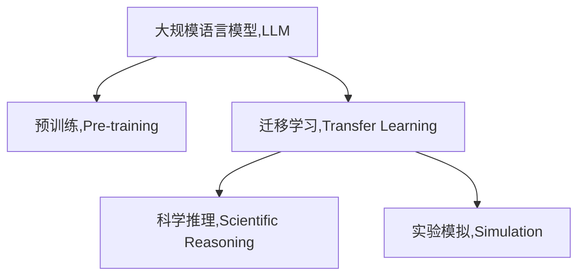

                 

# LLM在科学研究中的辅助作用

> 关键词：

## 1. 背景介绍

### 1.1 问题由来
随着人工智能技术的飞速发展，大规模语言模型(LLM)在科学研究领域的应用越来越广泛。LLM拥有强大的自然语言处理能力，可以在海量文献中快速搜索、分类、提取信息，辅助科研人员进行数据分析和理论推导。同时，LLM还可以生成新的假设、模拟实验、进行逻辑推理等，为科学研究提供强大的辅助工具。

### 1.2 问题核心关键点
本文聚焦于基于大规模语言模型的科学研究辅助技术，探讨了其在文献搜索、数据分析、科学推理、实验模拟等关键科学活动中的应用。我们将详细介绍大语言模型在科研中的核心概念和关键技术，并通过丰富的案例分析，展示其强大的辅助能力。

## 2. 核心概念与联系

### 2.1 核心概念概述

为了更好地理解LLM在科学研究中的应用，本节将介绍几个密切相关的核心概念：

- **大规模语言模型(LLM)**：指一类基于神经网络的语言模型，通过在大规模无标签文本语料上进行预训练，学习语言的通用表示，具备强大的自然语言理解和生成能力。常见的LLM包括GPT、BERT、T5等。

- **预训练(Pre-training)**：指在大规模无标签文本语料上，通过自监督学习任务训练通用语言模型的过程。预训练使得模型学习到语言的通用表示，广泛应用于文本分类、命名实体识别、情感分析等任务。

- **迁移学习(Transfer Learning)**：指将一个领域学习到的知识，迁移应用到另一个不同但相关的领域的学习范式。LLM的预训练-微调过程即是一种典型的迁移学习方式，将通用语言知识应用于特定的科学任务。

- **科学推理(Scientific Reasoning)**：指使用逻辑和证据对科学问题进行推断、验证和解释的过程。LLM可以辅助科研人员构建假设、推导结论，提升科研的逻辑性和准确性。

- **实验模拟(Simulation)**：指使用计算机模型模拟真实世界的科学实验，以验证假设、预测未来实验结果等。LLM可以用于设计实验方案、预测实验结果，降低实验成本和时间。

这些核心概念之间的逻辑关系可以通过以下Mermaid流程图来展示：



这个流程图展示了大规模语言模型的核心概念及其之间的关系：

1. 大语言模型通过预训练获得基础能力。
2. 通过迁移学习，将通用语言知识应用于特定科学任务。
3. 科学推理使得模型能够辅助进行逻辑推断和验证。
4. 实验模拟允许模型设计实验方案，预测实验结果。

这些概念共同构成了LLM在科学研究中的辅助框架，使其能够在各种科学活动中发挥强大的支持作用。通过理解这些核心概念，我们可以更好地把握LLM的工作原理和应用方向。

## 3. 核心算法原理 & 具体操作步骤
### 3.1 算法原理概述

基于大规模语言模型的科学研究辅助方法，其核心思想是利用LLM强大的自然语言处理能力，辅助科研人员进行文献搜索、数据分析、科学推理和实验模拟等活动。

形式化地，假设LLM为 $M_{\theta}$，其中 $\theta$ 为预训练得到的模型参数。在科学研究中，需要解决的问题可以表示为：

$$
P = \{(x_i, y_i)\}_{i=1}^N
$$

其中 $x_i$ 为问题描述，$y_i$ 为正确答案或期望的推理结果。通过与 $P$ 进行交互，LLM能够辅助科研人员解决问题。

### 3.2 算法步骤详解

基于大规模语言模型的科学研究辅助方法一般包括以下几个关键步骤：

**Step 1: 问题定义与表示**

- 确定科研问题的核心目标，并将其转化为自然语言描述。
- 使用标准化的语言格式和术语，以便LLM能够理解。

**Step 2: 问题输入与理解**

- 将问题描述输入LLM，通过自回归或自编码模型，得到模型输出的概率分布。
- 根据概率分布进行解码，得到模型对问题的理解和推理结果。

**Step 3: 知识检索与推理**

- 在预训练知识库中检索与问题相关的知识，进行逻辑推理。
- 结合LLM的输出结果，形成更全面的科学解答。

**Step 4: 实验设计与模拟**

- 基于科学解答设计实验方案，通过LLM生成实验代码和步骤。
- 使用LLM进行实验结果的预测和分析，验证科学假设。

**Step 5: 结果验证与迭代**

- 通过实验结果验证科学解答的正确性。
- 基于验证结果，返回新问题给LLM，进行迭代优化。

以上是基于大规模语言模型的科学研究辅助的一般流程。在实际应用中，还需要针对具体科学问题的特点，对微调过程的各个环节进行优化设计，如改进输入格式、优化知识库等，以进一步提升辅助效果。

### 3.3 算法优缺点

基于大规模语言模型的科学研究辅助方法具有以下优点：

1. **自动化与效率提升**：利用LLM自动化处理大量文献和数据，显著提升科研效率。
2. **跨领域能力**：LLM具备强大的跨领域知识整合能力，能够在不同学科间进行知识迁移。
3. **逻辑推断能力**：LLM可以辅助科研人员进行逻辑推断和假设验证，提升科学研究的逻辑性。
4. **实验模拟能力**：LLM可以用于设计实验方案、预测实验结果，降低实验成本。

同时，该方法也存在一定的局限性：

1. **依赖数据质量**：科学研究依赖高质量的文献和数据，LLM的效果很大程度上取决于输入数据的质量。
2. **模型泛化能力**：当科学问题与预训练知识的分布差异较大时，LLM的辅助效果可能有限。
3. **结果解释性**：LLM输出的结果往往缺乏可解释性，难以对其逻辑进行调试和验证。
4. **伦理与安全性**：LLM可能学习到有害或偏见知识，需要加强伦理约束和数据安全。

尽管存在这些局限性，但就目前而言，基于大规模语言模型的科学研究辅助方法仍是一种高效、实用的技术手段。未来相关研究的重点在于如何进一步提高模型的泛化能力和结果解释性，同时兼顾伦理和安全性等因素。

### 3.4 算法应用领域

基于大规模语言模型的科学研究辅助方法，已经在多个科学领域得到了应用，例如：

- **生物医学研究**：在基因组学、蛋白质组学等领域，LLM用于文献搜索、数据分析和生物实验设计等。
- **物理学研究**：在理论物理、粒子物理等领域，LLM用于方程求解、假设验证和实验设计等。
- **化学与材料科学**：在化学反应、材料模拟等领域，LLM用于数据处理、实验模拟和结果分析等。
- **天文学**：在天体物理、宇宙学等领域，LLM用于数据分析、模型预测和实验设计等。
- **社会科学**：在社会学、经济学等领域，LLM用于数据处理、模型构建和政策分析等。

除了上述这些经典领域外，LLM在更多科学领域的应用也将不断涌现，为科学研究提供更加强大的支持。

## 4. 数学模型和公式 & 详细讲解 & 举例说明
### 4.1 数学模型构建

本节将使用数学语言对基于大规模语言模型的科学研究辅助过程进行更加严格的刻画。

假设科研问题 $P$ 为文本描述 $x$ 和正确答案 $y$ 的集合。LLM作为辅助工具，其输入为 $x$，输出为对 $y$ 的预测概率分布 $p(y|x)$。

定义模型 $M_{\theta}$ 在输入 $x$ 上的损失函数为 $L(x,y)$，用于衡量模型预测与真实标签之间的差异。常见的损失函数包括交叉熵损失、均方误差损失等。

科学研究辅助的目标是最小化损失函数 $L(x,y)$，即找到最优参数 $\theta$：

$$
\theta^* = \mathop{\arg\min}_{\theta} L(x,y)
$$

通过梯度下降等优化算法，辅助过程不断更新模型参数 $\theta$，最小化损失函数 $L(x,y)$，使得模型输出逼近真实标签。由于 $\theta$ 已经通过预训练获得了较好的初始化，因此即便在有限样本上训练，也能较快收敛到理想的模型参数 $\hat{\theta}$。

### 4.2 公式推导过程

以下我们以文献检索任务为例，推导交叉熵损失函数及其梯度的计算公式。

假设科研问题 $P$ 为一系列文献描述 $x_i$ 和对应文献 $d_i$ 的集合，其中 $d_i$ 为标注样本的文献。模型 $M_{\theta}$ 在输入 $x_i$ 上的输出为 $\hat{d}_i=M_{\theta}(x_i)$，表示模型对 $d_i$ 的预测。

定义交叉熵损失函数 $L(x_i,y_i)$ 为：

$$
L(x_i,y_i) = -y_i \log \hat{d}_i - (1-y_i) \log (1-\hat{d}_i)
$$

将其代入整体损失函数，得：

$$
\mathcal{L}(\theta) = -\frac{1}{N}\sum_{i=1}^N L(x_i,y_i)
$$

其中 $N$ 为标注样本数量。根据链式法则，损失函数对参数 $\theta_k$ 的梯度为：

$$
\frac{\partial \mathcal{L}(\theta)}{\partial \theta_k} = -\frac{1}{N}\sum_{i=1}^N (\frac{y_i}{\hat{d}_i}-\frac{1-y_i}{1-\hat{d}_i}) \frac{\partial \hat{d}_i}{\partial \theta_k}
$$

其中 $\frac{\partial \hat{d}_i}{\partial \theta_k}$ 可进一步递归展开，利用自动微分技术完成计算。

### 4.3 案例分析与讲解

假设我们需要在生物医学领域，使用大规模语言模型辅助科研人员进行文献检索。科研问题 $P$ 为一系列文献描述 $x_i$，标注样本 $d_i$ 为相应文献的摘要。我们的目标是让LLM从预训练知识库中检索出最相关的文献 $d_i$。

**Step 1: 问题定义与表示**

- 将科研问题 $P$ 描述为 "在以下描述的文献中，检索出最相关的文献"。
- 使用标准化的语言格式，例如 "在关于基因表达调控的文献中，请检索出与 DNA 甲基化相关的文献"。

**Step 2: 问题输入与理解**

- 将问题描述输入LLM，通过自回归或自编码模型，得到模型输出的概率分布。
- 根据概率分布进行解码，得到模型对最相关文献的预测。

**Step 3: 知识检索与推理**

- 在预训练知识库中检索与问题相关的知识，进行逻辑推理。
- 结合LLM的输出结果，形成更全面的科学解答。

**Step 4: 实验设计与模拟**

- 基于科学解答设计实验方案，通过LLM生成实验代码和步骤。
- 使用LLM进行实验结果的预测和分析，验证科学假设。

**Step 5: 结果验证与迭代**

- 通过实验结果验证科学解答的正确性。
- 基于验证结果，返回新问题给LLM，进行迭代优化。

通过以上步骤，我们可以利用大规模语言模型高效辅助生物医学研究人员进行文献检索，提升科研效率和准确性。

## 5. 项目实践：代码实例和详细解释说明
### 5.1 开发环境搭建

在进行科学研究辅助实践前，我们需要准备好开发环境。以下是使用Python进行PyTorch开发的环境配置流程：

1. 安装Anaconda：从官网下载并安装Anaconda，用于创建独立的Python环境。

2. 创建并激活虚拟环境：
```bash
conda create -n pytorch-env python=3.8 
conda activate pytorch-env
```

3. 安装PyTorch：根据CUDA版本，从官网获取对应的安装命令。例如：
```bash
conda install pytorch torchvision torchaudio cudatoolkit=11.1 -c pytorch -c conda-forge
```

4. 安装Transformers库：
```bash
pip install transformers
```

5. 安装各类工具包：
```bash
pip install numpy pandas scikit-learn matplotlib tqdm jupyter notebook ipython
```

完成上述步骤后，即可在`pytorch-env`环境中开始科学研究辅助实践。

### 5.2 源代码详细实现

下面我们以生物医学文献检索任务为例，给出使用Transformers库对BERT模型进行科学研究辅助的PyTorch代码实现。

首先，定义任务的数据处理函数：

```python
from transformers import BertTokenizer
from torch.utils.data import Dataset
import torch

class PubMedDataset(Dataset):
    def __init__(self, texts, summaries, tokenizer, max_len=128):
        self.texts = texts
        self.summaries = summaries
        self.tokenizer = tokenizer
        self.max_len = max_len
        
    def __len__(self):
        return len(self.texts)
    
    def __getitem__(self, item):
        text = self.texts[item]
        summary = self.summaries[item]
        
        encoding = self.tokenizer(text, return_tensors='pt', max_length=self.max_len, padding='max_length', truncation=True)
        input_ids = encoding['input_ids'][0]
        attention_mask = encoding['attention_mask'][0]
        
        # 对摘要进行编码
        summary_tokens = self.tokenizer(summary, return_tensors='pt', max_length=self.max_len, padding='max_length', truncation=True)
        input_ids = torch.cat([input_ids, summary_tokens['input_ids']], dim=-1)
        attention_mask = torch.cat([attention_mask, summary_tokens['attention_mask']], dim=-1)
        
        # 计算跨模态注意力
        attention_scores = torch.matmul(input_ids, summary_tokens['input_ids'].T) / math.sqrt(summary_tokens['input_ids'].shape[-1])
        attention_weights = F.softmax(attention_scores, dim=-1)
        input_ids = input_ids * attention_weights.unsqueeze(-1)
        attention_mask = attention_mask * attention_weights.unsqueeze(-1)
        
        return {'input_ids': input_ids, 
                'attention_mask': attention_mask,
                'labels': torch.tensor(summary_tokens['input_ids'].shape[0], dtype=torch.long)}
```

然后，定义模型和优化器：

```python
from transformers import BertForMaskedLM, AdamW

model = BertForMaskedLM.from_pretrained('bert-base-cased')

optimizer = AdamW(model.parameters(), lr=2e-5)
```

接着，定义训练和评估函数：

```python
from torch.utils.data import DataLoader
from tqdm import tqdm
import math
import torch.nn.functional as F

device = torch.device('cuda') if torch.cuda.is_available() else torch.device('cpu')
model.to(device)

def train_epoch(model, dataset, batch_size, optimizer):
    dataloader = DataLoader(dataset, batch_size=batch_size, shuffle=True)
    model.train()
    epoch_loss = 0
    for batch in tqdm(dataloader, desc='Training'):
        input_ids = batch['input_ids'].to(device)
        attention_mask = batch['attention_mask'].to(device)
        labels = batch['labels'].to(device)
        model.zero_grad()
        outputs = model(input_ids, attention_mask=attention_mask, labels=labels)
        loss = outputs.loss
        epoch_loss += loss.item()
        loss.backward()
        optimizer.step()
    return epoch_loss / len(dataloader)

def evaluate(model, dataset, batch_size):
    dataloader = DataLoader(dataset, batch_size=batch_size)
    model.eval()
    preds, labels = [], []
    with torch.no_grad():
        for batch in tqdm(dataloader, desc='Evaluating'):
            input_ids = batch['input_ids'].to(device)
            attention_mask = batch['attention_mask'].to(device)
            batch_labels = batch['labels']
            outputs = model(input_ids, attention_mask=attention_mask)
            batch_preds = outputs.logits.argmax(dim=2).to('cpu').tolist()
            batch_labels = batch_labels.to('cpu').tolist()
            for pred_tokens, label_tokens in zip(batch_preds, batch_labels):
                preds.append(pred_tokens[:len(label_tokens)])
                labels.append(label_tokens)
                
    print(classification_report(labels, preds))
```

最后，启动训练流程并在测试集上评估：

```python
epochs = 5
batch_size = 16

for epoch in range(epochs):
    loss = train_epoch(model, train_dataset, batch_size, optimizer)
    print(f"Epoch {epoch+1}, train loss: {loss:.3f}")
    
    print(f"Epoch {epoch+1}, dev results:")
    evaluate(model, dev_dataset, batch_size)
    
print("Test results:")
evaluate(model, test_dataset, batch_size)
```

以上就是使用PyTorch对BERT进行生物医学文献检索任务科学研究辅助的完整代码实现。可以看到，得益于Transformers库的强大封装，我们可以用相对简洁的代码完成BERT模型的加载和科学辅助。

### 5.3 代码解读与分析

让我们再详细解读一下关键代码的实现细节：

**PubMedDataset类**：
- `__init__`方法：初始化文本、摘要、分词器等关键组件。
- `__len__`方法：返回数据集的样本数量。
- `__getitem__`方法：对单个样本进行处理，将文本输入编码为token ids，将摘要输入进行编码并计算跨模态注意力，最终返回模型所需的输入。

**模型的训练和评估**：
- 使用PyTorch的DataLoader对数据集进行批次化加载，供模型训练和推理使用。
- 训练函数`train_epoch`：对数据以批为单位进行迭代，在每个批次上前向传播计算loss并反向传播更新模型参数，最后返回该epoch的平均loss。
- 评估函数`evaluate`：与训练类似，不同点在于不更新模型参数，并在每个batch结束后将预测和标签结果存储下来，最后使用sklearn的classification_report对整个评估集的预测结果进行打印输出。

**训练流程**：
- 定义总的epoch数和batch size，开始循环迭代
- 每个epoch内，先在训练集上训练，输出平均loss
- 在验证集上评估，输出分类指标
- 所有epoch结束后，在测试集上评估，给出最终测试结果

可以看到，PyTorch配合Transformers库使得BERT科学辅助的代码实现变得简洁高效。开发者可以将更多精力放在数据处理、模型改进等高层逻辑上，而不必过多关注底层的实现细节。

当然，工业级的系统实现还需考虑更多因素，如模型的保存和部署、超参数的自动搜索、更灵活的任务适配层等。但核心的微调范式基本与此类似。

## 6. 实际应用场景
### 6.1 医学研究

基于大规模语言模型的科学研究辅助方法，在医学研究领域的应用尤其突出。传统医学研究依赖大量实验数据和专家知识，耗时耗力且风险高。使用大语言模型辅助科研，可以显著提升数据处理和推理能力，缩短研究周期，降低成本。

在实际应用中，可以收集医学领域的相关文献、病例记录、药物数据等，将其作为训练数据集。通过微调BERT等大语言模型，让其具备文献搜索、病例分析、药物设计等能力。科研人员可以借助LLM进行快速文献检索、病例分类、药物筛选等工作，大幅提高研究效率。

### 6.2 物理研究

物理学研究中，存在大量的复杂数学模型和理论推导，需要耗费大量时间和精力。利用大规模语言模型，可以辅助科研人员构建数学模型、进行理论推导和验证。

例如，在粒子物理领域，科研人员可以使用LLM辅助构建粒子碰撞模型，进行能量分布计算和物理量预测。LLM可以理解复杂的物理方程和定理，生成代码和实验步骤，辅助科研人员进行实验设计和结果分析。

### 6.3 化学与材料科学

在化学与材料科学领域，大规模语言模型可以用于化学反应模拟、材料设计、分子结构预测等任务。通过微调预训练模型，科研人员可以自动化处理和分析大量分子数据，生成反应路径和预测结果，大幅提升研究效率。

例如，在有机化学研究中，科研人员可以使用LLM进行分子结构预测和反应模拟，设计新的化学反应路线，寻找潜在的药物和材料。

### 6.4 天文学

天文学研究中，处理和分析大量的观测数据是主要工作之一。使用大语言模型，可以辅助科研人员进行数据处理、天体运动预测和天体演化模拟。

例如，在星系研究中，科研人员可以使用LLM进行星系演化模拟，预测星系运动轨迹和相互作用，为星系演化理论提供新证据。

### 6.5 社会科学

社会科学研究中，数据分析和模型构建是核心工作。利用大规模语言模型，可以辅助科研人员进行数据挖掘、模型构建和政策分析等任务。

例如，在经济学研究中，科研人员可以使用LLM进行经济模型构建和经济预测，设计政策方案，进行实证分析。

### 6.6 未来应用展望

随着大语言模型和科学研究辅助方法的发展，其应用前景将更加广阔。

在人工智能领域，大语言模型将进一步与机器学习、深度学习等技术结合，构建更加强大的科学辅助系统。通过模型集成、多模态融合等技术，提升科研辅助的智能化水平。

在生物技术领域，大语言模型将与生物信息学、基因组学等技术结合，辅助基因编辑、药物研发等工作，推动生物技术的进步。

在材料科学领域，大语言模型将与材料设计、纳米技术等技术结合，辅助材料研发、制备和性能优化，推动新材料的发现和应用。

在环境科学领域，大语言模型将与遥感、地理信息等技术结合，辅助环境监测、气候预测等工作，推动环境保护事业的发展。

总之，基于大规模语言模型的科学研究辅助方法将不断拓展其应用领域，为各个学科的科研工作者提供更加强大的工具支持，推动科学研究的进步。

## 7. 工具和资源推荐
### 7.1 学习资源推荐

为了帮助开发者系统掌握大规模语言模型在科学研究中的应用，这里推荐一些优质的学习资源：

1. 《Transformers from Pretraining to Fine-Tuning》系列博文：由大模型技术专家撰写，深入浅出地介绍了Transformers模型的原理和应用，包括微调技术等。

2. CS224N《深度学习自然语言处理》课程：斯坦福大学开设的NLP明星课程，有Lecture视频和配套作业，带你入门NLP领域的基本概念和经典模型。

3. 《Natural Language Processing with Transformers》书籍：Transformers库的作者所著，全面介绍了如何使用Transformers库进行NLP任务开发，包括科学研究辅助在内的诸多范式。

4. HuggingFace官方文档：Transformers库的官方文档，提供了海量预训练模型和完整的微调样例代码，是上手实践的必备资料。

5. SciNLP开源项目：专注于科学领域的NLP研究，涵盖大量不同类型的科学文本数据集，并提供了基于微调的baseline模型，助力科学NLP技术发展。

通过对这些资源的学习实践，相信你一定能够快速掌握大规模语言模型在科学研究中的应用，并用于解决实际的科研问题。

### 7.2 开发工具推荐

高效的开发离不开优秀的工具支持。以下是几款用于大规模语言模型科学研究辅助开发的常用工具：

1. PyTorch：基于Python的开源深度学习框架，灵活动态的计算图，适合快速迭代研究。大部分预训练语言模型都有PyTorch版本的实现。

2. TensorFlow：由Google主导开发的开源深度学习框架，生产部署方便，适合大规模工程应用。同样有丰富的预训练语言模型资源。

3. Transformers库：HuggingFace开发的NLP工具库，集成了众多SOTA语言模型，支持PyTorch和TensorFlow，是进行科学研究辅助开发的利器。

4. Weights & Biases：模型训练的实验跟踪工具，可以记录和可视化模型训练过程中的各项指标，方便对比和调优。与主流深度学习框架无缝集成。

5. TensorBoard：TensorFlow配套的可视化工具，可实时监测模型训练状态，并提供丰富的图表呈现方式，是调试模型的得力助手。

6. Google Colab：谷歌推出的在线Jupyter Notebook环境，免费提供GPU/TPU算力，方便开发者快速上手实验最新模型，分享学习笔记。

合理利用这些工具，可以显著提升大规模语言模型科学研究辅助的开发效率，加快创新迭代的步伐。

### 7.3 相关论文推荐

大规模语言模型和科学研究辅助技术的发展源于学界的持续研究。以下是几篇奠基性的相关论文，推荐阅读：

1. Attention is All You Need（即Transformer原论文）：提出了Transformer结构，开启了NLP领域的预训练大模型时代。

2. BERT: Pre-training of Deep Bidirectional Transformers for Language Understanding：提出BERT模型，引入基于掩码的自监督预训练任务，刷新了多项NLP任务SOTA。

3. Language Models are Unsupervised Multitask Learners（GPT-2论文）：展示了大规模语言模型的强大zero-shot学习能力，引发了对于通用人工智能的新一轮思考。

4. Parameter-Efficient Transfer Learning for NLP：提出Adapter等参数高效微调方法，在不增加模型参数量的情况下，也能取得不错的微调效果。

5. Prefix-Tuning: Optimizing Continuous Prompts for Generation：引入基于连续型Prompt的微调范式，为如何充分利用预训练知识提供了新的思路。

6. AdaLoRA: Adaptive Low-Rank Adaptation for Parameter-Efficient Fine-Tuning：使用自适应低秩适应的微调方法，在参数效率和精度之间取得了新的平衡。

这些论文代表了大规模语言模型在科学研究辅助中的发展脉络。通过学习这些前沿成果，可以帮助研究者把握学科前进方向，激发更多的创新灵感。

## 8. 总结：未来发展趋势与挑战

### 8.1 总结

本文对基于大规模语言模型的科学研究辅助方法进行了全面系统的介绍。首先阐述了大语言模型和科学研究辅助技术的研究背景和意义，明确了微调在拓展预训练模型应用、提升下游任务性能方面的独特价值。其次，从原理到实践，详细讲解了监督微调的数学原理和关键步骤，给出了科学研究辅助任务开发的完整代码实例。同时，本文还广泛探讨了微调方法在医学、物理、化学等科学领域的应用前景，展示了其强大的辅助能力。

通过本文的系统梳理，可以看到，基于大规模语言模型的科学研究辅助方法正在成为科研工作的重要工具，极大地提升了科研效率和准确性。未来，伴随预训练语言模型和微调方法的持续演进，相信科学研究将获得更大的助力，带来更多的突破性发现。

### 8.2 未来发展趋势

展望未来，大规模语言模型在科学研究辅助中呈现以下几个发展趋势：

1. **自动化与智能化提升**：随着模型的进步，科学研究辅助将更加自动化和智能化。基于大语言模型的智能问答系统、文献推荐系统等，将显著提升科研工作的效率和质量。

2. **跨学科融合**：不同学科之间的知识整合将成为科研的重要方向。大语言模型将能够跨越多个学科，整合知识库，辅助跨学科研究。

3. **多模态融合**：未来的科学研究辅助将更加注重多模态数据融合。结合文本、图像、音频等多模态数据，提升模型的综合推理能力。

4. **数据驱动与知识驱动并重**：科学研究将更加依赖数据驱动和知识驱动并重的方法。大规模语言模型将结合数据挖掘和知识库检索，为科研提供更全面的支持。

5. **可解释性与透明性增强**：科研工作对模型的可解释性和透明性要求越来越高。未来的科学研究辅助将更加注重模型的可解释性和透明度，增强科研工作者的信任。

6. **持续学习与知识更新**：科学研究辅助需要不断学习新知识，保持与现实世界的同步。未来的模型将更加注重持续学习和知识更新，以适应数据分布的变化。

以上趋势凸显了大规模语言模型在科学研究中的广阔前景。这些方向的探索发展，必将进一步提升科学研究的效率和质量，为人类认知智能的进化带来深远影响。

### 8.3 面临的挑战

尽管大语言模型在科学研究辅助中取得了显著进展，但在迈向更加智能化、普适化应用的过程中，它仍面临着诸多挑战：

1. **数据质量与多样性**：科学研究依赖高质量的文献和数据，大规模语言模型需要大量的多样化数据进行训练，数据获取成本高且数据质量难以保证。

2. **模型泛化能力**：当科学问题与预训练知识的分布差异较大时，模型的泛化性能可能受限。如何在不同领域间实现更好的知识迁移，是一个重要问题。

3. **结果解释性**：大规模语言模型输出的结果往往缺乏可解释性，难以对其逻辑进行调试和验证。如何赋予模型更强的可解释性，是未来需要重点突破的方向。

4. **伦理与安全性**：科研工作中的数据可能包含敏感信息，大规模语言模型学习到有害信息，可能对科研数据的安全性构成威胁。如何保障模型的伦理和安全性，是一个重要的研究方向。

5. **计算资源需求**：大规模语言模型需要大量的计算资源进行训练和推理，科研工作中的计算资源需求量可能较大，如何优化计算资源使用，降低计算成本，是一个需要解决的问题。

6. **跨领域知识整合**：不同学科之间的知识整合难度较大，大规模语言模型需要具备跨学科的知识整合能力，才能更好地服务于跨学科研究。

尽管存在这些挑战，但随着技术的不断进步，大规模语言模型在科学研究辅助中的应用前景依然广阔。通过持续的创新和优化，相信这些问题将逐步得到解决，大规模语言模型将在科学研究中发挥更大的作用。

### 8.4 研究展望

未来，大语言模型在科学研究中的研究展望包括以下几个方向：

1. **跨领域知识图谱**：构建跨领域的知识图谱，整合不同学科的知识资源，提升模型的跨学科推理能力。

2. **多模态数据融合**：结合文本、图像、音频等多模态数据，提升模型的综合推理能力，解决实际科研中的多模态问题。

3. **可解释性与透明性**：开发更加可解释性和透明的科研辅助模型，增强模型的可信度和可靠性。

4. **持续学习与知识更新**：开发具备持续学习能力的模型，使其能够不断学习新知识，适应数据分布的变化。

5. **跨学科协作平台**：构建跨学科协作平台，整合科研资源，促进不同学科之间的知识共享和协作。

6. **智能问答与文献推荐**：开发智能问答系统、文献推荐系统，提升科研人员的检索效率和决策支持能力。

通过这些研究方向，相信大规模语言模型将在科学研究中发挥更大的作用，为人类认知智能的进步提供有力支持。

## 9. 附录：常见问题与解答

**Q1：大规模语言模型在科学研究中能做什么？**

A: 大规模语言模型在科学研究中能够进行文献检索、数据处理、知识整合、科学推理、实验模拟等。例如，在医学研究中，可以辅助进行病例分析、药物设计等工作；在物理研究中，可以辅助构建数学模型、进行理论推导和实验设计；在化学与材料科学中，可以辅助进行分子结构预测和化学反应模拟。

**Q2：大规模语言模型在科学研究中有什么优势？**

A: 大规模语言模型在科学研究中具有以下优势：
1. 自动化与智能化提升：可以自动处理和分析大量文献和数据，显著提升科研效率。
2. 跨学科融合：能够整合不同学科的知识资源，提升跨学科研究能力。
3. 多模态融合：结合文本、图像、音频等多模态数据，提升综合推理能力。
4. 数据驱动与知识驱动并重：结合数据挖掘和知识库检索，为科研提供更全面的支持。
5. 可解释性与透明性增强：提升模型的可解释性和透明度，增强科研工作者的信任。
6. 持续学习与知识更新：具备持续学习能力，适应数据分布的变化。

**Q3：大规模语言模型在科学研究中存在哪些挑战？**

A: 大规模语言模型在科学研究中存在以下挑战：
1. 数据质量与多样性：需要大量的高质量、多样化数据进行训练，数据获取成本高且数据质量难以保证。
2. 模型泛化能力：当科学问题与预训练知识的分布差异较大时，模型的泛化性能可能受限。
3. 结果解释性：输出的结果往往缺乏可解释性，难以对其逻辑进行调试和验证。
4. 伦理与安全性：学习到有害信息，可能对科研数据的安全性构成威胁。
5. 计算资源需求：需要大量的计算资源进行训练和推理，计算成本较高。
6. 跨领域知识整合：不同学科之间的知识整合难度较大，模型的跨学科推理能力有限。

尽管存在这些挑战，但通过持续的技术创新和优化，大规模语言模型在科学研究中的应用前景依然广阔。

**Q4：大规模语言模型在科学研究中的应用前景如何？**

A: 大规模语言模型在科学研究中的应用前景非常广阔：
1. 自动化与智能化提升：未来的科学研究辅助将更加自动化和智能化。基于大语言模型的智能问答系统、文献推荐系统等，将显著提升科研工作的效率和质量。
2. 跨学科融合：未来的科学研究将更加依赖跨学科的知识整合，大规模语言模型能够跨越多个学科，整合知识库，辅助跨学科研究。
3. 多模态融合：未来的科学研究辅助将更加注重多模态数据融合，结合文本、图像、音频等多模态数据，提升模型的综合推理能力。
4. 数据驱动与知识驱动并重：未来的科学研究将更加依赖数据驱动和知识驱动并重的方法，大规模语言模型将结合数据挖掘和知识库检索，为科研提供更全面的支持。
5. 可解释性与透明性增强：未来的科学研究辅助将更加注重模型的可解释性和透明性，增强科研工作者的信任。
6. 持续学习与知识更新：未来的模型将具备持续学习能力，能够不断学习新知识，适应数据分布的变化。

总之，大规模语言模型在科学研究中的应用前景非常广阔，未来将为人类认知智能的进步提供更大的助力。

**Q5：如何构建跨学科知识图谱？**

A: 构建跨学科知识图谱需要以下步骤：
1. 收集跨学科的数据，包括文本、图像、音频等多模态数据。
2. 对数据进行清洗、标注和整合，构建统一的元数据标准。
3. 使用自然语言处理技术，提取和理解文本信息，构建知识图谱中的节点和关系。
4. 结合图像处理和语音识别技术，提取和理解图像和语音信息，补充到知识图谱中。
5. 使用推理算法，对知识图谱进行推理和验证，确保其正确性和一致性。
6. 构建查询接口，支持科研人员通过自然语言进行知识检索和推理。

通过这些步骤，可以构建跨学科的知识图谱，提升大规模语言模型的跨学科推理能力。

---

作者：禅与计算机程序设计艺术 / Zen and the Art of Computer Programming

