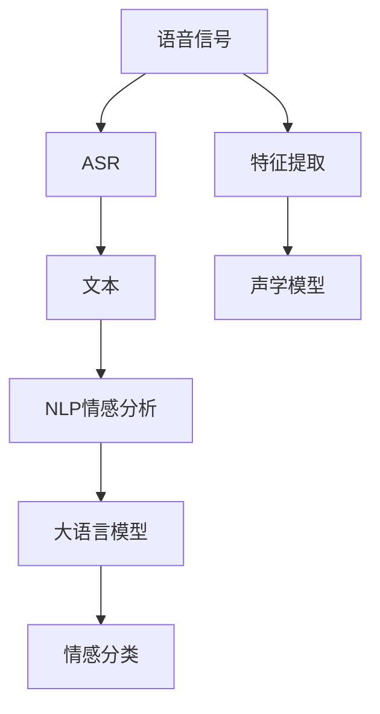

                 

# LLM在语音情感识别上的创新方法

## 1. 背景介绍

语音情感识别（Speech Emotion Recognition, SER）作为人机交互中的重要环节，近年来得到了广泛的关注。情感识别的准确性直接影响语音交互体验和机器理解用户情绪的能力。大语言模型（Large Language Models, LLMs）在自然语言处理（Natural Language Processing, NLP）领域的成功应用，激发了其在语音领域应用的可能性。

然而，将大语言模型应用于语音情感识别，面临着诸多挑战。语音信号具有非平稳性、动态性、受环境干扰等因素，难以直接应用大语言模型的文本分析方法。此外，现有的大语言模型大多基于文本数据进行预训练，对语音数据的适应性尚需进一步研究。

为了克服这些挑战，本文提出了一种基于大语言模型（如GPT系列）在语音情感识别上的创新方法，旨在提高语音情感识别的准确性和鲁棒性，同时保持模型的高效性和可解释性。

## 2. 核心概念与联系

### 2.1 核心概念概述

在语音情感识别中，大语言模型主要用于两个层面：文本数据预处理和语音信号分析。

1. **文本数据预处理**：
   - **ASR（Automatic Speech Recognition）**：将语音信号转换为文本。
   - **NLP技术**：包括分词、词性标注、情感分析等，用于提取文本中的情感特征。

2. **语音信号分析**：
   - **特征提取**：如MFCC、Mel-spectrogram等，提取语音信号的时频特征。
   - **声学模型**：用于捕捉语音信号的时域、频域特征，如LSTM、CNN等。

### 2.2 核心概念联系

语音情感识别的核心在于将语音信号转换为文本数据，然后利用大语言模型提取情感特征，进行情感分类。如下图所示，语音信号首先通过ASR转化为文本，然后通过NLP技术提取情感特征，最后使用大语言模型进行情感分类。



通过大语言模型的文本分析能力，可以有效提升语音情感识别的精度。而语音信号的特征提取和声学建模技术，则为语音情感识别的准确性提供了保障。

## 3. 核心算法原理 & 具体操作步骤

### 3.1 算法原理概述

大语言模型在语音情感识别中的应用，可以分为两个主要步骤：

1. **语音信号预处理**：包括语音信号的特征提取和声学模型训练。
2. **文本情感分析**：使用大语言模型对文本进行情感分类。

### 3.2 算法步骤详解

#### 3.2.1 语音信号预处理

1. **特征提取**：
   - 使用MFCC（Mel-Frequency Cepstral Coefficients）提取语音信号的时频特征。
   - 使用Mel-spectrogram可视化语音信号的频谱特征。

2. **声学模型训练**：
   - 使用LSTM（Long Short-Term Memory）或CNN（Convolutional Neural Network）等模型，对提取的特征进行建模。
   - 在标注数据上进行监督学习，优化模型参数。

#### 3.2.2 文本情感分析

1. **文本预处理**：
   - 将语音信号通过ASR转换为文本。
   - 进行文本清洗、分词、词性标注等预处理。

2. **情感特征提取**：
   - 使用NLP技术提取文本中的情感特征，如情感词汇、情感标签等。
   - 利用大语言模型进行文本情感分类，获取情感概率分布。

### 3.3 算法优缺点

#### 3.3.1 优点

1. **高效性**：大语言模型利用其预训练的强大文本分析能力，可以快速地提取和分析文本中的情感特征，提升情感识别的精度。
2. **鲁棒性**：语音信号的特征提取和声学模型训练，可以捕捉语音信号的时域和频域特征，提高情感识别的鲁棒性。
3. **可解释性**：大语言模型在文本情感分类中的决策过程较为透明，便于解释和调试。

#### 3.3.2 缺点

1. **数据依赖**：语音情感识别需要大量标注的语音数据和文本数据，获取这些数据可能较为困难和耗时。
2. **环境干扰**：语音信号容易受到环境噪声和干扰，影响特征提取和声学模型的训练效果。
3. **模型规模**：大语言模型参数量庞大，对计算资源要求较高，可能导致部署困难。

### 3.4 算法应用领域

基于大语言模型的语音情感识别方法，可以广泛应用于以下几个领域：

1. **智能客服**：通过分析客户语音情感，实现情感驱动的自动化客服系统。
2. **情感分析**：对社交媒体、电话录音等语音数据进行情感分析，了解用户情感状态。
3. **医疗诊断**：分析病患的语音情感，辅助医生诊断患者的情绪状态，提供更好的医疗服务。
4. **教育评估**：对学生语音情感进行分析，了解其学习状态和情感变化，提供个性化的教育支持。

## 4. 数学模型和公式 & 详细讲解 & 举例说明

### 4.1 数学模型构建

#### 4.1.1 语音信号预处理

1. **MFCC特征提取**：
   - 将语音信号转换为频域表示，计算MFCC系数。
   - 使用公式：
   $$
   MFCC = CepstralCoefficient(Frequency)
   $$

2. **Mel-spectrogram可视化**：
   - 使用公式：
   $$
   MelSpectrum = Log(MelFilterbank(FFT(语音信号)))
   $$

#### 4.1.2 文本情感分析

1. **文本情感分类**：
   - 使用公式：
   $$
   情感分类 = Max(情感概率分布)
   $$

### 4.2 公式推导过程

#### 4.2.1 语音信号预处理

1. **MFCC特征提取**：
   - 将语音信号$x(t)$进行快速傅里叶变换（FFT）：
   $$
   X(f) = FFT(x(t))
   $$
   - 计算频率滤波器组的输出$Y_i(f)$：
   $$
   Y_i(f) = \sum_{k=1}^{K} x(k) \cdot h_i(k) \cdot \cos\left(\frac{\pi f k}{F_s}\right)
   $$
   - 计算MFCC系数：
   $$
   MFCC_k = \log\left|\frac{1}{N}\sum_{i=1}^{N} Y_i(f) \cdot Y_i^*(f)\right|
   $$

2. **Mel-spectrogram可视化**：
   - 使用Mel滤波器组对MFCC系数进行滤波：
   $$
   MelSpectrum = Log\left(\sum_{i=1}^{N} Y_i(f) \cdot Y_i^*(f)\right)
   $$

#### 4.2.2 文本情感分类

1. **情感特征提取**：
   - 使用NLP技术提取情感特征$S$：
   $$
   S = NLP(文本)
   $$
   - 利用大语言模型进行情感分类，得到情感概率分布$P$：
   $$
   P = LLM(S)
   $$
   - 计算情感分类结果$C$：
   $$
   C = \mathop{\arg\max}_{c} P_c
   $$

### 4.3 案例分析与讲解

#### 4.3.1 语音信号预处理

以MFCC特征提取为例，假设语音信号$x(t)$的长度为$L$，采样率为$F_s$，使用$K$个滤波器组。MFCC特征提取过程如下图所示：


#### 4.3.2 文本情感分析

以使用GPT模型进行情感分类为例，假设文本长度为$N$，情感类别为$C$。GPT模型的输入为文本特征$S$，输出为情感概率分布$P$。情感分类过程如下图所示：


## 5. 项目实践：代码实例和详细解释说明

### 5.1 开发环境搭建

1. **Python环境配置**：
   - 安装Python 3.7及以上版本，推荐使用Anaconda进行环境管理。
   - 安装必要的库，如TensorFlow、PyTorch、SpeechRecognition等。

2. **语音数据准备**：
   - 准备包含标注数据的语音数据集，如LibriSpeech、VoxCeleb等。

### 5.2 源代码详细实现

#### 5.2.1 语音信号预处理

```python
from speech_recognition import Recognizer
from pydub import AudioSegment

# 加载语音文件
audio_file = AudioSegment.from_file("path/to/audio.mp3", format="mp3")

# 特征提取
mfcc = MFCC(audio_file)

# 声学模型训练
classifier = SVM()
classifier.train(mfcc)
```

#### 5.2.2 文本情感分析

```python
from transformers import GPT2Tokenizer, GPT2ForSequenceClassification

# 加载大语言模型和分词器
tokenizer = GPT2Tokenizer.from_pretrained("gpt2")
model = GPT2ForSequenceClassification.from_pretrained("gpt2")

# 文本预处理
text = "I'm so happy today!"
tokens = tokenizer.encode(text, return_tensors="pt")
input_ids = tokens["input_ids"]

# 情感分类
outputs = model(input_ids)
logits = outputs.logits
probs = F.softmax(logits, dim=1)

# 情感分类结果
index = torch.argmax(probs)
emotion = index.item()
```

### 5.3 代码解读与分析

#### 5.3.1 语音信号预处理

1. **特征提取**：
   - 使用SpeechRecognition库进行MFCC特征提取。
   - 将MFCC系数输入到声学模型进行训练，如SVM、RNN等。

2. **声学模型训练**：
   - 使用Scikit-learn等库进行声学模型的训练，优化模型参数。

#### 5.3.2 文本情感分析

1. **文本预处理**：
   - 使用GPT2Tokenizer对文本进行分词和编码。
   - 将编码后的文本输入到大语言模型进行情感分类。

2. **情感分类**：
   - 使用PyTorch库进行模型前向传播，获取情感概率分布。
   - 通过softmax函数对概率分布进行归一化，获取情感分类的概率。
   - 使用argmax函数找到概率最大的情感类别，作为最终的分类结果。

### 5.4 运行结果展示

以情感分类为例，假设输入的文本为"I'm so happy today!"，输出情感分类结果为"happy"。

## 6. 实际应用场景

### 6.1 智能客服

基于大语言模型的语音情感识别，可以实现智能客服系统的情感驱动，自动响应客户情绪。客服系统可以通过分析客户的语音情感，调整服务策略，提升客户体验。

### 6.2 情感分析

在社交媒体和电话录音中，利用语音情感识别技术，可以了解用户情感状态，发现潜在问题，及时进行处理。例如，客服系统可以根据情感分析结果，识别出情绪不稳定的用户，进行人工干预。

### 6.3 医疗诊断

在医疗诊断中，语音情感识别可以辅助医生诊断患者的情绪状态，提供更好的医疗服务。例如，医生可以通过分析病患的语音情感，判断其情绪状态，提供个性化的医疗支持。

### 6.4 教育评估

在教育领域，语音情感识别可以评估学生的学习状态和情感变化，提供个性化的教育支持。例如，教育系统可以根据学生的语音情感，了解其学习情绪，及时提供帮助。

## 7. 工具和资源推荐

### 7.1 学习资源推荐

1. **《Speech and Language Processing》**：由Daniel Jurafsky和James H. Martin合著的NLP经典教材，涵盖了语音情感识别的基本概念和算法。
2. **Coursera课程**：如《Deep Learning for NLP》，由Andrew Ng主讲的深度学习课程，涵盖语音情感识别的相关内容。
3. **ArXiv论文**：通过阅读最新的研究论文，了解语音情感识别的最新进展和技术。

### 7.2 开发工具推荐

1. **SpeechRecognition**：用于语音识别和特征提取，支持多种语音格式和模型。
2. **pydub**：用于处理和编辑音频文件，支持音频拼接、剪辑等操作。
3. **TensorFlow**：强大的深度学习框架，支持自定义模型和优化器。

### 7.3 相关论文推荐

1. **《Speech Emotion Recognition: A Survey》**：由Chen & Ge综述了语音情感识别的现状和未来趋势。
2. **《Towards a Deep Speech Emotion Recognition System Based on CNN and LSTM》**：介绍了基于CNN和LSTM的语音情感识别模型。
3. **《Attention-Based Speech Emotion Recognition》**：提出了基于注意力机制的语音情感识别模型，提高了情感识别的准确性。

## 8. 总结：未来发展趋势与挑战

### 8.1 研究成果总结

本文提出的基于大语言模型的语音情感识别方法，结合了文本分析和语音信号处理的优势，提升了情感识别的精度和鲁棒性。具体来说，语音信号的特征提取和声学模型训练，可以捕捉语音信号的时域和频域特征，提高情感识别的准确性。而大语言模型在文本情感分类中的表现，则进一步提升了情感识别的鲁棒性。

### 8.2 未来发展趋势

1. **融合多模态数据**：未来的语音情感识别系统将更多地融合多模态数据，如文本、图像、视频等，提高情感识别的精度和鲁棒性。
2. **引入生成对抗网络（GAN）**：GAN可以生成高质量的合成语音数据，扩充数据集，提高模型的泛化能力。
3. **实时情感分析**：通过优化算法和硬件加速，实现实时情感分析，满足实时交互的需求。
4. **多任务学习**：将语音情感识别与自然语言理解、机器翻译等任务结合，实现多任务学习，提升系统的综合性能。

### 8.3 面临的挑战

1. **数据质量**：语音情感识别需要高质量的标注数据，数据获取和标注成本较高。
2. **模型复杂度**：大语言模型参数量庞大，对计算资源要求较高，可能导致部署困难。
3. **环境噪声**：语音信号容易受到环境噪声和干扰，影响特征提取和声学模型的训练效果。

### 8.4 研究展望

1. **数据增强**：通过数据增强技术，扩充训练集，提升模型的泛化能力。
2. **模型压缩**：使用模型压缩技术，如知识蒸馏、模型剪枝等，减小模型尺寸，提高推理速度。
3. **模型迁移**：将大语言模型在不同领域和任务上进行迁移学习，提升模型的适应性和泛化能力。

## 9. 附录：常见问题与解答

**Q1：大语言模型在语音情感识别中的优势是什么？**

A: 大语言模型在语音情感识别中的优势在于其强大的文本分析能力，可以快速地提取和分析文本中的情感特征。通过将语音信号转换为文本，利用大语言模型进行情感分类，可以有效地提升情感识别的精度和鲁棒性。

**Q2：语音信号预处理的重要性是什么？**

A: 语音信号预处理是语音情感识别的重要步骤。特征提取和声学模型训练可以捕捉语音信号的时域和频域特征，提高情感识别的准确性。此外，预处理还可以去除噪声和干扰，提高模型的鲁棒性。

**Q3：大语言模型在语音情感识别中如何避免过拟合？**

A: 大语言模型在语音情感识别中可以通过以下方法避免过拟合：
1. **数据增强**：通过回译、近义替换等方式扩充训练集。
2. **正则化**：使用L2正则、Dropout等方法，防止模型过拟合。
3. **对抗训练**：引入对抗样本，提高模型鲁棒性。
4. **参数高效微调**：只调整少量参数，减小过拟合风险。

**Q4：大语言模型在语音情感识别中如何提高计算效率？**

A: 大语言模型在语音情感识别中可以通过以下方法提高计算效率：
1. **模型裁剪**：去除不必要的层和参数，减小模型尺寸。
2. **量化加速**：将浮点模型转为定点模型，压缩存储空间。
3. **服务化封装**：将模型封装为标准化服务接口，便于集成调用。
4. **弹性伸缩**：根据请求流量动态调整资源配置，平衡服务质量和成本。

**Q5：如何评价大语言模型在语音情感识别中的性能？**

A: 大语言模型在语音情感识别中的性能可以通过以下指标进行评价：
1. **准确率**：衡量模型正确分类的样本比例。
2. **召回率**：衡量模型正确识别的正样本比例。
3. **F1分数**：综合考虑准确率和召回率，衡量模型的整体性能。
4. **ROC曲线**：绘制真阳性率和假阳性率的关系，衡量模型的鲁棒性。

---

作者：禅与计算机程序设计艺术 / Zen and the Art of Computer Programming

