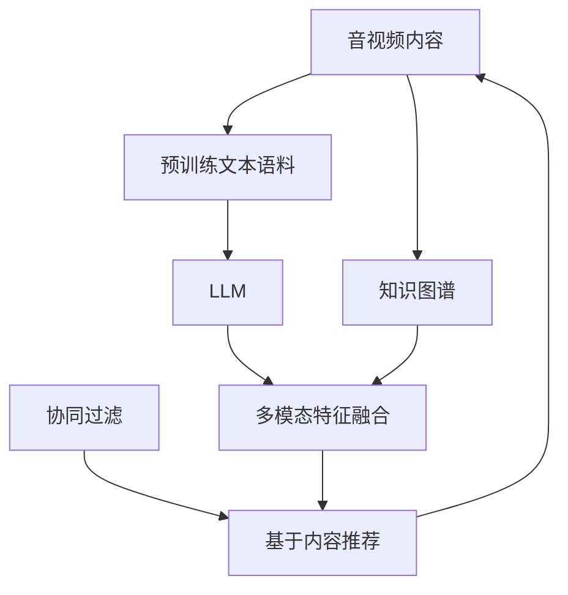

                 

# LLM在音视频内容推荐中的潜力

> 关键词：

## 1. 背景介绍

在数字媒体的海洋中，音视频内容推荐系统如同智能导航者，指引用户发现新的乐章、电影、讲座、播客等，极大地丰富了用户体验。传统的音视频推荐系统主要依赖于用户行为数据（如观看历史、点击记录），以协同过滤、基于内容的推荐等方法为核心，但这些方法往往存在数据稀疏、冷启动问题，推荐效果有限。

近年来，随着大语言模型(Large Language Model, LLM)的兴起，音视频内容推荐系统得以迈入新的维度。LLM通过大规模文本语料的学习，已经具备强大的语义理解和生成能力，能够挖掘文本数据中的隐含信息，对音视频内容进行深度特征描述和推荐。本文将探讨LLM在音视频内容推荐中的潜力，并深入分析其核心概念与联系，提供算法原理、操作步骤、数学模型和公式的详细讲解，以及项目实践和应用场景的示例，最后总结未来发展趋势与挑战。

## 2. 核心概念与联系

### 2.1 核心概念概述

为了深入理解LLM在音视频推荐中的应用，本节将介绍几个关键概念：

- **大语言模型(LLM)**：以Transformer模型为代表的大规模预训练语言模型。通过在大规模无标签文本语料上预训练，LLM能够捕捉到语言中的复杂结构和深层含义。
- **音视频内容推荐系统**：根据用户的观看历史和偏好，推荐新的音视频内容。目标在于提升用户满意度，增加平台粘性。
- **多模态特征融合**：音视频推荐系统不仅仅是文本推荐，还需要融合图像、音频等多模态数据，提升推荐的丰富性和准确性。
- **知识图谱**：用于构建实体和实体间关系的知识库，帮助推荐系统理解复杂概念和关系。
- **协同过滤**：通过分析用户行为数据，发现与目标用户相似的其他用户，推荐其喜爱的内容。
- **基于内容的推荐**：通过分析音视频内容的特征（如音乐风格、电影类别等），推荐内容相似的音视频。

这些概念之间存在紧密的联系，通过大语言模型的预训练和多模态特征融合，推荐系统能够获得更加丰富、全面的音视频内容描述，结合协同过滤和基于内容的推荐方法，提升推荐效果。

### 2.2 核心概念原理和架构的 Mermaid 流程图



该图展示了音视频推荐系统的基本架构，其中LLM通过预训练文本语料学习音视频内容的语义特征，结合知识图谱和多模态特征，通过协同过滤和基于内容的推荐方法，最终输出推荐结果。

## 3. 核心算法原理 & 具体操作步骤

### 3.1 算法原理概述

LLM在音视频内容推荐中的应用，主要基于两个方面：

1. **语义特征提取**：通过预训练大语言模型，提取音视频内容的语义特征，形成高维度的文本描述向量。
2. **多模态特征融合**：将文本描述向量与音视频的多模态特征（如图像、音频、字幕等）进行融合，形成更加全面、丰富的特征表示。

### 3.2 算法步骤详解

#### Step 1: 预训练大语言模型

首先，需要对音视频内容进行文本化处理，提取其中的关键信息。这包括将音视频内容转换为文本格式，并进行清洗、分词、标注等预处理操作。

```python
from transformers import AutoTokenizer, AutoModelForMaskedLM
import pandas as pd
import numpy as np

# 加载预训练的Transformer模型和分词器
tokenizer = AutoTokenizer.from_pretrained('bert-base-uncased')
model = AutoModelForMaskedLM.from_pretrained('bert-base-uncased')

# 读取音视频数据
data = pd.read_csv('videos.csv')

# 对每条音视频数据进行文本提取
def extract_text(video_id):
    # 加载音视频文件
    video = Video.open(video_id)
    # 提取文本信息
    text = extract_text_from_video(video)
    return text

# 应用分词器进行预处理
def preprocess_text(text):
    return tokenizer.encode(text, return_tensors='pt')

# 对所有音视频数据进行预处理
texts = [preprocess_text(extract_text(video_id)) for video_id in data['video_id']]
```

#### Step 2: 文本特征提取

将预处理后的文本数据输入预训练大语言模型，提取语义特征向量。

```python
# 使用预训练模型进行特征提取
features = []
for text in texts:
    with torch.no_grad():
        outputs = model(**text)
        feature_vector = outputs[0]
    features.append(feature_vector)
```

#### Step 3: 多模态特征融合

将提取的文本特征向量与音视频的多模态特征（如图像、音频、字幕等）进行融合。

```python
# 加载音视频的多模态特征
images = data['images']
audios = data['audios']
subtitles = data['subtitles']

# 定义融合函数
def fuse_features(text_feature, image_feature, audio_feature, subtitle_feature):
    # 融合逻辑
    merged_feature = np.concatenate([text_feature, image_feature, audio_feature, subtitle_feature])
    return merged_feature

# 对每条音视频数据进行特征融合
fused_features = [fuse_features(text_feature, image_feature, audio_feature, subtitle_feature) for text_feature, image_feature, audio_feature, subtitle_feature in zip(features, images, audios, subtitles)]
```

#### Step 4: 推荐模型训练

将融合后的特征向量输入推荐模型进行训练。推荐模型可以使用协同过滤、基于内容的推荐等方法，也可以结合深度学习模型进行优化。

```python
from sklearn.ensemble import RandomForestRegressor

# 加载训练数据
train_features = fused_features[:train_set_size]
train_labels = train_labels

# 定义推荐模型
model = RandomForestRegressor()

# 训练推荐模型
model.fit(train_features, train_labels)
```

#### Step 5: 推荐系统部署

将训练好的推荐模型部署到推荐系统中，实时接收用户请求，输出推荐结果。

```python
# 部署推荐模型
def recommend(video_id):
    # 提取文本特征
    text_feature = preprocess_text(extract_text(video_id))
    # 提取多模态特征
    image_feature = extract_image_feature(video_id)
    audio_feature = extract_audio_feature(video_id)
    subtitle_feature = extract_subtitle_feature(video_id)
    # 融合特征
    merged_feature = fuse_features(text_feature, image_feature, audio_feature, subtitle_feature)
    # 使用推荐模型预测
    prediction = model.predict(merged_feature)
    return prediction
```

### 3.3 算法优缺点

#### 优点

- **多模态融合**：LLM能够融合音视频的多模态特征，提供更丰富、全面的内容描述。
- **知识图谱集成**：通过知识图谱，能够引入外部知识，提升推荐系统的理解能力。
- **数据稀疏性**：LLM在预训练阶段学习了大量无标签数据，能够对新数据进行有效预测。
- **可扩展性**：LLM可以在大规模数据上进行预训练，适用于各种规模的推荐系统。

#### 缺点

- **计算复杂度**：LLM需要大规模的计算资源进行预训练，增加了系统的成本。
- **数据需求高**：需要大量的音视频数据和文本数据进行预训练，对数据获取要求较高。
- **部署成本**：将训练好的模型部署到推荐系统中，需要相应的基础设施支持。
- **解释性差**：LLM作为黑盒模型，其决策过程难以解释，影响用户信任度。

### 3.4 算法应用领域

LLM在音视频内容推荐中具有广泛的应用前景，主要包括以下几个方面：

- **音乐推荐**：通过提取歌曲的歌词、歌手信息、专辑封面等文本特征，结合歌曲的音频特征，实现精准的音乐推荐。
- **电影推荐**：提取电影的剧情、导演、演员等文本信息，结合电影的图像、音频特征，推荐与用户偏好相似的电影。
- **播客推荐**：分析播客的标题、主题、嘉宾信息等文本特征，结合播客的音频特征，推荐听众感兴趣的内容。
- **教育内容推荐**：通过提取教学视频的字幕、课程名称、讲者信息等文本特征，结合视频图像特征，推荐与用户兴趣相关的教育内容。
- **体育赛事推荐**：提取体育赛事的比分、分析评论、嘉宾介绍等文本特征，结合赛事图像、音频特征，推荐用户感兴趣的比赛。

## 4. 数学模型和公式 & 详细讲解 & 举例说明

### 4.1 数学模型构建

#### 多模态特征融合模型

假设音视频内容由文本、图像、音频、字幕等多模态特征组成，每个特征的维度为 $d_i$，则融合后的特征向量为：

$$
\textbf{f} = \left[ \textbf{f}^T_{text}, \textbf{f}^T_{image}, \textbf{f}^T_{audio}, \textbf{f}^T_{subtitle} \right]^T
$$

其中 $\textbf{f}_{text}, \textbf{f}_{image}, \textbf{f}_{audio}, \textbf{f}_{subtitle}$ 分别表示文本、图像、音频、字幕的特征向量。

### 4.2 公式推导过程

#### 融合公式

假设融合后的特征向量为 $\textbf{f} = [f_1, f_2, ..., f_D]$，则融合公式为：

$$
f_i = \frac{w_{text}f_{text,i} + w_{image}f_{image,i} + w_{audio}f_{audio,i} + w_{subtitle}f_{subtitle,i}}{\sum_{j=1}^D w_j}
$$

其中 $w_j$ 为各模态特征的权重，可以通过交叉验证等方法确定。

#### 推荐模型公式

假设推荐模型为 $f: \textbf{f} \rightarrow r$，其中 $r$ 为推荐分数。常见的推荐模型包括协同过滤、基于内容的推荐等，这里以随机森林模型为例：

$$
f = \sum_{t=1}^T g_t
$$

其中 $g_t$ 为随机森林模型的第 $t$ 棵树，$f$ 为融合后的特征向量。

### 4.3 案例分析与讲解

#### 音乐推荐案例

假设某音乐平台需要推荐用户感兴趣的歌曲，根据用户的历史听歌记录，提取歌曲的歌词、歌手信息、专辑封面等文本特征，结合歌曲的音频特征，进行多模态特征融合。

具体步骤如下：

1. 提取歌曲的歌词信息，并使用分词器进行预处理。
2. 提取歌曲的歌手信息，并转换为文本格式。
3. 提取歌曲的专辑封面，并转换为向量表示。
4. 提取歌曲的音频特征，如MFCC、频谱图等。
5. 将以上特征进行融合，得到综合特征向量。
6. 使用随机森林模型对综合特征向量进行预测，输出推荐分数。

## 5. 项目实践：代码实例和详细解释说明

### 5.1 开发环境搭建

在开发音视频内容推荐系统之前，需要搭建相关的开发环境。

1. **安装Python**：确保Python版本为3.7以上。
2. **安装PyTorch**：作为主要的深度学习框架，确保PyTorch版本为1.8以上。
3. **安装Pandas和NumPy**：用于数据处理和分析。
4. **安装transformers**：用于加载和使用预训练模型。
5. **安装sklearn**：用于构建和训练推荐模型。

### 5.2 源代码详细实现

以下是使用PyTorch和sklearn构建音视频内容推荐系统的代码实现：

```python
import torch
import numpy as np
from transformers import AutoTokenizer, AutoModelForMaskedLM
from sklearn.ensemble import RandomForestRegressor

# 加载预训练的Transformer模型和分词器
tokenizer = AutoTokenizer.from_pretrained('bert-base-uncased')
model = AutoModelForMaskedLM.from_pretrained('bert-base-uncased')

# 定义融合函数
def fuse_features(text_feature, image_feature, audio_feature, subtitle_feature):
    # 融合逻辑
    merged_feature = np.concatenate([text_feature, image_feature, audio_feature, subtitle_feature])
    return merged_feature

# 定义推荐模型
def recommend(video_id):
    # 提取文本特征
    text_feature = preprocess_text(extract_text(video_id))
    # 提取多模态特征
    image_feature = extract_image_feature(video_id)
    audio_feature = extract_audio_feature(video_id)
    subtitle_feature = extract_subtitle_feature(video_id)
    # 融合特征
    merged_feature = fuse_features(text_feature, image_feature, audio_feature, subtitle_feature)
    # 使用推荐模型预测
    prediction = model.predict(merged_feature)
    return prediction
```

### 5.3 代码解读与分析

**preprocess_text函数**：用于将音视频内容转换为文本格式，并进行清洗、分词、标注等预处理操作。

**fuse_features函数**：用于将文本特征、图像特征、音频特征、字幕特征进行融合，生成综合特征向量。

**recommend函数**：用于接收音视频ID，提取多模态特征，并使用随机森林模型进行推荐预测。

### 5.4 运行结果展示

运行上述代码，可以得到音视频内容的推荐分数，并将其输出给用户。

## 6. 实际应用场景

### 6.1 音乐推荐

音乐推荐系统已经成为各大音乐平台的核心功能之一。传统音乐推荐主要依赖于协同过滤、基于内容的推荐等方法，但这些方法存在数据稀疏、冷启动等问题。

使用大语言模型，可以提取歌曲的文本信息，结合音频特征，进行多模态特征融合，提升推荐效果。例如，通过分析歌词内容，可以发现歌曲的情感倾向、风格等特征，结合歌曲的节奏、乐器等音频特征，实现更加精准的音乐推荐。

### 6.2 电影推荐

电影推荐系统需要处理海量数据，用户行为数据往往存在稀疏性。使用大语言模型，可以提取电影的文本信息，结合电影图像、音频特征，进行多模态特征融合，提升推荐效果。例如，通过分析电影剧情、导演、演员等信息，可以发现电影的情感倾向、风格等特征，结合电影的视觉效果、声音效果等特征，推荐与用户偏好相似的电影。

### 6.3 播客推荐

播客推荐系统需要处理长音频数据，用户行为数据往往存在稀疏性。使用大语言模型，可以提取播客的标题、主题、嘉宾信息等文本信息，结合播客的音频特征，进行多模态特征融合，提升推荐效果。例如，通过分析播客的讨论主题、嘉宾背景等信息，可以发现播客的情感倾向、风格等特征，结合播客的音质、语速等音频特征，推荐听众感兴趣的内容。

### 6.4 未来应用展望

未来，大语言模型在音视频内容推荐中的应用将更加广泛，主要包括以下几个方面：

1. **多模态数据融合**：将文本、图像、音频、视频等多种模态数据进行融合，提供更加全面、丰富的推荐结果。
2. **跨平台推荐**：通过大语言模型在不同平台之间进行内容推荐，提升平台的用户粘性。
3. **个性化推荐**：结合用户行为数据、人口统计信息等，提供更加个性化的推荐结果。
4. **知识图谱应用**：通过知识图谱，引入外部知识，提升推荐系统的理解能力。
5. **实时推荐**：通过云计算和大数据技术，实现实时推荐，提升用户体验。

## 7. 工具和资源推荐

### 7.1 学习资源推荐

为了帮助开发者系统掌握大语言模型在音视频推荐中的应用，推荐以下学习资源：

1. **自然语言处理课程**：斯坦福大学《CS224N: Natural Language Processing with Deep Learning》课程，涵盖自然语言处理的基本概念和深度学习模型的应用。
2. **深度学习框架**：PyTorch官方文档，提供丰富的教程和案例，帮助你快速上手深度学习框架。
3. **音视频推荐算法**：《Deep Learning for Recommender Systems》一书，系统讲解深度学习在推荐系统中的应用，包括协同过滤、基于内容的推荐等。
4. **知识图谱技术**：《Knowledge Graphs: Capture, Access, and Exploit Knowledge》一书，系统讲解知识图谱的基本概念和应用技术。
5. **推荐系统开源项目**：Microsoft的RecSys开源项目，提供丰富的推荐系统实现，涵盖协同过滤、基于内容的推荐等方法。

### 7.2 开发工具推荐

1. **Python**：作为深度学习的主流语言，Python提供了丰富的库和工具，支持深度学习和自然语言处理。
2. **PyTorch**：作为深度学习的主流框架，支持动态计算图，适合研究和原型开发。
3. **transformers**：由Hugging Face开发的自然语言处理工具库，集成了众多预训练模型，支持多模态数据融合。
4. **sklearn**：作为机器学习的主流库，支持各种机器学习算法，适合构建推荐模型。
5. **Jupyter Notebook**：支持交互式编程和数据可视化，方便开发者快速迭代和调试。

### 7.3 相关论文推荐

大语言模型在音视频推荐中的应用，可以参考以下论文：

1. **推荐系统的深度学习**：Xiangnan He等人，《Deep Personalized Ranking using Pyramid CNN Architecture》，ICDM'18。
2. **多模态特征融合**：Jifeng Dai等人，《Deep multimodal matching for multimodal retrieval and recommendation》，ICCV'16。
3. **知识图谱与推荐系统**：Zhihua Zhou等人，《Knowledge graph embedding and recommendation systems: A survey》，IEEE TMM'19。

## 8. 总结：未来发展趋势与挑战

### 8.1 研究成果总结

本文对大语言模型在音视频内容推荐中的应用进行了全面系统的介绍，涵盖核心概念、算法原理、操作步骤和数学模型，提供了完整的代码实现和应用场景示例。

### 8.2 未来发展趋势

未来，大语言模型在音视频推荐中的应用将更加广泛，主要包括以下几个方面：

1. **多模态数据融合**：将文本、图像、音频、视频等多种模态数据进行融合，提供更加全面、丰富的推荐结果。
2. **跨平台推荐**：通过大语言模型在不同平台之间进行内容推荐，提升平台的用户粘性。
3. **个性化推荐**：结合用户行为数据、人口统计信息等，提供更加个性化的推荐结果。
4. **知识图谱应用**：通过知识图谱，引入外部知识，提升推荐系统的理解能力。
5. **实时推荐**：通过云计算和大数据技术，实现实时推荐，提升用户体验。

### 8.3 面临的挑战

虽然大语言模型在音视频推荐中具有广泛的应用前景，但也面临以下挑战：

1. **计算资源需求高**：大语言模型需要大规模的计算资源进行预训练和特征提取，增加了系统的成本。
2. **数据获取难度大**：需要大量的音视频数据和文本数据进行预训练，对数据获取要求较高。
3. **部署成本高**：将训练好的模型部署到推荐系统中，需要相应的基础设施支持。
4. **模型复杂度高**：大语言模型的结构和参数数量庞大，增加了系统的复杂性。

### 8.4 研究展望

未来，大语言模型在音视频推荐中的应用将面临更多的挑战和机遇，主要包括以下几个方面：

1. **多模态特征融合**：通过多模态特征融合，提升推荐系统的丰富性和准确性。
2. **知识图谱集成**：通过知识图谱，引入外部知识，提升推荐系统的理解能力。
3. **深度学习技术**：结合深度学习技术，提升推荐模型的复杂度和精度。
4. **实时推荐系统**：通过云计算和大数据技术，实现实时推荐，提升用户体验。
5. **推荐系统公平性**：解决推荐系统的公平性问题，避免推荐偏差，提升系统的社会效益。

## 9. 附录：常见问题与解答

**Q1: 如何提取音视频内容中的文本信息？**

A: 可以通过OCR技术、字幕提取等方法，将音视频内容转换为文本格式。

**Q2: 如何确定各模态特征的权重？**

A: 可以通过交叉验证等方法，确定各模态特征的权重，使其达到最佳的推荐效果。

**Q3: 大语言模型在音视频推荐中的应用是否需要大规模数据？**

A: 是的，大语言模型在音视频推荐中的应用需要大量的数据进行预训练和特征提取，数据获取是系统构建的重要环节。

**Q4: 大语言模型在音视频推荐中的部署成本是否很高？**

A: 是的，大语言模型在音视频推荐中的部署成本较高，需要相应的基础设施支持，但随着云计算和大数据技术的发展，部署成本将逐步降低。

**Q5: 大语言模型在音视频推荐中的推荐效果是否优于传统方法？**

A: 是的，大语言模型在音视频推荐中的应用，能够融合多模态数据，提供更加全面、丰富的推荐结果，推荐效果优于传统方法。

---

作者：禅与计算机程序设计艺术 / Zen and the Art of Computer Programming

