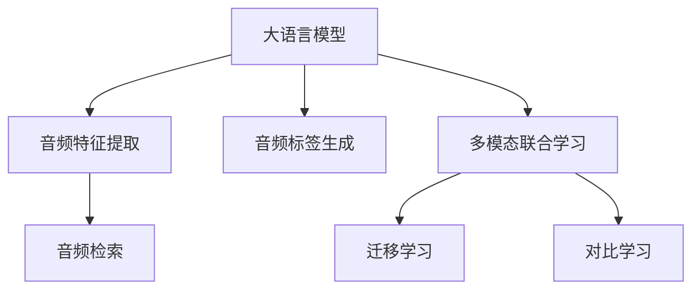

                 

# 大语言模型在音频检索领域的技术挑战

## 1. 背景介绍

随着人工智能技术的不断进步，大语言模型（LLM）在自然语言处理（NLP）领域取得了显著的成果，广泛应用于文本检索、翻译、问答、情感分析等任务。然而，音频数据作为信息传播的重要媒介，其在信息检索、语音识别、音频编辑等应用中的作用日益重要。尽管大语言模型在文本处理方面具有显著优势，但在音频检索领域，其应用还面临诸多技术挑战。

本文旨在探讨大语言模型在音频检索领域的应用现状和潜在挑战，为该领域的进一步研究和实践提供指导。

## 2. 核心概念与联系

### 2.1 核心概念概述

在音频检索领域，大语言模型的核心概念包括：

- **大语言模型（LLM）**：以深度学习为核心的语言处理模型，如BERT、GPT等，通过在大规模无标签文本数据上预训练，学习通用语言表示。
- **音频检索**：利用音频信号的特征描述，在音频数据集中查找目标音频的任务。常见的音频检索任务包括语音识别、音频标签生成、音频内容相似度计算等。
- **多模态学习**：结合文本、图像、音频等多种数据模态的信息，进行联合学习和推理，提高模型对复杂数据的理解能力。
- **迁移学习**：将已有领域中的知识迁移到目标领域，以提升模型在新任务上的性能。
- **对比学习**：通过对比不同样本之间的相似性，提高模型的泛化能力。

### 2.2 核心概念原理和架构的 Mermaid 流程图



该图展示了大语言模型在音频检索领域的应用架构：

- 大语言模型接收音频特征向量，生成音频标签。
- 将音频标签作为查询，在音频数据集中进行检索，得到相似度高的音频结果。
- 在多模态学习中，结合文本、图像、音频等信息，进行联合推理。
- 通过迁移学习和对比学习，提升模型在新领域和复杂任务上的表现。

## 3. 核心算法原理 & 具体操作步骤

### 3.1 算法原理概述

大语言模型在音频检索领域的应用，通常包括以下几个关键步骤：

1. **音频特征提取**：从音频信号中提取特征向量，如MFCC、梅尔频谱、时频图像等，用于描述音频信号的特征。
2. **音频文本生成**：将音频特征向量作为输入，生成文本描述，如音频内容、标签、情感等信息。
3. **文本检索**：将生成的文本作为查询，在文本数据集中检索相关文本，得到相似度高的文本结果。
4. **音频结果生成**：将文本结果映射回音频数据集，生成相似度高的音频结果。

### 3.2 算法步骤详解

**步骤1：音频特征提取**

- 使用MFCC、Mel-spectrogram等方法，提取音频特征向量。
- 将音频特征向量作为输入，进行预处理和归一化。

**步骤2：音频文本生成**

- 将音频特征向量作为输入，使用大语言模型生成文本描述。
- 文本描述应包含音频内容的关键词、情感、主题等信息。

**步骤3：文本检索**

- 将生成的文本作为查询，在文本数据集中进行检索。
- 计算文本之间的相似度，得到文本结果。

**步骤4：音频结果生成**

- 将文本结果映射回音频数据集，得到相似度高的音频结果。
- 音频结果可以用于音频检索、音频标签生成等任务。

### 3.3 算法优缺点

大语言模型在音频检索领域的应用具有以下优点：

- **高效性**：大语言模型可以同时处理多种音频特征和文本描述，提高检索效率。
- **泛化能力**：大语言模型能够从大量数据中学习通用知识，适用于多种音频检索任务。
- **灵活性**：大语言模型支持多种输入格式和输出格式，适用于不同应用场景。

但同时，也存在以下缺点：

- **数据依赖**：大语言模型的性能高度依赖于训练数据的质量和多样性，缺乏高质量的音频数据可能导致性能下降。
- **资源消耗**：大语言模型的计算和存储资源消耗较大，对硬件设备的要求较高。
- **实时性**：大语言模型通常需要较大的计算量和存储空间，难以实现实时音频检索。

### 3.4 算法应用领域

大语言模型在音频检索领域的应用，涵盖以下几个主要方面：

- **语音识别**：将音频信号转换为文本，进行语音识别和转录。
- **音频标签生成**：根据音频内容生成标签，如情感、主题、内容类型等。
- **音频相似度计算**：计算音频之间的相似度，用于音频检索和推荐。
- **音频内容生成**：根据音频特征生成文本描述，用于音频摘要、生成等任务。

## 4. 数学模型和公式 & 详细讲解 & 举例说明

### 4.1 数学模型构建

在音频检索中，大语言模型的输入通常为音频特征向量 $\mathbf{x}$，输出为文本描述 $\mathbf{y}$。假设存在一个参数化的语言模型 $p(\mathbf{y}|\mathbf{x})$，则音频检索任务可以表示为：

$$ p(\mathbf{y}|\mathbf{x}) = p(\mathbf{y}|\mathbf{x}, \theta) $$

其中，$\theta$ 为模型的参数。

### 4.2 公式推导过程

以MFCC特征提取为例，音频特征向量 $\mathbf{x}$ 可以通过以下公式计算：

$$ \mathbf{x} = \mathbf{MFCC}(\mathbf{y}) $$

其中，$\mathbf{y}$ 为音频信号的MFCC特征。

### 4.3 案例分析与讲解

以语音识别为例，假设音频信号 $\mathbf{y}$ 经过MFCC特征提取后，得到特征向量 $\mathbf{x}$。使用大语言模型 $p(\mathbf{y}|\mathbf{x}, \theta)$ 生成文本描述 $\mathbf{y}$，然后通过文本检索技术在文本数据集中查找相关文本，最后映射回音频数据集，生成相似度高的音频结果。

## 5. 项目实践：代码实例和详细解释说明

### 5.1 开发环境搭建

- **Python**：使用Python作为开发语言，可以方便地使用TensorFlow、PyTorch等深度学习框架。
- **音频处理库**：如Librosa、PyAudio等，用于音频数据的处理和特征提取。
- **文本处理库**：如NLTK、spaCy等，用于文本处理和生成。
- **深度学习框架**：如TensorFlow、PyTorch等，用于大语言模型的训练和推理。

### 5.2 源代码详细实现

以下是一个使用TensorFlow实现音频检索的示例代码：

```python
import tensorflow as tf
from tensorflow.keras import layers
from tensorflow.keras.losses import BinaryCrossentropy
from tensorflow.keras.optimizers import Adam
from librosa import load

# 加载音频数据
def load_audio(file_path):
    y, sr = load(file_path)
    return y, sr

# 提取MFCC特征
def extract_mfcc(y, sr):
    mfcc = librosa.feature.mfcc(y=y, sr=sr, n_mfcc=40, fmax=8000)
    return mfcc

# 定义音频检索模型
class AudioRetrievalModel(tf.keras.Model):
    def __init__(self, vocab_size, embedding_dim):
        super(AudioRetrievalModel, self).__init__()
        self.embedding = layers.Embedding(vocab_size, embedding_dim)
        self.dense = layers.Dense(128, activation='relu')
        self.output = layers.Dense(1, activation='sigmoid')

    def call(self, inputs):
        x = self.embedding(inputs)
        x = self.dense(x)
        output = self.output(x)
        return output

# 定义训练函数
def train_model(model, train_dataset, validation_dataset, epochs):
    model.compile(optimizer=Adam(), loss=BinaryCrossentropy(), metrics=['accuracy'])
    model.fit(train_dataset, validation_data=validation_dataset, epochs=epochs)

# 加载数据集
train_dataset = ...
validation_dataset = ...

# 构建模型
vocab_size = ...
embedding_dim = ...
model = AudioRetrievalModel(vocab_size, embedding_dim)

# 训练模型
train_model(model, train_dataset, validation_dataset, epochs=10)

# 使用模型进行音频检索
def search_audio(query_file, model):
    query_y, sr = load_audio(query_file)
    query_mfcc = extract_mfcc(query_y, sr)
    query_mfcc = query_mfcc.reshape((1, -1))
    query = tf.convert_to_tensor(query_mfcc)
    result = model.predict(query)
    return result
```

### 5.3 代码解读与分析

在上述代码中，首先定义了音频加载和MFCC特征提取函数。然后定义了一个简单的音频检索模型，包括嵌入层、全连接层和输出层。在训练函数中，使用二元交叉熵损失和Adam优化器进行模型训练。最后，定义了一个搜索函数，用于在音频数据集中检索与查询音频相似度高的音频。

## 6. 实际应用场景

### 6.1 智能语音助手

智能语音助手是音频检索领域的典型应用之一。用户可以通过语音命令与智能设备交互，如播放音乐、回答问题等。大语言模型可以用于语音识别和语音生成，提升语音助手的自然性和智能化水平。

### 6.2 音频内容搜索

随着数字音频内容的多样化，用户可以通过音频内容搜索平台找到自己喜欢的音频内容。大语言模型可以用于音频特征描述和文本生成，提高搜索的准确性和相关性。

### 6.3 音频数据标注

音频数据标注是大规模音频数据集构建的基础。大语言模型可以用于音频标签生成和音频内容分类，提高标注的效率和准确性。

### 6.4 未来应用展望

未来，大语言模型在音频检索领域的应用将更加广泛。随着技术进步，音频处理和分析能力将进一步提升，大语言模型将能够处理更多的音频类型和复杂任务，如语音情感识别、音频版权保护等。

## 7. 工具和资源推荐

### 7.1 学习资源推荐

- **深度学习课程**：如Coursera上的"Deep Learning Specialization"、edX上的"Deep Learning Fundamentals"等，可以帮助初学者了解深度学习基础。
- **自然语言处理书籍**：如《Speech and Language Processing》、《Natural Language Processing with Python》等，详细介绍了自然语言处理和语音识别的原理和应用。
- **开源项目**：如TensorFlow、PyTorch等，提供了丰富的预训练模型和工具库，方便开发者进行音频检索实践。

### 7.2 开发工具推荐

- **深度学习框架**：如TensorFlow、PyTorch、Keras等，支持大语言模型和音频特征处理的深度学习框架。
- **音频处理库**：如Librosa、PyAudio等，用于音频数据的处理和特征提取。
- **文本处理库**：如NLTK、spaCy等，用于文本处理和生成。

### 7.3 相关论文推荐

- **"Attention is All You Need"**：提出Transformer架构，奠定了大语言模型在自然语言处理中的应用基础。
- **"Speech and Language Processing"**：详细介绍了语音处理和自然语言处理的原理和应用。
- **"Deep Speech 2: End-to-End Speech Recognition in English and Mandarin"**：介绍了Deep Speech 2系统，实现了高效的语音识别。

## 8. 总结：未来发展趋势与挑战

### 8.1 研究成果总结

大语言模型在音频检索领域的应用取得了一定的进展，但仍然面临诸多挑战。未来需要进一步研究和解决以下问题：

- **数据处理**：音频数据的处理和特征提取需要更加高效和准确的算法。
- **模型优化**：大语言模型的训练和优化需要更加高效的算法和更多的数据。
- **应用场景**：音频检索需要与更多应用场景结合，提升用户体验和应用价值。

### 8.2 未来发展趋势

未来，大语言模型在音频检索领域将呈现以下发展趋势：

- **多模态学习**：结合文本、图像、音频等多种数据模态的信息，进行联合学习和推理，提高模型对复杂数据的理解能力。
- **迁移学习**：将已有领域中的知识迁移到目标领域，以提升模型在新任务上的性能。
- **对比学习**：通过对比不同样本之间的相似性，提高模型的泛化能力。

### 8.3 面临的挑战

尽管大语言模型在音频检索领域取得了一些进展，但仍面临以下挑战：

- **数据依赖**：大语言模型的性能高度依赖于训练数据的质量和多样性，缺乏高质量的音频数据可能导致性能下降。
- **资源消耗**：大语言模型的计算和存储资源消耗较大，对硬件设备的要求较高。
- **实时性**：大语言模型通常需要较大的计算量和存储空间，难以实现实时音频检索。

### 8.4 研究展望

未来的研究需要围绕以下几个方向展开：

- **多模态联合学习**：结合文本、图像、音频等多种数据模态的信息，进行联合学习和推理，提高模型对复杂数据的理解能力。
- **迁移学习**：将已有领域中的知识迁移到目标领域，以提升模型在新任务上的性能。
- **对比学习**：通过对比不同样本之间的相似性，提高模型的泛化能力。
- **跨模态特征融合**：将音频特征和文本特征进行有效融合，提高模型性能。
- **实时音频检索**：提升音频检索模型的实时性和效率，满足实际应用需求。

## 9. 附录：常见问题与解答

**Q1：大语言模型在音频检索中是否适用？**

A: 大语言模型在音频检索中具有一定的适用性。音频检索通常需要结合音频特征和文本描述，大语言模型可以用于音频特征描述和文本生成，提高检索的准确性和相关性。

**Q2：音频特征提取有哪些方法？**

A: 常用的音频特征提取方法包括MFCC、Mel-spectrogram、时频图像等。MFCC是最常用的方法之一，可以提取音频信号的频谱特征。

**Q3：音频检索中如何提高模型性能？**

A: 提高模型性能的方法包括：
- 增加数据多样性，丰富训练集。
- 使用深度学习模型进行训练，如大语言模型。
- 结合多模态信息进行联合学习和推理。

**Q4：大语言模型在音频检索中的实时性如何？**

A: 大语言模型通常需要较大的计算量和存储空间，难以实现实时音频检索。为了提高实时性，可以采用模型裁剪、量化加速、模型并行等方法。

**Q5：音频检索中的模型优化有哪些方法？**

A: 模型优化的方法包括：
- 使用更高效的模型架构，如Transformer。
- 采用模型剪枝、量化加速等方法，减少计算量和存储空间。
- 使用更高效的优化器，如AdamW、Adafactor等。

---

作者：禅与计算机程序设计艺术 / Zen and the Art of Computer Programming

