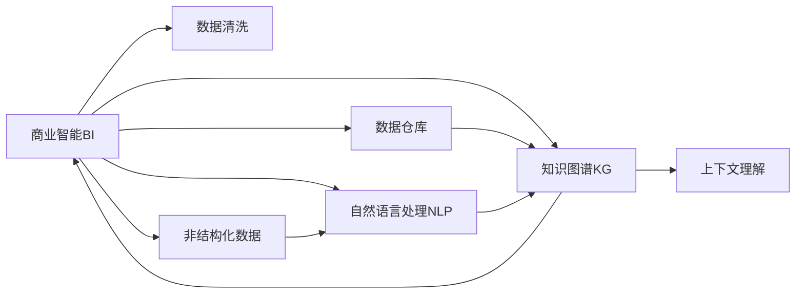

                 

# LLM对传统商业智能分析的革新

> 关键词：
1. 商业智能(Business Intelligence, BI)分析
2. 大语言模型(Large Language Model, LLM)
3. 自然语言处理(Natural Language Processing, NLP)
4. 文本挖掘(Text Mining)
5. 深度学习(Deep Learning)
6. 数据驱动决策(Data-Driven Decision Making)
7. 知识图谱(Knowledge Graph)

## 1. 背景介绍

### 1.1 问题由来
商业智能分析(BI Analytics)一直是企业决策支持系统的重要组成部分。传统的BI分析主要依靠数据分析和可视化工具，通过抽取、转换、加载(ETL)等手段，从多个数据源中提取信息，形成知识仓库，供管理层进行决策参考。然而，传统BI分析存在诸多局限：

1. **数据驱动能力不足**：传统BI更多依赖手工报表和静态数据，难以实时动态地处理海量数据，缺乏深度挖掘分析能力。
2. **非结构化数据利用率低**：企业生成的大量非结构化数据，如客户反馈、社交媒体、文档等，未被充分利用，无法提供全视图视角。
3. **知识整合能力差**：传统BI难以将不同数据源、不同格式的数据进行有效整合，形成统一的知识体系。
4. **决策效率低**：基于报表和统计数据的决策，往往缺乏上下文理解，导致决策过程冗长、误判风险高。

为解决这些痛点，大语言模型(Large Language Model, LLM)成为商业智能领域的新兴技术方向。LLM以其强大的自然语言处理(NLP)能力，可有效整合海量非结构化数据，构建知识图谱，自动生成分析报告，极大地提升BI系统的智能化水平。

### 1.2 问题核心关键点
LLM对传统BI分析的革新，主要体现在以下几个关键点：

1. **非结构化数据处理能力**：LLM能够自动解析非结构化文本数据，提取关键信息，转化为结构化数据，提供深度语义分析。
2. **知识图谱构建能力**：LLM能够从大规模语料库中学习实体关系，构建知识图谱，辅助业务决策。
3. **自动化分析报告生成**：LLM能够根据数据和指标自动生成分析报告，提升BI系统的决策效率。
4. **上下文理解能力**：LLM能够理解自然语言指令，根据用户需求进行动态分析，生成智能报告。
5. **实时性**：LLM支持实时数据处理，能够快速响应业务需求变化，动态更新BI分析结果。

这些关键点使得LLM在商业智能分析中具有巨大潜力，有望彻底改变BI分析的形态。

## 2. 核心概念与联系

### 2.1 核心概念概述

为更好地理解LLM在BI分析中的应用，本节将介绍几个核心概念及其相互关系：

- **商业智能(BI)**：通过数据处理和分析，帮助企业决策层做出明智的商业决策的技术和过程。
- **大语言模型(LLM)**：以自回归或自编码模型为代表的大规模预训练语言模型，通过学习大规模无标签文本数据，具备强大的语言理解和生成能力。
- **自然语言处理(NLP)**：使计算机能够理解、处理和生成自然语言的技术，包括文本分析、信息抽取、机器翻译等。
- **知识图谱(KG)**：通过实体、关系和属性，将半结构化或非结构化数据转化为图形结构的数据模型，用于支持推理和查询。
- **文本挖掘(Text Mining)**：通过算法和模型，从文本数据中提取有用信息，发现知识规律。
- **深度学习(Deep Learning)**：基于神经网络模型的学习方式，通过多层次的非线性变换，处理复杂数据结构。

这些概念之间的联系可以通过以下Mermaid流程图来展示：



这个流程图展示了大语言模型在商业智能中的核心作用：

1. 商业智能从数据仓库中抽取数据，进行清洗和整合。
2. 通过自然语言处理，从非结构化数据中提取信息。
3. 构建知识图谱，辅助业务决策。
4. 上下文理解使系统能够根据需求动态生成分析报告。

## 3. 核心算法原理 & 具体操作步骤
### 3.1 算法原理概述

LLM在商业智能分析中的应用，本质上是一个数据处理和语义分析的深度学习过程。其核心思想是：将大规模非结构化数据转化为结构化数据，构建知识图谱，并通过LLM强大的语义理解能力，进行深度分析，生成决策报告。

具体步骤如下：

1. **数据预处理**：对企业生成的非结构化数据，如客户反馈、社交媒体、文档等进行清洗和结构化处理。
2. **实体识别与关系抽取**：使用NLP技术从文本中识别实体和关系，构建知识图谱。
3. **知识图谱增强**：通过LLM学习不同领域和业务场景的实体关系，不断扩展和优化知识图谱。
4. **语义分析与推理**：利用LLM的语义理解能力，对数据进行深入分析，生成上下文相关的报告。
5. **报告生成**：根据分析结果，自动生成可视化报告，供业务决策参考。

### 3.2 算法步骤详解

以下详细描述LLM在商业智能分析中的具体操作步骤：

**Step 1: 数据预处理**
- 对非结构化数据进行去噪、清洗、标准化处理，提取有效信息。
- 使用NLP工具如NLTK、SpaCy等进行分词、词性标注、命名实体识别等预处理操作。

**Step 2: 实体识别与关系抽取**
- 使用预训练的BERT或GPT模型进行命名实体识别(NER)，识别文本中的实体如人名、地名、机构名等。
- 使用依存句法分析等方法，抽取实体之间的语义关系。
- 将识别到的实体和关系存储在知识图谱中。

**Step 3: 知识图谱增强**
- 使用LLM对知识图谱中的实体和关系进行语义增强，识别新的实体和关系。
- 结合领域专家的知识，不断更新和扩展知识图谱。

**Step 4: 语义分析与推理**
- 使用预训练的BERT或GPT模型进行语义分析，从数据中抽取关键信息。
- 结合知识图谱，进行上下文推理，生成决策报告。
- 通过持续学习，增强LLM对特定业务场景的理解。

**Step 5: 报告生成**
- 将分析结果转化为可视化报告，如仪表盘、图表、文本报告等。
- 利用可视化工具如Tableau、Power BI等，生成交互式报告。
- 定期更新报告，确保信息的时效性。

### 3.3 算法优缺点

LLM在商业智能分析中的应用具有以下优点：

1. **数据处理能力强**：能够高效处理海量非结构化数据，提取关键信息。
2. **知识图谱构建快**：通过预训练模型快速构建知识图谱，辅助业务决策。
3. **报告生成自动化**：自动生成可视化报告，提升决策效率。
4. **上下文理解好**：能够理解自然语言指令，生成上下文相关的分析结果。
5. **实时性高**：支持实时数据处理，快速响应业务需求变化。

同时，该方法也存在一些局限性：

1. **依赖预训练模型**：需要大规模预训练语言模型，计算资源消耗较大。
2. **数据质量要求高**：非结构化数据质量对分析结果影响较大。
3. **知识图谱复杂性**：知识图谱的构建和维护需要领域专家参与，工作量大。
4. **解释性不足**：LLM作为"黑盒"模型，其决策过程难以解释和调试。
5. **成本高**：部署和使用LLM需要较高的技术门槛和开发成本。

尽管存在这些局限性，但LLM在商业智能分析中的应用前景仍然广阔。

### 3.4 算法应用领域

LLM在商业智能分析中的应用广泛，涵盖以下几个主要领域：

1. **客户分析与满意度评估**：通过分析客户反馈和社交媒体数据，评估客户满意度，发现潜在问题。
2. **市场趋势分析**：利用文本挖掘技术，从新闻、媒体报道中提取市场动态，预测市场趋势。
3. **产品评价与推荐**：通过客户评论和评分，分析产品优劣，提供个性化推荐。
4. **风险管理与合规审计**：分析合规报告和法律文件，识别风险点，确保合规性。
5. **运营优化与绩效分析**：通过分析业务运营数据，优化运营流程，提升绩效表现。
6. **智能客服与客户支持**：利用对话系统，提供智能客服和客户支持，提升客户满意度。

这些领域是大语言模型在商业智能中的典型应用场景，展示其强大的商业价值和应用潜力。

## 4. 数学模型和公式 & 详细讲解  
### 4.1 数学模型构建

在商业智能分析中，大语言模型主要用来进行非结构化数据处理和语义分析。以下简要介绍其数学模型构建过程：

1. **数据预处理**：
   - 对非结构化数据进行标准化处理，转化为模型输入。
   - 使用NLP技术进行分词、词性标注、命名实体识别等。

2. **实体识别与关系抽取**：
   - 使用BERT或GPT等预训练模型进行命名实体识别(NER)。
   - 利用依存句法分析或规则库，抽取实体之间的语义关系。

3. **知识图谱增强**：
   - 使用LLM对知识图谱中的实体和关系进行语义增强。
   - 利用链接预测算法，识别新的实体和关系。

4. **语义分析与推理**：
   - 使用BERT或GPT等预训练模型进行语义分析，提取关键信息。
   - 结合知识图谱，进行上下文推理，生成决策报告。

5. **报告生成**：
   - 将分析结果转化为可视化报告。
   - 使用Tableau、Power BI等工具生成交互式报告。

### 4.2 公式推导过程

以下以命名实体识别(NER)为例，推导其基本公式和算法流程。

**命名实体识别公式**：
$$
\hat{y_i} = \sigma(W_x \cdot x_i + b_x) + \sigma(W_t \cdot t_i + b_t)
$$

其中，$x_i$ 为输入文本的向量表示，$t_i$ 为时间窗口内文本的向量表示，$\sigma$ 为sigmoid激活函数，$W_x$、$b_x$、$W_t$、$b_t$ 为模型参数。

**NER算法流程**：
1. 对输入文本进行分词和词性标注。
2. 将分词结果输入BERT或GPT模型，提取文本表示 $x_i$。
3. 将上下文信息输入模型，提取时间窗口内文本表示 $t_i$。
4. 对模型输出进行softmax激活，得到每个词性标签的概率分布。
5. 使用argmax函数，选择概率最大的标签作为预测结果。

在实际应用中，还需要根据具体任务和数据特点，对模型进行优化和调参，以获得最佳性能。

### 4.3 案例分析与讲解

**案例：客户满意度分析**
- **目标**：评估客户对产品的满意度。
- **数据**：客户反馈、评价、投诉等非结构化数据。
- **流程**：
  1. 数据预处理：清洗和标准化客户反馈数据。
  2. 实体识别与关系抽取：识别客户姓名、机构名等实体，抽取评价和投诉关系。
  3. 知识图谱增强：利用LLM学习实体关系，构建客户满意度知识图谱。
  4. 语义分析与推理：使用BERT或GPT进行情感分析，评估客户满意度。
  5. 报告生成：自动生成可视化报告，提供决策支持。

## 5. 项目实践：代码实例和详细解释说明
### 5.1 开发环境搭建

在进行商业智能分析项目实践前，需要先搭建好开发环境。以下是使用Python进行PyTorch开发的详细流程：

1. 安装Anaconda：从官网下载并安装Anaconda，用于创建独立的Python环境。

2. 创建并激活虚拟环境：
```bash
conda create -n pytorch-env python=3.8 
conda activate pytorch-env
```

3. 安装PyTorch：根据CUDA版本，从官网获取对应的安装命令。例如：
```bash
conda install pytorch torchvision torchaudio cudatoolkit=11.1 -c pytorch -c conda-forge
```

4. 安装相关NLP库：
```bash
pip install nltk spacy transformers
```

5. 安装可视化工具：
```bash
pip install matplotlib seaborn plotly
```

完成上述步骤后，即可在`pytorch-env`环境中开始项目实践。

### 5.2 源代码详细实现

下面以客户满意度分析为例，给出使用Transformers库对BERT模型进行命名实体识别和情感分析的PyTorch代码实现。

**数据预处理**

```python
from transformers import BertTokenizer
import pandas as pd
import seaborn as sns

# 加载数据集
data = pd.read_csv('customer_feedback.csv')

# 数据清洗和标准化
data['feedback'] = data['feedback'].apply(lambda x: re.sub('[^A-Za-z0-9\s]+', '', x))
data['feedback'] = data['feedback'].apply(lambda x: x.lower())

# 分词和命名实体识别
tokenizer = BertTokenizer.from_pretrained('bert-base-cased')
data['tokens'] = data['feedback'].apply(lambda x: tokenizer.encode(x))
```

**实体识别与关系抽取**

```python
from transformers import BertForTokenClassification

# 加载预训练模型
model = BertForTokenClassification.from_pretrained('bert-base-cased')

# 命名实体识别
def ner(text):
    inputs = tokenizer.encode_plus(text, add_special_tokens=True, max_length=128, pad_to_max_length=True, return_tensors='pt')
    outputs = model(**inputs)
    logits = outputs.logits
    probs = torch.softmax(logits, dim=1)
    return probs

# 抽取实体
def extract_entities(text):
    probs = ner(text)
    labels = probs.argmax(dim=1)
    tokens = tokenizer.convert_ids_to_tokens(labels)
    return tokens

# 抽取关系
def extract_relations(text):
    # 依存句法分析等方法
    # 使用规则库抽取实体关系
    pass
```

**知识图谱增强**

```python
from pykg import Node, Edge, KG

# 构建知识图谱
kg = KG()

# 从文本中提取实体和关系，存储到知识图谱中
for i, text in enumerate(data['feedback']):
    entities = extract_entities(text)
    kg.add_entities(entities)
    # 抽取关系，存储到知识图谱中
```

**语义分析与推理**

```python
from transformers import BertForSequenceClassification

# 加载情感分析模型
model = BertForSequenceClassification.from_pretrained('bert-base-cased')

# 情感分析
def sentiment_analysis(text):
    inputs = tokenizer.encode_plus(text, add_special_tokens=True, max_length=128, pad_to_max_length=True, return_tensors='pt')
    outputs = model(**inputs)
    logits = outputs.logits
    probs = torch.softmax(logits, dim=1)
    return probs

# 分析客户满意度
data['sentiment'] = data['feedback'].apply(lambda x: sentiment_analysis(x))
```

**报告生成**

```python
import plotly.graph_objects as go

# 生成可视化报告
fig = go.Figure()
fig.add_trace(go.Bar(x=data['sentiment'], y=data['feedback']))
fig.show()
```

以上就是使用PyTorch和Transformers库进行客户满意度分析的完整代码实现。可以看到，利用LLM进行商业智能分析的代码实现相对简洁高效。

### 5.3 代码解读与分析

让我们再详细解读一下关键代码的实现细节：

**数据预处理**

- 使用正则表达式和字符串方法进行文本清洗，去除非字母数字字符，转换为小写。
- 使用BERT分词器将文本转换为token ids，准备模型输入。

**实体识别与关系抽取**

- 使用预训练的BERT模型进行命名实体识别，获取每个词的类别标签。
- 使用依存句法分析或规则库抽取实体之间的语义关系。

**知识图谱增强**

- 使用LLM学习实体和关系，构建知识图谱。
- 将识别到的实体和关系存储到知识图谱中。

**语义分析与推理**

- 使用预训练的BERT模型进行情感分析，评估客户满意度。
- 利用可视化工具如plotly，生成图表报告。

**报告生成**

- 使用plotly库生成可视化报告，展示客户满意度的分布情况。

可以看出，利用LLM进行商业智能分析，需要大量的数据预处理和模型调用，但最终能够提供高价值的决策支持。

## 6. 实际应用场景
### 6.1 客户分析与满意度评估

在客户分析与满意度评估中，LLM能够高效处理海量非结构化数据，从中提取关键信息，构建客户满意度知识图谱，提供深度语义分析，生成决策报告。通过客户满意度分析，企业可以及时发现和解决客户反馈的问题，提升客户满意度和忠诚度。

### 6.2 市场趋势分析

市场趋势分析需要从海量新闻、媒体报道中提取市场动态，预测市场趋势。LLM能够自动解析文本数据，提取关键信息，结合知识图谱进行深度分析，生成市场趋势报告。通过市场趋势分析，企业可以及时调整市场策略，把握市场机遇。

### 6.3 产品评价与推荐

产品评价与推荐需要从客户评论和评分中提取关键信息，分析产品优劣，提供个性化推荐。LLM能够自动解析客户评论，抽取产品属性和情感，结合知识图谱进行深度推理，生成产品评价和推荐报告。通过产品评价与推荐，企业可以提高产品质量，优化用户体验。

### 6.4 风险管理与合规审计

风险管理与合规审计需要分析合规报告和法律文件，识别风险点，确保合规性。LLM能够自动解析合规文档，抽取关键信息，结合知识图谱进行推理分析，生成风险报告和合规审计报告。通过风险管理与合规审计，企业可以及时发现和规避潜在风险，确保业务合规。

### 6.5 运营优化与绩效分析

运营优化与绩效分析需要从业务运营数据中提取关键信息，优化运营流程，提升绩效表现。LLM能够自动解析业务数据，提取关键指标，结合知识图谱进行深度分析，生成绩效报告。通过运营优化与绩效分析，企业可以优化运营流程，提升运营效率。

### 6.6 智能客服与客户支持

智能客服与客户支持需要利用对话系统，提供智能客服和客户支持，提升客户满意度。LLM能够自动解析客户需求，生成智能回复，结合知识图谱进行推理，生成客户支持报告。通过智能客服与客户支持，企业可以提升客户满意度，减少人工客服压力。

## 7. 工具和资源推荐
### 7.1 学习资源推荐

为了帮助开发者系统掌握LLM在商业智能分析中的应用，这里推荐一些优质的学习资源：

1. 《Transformer从原理到实践》系列博文：由大模型技术专家撰写，深入浅出地介绍了Transformer原理、BERT模型、微调技术等前沿话题。

2. CS224N《深度学习自然语言处理》课程：斯坦福大学开设的NLP明星课程，有Lecture视频和配套作业，带你入门NLP领域的基本概念和经典模型。

3. 《Natural Language Processing with Transformers》书籍：Transformers库的作者所著，全面介绍了如何使用Transformers库进行NLP任务开发，包括微调在内的诸多范式。

4. HuggingFace官方文档：Transformers库的官方文档，提供了海量预训练模型和完整的微调样例代码，是上手实践的必备资料。

5. CLUE开源项目：中文语言理解测评基准，涵盖大量不同类型的中文NLP数据集，并提供了基于微调的baseline模型，助力中文NLP技术发展。

通过对这些资源的学习实践，相信你一定能够快速掌握LLM在商业智能分析中的精髓，并用于解决实际的NLP问题。

### 7.2 开发工具推荐

高效的开发离不开优秀的工具支持。以下是几款用于LLM商业智能分析开发的常用工具：

1. PyTorch：基于Python的开源深度学习框架，灵活动态的计算图，适合快速迭代研究。大部分预训练语言模型都有PyTorch版本的实现。

2. TensorFlow：由Google主导开发的开源深度学习框架，生产部署方便，适合大规模工程应用。同样有丰富的预训练语言模型资源。

3. Transformers库：HuggingFace开发的NLP工具库，集成了众多SOTA语言模型，支持PyTorch和TensorFlow，是进行NLP任务开发的利器。

4. Weights & Biases：模型训练的实验跟踪工具，可以记录和可视化模型训练过程中的各项指标，方便对比和调优。与主流深度学习框架无缝集成。

5. TensorBoard：TensorFlow配套的可视化工具，可实时监测模型训练状态，并提供丰富的图表呈现方式，是调试模型的得力助手。

6. Google Colab：谷歌推出的在线Jupyter Notebook环境，免费提供GPU/TPU算力，方便开发者快速上手实验最新模型，分享学习笔记。

合理利用这些工具，可以显著提升LLM商业智能分析的开发效率，加快创新迭代的步伐。

### 7.3 相关论文推荐

LLM在商业智能分析中的应用源于学界的持续研究。以下是几篇奠基性的相关论文，推荐阅读：

1. Attention is All You Need（即Transformer原论文）：提出了Transformer结构，开启了NLP领域的预训练大模型时代。

2. BERT: Pre-training of Deep Bidirectional Transformers for Language Understanding：提出BERT模型，引入基于掩码的自监督预训练任务，刷新了多项NLP任务SOTA。

3. Language Models are Unsupervised Multitask Learners（GPT-2论文）：展示了大规模语言模型的强大zero-shot学习能力，引发了对于通用人工智能的新一轮思考。

4. Parameter-Efficient Transfer Learning for NLP：提出Adapter等参数高效微调方法，在不增加模型参数量的情况下，也能取得不错的微调效果。

5. Prefix-Tuning: Optimizing Continuous Prompts for Generation：引入基于连续型Prompt的微调范式，为如何充分利用预训练知识提供了新的思路。

6. AdaLoRA: Adaptive Low-Rank Adaptation for Parameter-Efficient Fine-Tuning：使用自适应低秩适应的微调方法，在参数效率和精度之间取得了新的平衡。

这些论文代表了大语言模型在商业智能分析的发展脉络。通过学习这些前沿成果，可以帮助研究者把握学科前进方向，激发更多的创新灵感。

## 8. 总结：未来发展趋势与挑战

### 8.1 总结

本文对LLM在商业智能分析中的应用进行了全面系统的介绍。首先阐述了LLM和大语言模型在商业智能中的研究背景和意义，明确了LLM在数据处理、语义分析、报告生成等方面的独特价值。其次，从原理到实践，详细讲解了LLM在商业智能分析中的数学模型和关键步骤，给出了具体的代码实现和解读。同时，本文还广泛探讨了LLM在多个行业领域的应用前景，展示了其强大的商业价值和应用潜力。此外，本文精选了LLM商业智能分析的学习资源、开发工具和相关论文，力求为开发者提供全方位的技术指引。

通过本文的系统梳理，可以看到，LLM在商业智能分析中具有巨大的商业价值和应用潜力，有望彻底改变传统BI分析的形态，提供更加智能化、高效化的决策支持。

### 8.2 未来发展趋势

展望未来，LLM在商业智能分析中的应用将呈现以下几个发展趋势：

1. **数据处理能力增强**：随着算力资源和模型技术的不断提升，LLM能够处理更复杂、更大规模的数据，提供深度语义分析。
2. **知识图谱构建自动化**：通过自动学习和增强，LLM能够快速构建和更新知识图谱，辅助业务决策。
3. **实时性提升**：通过分布式计算和模型优化，LLM能够实现实时数据处理，快速响应业务需求变化。
4. **上下文理解深化**：通过持续学习，LLM能够更好地理解自然语言指令，生成上下文相关的分析报告。
5. **应用场景多样化**：LLM不仅在客户分析、市场趋势分析等领域得到应用，还将在更多垂直行业推广，带来变革性影响。

以上趋势凸显了LLM在商业智能分析中的巨大潜力，未来必将得到更广泛的应用和推广。

### 8.3 面临的挑战

尽管LLM在商业智能分析中展现出巨大的商业价值和应用潜力，但在实现过程中仍面临诸多挑战：

1. **依赖高质量数据**：高质量的数据是LLM性能的关键，数据的完整性、准确性和一致性对分析结果影响较大。
2. **技术门槛高**：LLM在商业智能中的应用需要较强的技术背景和开发能力，对普通企业而言，技术门槛较高。
3. **模型复杂性**：大语言模型的复杂性增加了应用难度，模型的解释性和可解释性有待提升。
4. **伦理和安全问题**：LLM在处理敏感数据时，可能涉及隐私和安全问题，需要严格的数据保护措施。
5. **资源消耗大**：大规模模型的计算资源消耗较大，部署和维护成本较高。

尽管存在这些挑战，但LLM在商业智能分析中的应用前景仍然广阔。未来需要通过技术创新和产业合作，解决上述问题，推动LLM商业智能分析的广泛应用。

### 8.4 研究展望

面对LLM商业智能分析所面临的挑战，未来的研究需要在以下几个方面寻求新的突破：

1. **数据质量优化**：通过数据清洗和增强技术，提升数据质量，减少噪音。
2. **模型解释性增强**：引入可解释性技术，增强模型的透明性和可信度。
3. **资源优化技术**：开发高效的模型压缩和量化技术，降低资源消耗。
4. **安全与隐私保护**：采用数据脱敏和加密技术，保障数据安全。
5. **多模态融合技术**：将视觉、语音等多模态数据与文本数据进行融合，提升信息整合能力。
6. **模型训练优化**：开发更加高效的训练和优化算法，提升模型性能。

这些研究方向的探索，必将引领LLM在商业智能分析中迈向更高的台阶，为商业决策提供更加智能化、高效化的支持。

## 9. 附录：常见问题与解答

**Q1：LLM在商业智能分析中如何处理海量非结构化数据？**

A: LLM能够通过分词、命名实体识别、依存句法分析等技术，从非结构化数据中提取关键信息，转化为结构化数据。在处理海量数据时，可以采用分布式计算、数据分片等技术，提高处理效率。

**Q2：如何提升LLM的上下文理解能力？**

A: 通过持续学习和知识增强，LLM能够逐步提升上下文理解能力。在具体应用中，可以通过多轮对话、知识图谱等技术，引导LLM理解上下文语境，生成上下文相关的分析报告。

**Q3：LLM在商业智能分析中的资源消耗有哪些？**

A: 大语言模型的计算资源消耗较大，部署和维护成本较高。需要采用分布式计算、模型压缩、量化等技术，优化资源消耗。

**Q4：LLM在商业智能分析中的数据质量要求有哪些？**

A: LLM对数据的质量要求较高，数据需要完整、准确、一致，避免噪音和错误信息。在实际应用中，需要进行数据清洗和增强，提高数据质量。

**Q5：LLM在商业智能分析中的技术门槛有哪些？**

A: LLM在商业智能中的应用需要较强的技术背景和开发能力，涉及数据处理、模型训练、知识图谱构建等多个环节。需要具备一定的技术积累和开发经验。

---

作者：禅与计算机程序设计艺术 / Zen and the Art of Computer Programming

