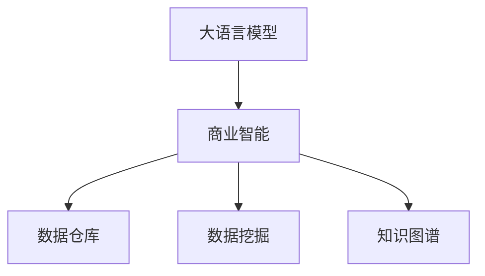

                 

# LLM对传统商业智能的革新

在数字化浪潮的推动下，商业智能(Business Intelligence, BI)已成为企业决策支持的重要手段。传统商业智能系统依赖于海量历史数据和复杂统计模型，但在面对日益复杂多变的市场环境时，传统BI系统的数据处理能力和决策支持精度已显得力不从心。而新一代基于大语言模型(Large Language Model, LLM)的商业智能系统，通过将自然语言处理(NLP)技术深度融入商业决策过程，提供了全新的数据解读和洞察能力，将深刻革新商业智能的形态。

本文将深入探讨LLM在商业智能领域的应用，从核心概念入手，阐述其原理、操作流程和优势，并通过实际案例展示LLM对传统BI的革新效果。同时，本文还将提出未来发展趋势和面临的挑战，探讨LLM在商业智能领域的前景和研究方向。

## 1. 背景介绍

### 1.1 问题由来

传统商业智能系统依赖于历史数据的统计分析和数据仓库技术，帮助企业提取有价值的信息，支持决策过程。然而，传统BI系统在面对动态多变的数据和复杂决策问题时，存在着以下不足：

- 数据处理能力不足。传统BI系统难以处理实时数据流和多维度、非结构化数据，无法捕捉实时市场变化。
- 决策支持精度不高。依赖统计模型进行分析，对输入数据和模型参数高度敏感，无法准确预测市场趋势。
- 系统灵活性较差。BI系统设计时固定了分析框架和输出格式，难以适应不同业务场景的灵活需求。
- 用户体验不佳。统计模型输出的结果往往复杂难懂，决策者难以直接从BI系统获得直观洞察。

在数字化时代，企业需要更加灵活、精准、智能的决策支持工具。大语言模型通过自然语言理解和生成能力，能够有效弥补传统BI系统的不足，提供更加高效、智能的决策支持服务。

### 1.2 问题核心关键点

LLM在商业智能领域的革新主要体现在以下几个关键点：

- 强大的自然语言处理能力。LLM能够理解并生成自然语言，提供文本分析、情感分析等能力，帮助企业提取和解读文本数据中的关键信息。
- 深度学习模型的泛化能力。LLM通过大规模无标签数据预训练，具备良好的泛化能力，能够在新的商业场景下快速适应并表现优异。
- 高效的数据整合和推理能力。LLM能够自动整合多源异构数据，进行因果推断和概率推理，提升决策支持精度。
- 灵活的业务适配能力。通过任务适配层的灵活设计，LLM能够适应不同的商业场景，支持多样化的决策需求。
- 用户友好的交互体验。LLM能够以自然语言形式输出决策结果，提升决策者的用户体验。

这些核心关键点使得LLM成为商业智能领域革新的一大利器，为企业提供了全新的决策支持工具。

## 2. 核心概念与联系

### 2.1 核心概念概述

为更好地理解LLM在商业智能中的应用，本节将介绍几个密切相关的核心概念：

- 大语言模型(Large Language Model, LLM)：以自回归(如GPT)或自编码(如BERT)模型为代表的大规模预训练语言模型。通过在大规模无标签文本语料上进行预训练，学习通用的语言表示，具备强大的语言理解和生成能力。

- 商业智能(Business Intelligence, BI)：通过收集、处理和分析企业内部和外部的数据，为决策者提供信息支持和决策依据，以提升企业运营效率和竞争力。

- 数据仓库(Data Warehouse)：用于集中存储和管理企业历史数据的设施，支持多维数据分析和报告生成。

- 数据挖掘(Data Mining)：通过机器学习技术从大数据中提取有价值的信息和知识，帮助企业发现潜在的商业机会。

- 知识图谱(Knowledge Graph)：以图结构形式组织和存储企业知识，支持更深入的因果分析和推理。

这些核心概念之间的逻辑关系可以通过以下Mermaid流程图来展示：



这个流程图展示了大语言模型在商业智能系统中的核心作用：

1. 大语言模型通过预训练获得基础能力。
2. 商业智能系统将预训练模型当作信息提取工具，通过微调获得特定任务的优化的模型。
3. 数据仓库提供历史数据支持，数据挖掘提取有用知识，知识图谱加强因果推理。
4. 综合利用大语言模型的自然语言处理能力，商业智能系统实现了更强大的数据分析和决策支持能力。

## 3. 核心算法原理 & 具体操作步骤
### 3.1 算法原理概述

基于LLM的商业智能系统，本质上是一个将自然语言处理技术深度融合到数据分析和决策过程中的系统。其核心思想是：将预训练的大语言模型视作一个强大的信息提取和推理工具，通过微调获得特定商业场景下的优化的模型。

形式化地，假设预训练模型为 $M_{\theta}$，其中 $\theta$ 为预训练得到的模型参数。给定商业智能任务的训练集 $D=\{(x_i,y_i)\}_{i=1}^N$，商业智能的目标是找到新的模型参数 $\hat{\theta}$，使得：

$$
\hat{\theta}=\mathop{\arg\min}_{\theta} \mathcal{L}(M_{\theta},D)
$$

其中 $\mathcal{L}$ 为针对商业智能任务设计的损失函数，用于衡量模型预测输出与真实标签之间的差异。常见的损失函数包括交叉熵损失、均方误差损失等。

通过梯度下降等优化算法，微调过程不断更新模型参数 $\theta$，最小化损失函数 $\mathcal{L}$，使得模型输出逼近真实标签。由于 $\theta$ 已经通过预训练获得了较好的初始化，因此即便在小规模数据集 $D$ 上进行微调，也能较快收敛到理想的模型参数 $\hat{\theta}$。

### 3.2 算法步骤详解

基于LLM的商业智能微调一般包括以下几个关键步骤：

**Step 1: 准备预训练模型和数据集**
- 选择合适的预训练语言模型 $M_{\theta}$ 作为初始化参数，如 BERT、GPT 等。
- 准备商业智能任务的训练集 $D$，划分为训练集、验证集和测试集。一般要求训练集数据与预训练数据的分布不要差异过大。

**Step 2: 添加任务适配层**
- 根据商业智能任务类型，在预训练模型顶层设计合适的输出层和损失函数。
- 对于分类任务，通常在顶层添加线性分类器和交叉熵损失函数。
- 对于生成任务，通常使用语言模型的解码器输出概率分布，并以负对数似然为损失函数。

**Step 3: 设置微调超参数**
- 选择合适的优化算法及其参数，如 AdamW、SGD 等，设置学习率、批大小、迭代轮数等。
- 设置正则化技术及强度，包括权重衰减、Dropout、Early Stopping等。
- 确定冻结预训练参数的策略，如仅微调顶层，或全部参数都参与微调。

**Step 4: 执行梯度训练**
- 将训练集数据分批次输入模型，前向传播计算损失函数。
- 反向传播计算参数梯度，根据设定的优化算法和学习率更新模型参数。
- 周期性在验证集上评估模型性能，根据性能指标决定是否触发 Early Stopping。
- 重复上述步骤直到满足预设的迭代轮数或 Early Stopping 条件。

**Step 5: 测试和部署**
- 在测试集上评估微调后模型 $M_{\hat{\theta}}$ 的性能，对比微调前后的精度提升。
- 使用微调后的模型对新样本进行推理预测，集成到实际的应用系统中。
- 持续收集新的数据，定期重新微调模型，以适应数据分布的变化。

以上是基于LLM的商业智能微调的一般流程。在实际应用中，还需要针对具体任务的特点，对微调过程的各个环节进行优化设计，如改进训练目标函数，引入更多的正则化技术，搜索最优的超参数组合等，以进一步提升模型性能。

### 3.3 算法优缺点

基于LLM的商业智能微调方法具有以下优点：
1. 简单高效。只需准备少量标注数据，即可对预训练模型进行快速适配，获得较大的性能提升。
2. 通用适用。适用于各种商业智能任务，包括分类、匹配、生成等，设计简单的任务适配层即可实现微调。
3. 参数高效。利用参数高效微调技术，在固定大部分预训练参数的情况下，仍可取得不错的提升。
4. 效果显著。在学术界和工业界的诸多任务上，基于微调的方法已经刷新了最先进的性能指标。

同时，该方法也存在一定的局限性：
1. 依赖标注数据。微调的效果很大程度上取决于标注数据的质量和数量，获取高质量标注数据的成本较高。
2. 迁移能力有限。当目标任务与预训练数据的分布差异较大时，微调的性能提升有限。
3. 可解释性不足。微调模型的决策过程通常缺乏可解释性，难以对其推理逻辑进行分析和调试。

尽管存在这些局限性，但就目前而言，基于LLM的微调方法仍是大规模语言模型在商业智能领域的主要应用方式。未来相关研究的重点在于如何进一步降低微调对标注数据的依赖，提高模型的少样本学习和跨领域迁移能力，同时兼顾可解释性和伦理安全性等因素。

### 3.4 算法应用领域

基于LLM的商业智能微调方法在商业智能领域已经得到了广泛的应用，覆盖了几乎所有常见任务，例如：

- 市场分析：利用大量市场数据，识别市场趋势和关键因素。
- 客户画像：分析客户行为数据，生成精准的客户画像，支持个性化营销。
- 销售预测：预测销售趋势和产品需求，支持库存管理和运营优化。
- 财务分析：自动提取财务报表中的关键数据，进行财务预测和风险评估。
- 产品推荐：基于用户行为数据，推荐合适的产品或服务。
- 事件监测：实时监测并分析事件发生的原因和影响，支持应急响应和危机管理。

除了上述这些经典任务外，基于LLM的商业智能技术也被创新性地应用到更多场景中，如舆情分析、供应链管理、人力资源等，为商业智能技术带来了全新的突破。随着预训练模型和微调方法的不断进步，相信LLM在商业智能领域的应用将更加广泛，为企业的数字化转型和智能化管理提供强大的技术支持。

## 4. 数学模型和公式 & 详细讲解  
### 4.1 数学模型构建

本节将使用数学语言对基于LLM的商业智能微调过程进行更加严格的刻画。

记预训练语言模型为 $M_{\theta}$，其中 $\theta$ 为预训练得到的模型参数。假设商业智能任务的训练集为 $D=\{(x_i,y_i)\}_{i=1}^N$，其中 $x_i$ 为输入数据，$y_i$ 为商业智能任务的标签。

定义模型 $M_{\theta}$ 在数据样本 $(x,y)$ 上的损失函数为 $\ell(M_{\theta}(x),y)$，则在数据集 $D$ 上的经验风险为：

$$
\mathcal{L}(\theta) = \frac{1}{N} \sum_{i=1}^N \ell(M_{\theta}(x_i),y_i)
$$

微调的优化目标是最小化经验风险，即找到最优参数：

$$
\theta^* = \mathop{\arg\min}_{\theta} \mathcal{L}(\theta)
$$

在实践中，我们通常使用基于梯度的优化算法（如SGD、Adam等）来近似求解上述最优化问题。设 $\eta$ 为学习率，$\lambda$ 为正则化系数，则参数的更新公式为：

$$
\theta \leftarrow \theta - \eta \nabla_{\theta}\mathcal{L}(\theta) - \eta\lambda\theta
$$

其中 $\nabla_{\theta}\mathcal{L}(\theta)$ 为损失函数对参数 $\theta$ 的梯度，可通过反向传播算法高效计算。

### 4.2 公式推导过程

以下我们以财务分析任务为例，推导交叉熵损失函数及其梯度的计算公式。

假设模型 $M_{\theta}$ 在输入 $x$ 上的输出为 $\hat{y}=M_{\theta}(x) \in [0,1]$，表示样本属于正类的概率。真实标签 $y \in \{0,1\}$。则二分类交叉熵损失函数定义为：

$$
\ell(M_{\theta}(x),y) = -[y\log \hat{y} + (1-y)\log (1-\hat{y})]
$$

将其代入经验风险公式，得：

$$
\mathcal{L}(\theta) = -\frac{1}{N}\sum_{i=1}^N [y_i\log M_{\theta}(x_i)+(1-y_i)\log(1-M_{\theta}(x_i))]
$$

根据链式法则，损失函数对参数 $\theta_k$ 的梯度为：

$$
\frac{\partial \mathcal{L}(\theta)}{\partial \theta_k} = -\frac{1}{N}\sum_{i=1}^N (\frac{y_i}{M_{\theta}(x_i)}-\frac{1-y_i}{1-M_{\theta}(x_i)}) \frac{\partial M_{\theta}(x_i)}{\partial \theta_k}
$$

其中 $\frac{\partial M_{\theta}(x_i)}{\partial \theta_k}$ 可进一步递归展开，利用自动微分技术完成计算。

在得到损失函数的梯度后，即可带入参数更新公式，完成模型的迭代优化。重复上述过程直至收敛，最终得到适应商业智能任务的最优模型参数 $\theta^*$。

## 5. 项目实践：代码实例和详细解释说明
### 5.1 开发环境搭建

在进行商业智能微调实践前，我们需要准备好开发环境。以下是使用Python进行PyTorch开发的环境配置流程：

1. 安装Anaconda：从官网下载并安装Anaconda，用于创建独立的Python环境。

2. 创建并激活虚拟环境：
```bash
conda create -n pytorch-env python=3.8 
conda activate pytorch-env
```

3. 安装PyTorch：根据CUDA版本，从官网获取对应的安装命令。例如：
```bash
conda install pytorch torchvision torchaudio cudatoolkit=11.1 -c pytorch -c conda-forge
```

4. 安装Transformers库：
```bash
pip install transformers
```

5. 安装各类工具包：
```bash
pip install numpy pandas scikit-learn matplotlib tqdm jupyter notebook ipython
```

完成上述步骤后，即可在`pytorch-env`环境中开始微调实践。

### 5.2 源代码详细实现

下面我们以财务分析任务为例，给出使用Transformers库对BERT模型进行微调的PyTorch代码实现。

首先，定义财务分析任务的数据处理函数：

```python
from transformers import BertTokenizer
from torch.utils.data import Dataset
import torch

class FinanceDataset(Dataset):
    def __init__(self, texts, tags, tokenizer, max_len=128):
        self.texts = texts
        self.tags = tags
        self.tokenizer = tokenizer
        self.max_len = max_len
        
    def __len__(self):
        return len(self.texts)
    
    def __getitem__(self, item):
        text = self.texts[item]
        tags = self.tags[item]
        
        encoding = self.tokenizer(text, return_tensors='pt', max_length=self.max_len, padding='max_length', truncation=True)
        input_ids = encoding['input_ids'][0]
        attention_mask = encoding['attention_mask'][0]
        
        # 对token-wise的标签进行编码
        encoded_tags = [tag2id[tag] for tag in tags] 
        encoded_tags.extend([tag2id['O']] * (self.max_len - len(encoded_tags)))
        labels = torch.tensor(encoded_tags, dtype=torch.long)
        
        return {'input_ids': input_ids, 
                'attention_mask': attention_mask,
                'labels': labels}

# 标签与id的映射
tag2id = {'O': 0, 'profit': 1, 'loss': 2, 'growth': 3, 'decrease': 4, 'stability': 5}
id2tag = {v: k for k, v in tag2id.items()}

# 创建dataset
tokenizer = BertTokenizer.from_pretrained('bert-base-cased')

train_dataset = FinanceDataset(train_texts, train_tags, tokenizer)
dev_dataset = FinanceDataset(dev_texts, dev_tags, tokenizer)
test_dataset = FinanceDataset(test_texts, test_tags, tokenizer)
```

然后，定义模型和优化器：

```python
from transformers import BertForTokenClassification, AdamW

model = BertForTokenClassification.from_pretrained('bert-base-cased', num_labels=len(tag2id))

optimizer = AdamW(model.parameters(), lr=2e-5)
```

接着，定义训练和评估函数：

```python
from torch.utils.data import DataLoader
from tqdm import tqdm
from sklearn.metrics import classification_report

device = torch.device('cuda') if torch.cuda.is_available() else torch.device('cpu')
model.to(device)

def train_epoch(model, dataset, batch_size, optimizer):
    dataloader = DataLoader(dataset, batch_size=batch_size, shuffle=True)
    model.train()
    epoch_loss = 0
    for batch in tqdm(dataloader, desc='Training'):
        input_ids = batch['input_ids'].to(device)
        attention_mask = batch['attention_mask'].to(device)
        labels = batch['labels'].to(device)
        model.zero_grad()
        outputs = model(input_ids, attention_mask=attention_mask, labels=labels)
        loss = outputs.loss
        epoch_loss += loss.item()
        loss.backward()
        optimizer.step()
    return epoch_loss / len(dataloader)

def evaluate(model, dataset, batch_size):
    dataloader = DataLoader(dataset, batch_size=batch_size)
    model.eval()
    preds, labels = [], []
    with torch.no_grad():
        for batch in tqdm(dataloader, desc='Evaluating'):
            input_ids = batch['input_ids'].to(device)
            attention_mask = batch['attention_mask'].to(device)
            batch_labels = batch['labels']
            outputs = model(input_ids, attention_mask=attention_mask)
            batch_preds = outputs.logits.argmax(dim=2).to('cpu').tolist()
            batch_labels = batch_labels.to('cpu').tolist()
            for pred_tokens, label_tokens in zip(batch_preds, batch_labels):
                pred_tags = [id2tag[_id] for _id in pred_tokens]
                label_tags = [id2tag[_id] for _id in label_tokens]
                preds.append(pred_tags[:len(label_tokens)])
                labels.append(label_tags)
                
    print(classification_report(labels, preds))
```

最后，启动训练流程并在测试集上评估：

```python
epochs = 5
batch_size = 16

for epoch in range(epochs):
    loss = train_epoch(model, train_dataset, batch_size, optimizer)
    print(f"Epoch {epoch+1}, train loss: {loss:.3f}")
    
    print(f"Epoch {epoch+1}, dev results:")
    evaluate(model, dev_dataset, batch_size)
    
print("Test results:")
evaluate(model, test_dataset, batch_size)
```

以上就是使用PyTorch对BERT进行财务分析任务微调的完整代码实现。可以看到，得益于Transformers库的强大封装，我们可以用相对简洁的代码完成BERT模型的加载和微调。

### 5.3 代码解读与分析

让我们再详细解读一下关键代码的实现细节：

**FinanceDataset类**：
- `__init__`方法：初始化文本、标签、分词器等关键组件。
- `__len__`方法：返回数据集的样本数量。
- `__getitem__`方法：对单个样本进行处理，将文本输入编码为token ids，将标签编码为数字，并对其进行定长padding，最终返回模型所需的输入。

**tag2id和id2tag字典**：
- 定义了标签与数字id之间的映射关系，用于将token-wise的预测结果解码回真实的标签。

**训练和评估函数**：
- 使用PyTorch的DataLoader对数据集进行批次化加载，供模型训练和推理使用。
- 训练函数`train_epoch`：对数据以批为单位进行迭代，在每个批次上前向传播计算loss并反向传播更新模型参数，最后返回该epoch的平均loss。
- 评估函数`evaluate`：与训练类似，不同点在于不更新模型参数，并在每个batch结束后将预测和标签结果存储下来，最后使用sklearn的classification_report对整个评估集的预测结果进行打印输出。

**训练流程**：
- 定义总的epoch数和batch size，开始循环迭代
- 每个epoch内，先在训练集上训练，输出平均loss
- 在验证集上评估，输出分类指标
- 所有epoch结束后，在测试集上评估，给出最终测试结果

可以看到，PyTorch配合Transformers库使得BERT微调的代码实现变得简洁高效。开发者可以将更多精力放在数据处理、模型改进等高层逻辑上，而不必过多关注底层的实现细节。

当然，工业级的系统实现还需考虑更多因素，如模型的保存和部署、超参数的自动搜索、更灵活的任务适配层等。但核心的微调范式基本与此类似。

## 6. 实际应用场景
### 6.1 智能投资分析

基于LLM的商业智能系统，可以广泛应用于智能投资分析的构建。传统的量化投资依赖于复杂统计模型和手工规则，难以适应市场变化和数据结构变化。而使用微调的LLM，可以实时分析和解读市场数据，快速识别投资机会和风险，提升投资决策的科学性和精准度。

在技术实现上，可以收集历史交易数据、新闻、社交媒体等数据，作为训练集和验证集。将文本数据输入模型，训练模型对市场走势、公司基本面等进行预测和分析。对于新的市场事件或数据变化，还可以实时接入到模型中进行推理，动态调整投资策略。如此构建的智能投资系统，能显著提升投资者的收益和风险控制能力。

### 6.2 运营优化管理

基于LLM的商业智能系统，可以应用于企业的运营优化管理，帮助企业提升资源利用效率和运营响应速度。通过收集企业内部和外部的运营数据，LLM可以实时分析并预测生产、库存、物流等关键指标，提出优化建议。

在具体应用上，可以针对不同的业务场景设计专用的微调模型，如生产调度、供应链管理等。模型通过历史数据和实时数据进行联合训练，实时输出优化方案和预警提示，帮助企业快速应对运营中的各种问题，提升运营管理的智能化水平。

### 6.3 风险评估与预警

基于LLM的商业智能系统，还可以应用于企业风险评估与预警。通过收集市场、客户、竞争对手等各类数据，LLM可以自动识别潜在的风险点，并预测风险发生的概率和影响程度。对于高风险事件，系统自动触发预警，帮助企业及时采取措施，规避潜在的损失。

例如，在金融领域，LLM可以通过分析客户财务数据、市场新闻和交易行为，识别潜在的欺诈风险和市场波动风险，帮助银行和金融机构进行风险管理。在供应链管理中，LLM可以监控供应商交付、库存变化等关键指标，及时发现异常并发出预警，帮助企业减少库存积压和损失。

### 6.4 未来应用展望

随着LLM和微调方法的不断发展，基于LLM的商业智能系统将在更多领域得到应用，为传统行业带来变革性影响。

在智慧医疗领域，基于微调的医疗分析系统将提升医疗数据的解读能力，辅助医生进行诊断和治疗决策，提升医疗服务的智能化水平。

在智能教育领域，微调技术可应用于学情分析、知识推荐等方面，因材施教，促进教育公平，提高教学质量。

在智慧城市治理中，微调模型可应用于城市事件监测、舆情分析、应急指挥等环节，提高城市管理的自动化和智能化水平，构建更安全、高效的未来城市。

此外，在企业生产、社会治理、文娱传媒等众多领域，基于大语言模型的商业智能应用也将不断涌现，为经济社会发展注入新的动力。相信随着技术的日益成熟，微调方法将成为商业智能落地的重要范式，推动人工智能技术在垂直行业的规模化落地。总之，LLM在商业智能领域的应用前景广阔，未来的发展将带来深远的影响。

## 7. 工具和资源推荐
### 7.1 学习资源推荐

为了帮助开发者系统掌握LLM在商业智能中的应用，这里推荐一些优质的学习资源：

1. 《Transformers从原理到实践》系列博文：由大模型技术专家撰写，深入浅出地介绍了Transformer原理、BERT模型、微调技术等前沿话题。

2. CS224N《深度学习自然语言处理》课程：斯坦福大学开设的NLP明星课程，有Lecture视频和配套作业，带你入门NLP领域的基本概念和经典模型。

3. 《Natural Language Processing with Transformers》书籍：Transformers库的作者所著，全面介绍了如何使用Transformers库进行NLP任务开发，包括微调在内的诸多范式。

4. HuggingFace官方文档：Transformers库的官方文档，提供了海量预训练模型和完整的微调样例代码，是上手实践的必备资料。

5. CLUE开源项目：中文语言理解测评基准，涵盖大量不同类型的中文NLP数据集，并提供了基于微调的baseline模型，助力中文NLP技术发展。

通过对这些资源的学习实践，相信你一定能够快速掌握LLM在商业智能中的应用，并用于解决实际的商业智能问题。
###  7.2 开发工具推荐

高效的开发离不开优秀的工具支持。以下是几款用于LLM微调开发的常用工具：

1. PyTorch：基于Python的开源深度学习框架，灵活动态的计算图，适合快速迭代研究。大部分预训练语言模型都有PyTorch版本的实现。

2. TensorFlow：由Google主导开发的开源深度学习框架，生产部署方便，适合大规模工程应用。同样有丰富的预训练语言模型资源。

3. Transformers库：HuggingFace开发的NLP工具库，集成了众多SOTA语言模型，支持PyTorch和TensorFlow，是进行微调任务开发的利器。

4. Weights & Biases：模型训练的实验跟踪工具，可以记录和可视化模型训练过程中的各项指标，方便对比和调优。与主流深度学习框架无缝集成。

5. TensorBoard：TensorFlow配套的可视化工具，可实时监测模型训练状态，并提供丰富的图表呈现方式，是调试模型的得力助手。

6. Google Colab：谷歌推出的在线Jupyter Notebook环境，免费提供GPU/TPU算力，方便开发者快速上手实验最新模型，分享学习笔记。

合理利用这些工具，可以显著提升LLM微调的开发效率，加快创新迭代的步伐。

### 7.3 相关论文推荐

LLM在商业智能领域的应用源于学界的持续研究。以下是几篇奠基性的相关论文，推荐阅读：

1. Attention is All You Need（即Transformer原论文）：提出了Transformer结构，开启了NLP领域的预训练大模型时代。

2. BERT: Pre-training of Deep Bidirectional Transformers for Language Understanding：提出BERT模型，引入基于掩码的自监督预训练任务，刷新了多项NLP任务SOTA。

3. Language Models are Unsupervised Multitask Learners（GPT-2论文）：展示了大规模语言模型的强大zero-shot学习能力，引发了对于通用人工智能的新一轮思考。

4. Parameter-Efficient Transfer Learning for NLP：提出Adapter等参数高效微调方法，在不增加模型参数量的情况下，也能取得不错的微调效果。

5. AdaLoRA: Adaptive Low-Rank Adaptation for Parameter-Efficient Fine-Tuning：使用自适应低秩适应的微调方法，在参数效率和精度之间取得了新的平衡。

6. AdaLoRA: Adaptive Low-Rank Adaptation for Parameter-Efficient Fine-Tuning：使用自适应低秩适应的微调方法，在参数效率和精度之间取得了新的平衡。

这些论文代表了大语言模型在商业智能领域的应用进展。通过学习这些前沿成果，可以帮助研究者把握学科前进方向，激发更多的创新灵感。

## 8. 总结：未来发展趋势与挑战

### 8.1 总结

本文对基于LLM的商业智能系统进行了全面系统的介绍。首先阐述了LLM在商业智能领域的应用背景和意义，明确了LLM在提升数据解读和决策支持能力方面的独特价值。其次，从原理到实践，详细讲解了LLM在商业智能微调中的核心算法和操作步骤，给出了微调任务开发的完整代码实例。同时，本文还广泛探讨了LLM在商业智能领域的应用场景和前景，展示了LLM对传统商业智能系统的革新效果。

通过本文的系统梳理，可以看到，基于LLM的商业智能系统正在成为商业智能领域的重要范式，极大地拓展了商业智能系统的应用边界，提升了商业决策的智能化水平。未来，伴随LLM和微调方法的不断进步，基于LLM的商业智能系统必将在更多领域得到应用，为企业的数字化转型和智能化管理提供强大的技术支持。

### 8.2 未来发展趋势

展望未来，基于LLM的商业智能系统将呈现以下几个发展趋势：

1. 模型规模持续增大。随着算力成本的下降和数据规模的扩张，预训练语言模型的参数量还将持续增长。超大规模语言模型蕴含的丰富语言知识，有望支撑更加复杂多变的商业场景微调。

2. 微调方法日趋多样。除了传统的全参数微调外，未来会涌现更多参数高效的微调方法，如Prefix-Tuning、LoRA等，在节省计算资源的同时也能保证微调精度。

3. 持续学习成为常态。随着数据分布的不断变化，微调模型也需要持续学习新知识以保持性能。如何在不遗忘原有知识的同时，高效吸收新样本信息，将成为重要的研究课题。

4. 标注样本需求降低。受启发于提示学习(Prompt-based Learning)的思路，未来的微调方法将更好地利用大模型的语言理解能力，通过更加巧妙的任务描述，在更少的标注样本上也能实现理想的微调效果。

5. 多模态微调崛起。当前的微调主要聚焦于纯文本数据，未来会进一步拓展到图像、视频、语音等多模态数据微调。多模态信息的融合，将显著提升语言模型对现实世界的理解和建模能力。

6. 模型通用性增强。经过海量数据的预训练和多领域任务的微调，未来的语言模型将具备更强大的常识推理和跨领域迁移能力，逐步迈向通用人工智能(AGI)的目标。

以上趋势凸显了基于LLM的商业智能系统的广阔前景。这些方向的探索发展，必将进一步提升商业智能系统的性能和应用范围，为企业的数字化转型和智能化管理提供更强的技术支持。

### 8.3 面临的挑战

尽管基于LLM的商业智能系统已经取得了瞩目成就，但在迈向更加智能化、普适化应用的过程中，它仍面临着诸多挑战：

1. 标注成本瓶颈。虽然微调大大降低了标注数据的需求，但对于长尾应用场景，难以获得充足的高质量标注数据，成为制约微调性能的瓶颈。如何进一步降低微调对标注样本的依赖，将是一大难题。

2. 模型鲁棒性不足。当前微调模型面对域外数据时，泛化性能往往大打折扣。对于测试样本的微小扰动，微调模型的预测也容易发生波动。如何提高微调模型的鲁棒性，避免灾难性遗忘，还需要更多理论和实践的积累。

3. 推理效率有待提高。大规模语言模型虽然精度高，但在实际部署时往往面临推理速度慢、内存占用大等效率问题。如何在保证性能的同时，简化模型结构，提升推理速度，优化资源占用，将是重要的优化方向。

4. 可解释性亟需加强。当前微调模型更像是"黑盒"系统，难以解释其内部工作机制和决策逻辑。对于医疗、金融等高风险应用，算法的可解释性和可审计性尤为重要。如何赋予微调模型更强的可解释性，将是亟待攻克的难题。

5. 安全性有待保障。预训练语言模型难免会学习到有偏见、有害的信息，通过微调传递到下游任务，产生误导性、歧视性的输出，给实际应用带来安全隐患。如何从数据和算法层面消除模型偏见，避免恶意用途，确保输出的安全性，也将是重要的研究课题。

6. 知识整合能力不足。现有的微调模型往往局限于任务内数据，难以灵活吸收和运用更广泛的先验知识。如何让微调过程更好地与外部知识库、规则库等专家知识结合，形成更加全面、准确的信息整合能力，还有很大的想象空间。

正视LLM在商业智能领域面临的这些挑战，积极应对并寻求突破，将是大规模语言模型在商业智能系统中的成熟之路。相信随着学界和产业界的共同努力，这些挑战终将一一被克服，基于LLM的商业智能系统必将在构建人机协同的智能时代中扮演越来越重要的角色。

### 8.4 研究展望

面对LLM在商业智能领域面临的诸多挑战，未来的研究需要在以下几个方面寻求新的突破：

1. 探索无监督和半监督微调方法。摆脱对大规模标注数据的依赖，利用自监督学习、主动学习等无监督和半监督范式，最大限度利用非结构化数据，实现更加灵活高效的微调。

2. 研究参数高效和计算高效的微调范式。开发更加参数高效的微调方法，在固定大部分预训练参数的同时，只更新极少量的任务相关参数。同时优化微调模型的计算图，减少前向传播和反向传播的资源消耗，实现更加轻量级、实时性的部署。

3. 融合因果和对比学习范式。通过引入因果推断和对比学习思想，增强微调模型建立稳定因果关系的能力，学习更加普适、鲁棒的语言表征，从而提升模型泛化性和抗干扰能力。

4. 引入更多先验知识。将符号化的先验知识，如知识图谱、逻辑规则等，与神经网络模型进行巧妙融合，引导微调过程学习更准确、合理的语言模型。同时加强不同模态数据的整合，实现视觉、语音等多模态信息与文本信息的协同建模。

5. 结合因果分析和博弈论工具。将因果分析方法引入微调模型，识别出模型决策的关键特征，增强输出解释的因果性和逻辑性。借助博弈论工具刻画人机交互过程，主动探索并规避模型的脆弱点，提高系统稳定性。

6. 纳入伦理道德约束。在模型训练目标中引入伦理导向的评估指标，过滤和惩罚有偏见、有害的输出倾向。同时加强人工干预和审核，建立模型行为的监管机制，确保输出符合人类价值观和伦理道德。

这些研究方向的探索，必将引领LLM在商业智能领域走向更高的台阶，为构建安全、可靠、可解释、可控的智能系统铺平道路。面向未来，LLM在商业智能领域的研究还需要与其他人工智能技术进行更深入的融合，如知识表示、因果推理、强化学习等，多路径协同发力，共同推动自然语言理解和智能交互系统的进步。只有勇于创新、敢于突破，才能不断拓展语言模型的边界，让智能技术更好地造福人类社会。

## 9. 附录：常见问题与解答

**Q1：LLM在商业智能中是否可以替代传统统计模型？**

A: LLM在商业智能中的应用并非完全替代传统统计模型，而是两者互补。LLM以其强大的自然语言处理能力，能够在处理复杂、非结构化数据方面展现出巨大优势。但传统统计模型在数据统计分析、参数估计等方面仍有其不可替代的作用。因此，在实际应用中，可以根据具体任务和数据特点，灵活选择和使用LLM和统计模型，以获得最优的效果。

**Q2：如何降低LLM微调的标注成本？**

A: 降低LLM微调的标注成本可以通过以下几种方式：

1. 利用无监督学习或半监督学习：在缺乏标注数据的情况下，利用自监督学习、主动学习等无监督或半监督学习范式，最大限度地利用非结构化数据进行模型训练，减少对标注样本的依赖。

2. 采用数据增强技术：通过改写、回译、生成等技术丰富训练集的多样性，减少标注数据的需求。

3. 设计更好的任务适配层：通过更智能的任务适配层设计，可以更高效地利用标注样本，提升模型性能。

4. 引入多任务微调：在训练过程中引入多个相关任务的数据，提高模型泛化能力，减少对特定任务标注数据的依赖。

这些方法可以结合使用，通过多层次的技术优化，降低微调的标注成本，提升模型的泛化性能。

**Q3：LLM在商业智能中如何进行数据预处理？**

A: 数据预处理是LLM在商业智能中不可或缺的一环，主要包括以下几个步骤：

1. 数据清洗：去除数据中的噪声、缺失值和异常值，确保数据质量。

2. 数据归一化：对数据进行归一化处理，如标准化、最小-最大归一化等，保证数据在同一尺度上进行比较。

3. 数据分割：将数据集划分为训练集、验证集和测试集，进行模型训练、验证和测试。

4. 文本处理：对文本数据进行分词、去除停用词、词干提取等处理，转换为模型所需的格式。

5. 特征提取：将处理后的文本数据转换为模型所需的特征向量，如使用BERT、GPT等模型的词嵌入表示。

6. 标签编码：将文本数据对应的标签进行编码，转换为模型所需的格式。

7. 数据增强：通过改写、回译、生成等技术，丰富训练集的多样性，增强模型的泛化能力。

通过这些预处理步骤，可以确保数据的质量和一致性，提升模型的训练效果和性能。

**Q4：LLM在商业智能中如何进行模型评估？**

A: LLM在商业智能中的模型评估主要包括以下几个方面：

1. 准确率（Accuracy）：用于衡量模型预测结果与真实标签的匹配程度，适合分类任务。

2. 精确率（Precision）和召回率（Recall）：用于衡量模型在特定类别上的预测精度和覆盖率，适合处理不平衡数据集。

3. F1分数（F1 Score）：综合考虑精确率和召回率，适合综合评估模型的性能。

4. AUC-ROC曲线（Area Under the ROC Curve）：用于衡量模型在二分类任务中的分类能力。

5. R方（R-squared）：用于衡量模型对数据拟合程度的度量指标，适合回归任务。

6. 均方误差（Mean Squared Error, MSE）：用于衡量模型预测值与真实值之间的差异，适合回归任务。

7. 对数损失（Log Loss）：用于衡量模型在二分类任务中的预测能力，适合处理不平衡数据集。

通过对这些指标的评估，可以全面了解模型的性能和局限性，指导后续的模型优化和改进。

**Q5：LLM在商业智能中如何进行超参数调优？**

A: LLM在商业智能中的超参数调优主要包括以下几个步骤：

1. 确定超参数范围：根据任务和模型特点，设定超参数的取值范围。

2. 划分超参数组合：将超参数的取值范围划分为多个组合，进行穷举或随机采样。

3. 训练模型：使用不同的超参数组合进行模型训练，获取模型性能指标。

4. 评估模型：根据预定义的评估指标，评估每个超参数组合的模型性能。

5. 选择最优超参数：通过对比不同超参数组合的性能指标，选择最优的超参数组合。

6. 验证模型：使用验证集对选择出的超参数组合进行验证，确保模型泛化性能。

7. 部署模型：将选择出的最优超参数组合应用到测试集上，评估模型最终性能。

通过这些步骤，可以有效地进行超参数调优，提升模型性能和泛化能力，确保模型的最优性能。

---

作者：禅与计算机程序设计艺术 / Zen and the Art of Computer Programming

