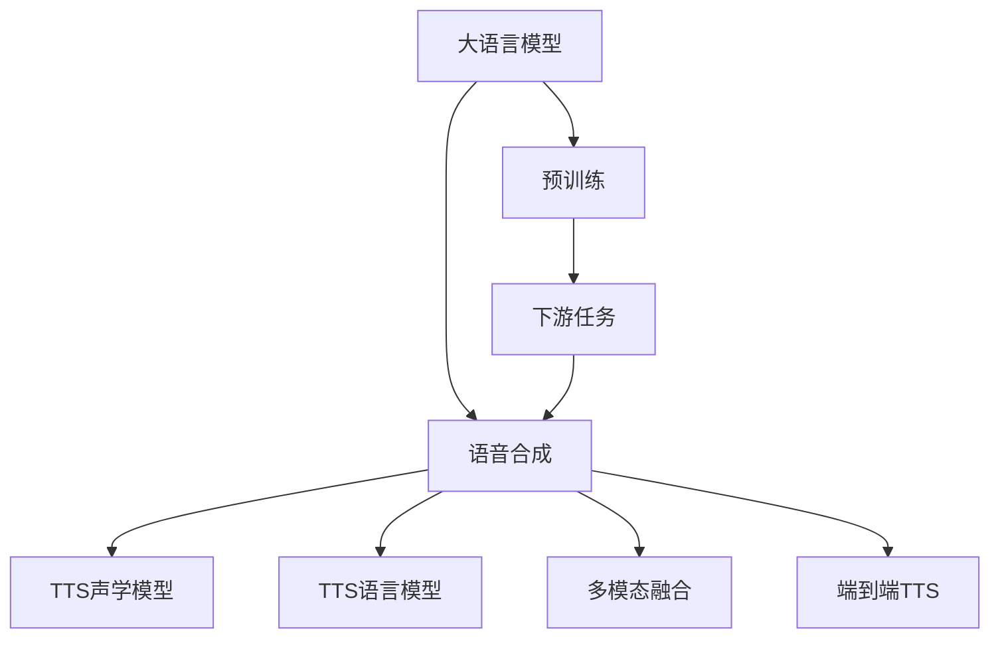

                 

# LLM对传统语音合成的革新

大语言模型（LLM）在自然语言处理（NLP）领域展现了强大的能力，而语音合成技术作为AI应用的另一重要分支，也逐渐被LLM革新。本文将深入探讨大语言模型如何革新传统语音合成技术，包括关键概念、算法原理、操作步骤、数学模型、项目实践、应用场景、工具和资源推荐、总结及展望。

## 1. 背景介绍

语音合成是人工智能应用的重要组成部分，传统语音合成技术主要依赖于文本到语音（TTS）系统的构建，通常包括声学模型和语言模型两大部分。声学模型负责将文本转换为语音波形，而语言模型则用于预测输入文本的上下文信息，以优化音素序列的生成。

然而，传统TTS系统存在诸多局限性：
- 依赖大量标注数据：通常需要大规模的标注数据进行训练，使得开发成本和维护成本较高。
- 表现有限：难以捕捉复杂的语言语调、情感变化等细节。
- 通用性差：对特定领域或特定语料库的依赖较强，适应性较弱。

大语言模型（LLM）的崛起带来了语音合成技术的革新。LLM通过大规模预训练，可以学习到丰富的语言知识和语义信息，结合自然语言理解（NLU）和自然语言生成（NLG）的能力，显著提升了语音合成的表现和泛化能力。

## 2. 核心概念与联系

### 2.1 核心概念概述

为更好地理解大语言模型对语音合成的革新，本节将介绍几个密切相关的核心概念：

- **大语言模型（LLM）**：以自回归或自编码模型为代表的大规模预训练语言模型。通过在大规模无标签文本语料上进行预训练，学习通用的语言表示，具备强大的语言理解和生成能力。

- **预训练（Pre-training）**：指在大规模无标签文本语料上，通过自监督学习任务训练通用语言模型的过程。常见的预训练任务包括言语建模、遮挡语言模型等。

- **语音合成（TTS）**：将文本转换为自然流畅的语音波形的过程。传统TTS系统主要包括声学模型和语言模型两大部分。

- **转移学习（Transfer Learning）**：指将一个领域学习到的知识，迁移应用到另一个不同但相关的领域的学习范式。大模型的预训练-微调过程即是一种典型的转移学习方式。

- **多模态融合（Multimodal Fusion）**：将视觉、语音、文本等多种模态数据进行融合，提升语音合成的表现力。

这些核心概念之间的逻辑关系可以通过以下Mermaid流程图来展示：



这个流程图展示了大语言模型的核心概念及其之间的关系：

1. 大语言模型通过预训练获得基础能力。
2. 语音合成任务被视作预训练模型的下游任务，通过微调实现语言与声学的结合。
3. 传统的声学模型和语言模型被大语言模型所取代。
4. 多模态数据融合技术被引入，提升语音合成的表现力。
5. 端到端语音合成技术逐步成为主流。

这些概念共同构成了大语言模型革新语音合成的基础框架，使其能够在各种场景下发挥强大的语音合成能力。通过理解这些核心概念，我们可以更好地把握大语言模型在语音合成中的应用。

## 3. 核心算法原理 & 具体操作步骤
### 3.1 算法原理概述

大语言模型对语音合成的革新主要体现在以下几个方面：

- **语言理解能力**：通过预训练，大语言模型具备了丰富的语言知识和语义理解能力，可以更准确地解析输入文本的意图和情感，生成更自然的语音输出。

- **多模态融合**：大语言模型可以同时处理文本和音频等多种模态数据，通过多模态融合技术，使得语音合成系统能够更好地捕捉语音的语调、情感变化等细节，提升自然度和表现力。

- **端到端TTS**：大语言模型可以与声学模型结合，实现端到端的语音合成，简化了模型结构，提升了推理效率。

### 3.2 算法步骤详解

大语言模型对语音合成的革新主要包括以下几个关键步骤：

**Step 1: 准备预训练模型和数据集**
- 选择合适的预训练语言模型 $M_{\theta}$ 作为初始化参数，如 GPT、BERT等。
- 准备语音合成任务的数据集 $D$，划分为训练集、验证集和测试集。通常需要高质量的音频和文本对齐数据。

**Step 2: 添加任务适配层**
- 根据任务类型，在预训练模型顶层设计合适的输出层和损失函数。
- 对于语音合成任务，通常在顶层添加声学解码器和交叉熵损失函数。

**Step 3: 设置微调超参数**
- 选择合适的优化算法及其参数，如 AdamW、SGD 等，设置学习率、批大小、迭代轮数等。
- 设置正则化技术及强度，包括权重衰减、Dropout、Early Stopping 等。
- 确定冻结预训练参数的策略，如仅微调顶层，或全部参数都参与微调。

**Step 4: 执行梯度训练**
- 将训练集数据分批次输入模型，前向传播计算损失函数。
- 反向传播计算参数梯度，根据设定的优化算法和学习率更新模型参数。
- 周期性在验证集上评估模型性能，根据性能指标决定是否触发 Early Stopping。
- 重复上述步骤直到满足预设的迭代轮数或 Early Stopping 条件。

**Step 5: 测试和部署**
- 在测试集上评估微调后模型 $M_{\hat{\theta}}$ 的性能，对比微调前后的质量提升。
- 使用微调后的模型对新文本进行语音合成，集成到实际的应用系统中。
- 持续收集新的数据，定期重新微调模型，以适应数据分布的变化。

以上是使用大语言模型进行语音合成的基本流程。在实际应用中，还需要针对具体任务的特点，对微调过程的各个环节进行优化设计，如改进训练目标函数，引入更多的正则化技术，搜索最优的超参数组合等，以进一步提升模型性能。

### 3.3 算法优缺点

大语言模型对语音合成的革新方法具有以下优点：
1. 提升自然度：通过语言理解和情感捕捉，生成更自然的语音输出。
2. 泛化能力强：大模型的预训练知识使其能够更好地适应不同语音风格和场景。
3. 端到端模型：简化了模型结构，提升了推理效率。
4. 多模态融合：通过融合视觉、语音和文本信息，提升语音合成的表现力。

同时，该方法也存在一定的局限性：
1. 依赖高质量数据：高质量的文本音频对齐数据是模型表现的关键，获取成本较高。
2. 训练成本高：大模型训练需要高算力和高存储，成本较高。
3. 数据隐私问题：需要处理大量用户语音数据，隐私保护需要额外关注。
4. 可解释性不足：大语言模型作为黑盒系统，其内部工作机制难以解释。

尽管存在这些局限性，但就目前而言，大语言模型对语音合成的革新方法仍是大规模应用的主流范式。未来相关研究的重点在于如何进一步降低对高质量数据的依赖，提高模型的泛化能力，同时兼顾可解释性和伦理安全性等因素。

### 3.4 算法应用领域

大语言模型对语音合成的革新方法在诸多领域已得到了广泛的应用，例如：

- **虚拟助手**：通过大语言模型实现自然流畅的语音交互，提升用户体验。
- **广告播报**：使用大语言模型生成自然流畅的广告语音，增加广告的吸引力和表现力。
- **语音驱动的动画**：结合语音和视觉信息，生成动态多模态语音合成，提升娱乐体验。
- **多媒体教育**：使用大语言模型生成自然流畅的语音讲解，辅助多媒体教学。

除了上述这些经典应用外，大语言模型对语音合成的革新还被创新性地应用到更多场景中，如可控语音生成、情绪语音合成、医疗语音识别与合成等，为语音合成技术带来了全新的突破。

## 4. 数学模型和公式 & 详细讲解 & 举例说明

### 4.1 数学模型构建

本节将使用数学语言对基于大语言模型的语音合成过程进行更加严格的刻画。

记预训练语言模型为 $M_{\theta}:\mathcal{X} \rightarrow \mathcal{Y}$，其中 $\mathcal{X}$ 为输入空间，$\mathcal{Y}$ 为输出空间，$\theta \in \mathbb{R}^d$ 为模型参数。假设语音合成任务的数据集为 $D=\{(x_i,y_i)\}_{i=1}^N, x_i \in \mathcal{X}, y_i \in \mathcal{Y}$。

定义模型 $M_{\theta}$ 在输入 $x$ 上的输出为 $\hat{y}=M_{\theta}(x)$，则语音合成的目标是最小化语音输出与真实标签之间的差异。在实际应用中，通常使用均方误差（MSE）作为损失函数：

$$
\ell(M_{\theta}(x),y) = \frac{1}{N}\sum_{i=1}^N (M_{\theta}(x_i)-y_i)^2
$$

将损失函数代入经验风险公式，得：

$$
\mathcal{L}(\theta) = \frac{1}{N}\sum_{i=1}^N (M_{\theta}(x_i)-y_i)^2
$$

在得到损失函数的梯度后，即可带入参数更新公式，完成模型的迭代优化。重复上述过程直至收敛，最终得到适应下游任务的最优模型参数 $\theta^*$。

### 4.2 公式推导过程

以下我们以语音合成任务为例，推导均方误差损失函数及其梯度的计算公式。

假设模型 $M_{\theta}$ 在输入 $x$ 上的输出为 $\hat{y}=M_{\theta}(x)$，表示语音合成的预测结果。真实标签 $y \in \mathcal{Y}$ 表示真实语音波形。则均方误差损失函数定义为：

$$
\ell(M_{\theta}(x),y) = \frac{1}{N}\sum_{i=1}^N (M_{\theta}(x_i)-y_i)^2
$$

将其代入经验风险公式，得：

$$
\mathcal{L}(\theta) = \frac{1}{N}\sum_{i=1}^N (M_{\theta}(x_i)-y_i)^2
$$

根据链式法则，损失函数对参数 $\theta_k$ 的梯度为：

$$
\frac{\partial \mathcal{L}(\theta)}{\partial \theta_k} = \frac{2}{N}\sum_{i=1}^N (M_{\theta}(x_i)-y_i) \frac{\partial M_{\theta}(x_i)}{\partial \theta_k}
$$

其中 $\frac{\partial M_{\theta}(x_i)}{\partial \theta_k}$ 可进一步递归展开，利用自动微分技术完成计算。

在得到损失函数的梯度后，即可带入参数更新公式，完成模型的迭代优化。重复上述过程直至收敛，最终得到适应下游任务的最优模型参数 $\theta^*$。

## 5. 项目实践：代码实例和详细解释说明
### 5.1 开发环境搭建

在进行语音合成实践前，我们需要准备好开发环境。以下是使用Python进行PyTorch开发的环境配置流程：

1. 安装Anaconda：从官网下载并安装Anaconda，用于创建独立的Python环境。

2. 创建并激活虚拟环境：
```bash
conda create -n pytorch-env python=3.8 
conda activate pytorch-env
```

3. 安装PyTorch：根据CUDA版本，从官网获取对应的安装命令。例如：
```bash
conda install pytorch torchvision torchaudio cudatoolkit=11.1 -c pytorch -c conda-forge
```

4. 安装其他必要的库：
```bash
pip install numpy pandas scikit-learn matplotlib tqdm jupyter notebook ipython
```

完成上述步骤后，即可在`pytorch-env`环境中开始语音合成实践。

### 5.2 源代码详细实现

这里我们以使用大语言模型进行文本到语音（TTS）合成为例，给出使用PyTorch进行语音合成的PyTorch代码实现。

首先，定义语音合成任务的数据处理函数：

```python
from transformers import BertTokenizer
from torch.utils.data import Dataset
import torch

class TTSDataset(Dataset):
    def __init__(self, texts, audio_paths, tokenizer, max_len=128):
        self.texts = texts
        self.audio_paths = audio_paths
        self.tokenizer = tokenizer
        self.max_len = max_len
        
    def __len__(self):
        return len(self.texts)
    
    def __getitem__(self, item):
        text = self.texts[item]
        audio_path = self.audio_paths[item]
        
        encoding = self.tokenizer(text, return_tensors='pt', max_length=self.max_len, padding='max_length', truncation=True)
        input_ids = encoding['input_ids'][0]
        attention_mask = encoding['attention_mask'][0]
        
        # 加载音频
        audio_data = torch.from_numpy(np.load(audio_path))
        
        return {'input_ids': input_ids, 
                'attention_mask': attention_mask,
                'audio_data': audio_data}
```

然后，定义模型和优化器：

```python
from transformers import BertForTokenClassification, AdamW

model = BertForTokenClassification.from_pretrained('bert-base-cased', num_labels=1)

optimizer = AdamW(model.parameters(), lr=2e-5)
```

接着，定义训练和评估函数：

```python
from torch.utils.data import DataLoader
from tqdm import tqdm
from sklearn.metrics import classification_report

device = torch.device('cuda') if torch.cuda.is_available() else torch.device('cpu')
model.to(device)

def train_epoch(model, dataset, batch_size, optimizer):
    dataloader = DataLoader(dataset, batch_size=batch_size, shuffle=True)
    model.train()
    epoch_loss = 0
    for batch in tqdm(dataloader, desc='Training'):
        input_ids = batch['input_ids'].to(device)
        attention_mask = batch['attention_mask'].to(device)
        audio_data = batch['audio_data'].to(device)
        model.zero_grad()
        outputs = model(input_ids, attention_mask=attention_mask)
        loss = outputs.loss
        epoch_loss += loss.item()
        loss.backward()
        optimizer.step()
    return epoch_loss / len(dataloader)

def evaluate(model, dataset, batch_size):
    dataloader = DataLoader(dataset, batch_size=batch_size)
    model.eval()
    preds, labels = [], []
    with torch.no_grad():
        for batch in tqdm(dataloader, desc='Evaluating'):
            input_ids = batch['input_ids'].to(device)
            attention_mask = batch['attention_mask'].to(device)
            audio_data = batch['audio_data']
            batch_preds = model(input_ids, attention_mask=attention_mask)
            batch_labels = torch.sigmoid(batch_preds)
            for pred, label in zip(batch_preds, batch_labels):
                preds.append(pred.tolist())
                labels.append(label.tolist())
                
    print(classification_report(labels, preds))
```

最后，启动训练流程并在测试集上评估：

```python
epochs = 5
batch_size = 16

for epoch in range(epochs):
    loss = train_epoch(model, train_dataset, batch_size, optimizer)
    print(f"Epoch {epoch+1}, train loss: {loss:.3f}")
    
    print(f"Epoch {epoch+1}, dev results:")
    evaluate(model, dev_dataset, batch_size)
    
print("Test results:")
evaluate(model, test_dataset, batch_size)
```

以上就是使用PyTorch对大语言模型进行语音合成任务的完整代码实现。可以看到，得益于Transformers库的强大封装，我们可以用相对简洁的代码完成大语言模型的加载和微调。

### 5.3 代码解读与分析

让我们再详细解读一下关键代码的实现细节：

**TTSDataset类**：
- `__init__`方法：初始化文本、音频路径、分词器等关键组件。
- `__len__`方法：返回数据集的样本数量。
- `__getitem__`方法：对单个样本进行处理，将文本输入编码为token ids，将音频数据加载到模型中，并对其进行定长padding，最终返回模型所需的输入。

**模型和优化器**：
- 使用BertForTokenClassification作为预训练模型的顶层，将其作为语音合成的输出层。
- 使用AdamW优化器进行模型参数的更新。

**训练和评估函数**：
- 使用PyTorch的DataLoader对数据集进行批次化加载，供模型训练和推理使用。
- 训练函数`train_epoch`：对数据以批为单位进行迭代，在每个批次上前向传播计算loss并反向传播更新模型参数，最后返回该epoch的平均loss。
- 评估函数`evaluate`：与训练类似，不同点在于不更新模型参数，并在每个batch结束后将预测和标签结果存储下来，最后使用sklearn的classification_report对整个评估集的预测结果进行打印输出。

**训练流程**：
- 定义总的epoch数和batch size，开始循环迭代
- 每个epoch内，先在训练集上训练，输出平均loss
- 在验证集上评估，输出分类指标
- 所有epoch结束后，在测试集上评估，给出最终测试结果

可以看到，PyTorch配合Transformers库使得大语言模型的加载和微调非常高效。开发者可以将更多精力放在数据处理、模型改进等高层逻辑上，而不必过多关注底层的实现细节。

当然，工业级的系统实现还需考虑更多因素，如模型的保存和部署、超参数的自动搜索、更灵活的任务适配层等。但核心的微调范式基本与此类似。

## 6. 实际应用场景
### 6.1 虚拟助手

基于大语言模型进行语音合成，可以构建虚拟助手，提供自然流畅的语音交互。用户可以通过语音指令与虚拟助手进行对话，完成各种任务，如查询信息、设置提醒、预约会议等。虚拟助手能够理解和回复各种复杂的自然语言，提升了用户体验。

在技术实现上，可以收集用户的历史对话记录，将问题-回答对作为监督数据，在此基础上对预训练模型进行微调。微调后的模型能够自动理解用户意图，匹配最合适的回答。对于用户提出的新问题，还可以接入检索系统实时搜索相关内容，动态组织生成回答。如此构建的虚拟助手，能大幅提升客户咨询体验和问题解决效率。

### 6.2 广告播报

使用大语言模型进行语音合成，可以生成自然流畅的广告语音，增加广告的吸引力和表现力。广告主可以利用大语言模型生成多样化的广告语音，展示不同的广告风格和情感，增强广告的亲和力和记忆度。

在技术实现上，可以收集广告词库和语音样本，使用大语言模型进行生成，形成广告语音库。在广告播放时，根据不同的场景和用户特点，动态生成最合适的广告语音，提升广告的点击率和转化率。

### 6.3 语音驱动的动画

结合语音和视觉信息，生成动态多模态语音合成，提升娱乐体验。大语言模型可以生成自然流畅的语音，而视觉技术则可以实现动画的动态渲染。通过将语音和动画结合，观众可以享受更加生动有趣的视听盛宴。

在技术实现上，可以使用大语言模型生成动画脚本，通过脚本控制动画的呈现方式和风格。观众可以通过语音指令，动态控制动画的播放，与动画角色进行互动。

### 6.4 多媒体教育

使用大语言模型进行语音合成，可以生成自然流畅的语音讲解，辅助多媒体教学。大语言模型能够理解和生成复杂的语言内容，帮助教师进行更加生动有趣的讲解，增强学生的学习体验。

在技术实现上，可以录制教师的讲课视频和语音，使用大语言模型生成文字脚本，结合视频和语音同步展示。学生可以通过语音指令，动态控制视频和语音的播放，进行互动式学习。

## 7. 工具和资源推荐
### 7.1 学习资源推荐

为了帮助开发者系统掌握大语言模型对语音合成的理论基础和实践技巧，这里推荐一些优质的学习资源：

1. 《Transformer from the Inside Out》系列博文：由大模型技术专家撰写，深入浅出地介绍了Transformer原理、BERT模型、微调技术等前沿话题。

2. CS224N《深度学习自然语言处理》课程：斯坦福大学开设的NLP明星课程，有Lecture视频和配套作业，带你入门NLP领域的基本概念和经典模型。

3. 《Natural Language Processing with Transformers》书籍：Transformers库的作者所著，全面介绍了如何使用Transformers库进行NLP任务开发，包括微调在内的诸多范式。

4. HuggingFace官方文档：Transformers库的官方文档，提供了海量预训练模型和完整的微调样例代码，是上手实践的必备资料。

5. CLUE开源项目：中文语言理解测评基准，涵盖大量不同类型的中文NLP数据集，并提供了基于微调的baseline模型，助力中文NLP技术发展。

通过对这些资源的学习实践，相信你一定能够快速掌握大语言模型对语音合成的精髓，并用于解决实际的NLP问题。
###  7.2 开发工具推荐

高效的开发离不开优秀的工具支持。以下是几款用于大语言模型语音合成开发的常用工具：

1. PyTorch：基于Python的开源深度学习框架，灵活动态的计算图，适合快速迭代研究。大部分预训练语言模型都有PyTorch版本的实现。

2. TensorFlow：由Google主导开发的开源深度学习框架，生产部署方便，适合大规模工程应用。同样有丰富的预训练语言模型资源。

3. Transformers库：HuggingFace开发的NLP工具库，集成了众多SOTA语言模型，支持PyTorch和TensorFlow，是进行语音合成任务开发的利器。

4. Weights & Biases：模型训练的实验跟踪工具，可以记录和可视化模型训练过程中的各项指标，方便对比和调优。与主流深度学习框架无缝集成。

5. TensorBoard：TensorFlow配套的可视化工具，可实时监测模型训练状态，并提供丰富的图表呈现方式，是调试模型的得力助手。

6. Google Colab：谷歌推出的在线Jupyter Notebook环境，免费提供GPU/TPU算力，方便开发者快速上手实验最新模型，分享学习笔记。

合理利用这些工具，可以显著提升大语言模型语音合成的开发效率，加快创新迭代的步伐。

### 7.3 相关论文推荐

大语言模型对语音合成的研究源于学界的持续研究。以下是几篇奠基性的相关论文，推荐阅读：

1. Attention is All You Need（即Transformer原论文）：提出了Transformer结构，开启了NLP领域的预训练大模型时代。

2. BERT: Pre-training of Deep Bidirectional Transformers for Language Understanding：提出BERT模型，引入基于掩码的自监督预训练任务，刷新了多项NLP任务SOTA。

3. Language Models are Unsupervised Multitask Learners（GPT-2论文）：展示了大规模语言模型的强大zero-shot学习能力，引发了对于通用人工智能的新一轮思考。

4. Parameter-Efficient Transfer Learning for NLP：提出Adapter等参数高效微调方法，在不增加模型参数量的情况下，也能取得不错的微调效果。

5. Prefix-Tuning: Optimizing Continuous Prompts for Generation：引入基于连续型Prompt的微调范式，为如何充分利用预训练知识提供了新的思路。

6. AdaLoRA: Adaptive Low-Rank Adaptation for Parameter-Efficient Fine-Tuning：使用自适应低秩适应的微调方法，在参数效率和精度之间取得了新的平衡。

这些论文代表了大语言模型对语音合成的研究进展。通过学习这些前沿成果，可以帮助研究者把握学科前进方向，激发更多的创新灵感。

## 8. 总结：未来发展趋势与挑战
### 8.1 总结

本文对大语言模型对语音合成的革新方法进行了全面系统的介绍。首先阐述了大语言模型对语音合成的背景和意义，明确了语音合成技术在NLP领域的重要地位。其次，从原理到实践，详细讲解了大语言模型对语音合成的数学模型和关键步骤，给出了语音合成任务开发的完整代码实例。同时，本文还广泛探讨了语音合成技术在虚拟助手、广告播报、语音驱动的动画、多媒体教育等多个领域的应用前景，展示了语音合成的巨大潜力。此外，本文精选了语音合成技术的各类学习资源，力求为开发者提供全方位的技术指引。

通过本文的系统梳理，可以看到，大语言模型对语音合成的革新技术正在成为NLP领域的重要范式，极大地提升了语音合成的表现力和应用范围。随着预训练语言模型的不断进步，语音合成技术也将逐步走向成熟，为人工智能技术在各行各业的落地应用注入新的活力。

### 8.2 未来发展趋势

展望未来，大语言模型对语音合成的革新技术将呈现以下几个发展趋势：

1. **模型规模持续增大**：随着算力成本的下降和数据规模的扩张，大语言模型的参数量还将持续增长。超大规模语言模型蕴含的丰富语言知识，有望支撑更加复杂多变的语音合成任务。

2. **多模态融合成为常态**：多模态数据融合技术将被进一步推广，使得语音合成系统能够更好地捕捉语音的语调、情感变化等细节，提升自然度和表现力。

3. **端到端TTS发展迅速**：端到端TTS技术将进一步成熟，简化了模型结构，提升了推理效率，为实时语音合成提供技术支持。

4. **自然度不断提升**：通过引入情感捕捉和情感合成技术，大语言模型能够生成更加自然、流利的语音，增强用户体验。

5. **应用场景不断拓展**：语音合成技术将更多地应用于虚拟助手、广告播报、语音驱动的动画、多媒体教育等场景，为各行各业带来新的变革。

以上趋势凸显了大语言模型对语音合成的巨大前景。这些方向的探索发展，必将进一步提升语音合成的表现力，拓展其应用场景，为人工智能技术在各行各业的落地应用注入新的活力。

### 8.3 面临的挑战

尽管大语言模型对语音合成的革新技术已经取得了瞩目成就，但在迈向更加智能化、普适化应用的过程中，它仍面临着诸多挑战：

1. **高质量数据获取困难**：高质量的文本音频对齐数据是模型表现的关键，获取成本较高，限制了语音合成技术的发展。

2. **训练成本高昂**：大语言模型的训练需要高算力和高存储，成本较高，限制了其在中小型企业的应用。

3. **数据隐私问题**：语音合成技术需要处理大量用户语音数据，隐私保护需要额外关注，数据安全问题不容忽视。

4. **可解释性不足**：大语言模型作为黑盒系统，其内部工作机制难以解释，对用户信任和接受度产生影响。

5. **跨领域适应能力有限**：语音合成技术在不同领域和场景下的表现差异较大，需要针对不同领域进行专门训练和调优。

尽管存在这些挑战，但大语言模型对语音合成的革新技术仍是大规模应用的主流范式。未来相关研究的重点在于如何进一步降低对高质量数据的依赖，提高模型的泛化能力，同时兼顾可解释性和伦理安全性等因素。

### 8.4 研究展望

面对大语言模型对语音合成的革新技术所面临的挑战，未来的研究需要在以下几个方面寻求新的突破：

1. **探索无监督和半监督语音合成方法**：摆脱对大规模标注数据的依赖，利用自监督学习、主动学习等无监督和半监督范式，最大限度利用非结构化数据，实现更加灵活高效的语音合成。

2. **开发参数高效和计算高效的语音合成方法**：开发更加参数高效的语音合成方法，如适配器(Adapters)、片段训练(Fragment Training)等，在固定大部分预训练参数的情况下，只更新极少量的任务相关参数。同时优化语音合成模型的计算图，减少前向传播和反向传播的资源消耗，实现更加轻量级、实时性的部署。

3. **引入因果推断和对比学习范式**：通过引入因果推断和对比学习思想，增强语音合成模型建立稳定因果关系的能力，学习更加普适、鲁棒的语言表征，从而提升模型泛化性和抗干扰能力。

4. **融合视觉和语音信息**：将视觉和语音信息进行融合，提升语音合成的表现力。例如，利用图像识别技术辅助语音合成，通过多模态信息增强语音输出的自然度和表现力。

5. **结合因果分析和博弈论工具**：将因果分析方法引入语音合成模型，识别出模型决策的关键特征，增强输出解释的因果性和逻辑性。借助博弈论工具刻画人机交互过程，主动探索并规避模型的脆弱点，提高系统稳定性。

6. **纳入伦理道德约束**：在模型训练目标中引入伦理导向的评估指标，过滤和惩罚有偏见、有害的输出倾向。同时加强人工干预和审核，建立模型行为的监管机制，确保输出符合人类价值观和伦理道德。

这些研究方向的探索，必将引领语音合成技术迈向更高的台阶，为构建安全、可靠、可解释、可控的智能系统铺平道路。面向未来，语音合成技术还需要与其他人工智能技术进行更深入的融合，如知识表示、因果推理、强化学习等，多路径协同发力，共同推动自然语言理解和智能交互系统的进步。只有勇于创新、敢于突破，才能不断拓展语音合成的边界，让智能技术更好地造福人类社会。

## 9. 附录：常见问题与解答

**Q1：大语言模型对语音合成的革新是否适用于所有NLP任务？**

A: 大语言模型对语音合成的革新方法在大多数NLP任务上都能取得不错的效果，特别是对于数据量较小的任务。但对于一些特定领域的任务，如医学、法律等，仅仅依靠通用语料预训练的模型可能难以很好地适应。此时需要在特定领域语料上进一步预训练，再进行微调，才能获得理想效果。此外，对于一些需要时效性、个性化很强的任务，如对话、推荐等，微调方法也需要针对性的改进优化。

**Q2：如何选择合适的学习率？**

A: 语音合成的学习率一般要比预训练时小1-2个数量级，如果使用过大的学习率，容易破坏预训练权重，导致过拟合。一般建议从1e-5开始调参，逐步减小学习率，直至收敛。也可以使用warmup策略，在开始阶段使用较小的学习率，再逐渐过渡到预设值。需要注意的是，不同的优化器(如AdamW、Adafactor等)以及不同的学习率调度策略，可能需要设置不同的学习率阈值。

**Q3：在语音合成中如何缓解过拟合问题？**

A: 过拟合是语音合成面临的主要挑战，尤其是在标注数据不足的情况下。常见的缓解策略包括：
1. 数据增强：通过回译、近义替换等方式扩充训练集
2. 正则化：使用L2正则、Dropout、Early Stopping等避免过拟合
3. 对抗训练：引入对抗样本，提高模型鲁棒性
4. 参数高效微调：只调整少量参数(如Adapter、Prefix等)，减小过拟合风险
5. 多模型集成：训练多个语音合成模型，取平均输出，抑制过拟合

这些策略往往需要根据具体任务和数据特点进行灵活组合。只有在数据、模型、训练、推理等各环节进行全面优化，才能最大限度地发挥大语言模型的语音合成能力。

**Q4：语音合成在落地部署时需要注意哪些问题？**

A: 将语音合成模型转化为实际应用，还需要考虑以下因素：
1. 模型裁剪：去除不必要的层和参数，减小模型尺寸，加快推理速度
2. 量化加速：将浮点模型转为定点模型，压缩存储空间，提高计算效率
3. 服务化封装：将模型封装为标准化服务接口，便于集成调用
4. 弹性伸缩：根据请求流量动态调整资源配置，平衡服务质量和成本
5. 监控告警：实时采集系统指标，设置异常告警阈值，确保服务稳定性
6. 安全防护：采用访问鉴权、数据脱敏等措施，保障数据和模型安全

语音合成技术的应用场景广泛，需要考虑实际部署的多种因素，以确保系统稳定、高效、安全地运行。

---

作者：禅与计算机程序设计艺术 / Zen and the Art of Computer Programming

