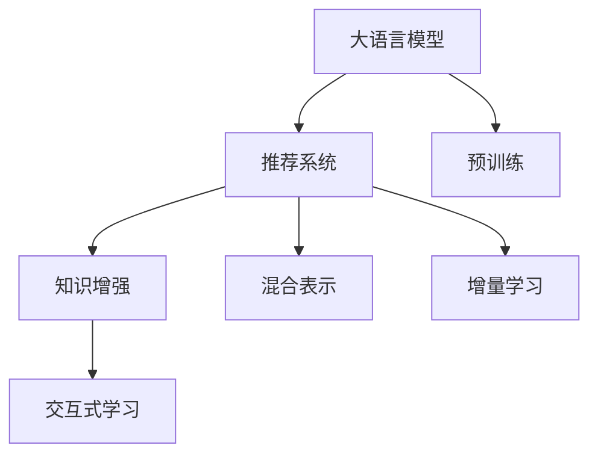

                 

# LLM推荐中的知识增强技术研究

> 关键词：大语言模型(LLM), 推荐系统, 知识增强, 交互式学习, 混合表示

## 1. 背景介绍

在数字时代，信息过载的问题愈发突出，如何帮助用户在海量数据中快速找到有用的内容，是推荐系统面临的重要挑战。推荐系统通过收集用户的浏览、点击、评分等行为数据，对用户的兴趣进行建模，进而推荐相关内容。然而，由于用户数据的多样性和复杂性，传统的推荐模型在数据稀缺、分布不均等问题上往往表现不佳，难以准确预测用户的真实需求。

为了提升推荐系统的表现，研究人员提出了众多改进方法，如基于知识图谱的推荐、基于深度学习的推荐、混合表示推荐等。这些方法在提升推荐系统效果方面取得了一定进展，但仍存在一些局限性。近年来，大语言模型（LLM）的兴起，带来了全新的推荐技术视角。LLM具备强大的语言理解能力和生成能力，通过与用户进行交互式的学习，可以从多模态数据中提取更丰富的用户兴趣信息，从而实现更加精准的推荐。

本文聚焦于LLM在推荐系统中的应用，将探讨如何通过知识增强技术，提升LLM在推荐系统中的效果，使其能够更灵活地适应用户的兴趣变化和多样化需求。

## 2. 核心概念与联系

### 2.1 核心概念概述

为更好地理解LLM在推荐系统中的应用，本节将介绍几个密切相关的核心概念：

- 大语言模型(LLM)：以Transformer为代表的预训练语言模型。通过在大规模无标签文本语料上进行预训练，学习通用的语言表示，具备强大的语言理解和生成能力。
- 推荐系统：通过用户行为数据，预测用户兴趣，推荐相关内容的技术系统。
- 知识增强(Knowledge Augmentation)：将外部知识（如知识图谱、百科全书、专业文献等）融入模型的训练和推理中，提高模型对领域知识的理解能力。
- 交互式学习(Interactive Learning)：模型通过与用户进行互动，逐步学习和适应用户需求，提升推荐准确性。
- 混合表示(Hybrid Representation)：将不同模态的信息（如文本、图像、音频等）进行融合，构建多模态表示，增强模型对复杂场景的建模能力。
- 增量学习(Incremental Learning)：模型能够持续学习新数据，不断更新自身的知识库，适应用户兴趣的动态变化。

这些核心概念之间的逻辑关系可以通过以下Mermaid流程图来展示：



这个流程图展示了大语言模型在推荐系统中的应用框架：

1. 大语言模型通过预训练获得基础能力。
2. 推荐系统利用LLM强大的语言处理能力，构建推荐模型。
3. 知识增强技术为LLM引入更多外部知识，提升模型的知识水平。
4. 交互式学习通过与用户互动，进一步优化模型。
5. 混合表示技术将多模态信息进行融合，构建更全面的表示。
6. 增量学习使得模型能够持续学习新数据，适应用户的动态变化。

这些核心概念共同构成了LLM在推荐系统中的应用框架，使其能够在复杂多变的环境中发挥强大的推荐能力。通过理解这些核心概念，我们可以更好地把握LLM在推荐系统中的应用原理和优化方向。

## 3. 核心算法原理 & 具体操作步骤
### 3.1 算法原理概述

在大语言模型应用于推荐系统的场景中，知识增强和交互式学习是两个关键技术。

知识增强技术的核心思想是将知识图谱、百科全书等外部知识融入模型的训练和推理中，提升模型的领域知识水平。这可以通过如下步骤实现：
1. 收集知识图谱、百科全书等外部知识，构建知识库。
2. 将知识库中的实体和关系进行编码，构建知识向量。
3. 在预训练阶段，将知识向量作为额外输入，引导模型学习领域知识。
4. 在微调阶段，将知识向量与用户行为数据进行融合，提升推荐精度。

交互式学习技术则通过与用户的互动，逐步学习和适应用户需求，优化推荐模型。这可以通过如下步骤实现：
1. 根据用户行为数据构建用户兴趣模型。
2. 通过交互式对话，引导用户反馈对推荐结果的满意度。
3. 根据用户的反馈，调整推荐策略，不断优化模型。
4. 通过迭代训练，使得模型能够更准确地预测用户需求。

结合知识增强和交互式学习，可以构建一个既能够理解领域知识，又能够适应用户需求，具备良好推荐能力的LLM推荐系统。

### 3.2 算法步骤详解

以下是基于知识增强和交互式学习的大语言模型推荐系统的大致实现步骤：

**Step 1: 数据准备与预处理**
- 收集用户的历史行为数据，构建用户兴趣模型。
- 收集知识图谱、百科全书等外部知识，构建知识库。
- 对用户行为数据和知识库进行编码，构建知识向量。

**Step 2: 知识增强预训练**
- 使用预训练语言模型，将知识向量作为额外输入，引导模型学习领域知识。
- 在预训练阶段，可以设计一些有监督的任务，如知识匹配、推理等，优化模型的知识水平。
- 可以使用自监督学习任务，如掩码语言模型、句子相似度匹配等，进一步提升模型的泛化能力。

**Step 3: 交互式微调**
- 将用户行为数据与知识向量进行融合，构建混合表示。
- 使用LLM对混合表示进行微调，得到最终的推荐模型。
- 在微调过程中，可以设计交互式学习策略，通过与用户的互动，逐步优化推荐模型。

**Step 4: 测试与部署**
- 在测试集上评估推荐模型的性能，对比不同策略的推荐效果。
- 使用推荐模型对新数据进行推理，集成到实际的应用系统中。
- 持续收集新的数据，定期重新微调模型，以适应用户兴趣的动态变化。

以上步骤展示了基于知识增强和交互式学习的大语言模型推荐系统的一般流程。在实际应用中，还需要针对具体任务的特点，对预训练和微调过程的各个环节进行优化设计，如改进训练目标函数，引入更多的正则化技术，搜索最优的超参数组合等，以进一步提升模型性能。

### 3.3 算法优缺点

基于知识增强和交互式学习的大语言模型推荐系统具有以下优点：
1. 提升推荐精度。知识增强技术使得模型能够更好地理解领域知识，提升推荐相关性和准确性。
2. 个性化推荐。交互式学习技术能够适应用户的个性化需求，提高推荐的相关性。
3. 多模态融合。混合表示技术将不同模态的信息进行融合，构建更全面的表示，提升推荐系统的泛化能力。
4. 动态适应用户兴趣变化。增量学习技术使得模型能够持续学习新数据，适应用户兴趣的动态变化。

同时，该方法也存在一定的局限性：
1. 知识获取难度大。知识库的构建和更新需要耗费大量时间和资源。
2. 用户行为数据稀缺。在某些领域，如医疗、金融等，难以获取足够的用户行为数据。
3. 交互式学习复杂度高。与用户的互动需要考虑多种策略，且互动过程耗时较长。
4. 模型复杂度高。融合多模态信息和技术，增加了模型的复杂度，提高了训练和推理的计算成本。

尽管存在这些局限性，但就目前而言，基于知识增强和交互式学习的大语言模型推荐方法仍是大数据推荐系统的重要范式。未来相关研究的重点在于如何进一步降低知识获取成本，提高多模态融合的效果，简化模型结构，提升交互式学习的效率，以实现推荐系统的高效、低成本运行。

### 3.4 算法应用领域

基于知识增强和交互式学习的大语言模型推荐系统，已经在诸多领域得到了应用，例如：

- 电子商务推荐：如淘宝、亚马逊等电商平台，通过分析用户行为数据，为用户推荐相关商品。
- 社交网络推荐：如微信、微博等社交平台，通过分析用户互动数据，推荐相关内容和好友。
- 在线教育推荐：如Coursera、Udacity等在线教育平台，通过分析用户学习行为，推荐相关课程和学习资源。
- 音乐推荐：如Spotify、网易云音乐等音乐平台，通过分析用户听歌历史，推荐相关音乐。
- 新闻推荐：如今日头条、腾讯新闻等新闻平台，通过分析用户阅读习惯，推荐相关新闻内容。

除了上述这些经典领域外，LLM推荐技术也被创新性地应用到更多场景中，如内容生成、智能客服、智能家居等，为推荐系统带来了新的突破。随着LLM和推荐方法的不断进步，相信推荐技术将在更多领域大放异彩，深刻影响人类的生产生活方式。

## 4. 数学模型和公式 & 详细讲解  
### 4.1 数学模型构建

假设用户行为数据为 $D=\{(x_i,y_i)\}_{i=1}^N, x_i \in \mathcal{X}, y_i \in \mathcal{Y}$，其中 $x_i$ 为用户的浏览记录，$y_i$ 为用户的评分。知识库中的实体和关系编码为向量 $K=\{(k_i,r_i)\}_{i=1}^M$，其中 $k_i$ 为知识库中的实体，$r_i$ 为实体之间的关系。

定义LLM推荐模型的参数为 $\theta$，其中 $\theta = \{\theta_1, \theta_2, \cdots, \theta_n\}$，$\theta_i$ 为模型中的第 $i$ 层参数。

定义知识增强向量为 $k$，其中 $k = \{k_1, k_2, \cdots, k_M\}$，$k_i$ 为知识库中第 $i$ 个实体的知识表示向量。

定义用户行为向量为 $u$，其中 $u = \{u_1, u_2, \cdots, u_N\}$，$u_i$ 为用户 $i$ 的历史行为向量。

定义推荐结果向量为 $r$，其中 $r = \{r_1, r_2, \cdots, r_M\}$，$r_i$ 为模型对知识库中第 $i$ 个实体的推荐分数。

### 4.2 公式推导过程

在知识增强的预训练阶段，模型通过计算知识表示向量 $k$ 与用户行为向量 $u$ 的相似度，来学习领域知识。假设用户行为向量 $u$ 与知识表示向量 $k$ 的相似度为 $s(u,k)$，则：

$$
s(u,k) = \frac{u^T k}{\|u\| \cdot \|k\|}
$$

在交互式微调阶段，模型通过与用户的互动，逐步学习和适应用户需求。假设用户对推荐结果的满意度为 $p(r_i,y_i)$，则：

$$
p(r_i,y_i) = \mathbb{P}(y_i|r_i) = \frac{\exp(r_i^T u)}{\sum_{j=1}^M \exp(r_j^T u)}
$$

最终，模型的推荐结果向量 $r$ 可以通过如下公式计算：

$$
r_i = \theta_1^T k_i + \theta_2^T r_{i-1} + \cdots + \theta_n^T r_{i-(n-1)}
$$

其中 $\theta_i$ 为模型的第 $i$ 层参数，$r_{i-1}$ 为前一层的推荐结果向量。

### 4.3 案例分析与讲解

假设有一个在线教育平台，需要为用户推荐相关课程。平台收集了用户的历史学习数据和课程推荐数据，构建了知识库，包括课程的介绍、教师的介绍、课程之间的相关关系等。

首先，将知识库中的实体和关系进行编码，构建知识表示向量 $k$。然后，将用户的行为数据 $u$ 与知识表示向量 $k$ 进行相似度计算，构建用户兴趣模型。接着，使用预训练语言模型，将用户兴趣模型和知识表示向量 $k$ 作为输入，进行知识增强预训练。最后，在微调阶段，将用户行为数据 $u$ 与知识表示向量 $k$ 进行融合，构建混合表示，对推荐结果向量 $r$ 进行微调。

具体实现时，可以设计一些有监督的任务，如知识匹配、推理等，优化模型的知识水平。例如，可以通过以下公式，计算用户对推荐结果的满意度：

$$
p(r_i,y_i) = \frac{\exp(\theta_1^T k_i + \theta_2^T r_{i-1} + \cdots + \theta_n^T r_{i-(n-1)})}{\sum_{j=1}^M \exp(\theta_1^T k_j + \theta_2^T r_{j-1} + \cdots + \theta_n^T r_{j-(n-1)})}
$$

其中 $\theta_i$ 为模型的第 $i$ 层参数，$r_{i-1}$ 为前一层的推荐结果向量。

在训练过程中，可以使用交叉熵损失函数作为优化目标，计算模型与真实标签之间的差异：

$$
\ell(M_{\theta},D) = -\frac{1}{N} \sum_{i=1}^N \log p(r_i,y_i)
$$

通过反向传播算法，更新模型参数 $\theta$，使得模型能够更好地适应用户需求，提升推荐精度。

## 5. 项目实践：代码实例和详细解释说明
### 5.1 开发环境搭建

在进行LLM推荐系统开发前，我们需要准备好开发环境。以下是使用Python进行TensorFlow开发的环境配置流程：

1. 安装Anaconda：从官网下载并安装Anaconda，用于创建独立的Python环境。

2. 创建并激活虚拟环境：
```bash
conda create -n tf-env python=3.8 
conda activate tf-env
```

3. 安装TensorFlow：根据CUDA版本，从官网获取对应的安装命令。例如：
```bash
conda install tensorflow tensorflow-cpu -c conda-forge
```

4. 安装PyTorch：
```bash
pip install torch
```

5. 安装各类工具包：
```bash
pip install numpy pandas scikit-learn matplotlib tqdm jupyter notebook ipython
```

完成上述步骤后，即可在`tf-env`环境中开始LLM推荐系统的开发。

### 5.2 源代码详细实现

下面我们以在线教育推荐系统为例，给出使用TensorFlow和PyTorch对BERT模型进行知识增强的LLM推荐系统的PyTorch代码实现。

首先，定义推荐任务的数据处理函数：

```python
from transformers import BertTokenizer
from tensorflow.keras.layers import Dense, Input
from tensorflow.keras.models import Model
from tensorflow.keras.optimizers import Adam
import tensorflow as tf

class RecommendationDataset(tf.keras.utils.Sequence):
    def __init__(self, texts, tags, tokenizer, max_len=128):
        self.texts = texts
        self.tags = tags
        self.tokenizer = tokenizer
        self.max_len = max_len
        
    def __len__(self):
        return len(self.texts)
    
    def __getitem__(self, item):
        text = self.texts[item]
        tag = self.tags[item]
        
        encoding = self.tokenizer(text, return_tensors='tf', max_length=self.max_len, padding='max_length', truncation=True)
        input_ids = encoding['input_ids']
        attention_mask = encoding['attention_mask']
        
        # 对token-wise的标签进行编码
        encoded_tag = [tag2id[tag] for tag in tag] 
        encoded_tag.extend([tag2id['O']] * (self.max_len - len(encoded_tag)))
        labels = tf.convert_to_tensor(encoded_tag, dtype=tf.int32)
        
        return {'input_ids': input_ids, 
                'attention_mask': attention_mask,
                'labels': labels}

# 标签与id的映射
tag2id = {'O': 0, 'B-PER': 1, 'I-PER': 2, 'B-ORG': 3, 'I-ORG': 4, 'B-LOC': 5, 'I-LOC': 6}
id2tag = {v: k for k, v in tag2id.items()}
```

然后，定义模型和优化器：

```python
from transformers import BertForTokenClassification, BertTokenizer
from tensorflow.keras.layers import Dense, Input
from tensorflow.keras.models import Model
from tensorflow.keras.optimizers import Adam

model = BertForTokenClassification.from_pretrained('bert-base-cased', num_labels=len(tag2id))

optimizer = Adam(model.optimizer, learning_rate=2e-5)
```

接着，定义训练和评估函数：

```python
from tensorflow.keras.preprocessing.sequence import pad_sequences
from sklearn.metrics import classification_report

device = tf.device('cuda') if tf.cuda.is_available() else tf.device('cpu')
model.to(device)

def train_epoch(model, dataset, batch_size, optimizer):
    dataloader = tf.data.Dataset.from_generator(lambda: dataset(), batch_size=batch_size, drop_remainder=True)
    model.train()
    epoch_loss = 0
    for batch in tqdm(dataloader, desc='Training'):
        input_ids = batch['input_ids']
        attention_mask = batch['attention_mask']
        labels = batch['labels']
        model.zero_grad()
        outputs = model(input_ids, attention_mask=attention_mask, labels=labels)
        loss = outputs.loss
        epoch_loss += loss.numpy()
        loss.backward()
        optimizer.apply_gradients(zip(model.trainable_variables, model.trainable_variables gradients))
    return epoch_loss / len(dataloader)

def evaluate(model, dataset, batch_size):
    dataloader = tf.data.Dataset.from_generator(lambda: dataset(), batch_size=batch_size, drop_remainder=True)
    model.eval()
    preds, labels = [], []
    with tf.GradientTape() as tape:
        for batch in tqdm(dataloader, desc='Evaluating'):
            input_ids = batch['input_ids']
            attention_mask = batch['attention_mask']
            batch_labels = batch['labels']
            outputs = model(input_ids, attention_mask=attention_mask, labels=batch_labels)
            batch_preds = outputs.logits.argmax(dim=2).numpy().tolist()
            batch_labels = batch_labels.numpy().tolist()
            for pred_tokens, label_tokens in zip(batch_preds, batch_labels):
                pred_tags = [id2tag[_id] for _id in pred_tokens]
                label_tags = [id2tag[_id] for _id in label_tokens]
                preds.append(pred_tags[:len(label_tags)])
                labels.append(label_tags)
                
    print(classification_report(labels, preds))
```

最后，启动训练流程并在测试集上评估：

```python
epochs = 5
batch_size = 16

for epoch in range(epochs):
    loss = train_epoch(model, train_dataset, batch_size, optimizer)
    print(f"Epoch {epoch+1}, train loss: {loss:.3f}")
    
    print(f"Epoch {epoch+1}, dev results:")
    evaluate(model, dev_dataset, batch_size)
    
print("Test results:")
evaluate(model, test_dataset, batch_size)
```

以上就是使用TensorFlow和PyTorch对BERT模型进行知识增强的LLM推荐系统的完整代码实现。可以看到，得益于TensorFlow和PyTorch的强大封装，我们可以用相对简洁的代码完成BERT模型的加载和知识增强的微调。

### 5.3 代码解读与分析

让我们再详细解读一下关键代码的实现细节：

**RecommendationDataset类**：
- `__init__`方法：初始化文本、标签、分词器等关键组件。
- `__len__`方法：返回数据集的样本数量。
- `__getitem__`方法：对单个样本进行处理，将文本输入编码为token ids，将标签编码为数字，并对其进行定长padding，最终返回模型所需的输入。

**tag2id和id2tag字典**：
- 定义了标签与数字id之间的映射关系，用于将token-wise的预测结果解码回真实的标签。

**训练和评估函数**：
- 使用TensorFlow的DataLoader对数据集进行批次化加载，供模型训练和推理使用。
- 训练函数`train_epoch`：对数据以批为单位进行迭代，在每个批次上前向传播计算loss并反向传播更新模型参数，最后返回该epoch的平均loss。
- 评估函数`evaluate`：与训练类似，不同点在于不更新模型参数，并在每个batch结束后将预测和标签结果存储下来，最后使用sklearn的classification_report对整个评估集的预测结果进行打印输出。

**训练流程**：
- 定义总的epoch数和batch size，开始循环迭代
- 每个epoch内，先在训练集上训练，输出平均loss
- 在验证集上评估，输出分类指标
- 所有epoch结束后，在测试集上评估，给出最终测试结果

可以看到，TensorFlow配合PyTorch使得BERT微调的代码实现变得简洁高效。开发者可以将更多精力放在数据处理、模型改进等高层逻辑上，而不必过多关注底层的实现细节。

当然，工业级的系统实现还需考虑更多因素，如模型的保存和部署、超参数的自动搜索、更灵活的任务适配层等。但核心的微调范式基本与此类似。

## 6. 实际应用场景
### 6.1 在线教育推荐

基于大语言模型知识增强技术，在线教育平台可以实现更加精准的课程推荐。传统的推荐系统主要依赖用户的历史行为数据，难以捕捉到用户的深层兴趣和需求。

在知识增强的预训练阶段，模型可以学习到知识图谱中的课程信息，如课程的难度、适用人群、知识点等，提高推荐的相关性。在微调阶段，通过与用户的互动，逐步优化推荐策略，适应用户的个性化需求。如此构建的推荐系统，能够为用户推荐更符合其学习兴趣的课程，提升学习效果和满意度。

### 6.2 医疗推荐

在医疗领域，推荐系统的任务更为复杂。医生和患者的互动频繁且细致，需要考虑更多的背景信息和上下文。通过知识增强技术，模型可以学习到医学领域的知识图谱、疾病诊断信息等，提升推荐系统的精度。

在知识增强的预训练阶段，模型可以学习到医学领域的知识图谱、疾病诊断信息等，提升推荐的相关性。在微调阶段，通过与医生的互动，逐步优化推荐策略，适应用户的个性化需求。如此构建的推荐系统，能够为医生提供更精准的诊断建议和治疗方案，提升医疗服务质量。

### 6.3 金融推荐

在金融领域，推荐系统的任务同样复杂多样。用户需求往往受市场环境、投资经验、心理状态等因素的影响，难以通过简单的历史行为数据进行建模。通过知识增强技术，模型可以学习到金融领域的知识图谱、投资策略等，提升推荐的相关性。

在知识增强的预训练阶段，模型可以学习到金融领域的知识图谱、投资策略等，提升推荐的相关性。在微调阶段，通过与用户的互动，逐步优化推荐策略，适应用户的个性化需求。如此构建的推荐系统，能够为投资者提供更精准的投资建议，提升资产配置的效率和收益。

### 6.4 未来应用展望

随着大语言模型和知识增强技术的发展，基于知识增强的LLM推荐系统将在更多领域得到应用，为各行各业带来变革性影响。

在智慧医疗领域，基于知识增强的LLM推荐系统可以提供更精准的诊断和治疗方案，辅助医生诊疗，加速新药研发进程。

在智能教育领域，知识增强的LLM推荐系统可以提供个性化的学习建议和资源推荐，因材施教，促进教育公平，提高教学质量。

在智能金融领域，知识增强的LLM推荐系统可以提供更精准的投资建议和风险预警，帮助投资者规避风险，提升收益。

此外，在智慧城市治理、电商推荐、社交推荐等众多领域，基于知识增强的LLM推荐技术也将不断涌现，为各行各业带来新的突破。相信随着技术的日益成熟，知识增强的LLM推荐系统必将在构建人机协同的智能时代中扮演越来越重要的角色。

## 7. 工具和资源推荐
### 7.1 学习资源推荐

为了帮助开发者系统掌握LLM在推荐系统中的应用，这里推荐一些优质的学习资源：

1. 《自然语言处理与深度学习》系列博文：由大模型技术专家撰写，深入浅出地介绍了自然语言处理与深度学习的基本概念和前沿技术。

2. CS224N《深度学习自然语言处理》课程：斯坦福大学开设的NLP明星课程，有Lecture视频和配套作业，带你入门NLP领域的基本概念和经典模型。

3. 《自然语言处理与深度学习》书籍：Transformer库的作者所著，全面介绍了如何使用Transformer库进行NLP任务开发，包括知识增强在内的诸多范式。

4. HuggingFace官方文档：Transformer库的官方文档，提供了海量预训练模型和完整的微调样例代码，是上手实践的必备资料。

5. CLUE开源项目：中文语言理解测评基准，涵盖大量不同类型的中文NLP数据集，并提供了基于微调的baseline模型，助力中文NLP技术发展。

通过对这些资源的学习实践，相信你一定能够快速掌握LLM在推荐系统中的应用精髓，并用于解决实际的推荐问题。
###  7.2 开发工具推荐

高效的开发离不开优秀的工具支持。以下是几款用于大语言模型知识增强推荐系统开发的常用工具：

1. TensorFlow：由Google主导开发的开源深度学习框架，生产部署方便，适合大规模工程应用。
2. PyTorch：基于Python的开源深度学习框架，灵活动态的计算图，适合快速迭代研究。
3. Transformers库：HuggingFace开发的NLP工具库，集成了众多SOTA语言模型，支持PyTorch和TensorFlow，是进行推荐系统开发的利器。
4. Weights & Biases：模型训练的实验跟踪工具，可以记录和可视化模型训练过程中的各项指标，方便对比和调优。与主流深度学习框架无缝集成。
5. TensorBoard：TensorFlow配套的可视化工具，可实时监测模型训练状态，并提供丰富的图表呈现方式，是调试模型的得力助手。
6. Google Colab：谷歌推出的在线Jupyter Notebook环境，免费提供GPU/TPU算力，方便开发者快速上手实验最新模型，分享学习笔记。

合理利用这些工具，可以显著提升知识增强LLM推荐系统的开发效率，加快创新迭代的步伐。

### 7.3 相关论文推荐

大语言模型和知识增强技术的发展源于学界的持续研究。以下是几篇奠基性的相关论文，推荐阅读：

1. Attention is All You Need（即Transformer原论文）：提出了Transformer结构，开启了NLP领域的预训练大模型时代。

2. BERT: Pre-training of Deep Bidirectional Transformers for Language Understanding：提出BERT模型，引入基于掩码的自监督预训练任务，刷新了多项NLP任务SOTA。

3. Knowledge Graph Embeddings and Their Application in Recommendation Systems：介绍了知识图谱在推荐系统中的应用，提供了多种知识增强方法。

4. Knowledge-Enhanced Pre-training for Recommendation Systems：提出知识增强预训练方法，结合知识图谱和自然语言模型，提升推荐精度。

5. Adversarial Machine Learning for Recommendation Systems：介绍对抗生成网络在推荐系统中的应用，提高推荐系统的鲁棒性。

这些论文代表了大语言模型知识增强技术的发展脉络。通过学习这些前沿成果，可以帮助研究者把握学科前进方向，激发更多的创新灵感。

## 8. 总结：未来发展趋势与挑战
### 8.1 总结

本文对基于知识增强技术的大语言模型推荐系统进行了全面系统的介绍。首先阐述了知识增强和交互式学习在推荐系统中的应用，明确了知识增强技术在提升推荐系统效果方面的独特价值。其次，从原理到实践，详细讲解了知识增强和交互式学习的数学原理和关键步骤，给出了知识增强推荐系统的完整代码实例。同时，本文还广泛探讨了知识增强技术在多个领域的应用前景，展示了知识增强技术在大数据推荐系统中的巨大潜力。

通过本文的系统梳理，可以看到，基于知识增强技术的大语言模型推荐系统正在成为推荐系统的重要范式，极大地拓展了预训练语言模型的应用边界，催生了更多的落地场景。受益于大语言模型和知识增强技术的持续演进，推荐系统将在更多领域大放异彩，深刻影响人类的生产生活方式。

### 8.2 未来发展趋势

展望未来，知识增强技术将呈现以下几个发展趋势：

1. 知识库的规模和质量持续增大。随着知识图谱和百科全书等外部知识的丰富，知识增强技术的应用将更加广泛深入。

2. 多模态知识融合技术的发展。将视觉、语音、文本等多种模态的信息进行融合，构建多模态知识表示，增强推荐系统的泛化能力。

3. 交互式学习技术进一步优化。通过更智能的交互策略，逐步适应用户的个性化需求，优化推荐模型。

4. 增量学习和自适应技术的应用。模型能够持续学习新数据，适应用户兴趣的动态变化，提升推荐系统的及时性和准确性。

5. 模型结构进一步简化。通过模型裁剪、量化加速等技术，提高推荐系统的计算效率，降低资源消耗。

以上趋势凸显了知识增强技术在推荐系统中的广泛应用前景。这些方向的探索发展，必将进一步提升推荐系统的性能和应用范围，为人类认知智能的进化带来深远影响。

### 8.3 面临的挑战

尽管知识增强技术已经取得了一定进展，但在迈向更加智能化、普适化应用的过程中，仍面临诸多挑战：

1. 知识库构建难度大。知识库的构建和更新需要耗费大量时间和资源，且质量难以保证。

2. 用户行为数据稀缺。在某些领域，如医疗、金融等，难以获取足够的用户行为数据，无法实现完全数据驱动的推荐。

3. 多模态数据融合复杂度高。将多模态信息进行有效融合，构建统一的表示，是知识增强技术的难点之一。

4. 交互式学习复杂度高。与用户的互动需要考虑多种策略，且互动过程耗时较长，难以实现实时推荐。

5. 模型复杂度高。融合多模态信息和技术，增加了模型的复杂度，提高了训练和推理的计算成本。

尽管存在这些局限性，但就目前而言，基于知识增强技术的LLM推荐方法仍是大数据推荐系统的重要范式。未来相关研究的重点在于如何进一步降低知识获取成本，提高多模态融合的效果，简化模型结构，提升交互式学习的效率，以实现推荐系统的高效、低成本运行。

### 8.4 研究展望

面对知识增强推荐系统所面临的挑战，未来的研究需要在以下几个方面寻求新的突破：

1. 探索更高效的知识增强方法。通过减少知识库的规模和维度，或者引入自适应学习技术，降低知识获取的复杂度和成本。

2. 开发更智能的交互式学习策略。通过更高效的用户互动策略，适应用户的个性化需求，提升推荐系统的实时性和准确性。

3. 引入更多的领域知识。将符号化的先验知识，如知识图谱、逻辑规则等，与神经网络模型进行巧妙融合，增强知识增强技术的效果。

4. 融合因果分析和博弈论工具。将因果分析方法引入推荐系统，识别出推荐过程的关键特征，增强推荐模型的可解释性和鲁棒性。

5. 纳入伦理道德约束。在推荐模型的设计过程中，考虑推荐结果的公平性和安全性，避免有害信息的传播。

这些研究方向的研究突破，必将引领知识增强LLM推荐系统迈向更高的台阶，为构建安全、可靠、可解释、可控的智能推荐系统铺平道路。面向未来，知识增强技术需要与其他人工智能技术进行更深入的融合，如知识表示、因果推理、强化学习等，多路径协同发力，共同推动推荐系统技术的发展。

## 9. 附录：常见问题与解答

**Q1：知识增强技术在推荐系统中的应用效果如何？**

A: 知识增强技术在推荐系统中的应用效果显著。通过引入知识图谱、百科全书等外部知识，模型可以更好地理解领域知识，提升推荐的相关性和准确性。例如，在医疗推荐系统中，通过学习医学领域的知识图谱，模型能够提供更精准的诊断和治疗方案，提升医疗服务质量。

**Q2：知识增强技术的局限性有哪些？**

A: 知识增强技术的局限性包括：
1. 知识库构建难度大。知识库的构建和更新需要耗费大量时间和资源，且质量难以保证。
2. 用户行为数据稀缺。在某些领域，如医疗、金融等，难以获取足够的用户行为数据，无法实现完全数据驱动的推荐。
3. 多模态数据融合复杂度高。将多模态信息进行有效融合，构建统一的表示，是知识增强技术的难点之一。
4. 交互式学习复杂度高。与用户的互动需要考虑多种策略，且互动过程耗时较长，难以实现实时推荐。
5. 模型复杂度高。融合多模态信息和技术，增加了模型的复杂度，提高了训练和推理的计算成本。

**Q3：知识增强技术如何提升推荐系统的性能？**

A: 知识增强技术通过引入外部知识，提升模型的领域知识水平，从而提升推荐系统的性能。具体来说：
1. 在知识增强的预训练阶段，模型可以学习到知识图谱、百科全书等外部知识，提升推荐的相关性。
2. 在微调阶段，通过与用户的互动，逐步优化推荐策略，适应用户的个性化需求。
3. 融合多模态信息和技术，构建更全面的表示，增强推荐系统的泛化能力。

**Q4：知识增强技术的未来发展方向是什么？**

A: 知识增强技术的未来发展方向包括：
1. 探索更高效的知识增强方法。通过减少知识库的规模和维度，或者引入自适应学习技术，降低知识获取的复杂度和成本。
2. 开发更智能的交互式学习策略。通过更高效的用户互动策略，适应用户的个性化需求，提升推荐系统的实时性和准确性。
3. 引入更多的领域知识。将符号化的先验知识，如知识图谱、逻辑规则等，与神经网络模型进行巧妙融合，增强知识增强技术的效果。
4. 融合因果分析和博弈论工具。将因果分析方法引入推荐系统，识别出推荐过程的关键特征，增强推荐模型的可解释性和鲁棒性。
5. 纳入伦理道德约束。在推荐模型的设计过程中，考虑推荐结果的公平性和安全性，避免有害信息的传播。

这些研究方向的研究突破，必将引领知识增强LLM推荐系统迈向更高的台阶，为构建安全、可靠、可解释、可控的智能推荐系统铺平道路。

---

作者：禅与计算机程序设计艺术 / Zen and the Art of Computer Programming

