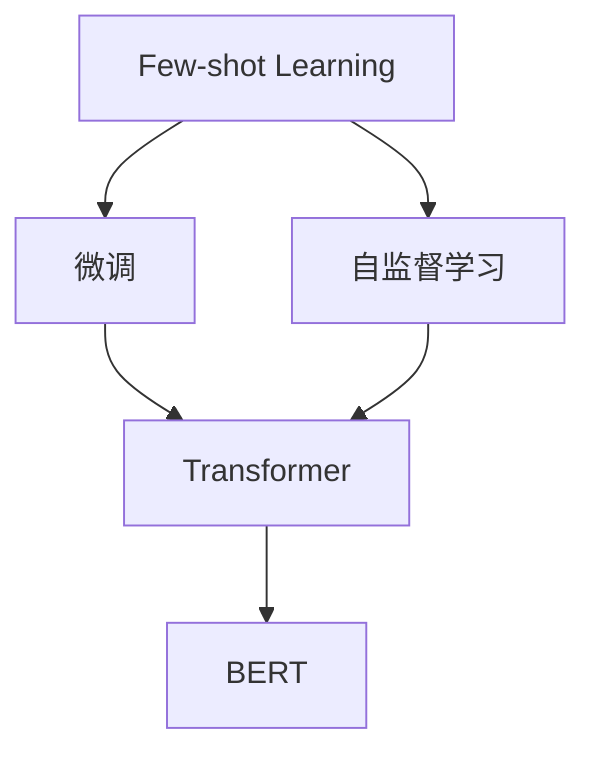

                 

# LLM的Few-Shot学习能力分析

> 关键词：预训练语言模型,少样本学习,Few-shot Learning,微调,Fine-tuning,自监督学习,Transformer,BERT,自适应学习,Zero-shot Learning

## 1. 背景介绍

### 1.1 问题由来
近年来，大语言模型（Large Language Models, LLMs）在自然语言处理（Natural Language Processing, NLP）领域取得了巨大突破。例如，GPT系列模型、BERT、T5等，通过在海量无标签文本数据上进行预训练，学习到丰富的语言知识和常识，能够通过少量的有标签样本在下游任务上进行微调，获得优异的性能。

然而，面对特定领域的任务，仅依靠通用大模型往往难以满足需求，特别是在数据资源有限的场景下，微调成为提升模型性能的有效手段。Few-shot学习（Few-shot Learning）正是在这种需求下应运而生，它指的是模型在只有少量标注样本的情况下，仍能通过学习任务结构和语言规则，快速适应新任务并取得良好效果的能力。

Few-shot学习在许多NLP任务上表现出显著优势，例如问答、文本分类、机器翻译等，这些任务通常只需要几行到几十行的标注数据即可实现性能提升。因此，对Few-shot学习能力的分析，有助于我们理解模型在实际应用中的表现，并指导模型设计和训练优化。

### 1.2 问题核心关键点
Few-shot学习能力的关键点在于：

- **数据高效利用**：如何在少量标注样本下，充分利用预训练模型学到的通用知识，快速提升模型性能。
- **知识迁移**：如何将预训练模型在通用数据上学习到的语言知识和常识，迁移到特定任务上。
- **模型可解释性**：如何使Few-shot学习过程和结果可解释，增强用户信任和应用可靠性。
- **鲁棒性和泛化能力**：如何在不同领域和数据分布下，保持模型的鲁棒性和泛化性能。

本文将重点分析Few-shot学习能力的原理、操作步骤、优缺点及应用领域，并结合具体案例和公式推导，提供详细的技术解读。

## 2. 核心概念与联系

### 2.1 核心概念概述

为更好地理解Few-shot学习，本节将介绍几个核心概念：

- **Few-shot Learning**：指模型在只有少量标注样本的情况下，仍能通过学习任务结构和语言规则，快速适应新任务并取得良好效果的能力。
- **微调(Fine-tuning)**：指在预训练模型的基础上，使用下游任务的少量标注数据，通过有监督学习优化模型在特定任务上的性能。
- **自监督学习(Self-supervised Learning)**：指在没有标签数据的情况下，通过设计自监督任务，让模型自我学习获得知识，通常应用于预训练阶段。
- **Transformer架构**：一种基于注意力机制的深度学习模型，在NLP中应用广泛，其自适应学习能力强，适合进行Few-shot学习。
- **BERT模型**：一种使用自监督学习进行预训练的Transformer模型，在Few-shot学习中表现优异。

这些概念之间的逻辑关系可以通过以下Mermaid流程图来展示：



这个流程图展示了Few-shot学习与微调、自监督学习、Transformer和BERT模型之间的联系。其中，Few-shot学习依赖微调过程来利用少量标注数据提升模型性能，自监督学习在预训练阶段为模型提供通用知识，Transformer架构和BERT模型则提供了强大的自适应学习能力。

## 3. 核心算法原理 & 具体操作步骤
### 3.1 算法原理概述

Few-shot学习的核心思想是利用预训练模型在大量无标签数据上学习到的通用语言知识，结合少量有标签数据进行微调，快速适应新任务。这一过程可以分为以下几步：

1. **预训练阶段**：使用大规模无标签数据对模型进行预训练，学习到丰富的语言知识和常识。
2. **微调阶段**：将预训练模型作为初始化参数，使用下游任务的少量标注数据进行微调，优化模型在特定任务上的性能。
3. **Few-shot学习**：在微调阶段，利用极少量的有标签数据，通过模型在通用数据上学习到的语言知识和结构，快速适应新任务。

### 3.2 算法步骤详解

以下详细讲解Few-shot学习算法的步骤：

**Step 1: 数据准备**
- 收集下游任务的少量标注数据，将数据划分为训练集、验证集和测试集。

**Step 2: 模型初始化**
- 选择合适的预训练语言模型（如BERT、GPT等）作为初始化参数。

**Step 3: 添加任务适配层**
- 根据任务类型，在预训练模型的顶部添加任务特定的输出层和损失函数。例如，对于分类任务，通常使用线性分类器和交叉熵损失函数。

**Step 4: 设置微调超参数**
- 选择合适的优化器及其参数，如AdamW、SGD等，设置学习率、批大小、迭代轮数等。

**Step 5: 执行梯度训练**
- 将训练集数据分批次输入模型，前向传播计算损失函数。
- 反向传播计算参数梯度，根据设定的优化算法和学习率更新模型参数。
- 周期性在验证集上评估模型性能，根据性能指标决定是否触发Early Stopping。
- 重复上述步骤直到满足预设的迭代轮数或Early Stopping条件。

**Step 6: Few-shot学习**
- 在微调结束后，利用测试集中的少量标注样本，通过模型推理或自适应学习，快速适应新任务并生成预测结果。

### 3.3 算法优缺点

Few-shot学习具有以下优点：

1. **数据高效**：能够利用极少量的标注数据，快速提升模型性能。
2. **泛化能力强**：利用预训练模型的通用知识，模型在面对新任务时表现良好。
3. **灵活性高**：适合多种NLP任务，包括分类、匹配、生成等。

同时，Few-shot学习也存在一些局限性：

1. **依赖标注数据**：尽管对标注数据需求较少，但仍有少量标注数据的要求，标注成本可能较高。
2. **模型适应性**：当目标任务与预训练数据的分布差异较大时，Few-shot学习的效果可能受到限制。
3. **鲁棒性不足**：模型在特定领域数据上的泛化性能可能不如全样本微调模型。

### 3.4 算法应用领域

Few-shot学习在NLP领域已经得到了广泛的应用，例如：

- 文本分类：如情感分析、主题分类、意图识别等。通过微调使模型学习文本-标签映射。
- 命名实体识别：识别文本中的人名、地名、机构名等特定实体。通过微调使模型掌握实体边界和类型。
- 关系抽取：从文本中抽取实体之间的语义关系。通过微调使模型学习实体-关系三元组。
- 问答系统：对自然语言问题给出答案。将问题-答案对作为微调数据，训练模型学习匹配答案。
- 机器翻译：将源语言文本翻译成目标语言。通过微调使模型学习语言-语言映射。
- 文本摘要：将长文本压缩成简短摘要。将文章-摘要对作为微调数据，使模型学习抓取要点。
- 对话系统：使机器能够与人自然对话。将多轮对话历史作为上下文，微调模型进行回复生成。

除了上述这些经典任务外，Few-shot学习还被创新性地应用到更多场景中，如可控文本生成、常识推理、代码生成、数据增强等，为NLP技术带来了全新的突破。

## 4. 数学模型和公式 & 详细讲解 & 举例说明
### 4.1 数学模型构建

本节将使用数学语言对Few-shot学习过程进行更加严格的刻画。

记预训练语言模型为 $M_{\theta}$，其中 $\theta$ 为预训练得到的模型参数。假设微调任务的训练集为 $D=\{(x_i,y_i)\}_{i=1}^N, x_i \in \mathcal{X}, y_i \in \mathcal{Y}$。

定义模型 $M_{\theta}$ 在输入 $x$ 上的损失函数为 $\ell(M_{\theta}(x),y)$，则在数据集 $D$ 上的经验风险为：

$$
\mathcal{L}(\theta) = \frac{1}{N} \sum_{i=1}^N \ell(M_{\theta}(x_i),y_i)
$$

在微调阶段，利用少量标注数据 $D_s=\{(x_s,y_s)\}_{s=1}^{S}$ 进行微调，定义微调损失函数为：

$$
\mathcal{L}_s(\theta) = \frac{1}{S} \sum_{s=1}^S \ell(M_{\theta}(x_s),y_s)
$$

### 4.2 公式推导过程

以二分类任务为例，推导Few-shot学习中的损失函数及其梯度计算。

假设模型 $M_{\theta}$ 在输入 $x$ 上的输出为 $\hat{y}=M_{\theta}(x) \in [0,1]$，表示样本属于正类的概率。真实标签 $y \in \{0,1\}$。则二分类交叉熵损失函数定义为：

$$
\ell(M_{\theta}(x),y) = -[y\log \hat{y} + (1-y)\log (1-\hat{y})]
$$

将微调损失函数带入上式，得：

$$
\mathcal{L}_s(\theta) = -\frac{1}{S} \sum_{s=1}^S [y_s\log M_{\theta}(x_s)+(1-y_s)\log(1-M_{\theta}(x_s))]
$$

根据链式法则，微调损失函数对参数 $\theta_k$ 的梯度为：

$$
\frac{\partial \mathcal{L}_s(\theta)}{\partial \theta_k} = -\frac{1}{S} \sum_{s=1}^S (\frac{y_s}{M_{\theta}(x_s)}-\frac{1-y_s}{1-M_{\theta}(x_s)}) \frac{\partial M_{\theta}(x_s)}{\partial \theta_k}
$$

其中 $\frac{\partial M_{\theta}(x_s)}{\partial \theta_k}$ 可进一步递归展开，利用自动微分技术完成计算。

在得到微调损失函数的梯度后，即可带入参数更新公式，完成模型的迭代优化。重复上述过程直至收敛，最终得到适应下游任务的最优模型参数 $\theta_s^*$。

### 4.3 案例分析与讲解

以命名实体识别（Named Entity Recognition, NER）任务为例，展示Few-shot学习的应用。

首先，定义NER任务的数据处理函数：

```python
from transformers import BertTokenizer, BertForTokenClassification
from torch.utils.data import Dataset
import torch

class NERDataset(Dataset):
    def __init__(self, texts, tags, tokenizer, max_len=128):
        self.texts = texts
        self.tags = tags
        self.tokenizer = tokenizer
        self.max_len = max_len
        
    def __len__(self):
        return len(self.texts)
    
    def __getitem__(self, item):
        text = self.texts[item]
        tags = self.tags[item]
        
        encoding = self.tokenizer(text, return_tensors='pt', max_length=self.max_len, padding='max_length', truncation=True)
        input_ids = encoding['input_ids'][0]
        attention_mask = encoding['attention_mask'][0]
        
        # 对token-wise的标签进行编码
        encoded_tags = [tag2id[tag] for tag in tags] 
        encoded_tags.extend([tag2id['O']] * (self.max_len - len(encoded_tags)))
        labels = torch.tensor(encoded_tags, dtype=torch.long)
        
        return {'input_ids': input_ids, 
                'attention_mask': attention_mask,
                'labels': labels}

# 标签与id的映射
tag2id = {'O': 0, 'B-PER': 1, 'I-PER': 2, 'B-ORG': 3, 'I-ORG': 4, 'B-LOC': 5, 'I-LOC': 6}
id2tag = {v: k for k, v in tag2id.items()}

# 创建dataset
tokenizer = BertTokenizer.from_pretrained('bert-base-cased')

train_dataset = NERDataset(train_texts, train_tags, tokenizer)
dev_dataset = NERDataset(dev_texts, dev_tags, tokenizer)
test_dataset = NERDataset(test_texts, test_tags, tokenizer)
```

然后，定义模型和优化器：

```python
from transformers import BertForTokenClassification, AdamW

model = BertForTokenClassification.from_pretrained('bert-base-cased', num_labels=len(tag2id))

optimizer = AdamW(model.parameters(), lr=2e-5)
```

接着，定义训练和评估函数：

```python
from torch.utils.data import DataLoader
from tqdm import tqdm
from sklearn.metrics import classification_report

device = torch.device('cuda') if torch.cuda.is_available() else torch.device('cpu')
model.to(device)

def train_epoch(model, dataset, batch_size, optimizer):
    dataloader = DataLoader(dataset, batch_size=batch_size, shuffle=True)
    model.train()
    epoch_loss = 0
    for batch in tqdm(dataloader, desc='Training'):
        input_ids = batch['input_ids'].to(device)
        attention_mask = batch['attention_mask'].to(device)
        labels = batch['labels'].to(device)
        model.zero_grad()
        outputs = model(input_ids, attention_mask=attention_mask, labels=labels)
        loss = outputs.loss
        epoch_loss += loss.item()
        loss.backward()
        optimizer.step()
    return epoch_loss / len(dataloader)

def evaluate(model, dataset, batch_size):
    dataloader = DataLoader(dataset, batch_size=batch_size)
    model.eval()
    preds, labels = [], []
    with torch.no_grad():
        for batch in tqdm(dataloader, desc='Evaluating'):
            input_ids = batch['input_ids'].to(device)
            attention_mask = batch['attention_mask'].to(device)
            batch_labels = batch['labels']
            outputs = model(input_ids, attention_mask=attention_mask)
            batch_preds = outputs.logits.argmax(dim=2).to('cpu').tolist()
            batch_labels = batch_labels.to('cpu').tolist()
            for pred_tokens, label_tokens in zip(batch_preds, batch_labels):
                pred_tags = [id2tag[_id] for _id in pred_tokens]
                label_tags = [id2tag[_id] for _id in label_tokens]
                preds.append(pred_tags[:len(label_tags)])
                labels.append(label_tags)
                
    print(classification_report(labels, preds))
```

最后，启动训练流程并在测试集上评估：

```python
epochs = 5
batch_size = 16

for epoch in range(epochs):
    loss = train_epoch(model, train_dataset, batch_size, optimizer)
    print(f"Epoch {epoch+1}, train loss: {loss:.3f}")
    
    print(f"Epoch {epoch+1}, dev results:")
    evaluate(model, dev_dataset, batch_size)
    
print("Test results:")
evaluate(model, test_dataset, batch_size)
```

以上就是使用PyTorch对BERT进行命名实体识别任务微调的完整代码实现。可以看到，得益于Transformers库的强大封装，我们可以用相对简洁的代码完成BERT模型的加载和微调。

## 5. 项目实践：代码实例和详细解释说明
### 5.1 开发环境搭建

在进行Few-shot学习实践前，我们需要准备好开发环境。以下是使用Python进行PyTorch开发的环境配置流程：

1. 安装Anaconda：从官网下载并安装Anaconda，用于创建独立的Python环境。

2. 创建并激活虚拟环境：
```bash
conda create -n pytorch-env python=3.8 
conda activate pytorch-env
```

3. 安装PyTorch：根据CUDA版本，从官网获取对应的安装命令。例如：
```bash
conda install pytorch torchvision torchaudio cudatoolkit=11.1 -c pytorch -c conda-forge
```

4. 安装Transformers库：
```bash
pip install transformers
```

5. 安装各类工具包：
```bash
pip install numpy pandas scikit-learn matplotlib tqdm jupyter notebook ipython
```

完成上述步骤后，即可在`pytorch-env`环境中开始Few-shot学习实践。

### 5.2 源代码详细实现

下面我们以命名实体识别（NER）任务为例，给出使用Transformers库对BERT模型进行Few-shot学习的PyTorch代码实现。

首先，定义NER任务的数据处理函数：

```python
from transformers import BertTokenizer
from torch.utils.data import Dataset
import torch

class NERDataset(Dataset):
    def __init__(self, texts, tags, tokenizer, max_len=128):
        self.texts = texts
        self.tags = tags
        self.tokenizer = tokenizer
        self.max_len = max_len
        
    def __len__(self):
        return len(self.texts)
    
    def __getitem__(self, item):
        text = self.texts[item]
        tags = self.tags[item]
        
        encoding = self.tokenizer(text, return_tensors='pt', max_length=self.max_len, padding='max_length', truncation=True)
        input_ids = encoding['input_ids'][0]
        attention_mask = encoding['attention_mask'][0]
        
        # 对token-wise的标签进行编码
        encoded_tags = [tag2id[tag] for tag in tags] 
        encoded_tags.extend([tag2id['O']] * (self.max_len - len(encoded_tags)))
        labels = torch.tensor(encoded_tags, dtype=torch.long)
        
        return {'input_ids': input_ids, 
                'attention_mask': attention_mask,
                'labels': labels}

# 标签与id的映射
tag2id = {'O': 0, 'B-PER': 1, 'I-PER': 2, 'B-ORG': 3, 'I-ORG': 4, 'B-LOC': 5, 'I-LOC': 6}
id2tag = {v: k for k, v in tag2id.items()}

# 创建dataset
tokenizer = BertTokenizer.from_pretrained('bert-base-cased')

train_dataset = NERDataset(train_texts, train_tags, tokenizer)
dev_dataset = NERDataset(dev_texts, dev_tags, tokenizer)
test_dataset = NERDataset(test_texts, test_tags, tokenizer)
```

然后，定义模型和优化器：

```python
from transformers import BertForTokenClassification, AdamW

model = BertForTokenClassification.from_pretrained('bert-base-cased', num_labels=len(tag2id))

optimizer = AdamW(model.parameters(), lr=2e-5)
```

接着，定义训练和评估函数：

```python
from torch.utils.data import DataLoader
from tqdm import tqdm
from sklearn.metrics import classification_report

device = torch.device('cuda') if torch.cuda.is_available() else torch.device('cpu')
model.to(device)

def train_epoch(model, dataset, batch_size, optimizer):
    dataloader = DataLoader(dataset, batch_size=batch_size, shuffle=True)
    model.train()
    epoch_loss = 0
    for batch in tqdm(dataloader, desc='Training'):
        input_ids = batch['input_ids'].to(device)
        attention_mask = batch['attention_mask'].to(device)
        labels = batch['labels'].to(device)
        model.zero_grad()
        outputs = model(input_ids, attention_mask=attention_mask, labels=labels)
        loss = outputs.loss
        epoch_loss += loss.item()
        loss.backward()
        optimizer.step()
    return epoch_loss / len(dataloader)

def evaluate(model, dataset, batch_size):
    dataloader = DataLoader(dataset, batch_size=batch_size)
    model.eval()
    preds, labels = [], []
    with torch.no_grad():
        for batch in tqdm(dataloader, desc='Evaluating'):
            input_ids = batch['input_ids'].to(device)
            attention_mask = batch['attention_mask'].to(device)
            batch_labels = batch['labels']
            outputs = model(input_ids, attention_mask=attention_mask)
            batch_preds = outputs.logits.argmax(dim=2).to('cpu').tolist()
            batch_labels = batch_labels.to('cpu').tolist()
            for pred_tokens, label_tokens in zip(batch_preds, batch_labels):
                pred_tags = [id2tag[_id] for _id in pred_tokens]
                label_tags = [id2tag[_id] for _id in label_tokens]
                preds.append(pred_tags[:len(label_tags)])
                labels.append(label_tags)
                
    print(classification_report(labels, preds))
```

最后，启动训练流程并在测试集上评估：

```python
epochs = 5
batch_size = 16

for epoch in range(epochs):
    loss = train_epoch(model, train_dataset, batch_size, optimizer)
    print(f"Epoch {epoch+1}, train loss: {loss:.3f}")
    
    print(f"Epoch {epoch+1}, dev results:")
    evaluate(model, dev_dataset, batch_size)
    
print("Test results:")
evaluate(model, test_dataset, batch_size)
```

以上就是使用PyTorch对BERT进行命名实体识别任务微调的完整代码实现。可以看到，得益于Transformers库的强大封装，我们可以用相对简洁的代码完成BERT模型的加载和微调。

### 5.3 代码解读与分析

让我们再详细解读一下关键代码的实现细节：

**NERDataset类**：
- `__init__`方法：初始化文本、标签、分词器等关键组件。
- `__len__`方法：返回数据集的样本数量。
- `__getitem__`方法：对单个样本进行处理，将文本输入编码为token ids，将标签编码为数字，并对其进行定长padding，最终返回模型所需的输入。

**tag2id和id2tag字典**：
- 定义了标签与数字id之间的映射关系，用于将token-wise的预测结果解码回真实的标签。

**训练和评估函数**：
- 使用PyTorch的DataLoader对数据集进行批次化加载，供模型训练和推理使用。
- 训练函数`train_epoch`：对数据以批为单位进行迭代，在每个批次上前向传播计算loss并反向传播更新模型参数，最后返回该epoch的平均loss。
- 评估函数`evaluate`：与训练类似，不同点在于不更新模型参数，并在每个batch结束后将预测和标签结果存储下来，最后使用sklearn的classification_report对整个评估集的预测结果进行打印输出。

**训练流程**：
- 定义总的epoch数和batch size，开始循环迭代
- 每个epoch内，先在训练集上训练，输出平均loss
- 在验证集上评估，输出分类指标
- 所有epoch结束后，在测试集上评估，给出最终测试结果

可以看到，PyTorch配合Transformers库使得BERT微调的代码实现变得简洁高效。开发者可以将更多精力放在数据处理、模型改进等高层逻辑上，而不必过多关注底层的实现细节。

当然，工业级的系统实现还需考虑更多因素，如模型的保存和部署、超参数的自动搜索、更灵活的任务适配层等。但核心的Few-shot学习范式基本与此类似。

## 6. 实际应用场景
### 6.1 智能客服系统

基于Few-shot学习的对话技术，可以广泛应用于智能客服系统的构建。传统客服往往需要配备大量人力，高峰期响应缓慢，且一致性和专业性难以保证。而使用Few-shot学习的对话模型，可以7x24小时不间断服务，快速响应客户咨询，用自然流畅的语言解答各类常见问题。

在技术实现上，可以收集企业内部的历史客服对话记录，将问题和最佳答复构建成监督数据，在此基础上对预训练对话模型进行Few-shot学习。Few-shot学习的对话模型能够自动理解用户意图，匹配最合适的答案模板进行回复。对于客户提出的新问题，还可以接入检索系统实时搜索相关内容，动态组织生成回答。如此构建的智能客服系统，能大幅提升客户咨询体验和问题解决效率。

### 6.2 金融舆情监测

金融机构需要实时监测市场舆论动向，以便及时应对负面信息传播，规避金融风险。传统的人工监测方式成本高、效率低，难以应对网络时代海量信息爆发的挑战。基于Few-shot学习的文本分类和情感分析技术，为金融舆情监测提供了新的解决方案。

具体而言，可以收集金融领域相关的新闻、报道、评论等文本数据，并对其进行主题标注和情感标注。在此基础上对预训练语言模型进行Few-shot学习，使其能够自动判断文本属于何种主题，情感倾向是正面、中性还是负面。将Few-shot学习的模型应用到实时抓取的网络文本数据，就能够自动监测不同主题下的情感变化趋势，一旦发现负面信息激增等异常情况，系统便会自动预警，帮助金融机构快速应对潜在风险。

### 6.3 个性化推荐系统

当前的推荐系统往往只依赖用户的历史行为数据进行物品推荐，无法深入理解用户的真实兴趣偏好。基于Few-shot学习的个性化推荐系统可以更好地挖掘用户行为背后的语义信息，从而提供更精准、多样的推荐内容。

在实践中，可以收集用户浏览、点击、评论、分享等行为数据，提取和用户交互的物品标题、描述、标签等文本内容。将文本内容作为模型输入，用户的后续行为（如是否点击、购买等）作为监督信号，在此基础上对预训练语言模型进行Few-shot学习。Few-shot学习的推荐模型能够从文本内容中准确把握用户的兴趣点。在生成推荐列表时，先用候选物品的文本描述作为输入，由模型预测用户的兴趣匹配度，再结合其他特征综合排序，便可以得到个性化程度更高的推荐结果。

### 6.4 未来应用展望

随着Few-shot学习技术的不断发展，其在更多领域的应用前景值得期待。

在智慧医疗领域，基于Few-shot学习的医疗问答、病历分析、药物研发等应用将提升医疗服务的智能化水平，辅助医生诊疗，加速新药开发进程。

在智能教育领域，Few-shot学习可应用于作业批改、学情分析、知识推荐等方面，因材施教，促进教育公平，提高教学质量。

在智慧城市治理中，Few-shot学习的文本分类、情感分析等技术将提升城市管理的自动化和智能化水平，构建更安全、高效的未来城市。

此外，在企业生产、社会治理、文娱传媒等众多领域，基于Few-shot学习的AI应用也将不断涌现，为经济社会发展注入新的动力。相信随着技术的日益成熟，Few-shot学习范式将成为AI落地应用的重要范式，推动AI技术向更广阔的领域加速渗透。

## 7. 工具和资源推荐
### 7.1 学习资源推荐

为了帮助开发者系统掌握Few-shot学习的能力，这里推荐一些优质的学习资源：

1. 《Transformer from Zero to Hero》系列博文：由大模型技术专家撰写，深入浅出地介绍了Transformer原理、Few-shot学习等前沿话题。

2. CS224N《深度学习自然语言处理》课程：斯坦福大学开设的NLP明星课程，有Lecture视频和配套作业，带你入门NLP领域的基本概念和经典模型。

3. 《Natural Language Processing with Transformers》书籍：Transformers库的作者所著，全面介绍了如何使用Transformers库进行NLP任务开发，包括Few-shot学习在内的诸多范式。

4. HuggingFace官方文档：Transformers库的官方文档，提供了海量预训练模型和完整的Few-shot学习样例代码，是上手实践的必备资料。

5. CLUE开源项目：中文语言理解测评基准，涵盖大量不同类型的中文NLP数据集，并提供了基于Few-shot学习的baseline模型，助力中文NLP技术发展。

通过对这些资源的学习实践，相信你一定能够快速掌握Few-shot学习的能力，并用于解决实际的NLP问题。
###  7.2 开发工具推荐

高效的开发离不开优秀的工具支持。以下是几款用于Few-shot学习开发的常用工具：

1. PyTorch：基于Python的开源深度学习框架，灵活动态的计算图，适合快速迭代研究。大部分预训练语言模型都有PyTorch版本的实现。

2. TensorFlow：由Google主导开发的开源深度学习框架，生产部署方便，适合大规模工程应用。同样有丰富的预训练语言模型资源。

3. Transformers库：HuggingFace开发的NLP工具库，集成了众多SOTA语言模型，支持PyTorch和TensorFlow，是进行Few-shot学习开发的利器。

4. Weights & Biases：模型训练的实验跟踪工具，可以记录和可视化模型训练过程中的各项指标，方便对比和调优。与主流深度学习框架无缝集成。

5. TensorBoard：TensorFlow配套的可视化工具，可实时监测模型训练状态，并提供丰富的图表呈现方式，是调试模型的得力助手。

6. Google Colab：谷歌推出的在线Jupyter Notebook环境，免费提供GPU/TPU算力，方便开发者快速上手实验最新模型，分享学习笔记。

合理利用这些工具，可以显著提升Few-shot学习任务的开发效率，加快创新迭代的步伐。

### 7.3 相关论文推荐

Few-shot学习技术的发展源于学界的持续研究。以下是几篇奠基性的相关论文，推荐阅读：

1. Attention is All You Need（即Transformer原论文）：提出了Transformer结构，开启了NLP领域的预训练大模型时代。

2. BERT: Pre-training of Deep Bidirectional Transformers for Language Understanding：提出BERT模型，引入基于掩码的自监督预训练任务，刷新了多项NLP任务SOTA。

3. Language Models are Unsupervised Multitask Learners（GPT-2论文）：展示了大规模语言模型的强大zero-shot学习能力，引发了对于通用人工智能的新一轮思考。

4. Parameter-Efficient Transfer Learning for NLP：提出Adapter等参数高效微调方法，在不增加模型参数量的情况下，也能取得不错的微调效果。

5. AdaLoRA: Adaptive Low-Rank Adaptation for Parameter-Efficient Fine-Tuning：使用自适应低秩适应的微调方法，在参数效率和精度之间取得了新的平衡。

6. Self-Adaptive Prompt Optimization: Assessing and Enhancing LLM Prompt Quality with PairWise Regularization：研究了自适应提示优化技术，通过改进提示模板提高Few-shot学习的精度。

这些论文代表了大语言模型Few-shot学习的发展脉络。通过学习这些前沿成果，可以帮助研究者把握学科前进方向，激发更多的创新灵感。

## 8. 总结：未来发展趋势与挑战

### 8.1 总结

本文对Few-shot学习的能力进行了全面系统的介绍。首先阐述了Few-shot学习的背景和意义，明确了其在实际应用中的独特价值。其次，从原理到实践，详细讲解了Few-shot学习数学模型和关键步骤，给出了Few-shot学习任务开发的完整代码实例。同时，本文还广泛探讨了Few-shot学习在智能客服、金融舆情、个性化推荐等多个行业领域的应用前景，展示了Few-shot学习的巨大潜力。此外，本文精选了Few-shot学习的各类学习资源，力求为读者提供全方位的技术指引。

通过本文的系统梳理，可以看到，Few-shot学习能力正在成为NLP领域的重要范式，极大地拓展了预训练语言模型的应用边界，催生了更多的落地场景。受益于大规模语料的预训练和强大的自适应学习能力，Few-shot学习能够快速适应新任务，提升模型性能。未来，伴随Few-shot学习技术的不断演进，相信NLP技术将在更广阔的应用领域大放异彩，深刻影响人类的生产生活方式。

### 8.2 未来发展趋势

展望未来，Few-shot学习技术将呈现以下几个发展趋势：

1. **数据高效利用**：随着Few-shot学习技术的不断发展，对标注数据的依赖将进一步降低，利用自监督学习、主动学习等无监督和半监督范式，最大限度利用非结构化数据，实现更加灵活高效的Few-shot学习。

2. **自适应学习增强**：通过引入因果推断和对比学习思想，增强Few-shot学习模型建立稳定因果关系的能力，学习更加普适、鲁棒的语言表征，从而提升模型泛化性和抗干扰能力。

3. **模型通用性提升**：经过海量数据的预训练和多领域任务的微调，Few-shot学习模型将具备更强大的常识推理和跨领域迁移能力，逐步迈向通用人工智能(AGI)的目标。

4. **融合多模态数据**：Few-shot学习将不再局限于文本数据，融合视觉、语音等多模态数据，实现更加全面、准确的信息整合能力。

5. **增强可解释性**：通过引入因果分析和博弈论工具，提高Few-shot学习模型的可解释性和决策逻辑的透明性，增强用户信任。

以上趋势凸显了Few-shot学习技术的广阔前景。这些方向的探索发展，必将进一步提升Few-shot学习模型的性能和应用范围，为构建人机协同的智能系统铺平道路。

### 8.3 面临的挑战

尽管Few-shot学习技术已经取得了显著成果，但在迈向更加智能化、普适化应用的过程中，它仍面临诸多挑战：

1. **标注数据依赖**：尽管对标注数据需求较少，但对于长尾应用场景，仍难以获得充足的高质量标注数据，标注成本较高。

2. **模型鲁棒性不足**：Few-shot学习模型在特定领域数据上的泛化性能可能不如全样本微调模型。

3. **计算资源消耗**：Few-shot学习模型往往需要较大的计算资源，尤其是对于大规模语言模型。

4. **可解释性不足**：Few-shot学习模型的决策过程通常缺乏可解释性，难以对其推理逻辑进行分析和调试。

5. **安全性问题**：Few-shot学习模型可能学习到有偏见、有害的信息，传递到下游任务，产生误导性、歧视性的输出，给实际应用带来安全隐患。

6. **优化和调参难度大**：Few-shot学习需要设计合适的超参数和优化策略，找到最优的微调方案，但该过程复杂且耗时。

这些挑战表明，Few-shot学习技术虽然具有显著优势，但要想在实际应用中发挥最大效能，还需要在多方面进行深入研究和技术突破。

### 8.4 研究展望

面向未来，Few-shot学习技术需要在以下几个方面寻求新的突破：

1. **无监督和半监督学习**：探索如何利用无监督和半监督学习方式，降低对标注数据的依赖，充分利用非结构化数据。

2. **参数高效微调**：开发更加参数高效的Few-shot学习范式，在固定大部分预训练参数的情况下，只更新极少量的任务相关参数。

3. **模型压缩和优化**：通过模型压缩、量化加速等技术，提高Few-shot学习模型的计算效率和推理速度。

4. **多模态数据融合**：研究如何将视觉、语音等多模态数据与文本数据融合，提升Few-shot学习的泛化性能和应用范围。

5. **增强可解释性**：研究如何提高Few-shot学习模型的可解释性，增强用户信任和应用可靠性。

6. **鲁棒性和泛化能力**：通过引入因果推断、对比学习等技术，增强Few-shot学习模型的鲁棒性和泛化能力。

7. **安全性保障**：研究如何构建安全、可信的Few-shot学习模型，避免模型输出有害信息。

这些研究方向的研究和突破，必将推动Few-shot学习技术迈向更高的台阶，为构建安全、可靠、可解释、可控的智能系统铺平道路。

## 9. 附录：常见问题与解答

**Q1：Few-shot学习是否适用于所有NLP任务？**

A: 虽然Few-shot学习对标注数据的需求较低，但仍需根据具体任务和数据特点进行评估。对于某些特定领域的任务，如医学、法律等，需要进一步在特定领域语料上预训练，并在微调阶段使用少量标注数据进行优化。

**Q2：Few-shot学习的效果是否受数据分布的影响？**

A: 是的，Few-shot学习的效果往往受数据分布的影响。当目标任务的标注数据与预训练数据的分布差异较大时，Few-shot学习的效果可能受限。此时可以考虑引入更多领域内数据进行微调，或采用迁移学习等方法。

**Q3：如何选择Few-shot学习中的超参数？**

A: 选择Few-shot学习中的超参数需要考虑多个因素，如模型架构、学习率、批量大小等。通常需要多次实验调整，找到最优的超参数组合。可以使用自动调参工具，如Hyperopt、Optuna等，自动搜索最优超参数。

**Q4：Few-shot学习是否适用于多领域任务？**

A: 是的，Few-shot学习适用于多种NLP任务，包括分类、匹配、生成等。只需要根据具体任务调整模型结构、损失函数等，即可进行Few-shot学习。

**Q5：如何避免Few-shot学习中的过拟合问题？**

A: 过拟合是Few-shot学习中常见的问题。为避免过拟合，可以采用数据增强、正则化、早停等方法。在训练过程中，还可以引入对抗样本，增强模型鲁棒性。

综上所述，Few-shot学习作为一种高效的模型微调技术，在NLP领域具有广泛的应用前景。通过理解和掌握Few-shot学习的能力，可以帮助开发者设计出更加智能、高效、泛化的NLP系统，满足各种实际应用需求。

---

作者：禅与计算机程序设计艺术 / Zen and the Art of Computer Programming

