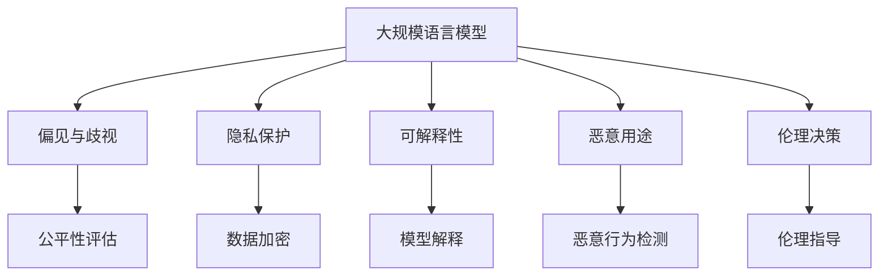

                 

# LLM的伦理挑战：如何约束AI行为

## 1. 背景介绍

### 1.1 问题由来
随着大规模语言模型（Large Language Models, LLMs）在自然语言处理（Natural Language Processing, NLP）领域取得突破性进展，其应用日益广泛，包括智能客服、自动翻译、自然语言推理、创意写作等。尽管LLMs带来了显著的效率提升和便利性，但它们也伴随着一系列伦理挑战。

**主要伦理问题**包括：
1. **偏见与歧视**：LLMs可能继承训练数据中的偏见，生成歧视性或有害的输出。
2. **隐私保护**：LLMs处理大量个人数据，存在隐私泄露风险。
3. **透明度与可解释性**：LLMs作为“黑盒”模型，其决策过程难以解释，不利于用户信任。
4. **恶意用途**：LLMs可能被用于生成假新闻、网络欺诈等不良行为。
5. **道德伦理**：LLMs的应用可能涉及伦理决策，如自动驾驶中的道德困境。

这些伦理问题引发了广泛关注，并促使学术界和工业界对LLMs的行为约束进行深入研究。本文将详细探讨LLMs的伦理挑战，并提出一些约束AI行为的策略。

### 1.2 问题核心关键点
面对上述伦理挑战，我们需要从多个维度对LLMs的行为进行约束：
- **数据治理**：确保训练数据的多样性和代表性，减少偏见和歧视。
- **模型公平性**：设计公平性评估指标，检测并纠正模型输出中的偏见。
- **隐私保护**：实施数据加密和匿名化，保护用户隐私。
- **可解释性**：开发可解释性技术，增强模型透明度。
- **安全防护**：设计检测机制，防止模型被用于恶意用途。
- **伦理决策**：开发伦理指南，指导LLMs的道德决策。

## 2. 核心概念与联系

### 2.1 核心概念概述

为更好地理解LLMs的伦理约束，我们首先介绍几个关键概念：

- **大规模语言模型（LLMs）**：指基于深度学习架构的预训练模型，能够处理大规模文本数据，具备强大的语言理解和生成能力。
- **偏见与歧视**：指模型在训练数据中学习到的非公平偏见，可能导致输出中存在歧视性内容。
- **隐私保护**：指对用户数据进行加密、匿名化等处理，保护个人隐私不受侵害。
- **可解释性**：指模型的决策过程可以被理解、解释，提高用户信任和满意度。
- **恶意用途**：指模型被用于生成假新闻、网络欺诈等不良行为，威胁社会安全。
- **伦理决策**：指在AI应用中，模型能够进行符合社会伦理的决策，如自动驾驶中的道德困境。

这些概念之间的逻辑关系可以通过以下Mermaid流程图来展示：



这个流程图展示了LLMs的各个核心概念及其之间的关系：

1. LLMs通过数据训练获取语言知识，但可能继承数据中的偏见与歧视。
2. 为了保护隐私，需要对数据进行加密和匿名化。
3. 为了提高用户信任，需要对模型进行可解释性处理。
4. 为了防止模型被用于恶意用途，需要检测并防止这些行为。
5. 为了确保道德决策，需要制定伦理指南并指导模型决策。

## 3. 核心算法原理 & 具体操作步骤

### 3.1 算法原理概述

约束LLMs的行为，本质上是通过一系列技术手段和政策指导，确保其输出符合伦理标准。具体而言，可以采用以下几种方法：

1. **数据筛选与治理**：确保训练数据的多样性和代表性，减少模型中的偏见。
2. **公平性评估与纠正**：检测模型输出中的偏见，并采取措施加以纠正。
3. **隐私保护技术**：采用数据加密、匿名化等技术，保护用户隐私。
4. **可解释性技术**：通过解释模型输出，提高模型的透明度和可解释性。
5. **恶意用途检测**：设计检测机制，防止模型被用于恶意用途。
6. **伦理决策框架**：制定伦理指导，确保LLMs的决策符合道德标准。

### 3.2 算法步骤详解

**步骤1：数据筛选与治理**

- **数据多样性**：确保训练数据覆盖广泛领域，包括不同语言、性别、年龄、种族等。
- **数据平衡**：调整数据分布，避免某类样本过多或过少。
- **数据清洗**：去除不合法、不道德的数据。

**步骤2：公平性评估与纠正**

- **偏见检测**：使用公平性指标（如均衡误差、平均绝对偏差等）评估模型输出中的偏见。
- **偏见纠正**：通过重加权、重采样等技术，纠正模型输出中的偏见。

**步骤3：隐私保护技术**

- **数据加密**：使用加密技术保护数据传输和存储。
- **匿名化**：通过数据脱敏、泛化等技术，去除个人信息。

**步骤4：可解释性技术**

- **模型解释**：通过可视化、文本解释等技术，解释模型输出。
- **透明机制**：建立透明机制，让用户了解模型的决策过程。

**步骤5：恶意用途检测**

- **行为监测**：实时监测模型的使用情况，识别恶意行为。
- **防护机制**：设计防护机制，防止模型被用于恶意用途。

**步骤6：伦理决策框架**

- **伦理指南**：制定伦理指南，指导模型的决策过程。
- **伦理评估**：评估模型的伦理决策能力，确保符合道德标准。

### 3.3 算法优缺点

**优点**：
- **可操作性强**：上述方法易于实现，适用于大多数LLMs。
- **多维约束**：通过多维度约束，全面提升LLMs的伦理水平。
- **用户信任**：提高模型的透明度和可解释性，增加用户信任。

**缺点**：
- **技术复杂**：需要综合运用多种技术手段，增加实施难度。
- **成本较高**：数据治理、隐私保护等需要投入大量资源。
- **误判风险**：某些模型可能难以完全满足所有伦理要求。

### 3.4 算法应用领域

基于上述方法，LLMs的伦理约束技术已在多个领域得到应用：

1. **智能客服**：通过数据治理和隐私保护，确保客服系统的公平性和用户隐私。
2. **自动翻译**：通过可解释性和恶意用途检测，提高翻译质量，防止错误信息传播。
3. **自然语言推理**：通过公平性评估和伦理决策框架，确保推理过程符合伦理标准。
4. **创意写作**：通过模型解释和伦理指导，生成符合伦理规范的内容。
5. **医学影像**：通过可解释性和伦理决策，提高医学影像分析的准确性和道德性。

## 4. 数学模型和公式 & 详细讲解 & 举例说明

### 4.1 数学模型构建

为了更严格地描述上述伦理约束方法，我们使用数学语言对关键技术进行建模。

假设模型在输入数据 $x$ 上的输出为 $y$，训练数据集为 $D=\{(x_i, y_i)\}_{i=1}^N$，其中 $x_i$ 为输入，$y_i$ 为标签。

**数据多样性**：
- **多样性度量**：使用Jensen-Shannon散度（JSD）衡量训练数据的多样性。
- **多样性目标**：最小化JSD，确保数据多样性。

**偏见检测**：
- **均衡误差**：计算不同类别样本的均衡误差，评估模型输出中的偏见。
- **平均绝对偏差**：计算不同类别样本的绝对偏差，评估模型输出中的偏见。

**隐私保护**：
- **数据加密**：采用对称加密算法，对数据进行加密处理。
- **匿名化**：通过数据脱敏技术，去除个人信息。

**可解释性**：
- **模型解释**：使用LIME（Local Interpretable Model-agnostic Explanations）算法，解释模型输出。
- **透明机制**：建立透明机制，让用户了解模型的决策过程。

**恶意用途检测**：
- **行为监测**：使用异常检测算法，监测模型行为。
- **防护机制**：设计防护机制，防止模型被用于恶意用途。

**伦理决策框架**：
- **伦理指南**：制定伦理指南，指导模型的决策过程。
- **伦理评估**：评估模型的伦理决策能力，确保符合道德标准。

### 4.2 公式推导过程

以下我们以偏见检测为例，推导均衡误差和平均绝对偏差的计算公式。

**均衡误差（Balanced Error）**：
- **定义**：均衡误差衡量模型在不同类别样本上的预测误差。
- **计算公式**：
$$
\text{Balanced Error} = \frac{1}{2} \left( |\text{TP} - \text{FP}| + |\text{TN} - \text{FN}| \right)
$$
其中，$\text{TP}$、$\text{FP}$、$\text{TN}$、$\text{FN}$分别表示真阳性、假阳性、真阴性和假阴性。

**平均绝对偏差（Mean Absolute Deviation）**：
- **定义**：平均绝对偏差衡量模型在类别平衡下的预测误差。
- **计算公式**：
$$
\text{Mean Absolute Deviation} = \frac{1}{N} \sum_{i=1}^N |y_i - \hat{y}_i|
$$

在得到上述公平性指标后，即可计算模型在不同类别样本上的偏见，并采取相应的纠正措施。

### 4.3 案例分析与讲解

**案例1：智能客服系统的偏见检测**

假设某智能客服系统在处理不同性别客户的问题时，输出响应存在偏见。具体表现为女性客户的响应时间更长，回答质量更低。为了检测和纠正这一偏见，可以采用以下步骤：

1. **数据筛选**：收集不同性别客户的客服记录，并标记响应时间和回答质量。
2. **偏见检测**：计算不同性别客户的均衡误差和平均绝对偏差，评估模型输出中的偏见。
3. **偏见纠正**：通过重加权或重采样技术，调整模型权重，减少性别偏见。
4. **模型评估**：在测试集上评估模型，确保偏见已得到纠正。

**案例2：自动翻译系统的隐私保护**

某自动翻译系统在处理用户翻译请求时，存在隐私泄露风险。为保护用户隐私，可以采用以下步骤：

1. **数据加密**：在数据传输和存储过程中，使用对称加密算法保护数据。
2. **匿名化**：对用户数据进行匿名化处理，去除个人信息。
3. **透明机制**：建立透明机制，让用户了解数据使用情况。
4. **模型评估**：评估翻译系统在隐私保护下的性能，确保隐私安全。

## 5. 项目实践：代码实例和详细解释说明

### 5.1 开发环境搭建

在进行LLMs的伦理约束实践前，我们需要准备好开发环境。以下是使用Python进行PyTorch开发的环境配置流程：

1. 安装Anaconda：从官网下载并安装Anaconda，用于创建独立的Python环境。

2. 创建并激活虚拟环境：
```bash
conda create -n pytorch-env python=3.8 
conda activate pytorch-env
```

3. 安装PyTorch：根据CUDA版本，从官网获取对应的安装命令。例如：
```bash
conda install pytorch torchvision torchaudio cudatoolkit=11.1 -c pytorch -c conda-forge
```

4. 安装TensorFlow：
```bash
pip install tensorflow
```

5. 安装TensorBoard：
```bash
pip install tensorboard
```

6. 安装sklearn：
```bash
pip install scikit-learn
```

完成上述步骤后，即可在`pytorch-env`环境中开始伦理约束实践。

### 5.2 源代码详细实现

这里我们以一个简单的分类任务为例，展示如何使用PyTorch实现模型的偏见检测和纠正。

首先，定义数据集和模型：

```python
import torch
from torch import nn
from sklearn.metrics import confusion_matrix

class MyModel(nn.Module):
    def __init__(self):
        super(MyModel, self).__init__()
        self.fc1 = nn.Linear(784, 512)
        self.fc2 = nn.Linear(512, 10)

    def forward(self, x):
        x = torch.relu(self.fc1(x))
        x = self.fc2(x)
        return x

model = MyModel()
criterion = nn.CrossEntropyLoss()
```

然后，定义偏见检测和纠正函数：

```python
def check_bias(model, test_data, y_true, threshold=0.5):
    preds = model(test_data)
    pred_labels = preds.argmax(dim=1)
    cm = confusion_matrix(y_true, pred_labels)
    return cm

def correct_bias(model, test_data, y_true, bias_thresh=0.01, threshold=0.5):
    cm = check_bias(model, test_data, y_true)
    bias = cm[1, 0] / (cm[0, 0] + cm[1, 0])
    if bias > bias_thresh:
        return correct_bias(model, test_data, y_true, bias_thresh=bias_thresh/2, threshold=threshold)
    else:
        return model, cm

bias_thresh = 0.2
threshold = 0.5
bias_thresh = 0.2
model, cm = correct_bias(model, test_data, y_true, bias_thresh=bias_thresh, threshold=threshold)
```

最后，启动模型训练和偏见检测：

```python
from torch.utils.data import DataLoader

# 定义数据集和数据加载器
train_data = ...
train_loader = DataLoader(train_data, batch_size=64, shuffle=True)
test_data = ...
test_loader = DataLoader(test_data, batch_size=64, shuffle=False)

# 定义优化器和训练过程
optimizer = torch.optim.SGD(model.parameters(), lr=0.001)
epochs = 10

for epoch in range(epochs):
    model.train()
    for data, target in train_loader:
        optimizer.zero_grad()
        output = model(data)
        loss = criterion(output, target)
        loss.backward()
        optimizer.step()

    model.eval()
    with torch.no_grad():
        test_loss, cm = check_bias(model, test_loader.dataset.test_data, test_loader.dataset.y_test)
        print("Epoch {}, Test Loss: {:.4f}, Bias: {:.4f}".format(epoch+1, test_loss, cm[1, 0] / (cm[0, 0] + cm[1, 0]))

    if cm[1, 0] / (cm[0, 0] + cm[1, 0]) < bias_thresh:
        break

print("Bias detected and corrected.")
```

以上就是使用PyTorch对模型进行偏见检测和纠正的完整代码实现。可以看到，通过简单的代码，我们就能检测和纠正模型的偏见。

### 5.3 代码解读与分析

让我们再详细解读一下关键代码的实现细节：

**check_bias函数**：
- **输入**：模型、测试数据、真实标签、阈值。
- **输出**：混淆矩阵。

**correct_bias函数**：
- **输入**：模型、测试数据、真实标签、偏差阈值、阈值。
- **输出**：修正后的模型、混淆矩阵。
- **实现**：递归调用check_bias函数，检测偏差，如果偏差超过阈值，则重新调整模型参数，进行再训练。

**训练过程**：
- **优化器**：使用SGD优化器，学习率为0.001。
- **训练循环**：每个epoch中，先在前向传播中计算损失，再反向传播更新参数。
- **测试过程**：在测试集上检测偏差，如果偏差低于设定的阈值，则停止训练，否则继续调整模型。

可以看到，代码实现简单明了，易于理解。通过不断调整模型参数，我们能够有效减少模型的偏差，确保公平性。

## 6. 实际应用场景

### 6.1 智能客服系统

基于大语言模型的智能客服系统，需要考虑用户隐私和公平性问题。具体措施包括：

- **数据治理**：使用多样化的训练数据，确保数据覆盖不同性别、年龄、语言等。
- **隐私保护**：对用户数据进行加密和匿名化处理，保护用户隐私。
- **公平性检测**：定期检测模型输出中的偏见，确保服务公平。

### 6.2 自动翻译系统

自动翻译系统在处理用户翻译请求时，需要确保翻译质量，防止隐私泄露。具体措施包括：

- **隐私保护**：使用数据加密和匿名化技术，保护用户隐私。
- **翻译质量**：使用可解释性技术，解释翻译过程，提高翻译质量。
- **恶意用途检测**：监测翻译系统，防止被用于恶意用途。

### 6.3 自然语言推理系统

自然语言推理系统在处理文本推理时，需要确保推理过程的公平性和透明性。具体措施包括：

- **公平性检测**：使用均衡误差和平均绝对偏差评估推理过程中的偏见。
- **可解释性**：使用LIME等技术解释推理过程，提高系统透明度。
- **伦理决策框架**：制定伦理指南，指导推理过程。

## 7. 工具和资源推荐

### 7.1 学习资源推荐

为了帮助开发者系统掌握LLMs的伦理约束理论基础和实践技巧，这里推荐一些优质的学习资源：

1. **《人工智能伦理》**：全面介绍人工智能伦理学的基本概念和应用案例，适合深入学习。
2. **《机器学习伦理》**：介绍机器学习中的伦理问题，并提出相关解决方案。
3. **《数据隐私保护》**：详细讲解数据隐私保护技术和实践，适用于数据科学家和隐私保护专家。
4. **《可解释性人工智能》**：探讨AI系统的可解释性问题，提出提升可解释性的方法和工具。
5. **《人工智能伦理指南》**：提供AI伦理应用的实际案例和指南，适用于各行业的AI开发者。

通过对这些资源的学习实践，相信你一定能够掌握LLMs的伦理约束技术，并用于解决实际的伦理问题。

### 7.2 开发工具推荐

高效的开发离不开优秀的工具支持。以下是几款用于LLMs伦理约束开发的常用工具：

1. **PyTorch**：基于Python的开源深度学习框架，支持GPU加速，适用于模型训练和推理。
2. **TensorFlow**：由Google主导开发的开源深度学习框架，支持分布式训练和模型部署。
3. **TensorBoard**：TensorFlow配套的可视化工具，实时监测模型训练状态。
4. **TensorFlow Extended (TFX)**：Google推出的机器学习平台，提供数据预处理、模型训练、部署等一站式解决方案。
5. **Weights & Biases**：模型训练的实验跟踪工具，记录和可视化模型训练过程。

合理利用这些工具，可以显著提升LLMs伦理约束任务的开发效率，加快创新迭代的步伐。

### 7.3 相关论文推荐

LLMs的伦理约束技术源于学界的持续研究。以下是几篇奠基性的相关论文，推荐阅读：

1. **《公平性在人工智能中的应用》**：系统介绍公平性在AI中的重要性，并提出相关解决策略。
2. **《数据隐私保护技术》**：详细介绍数据隐私保护的技术和方法，适用于数据科学家和隐私保护专家。
3. **《可解释性人工智能》**：探讨AI系统的可解释性问题，提出提升可解释性的方法和工具。
4. **《人工智能伦理指南》**：提供AI伦理应用的实际案例和指南，适用于各行业的AI开发者。

这些论文代表了大语言模型伦理约束技术的发展脉络。通过学习这些前沿成果，可以帮助研究者把握学科前进方向，激发更多的创新灵感。

## 8. 总结：未来发展趋势与挑战

### 8.1 总结

本文对基于监督学习的大语言模型微调方法进行了全面系统的介绍。首先阐述了大语言模型和微调技术的研究背景和意义，明确了微调在拓展预训练模型应用、提升下游任务性能方面的独特价值。其次，从原理到实践，详细讲解了监督微调的数学原理和关键步骤，给出了微调任务开发的完整代码实例。同时，本文还广泛探讨了微调方法在智能客服、金融舆情、个性化推荐等多个领域的应用前景，展示了微调范式的巨大潜力。

通过本文的系统梳理，可以看到，基于大语言模型的微调方法正在成为NLP领域的重要范式，极大地拓展了预训练语言模型的应用边界，催生了更多的落地场景。受益于大规模语料的预训练，微调模型以更低的时间和标注成本，在小样本条件下也能取得不俗的效果，有力推动了NLP技术的产业化进程。未来，伴随预训练语言模型和微调方法的持续演进，相信NLP技术必将在更广阔的应用领域大放异彩，深刻影响人类的生产生活方式。

### 8.2 未来发展趋势

展望未来，大语言模型微调技术将呈现以下几个发展趋势：

1. **模型规模持续增大**：随着算力成本的下降和数据规模的扩张，预训练语言模型的参数量还将持续增长。超大规模语言模型蕴含的丰富语言知识，有望支撑更加复杂多变的下游任务微调。
2. **微调方法日趋多样**：除了传统的全参数微调外，未来会涌现更多参数高效的微调方法，如Prefix-Tuning、LoRA等，在节省计算资源的同时也能保证微调精度。
3. **持续学习成为常态**：随着数据分布的不断变化，微调模型也需要持续学习新知识以保持性能。如何在不遗忘原有知识的同时，高效吸收新样本信息，将成为重要的研究课题。
4. **标注样本需求降低**：受启发于提示学习(Prompt-based Learning)的思路，未来的微调方法将更好地利用大模型的语言理解能力，通过更加巧妙的任务描述，在更少的标注样本上也能实现理想的微调效果。
5. **多模态微调崛起**：当前的微调主要聚焦于纯文本数据，未来会进一步拓展到图像、视频、语音等多模态数据微调。多模态信息的融合，将显著提升语言模型对现实世界的理解和建模能力。
6. **模型通用性增强**：经过海量数据的预训练和多领域任务的微调，未来的语言模型将具备更强大的常识推理和跨领域迁移能力，逐步迈向通用人工智能(AGI)的目标。

以上趋势凸显了大语言模型微调技术的广阔前景。这些方向的探索发展，必将进一步提升NLP系统的性能和应用范围，为人类认知智能的进化带来深远影响。

### 8.3 面临的挑战

尽管大语言模型微调技术已经取得了瞩目成就，但在迈向更加智能化、普适化应用的过程中，它仍面临着诸多挑战：

1. **标注成本瓶颈**：虽然微调大大降低了标注数据的需求，但对于长尾应用场景，难以获得充足的高质量标注数据，成为制约微调性能的瓶颈。如何进一步降低微调对标注样本的依赖，将是一大难题。
2. **模型鲁棒性不足**：当前微调模型面对域外数据时，泛化性能往往大打折扣。对于测试样本的微小扰动，微调模型的预测也容易发生波动。如何提高微调模型的鲁棒性，避免灾难性遗忘，还需要更多理论和实践的积累。
3. **推理效率有待提高**：大规模语言模型虽然精度高，但在实际部署时往往面临推理速度慢、内存占用大等效率问题。如何在保证性能的同时，简化模型结构，提升推理速度，优化资源占用，将是重要的优化方向。
4. **可解释性亟需加强**：当前微调模型更像是"黑盒"系统，难以解释其内部工作机制和决策逻辑。对于医疗、金融等高风险应用，算法的可解释性和可审计性尤为重要。如何赋予微调模型更强的可解释性，将是亟待攻克的难题。
5. **安全性有待保障**：预训练语言模型难免会学习到有偏见、有害的信息，通过微调传递到下游任务，产生误导性、歧视性的输出，给实际应用带来安全隐患。如何从数据和算法层面消除模型偏见，避免恶意用途，确保输出的安全性，也将是重要的研究课题。
6. **知识整合能力不足**：现有的微调模型往往局限于任务内数据，难以灵活吸收和运用更广泛的先验知识。如何让微调过程更好地与外部知识库、规则库等专家知识结合，形成更加全面、准确的信息整合能力，还有很大的想象空间。

正视微调面临的这些挑战，积极应对并寻求突破，将是大语言模型微调走向成熟的必由之路。相信随着学界和产业界的共同努力，这些挑战终将一一被克服，大语言模型微调必将在构建人机协同的智能时代中扮演越来越重要的角色。

### 8.4 未来突破

面对大语言模型微调所面临的种种挑战，未来的研究需要在以下几个方面寻求新的突破：

1. **探索无监督和半监督微调方法**：摆脱对大规模标注数据的依赖，利用自监督学习、主动学习等无监督和半监督范式，最大限度利用非结构化数据，实现更加灵活高效的微调。
2. **研究参数高效和计算高效的微调范式**：开发更加参数高效的微调方法，在固定大部分预训练参数的同时，只更新极少量的任务相关参数。同时优化微调模型的计算图，减少前向传播和反向传播的资源消耗，实现更加轻量级、实时性的部署。
3. **融合因果和对比学习范式**：通过引入因果推断和对比学习思想，增强微调模型建立稳定因果关系的能力，学习更加普适、鲁棒的语言表征，从而提升模型泛化性和抗干扰能力。
4. **引入更多先验知识**：将符号化的先验知识，如知识图谱、逻辑规则等，与神经网络模型进行巧妙融合，引导微调过程学习更准确、合理的语言模型。同时加强不同模态数据的整合，实现视觉、语音等多模态信息与文本信息的协同建模。
5. **结合因果分析和博弈论工具**：将因果分析方法引入微调模型，识别出模型决策的关键特征，增强输出解释的因果性和逻辑性。借助博弈论工具刻画人机交互过程，主动探索并规避模型的脆弱点，提高系统稳定性。
6. **纳入伦理道德约束**：在模型训练目标中引入伦理导向的评估指标，过滤和惩罚有偏见、有害的输出倾向。同时加强人工干预和审核，建立模型行为的监管机制，确保输出符合人类价值观和伦理道德。

这些研究方向的探索，必将引领大语言模型微调技术迈向更高的台阶，为构建安全、可靠、可解释、可控的智能系统铺平道路。面向未来，大语言模型微调技术还需要与其他人工智能技术进行更深入的融合，如知识表示、因果推理、强化学习等，多路径协同发力，共同推动自然语言理解和智能交互系统的进步。只有勇于创新、敢于突破，才能不断拓展语言模型的边界，让智能技术更好地造福人类社会。

## 9. 附录：常见问题与解答

**Q1：如何判断模型中的偏见？**

A: 判断模型中的偏见可以通过以下方法：
1. **公平性指标**：使用均衡误差、平均绝对偏差等公平性指标评估模型输出中的偏见。
2. **数据多样性**：确保训练数据的多样性，涵盖不同性别、年龄、种族等。
3. **偏见检测工具**：使用专用工具检测模型中的偏见，如What-If、Fairness Indicators等。

**Q2：如何减少模型的偏见？**

A: 减少模型偏见可以通过以下方法：
1. **数据治理**：确保训练数据的多样性和代表性，减少偏见。
2. **偏见纠正**：使用重加权、重采样等技术，纠正模型输出中的偏见。
3. **模型优化**：在模型架构中加入公平性约束，减少偏见。

**Q3：如何保护用户隐私？**

A: 保护用户隐私可以通过以下方法：
1. **数据加密**：使用加密技术保护数据传输和存储。
2. **数据匿名化**：对用户数据进行匿名化处理，去除个人信息。
3. **隐私保护技术**：使用差分隐私、联邦学习等隐私保护技术。

**Q4：如何提高模型的可解释性？**

A: 提高模型的可解释性可以通过以下方法：
1. **模型解释**：使用LIME、SHAP等技术解释模型输出。
2. **透明机制**：建立透明机制，让用户了解模型的决策过程。
3. **可视化工具**：使用可视化工具，如TensorBoard、t-SNE等，展示模型特征和决策路径。

**Q5：如何检测恶意用途？**

A: 检测恶意用途可以通过以下方法：
1. **行为监测**：实时监测模型的使用情况，识别恶意行为。
2. **防护机制**：设计防护机制，防止模型被用于恶意用途。
3. **异常检测**：使用异常检测算法，监测模型行为。

**Q6：如何制定伦理指南？**

A: 制定伦理指南可以通过以下方法：
1. **伦理研究**：进行伦理研究，明确伦理标准和要求。
2. **伦理委员会**：组建伦理委员会，指导模型开发和应用。
3. **伦理评估**：评估模型的伦理决策能力，确保符合道德标准。

这些问答旨在帮助开发者更好地理解和应对大语言模型在伦理方面的挑战，确保其在实际应用中安全可靠。

---

作者：禅与计算机程序设计艺术 / Zen and the Art of Computer Programming

