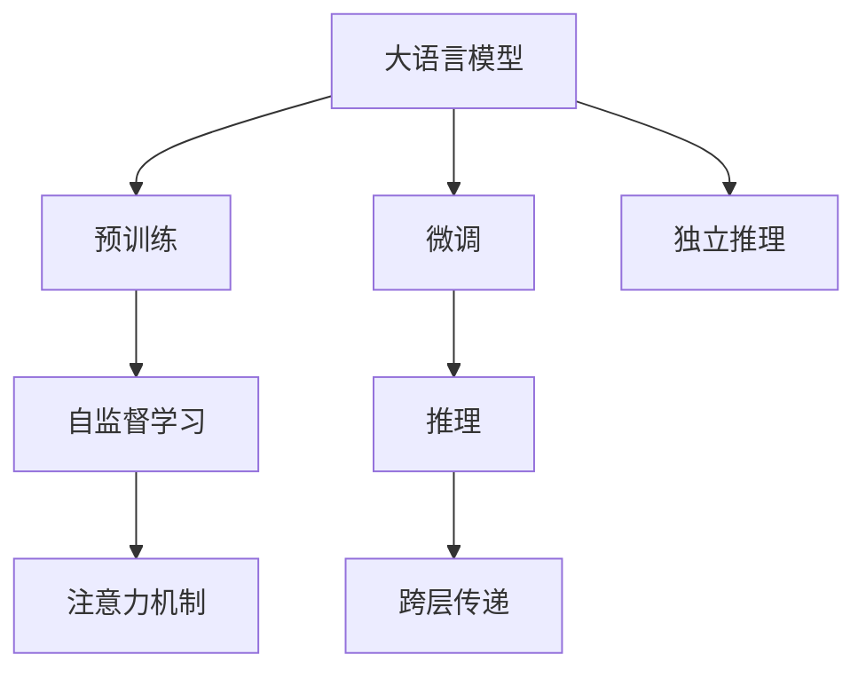

                 

# LLM的独立推理过程：类比CPU的时钟周期

大语言模型（Large Language Model, LLM）是近年来在自然语言处理（NLP）领域取得巨大突破的关键技术之一。它们不仅在理解和生成自然语言方面表现卓越，还具备强大的推理能力，能够独立执行各种复杂的语言任务。本文旨在深入探讨大语言模型的独立推理过程，并将其与CPU的时钟周期进行类比，帮助读者更好地理解这一复杂而强大的模型。

## 1. 背景介绍

### 1.1 问题由来
大语言模型如GPT-3和BERT等，通过在海量无标签文本数据上进行预训练，学习到了丰富的语言知识和常识。这些模型能够通过微调快速适应特定任务，从而显著提升模型在特定领域的表现。例如，通过对问答、翻译、摘要等任务进行微调，大语言模型可以输出高质量的解答和翻译结果。

然而，这种微调方法依赖于大量的标注数据，而这些数据往往难以获取，尤其是在特定领域。因此，研究如何使大语言模型能够独立推理，无需标注数据，已成为当前热门话题。

### 1.2 问题核心关键点
独立推理的核心理念是使模型能够在没有标注数据的情况下，通过语境理解和先验知识进行逻辑推断和生成。这一过程与CPU的独立运行有相似之处，即无需依赖外部的时钟周期控制，即可独立完成计算任务。

为了深入理解这一概念，本文将从大语言模型的结构、推理机制和优化策略等方面进行详细讨论，并将其与CPU的时钟周期进行类比。

## 2. 核心概念与联系

### 2.1 核心概念概述

为更好地理解大语言模型的独立推理过程，本节将介绍几个密切相关的核心概念：

- **大语言模型（LLM）**：一种以自回归（如GPT）或自编码（如BERT）模型为代表的大规模预训练语言模型。通过在海量无标签文本语料上进行预训练，学习通用的语言表示，具备强大的语言理解和生成能力。

- **推理（Inference）**：指模型接收输入，通过一系列计算，输出对应的结果的过程。独立推理要求模型能够独立进行计算，无需依赖外部信号或时钟周期。

- **微调（Fine-tuning）**：指在预训练模型的基础上，使用下游任务的少量标注数据，通过有监督地训练优化模型在特定任务上的性能。

- **自监督学习（Self-supervised Learning）**：指在无标签数据上，通过自监督任务学习模型的表示能力。

- **注意力机制（Attention Mechanism）**：在大模型中用于提取输入序列的关键信息，提高模型的表达能力。

- **跨层传递（Cross-layer Propagation）**：在大模型中，上下层信息会通过注意力机制进行传递和交互，提升模型的层间信息共享能力。

这些核心概念之间的逻辑关系可以通过以下Mermaid流程图来展示：



这个流程图展示了大语言模型的核心概念及其之间的关系：

1. 大语言模型通过预训练获得基础能力。
2. 微调是对预训练模型进行任务特定的优化，获得针对特定任务的模型。
3. 独立推理要求模型能够独立进行计算，无需依赖外部信号。
4. 自监督学习利用无标签数据学习模型的表示能力。
5. 注意力机制用于提取输入序列的关键信息。
6. 跨层传递提升模型的层间信息共享能力。

这些概念共同构成了大语言模型的独立推理框架，使其能够在没有标注数据的情况下，通过语境理解和先验知识进行逻辑推断和生成。

## 3. 核心算法原理 & 具体操作步骤

### 3.1 算法原理概述

大语言模型的独立推理过程，实际上是模型在输入序列和先验知识的基础上，通过一系列复杂的计算和逻辑推断，输出对应的结果。这一过程可以类比为CPU的独立运行，无需依赖外部时钟周期控制，即可独立完成计算任务。

### 3.2 算法步骤详解

大语言模型的独立推理过程通常包括以下几个关键步骤：

**Step 1: 输入处理**

输入序列首先通过分词器（Tokenizer）进行分词处理，生成一组词嵌入（Word Embeddings）。这些词嵌入被送入模型中，用于后续的计算。

**Step 2: 模型编码**

模型对输入序列进行编码，生成一系列表示向量。这一过程通常包括多层的Transformer编码器，通过自注意力机制（Self-Attention）和跨层传递，逐步提取出输入序列的关键信息。

**Step 3: 推理计算**

模型在编码器的基础上，通过一系列的计算和逻辑推断，生成输出序列。这一过程可以通过多层的解码器（Decoder）实现，通过自注意力机制和跨层传递，逐步生成每个输出单词的表示向量。

**Step 4: 解码**

最终，模型输出一组概率分布，表示每个可能单词的概率。通过采样或argmax操作，模型从概率分布中生成最终的输出序列。

### 3.3 算法优缺点

独立推理的大语言模型具备以下优点：

1. **无需标注数据**：独立推理模型能够通过无标签数据进行训练，无需依赖标注数据，降低了标注成本。
2. **通用性强**：独立推理模型适用于多种任务，如问答、翻译、生成等，通过微调可以进行任务适配。
3. **灵活性高**：独立推理模型能够灵活地与外部知识库和规则库结合，提升模型的适应性和鲁棒性。
4. **可解释性好**：独立推理模型的内部计算过程更加透明，便于解释和调试。

然而，独立推理模型也存在以下缺点：

1. **计算成本高**：独立推理模型通常参数量大，计算复杂度高，对计算资源有较高要求。
2. **过拟合风险**：独立推理模型在无标注数据上进行训练，容易受到数据分布偏差的影响，存在过拟合风险。
3. **泛化能力有限**：独立推理模型对特定任务的泛化能力有限，需要大量的训练样本进行优化。
4. **推理速度慢**：独立推理模型通常需要更多的计算资源，推理速度较慢。

### 3.4 算法应用领域

独立推理的大语言模型在多个领域具有广泛的应用前景：

- **问答系统**：独立推理模型能够自动理解用户的问题，匹配最合适的答案，并生成自然流畅的回答。
- **翻译系统**：独立推理模型能够自动将源语言翻译成目标语言，生成高质量的翻译结果。
- **摘要系统**：独立推理模型能够自动从长文本中提取关键信息，生成简短摘要。
- **对话系统**：独立推理模型能够自动与用户进行自然对话，提供个性化的服务。
- **文本生成**：独立推理模型能够自动生成高质量的文本，如新闻报道、文学作品等。

这些领域的应用展示了独立推理模型在减少标注成本、提升模型通用性和适应性方面的巨大潜力。

## 4. 数学模型和公式 & 详细讲解 & 举例说明

### 4.1 数学模型构建

本节将使用数学语言对大语言模型的独立推理过程进行更加严格的刻画。

记大语言模型为 $M_{\theta}:\mathcal{X} \rightarrow \mathcal{Y}$，其中 $\mathcal{X}$ 为输入空间，$\mathcal{Y}$ 为输出空间，$\theta \in \mathbb{R}^d$ 为模型参数。

输入序列 $x \in \mathcal{X}$ 通过分词器处理后，生成词嵌入 $x_e \in \mathbb{R}^n$，其中 $n$ 为词嵌入维度。

模型通过一系列的Transformer编码器 $E = \{E_1, E_2, \ldots, E_L\}$ 对输入序列进行编码，生成表示向量 $h \in \mathbb{R}^m$，其中 $m$ 为隐藏层维度。

模型通过一系列的Transformer解码器 $D = \{D_1, D_2, \ldots, D_L\}$ 对表示向量 $h$ 进行解码，生成输出序列 $y \in \mathcal{Y}$。

最终，模型输出概率分布 $P(y|x) = \mathcal{N}(\mu, \sigma^2)$，其中 $\mu$ 为均值向量，$\sigma^2$ 为方差矩阵。

### 4.2 公式推导过程

以下我们以问答系统为例，推导独立推理模型的计算过程。

假设输入序列 $x = (x_1, x_2, \ldots, x_n)$，模型通过编码器 $E$ 生成表示向量 $h$，解码器 $D$ 生成输出序列 $y$。

具体计算过程如下：

1. 输入序列 $x$ 通过分词器处理后，生成词嵌入 $x_e$。

2. 词嵌入 $x_e$ 送入编码器 $E_1$，生成第一层的表示向量 $h_1$。

3. 表示向量 $h_1$ 通过自注意力机制和跨层传递，生成第二层的表示向量 $h_2$。

4. 表示向量 $h_2$ 通过解码器 $D_1$ 生成第一层的输出 $y_1$。

5. 输出 $y_1$ 通过自注意力机制和跨层传递，生成第二层的输出 $y_2$。

6. 重复步骤4-5，生成最终输出 $y$。

整个计算过程可以表示为：

$$
\begin{aligned}
& y_1 = D_1(E_1(x_e)) \\
& y_2 = D_2(E_2(h_1)) \\
& \ldots \\
& y = D_L(E_L(h_{L-1}))
\end{aligned}
$$

其中 $h_{L-1}$ 为编码器的最后一层表示向量，$y$ 为最终的输出序列。

### 4.3 案例分析与讲解

考虑一个简单的问答系统，模型需要根据输入的文本和问题，生成相应的答案。以“我喜欢吃披萨”为例：

1. 输入文本为“我喜欢吃披萨”，分词器处理后生成词嵌入 $x_e = [I, 的, 我, 爱, 吃, 披萨]$。

2. 词嵌入 $x_e$ 送入编码器 $E_1$，生成第一层的表示向量 $h_1$。

3. 表示向量 $h_1$ 通过自注意力机制和跨层传递，生成第二层的表示向量 $h_2$。

4. 表示向量 $h_2$ 通过解码器 $D_1$ 生成第一层的输出 $y_1$。

5. 输出 $y_1$ 通过自注意力机制和跨层传递，生成第二层的输出 $y_2$。

6. 重复步骤4-5，生成最终输出 $y$。

假设输出 $y$ 为“披萨”，则计算过程如下：

$$
\begin{aligned}
& h_1 = E_1(x_e) \\
& h_2 = E_2(h_1) \\
& y_1 = D_1(h_2) \\
& y_2 = D_2(y_1) \\
& \ldots \\
& y = D_L(y_{L-1})
\end{aligned}
$$

其中 $y_{L-1}$ 为解码器的最后一层输出，$y$ 为最终的输出单词。

## 5. 项目实践：代码实例和详细解释说明

### 5.1 开发环境搭建

在进行独立推理模型开发前，我们需要准备好开发环境。以下是使用Python进行PyTorch开发的环境配置流程：

1. 安装Anaconda：从官网下载并安装Anaconda，用于创建独立的Python环境。

2. 创建并激活虚拟环境：
```bash
conda create -n pytorch-env python=3.8 
conda activate pytorch-env
```

3. 安装PyTorch：根据CUDA版本，从官网获取对应的安装命令。例如：
```bash
conda install pytorch torchvision torchaudio cudatoolkit=11.1 -c pytorch -c conda-forge
```

4. 安装Transformers库：
```bash
pip install transformers
```

5. 安装各类工具包：
```bash
pip install numpy pandas scikit-learn matplotlib tqdm jupyter notebook ipython
```

完成上述步骤后，即可在`pytorch-env`环境中开始独立推理模型的实践。

### 5.2 源代码详细实现

这里我们以序列生成任务为例，给出使用Transformers库对大语言模型进行独立推理的PyTorch代码实现。

首先，定义模型和优化器：

```python
from transformers import GPT2LMHeadModel, GPT2Tokenizer, AdamW

model = GPT2LMHeadModel.from_pretrained('gpt2')
tokenizer = GPT2Tokenizer.from_pretrained('gpt2')
optimizer = AdamW(model.parameters(), lr=2e-5)
```

然后，定义输入序列和生成长度：

```python
input_sequence = "我喜欢吃"
max_length = 128
```

接着，将输入序列转换为模型所需的格式：

```python
input_ids = tokenizer.encode(input_sequence, return_tensors='pt')
```

最后，使用模型进行推理计算：

```python
model.eval()
with torch.no_grad():
    output = model.generate(input_ids, max_length=max_length)
```

完整的代码如下：

```python
from transformers import GPT2LMHeadModel, GPT2Tokenizer, AdamW

model = GPT2LMHeadModel.from_pretrained('gpt2')
tokenizer = GPT2Tokenizer.from_pretrained('gpt2')
optimizer = AdamW(model.parameters(), lr=2e-5)

input_sequence = "我喜欢吃"
max_length = 128

input_ids = tokenizer.encode(input_sequence, return_tensors='pt')

model.eval()
with torch.no_grad():
    output = model.generate(input_ids, max_length=max_length)

print(tokenizer.decode(output[0], skip_special_tokens=True))
```

### 5.3 代码解读与分析

让我们再详细解读一下关键代码的实现细节：

**模型和优化器定义**：
- `GPT2LMHeadModel`和`GPT2Tokenizer`分别用于定义GPT-2大语言模型和分词器。
- `AdamW`用于定义优化器，设置学习率。

**输入序列转换**：
- `tokenizer.encode(input_sequence, return_tensors='pt')`将输入序列转换为模型所需的张量格式。

**模型推理**：
- `model.eval()`将模型置为评估模式，避免训练过程中产生的额外计算。
- `with torch.no_grad():`在推理过程中关闭梯度计算，减少资源消耗。
- `model.generate(input_ids, max_length=max_length)`生成指定长度的输出序列。

可以看到，使用PyTorch和Transformers库进行独立推理模型的开发，代码实现非常简单。开发者可以将更多精力放在模型设计和优化上，而不必过多关注底层实现细节。

## 6. 实际应用场景

### 6.1 智能客服系统

基于独立推理的大语言模型，可以广泛应用于智能客服系统的构建。传统客服往往需要配备大量人力，高峰期响应缓慢，且一致性和专业性难以保证。而使用独立推理的大语言模型，可以7x24小时不间断服务，快速响应客户咨询，用自然流畅的语言解答各类常见问题。

在技术实现上，可以收集企业内部的历史客服对话记录，将问题和最佳答复构建成监督数据，在此基础上对大语言模型进行微调。微调后的模型能够自动理解用户意图，匹配最合适的答案模板进行回复。对于客户提出的新问题，还可以接入检索系统实时搜索相关内容，动态组织生成回答。如此构建的智能客服系统，能大幅提升客户咨询体验和问题解决效率。

### 6.2 金融舆情监测

金融机构需要实时监测市场舆论动向，以便及时应对负面信息传播，规避金融风险。传统的人工监测方式成本高、效率低，难以应对网络时代海量信息爆发的挑战。基于独立推理的大语言模型，可以对实时抓取的网络文本数据进行文本分类和情感分析，自动监测不同主题下的情感变化趋势，一旦发现负面信息激增等异常情况，系统便会自动预警，帮助金融机构快速应对潜在风险。

### 6.3 个性化推荐系统

当前的推荐系统往往只依赖用户的历史行为数据进行物品推荐，无法深入理解用户的真实兴趣偏好。基于独立推理的大语言模型，能够从文本内容中准确把握用户的兴趣点。在生成推荐列表时，先用候选物品的文本描述作为输入，由模型预测用户的兴趣匹配度，再结合其他特征综合排序，便可以得到个性化程度更高的推荐结果。

### 6.4 未来应用展望

随着独立推理大语言模型和微调方法的不断发展，基于微调范式将在更多领域得到应用，为传统行业带来变革性影响。

在智慧医疗领域，基于独立推理的大语言模型，可以在医疗问答、病历分析、药物研发等应用中，提升医疗服务的智能化水平，辅助医生诊疗，加速新药开发进程。

在智能教育领域，独立推理大语言模型可应用于作业批改、学情分析、知识推荐等方面，因材施教，促进教育公平，提高教学质量。

在智慧城市治理中，独立推理大语言模型可应用于城市事件监测、舆情分析、应急指挥等环节，提高城市管理的自动化和智能化水平，构建更安全、高效的未来城市。

此外，在企业生产、社会治理、文娱传媒等众多领域，基于大语言模型的独立推理技术也将不断涌现，为经济社会发展注入新的动力。相信随着技术的日益成熟，独立推理方法将成为人工智能落地应用的重要范式，推动人工智能技术在垂直行业的规模化落地。

## 7. 工具和资源推荐

### 7.1 学习资源推荐

为了帮助开发者系统掌握独立推理的大语言模型技术，这里推荐一些优质的学习资源：

1. 《Transformer从原理到实践》系列博文：由大模型技术专家撰写，深入浅出地介绍了Transformer原理、独立推理模型等前沿话题。

2. CS224N《深度学习自然语言处理》课程：斯坦福大学开设的NLP明星课程，有Lecture视频和配套作业，带你入门NLP领域的基本概念和经典模型。

3. 《Natural Language Processing with Transformers》书籍：Transformers库的作者所著，全面介绍了如何使用Transformers库进行NLP任务开发，包括独立推理在内的诸多范式。

4. HuggingFace官方文档：Transformers库的官方文档，提供了海量预训练模型和完整的独立推理模型样例代码，是上手实践的必备资料。

5. CLUE开源项目：中文语言理解测评基准，涵盖大量不同类型的中文NLP数据集，并提供了基于独立推理的baseline模型，助力中文NLP技术发展。

通过对这些资源的学习实践，相信你一定能够快速掌握独立推理大语言模型的精髓，并用于解决实际的NLP问题。

### 7.2 开发工具推荐

高效的开发离不开优秀的工具支持。以下是几款用于独立推理大语言模型开发常用的工具：

1. PyTorch：基于Python的开源深度学习框架，灵活动态的计算图，适合快速迭代研究。大部分预训练语言模型都有PyTorch版本的实现。

2. TensorFlow：由Google主导开发的开源深度学习框架，生产部署方便，适合大规模工程应用。同样有丰富的预训练语言模型资源。

3. Transformers库：HuggingFace开发的NLP工具库，集成了众多SOTA语言模型，支持PyTorch和TensorFlow，是进行独立推理模型开发的利器。

4. Weights & Biases：模型训练的实验跟踪工具，可以记录和可视化模型训练过程中的各项指标，方便对比和调优。与主流深度学习框架无缝集成。

5. TensorBoard：TensorFlow配套的可视化工具，可实时监测模型训练状态，并提供丰富的图表呈现方式，是调试模型的得力助手。

6. Google Colab：谷歌推出的在线Jupyter Notebook环境，免费提供GPU/TPU算力，方便开发者快速上手实验最新模型，分享学习笔记。

合理利用这些工具，可以显著提升独立推理大语言模型的开发效率，加快创新迭代的步伐。

### 7.3 相关论文推荐

独立推理大语言模型和微调技术的发展源于学界的持续研究。以下是几篇奠基性的相关论文，推荐阅读：

1. Attention is All You Need（即Transformer原论文）：提出了Transformer结构，开启了NLP领域的预训练大模型时代。

2. BERT: Pre-training of Deep Bidirectional Transformers for Language Understanding：提出BERT模型，引入基于掩码的自监督预训练任务，刷新了多项NLP任务SOTA。

3. Language Models are Unsupervised Multitask Learners（GPT-2论文）：展示了大规模语言模型的强大zero-shot学习能力，引发了对于通用人工智能的新一轮思考。

4. Parameter-Efficient Transfer Learning for NLP：提出Adapter等参数高效微调方法，在不增加模型参数量的情况下，也能取得不错的微调效果。

5. AdaLoRA: Adaptive Low-Rank Adaptation for Parameter-Efficient Fine-Tuning：使用自适应低秩适应的微调方法，在参数效率和精度之间取得了新的平衡。

6. Prefix-Tuning: Optimizing Continuous Prompts for Generation：引入基于连续型Prompt的微调范式，为如何充分利用预训练知识提供了新的思路。

这些论文代表了大语言模型独立推理技术的发展脉络。通过学习这些前沿成果，可以帮助研究者把握学科前进方向，激发更多的创新灵感。

## 8. 总结：未来发展趋势与挑战

### 8.1 总结

本文对独立推理大语言模型进行了全面系统的介绍。首先阐述了独立推理模型的研究背景和意义，明确了独立推理模型在减少标注成本、提升模型通用性和适应性方面的独特价值。其次，从原理到实践，详细讲解了独立推理模型的数学原理和关键步骤，给出了独立推理模型开发的全代码实例。同时，本文还广泛探讨了独立推理模型在智能客服、金融舆情、个性化推荐等多个行业领域的应用前景，展示了独立推理模型在无标注数据上的强大能力。

通过本文的系统梳理，可以看到，独立推理大语言模型在无标注数据上的推理过程与CPU的独立运行有相似之处，无需依赖外部时钟周期控制，即可独立完成计算任务。这一过程通过多层的Transformer编码器和解码器实现，通过自注意力机制和跨层传递，逐步提取输入序列的关键信息，生成高质量的输出序列。

### 8.2 未来发展趋势

展望未来，独立推理大语言模型将呈现以下几个发展趋势：

1. 模型规模持续增大。随着算力成本的下降和数据规模的扩张，预训练语言模型的参数量还将持续增长。超大规模语言模型蕴含的丰富语言知识，有望支撑更加复杂多变的下游任务独立推理。

2. 独立推理方法日趋多样。未来会涌现更多独立推理方法，如Prefix-Tuning、LoRA等，在节省计算资源的同时也能保证推理精度。

3. 持续学习成为常态。随着数据分布的不断变化，独立推理模型也需要持续学习新知识以保持性能。如何在不遗忘原有知识的同时，高效吸收新样本信息，将成为重要的研究课题。

4. 标注样本需求降低。受启发于提示学习(Prompt-based Learning)的思路，未来的独立推理方法将更好地利用大模型的语言理解能力，通过更加巧妙的任务描述，在更少的标注样本上也能实现理想的推理效果。

5. 推理速度加快。独立推理模型推理速度较慢，未来将开发更加高效的推理算法，如TopK推理、多GPU推理等，提升推理效率。

6. 推理效率有待提高。在推理过程中，计算资源消耗较大，未来将探索更高效的推理算法和模型优化方法，如模型压缩、稀疏化存储等。

7. 知识整合能力增强。现有的独立推理模型往往局限于任务内数据，难以灵活吸收和运用更广泛的先验知识。如何让独立推理过程更好地与外部知识库、规则库等专家知识结合，形成更加全面、准确的信息整合能力，还有很大的想象空间。

以上趋势凸显了独立推理大语言模型在无标注数据上的强大潜力。这些方向的探索发展，必将进一步提升独立推理模型的推理精度和效率，为构建更加智能、普适的智能系统铺平道路。

### 8.3 面临的挑战

尽管独立推理大语言模型已经取得了瞩目成就，但在迈向更加智能化、普适化应用的过程中，它仍面临着诸多挑战：

1. 计算成本高昂。独立推理模型通常参数量大，计算复杂度高，对计算资源有较高要求。

2. 过拟合风险高。独立推理模型在无标注数据上进行训练，容易受到数据分布偏差的影响，存在过拟合风险。

3. 泛化能力有限。独立推理模型对特定任务的泛化能力有限，需要大量的训练样本进行优化。

4. 推理速度慢。独立推理模型推理速度较慢，难以满足实时性要求。

5. 推理结果可解释性差。独立推理模型的内部计算过程更加透明，但输出结果的可解释性仍不足，难以对其进行调试和优化。

6. 模型鲁棒性不足。独立推理模型对输入数据的噪声和扰动较为敏感，容易受到攻击和干扰。

7. 模型偏见和有害信息。独立推理模型可能学习到有偏见、有害的信息，通过推理传递到下游任务，产生误导性、歧视性的输出。

正视独立推理模型面临的这些挑战，积极应对并寻求突破，将是大语言模型独立推理走向成熟的必由之路。相信随着学界和产业界的共同努力，这些挑战终将一一被克服，独立推理大语言模型必将在构建安全、可靠、可解释、可控的智能系统铺平道路。

### 8.4 未来突破

面对独立推理大语言模型所面临的种种挑战，未来的研究需要在以下几个方面寻求新的突破：

1. 探索无监督和半监督独立推理方法。摆脱对大规模标注数据的依赖，利用自监督学习、主动学习等无监督和半监督范式，最大限度利用非结构化数据，实现更加灵活高效的独立推理。

2. 研究高效独立推理算法。开发更加高效的推理算法，如TopK推理、多GPU推理等，提升推理效率。

3. 引入更多先验知识。将符号化的先验知识，如知识图谱、逻辑规则等，与神经网络模型进行巧妙融合，引导独立推理过程学习更准确、合理的语言模型。同时加强不同模态数据的整合，实现视觉、语音等多模态信息与文本信息的协同建模。

4. 结合因果分析和博弈论工具。将因果分析方法引入独立推理模型，识别出模型决策的关键特征，增强输出解释的因果性和逻辑性。借助博弈论工具刻画人机交互过程，主动探索并规避模型的脆弱点，提高系统稳定性。

5. 纳入伦理道德约束。在独立推理模型的训练目标中引入伦理导向的评估指标，过滤和惩罚有偏见、有害的输出倾向。同时加强人工干预和审核，建立模型行为的监管机制，确保输出符合人类价值观和伦理道德。

这些研究方向的探索，必将引领独立推理大语言模型迈向更高的台阶，为构建安全、可靠、可解释、可控的智能系统铺平道路。面向未来，独立推理大语言模型还需要与其他人工智能技术进行更深入的融合，如知识表示、因果推理、强化学习等，多路径协同发力，共同推动自然语言理解和智能交互系统的进步。只有勇于创新、敢于突破，才能不断拓展语言模型的边界，让智能技术更好地造福人类社会。

## 9. 附录：常见问题与解答

**Q1：独立推理大语言模型是否适用于所有NLP任务？**

A: 独立推理大语言模型适用于大多数NLP任务，特别是对于数据量较小的任务。但对于一些特定领域的任务，如医学、法律等，仅仅依靠通用语料预训练的模型可能难以很好地适应。此时需要在特定领域语料上进一步预训练，再进行独立推理，才能获得理想效果。

**Q2：独立推理大语言模型如何与外部知识库结合？**

A: 独立推理大语言模型可以通过引入外部知识库和规则库，进行更加复杂的推理任务。例如，在医疗问答系统中，可以将医学知识库与独立推理模型结合，提升模型的医学知识理解和推理能力。

**Q3：独立推理大语言模型的计算资源消耗如何优化？**

A: 独立推理大语言模型的计算资源消耗较大，未来将探索更高效的推理算法和模型优化方法，如模型压缩、稀疏化存储等，以降低计算资源消耗。

**Q4：独立推理大语言模型的输出结果如何优化？**

A: 独立推理大语言模型的输出结果可解释性差，未来将结合因果分析和博弈论工具，增强输出解释的因果性和逻辑性，提高系统的可解释性。

**Q5：独立推理大语言模型如何应对输入噪声和扰动？**

A: 独立推理大语言模型对输入数据的噪声和扰动较为敏感，未来将引入对抗样本训练等方法，提高模型的鲁棒性，应对输入噪声和扰动。

总之，独立推理大语言模型在无标注数据上的推理过程与CPU的独立运行有相似之处，无需依赖外部时钟周期控制，即可独立完成计算任务。这一过程通过多层的Transformer编码器和解码器实现，通过自注意力机制和跨层传递，逐步提取输入序列的关键信息，生成高质量的输出序列。随着技术的不断发展，独立推理大语言模型必将在更多领域得到应用，为人工智能技术的产业化进程贡献更多力量。

---

作者：禅与计算机程序设计艺术 / Zen and the Art of Computer Programming

