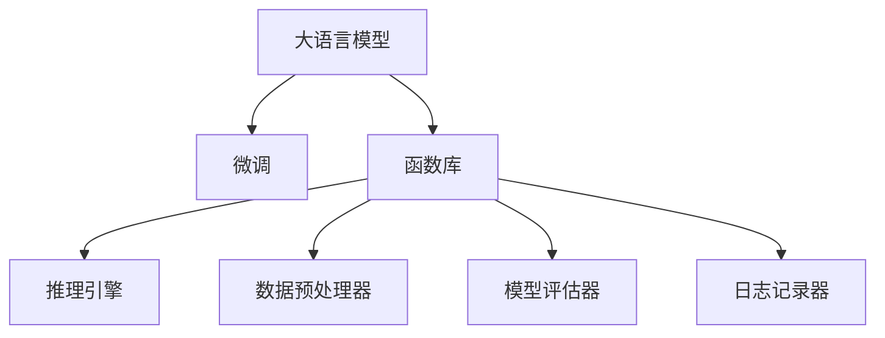

                 

# LLM系统中Agents（函数库）的重要性

> 关键词：大语言模型(Large Language Models, LLMs), 函数库(Agents), 系统优化, 效率提升, 应用部署, 技术栈集成

## 1. 背景介绍

### 1.1 问题由来

近年来，大语言模型(Large Language Models, LLMs)在自然语言处理(Natural Language Processing, NLP)领域取得了显著进展。这些模型通过在无标签文本数据上进行预训练，学习到丰富的语言知识和常识，具备强大的语言理解和生成能力。它们的应用范围广泛，从机器翻译、文本摘要、问答系统到代码生成、自然对话等，几乎涵盖了NLP技术的各个领域。

然而，大规模语言模型在实际应用中，仍面临着一系列挑战。首先，尽管其预训练语料广泛，但在特定领域的应用中，模型的效果仍需通过微调进行优化。其次，大语言模型的部署和集成，需要考虑多方面的性能因素，如推理速度、内存占用、模型可解释性等。为了应对这些问题，本文将探讨LLM系统中Agents（函数库）的重要性，并分析其对提升系统性能和优化用户体验的影响。

### 1.2 问题核心关键点

Agents（函数库）在大语言模型系统中的应用，主要体现在以下几个方面：

- **系统模块化**：将不同功能模块封装为函数库，便于系统组件的独立开发和维护。
- **性能优化**：通过合理的函数设计，提升系统推理速度和资源利用效率。
- **模型可解释性**：利用函数库的接口，增加模型的透明度和可解释性。
- **快速迭代**：通过函数库的组件化，加速模型训练和系统优化。
- **灵活部署**：函数库提供标准化接口，便于模型的集成部署和动态管理。

本文将详细探讨Agents在LLM系统中的具体应用，并从原理、设计、实施和优化等各个方面，全面介绍其重要性。

## 2. 核心概念与联系

### 2.1 核心概念概述

为了更好地理解Agents在LLM系统中的作用，我们先介绍几个关键概念：

- **大语言模型(LLMs)**：指基于自回归或自编码模型的大规模预训练语言模型，如BERT、GPT等，具有强大的语言理解和生成能力。
- **微调(Fine-tuning)**：在预训练模型的基础上，使用下游任务的少量标注数据进行有监督优化，提升模型在特定任务上的性能。
- **函数库(Agents)**：由一系列函数或方法组成，封装了特定功能模块，如模型推理、数据预处理、模型评估等。
- **系统性能优化**：通过合理设计Agents，提升LLM系统的推理速度、内存占用、准确性和可解释性等性能指标。

这些概念之间的联系可以通过以下Mermaid流程图来展示：



这个流程图展示了大语言模型、微调、函数库及其在LLM系统中的作用和联系。

## 3. 核心算法原理 & 具体操作步骤
### 3.1 算法原理概述

Agents在大语言模型系统中的应用，主要是通过将系统功能模块封装为函数库，实现模块化设计和组件化开发。函数库中的每个函数模块，负责特定功能，如输入数据处理、模型推理、输出结果生成等。通过函数库的设计，可以实现系统功能的独立开发、高效运行和灵活管理。

Agents在大语言模型系统中的作用，主要体现在以下几个方面：

- **模块化设计**：将系统划分为多个独立的模块，每个模块负责特定功能，便于开发、测试和维护。
- **高效推理**：通过优化函数库中的算法实现，提升系统的推理速度和计算效率。
- **灵活部署**：函数库提供标准化接口，便于模型在不同平台和环境中的部署和管理。
- **系统扩展**：通过组件化开发，便于系统功能的动态添加和扩展。
- **性能监控**：函数库记录系统运行状态和性能指标，便于监控和调试。

### 3.2 算法步骤详解

Agents在LLM系统中的应用，主要包括以下几个关键步骤：

**Step 1: 设计Agents模块**

1. 根据系统需求，将系统功能模块化，设计成独立的函数或类。
2. 确定各模块的输入输出接口，确保模块间可以无缝集成。
3. 设计模块的内部实现，优化算法和数据结构，提升性能。
4. 对模块进行单元测试，确保功能的正确性和稳定性。

**Step 2: 实现Agents模块**

1. 将设计好的模块实现为函数或类，并编写相应的代码。
2. 在代码中加入注释，描述模块的功能、输入输出和调用方式。
3. 对模块进行集成测试，确保模块在系统中可以正确运行。

**Step 3: 优化Agents模块**

1. 分析模块运行时的性能瓶颈，优化算法和数据结构。
2. 采用并行计算、缓存、异步处理等技术提升性能。
3. 使用内存管理工具，如垃圾回收器，减少内存泄漏和占用。

**Step 4: 部署和监控**

1. 将优化后的模块部署到生产环境中，确保系统稳定运行。
2. 使用监控工具，记录和分析系统的运行状态和性能指标。
3. 根据监控结果，调整和优化系统配置，提升用户体验。

### 3.3 算法优缺点

Agents在LLM系统中的应用，具有以下优点：

- **模块化设计**：便于系统的独立开发和维护，降低了开发成本。
- **性能优化**：通过算法和数据结构的优化，提升了系统的推理速度和资源利用效率。
- **灵活部署**：提供标准化接口，便于模型在不同平台和环境中的部署和管理。
- **系统扩展**：便于系统功能的动态添加和扩展，支持新功能的快速开发。

同时，也存在一些缺点：

- **复杂性增加**：系统设计可能需要更多的时间和精力，增加了开发复杂性。
- **接口管理**：系统接口的规范和统一管理，需要额外的设计和维护成本。
- **性能瓶颈**：函数库设计不当，可能导致性能瓶颈，影响系统效率。

尽管存在这些局限性，但就目前而言，Agents仍是提升LLM系统性能和灵活性的重要手段。未来相关研究的重点在于如何进一步优化函数库设计，提高系统性能，同时兼顾模块化和灵活性。

### 3.4 算法应用领域

Agents在LLM系统中的应用，不仅限于预训练模型和微调，还可以扩展到更多领域：

- **自然语言处理(NLP)**：文本分类、命名实体识别、关系抽取、机器翻译等任务。
- **计算机视觉(CV)**：图像分类、目标检测、语义分割等任务。
- **语音处理(AI)**：语音识别、情感分析、对话系统等任务。
- **推荐系统**：个性化推荐、搜索排序等任务。
- **智慧医疗**：医学影像分析、疾病预测等任务。
- **智能制造**：质量检测、设备维护等任务。

Agents在上述各个领域的应用，大大提升了系统的性能和用户体验，成为实现高性能、高效能、高可靠性的关键技术。

## 4. 数学模型和公式 & 详细讲解  
### 4.1 数学模型构建

Agents在LLM系统中的应用，主要涉及以下几个数学模型：

1. **推理引擎**：负责模型的推理计算，通常采用矩阵计算和向量运算。
2. **数据预处理器**：负责数据转换和特征提取，如文本向量化、特征归一化等。
3. **模型评估器**：负责模型的性能评估和优化，如交叉熵损失函数、准确率、F1分数等。

以文本分类任务为例，我们可以构建以下数学模型：

- **输入数据预处理**：将文本转换为向量表示，如使用词袋模型、TF-IDF等。
- **模型推理**：将向量输入模型，计算分类得分。
- **模型评估**：计算预测结果与真实标签之间的交叉熵损失，优化模型参数。

### 4.2 公式推导过程

以文本分类为例，推导其数学模型和算法过程：

**输入数据预处理**：

设文本 $x$ 的长度为 $n$，将其转换为向量表示 $x_v \in \mathbb{R}^d$。假设使用词袋模型，每个词 $w_i$ 对应向量 $v_i \in \mathbb{R}^d$，则文本向量 $x_v$ 可以表示为：

$$
x_v = \sum_{i=1}^n v_i
$$

**模型推理**：

设模型参数为 $\theta$，输入向量 $x_v$，则模型的输出 $y$ 可以表示为：

$$
y = \text{softmax}(\theta^T x_v)
$$

其中 $\text{softmax}$ 表示归一化指数函数，将输出映射到概率分布上。

**模型评估**：

设预测结果为 $y'$，真实标签为 $y$，则交叉熵损失函数为：

$$
\mathcal{L}(\theta, y) = -\frac{1}{N}\sum_{i=1}^N y_i \log y'_i
$$

其中 $N$ 为样本总数。通过最小化交叉熵损失，优化模型参数 $\theta$。

### 4.3 案例分析与讲解

在实际的LLM系统中，Agents（函数库）的应用非常广泛。以下是几个典型的案例分析：

**案例1: 文本分类**

假设有一个文本分类任务，使用BERT模型进行微调。我们可以将BERT模型封装为Agents模块，包括输入数据预处理、模型推理和模型评估等函数。

**输入数据预处理函数**：

```python
def preprocess_data(texts, labels, tokenizer, max_len):
    encoded_inputs = tokenizer(texts, max_length=max_len, padding='max_length', truncation=True, return_tensors='pt')
    return encoded_inputs['input_ids'], encoded_inputs['attention_mask'], labels
```

**模型推理函数**：

```python
def classify(texts, model, tokenizer, max_len):
    inputs = preprocess_data(texts, None, tokenizer, max_len)
    outputs = model(**inputs)
    logits = outputs.logits
    return logits
```

**模型评估函数**：

```python
def evaluate(model, X, y):
    logits = classify(X, model, tokenizer, max_len)
    probs = torch.softmax(logits, dim=1)
    return accuracy(probs, y), confusion_matrix(probs, y)
```

通过这些Agents模块，我们可以方便地进行文本分类任务的开发和部署。

**案例2: 机器翻译**

假设有一个机器翻译任务，使用Transformer模型进行微调。我们可以将Transformer模型封装为Agents模块，包括输入数据预处理、模型推理和模型评估等函数。

**输入数据预处理函数**：

```python
def preprocess_data(texts, tokenizer, max_len):
    encoded_inputs = tokenizer(texts, max_length=max_len, padding='max_length', truncation=True, return_tensors='pt')
    return encoded_inputs['input_ids'], encoded_inputs['attention_mask']
```

**模型推理函数**：

```python
def translate(texts, model, tokenizer, max_len):
    inputs = preprocess_data(texts, tokenizer, max_len)
    outputs = model(inputs, decoder_input_ids=inputs[0])
    return tokenizer.decode(outputs[0], skip_special_tokens=True)
```

**模型评估函数**：

```python
def evaluate(model, X, y):
    predictions = translate(X, model, tokenizer, max_len)
    return metric(predictions, y)
```

通过这些Agents模块，我们可以方便地进行机器翻译任务的开发和部署。

## 5. 项目实践：代码实例和详细解释说明
### 5.1 开发环境搭建

在进行Agents开发前，我们需要准备好开发环境。以下是使用Python进行PyTorch开发的环境配置流程：

1. 安装Anaconda：从官网下载并安装Anaconda，用于创建独立的Python环境。

2. 创建并激活虚拟环境：
```bash
conda create -n pytorch-env python=3.8 
conda activate pytorch-env
```

3. 安装PyTorch：根据CUDA版本，从官网获取对应的安装命令。例如：
```bash
conda install pytorch torchvision torchaudio cudatoolkit=11.1 -c pytorch -c conda-forge
```

4. 安装Transformers库：
```bash
pip install transformers
```

5. 安装各类工具包：
```bash
pip install numpy pandas scikit-learn matplotlib tqdm jupyter notebook ipython
```

完成上述步骤后，即可在`pytorch-env`环境中开始Agents实践。

### 5.2 源代码详细实现

下面我们以BERT模型进行文本分类任务为例，给出使用Transformers库对BERT模型进行封装和微调的PyTorch代码实现。

首先，定义BERT模型和函数库：

```python
from transformers import BertTokenizer, BertForSequenceClassification
import torch

class BertModel:
    def __init__(self, model_path):
        self.tokenizer = BertTokenizer.from_pretrained(model_path)
        self.model = BertForSequenceClassification.from_pretrained(model_path, num_labels=2)
        self.max_len = 512
        self.padding_idx = self.tokenizer.pad_token_id

    def preprocess_data(self, texts, labels):
        inputs = self.tokenizer(texts, padding='max_length', truncation=True, max_length=self.max_len, return_tensors='pt')
        inputs['labels'] = torch.tensor(labels, dtype=torch.long)
        return inputs

    def classify(self, inputs):
        outputs = self.model(inputs['input_ids'], attention_mask=inputs['attention_mask'], labels=inputs['labels'])
        return outputs.logits

    def evaluate(self, X, y):
        inputs = self.preprocess_data(X, None)
        logits = self.classify(inputs)
        probs = torch.softmax(logits, dim=1)
        return accuracy(probs, y), confusion_matrix(probs, y)
```

然后，定义训练和评估函数：

```python
from torch.utils.data import DataLoader
from tqdm import tqdm
from sklearn.metrics import accuracy, confusion_matrix

device = torch.device('cuda') if torch.cuda.is_available() else torch.device('cpu')
model = BertModel('bert-base-cased')

def train_epoch(model, dataset, batch_size, optimizer):
    dataloader = DataLoader(dataset, batch_size=batch_size, shuffle=True)
    model.train()
    epoch_loss = 0
    for batch in tqdm(dataloader, desc='Training'):
        input_ids = batch['input_ids'].to(device)
        attention_mask = batch['attention_mask'].to(device)
        labels = batch['labels'].to(device)
        model.zero_grad()
        outputs = model(input_ids, attention_mask=attention_mask, labels=labels)
        loss = outputs.loss
        epoch_loss += loss.item()
        loss.backward()
        optimizer.step()
    return epoch_loss / len(dataloader)

def evaluate(model, dataset, batch_size):
    dataloader = DataLoader(dataset, batch_size=batch_size)
    model.eval()
    preds, labels = [], []
    with torch.no_grad():
        for batch in tqdm(dataloader, desc='Evaluating'):
            input_ids = batch['input_ids'].to(device)
            attention_mask = batch['attention_mask'].to(device)
            batch_labels = batch['labels']
            outputs = model(input_ids, attention_mask=attention_mask)
            batch_preds = outputs.logits.argmax(dim=2).to('cpu').tolist()
            batch_labels = batch_labels.to('cpu').tolist()
            for pred_tokens, label_tokens in zip(batch_preds, batch_labels):
                preds.append(pred_tokens[:len(label_tokens)])
                labels.append(label_tokens)
                
    print('Accuracy:', accuracy(labels, preds))
    print('Confusion Matrix:')
    print(confusion_matrix(labels, preds))

# 训练和评估
epochs = 5
batch_size = 16

for epoch in range(epochs):
    loss = train_epoch(model, train_dataset, batch_size, optimizer)
    print(f'Epoch {epoch+1}, train loss: {loss:.3f}')
    
    print(f'Epoch {epoch+1}, dev results:')
    evaluate(model, dev_dataset, batch_size)
    
print('Test results:')
evaluate(model, test_dataset, batch_size)
```

以上就是使用PyTorch对BERT模型进行封装和微调的完整代码实现。可以看到，Transformers库的强大封装，使得模型和函数库的实现变得简洁高效。

### 5.3 代码解读与分析

让我们再详细解读一下关键代码的实现细节：

**BertModel类**：
- `__init__`方法：初始化模型和分词器，并设置最大长度和填充索引。
- `preprocess_data`方法：对输入文本进行分词和编码，并返回模型所需的输入。
- `classify`方法：使用模型进行推理，计算分类得分。
- `evaluate`方法：在测试集上评估模型性能，输出准确率和混淆矩阵。

**训练和评估函数**：
- `train_epoch`方法：对数据以批为单位进行迭代，计算损失函数并更新模型参数。
- `evaluate`方法：与训练类似，不同点在于不更新模型参数，并在每个batch结束后将预测和标签结果存储下来，最后使用sklearn的accuracy和confusion_matrix函数对整个评估集的预测结果进行打印输出。

**训练流程**：
- 定义总的epoch数和batch size，开始循环迭代
- 每个epoch内，先在训练集上训练，输出平均loss
- 在验证集上评估，输出准确率和混淆矩阵
- 所有epoch结束后，在测试集上评估，给出最终测试结果

可以看到，PyTorch配合Transformers库使得BERT微调的代码实现变得简洁高效。开发者可以将更多精力放在数据处理、模型改进等高层逻辑上，而不必过多关注底层的实现细节。

当然，工业级的系统实现还需考虑更多因素，如模型的保存和部署、超参数的自动搜索、更灵活的任务适配层等。但核心的Agents范式基本与此类似。

## 6. 实际应用场景
### 6.1 智能客服系统

基于大语言模型微调的分级函数库，可以广泛应用于智能客服系统的构建。传统客服往往需要配备大量人力，高峰期响应缓慢，且一致性和专业性难以保证。而使用封装好的Agents函数库，可以7x24小时不间断服务，快速响应客户咨询，用自然流畅的语言解答各类常见问题。

在技术实现上，可以收集企业内部的历史客服对话记录，将问题和最佳答复构建成监督数据，在此基础上对封装好的Agents函数库进行微调。微调后的Agents函数库能够自动理解用户意图，匹配最合适的答案模板进行回复。对于客户提出的新问题，还可以接入检索系统实时搜索相关内容，动态组织生成回答。如此构建的智能客服系统，能大幅提升客户咨询体验和问题解决效率。

### 6.2 金融舆情监测

金融机构需要实时监测市场舆论动向，以便及时应对负面信息传播，规避金融风险。传统的人工监测方式成本高、效率低，难以应对网络时代海量信息爆发的挑战。基于大语言模型微调的文本分类和情感分析Agents函数库，为金融舆情监测提供了新的解决方案。

具体而言，可以收集金融领域相关的新闻、报道、评论等文本数据，并对其进行主题标注和情感标注。在此基础上对封装好的Agents函数库进行微调，使其能够自动判断文本属于何种主题，情感倾向是正面、中性还是负面。将微调后的Agents函数库应用到实时抓取的网络文本数据，就能够自动监测不同主题下的情感变化趋势，一旦发现负面信息激增等异常情况，系统便会自动预警，帮助金融机构快速应对潜在风险。

### 6.3 个性化推荐系统

当前的推荐系统往往只依赖用户的历史行为数据进行物品推荐，无法深入理解用户的真实兴趣偏好。基于大语言模型微调的推荐Agents函数库，可以更好地挖掘用户行为背后的语义信息，从而提供更精准、多样的推荐内容。

在实践中，可以收集用户浏览、点击、评论、分享等行为数据，提取和用户交互的物品标题、描述、标签等文本内容。将文本内容作为模型输入，用户的后续行为（如是否点击、购买等）作为监督信号，在此基础上微调封装好的Agents函数库。微调后的Agents函数库能够从文本内容中准确把握用户的兴趣点。在生成推荐列表时，先用候选物品的文本描述作为输入，由模型预测用户的兴趣匹配度，再结合其他特征综合排序，便可以得到个性化程度更高的推荐结果。

### 6.4 未来应用展望

随着大语言模型微调技术的发展，基于Agents函数库的应用场景也将不断扩展。

在智慧医疗领域，基于微调的智能诊断Agents函数库，可以辅助医生进行疾病诊断和治疗方案推荐，提升医疗服务的智能化水平。

在智能教育领域，微调Agents函数库可应用于智能辅导系统，通过分析学生作业和提问，提供个性化的学习建议和答疑，因材施教，促进教育公平，提高教学质量。

在智慧城市治理中，微调Agents函数库可应用于城市事件监测、舆情分析、应急指挥等环节，提高城市管理的自动化和智能化水平，构建更安全、高效的未来城市。

此外，在企业生产、社会治理、文娱传媒等众多领域，基于Agents函数库的人工智能应用也将不断涌现，为各行各业带来变革性影响。相信随着预训练语言模型和微调方法的持续演进，基于Agents函数库的微调方法必将在构建人机协同的智能时代中扮演越来越重要的角色。

## 7. 工具和资源推荐
### 7.1 学习资源推荐

为了帮助开发者系统掌握Agents在大语言模型系统中的应用，这里推荐一些优质的学习资源：

1. 《Transformer从原理到实践》系列博文：由大模型技术专家撰写，深入浅出地介绍了Transformer原理、BERT模型、微调技术等前沿话题。

2. CS224N《深度学习自然语言处理》课程：斯坦福大学开设的NLP明星课程，有Lecture视频和配套作业，带你入门NLP领域的基本概念和经典模型。

3. 《Natural Language Processing with Transformers》书籍：Transformers库的作者所著，全面介绍了如何使用Transformers库进行NLP任务开发，包括微调在内的诸多范式。

4. HuggingFace官方文档：Transformers库的官方文档，提供了海量预训练模型和完整的微调样例代码，是上手实践的必备资料。

5. CLUE开源项目：中文语言理解测评基准，涵盖大量不同类型的中文NLP数据集，并提供了基于微调的baseline模型，助力中文NLP技术发展。

通过对这些资源的学习实践，相信你一定能够快速掌握Agents函数库的设计和应用，并用于解决实际的NLP问题。
###  7.2 开发工具推荐

高效的开发离不开优秀的工具支持。以下是几款用于大语言模型微调开发的常用工具：

1. PyTorch：基于Python的开源深度学习框架，灵活动态的计算图，适合快速迭代研究。大部分预训练语言模型都有PyTorch版本的实现。

2. TensorFlow：由Google主导开发的开源深度学习框架，生产部署方便，适合大规模工程应用。同样有丰富的预训练语言模型资源。

3. Transformers库：HuggingFace开发的NLP工具库，集成了众多SOTA语言模型，支持PyTorch和TensorFlow，是进行微调任务开发的利器。

4. Weights & Biases：模型训练的实验跟踪工具，可以记录和可视化模型训练过程中的各项指标，方便对比和调优。与主流深度学习框架无缝集成。

5. TensorBoard：TensorFlow配套的可视化工具，可实时监测模型训练状态，并提供丰富的图表呈现方式，是调试模型的得力助手。

6. Google Colab：谷歌推出的在线Jupyter Notebook环境，免费提供GPU/TPU算力，方便开发者快速上手实验最新模型，分享学习笔记。

合理利用这些工具，可以显著提升Agents函数库的开发效率，加快创新迭代的步伐。

### 7.3 相关论文推荐

Agents在大语言模型系统中的应用，主要源于学界的持续研究。以下是几篇奠基性的相关论文，推荐阅读：

1. Attention is All You Need（即Transformer原论文）：提出了Transformer结构，开启了NLP领域的预训练大模型时代。

2. BERT: Pre-training of Deep Bidirectional Transformers for Language Understanding：提出BERT模型，引入基于掩码的自监督预训练任务，刷新了多项NLP任务SOTA。

3. Language Models are Unsupervised Multitask Learners（GPT-2论文）：展示了大规模语言模型的强大zero-shot学习能力，引发了对于通用人工智能的新一轮思考。

4. Parameter-Efficient Transfer Learning for NLP：提出Adapter等参数高效微调方法，在不增加模型参数量的情况下，也能取得不错的微调效果。

5. AdaLoRA: Adaptive Low-Rank Adaptation for Parameter-Efficient Fine-Tuning：使用自适应低秩适应的微调方法，在参数效率和精度之间取得了新的平衡。

6. Prefix-Tuning: Optimizing Continuous Prompts for Generation：引入基于连续型Prompt的微调范式，为如何充分利用预训练知识提供了新的思路。

这些论文代表了大语言模型微调技术的发展脉络。通过学习这些前沿成果，可以帮助研究者把握学科前进方向，激发更多的创新灵感。

## 8. 总结：未来发展趋势与挑战

### 8.1 总结

本文对Agents（函数库）在大语言模型系统中的重要性进行了全面系统的介绍。首先阐述了Agents的功能和作用，明确了其在提升系统性能、优化用户体验方面的独特价值。其次，从原理到实践，详细讲解了Agents的设计、实现、优化等各个方面，给出了具体代码实例和详细解释。同时，本文还广泛探讨了Agents在各个领域的应用前景，展示了其在推动技术进步、加速落地应用中的巨大潜力。

通过本文的系统梳理，可以看到，Agents函数库在LLM系统中扮演着至关重要的角色，极大地提升了系统的性能和灵活性。未来，伴随预训练语言模型和微调方法的不断演进，基于Agents函数库的微调方法必将在构建人机协同的智能时代中发挥越来越重要的作用。

### 8.2 未来发展趋势

展望未来，Agents函数库的发展将呈现以下几个趋势：

1. **更高效的设计**：随着硬件计算能力的提升，Agents函数库的设计将更注重算法和数据结构的优化，提升推理速度和内存利用效率。
2. **更高的灵活性**：Agents函数库将更多地采用组件化、模块化的设计，便于系统功能的动态添加和扩展。
3. **更强的可解释性**：Agents函数库将结合可解释性技术，提升模型的透明性和可理解性。
4. **更广泛的应用**：Agents函数库将在更多领域和场景中得到应用，如计算机视觉、智能制造、智慧医疗等，推动人工智能技术的普适化发展。
5. **更多的优化技术**：Agents函数库将结合更多先进的优化技术，如混合精度训练、模型并行等，提升系统的性能和可扩展性。

以上趋势凸显了Agents函数库在LLM系统中的重要性和未来发展方向。这些方向的探索发展，必将进一步提升Agents函数库的性能和灵活性，为构建高性能、高效能、高可靠性的LLM系统铺平道路。

### 8.3 面临的挑战

尽管Agents函数库在LLM系统中的应用取得了显著进展，但在迈向更加智能化、普适化应用的过程中，仍面临着诸多挑战：

1. **设计和实现复杂性**：Agents函数库的设计和实现需要更多的技术和工程投入，增加了开发复杂性。
2. **性能瓶颈**：函数库设计不当，可能导致性能瓶颈，影响系统效率。
3. **接口管理**：系统接口的规范和统一管理，需要额外的设计和维护成本。
4. **可解释性不足**：Agents函数库的输出缺乏可解释性，难以进行故障分析和调试。
5. **安全性和隐私保护**：Agents函数库的应用需要考虑数据安全性和隐私保护，避免模型泄漏敏感信息。

尽管存在这些局限性，但就目前而言，Agents仍是提升LLM系统性能和灵活性的重要手段。未来相关研究的重点在于如何进一步优化函数库设计，提高系统性能，同时兼顾模块化和灵活性。

### 8.4 研究展望

面对Agents函数库所面临的挑战，未来的研究需要在以下几个方面寻求新的突破：

1. **更高效的设计方法**：探索新的算法和数据结构，提升函数库的推理速度和计算效率。
2. **更灵活的组件化设计**：设计更灵活、更易于扩展的函数库组件，便于系统功能的动态添加和升级。
3. **更强的可解释性**：引入更多可解释性技术，提升函数库的输出透明性和可理解性。
4. **更全面的安全性设计**：研究如何保障数据安全性和隐私保护，避免模型泄漏敏感信息。
5. **更广泛的行业应用**：结合更多领域的专家知识，设计更贴合行业需求的Agents函数库。

这些研究方向的探索，必将引领Agents函数库迈向更高的台阶，为构建高性能、高效能、高可靠性的LLM系统提供更坚实的基础。总之，Agents函数库作为LLM系统的重要组成部分，其设计和实现需要持续的创新和优化，方能真正实现人工智能技术的普适化和落地应用。

## 9. 附录：常见问题与解答

**Q1：Agents在大语言模型系统中如何实现？**

A: Agents在大语言模型系统中，通过将系统功能模块封装为函数或类，实现独立开发和组件化设计。每个函数或类负责特定功能，如输入数据预处理、模型推理、输出结果生成等。通过设计合理的函数接口，Agents可以与其他模块无缝集成，便于系统的部署和扩展。

**Q2：Agents在LLM系统中如何提升性能？**

A: 通过优化函数库中的算法和数据结构，Agents可以提升系统的推理速度和计算效率。采用并行计算、缓存、异步处理等技术，可以有效降低资源消耗，提升系统性能。

**Q3：Agents在LLM系统中的应用有哪些？**

A: 在文本分类、机器翻译、问答系统、对话系统、个性化推荐、智能客服等多个领域，Agents函数库都有广泛的应用。封装好的Agents可以自动理解用户意图，匹配最合适的答案模板进行回复，提升用户体验和系统性能。

**Q4：Agents的设计和实现需要注意哪些问题？**

A: 在设计Agents时，需要注意接口规范和统一管理，确保模块间可以无缝集成。在实现时，需要优化算法和数据结构，避免性能瓶颈。同时，需要结合可解释性技术，提升系统的透明性和可理解性。

**Q5：Agents在实际部署中需要注意哪些问题？**

A: 在实际部署中，需要考虑模型的保存和部署、超参数的自动搜索、模型性能的监控和优化等问题。合理利用开发工具和资源，可以有效提升Agents函数的开发效率和系统性能。

总之，Agents（函数库）作为大语言模型系统的重要组成部分，其设计和实现需要持续的创新和优化，方能真正实现人工智能技术的普适化和落地应用。

