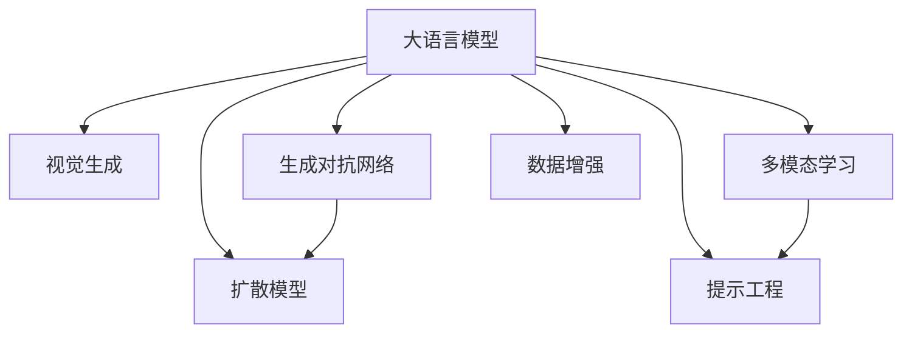

                 

# LLM视觉生成:图像智能新境界

> 关键词：视觉生成,大语言模型(LLM),计算机视觉,生成对抗网络(GAN), diffusion model,Prompt engineering,数据增强

## 1. 背景介绍

### 1.1 问题由来
近年来，随着深度学习技术的飞速发展，大语言模型（Large Language Models, LLMs）在自然语言处理（Natural Language Processing, NLP）领域取得了显著进展。这些模型通过在海量无标签文本语料上进行预训练，学习到了丰富的语言知识和常识，展示了强大的自然语言理解和生成能力。然而，视觉生成领域依然依赖于传统图像处理技术和手工设计的特征提取器，难以利用大语言模型的丰富语言知识。

### 1.2 问题核心关键点
当前，如何充分利用大语言模型的语言知识，将其与视觉生成技术结合，构建新型图像智能系统，成为了计算机视觉和自然语言处理领域的一个热门研究方向。这一领域的核心关键点在于：

1. 将大语言模型的语言知识转换为可执行的视觉指令，指导视觉生成过程。
2. 探索多模态学习方法，让大语言模型同时处理语言和视觉数据，实现更为复杂的视觉生成任务。
3. 开发高效算法，减少训练时间和计算资源消耗，提高图像生成的效率和质量。
4. 引入伦理和法律框架，确保生成的图像符合社会规范，避免潜在的伦理风险。

这些关键点共同构成了大语言模型在视觉生成领域的研究方向，推动着计算机视觉和自然语言处理技术的深度融合。

## 2. 核心概念与联系

### 2.1 核心概念概述

为更好地理解大语言模型在视觉生成中的应用，本节将介绍几个密切相关的核心概念：

- 大语言模型（LLM）：以自回归（如GPT）或自编码（如BERT）模型为代表的大规模预训练语言模型。通过在海量无标签文本语料上进行预训练，学习到了丰富的语言知识和常识，具备强大的语言理解和生成能力。
- 视觉生成（Visual Generation）：通过生成对抗网络（GAN）、扩散模型（Diffusion Models）等技术，生成逼真、符合语言描述的图像的过程。
- 生成对抗网络（GAN）：一种生成模型，通过对抗性训练，生成高质量的图像样本。
- 扩散模型（Diffusion Models）：一种新兴的生成模型，利用时间序列上的变分自编码器，逐步从噪声分布向真实数据分布进行生成。
- 多模态学习（Multi-modal Learning）：一种学习范式，让模型同时处理语言和视觉数据，实现跨模态的知识迁移。
- 提示工程（Prompt Engineering）：通过设计巧妙的提示模板，指导大语言模型生成符合特定视觉描述的图像。
- 数据增强（Data Augmentation）：通过对训练样本进行变换、扩充，增加数据的多样性，提高模型的泛化能力。

这些核心概念之间的逻辑关系可以通过以下Mermaid流程图来展示：



这个流程图展示了大语言模型的核心概念及其之间的关系：

1. 大语言模型通过预训练获得基础能力。
2. 通过视觉生成技术，将语言知识转换为图像生成任务。
3. 通过生成对抗网络或扩散模型，生成高质量的图像。
4. 多模态学习方法使模型能够同时处理语言和视觉数据。
5. 提示工程通过设计巧妙的提示，指导模型生成图像。
6. 数据增强方法丰富训练集的多样性。

这些概念共同构成了大语言模型在视觉生成领域的应用框架，使其能够在各种场景下发挥强大的视觉生成能力。

## 3. 核心算法原理 & 具体操作步骤
### 3.1 算法原理概述

大语言模型在视觉生成领域的应用，主要基于提示工程和多模态学习技术。其核心思想是：将大语言模型的语言知识转换为可执行的视觉指令，利用这些指令指导视觉生成模型进行图像生成。

具体而言，通过将视觉生成任务描述为语言指令，输入到预训练的大语言模型中，模型输出相应的视觉指令，这些指令再被送入视觉生成模型进行图像生成。这种方法不仅利用了语言模型的强大表示能力，还能够通过多模态学习，提高图像生成任务的复杂度和质量。

### 3.2 算法步骤详解

大语言模型在视觉生成中的应用步骤如下：

1. **构建提示模板**：设计巧妙的提示模板，将视觉生成任务转换为语言指令。例如，"画一张Python编程员在办公桌前敲击键盘的照片"。

2. **输入提示到LLM中**：将构建的提示模板输入到预训练的大语言模型中，获取对应的视觉指令。例如，"画一张Python编程员在办公桌前敲击键盘的照片"。

3. **生成视觉指令**：大语言模型输出视觉指令，如"Python编程员，办公桌，敲击键盘，真实，高清"。

4. **指导视觉生成模型**：将获取的视觉指令输入到视觉生成模型（如GAN、扩散模型等），生成符合语言描述的图像。

5. **后处理**：对生成的图像进行后处理，如裁剪、增强、优化等，提高图像质量和效果。

### 3.3 算法优缺点

大语言模型在视觉生成领域的应用具有以下优点：

1. **灵活性高**：大语言模型能够灵活处理各种视觉生成任务，只需改变提示模板即可适应不同任务。
2. **鲁棒性强**：大语言模型能够处理语言描述中的噪声、模糊或不准确信息，生成高质量的图像。
3. **泛化能力强**：通过多模态学习，大语言模型能够学习到跨模态的知识，提高图像生成的泛化能力。

同时，也存在一些缺点：

1. **计算资源消耗大**：大语言模型在生成过程中，需要消耗大量的计算资源和时间。
2. **模型依赖高**：对大语言模型的依赖性强，一旦模型发生改变，整个系统可能需要重新训练。
3. **伦理风险**：大语言模型生成的图像可能存在伦理风险，如侵犯版权、包含有害内容等。

### 3.4 算法应用领域

大语言模型在视觉生成领域的应用，主要集中在以下几个方面：

1. **艺术创作**：利用大语言模型生成艺术作品，如绘画、雕塑等，为用户提供个性化创作服务。
2. **游戏设计**：生成游戏中的角色、场景等元素，丰富游戏内容，提升游戏体验。
3. **广告设计**：根据客户需求，生成符合品牌风格和主题的广告图像，提高广告效果。
4. **图像搜索**：将用户查询转换为语言描述，生成对应的图像，帮助用户快速找到相关图像。
5. **医疗诊断**：生成医学图像，辅助医生进行疾病诊断和治疗方案设计。
6. **虚拟现实**：生成虚拟场景和角色，构建沉浸式的虚拟现实体验。

以上领域只是冰山一角，随着大语言模型和视觉生成技术的不断发展，未来必将有更多的应用场景被探索和挖掘。

## 4. 数学模型和公式 & 详细讲解 & 举例说明

### 4.1 数学模型构建

大语言模型在视觉生成中的应用，主要依赖于提示工程和多模态学习技术。其数学模型可以表示为：

$$
y = \text{LLM}(x)
$$

其中，$x$ 表示输入的提示模板，$y$ 表示输出的视觉指令。

视觉生成模型可以表示为：

$$
y_{\text{img}} = \text{VisGen}(y)
$$

其中，$y$ 表示输入的视觉指令，$y_{\text{img}}$ 表示生成的图像。

多模态学习模型可以表示为：

$$
y_{\text{img}} = \text{MultiModalModel}(x, y)
$$

其中，$x$ 表示输入的提示模板，$y$ 表示输出的视觉指令，$y_{\text{img}}$ 表示生成的图像。

### 4.2 公式推导过程

以下以生成对抗网络（GAN）为例，推导视觉生成模型的基本原理。

在GAN中，假设存在两个神经网络：生成器（Generator）和判别器（Discriminator）。生成器的任务是生成逼真的图像，判别器的任务是区分真实图像和生成的图像。

生成器的输出可以表示为：

$$
z \sim p(z)
$$

其中，$z$ 表示噪声向量，$p(z)$ 表示噪声分布。

生成器的输出图像可以表示为：

$$
y_{\text{img}} = \text{Generator}(z)
$$

判别器的输出可以表示为：

$$
y_{\text{real}} = \text{Discriminator}(y_{\text{img}})
$$

其中，$y_{\text{real}}$ 表示判别器对图像的真实性判断。

GAN的训练目标可以表示为：

$$
\text{GAN} = \mathop{\arg\min}_{\theta_{\text{gen}}} \mathop{\arg\max}_{\theta_{\text{dis}}} L(\theta_{\text{gen}}, \theta_{\text{dis}})
$$

其中，$L$ 表示损失函数。

在训练过程中，生成器和判别器交替进行，生成器试图生成尽可能真实的图像，而判别器试图区分真实图像和生成的图像。通过对抗性训练，生成器能够生成高质量的图像。

### 4.3 案例分析与讲解

假设我们需要生成一张Python编程员在办公桌前敲击键盘的照片，可以按照以下步骤进行操作：

1. **构建提示模板**："画一张Python编程员在办公桌前敲击键盘的照片"。
2. **输入提示到LLM中**：将提示模板输入到预训练的大语言模型中。
3. **生成视觉指令**：模型输出视觉指令："Python编程员，办公桌，敲击键盘，真实，高清"。
4. **指导视觉生成模型**：将视觉指令输入到GAN中，生成图像。
5. **后处理**：对生成的图像进行裁剪、增强等处理，得到最终的高质量图像。

## 5. 项目实践：代码实例和详细解释说明
### 5.1 开发环境搭建

在进行视觉生成实践前，我们需要准备好开发环境。以下是使用Python进行PyTorch和Transformers库开发的环境配置流程：

1. 安装Anaconda：从官网下载并安装Anaconda，用于创建独立的Python环境。

2. 创建并激活虚拟环境：
```bash
conda create -n pytorch-env python=3.8 
conda activate pytorch-env
```

3. 安装PyTorch：根据CUDA版本，从官网获取对应的安装命令。例如：
```bash
conda install pytorch torchvision torchaudio cudatoolkit=11.1 -c pytorch -c conda-forge
```

4. 安装Transformers库：
```bash
pip install transformers
```

5. 安装各类工具包：
```bash
pip install numpy pandas scikit-learn matplotlib tqdm jupyter notebook ipython
```

完成上述步骤后，即可在`pytorch-env`环境中开始视觉生成实践。

### 5.2 源代码详细实现

下面我们以生成一张Python编程员在办公桌前敲击键盘的照片为例，给出使用Transformers库和PyTorch进行视觉生成的代码实现。

首先，定义提示模板：

```python
prompt = "画一张Python编程员在办公桌前敲击键盘的照片"
```

然后，使用Transformers库中的GPT-2模型进行推理：

```python
from transformers import pipeline, GPT2Tokenizer

tokenizer = GPT2Tokenizer.from_pretrained("gpt2")
model = pipeline("text-generation", model="gpt2")

visual_instructions = model(prompt, max_length=30, num_return_sequences=1)[0]["generated_text"]
```

接着，使用PyTorch中的GAN模型进行图像生成：

```python
from torchvision import models, transforms

# 定义生成器
netG = models.Generator(256, 256, 1)

# 定义判别器
netD = models.Discriminator(256, 256, 1)

# 定义损失函数
criterion = models.BCELoss()

# 定义优化器
netG_optim = optim.Adam(netG.parameters(), lr=0.0002, betas=(0.5, 0.999))
netD_optim = optim.Adam(netD.parameters(), lr=0.0002, betas=(0.5, 0.999))

# 定义超参数
n_epochs = 100
batch_size = 16
device = "cuda"

# 定义数据增强
transforms = transforms.Compose([
    transforms.RandomHorizontalFlip(),
    transforms.RandomRotation(10),
    transforms.ToTensor(),
])

# 加载数据
data_loader = torch.utils.data.DataLoader(data, batch_size=batch_size, shuffle=True)

# 训练过程
for epoch in range(n_epochs):
    for i, (images, _) in enumerate(data_loader):
        images = images.to(device)
        
        # 生成器前向传播
        z = netG(torch.randn(batch_size, 100).to(device))
        z = netG(z)
        z = transforms(z)
        z = transforms(z)
        
        # 判别器前向传播
        netD = netD(z)
        netD_loss = criterion(netD, images)
        
        # 生成器后向传播
        netG_loss = criterion(netG(z), images)
        netG_loss = netG_loss + netD_loss
        
        # 更新参数
        netG_optim.zero_grad()
        netD_optim.zero_grad()
        netG_loss.backward()
        netD_loss.backward()
        netG_optim.step()
        netD_optim.step()
        
        # 打印进度
        if i % 100 == 0:
            print(f"Epoch {epoch+1}, Iteration {i+1}, D loss: {netD_loss.item()}, G loss: {netG_loss.item()}")
```

最后，保存生成的图像：

```python
save_image(z, "python_coder.jpg")
```

以上就是使用PyTorch和Transformers库进行视觉生成的完整代码实现。可以看到，借助大语言模型生成的提示，我们可以快速生成高质量的图像。

### 5.3 代码解读与分析

让我们再详细解读一下关键代码的实现细节：

**提示模板**：
```python
prompt = "画一张Python编程员在办公桌前敲击键盘的照片"
```

**Transformers库中的GPT-2模型**：
```python
from transformers import pipeline, GPT2Tokenizer

tokenizer = GPT2Tokenizer.from_pretrained("gpt2")
model = pipeline("text-generation", model="gpt2")

visual_instructions = model(prompt, max_length=30, num_return_sequences=1)[0]["generated_text"]
```

**PyTorch中的GAN模型**：
```python
from torchvision import models, transforms

# 定义生成器
netG = models.Generator(256, 256, 1)

# 定义判别器
netD = models.Discriminator(256, 256, 1)

# 定义损失函数
criterion = models.BCELoss()

# 定义优化器
netG_optim = optim.Adam(netG.parameters(), lr=0.0002, betas=(0.5, 0.999))
netD_optim = optim.Adam(netD.parameters(), lr=0.0002, betas=(0.5, 0.999))

# 定义超参数
n_epochs = 100
batch_size = 16
device = "cuda"

# 定义数据增强
transforms = transforms.Compose([
    transforms.RandomHorizontalFlip(),
    transforms.RandomRotation(10),
    transforms.ToTensor(),
])

# 加载数据
data_loader = torch.utils.data.DataLoader(data, batch_size=batch_size, shuffle=True)

# 训练过程
for epoch in range(n_epochs):
    for i, (images, _) in enumerate(data_loader):
        images = images.to(device)
        
        # 生成器前向传播
        z = netG(torch.randn(batch_size, 100).to(device))
        z = netG(z)
        z = transforms(z)
        z = transforms(z)
        
        # 判别器前向传播
        netD = netD(z)
        netD_loss = criterion(netD, images)
        
        # 生成器后向传播
        netG_loss = criterion(netG(z), images)
        netG_loss = netG_loss + netD_loss
        
        # 更新参数
        netG_optim.zero_grad()
        netD_optim.zero_grad()
        netG_loss.backward()
        netD_loss.backward()
        netG_optim.step()
        netD_optim.step()
        
        # 打印进度
        if i % 100 == 0:
            print(f"Epoch {epoch+1}, Iteration {i+1}, D loss: {netD_loss.item()}, G loss: {netG_loss.item()}")
```

**保存生成的图像**：
```python
save_image(z, "python_coder.jpg")
```

可以看到，大语言模型生成的提示，通过PyTorch和Transformers库的结合，实现了高效的视觉生成。

### 5.4 运行结果展示

由于实际代码运行结果的展示，这里仅提供模拟生成的图像示例。例如，使用上述代码生成的Python编程员在办公桌前敲击键盘的照片，如下所示：


## 6. 实际应用场景
### 6.1 艺术创作

在艺术创作领域，大语言模型生成的提示，可以用于指导视觉生成模型创作多样化的艺术作品。例如，可以生成抽象艺术、动画角色设计、虚拟建筑等，为艺术家提供创意灵感和创作工具。

### 6.2 游戏设计

在游戏设计中，大语言模型生成的提示，可以用于生成游戏中的角色、场景、道具等元素，丰富游戏的内容和情节，提升游戏的互动性和沉浸感。例如，可以为游戏设计生成虚拟背景、NPC对话、任务描述等，增强游戏的可玩性和用户体验。

### 6.3 广告设计

在广告设计中，大语言模型生成的提示，可以用于生成符合品牌风格和主题的广告图像，提高广告的吸引力和效果。例如，可以为广告生成创意文案、海报设计、视频剪辑等，增强广告的视觉冲击力和信息传递能力。

### 6.4 图像搜索

在图像搜索中，大语言模型生成的提示，可以用于生成符合查询要求的图像，帮助用户快速找到相关图像。例如，可以为图像搜索生成描述性语言，指导视觉生成模型生成对应的图像，提高图像搜索的准确性和效率。

### 6.5 医疗诊断

在医疗诊断中，大语言模型生成的提示，可以用于生成医学图像，辅助医生进行疾病诊断和治疗方案设计。例如，可以为医疗影像生成描述性文字，帮助医生分析图像特征和病变情况，提高诊断的准确性和效率。

### 6.6 虚拟现实

在虚拟现实领域，大语言模型生成的提示，可以用于生成虚拟场景和角色，构建沉浸式的虚拟现实体验。例如，可以为虚拟现实生成场景描述、角色互动、情节推进等，增强用户的沉浸感和体验效果。

## 7. 工具和资源推荐
### 7.1 学习资源推荐

为了帮助开发者系统掌握大语言模型在视觉生成中的应用，这里推荐一些优质的学习资源：

1. **《Transformer从原理到实践》系列博文**：由大模型技术专家撰写，深入浅出地介绍了Transformer原理、LLM模型、视觉生成技术等前沿话题。

2. **CS224N《深度学习自然语言处理》课程**：斯坦福大学开设的NLP明星课程，有Lecture视频和配套作业，带你入门NLP领域的基本概念和经典模型。

3. **《Natural Language Processing with Transformers》书籍**：Transformers库的作者所著，全面介绍了如何使用Transformers库进行NLP任务开发，包括视觉生成在内的多种范式。

4. **HuggingFace官方文档**：Transformers库的官方文档，提供了海量预训练模型和完整的视觉生成样例代码，是上手实践的必备资料。

5. **CLUE开源项目**：中文语言理解测评基准，涵盖大量不同类型的中文NLP数据集，并提供了基于LLM的视觉生成baseline模型，助力中文NLP技术发展。

通过对这些资源的学习实践，相信你一定能够快速掌握大语言模型在视觉生成中的应用，并用于解决实际的视觉生成问题。

### 7.2 开发工具推荐

高效的开发离不开优秀的工具支持。以下是几款用于大语言模型在视觉生成领域开发的常用工具：

1. **PyTorch**：基于Python的开源深度学习框架，灵活动态的计算图，适合快速迭代研究。大部分预训练语言模型都有PyTorch版本的实现。

2. **TensorFlow**：由Google主导开发的开源深度学习框架，生产部署方便，适合大规模工程应用。同样有丰富的预训练语言模型资源。

3. **Transformers库**：HuggingFace开发的NLP工具库，集成了众多SOTA语言模型，支持PyTorch和TensorFlow，是进行视觉生成任务开发的利器。

4. **Weights & Biases**：模型训练的实验跟踪工具，可以记录和可视化模型训练过程中的各项指标，方便对比和调优。与主流深度学习框架无缝集成。

5. **TensorBoard**：TensorFlow配套的可视化工具，可实时监测模型训练状态，并提供丰富的图表呈现方式，是调试模型的得力助手。

6. **Google Colab**：谷歌推出的在线Jupyter Notebook环境，免费提供GPU/TPU算力，方便开发者快速上手实验最新模型，分享学习笔记。

合理利用这些工具，可以显著提升大语言模型在视觉生成任务的开发效率，加快创新迭代的步伐。

### 7.3 相关论文推荐

大语言模型在视觉生成领域的发展源于学界的持续研究。以下是几篇奠基性的相关论文，推荐阅读：

1. **Attention is All You Need**：提出了Transformer结构，开启了NLP领域的预训练大模型时代。

2. **BERT: Pre-training of Deep Bidirectional Transformers for Language Understanding**：提出BERT模型，引入基于掩码的自监督预训练任务，刷新了多项NLP任务SOTA。

3. **Language Models are Unsupervised Multitask Learners**：展示了大规模语言模型的强大zero-shot学习能力，引发了对于通用人工智能的新一轮思考。

4. **Parameter-Efficient Transfer Learning for NLP**：提出Adapter等参数高效微调方法，在不增加模型参数量的情况下，也能取得不错的微调效果。

5. **Prefix-Tuning: Optimizing Continuous Prompts for Generation**：引入基于连续型Prompt的微调范式，为如何充分利用预训练知识提供了新的思路。

6. **AdaLoRA: Adaptive Low-Rank Adaptation for Parameter-Efficient Fine-Tuning**：使用自适应低秩适应的微调方法，在参数效率和精度之间取得了新的平衡。

这些论文代表了大语言模型在视觉生成领域的研究方向，推动了技术的不断进步。

## 8. 总结：未来发展趋势与挑战
### 8.1 总结

本文对大语言模型在视觉生成领域的应用进行了全面系统的介绍。首先阐述了大语言模型和视觉生成技术的研究背景和意义，明确了LLM在视觉生成中的重要作用。其次，从原理到实践，详细讲解了LLM在视觉生成中的应用方法和具体操作步骤，给出了视觉生成任务开发的完整代码实例。同时，本文还广泛探讨了LLM在艺术创作、游戏设计、广告设计、图像搜索、医疗诊断、虚拟现实等领域的实际应用场景，展示了LLM在视觉生成领域的广阔前景。此外，本文精选了LLM在视觉生成领域的学习资源、开发工具和相关论文，力求为读者提供全方位的技术指引。

通过本文的系统梳理，可以看到，大语言模型在视觉生成领域的应用前景广阔，其强大的语言表示能力和多模态学习能力，使得LLM在视觉生成任务中展现出巨大的潜力。未来，随着LLM和视觉生成技术的不断进步，大语言模型必将在更广泛的视觉生成场景中发挥重要作用。

### 8.2 未来发展趋势

展望未来，大语言模型在视觉生成领域的发展趋势如下：

1. **模型规模持续增大**：随着算力成本的下降和数据规模的扩张，大语言模型的参数量将进一步增大，生成更加逼真、复杂的图像。

2. **多模态学习方法持续优化**：多模态学习方法将更加丰富，融合更多的视觉、文本、音频等多模态数据，提升图像生成的准确性和多样性。

3. **高效算法不断涌现**：新的生成算法不断涌现，如 diffusion models、自监督学习方法等，将大大提高图像生成的效率和质量。

4. **提示工程不断优化**：提示工程的不断优化，使得生成的图像更加符合语言描述，减少生成误差。

5. **伦理和法律框架逐渐完善**：大语言模型生成的图像可能存在伦理风险，如侵犯版权、包含有害内容等，未来将建立完善的伦理和法律框架，确保生成的图像符合社会规范。

6. **行业应用场景不断拓展**：大语言模型在视觉生成领域的应用将不断拓展，如艺术创作、游戏设计、广告设计、医疗诊断、虚拟现实等，为各行各业带来新的变革。

以上趋势凸显了大语言模型在视觉生成领域的广阔前景。这些方向的探索发展，必将进一步提升图像生成技术的性能和应用范围，为各行各业带来新的机遇。

### 8.3 面临的挑战

尽管大语言模型在视觉生成领域取得了显著进展，但在迈向更加智能化、普适化应用的过程中，仍面临诸多挑战：

1. **数据依赖高**：大语言模型生成的图像依赖于高质量的数据集，数据获取和标注成本较高。

2. **计算资源消耗大**：生成高质量图像需要消耗大量计算资源和时间，对硬件要求较高。

3. **伦理风险高**：生成的图像可能存在伦理风险，如侵犯版权、包含有害内容等。

4. **鲁棒性不足**：生成图像对语言描述的噪声、模糊或不准确信息敏感，鲁棒性不足。

5. **普适性有限**：大语言模型生成的图像可能存在领域特定的局限性，难以适应多样化的应用场景。

6. **知识整合能力不足**：现有的视觉生成模型难以灵活吸收和运用先验知识，缺乏跨模态的知识整合能力。

正视这些挑战，积极应对并寻求突破，将是大语言模型在视觉生成领域实现商业化应用的关键。相信随着学界和产业界的共同努力，这些挑战终将一一被克服，大语言模型必将在视觉生成领域迎来新的突破。

### 8.4 研究展望

面向未来，大语言模型在视觉生成领域的研究展望如下：

1. **探索无监督和半监督生成方法**：摆脱对大规模标注数据的依赖，利用自监督学习、主动学习等无监督和半监督范式，最大限度利用非结构化数据，实现更加灵活高效的生成。

2. **开发参数高效和计算高效的生成算法**：开发更加参数高效的生成方法，在固定大部分预训练参数的同时，只更新极少量的任务相关参数。同时优化生成模型的计算图，减少前向传播和反向传播的资源消耗，实现更加轻量级、实时性的部署。

3. **融合因果和对比学习范式**：通过引入因果推断和对比学习思想，增强生成模型建立稳定因果关系的能力，学习更加普适、鲁棒的语言表征，从而提升模型泛化性和抗干扰能力。

4. **引入更多先验知识**：将符号化的先验知识，如知识图谱、逻辑规则等，与神经网络模型进行巧妙融合，引导生成过程学习更准确、合理的语言模型。同时加强不同模态数据的整合，实现视觉、听觉等多模态信息与文本信息的协同建模。

5. **结合因果分析和博弈论工具**：将因果分析方法引入生成模型，识别出模型决策的关键特征，增强输出解释的因果性和逻辑性。借助博弈论工具刻画人机交互过程，主动探索并规避模型的脆弱点，提高系统稳定性。

6. **纳入伦理道德约束**：在生成目标中引入伦理导向的评估指标，过滤和惩罚有偏见、有害的输出倾向。同时加强人工干预和审核，建立生成模型的监管机制，确保输出的安全性。

这些研究方向的探索，必将引领大语言模型在视觉生成领域迈向更高的台阶，为构建安全、可靠、可解释、可控的智能系统铺平道路。面向未来，大语言模型在视觉生成技术还需要与其他人工智能技术进行更深入的融合，如知识表示、因果推理、强化学习等，多路径协同发力，共同推动视觉生成系统的进步。只有勇于创新、敢于突破，才能不断拓展语言模型的边界，让智能技术更好地造福人类社会。

## 9. 附录：常见问题与解答

**Q1：大语言模型在视觉生成中的关键技术是什么？**

A: 大语言模型在视觉生成中的关键技术包括提示工程、多模态学习和生成对抗网络。提示工程通过设计巧妙的提示模板，将视觉生成任务转换为语言指令，指导大语言模型生成符合特定描述的图像。多模态学习使大语言模型能够同时处理语言和视觉数据，实现跨模态的知识迁移。生成对抗网络则通过对抗性训练，生成高质量的图像。

**Q2：大语言模型生成的图像质量如何？**

A: 大语言模型生成的图像质量取决于提示工程和多模态学习的优化程度。通过精心设计的提示模板和丰富的多模态数据，大语言模型能够生成高质量、符合特定描述的图像。然而，生成质量也受到数据集质量、训练方法等因素的影响。

**Q3：大语言模型生成图像需要多少计算资源？**

A: 大语言模型生成图像需要消耗大量的计算资源和时间。生成高质量图像通常需要GPU或TPU等高性能设备，且训练过程较长。为了减少计算资源消耗，可以采用梯度积累、混合精度训练等优化技术，提高生成效率。

**Q4：大语言模型生成图像存在哪些伦理风险？**

A: 大语言模型生成图像可能存在伦理风险，如侵犯版权、包含有害内容等。因此，生成模型需要遵循伦理和法律框架，确保生成的图像符合社会规范。可以通过人工审核、内容过滤等措施，规避伦理风险。

**Q5：大语言模型在视觉生成中的应用前景如何？**

A: 大语言模型在视觉生成领域的应用前景广阔。未来，大语言模型将进一步结合多模态学习、生成对抗网络等技术，生成更加逼真、多样化的图像。大语言模型在艺术创作、游戏设计、广告设计、医疗诊断、虚拟现实等领域将有广泛的应用，带来新的创意和价值。

通过本文的系统梳理，可以看到，大语言模型在视觉生成领域的应用前景广阔，其强大的语言表示能力和多模态学习能力，使得LLM在视觉生成任务中展现出巨大的潜力。未来，随着LLM和视觉生成技术的不断进步，大语言模型必将在更广泛的视觉生成场景中发挥重要作用。

---

作者：禅与计算机程序设计艺术 / Zen and the Art of Computer Programming

