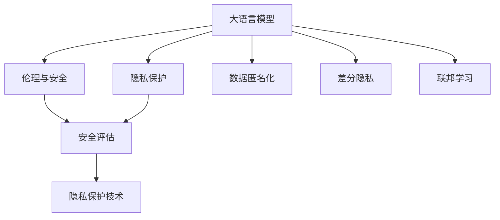

                 

# LLM隐私伦理:AI安全性挑战

> 关键词：大语言模型(Large Language Model, LLM),隐私保护,伦理与安全,安全评估,隐私保护技术,数据匿名化,差分隐私,联邦学习

## 1. 背景介绍

### 1.1 问题由来
随着人工智能技术的快速发展，大语言模型（Large Language Models, LLMs）在自然语言处理（Natural Language Processing, NLP）和各类应用场景中展现出了巨大的潜力。然而，大语言模型也面临着一系列严峻的隐私和伦理挑战。由于这些模型通常基于大规模文本数据进行预训练，因此可能暴露敏感信息，如个人隐私、商业机密、国家安全等，甚至可能被用于恶意用途，如生成虚假信息、网络攻击等。

### 1.2 问题核心关键点
大语言模型的隐私和伦理挑战主要集中在以下几个方面：
1. **数据隐私泄露**：预训练和微调过程中使用的大量文本数据可能包含敏感信息。
2. **模型滥用风险**：模型被用于生成虚假信息、诈骗、攻击等，造成严重的社会影响。
3. **算法透明性与可解释性**：大语言模型的复杂结构和高维度参数，使其决策过程难以解释，缺乏透明度。
4. **公平性与偏见**：模型可能学习并放大训练数据中的偏见，导致性别、种族等不公问题。
5. **责任与法规遵循**：在使用大语言模型时，如何界定模型的责任，以及如何遵守相关的法律法规。

这些关键点对大语言模型的发展提出了严峻挑战，迫切需要采取有效措施来保障模型的隐私和伦理安全。

### 1.3 问题研究意义
研究大语言模型的隐私和伦理安全问题，对于推动人工智能技术的健康发展，确保其安全、公平和透明，具有重要意义：

1. **增强用户信任**：通过采取隐私保护和伦理约束措施，建立用户信任，促进人工智能技术的广泛应用。
2. **提升模型安全性**：防范恶意使用，保护公共安全和国家利益，避免模型被用于不当目的。
3. **保障模型公正性**：避免模型偏见，促进社会公平，防止技术放大社会不公。
4. **合规与法规遵从**：确保模型使用符合法律法规，避免法律风险。
5. **推动技术创新**：通过解决隐私和伦理问题，推动人工智能技术的持续创新和应用拓展。

## 2. 核心概念与联系

### 2.1 核心概念概述

为了更好地理解大语言模型在隐私和伦理方面的挑战，本节将介绍几个核心概念及其相互关系：

- **大语言模型(Large Language Model, LLM)**：指基于大规模文本数据进行预训练的神经网络模型，如GPT-3、BERT等，具备强大的自然语言处理能力。
- **隐私保护(Privacy Protection)**：指采取技术手段和法律措施，保护个人和组织的隐私不受侵害。
- **伦理与安全(Ethics and Security)**：涉及模型决策的公平性、透明性和安全性，确保模型输出不会对社会造成不良影响。
- **安全评估(Security Assessment)**：指对模型进行系统性的安全分析和风险评估，识别潜在的安全漏洞和滥用风险。
- **隐私保护技术(Privacy Preserving Techniques)**：包括数据加密、差分隐私、联邦学习等，用于保护数据隐私和模型安全。
- **数据匿名化(Data Anonymization)**：指将个人身份信息去除或模糊化，以保护数据隐私。
- **差分隐私(Differential Privacy)**：指通过在数据处理过程中加入随机噪声，确保个体数据无法被单独识别。
- **联邦学习(Federated Learning)**：指在多个本地设备上训练模型，然后汇总模型参数，确保数据不出本地，保护数据隐私。

这些核心概念通过Mermaid流程图展现其关系，如以下所示：



该流程图展示了大语言模型与隐私保护、伦理与安全、安全评估、隐私保护技术之间的逻辑联系：

1. 大语言模型通过预训练和微调，获取自然语言处理能力。
2. 隐私保护技术用于保护模型训练和推理过程中的数据隐私。
3. 伦理与安全旨在确保模型的决策过程公平、透明、安全。
4. 安全评估用于系统性地分析模型的安全风险和滥用风险。
5. 差分隐私和数据匿名化等技术，用于在数据处理中保护隐私。
6. 联邦学习等技术，用于在模型训练过程中保护数据隐私。

## 3. 核心算法原理 & 具体操作步骤
### 3.1 算法原理概述

大语言模型在隐私和伦理方面的挑战，主要源于模型训练和推理过程中的数据使用和管理问题。下面将详细介绍这些问题及其解决方法。

### 3.2 算法步骤详解

针对大语言模型的隐私和伦理挑战，常用的隐私保护和伦理约束方法包括：

1. **数据匿名化**：通过删除或模糊化敏感信息，确保数据不包含可识别个人身份的信息。
2. **差分隐私**：在数据处理过程中加入随机噪声，确保个体数据无法被单独识别。
3. **联邦学习**：在多个本地设备上训练模型，确保数据不出本地，保护数据隐私。
4. **隐私保存层**：在模型顶层设计隐私保存层，只处理必要的数据，减少敏感信息暴露的风险。
5. **对抗训练**：通过在训练过程中加入对抗样本，提高模型的鲁棒性和安全性。

以下将详细介绍这些方法的原理和具体操作步骤。

### 3.3 算法优缺点

大语言模型隐私保护和伦理约束方法具有以下优缺点：

**优点**：
1. 保护数据隐私，防止敏感信息泄露。
2. 确保模型决策的透明性和公平性。
3. 防止模型被滥用，提升模型安全性。
4. 提高用户信任，促进人工智能技术的广泛应用。

**缺点**：
1. 数据匿名化和差分隐私可能影响数据质量。
2. 联邦学习可能增加计算复杂度。
3. 隐私保存层可能增加模型复杂度。
4. 对抗训练可能增加训练难度。

尽管存在这些局限性，但这些隐私保护和伦理约束方法在实际应用中已经得到了广泛应用，成为大语言模型设计和部署的重要组成部分。

### 3.4 算法应用领域

大语言模型的隐私保护和伦理约束方法，已经广泛应用于多个领域，包括：

1. **医疗健康**：保护患者隐私，防止医疗数据泄露和滥用。
2. **金融服务**：保护用户隐私，防止金融数据被滥用。
3. **政府安全**：确保政府数据和决策过程的隐私和公平性。
4. **智能客服**：保护用户隐私，防止恶意攻击和滥用。
5. **教育培训**：保护学生隐私，防止数据泄露和滥用。

这些领域的应用，展示了大语言模型隐私保护和伦理约束方法的广泛适用性和重要性。

## 4. 数学模型和公式 & 详细讲解 & 举例说明

### 4.1 数学模型构建

隐私保护和伦理约束问题，通常通过数学模型来描述和分析。以下是几个关键的隐私保护数学模型及其构建方法：

1. **差分隐私模型**：
   差分隐私（Differential Privacy, DP）通过在数据处理过程中加入随机噪声，确保个体数据无法被单独识别。其数学形式为：
   $$
   \mathcal{L}(M_{\theta},\epsilon) = \max_{x} \log \frac{Pr[M_{\theta}(X=x')]+\exp(\epsilon)}{Pr[M_{\theta}(X=x)+1+\exp(\epsilon)}
   $$
   其中 $M_{\theta}$ 为模型参数，$X$ 为输入数据，$\epsilon$ 为隐私保护参数。

2. **数据匿名化模型**：
   数据匿名化（Data Anonymization）通过删除或模糊化敏感信息，确保数据不包含可识别个人身份的信息。常见的数据匿名化方法包括：
   - 去除特定字段
   - 模糊化特定值
   - 数据泛化

3. **联邦学习模型**：
   联邦学习（Federated Learning）通过在多个本地设备上训练模型，确保数据不出本地，保护数据隐私。其数学形式为：
   $$
   \mathcal{L}(\theta) = \frac{1}{N} \sum_{i=1}^N \mathcal{L}_{i}(\theta)
   $$
   其中 $\theta$ 为模型参数，$\mathcal{L}_{i}$ 为第 $i$ 个本地设备上的损失函数。

### 4.2 公式推导过程

以下是差分隐私和数据匿名化公式的推导过程：

**差分隐私推导**：
$$
\mathcal{L}(M_{\theta},\epsilon) = \max_{x} \log \frac{Pr[M_{\theta}(X=x')]+\exp(\epsilon)}{Pr[M_{\theta}(X=x)+1+\exp(\epsilon)}
$$
其中 $M_{\theta}$ 为模型参数，$X$ 为输入数据，$\epsilon$ 为隐私保护参数。该公式的推导基于KL散度（Kullback-Leibler divergence）和拉普拉斯机制（Laplace Mechanism）。

**数据匿名化推导**：
- **去除特定字段**：直接删除敏感字段，不影响模型输出。
- **模糊化特定值**：将敏感值替换为随机值，确保个体无法识别。
- **数据泛化**：将数据范围扩大，使个体无法识别具体值。

### 4.3 案例分析与讲解

以医疗健康领域为例，详细分析差分隐私和数据匿名化在保护患者隐私中的应用：

**差分隐私应用**：
假设医疗数据 $X$ 包含患者的病情信息 $P$ 和病史 $H$，其中 $P$ 为敏感信息。模型 $M_{\theta}$ 用于预测患者的病情发展趋势。差分隐私模型通过在训练过程中加入噪声，确保 $P$ 的信息无法单独识别，从而保护患者隐私。

**数据匿名化应用**：
通过删除或模糊化病史 $H$ 中的敏感信息，如姓名、地址等，确保数据不出本地，保护患者隐私。

## 5. 项目实践：代码实例和详细解释说明

### 5.1 开发环境搭建

在进行隐私保护和伦理约束的实践前，需要准备好开发环境。以下是使用Python进行TensorFlow和PyTorch开发的环境配置流程：

1. 安装Anaconda：从官网下载并安装Anaconda，用于创建独立的Python环境。

2. 创建并激活虚拟环境：
```bash
conda create -n pytorch-env python=3.8 
conda activate pytorch-env
```

3. 安装PyTorch：根据CUDA版本，从官网获取对应的安装命令。例如：
```bash
conda install pytorch torchvision torchaudio cudatoolkit=11.1 -c pytorch -c conda-forge
```

4. 安装TensorFlow：
```bash
pip install tensorflow
```

5. 安装各类工具包：
```bash
pip install numpy pandas scikit-learn matplotlib tqdm jupyter notebook ipython
```

完成上述步骤后，即可在`pytorch-env`环境中开始实践。

### 5.2 源代码详细实现

下面是使用TensorFlow实现差分隐私和联邦学习的代码示例。

**差分隐私**：
```python
import tensorflow as tf

# 设置隐私保护参数
epsilon = 1.0

# 定义差分隐私函数
def differential_privacy(x):
    noise = tf.random.truncated_normal(shape=(tf.shape(x)[0], tf.shape(x)[1]))
    return tf.nn.relu(x + noise) / (tf.exp(epsilon) + 1)

# 构建模型
x = tf.placeholder(tf.float32, shape=[None, 10])
y = differential_privacy(x)

# 训练模型
optimizer = tf.train.GradientDescentOptimizer(learning_rate=0.1)
loss = tf.reduce_mean(tf.square(y - x))
train_op = optimizer.minimize(loss)

# 执行训练
with tf.Session() as sess:
    sess.run(tf.global_variables_initializer())
    for i in range(1000):
        sess.run(train_op, feed_dict={x: ...})
```

**联邦学习**：
```python
import tensorflow as tf

# 定义本地模型
class LocalModel(tf.keras.Model):
    def __init__(self):
        super(LocalModel, self).__init__()
        self.dense1 = tf.keras.layers.Dense(128, activation=tf.nn.relu)
        self.dense2 = tf.keras.layers.Dense(10, activation=tf.nn.softmax)

    def call(self, inputs):
        x = self.dense1(inputs)
        x = self.dense2(x)
        return x

# 定义联邦学习函数
def federated_learning():
    # 创建本地模型
    local_model = LocalModel()
    
    # 定义本地训练过程
    def train(model, x, y):
        with tf.GradientTape() as tape:
            logits = model(x)
            loss = tf.reduce_mean(tf.keras.losses.sparse_categorical_crossentropy(y, logits))
        gradients = tape.gradient(loss, model.trainable_variables)
        optimizer.apply_gradients(zip(gradients, model.trainable_variables))
    
    # 定义全局聚合过程
    def aggregate(model, x, y):
        with tf.GradientTape() as tape:
            logits = model(x)
            loss = tf.reduce_mean(tf.keras.losses.sparse_categorical_crossentropy(y, logits))
        gradients = tape.gradient(loss, model.trainable_variables)
        for i, (grad, param) in enumerate(zip(gradients, model.trainable_variables)):
            param.assign_add(grad / len(trainers))
    
    # 训练模型
    trainers = [local_model]
    for i in range(1000):
        train(trainers[0], ...)

    # 聚合模型
    aggregate(trainers[0], ...)

# 执行训练
with tf.Session() as sess:
    sess.run(tf.global_variables_initializer())
    federated_learning()
```

### 5.3 代码解读与分析

**差分隐私**：
- **设置隐私保护参数**：`epsilon` 为隐私保护参数，通常设置为 1.0 或更高，以确保隐私。
- **定义差分隐私函数**：通过在输入数据上加入噪声，确保个体数据无法被单独识别。
- **构建模型**：使用 TensorFlow 构建简单的线性回归模型。
- **训练模型**：通过梯度下降优化器训练模型，最小化差分隐私损失函数。
- **执行训练**：在训练过程中，加入噪声，确保隐私保护。

**联邦学习**：
- **定义本地模型**：使用 TensorFlow 构建简单的神经网络模型。
- **定义本地训练过程**：在每个本地设备上训练模型，使用梯度下降优化器更新模型参数。
- **定义全局聚合过程**：将本地模型参数聚合，更新全局模型。
- **训练模型**：在多个本地设备上训练模型，并定期聚合模型参数。

## 6. 实际应用场景
### 6.1 医疗健康

大语言模型在医疗健康领域的应用，如疾病诊断、药物研发等，需要严格遵守隐私保护和伦理约束。通过差分隐私和数据匿名化技术，可以有效保护患者隐私，防止医疗数据泄露和滥用。例如，在使用大语言模型进行疾病预测时，可以对患者的症状数据进行差分隐私处理，确保模型训练过程中不会泄露个体数据。

### 6.2 金融服务

金融服务领域对数据隐私和安全有着严格要求。通过联邦学习和差分隐私技术，可以在不暴露数据隐私的情况下，训练高性能的金融模型。例如，在使用大语言模型进行信用评分时，可以在多个本地银行设备上训练模型，然后聚合模型参数，确保数据不出本地，同时加入随机噪声进行隐私保护。

### 6.3 政府安全

政府数据通常包含高度敏感的信息，如国家安全、军事秘密等。通过联邦学习和差分隐私技术，可以在不暴露数据隐私的情况下，训练用于国家安全和军事决策的模型。例如，在使用大语言模型进行情报分析时，可以在多个本地情报设备上训练模型，然后聚合模型参数，确保数据不出本地，同时加入随机噪声进行隐私保护。

### 6.4 未来应用展望

随着大语言模型的进一步发展和隐私保护技术的成熟，未来的隐私保护和伦理约束将具备更强的针对性和实用性。具体展望如下：

1. **隐私保护技术的升级**：未来的隐私保护技术将更加智能化和自动化，通过机器学习和人工智能算法，更好地保护数据隐私。
2. **联邦学习的扩展**：联邦学习将不仅仅局限于本地模型参数的聚合，还将扩展到模型结构的共享，进一步提升模型性能。
3. **差分隐私的应用场景拓展**：差分隐私技术将应用于更多领域，如智能制造、智慧城市等，确保数据隐私和安全。
4. **隐私保护技术的标准化**：隐私保护技术将形成标准化规范和指南，确保不同场景下的隐私保护一致性。

## 7. 工具和资源推荐
### 7.1 学习资源推荐

为了帮助开发者系统掌握大语言模型的隐私和伦理保护技术，这里推荐一些优质的学习资源：

1. **《隐私保护技术》课程**：由知名专家开设的在线课程，系统讲解隐私保护技术和差分隐私的基本原理和实际应用。
2. **《联邦学习理论与实践》书籍**：全面介绍联邦学习的理论和实践，涵盖联邦学习的基本概念、算法和应用场景。
3. **《人工智能伦理与安全》课程**：介绍人工智能技术在伦理和安全性方面的挑战和应对措施，涵盖隐私保护、模型透明性、模型偏见等内容。
4. **《数据匿名化技术》书籍**：详细介绍数据匿名化技术的各种方法和应用场景，涵盖去除字段、模糊化值、数据泛化等。
5. **《深度学习与隐私保护》论文集**：收录了大量关于隐私保护和伦理约束的最新研究成果，涵盖差分隐私、联邦学习、隐私保存层等内容。

通过对这些资源的学习实践，相信你一定能够快速掌握大语言模型隐私保护和伦理约束的精髓，并用于解决实际的隐私和伦理问题。

### 7.2 开发工具推荐

高效的开发离不开优秀的工具支持。以下是几款用于大语言模型隐私保护和伦理约束开发的常用工具：

1. **TensorFlow**：基于Python的开源深度学习框架，生产部署方便，支持联邦学习和差分隐私。
2. **PyTorch**：基于Python的开源深度学习框架，灵活动态的计算图，适合快速迭代研究。
3. **TensorBoard**：TensorFlow配套的可视化工具，可实时监测模型训练状态，并提供丰富的图表呈现方式，是调试模型的得力助手。
4. **Weights & Biases**：模型训练的实验跟踪工具，可以记录和可视化模型训练过程中的各项指标，方便对比和调优。
5. **Jupyter Notebook**：轻量级的Python开发环境，支持多种编程语言，方便快速原型开发和调试。

合理利用这些工具，可以显著提升大语言模型隐私保护和伦理约束任务的开发效率，加快创新迭代的步伐。

### 7.3 相关论文推荐

大语言模型隐私和伦理安全的研究源于学界的持续研究。以下是几篇奠基性的相关论文，推荐阅读：

1. **《差分隐私保护技术》论文**：介绍差分隐私的基本原理和实际应用，涵盖差分隐私的定义、机制和隐私预算等内容。
2. **《联邦学习理论与实践》论文**：全面介绍联邦学习的理论和实践，涵盖联邦学习的基本概念、算法和应用场景。
3. **《隐私保护技术综述》论文**：系统综述隐私保护技术的各种方法和应用场景，涵盖数据匿名化、差分隐私、隐私保存层等内容。
4. **《人工智能伦理与安全》论文**：介绍人工智能技术在伦理和安全性方面的挑战和应对措施，涵盖隐私保护、模型透明性、模型偏见等内容。
5. **《联邦学习与差分隐私的结合》论文**：探讨联邦学习和差分隐私的结合，提出基于联邦学习的差分隐私算法，确保模型训练过程中的隐私保护。

这些论文代表了大语言模型隐私和伦理安全的研究方向，通过学习这些前沿成果，可以帮助研究者把握学科前进方向，激发更多的创新灵感。

## 8. 总结：未来发展趋势与挑战
### 8.1 总结

本文对大语言模型的隐私和伦理安全问题进行了全面系统的介绍。首先阐述了大语言模型在隐私和伦理方面的挑战，明确了隐私保护和伦理约束的重要性和紧迫性。其次，从原理到实践，详细讲解了隐私保护和伦理约束的数学模型和具体操作步骤，给出了隐私保护和伦理约束任务开发的完整代码实例。同时，本文还广泛探讨了隐私和伦理安全在大语言模型中的应用场景，展示了隐私保护和伦理约束方法的广泛适用性和重要性。

通过本文的系统梳理，可以看到，大语言模型在隐私和伦理方面面临诸多挑战，但通过隐私保护和伦理约束技术的不断进步，大语言模型有望在确保数据隐私和安全的前提下，更好地服务于社会。未来，伴随隐私保护技术的不断成熟，大语言模型必将在各个领域得到更广泛的应用，为社会带来更安全、更公平、更透明的人工智能技术。

### 8.2 未来发展趋势

展望未来，大语言模型的隐私保护和伦理约束将呈现以下几个发展趋势：

1. **隐私保护技术的升级**：未来的隐私保护技术将更加智能化和自动化，通过机器学习和人工智能算法，更好地保护数据隐私。
2. **联邦学习的扩展**：联邦学习将不仅仅局限于本地模型参数的聚合，还将扩展到模型结构的共享，进一步提升模型性能。
3. **差分隐私的应用场景拓展**：差分隐私技术将应用于更多领域，如智能制造、智慧城市等，确保数据隐私和安全。
4. **隐私保护技术的标准化**：隐私保护技术将形成标准化规范和指南，确保不同场景下的隐私保护一致性。

以上趋势凸显了大语言模型隐私保护和伦理约束技术的广阔前景。这些方向的探索发展，必将进一步提升大语言模型的安全性，保障数据隐私，促进人工智能技术的健康发展。

### 8.3 面临的挑战

尽管大语言模型的隐私保护和伦理约束技术已经取得了一定的进展，但在迈向更加智能化、普适化应用的过程中，仍面临诸多挑战：

1. **隐私保护与模型性能的平衡**：如何在保证隐私保护的前提下，尽可能提升模型性能，是未来需要重点解决的问题。
2. **隐私保护技术的普适性**：如何设计通用的隐私保护技术，适应不同领域和场景，是未来需要探索的方向。
3. **联邦学习的网络延迟问题**：在联邦学习中，网络延迟和通信开销是影响性能的主要因素，如何优化通信策略，提高联邦学习效率，是未来需要解决的问题。
4. **差分隐私的噪声选择问题**：在差分隐私中，噪声的选择和隐私预算的分配直接影响隐私保护效果，如何优化噪声选择，是未来需要解决的问题。
5. **隐私保护技术的推广普及**：如何降低隐私保护技术的门槛，让更多开发者和用户能够轻松使用，是未来需要解决的问题。

这些挑战需要通过不断的研究和实践，逐步克服，推动大语言模型隐私保护和伦理约束技术的进一步发展。

### 8.4 研究展望

面对大语言模型隐私和伦理安全所面临的挑战，未来的研究需要在以下几个方面寻求新的突破：

1. **隐私保护技术的新算法**：开发更加高效和普适的隐私保护算法，如联邦学习中的差分隐私算法，确保在保证隐私保护的前提下，提升模型性能。
2. **差分隐私的噪声优化**：优化差分隐私中的噪声选择和隐私预算分配，确保隐私保护效果的同时，提升模型性能。
3. **隐私保护技术的自动化**：引入自动化工具和技术，降低隐私保护技术的复杂度和使用门槛，让更多开发者和用户能够轻松使用。
4. **联邦学习的分布式优化**：探索分布式优化算法，提高联邦学习的效率和效果，降低网络延迟和通信开销。
5. **隐私保护技术的融合**：将隐私保护技术与其他人工智能技术进行融合，如知识表示、因果推理、强化学习等，多路径协同发力，共同推动人工智能技术的进步。

这些研究方向的探索，必将引领大语言模型隐私保护和伦理约束技术迈向更高的台阶，为构建安全、可靠、可解释、可控的智能系统铺平道路。面向未来，大语言模型隐私保护和伦理约束技术还需要与其他人工智能技术进行更深入的融合，共同推动人工智能技术的持续创新和应用拓展。

## 9. 附录：常见问题与解答

**Q1：大语言模型在隐私保护和伦理约束方面有哪些常见问题？**

A: 大语言模型在隐私保护和伦理约束方面常见的问题包括：
1. **数据隐私泄露**：预训练和微调过程中使用的大量文本数据可能包含敏感信息。
2. **模型滥用风险**：模型可能被用于生成虚假信息、诈骗、攻击等，造成严重的社会影响。
3. **算法透明性与可解释性**：大语言模型的复杂结构和高维度参数，使其决策过程难以解释，缺乏透明度。
4. **公平性与偏见**：模型可能学习并放大训练数据中的偏见，导致性别、种族等不公问题。
5. **责任与法规遵循**：在使用大语言模型时，如何界定模型的责任，以及如何遵守相关的法律法规。

**Q2：如何保护大语言模型的隐私和伦理安全？**

A: 保护大语言模型的隐私和伦理安全，需要从多个方面入手：
1. **差分隐私**：在数据处理过程中加入随机噪声，确保个体数据无法被单独识别。
2. **数据匿名化**：通过删除或模糊化敏感信息，确保数据不包含可识别个人身份的信息。
3. **联邦学习**：在多个本地设备上训练模型，确保数据不出本地，保护数据隐私。
4. **隐私保存层**：在模型顶层设计隐私保存层，只处理必要的数据，减少敏感信息暴露的风险。
5. **对抗训练**：通过在训练过程中加入对抗样本，提高模型的鲁棒性和安全性。

**Q3：大语言模型在隐私保护和伦理约束方面有哪些应用场景？**

A: 大语言模型在隐私保护和伦理约束方面的应用场景包括：
1. **医疗健康**：保护患者隐私，防止医疗数据泄露和滥用。
2. **金融服务**：保护用户隐私，防止金融数据被滥用。
3. **政府安全**：确保政府数据和决策过程的隐私和公平性。
4. **智能客服**：保护用户隐私，防止恶意攻击和滥用。
5. **教育培训**：保护学生隐私，防止数据泄露和滥用。

**Q4：大语言模型在隐私保护和伦理约束方面有哪些挑战？**

A: 大语言模型在隐私保护和伦理约束方面面临的挑战包括：
1. **隐私保护与模型性能的平衡**：如何在保证隐私保护的前提下，尽可能提升模型性能，是未来需要重点解决的问题。
2. **隐私保护技术的普适性**：如何设计通用的隐私保护技术，适应不同领域和场景，是未来需要探索的方向。
3. **联邦学习的网络延迟问题**：在联邦学习中，网络延迟和通信开销是影响性能的主要因素，如何优化通信策略，提高联邦学习效率，是未来需要解决的问题。
4. **差分隐私的噪声选择问题**：在差分隐私中，噪声的选择和隐私预算的分配直接影响隐私保护效果，如何优化噪声选择，是未来需要解决的问题。
5. **隐私保护技术的推广普及**：如何降低隐私保护技术的复杂度和使用门槛，让更多开发者和用户能够轻松使用，是未来需要解决的问题。

**Q5：如何设计大语言模型的隐私保护和伦理约束机制？**

A: 设计大语言模型的隐私保护和伦理约束机制需要从多个方面入手：
1. **差分隐私**：在数据处理过程中加入随机噪声，确保个体数据无法被单独识别。
2. **数据匿名化**：通过删除或模糊化敏感信息，确保数据不包含可识别个人身份的信息。
3. **联邦学习**：在多个本地设备上训练模型，确保数据不出本地，保护数据隐私。
4. **隐私保存层**：在模型顶层设计隐私保存层，只处理必要的数据，减少敏感信息暴露的风险。
5. **对抗训练**：通过在训练过程中加入对抗样本，提高模型的鲁棒性和安全性。

通过上述设计，可以有效地保护大语言模型的隐私和伦理安全，确保其在各个领域的应用能够满足隐私保护和伦理约束的要求。

---

作者：禅与计算机程序设计艺术 / Zen and the Art of Computer Programming

